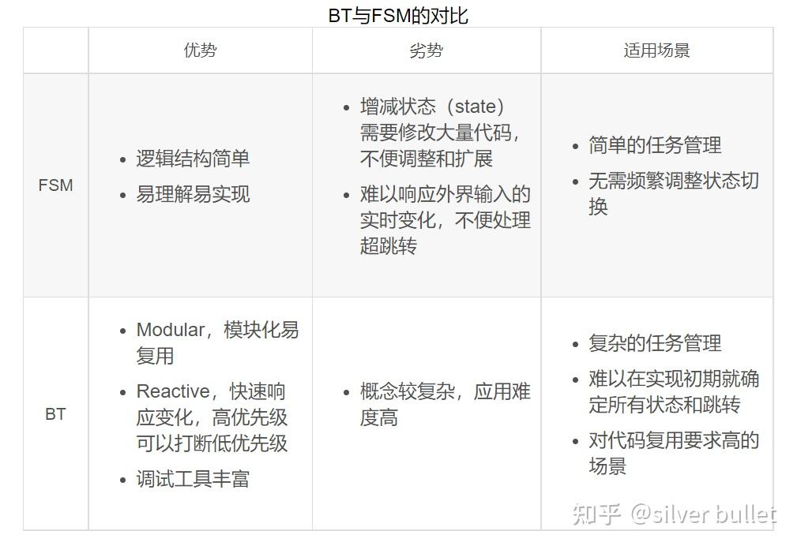

###### datetime:2023/05/11 15:12

###### author:nzb

# BT1：初识行为树

## 行为树是什么？

行为树（`BT，Behavior Tree`）是一种 `tree-structured control architecture`，常用来做任务或状态管理。最先也最多应用于游戏领域，后来引入到机器人、自动驾驶等需要规划决策的领域。

行为树与有限状态机（`FSM，Finite State Machine`）、决策树（`Decision Tree`）等常被对比，他们在绝大多数情况下可以发挥同样的作用，并且可以相互转换。下面我罗列了一些显著的对比，在应用中会更有体会。后面的内容也会展开介绍BT的这些特性。

## 行为树怎么用？

像上面提到的一样，FSM简单易用，绝大多数情况开发者都可以逐行逐字的手撕代码，从头实现一个个性化的状态机，只需定义清楚状态类别、跳转条件、每个状态的执行内容等，典型的就是switch-case。当然，也有很多开源库，可以提供更完善的代码实现，比如TinyFSM等。

对比之下，如果要自行实现行为树的话，工作量就要大一些。有很多优秀的开源实现，这里推荐[BehaviorTree.CPP](https://link.zhihu.com/?target=https%3A//www.behaviortree.dev/)

基于C++14，支持ROS，也是`ROS2-Navigation`使用的库。本系列文章就以`BehaviorTree.CPP`为例，讲解行为树的概念和应用。

## 必读资料

- [A Survey of Behavior Trees in Robotics and AI](https://link.zhihu.com/?target=https%3A//arxiv.org/abs/2005.05842)
- [Behavior trees for AI: How they work](https://link.zhihu.com/?target=http%3A//www.gamasutra.com/blogs/ChrisSimpson/20140717/221339/Behavior_trees_for_AI_How_they_work.php)
- [Behavior Trees in Robotics and AI: An Introduction](https://link.zhihu.com/?target=https%3A//arxiv.org/abs/1709.00084)
- [The Behavior Tree Starter Kit](https://link.zhihu.com/?target=https%3A//www.gameaipro.com/GameAIPro/GameAIPro_Chapter06_The_Behavior_Tree_Starter_Kit.pdf)

