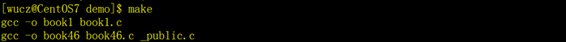
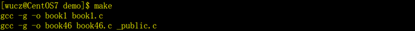

###### datetime:2022/12/19 10:34

###### author:nzb

# make和Makefile

在软件的工程中的源文件是很多的，其按照类型、功能、模块分别放在若干个目录和文件中，哪些文件需要编译，那些文件需要后编译，那些文件需要重新编译，甚至进行更复杂的功能操作，这就有了我们的系统编译的工具。

在linux和unix中，有一个强大的实用程序，叫make，可以用它来管理多模块程序的编译和链接，直至生成可执行文件。

make程序需要一个编译规则说明文件，称为makefile，makefile文件中描述了整个软件工程的编译规则和各个文件之间的依赖关系。

makefile就像是一个shell脚本一样，其中可以执行操作系统的命令，它带来的好处就是我们能够实现“自动化编译”，一旦写好，只要一个make命令，整个软件功能就完全自动编译，提高了软件开发的效率。

make是一个命令工具，是一个解释makefile中指令的命令工具，一般来说大多数编译器都有这个命令，使用make可以是重新编译的次数达到最小化。

## 一、makefile的编写

makefile文件的规则可以非常复杂，比C程序还要复杂，我通过示例来介绍它的简单用法。

文件名：makefile，内容如下：

```text
all:book1 book46
 
book1:book1.c
        gcc -o book1 book1.c
 
book46:book46.c _public.h _public.c
        gcc -o book46 book46.c _public.c
 
clean:
        rm -f book1 book46
```

- 第一行: `all:book book46`
    - `all`: 这是固定的写法。
    - `book1 book46`表示需要编译目标程序的清单，中间用空格分隔开，如果清单很长，可以用`\`换行。

- 第二行: makefile文件中的空行就像C程序中的空行一样，只是为了书写整洁，没有什么意义。

- 第三行: `book1:book1.c`
    - `book1`: 表示需要编译的目标程序。
    - 如果要编译目标程序book1，需要依赖源程序book1.c，当book1.c的内容发生了变化，执行make的时候就会重新编译book1。
- 第四行: `gcc -o book1 book1.c`
    - 这是一个编译命令，和在操作系统命令行输入的命令一样，但是要注意一个问题，在gcc之前要用tab键，看上去像8个空格，实际不是，一定要用tab，空格不行。
- 第六行: `book46:book46.c _public.h _public.c`
    - 与第三行的含义相同。
    - `book46`: 表示编译的目标程序。
    - 如果要编译目标程序book46，需要依赖源程序book46.c、_public.h和_public.c三个文件，只要任何一个的内容发生了变化，执行make的时候就会重新编译book46。

- 第七行: `gcc -o book46 book46.c _public.c`与第四行的含义相同。
- 第九行: `clean` 清除目标文件，清除的命令由第十行之后的脚本来执行。
- 第十行: `rm -f  book1 book46`清除目标文件的脚本命令，注意了，rm之前也是一个tab键，不是空格。

## 二、make命令

makefile准备好了，在命令提示符下执行make就可以编译makefile中all参数指定的目标文件。

执行make编译目标程序：



再执行一次make：


因为全部的目标程序都是最新的，所以提示没有目标可以编译。

执行make clean，执行清除目标文件的指令。


再执行make重新编译。


修改_public.c程序，随便改点什么，只要改了就行。

然后再执行make：


注意了，因为book46依赖的源程序之一_public.c改变了，所以book46重新编译。

book1没有重新编译，因为book1依赖的源文件并没有改变。

## 三、makefile文件中的变量

makefile中，变量就是一个名字，变量的值就是一个文本字符串。在makefile中的目标，依赖，命令或其他地方引用变量时，变量会被它的值替代。

我通过示例来介绍它的简单用法。

- 第一行: `CC=gcc`定义变量CC，赋值gcc。

- 第二行: `FLAG=-g` 定义变量FLAG，赋值-g。

- 第七行: `$(CC)  $(FLAG) -o book1 book1.c`
    - $(CC)和$(FLAG)就是使用变量CC和FLAG的值，类似于C语言的宏定义，替换后的结果是：`gcc -g -o book1 book1.c`编译效果：



在makefile文件中，使用变量的好处有两个

- 1）如果在很多编译指令采用了变量，只要修改变量的值，就相当于修改全部的编译指令；
- 2）把比较长的、公共的编译指令采用变量来表示，可以让makefile更简洁。


