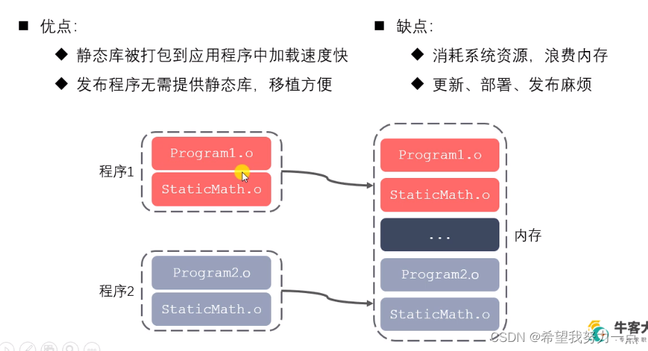
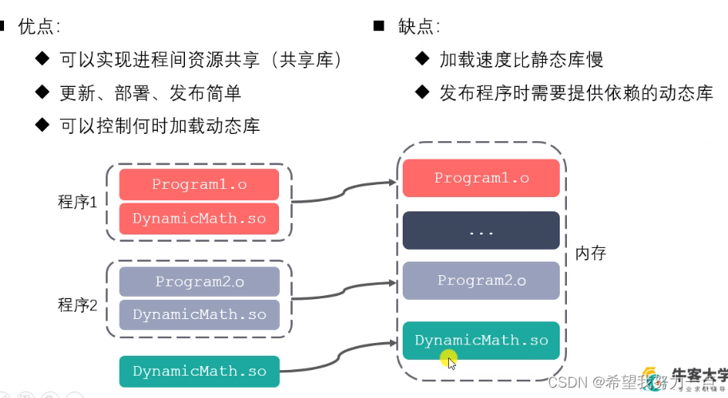
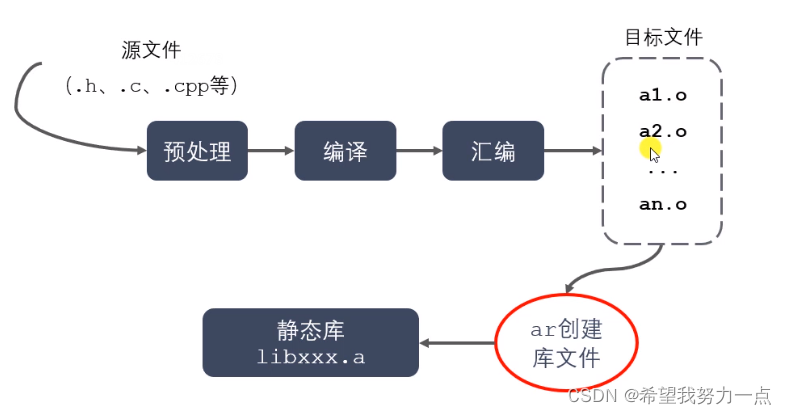
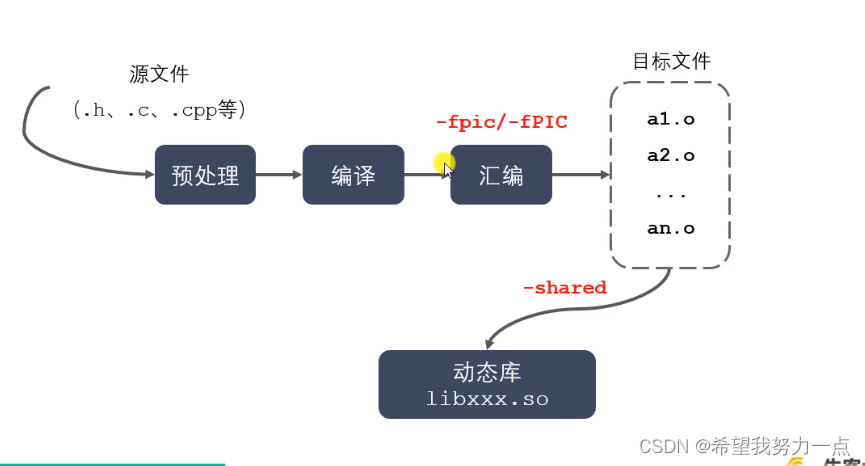
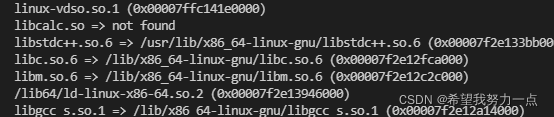

###### datetime:2023/04/17 11:28

###### author:nzb

# 静态库，动态库的制作和使用

## 静态库动态库概念

### 静态库动态库概念

- **静态库**：链接时，静态库代码被打包到可执行程序里

- **动态库**：链接时，动态库代码不会被打包到可执行程序里，只会打包名字等库信息。启动时，动态库会被动态加载到内存中， 通过`ldd(list dynamic dependencied)` 命令可以检查动态库依赖关系。

## 优缺点对比

- 静态库



- 动态库



## 制作静态库及使用

- 制作静态库
    - `gcc -c test.cpp` 生成`.o`目标文件
    - `ar rcs libxxx.a xxx.o xxx.o` 打包文件制作静态库 `libxxx.a`    （`windows libxxx.lib`)  

        

- 使用静态库
    - `g++ main.cpp -o app -ltest -L ./ -I ./`
    - 注意 制作的静态库目录在哪里
    - `-L` 后便要指定静态库目录，否则系统会去默认路径查找
    - `-I ./` 指明`.h`文件目录

## 制作动态库（共享库）及使用

- 制作动态库
  - `gcc -c -fpic/-fPIC test.cpp` 生成 `.o` 目标文件 （是一个和位置无关的代码）
  - `-fpic`  （ pic:position independent code位置无关码）用于编译阶段，产生的代码没有绝对地址，全部用相对地址，满足了共享库的要求，共享库被加载时地址不是固定的。
  - 如果不加`-fpic` ，那么生成的代码就会与位置有关，当进程使用该`.so`文件时都需要重定位，且会产生成该文件的副本，每个副本都不同，不同点取决于该文件代码段与数据段所映射内存的位置。
  - `gcc -shared -o xxx.o xxx.o libxxx.so` 打包文件制作动态库 `libxxx.so`    （`windows libxxx.dll`)

  

- 使用动态库
  - `g++ main.cpp -o app -lcalc -L ./`    编译可执行文件名为 `app`
  - 此时`./app`运行出错  加载失败
  - `ldd app` 列出`app`依赖动态库 ，发现 `libcalc.so not found`

  

- 如何定位动态库文件：用系统动态载入器（`ld-linux.so`，专门用来负责定位、加载程序所需要的所有动态库文件)获取绝对路径。

  - `export LD_LIBRARY_PATH=$LD_LIBRARY_PATH:/home/nowcoder/projects/linuxtest`
将当前目录加进`ld_library_path`。此时`ldd app` 可以找到该动态库。 但是临时有效。

  - 永久有效(用户级)

  ```shell
  cd /home
  vim ~/.bashrc
  // 进入.bashrc 隐藏文件，底端输入
  export LD_LIBRARY_PATH=$LD_LIBRARY_PATH:/home/nowcoder/projects/linuxtest
  source ~/.bashrc 使生效
  
  或
  echo 'export LD_LIBRARY_PATH=$LD_LIBRARY_PATH:/home/nowcoder/projects/linuxtest' >> ~/.bashrc
  source ~/.bashrc
  ```
