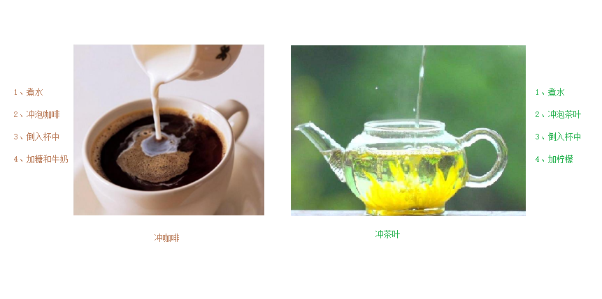

###### datetime:2022/10/19 10:26

###### author:nzb

## 12、 类和对象

C++面向对象的三大特性为：封装、继承、多态

C++认为万事万物都皆为对象，对象上有其属性和行为

例如

人可以作为对象，属性有姓名、年龄、身高、体重...，行为有走、跑、跳、吃饭、唱歌...

车也可以作为对象，属性有轮胎、方向盘、车灯...,行为有载人、放音乐、放空调...

具有相同性质的对象，我们可以抽象称为类，人属于人类，车属于车类

### 12.1 封装

#### 12.1.1 封装的意义

封装是C++面向对象三大特性之一

- 封装的意义：

    * 将属性和行为作为一个整体，表现生活中的事物
    * 将属性和行为加以权限控制

- 语法：`class 类名{ 访问权限： 属性 / 行为 };`

- 封装意义一：在设计类的时候，属性和行为写在一起，表现事物

示例1：设计一个圆类，求圆的周长

```C++
//圆周率
const double PI = 3.14;

//1、封装的意义
//将属性和行为作为一个整体，用来表现生活中的事物

//封装一个圆类，求圆的周长
//class代表设计一个类，后面跟着的是类名
class Circle
{
public:  //访问权限  公共的权限

	//属性
	int m_r;//半径

	//行为
	//获取到圆的周长
	double calculateZC()
	{
		//2 * pi  * r
		//获取圆的周长
		return  2 * PI * m_r;
	}
};

int main() {

	//通过圆类，创建圆的对象
	// c1就是一个具体的圆
	Circle c1;
	c1.m_r = 10; //给圆对象的半径 进行赋值操作

	//2 * pi * 10 = = 62.8
	cout << "圆的周长为： " << c1.calculateZC() << endl;

	system("pause");

	return 0;
}
```

示例2：设计一个学生类，属性有姓名和学号，可以给姓名和学号赋值，可以显示学生的姓名和学号

```C++
//学生类
class Student {
public:
	void setName(string name) {
		m_name = name;
	}
	void setID(int id) {
		m_id = id;
	}

	void showStudent() {
		cout << "name:" << m_name << " ID:" << m_id << endl;
	}
public:
	string m_name;
	int m_id;
};

int main() {

	Student stu;
	stu.setName("德玛西亚");
	stu.setID(250);
	stu.showStudent();

	system("pause");

	return 0;
}

```

- 封装意义二：类在设计时，可以把属性和行为放在不同的权限下，加以控制

- 访问权限有三种：

    - public 公共权限
    - protected 保护权限
    - private 私有权限

示例

```C++
//三种权限
//公共权限  public     类内可以访问  类外可以访问
//保护权限  protected  类内可以访问  类外不可以访问
//私有权限  private    类内可以访问  类外不可以访问

class Person
{
	//姓名  公共权限
public:
	string m_Name;

	//汽车  保护权限
protected:
	string m_Car;

	//银行卡密码  私有权限
private:
	int m_Password;

public:
	void func()
	{
		m_Name = "张三";
		m_Car = "拖拉机";
		m_Password = 123456;
	}
};

int main() {

	Person p;
	p.m_Name = "李四";
	//p.m_Car = "奔驰";  //保护权限类外访问不到
	//p.m_Password = 123; //私有权限类外访问不到

	system("pause");

	return 0;
}
```

#### 12.1.2 struct和class区别

在C++中 struct和class唯一的区别就在于**默认的访问权限不同**

区别：

* struct 默认权限为公共
* class 默认权限为私有

```C++
class C1
{
	int  m_A; //默认是私有权限
};

struct C2
{
	int m_A;  //默认是公共权限
};

int main() {

	C1 c1;
	c1.m_A = 10; //错误，访问权限是私有

	C2 c2;
	c2.m_A = 10; //正确，访问权限是公共

	system("pause");

	return 0;
}
```

#### 12.1.3 成员属性设置为私有

- 优点1：将所有成员属性设置为私有，可以自己控制读写权限

- 优点2：对于写权限，我们可以检测数据的有效性

示例

```C++
class Person {
public:

	//姓名设置可读可写
	void setName(string name) {
		m_Name = name;
	}
	string getName()
	{
		return m_Name;
	}


	//获取年龄 
	int getAge() {
		return m_Age;
	}
	//设置年龄
	void setAge(int age) {
		if (age < 0 || age > 150) {
			cout << "你个老妖精!" << endl;
			return;
		}
		m_Age = age;
	}

	//情人设置为只写
	void setLover(string lover) {
		m_Lover = lover;
	}

private:
	string m_Name; //可读可写  姓名
	
	int m_Age; //只读  年龄

	string m_Lover; //只写  情人
};


int main() {

	Person p;
	//姓名设置
	p.setName("张三");
	cout << "姓名： " << p.getName() << endl;

	//年龄设置
	p.setAge(50);
	cout << "年龄： " << p.getAge() << endl;

	//情人设置
	p.setLover("苍井");
	//cout << "情人： " << p.m_Lover << endl;  //只写属性，不可以读取

	system("pause");

	return 0;
}
```

练习案例1：设计立方体类

设计立方体类(Cube)

求出立方体的面积和体积

分别用全局函数和成员函数判断两个立方体是否相等。


练习案例2：点和圆的关系

设计一个圆形类（Circle），和一个点类（Point），计算点和圆的关系。


### 12.2 对象的初始化和清理

* 生活中我们买的电子产品都基本会有出厂设置，在某一天我们不用时候也会删除一些自己信息数据保证安全
* C++中的面向对象来源于生活，每个对象也都会有初始设置以及 对象销毁前的清理数据的设置。

#### 12.2.1 构造函数和析构函数

对象的**初始化和清理**也是两个非常重要的安全问题

一个对象或者变量没有初始状态，对其使用后果是未知

同样的使用完一个对象或变量，没有及时清理，也会造成一定的安全问题

c++利用了**构造函数**和**析构函数**解决上述问题，这两个函数将会被编译器自动调用，完成对象初始化和清理工作。

对象的初始化和清理工作是编译器强制要我们做的事情，因此如果**我们不提供构造和析构，编译器会提供**

**编译器提供的构造函数和析构函数是空实现。**

* 构造函数：主要作用在于创建对象时为对象的成员属性赋值，构造函数由编译器自动调用，无须手动调用。
* 析构函数：主要作用在于对象**销毁前**系统自动调用，执行一些清理工作。

##### 构造函数语法：`类名(){}`

- 构造函数，没有返回值也不写void
- 函数名称与类名相同
- 构造函数可以有参数，因此可以发生重载
- 程序在调用对象时候会自动调用构造，无须手动调用,而且只会调用一次

##### 析构函数语法：`~类名(){}`

1. 析构函数，没有返回值也不写void
2. 函数名称与类名相同,在名称前加上符号  ~
3. 析构函数不可以有参数，因此不可以发生重载
4. 程序在对象销毁前会自动调用析构，无须手动调用,而且只会调用一次

```C++
class Person
{
public:
	//构造函数
	Person()
	{
		cout << "Person的构造函数调用" << endl;
	}
	//析构函数
	~Person()
	{
		cout << "Person的析构函数调用" << endl;
	}

};

void test01()
{
	Person p;
}

int main() {
	
	test01();

	system("pause");

	return 0;
}
```

#### 12.2.2 构造函数的分类及调用

- 两种分类方式：

    - 按参数分为： 有参构造和无参构造

    - 按类型分为： 普通构造和拷贝构造

- 三种调用方式：

    - 括号法

    - 显示法

    - 隐式转换法

示例

```C++
//1、构造函数分类
// 按照参数分类分为 有参和无参构造   无参又称为默认构造函数
// 按照类型分类分为 普通构造和拷贝构造

class Person {
public:
	//无参（默认）构造函数
	Person() {
		cout << "无参构造函数!" << endl;
	}
	//有参构造函数
	Person(int a) {
		age = a;
		cout << "有参构造函数!" << endl;
	}
	//拷贝构造函数
	Person(const Person &p) {
		age = p.age;
		cout << "拷贝构造函数!" << endl;
	}
	//析构函数
	~Person() {
		cout << "析构函数!" << endl;
	}
public:
	int age;
};

//2、构造函数的调用
//调用无参构造函数
void test01() {
	Person p; //调用无参构造函数
}

//调用有参的构造函数
void test02() {

	//2.1  括号法，常用
	Person p1(10);
	//注意1：调用无参构造函数不能加括号，如果加了编译器认为这是一个函数声明，例子：`void func();`
	//Person p2();

	//2.2 显式法
	Person p2 = Person(10); 
	Person p3 = Person(p2);
	//Person(10)单独写就是匿名对象  当前行结束之后，马上析构，系统会立即回收掉匿名对象

	//2.3 隐式转换法
	Person p4 = 10; // Person p4 = Person(10); 
	Person p5 = p4; // Person p5 = Person(p4); 

	//注意2：不能利用 拷贝构造函数 初始化匿名对象 编译器认为是对象声明，编译器会认为 Person(p3) == Person p3
	//Person(p3);
}

int main() {

	test01();
	//test02();

	system("pause");

	return 0;
}
```

#### 12.2.3 拷贝构造函数调用时机

C++中拷贝构造函数调用时机通常有三种情况

* 使用一个已经创建完毕的对象来初始化一个新对象
* 值传递的方式给函数参数传值
* 以值方式返回局部对象

示例

```C++
class Person {
public:
	Person() {
		cout << "无参构造函数!" << endl;
		mAge = 0;
	}
	Person(int age) {
		cout << "有参构造函数!" << endl;
		mAge = age;
	}
	Person(const Person & p) {
		cout << "拷贝构造函数!" << endl;
		mAge = p.mAge;
	}
	//析构函数在释放内存之前调用
	~Person() {
		cout << "析构函数!" << endl;
	}
public:
	int mAge;
};

//1. 使用一个已经创建完毕的对象来初始化一个新对象
void test01() {

	Person man(100); //p对象已经创建完毕
	Person newman(man); //调用拷贝构造函数
	Person newman2 = man; //拷贝构造

	//Person newman3;
	//newman3 = man; //不是调用拷贝构造函数，赋值操作
}

//2. 值传递的方式给函数参数传值
//相当于Person p1 = p;
void doWork(Person p1) {}  // 实参过来，执行拷贝构造函数
void test02() {
	Person p; //无参构造函数
	doWork(p);  
}

//3. 以值方式返回局部对象
Person doWork2()
{
	Person p1;       // 默认构造函数
	cout << (int *)&p1 << endl;
	return p1;       // 拷贝构造函数返回
}

void test03()
{
	Person p = doWork2();
	cout << (int *)&p << endl;
}


int main() {

	//test01();
	//test02();
	test03();

	system("pause");

	return 0;
}
```

#### 12.2.4 构造函数调用规则

默认情况下，c++编译器至少给一个类添加3个函数

- 1．默认构造函数(无参，函数体为空)

- 2．默认析构函数(无参，函数体为空)

- 3．默认拷贝构造函数，对属性进行值拷贝

构造函数调用规则如下：

* 如果用户定义有参构造函数，c++不在提供默认无参构造，但是会提供默认拷贝构造


* 如果用户定义拷贝构造函数，c++不会再提供其他构造函数

示例：

```C++
class Person {
public:
	//无参（默认）构造函数
	Person() {
		cout << "无参构造函数!" << endl;
	}
	//有参构造函数
	Person(int a) {
		age = a;
		cout << "有参构造函数!" << endl;
	}
	//拷贝构造函数
	Person(const Person & p) {
		age = p.age;
		cout << "拷贝构造函数!" << endl;
	}
	//析构函数
	~Person() {
		cout << "析构函数!" << endl;
	}
public:
	int age;
};

void test01()
{
	Person p1(18);
	//如果不写拷贝构造，编译器会自动添加拷贝构造，并且做浅拷贝操作
	Person p2(p1);

	cout << "p2的年龄为： " << p2.age << endl;
}

void test02()
{
	//如果用户提供有参构造，编译器不会提供默认构造，会提供拷贝构造
	Person p1; //此时如果用户自己没有提供默认构造，会出错
	Person p2(10); //用户提供的有参
	Person p3(p2); //此时如果用户没有提供拷贝构造，编译器会提供

	//如果用户提供拷贝构造，编译器不会提供其他构造函数
	Person p4; //此时如果用户自己没有提供默认构造，会出错
	Person p5(10); //此时如果用户自己没有提供有参，会出错
	Person p6(p5); //用户自己提供拷贝构造
}

int main() {

	test01();

	system("pause");

	return 0;
}
```

#### 4.2.5 深拷贝与浅拷贝

深浅拷贝是面试经典问题，也是常见的一个坑

浅拷贝：简单的赋值拷贝操作

深拷贝：在堆区重新申请空间，进行拷贝操作

**示例：**

```C++
class Person {
public:
	//无参（默认）构造函数
	Person() {
		cout << "无参构造函数!" << endl;
	}
	//有参构造函数
	Person(int age ,int height) {
		
		cout << "有参构造函数!" << endl;

		m_age = age;
		m_height = new int(height);
		
	}
	//拷贝构造函数  
	Person(const Person& p) {
		cout << "拷贝构造函数!" << endl;
		//如果不利用深拷贝在堆区创建新内存，会导致浅拷贝带来的重复释放堆区问题
		m_age = p.m_age;
		// m_height = p.m_height; 编译器默认的拷贝构造函数就是这行代码，浅拷贝
		m_height = new int(*p.m_height);  // 深拷贝
		
	}

	//析构函数
	~Person() {
		cout << "析构函数!" << endl;
		if (m_height != NULL)
		{
			delete m_height;
		}
	}
public:
	int m_age;
	int* m_height;
};

void test01()
{
	Person p1(18, 180);

	Person p2(p1); // p2先析构释放 m_height，后续p1析构时就找不到那个数据了

	cout << "p1的年龄： " << p1.m_age << " 身高： " << *p1.m_height << endl;

	cout << "p2的年龄： " << p2.m_age << " 身高： " << *p2.m_height << endl;
}

int main() {

	test01();

	system("pause");

	return 0;
}
```

> 总结：如果属性有在堆区开辟的，一定要自己提供拷贝构造函数，防止浅拷贝带来的问题

#### 12.2.6 初始化列表

- 作用：C++提供了初始化列表语法，用来初始化属性

- 语法：`构造函数()：属性1(值1),属性2（值2）... {}`

示例

```C++
class Person {
public:

	////传统方式初始化
	//Person(int a, int b, int c) {
	//	m_A = a;
	//	m_B = b;
	//	m_C = c;
	//}

	//初始化列表方式初始化
	Person(int a, int b, int c) :m_A(a), m_B(b), m_C(c) {}
	void PrintPerson() {
		cout << "mA:" << m_A << endl;
		cout << "mB:" << m_B << endl;
		cout << "mC:" << m_C << endl;
	}
private:
	int m_A;
	int m_B;
	int m_C;
};

int main() {

	Person p(1, 2, 3);
	p.PrintPerson();


	system("pause");

	return 0;
}
```

#### 12.2.7 类对象作为类成员

C++类中的成员可以是另一个类的对象，我们称该成员为对象成员

例如：

```C++
class A {}
class B
{
    A a；
}
```

B类中有对象A作为成员，A为对象成员

那么当创建B对象时，A与B的构造和析构的顺序是谁先谁后？

示例

```C++
class Phone
{
public:
	Phone(string name)
	{
		m_PhoneName = name;
		cout << "Phone构造" << endl;
	}

	~Phone()
	{
		cout << "Phone析构" << endl;
	}

	string m_PhoneName;

};


class Person
{
public:

	//初始化列表可以告诉编译器调用哪一个构造函数
	Person(string name, string pName) :m_Name(name), m_Phone(pName)
	{
		cout << "Person构造" << endl;
	}

	~Person()
	{
		cout << "Person析构" << endl;
	}

	void playGame()
	{
		cout << m_Name << " 使用" << m_Phone.m_PhoneName << " 牌手机! " << endl;
	}

	string m_Name;
	Phone m_Phone;

};
void test01()
{
	//当类中成员是其他类对象时，我们称该成员为 对象成员
	//构造的顺序是 ：先调用对象成员的构造，再调用本类构造
	//析构顺序与构造相反
	Person p("张三" , "苹果X");
	p.playGame();

}


int main() {

	test01();

	system("pause");

	return 0;
}
```

#### 12.2.8 静态成员

静态成员就是在成员变量和成员函数前加上关键字static，称为**静态成员**

静态成员分为：

* 静态成员变量
    * 所有对象共享同一份数据
    * 在编译阶段分配内存
    * 类内声明，类外初始化
* 静态成员函数
    * 所有对象共享同一个函数
    * 静态成员函数只能访问静态成员变量

示例1 ：静态成员变量

```C++
class Person
{
	
public:

	static int m_A; //静态成员变量，类内声明

	//静态成员变量特点：
	//1 在编译阶段分配内存
	//2 类内声明，类外初始化
	//3 所有对象共享同一份数据

private:
	static int m_B; //静态成员变量也是有访问权限的
};
int Person::m_A = 10; // 类外初始化
int Person::m_B = 10; // 类外初始化

void test01()
{
	//静态成员变量两种访问方式

	//1、通过对象
	Person p1;
	p1.m_A = 100;
	cout << "p1.m_A = " << p1.m_A << endl;

	Person p2;
	p2.m_A = 200;
	cout << "p1.m_A = " << p1.m_A << endl; //共享同一份数据
	cout << "p2.m_A = " << p2.m_A << endl;

	//2、通过类名
	cout << "m_A = " << Person::m_A << endl;


	//cout << "m_B = " << Person::m_B << endl; //私有权限访问不到
}

int main() {

	test01();

	system("pause");

	return 0;
}
```

示例2：静态成员函数

```C++
class Person
{

public:

	//静态成员函数特点：
	//1 程序共享一个函数
	//2 静态成员函数只能访问静态成员变量
	
	static void func()
	{
		cout << "func调用" << endl;
		m_A = 100;
		//m_B = 100; //错误，不可以访问非静态成员变量
	}

	static int m_A; //静态成员变量
	int m_B; // 
private:

	//静态成员函数也是有访问权限的
	static void func2()
	{
		cout << "func2调用" << endl;
	}
};
int Person::m_A = 10;


void test01()
{
	//静态成员变量两种访问方式

	//1、通过对象
	Person p1;
	p1.func();

	//2、通过类名
	Person::func();


	//Person::func2(); //私有权限访问不到
}

int main() {

	test01();

	system("pause");

	return 0;
}
```

### 12.3 C++对象模型和this指针

#### 12.3.1 成员变量和成员函数分开存储

在C++中，类内的成员变量和成员函数分开存储

只有非静态成员变量才属于类的对象上

```C++
class Person {
public:
    Person() {
        mA = 0;
    }
    //非静态成员变量占对象空间，属于类的对象上
    int mA;
    //静态成员变量不占对象空间，不属于类的对象上
    static int mB; 
    //非静态成员函数也不占对象空间，所有函数共享一个函数实例
    void func() {
        cout << "mA:" << this->mA << endl;
    }
    //静态成员函数也不占对象空间
    static void sfunc() {
    }
};

int main() {
    // 如果是空对象，则只占用1字节
	cout << sizeof(Person) << endl;  // 4 字节，int mA的大小

	system("pause");

	return 0;
}
```

#### 12.3.2 this指针概念

通过12.3.1我们知道在C++中成员变量和成员函数是分开存储的

每一个非静态成员函数只会诞生一份函数实例，也就是说多个同类型的对象会共用一块代码

那么问题是：这一块代码是如何区分那个对象调用自己的呢？

c++通过提供特殊的对象指针，this指针，解决上述问题。**this指针指向被调用的成员函数所属的对象**

this指针是隐含每一个非静态成员函数内的一种指针

this指针不需要定义，直接使用即可

this指针的用途：

* 当形参和成员变量同名时，可用this指针来区分
* 在类的非静态成员函数中返回对象本身，可使用return *this

```C++
class Person
{
public:

	Person(int age)
	{
		//1、当形参和成员变量同名时，可用this指针来区分
		this->age = age;
	}
    // 引用返回，如果不是就会浅拷贝，导致拷贝一个对象
	Person& PersonAddPerson(Person p)
	{
		this->age += p.age;
		//返回对象本身
		// this 指向p2的指针，而*this指向就是这个对象本体
		return *this;
	}

	int age;
};

void test01()
{
	Person p1(10);
	cout << "p1.age = " << p1.age << endl;

	Person p2(10);
	p2.PersonAddPerson(p1).PersonAddPerson(p1).PersonAddPerson(p1);
	cout << "p2.age = " << p2.age << endl;
}

int main() {

	test01();

	system("pause");

	return 0;
}
```

#### 12.3.3 空指针访问成员函数

C++中空指针也是可以调用成员函数的，但是也要注意有没有用到this指针

如果用到this指针，需要加以判断保证代码的健壮性

示例

```C++
//空指针访问成员函数
class Person {
public:

	void ShowClassName() {
		cout << "我是Person类!" << endl;
	}

	void ShowPerson() {
		if (this == NULL) {
			return;
		}
		cout << mAge << endl; // 省去了 this, 即：this->mAge
	}

public:
	int mAge;
};

void test01()
{
	Person * p = NULL;
	p->ShowClassName(); //空指针，可以调用成员函数
	p->ShowPerson();  //但是如果成员函数中用到了this指针，就不可以了
}

int main() {

	test01();

	system("pause");

	return 0;
}
```

#### 12.3.4 const修饰成员函数

**常函数：**

* 成员函数后加const后我们称为这个函数为**常函数**
* 常函数内不可以修改成员属性
* 成员属性声明时加关键字mutable后，在常函数中依然可以修改

**常对象：**

* 声明对象前加const称该对象为常对象
* 常对象只能调用常函数

示例

```C++
class Person {
public:
	Person() {
		m_A = 0;
		m_B = 0;
	}

	//this指针的本质是一个指针常量，指针的指向不可修改
	//如果想让指针指向的值也不可以修改，需要声明常函数
	void ShowPerson() const {
		//const Type* const pointer;
		//this = NULL; //不能修改指针的指向 Person * const this;
		//this->mA = 100; //但是this指针指向的对象的数据是可以修改的

		//const修饰成员函数，表示指针指向的内存空间的数据不能修改，除了mutable修饰的变量, 即 const Person * const this;
		this->m_B = 100;
	}

	void MyFunc() const {
		//mA = 10000;
	}

public:
	int m_A;
	mutable int m_B; //可修改 可变的
};


//const修饰对象  常对象
void test01() {

	const Person person; //在对象前面加const, 变成常量对象  
	cout << person.m_A << endl;
	//person.mA = 100; //常对象不能修改成员变量的值,但是可以访问
	person.m_B = 100; //但是常对象可以修改mutable修饰成员变量

	//常对象不能调用成员函数
	person.MyFunc(); //常对象不能调用普通成员函数，因为普通成员函数可以修改属性

}

int main() {

	test01();

	system("pause");

	return 0;
}
```

### 12.4 友元

生活中你的家有客厅(Public)，有你的卧室(Private)

客厅所有来的客人都可以进去，但是你的卧室是私有的，也就是说只有你能进去

但是呢，你也可以允许你的好闺蜜好基友进去。

在程序里，有些私有属性 也想让类外特殊的一些函数或者类进行访问，就需要用到友元的技术

友元的目的就是让一个函数或者类 访问另一个类中私有成员

友元的关键字为friend

友元的三种实现

* 全局函数做友元
* 类做友元
* 成员函数做友元

#### 12.4.1 全局函数做友元

```C++
class Building
{
	//告诉编译器 goodGay全局函数 是 Building类的好朋友，可以访问类中的私有内容
	friend void goodGay(Building * building);

public:

	Building()
	{
		this->m_SittingRoom = "客厅";
		this->m_BedRoom = "卧室";
	}


public:
	string m_SittingRoom; //客厅

private:
	string m_BedRoom; //卧室
};


void goodGay(Building * building)
{
	cout << "好基友正在访问： " << building->m_SittingRoom << endl;
	cout << "好基友正在访问： " << building->m_BedRoom << endl;
}


void test01()
{
	Building b;
	goodGay(&b);
}

int main(){

	test01();

	system("pause");
	return 0;
}
```

#### 12.4.2 类做友元

```C++
class Building; // 预先声明类，告诉编译器等下不要报错

class goodGay
{
public:

	goodGay();  // 构造函数
	void visit();

private:
	Building *building;
};


class Building
{
	//告诉编译器 goodGay类是Building类的好朋友，可以访问到Building类中私有内容
	friend class goodGay;

public:
	Building(); // 构造函数

public:
	string m_SittingRoom; //客厅
private:
	string m_BedRoom;//卧室
};

// 类外写成员函数
Building::Building()
{
	this->m_SittingRoom = "客厅";
	this->m_BedRoom = "卧室";
}

// 类外写成员函数
goodGay::goodGay()
{
	building = new Building;
}

void goodGay::visit()
{
	cout << "好基友正在访问" << building->m_SittingRoom << endl;
	cout << "好基友正在访问" << building->m_BedRoom << endl;
}

void test01()
{
	goodGay gg;
	gg.visit();

}

int main(){

	test01();

	system("pause");
	return 0;
}
```

#### 12.4.3 成员函数做友元

```C++

class Building;
class goodGay
{
public:

	goodGay();
	void visit(); //只让visit函数作为Building的好朋友，可以发访问Building中私有内容
	void visit2(); 

private:
	Building *building;
};


class Building
{
	//告诉编译器  goodGay类中的visit成员函数 是Building好朋友，可以访问私有内容
	friend void goodGay::visit();

public:
	Building();

public:
	string m_SittingRoom; //客厅
private:
	string m_BedRoom;//卧室
};

// 类外实现成员函数
Building::Building()
{
	this->m_SittingRoom = "客厅";
	this->m_BedRoom = "卧室";
}

goodGay::goodGay()
{
	building = new Building;
}

void goodGay::visit()
{
	cout << "好基友正在访问" << building->m_SittingRoom << endl;
	cout << "好基友正在访问" << building->m_BedRoom << endl;
}

void goodGay::visit2()
{
	cout << "好基友正在访问" << building->m_SittingRoom << endl;
	//cout << "好基友正在访问" << building->m_BedRoom << endl;
}

void test01()
{
	goodGay  gg;
	gg.visit();

}

int main(){
    
	test01();

	system("pause");
	return 0;
}
```

### 12.5 运算符重载

运算符重载概念：对已有的运算符重新进行定义，赋予其另一种功能，以适应不同的数据类型

#### 12.5.1 加号运算符重载

作用：实现两个自定义数据类型相加的运算

```C++
class Person {
public:
	Person() {};
	Person(int a, int b)
	{
		this->m_A = a;
		this->m_B = b;
	}
	//1、成员函数实现 + 号运算符重载
	Person operator+(const Person& p) {
		Person temp;
		temp.m_A = this->m_A + p.m_A;
		temp.m_B = this->m_B + p.m_B;
		return temp;
	}


public:
	int m_A;
	int m_B;
};

//2、全局函数实现 + 号运算符重载
//Person operator+(const Person &p1, const Person &p2) {
//	Person temp(0, 0);
//	temp.m_A = p1.m_A + p2.m_A;
//	temp.m_B = p1.m_B + p2.m_B;
//	return temp;
//}

//运算符重载 可以发生函数重载 
Person operator+(const Person &p2, int val)  
{
	Person temp;
	temp.m_A = p2.m_A + val;
	temp.m_B = p2.m_B + val;
	return temp;
}

void test() {

	Person p1(10, 10);
	Person p2(20, 20);

	//成员函数方式
	Person p3 = p2 + p1;  //相当于 p2.operaor+(p1)
	cout << "mA:" << p3.m_A << " mB:" << p3.m_B << endl;


	Person p4 = p3 + 10; //相当于 operator+(p3,10)
	cout << "mA:" << p4.m_A << " mB:" << p4.m_B << endl;

}

int main() {

	test();

	system("pause");

	return 0;
}
```

> 总结1：对于内置的数据类型的表达式的的运算符是不可能改变的

> 总结2：不要滥用运算符重载

#### 12.5.2 左移运算符重载

作用：可以输出自定义数据类型

```C++
class Person {
	friend ostream & operator<<(ostream &out, Person &p);

public:

	Person(int a, int b)
	{
		this->m_A = a;
		this->m_B = b;
	}

	//成员函数 实现不了  p << cout 不是我们想要的效果
	//void operator<<(Person &p){
	//}

private:
	int m_A;
	int m_B;
};

//只能全局函数实现左移重载
//ostream对象只能有一个
ostream & operator<<(ostream &out, Person &p) {
	out << "a:" << p.m_A << " b:" << p.m_B;
	return out;
}

void test() {

	Person p1(10, 20);

	cout << p1 << "hello world" << endl; //链式编程。返回的是 osteam 则可以无限追加
}

int main() {

	test();

	system("pause");

	return 0;
}
```

> 总结：重载左移运算符配合友元可以实现输出自定义数据类型

#### 12.5.3 递增运算符重载

作用： 通过重载递增运算符，实现自己的整型数据

```C++

class MyInteger {

	friend ostream & operator<<(ostream &out, MyInteger myint);

public:
	MyInteger() {
		m_Num = 0;
	}
	//前置++
	MyInteger & operator++() {
		//先++
		m_Num++;
		//再返回
		return *this;
	}

	//后置++
	// int 代表占位参数，可以用于区分前置和后置递增
	MyInteger operator++(int) {
		//先返回
		MyInteger temp = *this; //记录当前本身的值，然后让本身的值加1，但是返回的是以前的值，达到先返回后++；
		m_Num++;
		return temp;
	}

private:
	int m_Num;
};


ostream& operator<<(ostream& out, MyInteger myint) {
	out << myint.m_Num;
	return out;
}


//前置++ 先++ 再返回
void test01() {
	MyInteger myInt;
	cout << ++myInt << endl;
	cout << myInt << endl;
}

//后置++ 先返回 再++
void test02() {

	MyInteger myInt;
	cout << myInt++ << endl;
	cout << myInt << endl;
}

int main() {

	test01();
	//test02();

	system("pause");

	return 0;
}
```

> 总结： 前置递增返回引用，后置递增返回值

#### 12.5.4 赋值运算符重载

c++编译器至少给一个类添加4个函数

- 默认构造函数(无参，函数体为空)
- 默认析构函数(无参，函数体为空)
- 默认拷贝构造函数，对属性进行值拷贝
- 赋值运算符 operator=, 对属性进行值拷贝

如果类中有属性指向堆区，做赋值操作时也会出现深浅拷贝问题

示例

```C++
class Person
{
public:

	Person(int age)
	{
		//将年龄数据开辟到堆区
		m_Age = new int(age);
	}

	//重载赋值运算符 
	Person & operator=(Person &p)
	{
	    // 先判断是否有属性在堆区，如果有先释放干净，然后再深拷贝
		if (m_Age != NULL)
		{
			delete m_Age;
			m_Age = NULL;
		}
		//编译器提供的代码是浅拷贝
		//m_Age = p.m_Age;

		//提供深拷贝 解决浅拷贝的问题
		m_Age = new int(*p.m_Age);

		//返回自身
		return *this;
	}


	~Person()
	{
		if (m_Age != NULL)
		{
			delete m_Age;
			m_Age = NULL;
		}
	}

	//年龄的指针
	int *m_Age;

};


void test01()
{
	Person p1(18);

	Person p2(20);

	Person p3(30);

	p3 = p2 = p1; //赋值操作，默认浅拷贝，链式编程

	cout << "p1的年龄为：" << *p1.m_Age << endl;

	cout << "p2的年龄为：" << *p2.m_Age << endl;

	cout << "p3的年龄为：" << *p3.m_Age << endl;
}

int main() {

	test01();

	//int a = 10;
	//int b = 20;
	//int c = 30;

	//c = b = a;
	//cout << "a = " << a << endl;
	//cout << "b = " << b << endl;
	//cout << "c = " << c << endl;

	system("pause");

	return 0;
}
```

#### 12.5.5 关系运算符重载

作用：重载关系运算符，可以让两个自定义类型对象进行对比操作

示例

```C++
class Person
{
public:
	Person(string name, int age)
	{
		this->m_Name = name;
		this->m_Age = age;
	};

	bool operator==(Person &p)
	{
		if (this->m_Name == p.m_Name && this->m_Age == p.m_Age)
		{
			return true;
		}
		else
		{
			return false;
		}
	}

	bool operator!=(Person &p)
	{
		if (this->m_Name == p.m_Name && this->m_Age == p.m_Age)
		{
			return false;
		}
		else
		{
			return true;
		}
	}

	string m_Name;
	int m_Age;
};

void test01()
{
	//int a = 0;
	//int b = 0;

	Person a("孙悟空", 18);
	Person b("孙悟空", 18);

	if (a == b)
	{
		cout << "a和b相等" << endl;
	}
	else
	{
		cout << "a和b不相等" << endl;
	}

	if (a != b)
	{
		cout << "a和b不相等" << endl;
	}
	else
	{
		cout << "a和b相等" << endl;
	}
}


int main() {

	test01();

	system("pause");

	return 0;
}
```

#### 12.5.6 函数调用运算符重载

* 函数调用运算符 ()  也可以重载
* 由于重载后使用的方式非常像函数的调用，因此称为仿函数
* 仿函数没有固定写法，非常灵活

示例

```C++
class MyPrint
{
public:
	void operator()(string text)
	{
		cout << text << endl;
	}

};
void test01()
{
	//重载的（）操作符 也称为仿函数
	MyPrint myFunc;
	myFunc("hello world");
}


class MyAdd
{
public:
	int operator()(int v1, int v2)
	{
		return v1 + v2;
	}
};

void test02()
{
	MyAdd add;
	int ret = add(10, 10);
	cout << "ret = " << ret << endl;

	//匿名对象调用  
	cout << "MyAdd()(100,100) = " << MyAdd()(100, 100) << endl;
}

int main() {

	test01();
	test02();

	system("pause");

	return 0;
}
```

### 12.6 继承

**继承是面向对象三大特性之一**

有些类与类之间存在特殊的关系，例如下图中：


我们发现，定义这些类时，下级别的成员除了拥有上一级的共性，还有自己的特性。

这个时候我们就可以考虑利用继承的技术，减少重复代码

#### 12.6.1 继承的基本语法

例如我们看到很多网站中，都有公共的头部，公共的底部，甚至公共的左侧列表，只有中心内容不同

接下来我们分别利用普通写法和继承的写法来实现网页中的内容，看一下继承存在的意义以及好处

普通实现

```C++
//Java页面
class Java 
{
public:
	void header()
	{
		cout << "首页、公开课、登录、注册...（公共头部）" << endl;
	}
	void footer()
	{
		cout << "帮助中心、交流合作、站内地图...(公共底部)" << endl;
	}
	void left()
	{
		cout << "Java,Python,C++...(公共分类列表)" << endl;
	}
	void content()
	{
		cout << "JAVA学科视频" << endl;
	}
};
//Python页面
class Python
{
public:
	void header()
	{
		cout << "首页、公开课、登录、注册...（公共头部）" << endl;
	}
	void footer()
	{
		cout << "帮助中心、交流合作、站内地图...(公共底部)" << endl;
	}
	void left()
	{
		cout << "Java,Python,C++...(公共分类列表)" << endl;
	}
	void content()
	{
		cout << "Python学科视频" << endl;
	}
};
//C++页面
class CPP 
{
public:
	void header()
	{
		cout << "首页、公开课、登录、注册...（公共头部）" << endl;
	}
	void footer()
	{
		cout << "帮助中心、交流合作、站内地图...(公共底部)" << endl;
	}
	void left()
	{
		cout << "Java,Python,C++...(公共分类列表)" << endl;
	}
	void content()
	{
		cout << "C++学科视频" << endl;
	}
};

void test01()
{
	//Java页面
	cout << "Java下载视频页面如下： " << endl;
	Java ja;
	ja.header();
	ja.footer();
	ja.left();
	ja.content();
	cout << "--------------------" << endl;

	//Python页面
	cout << "Python下载视频页面如下： " << endl;
	Python py;
	py.header();
	py.footer();
	py.left();
	py.content();
	cout << "--------------------" << endl;

	//C++页面
	cout << "C++下载视频页面如下： " << endl;
	CPP cp;
	cp.header();
	cp.footer();
	cp.left();
	cp.content();

}

int main() {

	test01();

	system("pause");

	return 0;
}
```

继承实现

```C++
//公共页面
class BasePage
{
public:
	void header()
	{
		cout << "首页、公开课、登录、注册...（公共头部）" << endl;
	}

	void footer()
	{
		cout << "帮助中心、交流合作、站内地图...(公共底部)" << endl;
	}
	void left()
	{
		cout << "Java,Python,C++...(公共分类列表)" << endl;
	}

};

//Java页面
class Java : public BasePage
{
public:
	void content()
	{
		cout << "JAVA学科视频" << endl;
	}
};
//Python页面
class Python : public BasePage
{
public:
	void content()
	{
		cout << "Python学科视频" << endl;
	}
};
//C++页面
class CPP : public BasePage
{
public:
	void content()
	{
		cout << "C++学科视频" << endl;
	}
};

void test01()
{
	//Java页面
	cout << "Java下载视频页面如下： " << endl;
	Java ja;
	ja.header();
	ja.footer();
	ja.left();
	ja.content();
	cout << "--------------------" << endl;

	//Python页面
	cout << "Python下载视频页面如下： " << endl;
	Python py;
	py.header();
	py.footer();
	py.left();
	py.content();
	cout << "--------------------" << endl;

	//C++页面
	cout << "C++下载视频页面如下： " << endl;
	CPP cp;
	cp.header();
	cp.footer();
	cp.left();
	cp.content();


}

int main() {

	test01();

	system("pause");

	return 0;
}
```

- 总结

  继承的好处：可以减少重复的代码

    - `class A : public B;`

        - A 类称为子类 或 派生类

        - B 类称为父类 或 基类

    - **派生类中的成员，包含两大部分**：

        - 一类是从基类继承过来的，一类是自己增加的成员。

        - 从基类继承过过来的表现其共性，而新增的成员体现了其个性。

#### 12.6.2 继承方式

- 继承的语法：`class 子类 : 继承方式 父类`

- **继承方式一共有三种：**

    * 公共继承：父类公共和保护属性，子类也是一样公共和保护属性，父类私有属性，子类不可访问
    * 保护继承：父类公共和保护属性，子类变成保护属性，父类私有属性，子类不可访问
    * 私有继承：父类公共和保护属性，子类变成私有属性，父类私有属性，子类不可访问


示例

```C++
class Base1
{
public: 
	int m_A;
protected:
	int m_B;
private:
	int m_C;
};

//公共继承
class Son1 :public Base1
{
public:
	void func()
	{
		m_A; //可访问 public权限
		m_B; //可访问 protected权限（保护权限类外不可访问）
		//m_C; //不可访问
	}
};

void myClass()
{
	Son1 s1;
	s1.m_A; //其他类只能访问到公共权限
	// s1.m_B; //保护权限类外不可访问
}

//保护继承
class Base2
{
public:
	int m_A;
protected:
	int m_B;
private:
	int m_C;
};
class Son2:protected Base2
{
public:
	void func()
	{
		m_A; //可访问 protected权限
		m_B; //可访问 protected权限
		//m_C; //不可访问
	}
};
void myClass2()
{
	Son2 s;
	//s.m_A; //不可访问（保护权限类外不可访问）
}

//私有继承
class Base3
{
public:
	int m_A;
protected:
	int m_B;
private:
	int m_C;
};
class Son3:private Base3
{
public:
	void func()
	{
		m_A; //可访问 private权限
		m_B; //可访问 private权限
		//m_C; //不可访问
	}
};
class GrandSon3 :public Son3
{
public:
	void func()
	{
		//Son3是私有继承，所以继承Son3的属性在GrandSon3中都无法访问到（因为私有属性都是不可访问的）
		//m_A;
		//m_B;
		//m_C;
	}
};
```

#### 12.6.3 继承中的对象模型

问题：从父类继承过来的成员，哪些属于子类对象中？

示例

```C++
class Base
{
public:
	int m_A;
protected:
	int m_B;
private:
	int m_C; //私有成员只是被隐藏了，但是还是会继承下去
};

//公共继承
class Son :public Base
{
public:
	int m_D;
};

void test01()
{
    // 父类中所有非静态成员属性都会被子类继承下去
    // 父类中私有成员属性是被编译器给隐藏了，因此是访问不到，但是确实被继承下去了
	cout << "sizeof Son = " << sizeof(Son) << endl;  // 16
}

int main() {

	test01();

	system("pause");

	return 0;
}
```

利用工具查看：


打开工具窗口后，定位到当前CPP文件的盘符

然后输入： `cl /d1 reportSingleClassLayout查看的类名 所属文件名`

效果如下图：


> 结论： 父类中私有成员也是被子类继承下去了，只是由编译器给隐藏后访问不到

#### 12.6.4 继承中构造和析构顺序

子类继承父类后，当创建子类对象，也会调用父类的构造函数

问题：父类和子类的构造和析构顺序是谁先谁后？

**示例：**

```C++
class Base 
{
public:
	Base()
	{
		cout << "Base构造函数!" << endl;
	}
	~Base()
	{
		cout << "Base析构函数!" << endl;
	}
};

class Son : public Base
{
public:
	Son()
	{
		cout << "Son构造函数!" << endl;
	}
	~Son()
	{
		cout << "Son析构函数!" << endl;
	}

};


void test01()
{
	//继承中 先调用父类构造函数，再调用子类构造函数，析构顺序与构造相反
	Son s;
}

int main() {

	test01();

	system("pause");

	return 0;
}
```

> 总结：继承中 先调用父类构造函数，再调用子类构造函数，析构顺序与构造相反

#### 12.6.5 继承同名成员处理方式

问题：当子类与父类出现同名的成员，如何通过子类对象，访问到子类或父类中同名的数据呢？

* 访问子类同名成员 直接访问即可
* 访问父类同名成员 需要加作用域

示例

```C++
class Base {
public:
	Base()
	{
		m_A = 100;
	}

	void func()
	{
		cout << "Base - func()调用" << endl;
	}

	void func(int a)
	{
		cout << "Base - func(int a)调用" << endl;
	}

public:
	int m_A;
};


class Son : public Base {
public:
	Son()
	{
		m_A = 200;
	}

	//当子类与父类拥有同名的成员函数，子类会隐藏父类中所有版本的同名成员函数
	//如果想访问父类中被隐藏的同名成员函数，需要加父类的作用域
	void func()
	{
		cout << "Son - func()调用" << endl;
	}
public:
	int m_A;
};

void test01()
{
	Son s;

	cout << "Son下的m_A = " << s.m_A << endl;
	cout << "Base下的m_A = " << s.Base::m_A << endl;

	s.func();
	s.Base::func();
	s.Base::func(10);

}
int main() {

	test01();

	system("pause");
	return EXIT_SUCCESS;
}
```

总结：

1. 子类对象可以直接访问到子类中同名成员
2. 子类对象加作用域可以访问到父类同名成员
3. 当子类与父类拥有同名的成员函数，子类会隐藏父类中同名成员函数，加作用域可以访问到父类中同名函数

#### 12.6.6 继承同名静态成员处理方式

问题：继承中同名的静态成员在子类对象上如何进行访问？

静态成员和非静态成员出现同名，处理方式一致

- 访问子类同名成员 直接访问即可
- 访问父类同名成员 需要加作用域

示例

```C++
class Base {
public:
	static void func()
	{
		cout << "Base - static void func()" << endl;
	}
	static void func(int a)
	{
		cout << "Base - static void func(int a)" << endl;
	}

	static int m_A;
};

int Base::m_A = 100;

class Son : public Base {
public:
	static void func()
	{
		cout << "Son - static void func()" << endl;
	}
	static int m_A;
};

int Son::m_A = 200;

//同名成员属性
void test01()
{
	//通过对象访问
	cout << "通过对象访问： " << endl;
	Son s;
	cout << "Son  下 m_A = " << s.m_A << endl;
	cout << "Base 下 m_A = " << s.Base::m_A << endl;

	//通过类名访问
	cout << "通过类名访问： " << endl;
	cout << "Son  下 m_A = " << Son::m_A << endl;
	cout << "Base 下 m_A = " << Son::Base::m_A << endl;
}

//同名成员函数
void test02()
{
	//通过对象访问
	cout << "通过对象访问： " << endl;
	Son s;
	s.func();
	s.Base::func();

	cout << "通过类名访问： " << endl;
	Son::func();
	Son::Base::func();
	//出现同名，子类会隐藏掉父类中所有同名成员函数，需要加作作用域访问
	Son::Base::func(100);
}
int main() {

	//test01();
	test02();

	system("pause");

	return 0;
}
```

> 总结：同名静态成员处理方式和非静态处理方式一样，只不过有两种访问的方式（通过对象 和 通过类名）

#### 12.6.7 多继承语法

C++允许**一个类继承多个类**

- 语法：` class 子类 ：继承方式 父类1 ， 继承方式 父类2...`

多继承可能会引发父类中有同名成员出现，需要加作用域区分

**C++实际开发中不建议用多继承**

示例

```C++
class Base1 {
public:
	Base1()
	{
		m_A = 100;
	}
public:
	int m_A;
};

class Base2 {
public:
	Base2()
	{
		m_A = 200;  //开始是m_B 不会出问题，但是改为mA就会出现不明确
	}
public:
	int m_A;
};

//语法：class 子类：继承方式 父类1 ，继承方式 父类2 
class Son : public Base2, public Base1 
{
public:
	Son()
	{
		m_C = 300;
		m_D = 400;
	}
public:
	int m_C;
	int m_D;
};


//多继承容易产生成员同名的情况
//通过使用类名作用域可以区分调用哪一个基类的成员
void test01()
{
	Son s;
	cout << "sizeof Son = " << sizeof(s) << endl;
	cout << s.Base1::m_A << endl;
	cout << s.Base2::m_A << endl;
}

int main() {

	test01();

	system("pause");

	return 0;
}
```

> 总结： 多继承中如果父类中出现了同名情况，子类使用时候要加作用域

#### 12.6.8 菱形继承

- 菱形继承概念：

    - 两个派生类继承同一个基类

    - 又有某个类同时继承者两个派生类

    - 这种继承被称为菱形继承，或者钻石继承

典型的菱形继承案例


- 菱形继承问题

    - 羊继承了动物的数据，驼同样继承了动物的数据，当草泥马使用数据时，就会产生二义性。

    - 草泥马继承自动物的数据继承了两份，其实我们应该清楚，这份数据我们只需要一份就可以。

示例

```C++
class Animal
{
public:
	int m_Age;
};

//继承前加virtual关键字后，变为虚继承
//此时公共的父类Animal称为虚基类
class Sheep : virtual public Animal {};
class Tuo   : virtual public Animal {};
class SheepTuo : public Sheep, public Tuo {};

void test01()
{
	SheepTuo st;
	st.Sheep::m_Age = 100;
	st.Tuo::m_Age = 200;

	cout << "st.Sheep::m_Age = " << st.Sheep::m_Age << endl; // 100
	cout << "st.Tuo::m_Age = " <<  st.Tuo::m_Age << endl;  // 200
	cout << "st.m_Age = " << st.m_Age << endl;  // 
}


int main() {

	test01();

	system("pause");

	return 0;
}
```

总结：

* 菱形继承带来的主要问题是子类继承两份相同的数据，导致资源浪费以及毫无意义
* 利用虚继承可以解决菱形继承问题

### 12.7 多态

#### 12.7.1 多态的基本概念

**多态是C++面向对象三大特性之一**

多态分为两类

* 静态多态: 函数重载 和 运算符重载属于静态多态，复用函数名
* 动态多态: 派生类和虚函数实现运行时多态

静态多态和动态多态区别：

* 静态多态的函数地址早绑定 - 编译阶段确定函数地址
* 动态多态的函数地址晚绑定 - 运行阶段确定函数地址

下面通过案例进行讲解多态

```C++
class Animal
{
public:
	//Speak函数就是虚函数
	//函数前面加上virtual关键字，变成虚函数，那么编译器在编译的时候就不能确定函数调用了。
	virtual void speak()
	{
		cout << "动物在说话" << endl;
	}
};

class Cat :public Animal
{
public:
	void speak()
	{
		cout << "小猫在说话" << endl;
	}
};

class Dog :public Animal
{
public:

	void speak()
	{
		cout << "小狗在说话" << endl;
	}

};
//我们希望传入什么对象，那么就调用什么对象的函数
//如果函数地址在编译阶段就能确定，那么静态联编
//如果函数地址在运行阶段才能确定，就是动态联编

void DoSpeak(Animal &animal)  // Animal & animal = cat;
{
	animal.speak();
}
//
//多态满足条件： 
//1、有继承关系
//2、子类重写父类中的虚函数
//多态使用：
//父类指针或引用指向子类对象

void test01()
{
	Cat cat;
	DoSpeak(cat);


	Dog dog;
	DoSpeak(dog);
}


int main() {

	test01();

	system("pause");

	return 0;
}
```

- 总结：

    - 多态满足条件

        * 有继承关系
        * 子类重写父类中的虚函数
  
    - 多态使用条件

        * 父类指针或引用指向子类对象，`Animal & animal = cat;`

- 重写：函数返回值类型 函数名 参数列表 完全一致称为重写

#### 12.7.2 多态案例一-计算器类

案例描述：

分别利用普通写法和多态技术，设计实现两个操作数进行运算的计算器类

多态的优点：

* 代码组织结构清晰
* 可读性强
* 利于前期和后期的扩展以及维护

示例

```C++
//普通实现
class Calculator {
public:
	int getResult(string oper)
	{
		if (oper == "+") {
			return m_Num1 + m_Num2;
		}
		else if (oper == "-") {
			return m_Num1 - m_Num2;
		}
		else if (oper == "*") {
			return m_Num1 * m_Num2;
		}
		//如果要提供新的运算，需要修改源码
	}
public:
	int m_Num1;
	int m_Num2;
};

void test01()
{
	//普通实现测试
	Calculator c;
	c.m_Num1 = 10;
	c.m_Num2 = 10;
	cout << c.m_Num1 << " + " << c.m_Num2 << " = " << c.getResult("+") << endl;

	cout << c.m_Num1 << " - " << c.m_Num2 << " = " << c.getResult("-") << endl;

	cout << c.m_Num1 << " * " << c.m_Num2 << " = " << c.getResult("*") << endl;
}


//多态实现
//抽象计算器类
//多态优点：代码组织结构清晰，可读性强，利于前期和后期的扩展以及维护
class AbstractCalculator
{
public :

	virtual int getResult()
	{
		return 0;
	}

	int m_Num1;
	int m_Num2;
};

//加法计算器
class AddCalculator :public AbstractCalculator
{
public:
	int getResult()
	{
		return m_Num1 + m_Num2;
	}
};

//减法计算器
class SubCalculator :public AbstractCalculator
{
public:
	int getResult()
	{
		return m_Num1 - m_Num2;
	}
};

//乘法计算器
class MulCalculator :public AbstractCalculator
{
public:
	int getResult()
	{
		return m_Num1 * m_Num2;
	}
};


void test02()
{
	//创建加法计算器
	AbstractCalculator *abc = new AddCalculator;
	abc->m_Num1 = 10;
	abc->m_Num2 = 10;
	cout << abc->m_Num1 << " + " << abc->m_Num2 << " = " << abc->getResult() << endl;
	delete abc;  //用完了记得销毁

	//创建减法计算器
	abc = new SubCalculator;
	abc->m_Num1 = 10;
	abc->m_Num2 = 10;
	cout << abc->m_Num1 << " - " << abc->m_Num2 << " = " << abc->getResult() << endl;
	delete abc;  

	//创建乘法计算器
	abc = new MulCalculator;
	abc->m_Num1 = 10;
	abc->m_Num2 = 10;
	cout << abc->m_Num1 << " * " << abc->m_Num2 << " = " << abc->getResult() << endl;
	delete abc;
}

int main() {

	//test01();

	test02();

	system("pause");

	return 0;
}
```

> 总结：C++开发提倡利用多态设计程序架构，因为多态优点很多

#### 12.7.3 纯虚函数和抽象类

在多态中，通常父类中虚函数的实现是毫无意义的，主要都是调用子类重写的内容

因此可以将虚函数改为**纯虚函数**

纯虚函数语法：`virtual 返回值类型 函数名 （参数列表）= 0 ;`

当类中有了纯虚函数，这个类也称为`抽象类`

**抽象类特点**：

* 无法实例化对象
* 子类必须重写抽象类中的纯虚函数，否则也属于抽象类

**示例：**

```C++
class Base
{
public:
	//纯虚函数
	//类中只要有一个纯虚函数就称为抽象类
	//抽象类无法实例化对象
	//子类必须重写父类中的纯虚函数，否则也属于抽象类
	virtual void func() = 0;
};

class Son :public Base
{
public:
	virtual void func() 
	{
		cout << "func调用" << endl;
	};
};

void test01()
{
	Base * base = NULL;
	//base = new Base; // 错误，抽象类无法实例化对象
	base = new Son;
	base->func();
	delete base;//记得销毁
}

int main() {

	test01();

	system("pause");

	return 0;
}
```

#### 12.7.4 多态案例二-制作饮品

案例描述

制作饮品的大致流程为：煮水 - 冲泡 - 倒入杯中 - 加入辅料

利用多态技术实现本案例，提供抽象制作饮品基类，提供子类制作咖啡和茶叶



示例

```C++
//抽象制作饮品
class AbstractDrinking {
public:
	//烧水
	virtual void Boil() = 0;
	//冲泡
	virtual void Brew() = 0;
	//倒入杯中
	virtual void PourInCup() = 0;
	//加入辅料
	virtual void PutSomething() = 0;
	//规定流程
	void MakeDrink() {
		Boil();
		Brew();
		PourInCup();
		PutSomething();
	}
};

//制作咖啡
class Coffee : public AbstractDrinking {
public:
	//烧水
	virtual void Boil() {
		cout << "煮农夫山泉!" << endl;
	}
	//冲泡
	virtual void Brew() {
		cout << "冲泡咖啡!" << endl;
	}
	//倒入杯中
	virtual void PourInCup() {
		cout << "将咖啡倒入杯中!" << endl;
	}
	//加入辅料
	virtual void PutSomething() {
		cout << "加入牛奶!" << endl;
	}
};

//制作茶水
class Tea : public AbstractDrinking {
public:
	//烧水
	virtual void Boil() {
		cout << "煮自来水!" << endl;
	}
	//冲泡
	virtual void Brew() {
		cout << "冲泡茶叶!" << endl;
	}
	//倒入杯中
	virtual void PourInCup() {
		cout << "将茶水倒入杯中!" << endl;
	}
	//加入辅料
	virtual void PutSomething() {
		cout << "加入枸杞!" << endl;
	}
};

//业务函数
void DoWork(AbstractDrinking * drink) {
	drink->MakeDrink();
	delete drink;
}

void test01() {
	DoWork(new Coffee);
	cout << "--------------" << endl;
	DoWork(new Tea);
}


int main() {

	test01();

	system("pause");

	return 0;
}
```

#### 12.7.5 虚析构和纯虚析构

多态使用时，如果子类中有属性开辟到堆区，那么父类指针在释放时无法调用到子类的析构代码

解决方式：将父类中的析构函数改为**虚析构**或者**纯虚析构**

- 虚析构和纯虚析构共性：

    * 可以解决父类指针释放子类对象
    * 都需要有具体的函数实现

- 虚析构和纯虚析构区别：
    
    * 如果是纯虚析构，该类属于抽象类，无法实例化对象

- 虚析构语法：`virtual ~类名(){}`

- 纯虚析构语法：

    - ` virtual ~类名() = 0;`
    - `类名::~类名(){}`

示例

```C++
class Animal {
public:

	Animal()
	{
		cout << "Animal 构造函数调用！" << endl;
	}
	virtual void Speak() = 0;

	//析构函数加上virtual关键字，变成虚析构函数
	//virtual ~Animal()
	//{
	//	cout << "Animal虚析构函数调用！" << endl;
	//}

	// 纯虚析构函数，需要声明也需要实现
	// 有了纯虚析构之后，这个类也属于抽象类，无法实例化对象
	virtual ~Animal() = 0;  // 声明
};
// 纯虚析构实现
Animal::~Animal()
{
	cout << "Animal 纯虚析构函数调用！" << endl;
}

//和包含普通纯虚函数的类一样，包含了纯虚析构函数的类也是一个抽象类。不能够被实例化。

class Cat : public Animal {
public:
	Cat(string name)
	{
		cout << "Cat构造函数调用！" << endl;
		m_Name = new string(name);
	}
	virtual void Speak()
	{
		cout << *m_Name <<  "小猫在说话!" << endl;
	}
	~Cat()
	{
		cout << "Cat析构函数调用!" << endl;
		if (this->m_Name != NULL) {
			delete m_Name;
			m_Name = NULL;
		}
	}

public:
	string *m_Name;
};

void test01()
{
	Animal *animal = new Cat("Tom");
	animal->Speak();

	//通过父类指针去释放，会导致子类对象可能清理不干净，造成内存泄漏
	//怎么解决？给基类增加一个虚析构函数
	//虚析构函数就是用来解决通过父类指针释放子类对象
	delete animal;
}

int main() {

	test01();

	system("pause");

	return 0;
}
```

总结：

- 虚析构或纯虚析构就是用来解决通过父类指针释放子类对象

- 如果子类中没有堆区数据，可以不写为虚析构或纯虚析构

- 拥有纯虚析构函数的类也属于抽象类

#### 12.7.6 多态案例三-电脑组装

**案例描述：**

电脑主要组成部件为 CPU（用于计算），显卡（用于显示），内存条（用于存储）

将每个零件封装出抽象基类，并且提供不同的厂商生产不同的零件，例如Intel厂商和Lenovo厂商

创建电脑类提供让电脑工作的函数，并且调用每个零件工作的接口

测试时组装三台不同的电脑进行工作

示例

```C++
#include<iostream>
using namespace std;

//抽象CPU类
class CPU
{
public:
	//抽象的计算函数
	virtual void calculate() = 0;
};

//抽象显卡类
class VideoCard
{
public:
	//抽象的显示函数
	virtual void display() = 0;
};

//抽象内存条类
class Memory
{
public:
	//抽象的存储函数
	virtual void storage() = 0;
};

//电脑类
class Computer
{
public:
	Computer(CPU * cpu, VideoCard * vc, Memory * mem)
	{
		m_cpu = cpu;
		m_vc = vc;
		m_mem = mem;
	}

	//提供工作的函数
	void work()
	{
		//让零件工作起来，调用接口
		m_cpu->calculate();

		m_vc->display();

		m_mem->storage();
	}

	//提供析构函数 释放3个电脑零件
	~Computer()
	{

		//释放CPU零件
		if (m_cpu != NULL)
		{
			delete m_cpu;
			m_cpu = NULL;
		}

		//释放显卡零件
		if (m_vc != NULL)
		{
			delete m_vc;
			m_vc = NULL;
		}

		//释放内存条零件
		if (m_mem != NULL)
		{
			delete m_mem;
			m_mem = NULL;
		}
	}

private:

	CPU * m_cpu; //CPU的零件指针
	VideoCard * m_vc; //显卡零件指针
	Memory * m_mem; //内存条零件指针
};

//具体厂商
//Intel厂商
class IntelCPU :public CPU
{
public:
	virtual void calculate()
	{
		cout << "Intel的CPU开始计算了！" << endl;
	}
};

class IntelVideoCard :public VideoCard
{
public:
	virtual void display()
	{
		cout << "Intel的显卡开始显示了！" << endl;
	}
};

class IntelMemory :public Memory
{
public:
	virtual void storage()
	{
		cout << "Intel的内存条开始存储了！" << endl;
	}
};

//Lenovo厂商
class LenovoCPU :public CPU
{
public:
	virtual void calculate()
	{
		cout << "Lenovo的CPU开始计算了！" << endl;
	}
};

class LenovoVideoCard :public VideoCard
{
public:
	virtual void display()
	{
		cout << "Lenovo的显卡开始显示了！" << endl;
	}
};

class LenovoMemory :public Memory
{
public:
	virtual void storage()
	{
		cout << "Lenovo的内存条开始存储了！" << endl;
	}
};


void test01()
{
	//第一台电脑零件
	CPU * intelCpu = new IntelCPU;
	VideoCard * intelCard = new IntelVideoCard;
	Memory * intelMem = new IntelMemory;

	cout << "第一台电脑开始工作：" << endl;
	//创建第一台电脑
	Computer * computer1 = new Computer(intelCpu, intelCard, intelMem);
	computer1->work();
	delete computer1;

	cout << "-----------------------" << endl;
	cout << "第二台电脑开始工作：" << endl;
	//第二台电脑组装
	Computer * computer2 = new Computer(new LenovoCPU, new LenovoVideoCard, new LenovoMemory);;
	computer2->work();
	delete computer2;

	cout << "-----------------------" << endl;
	cout << "第三台电脑开始工作：" << endl;
	//第三台电脑组装
	Computer * computer3 = new Computer(new LenovoCPU, new IntelVideoCard, new LenovoMemory);;
	computer3->work();
	delete computer3;

}
```


