###### datetime:2023/03/10 14:09

###### author:nzb

# 多线程

### 线程概述

#### 概述

- 与进程(process)类似，线程(thread)是允许应用程序并发执行多个任务的一种机制。一个进程可以包含多个线程。同一个程序中的所有线程均会独立执行相同程序，且共
  享同一份全局内存区域，其中包括初始化数据段、未初始化数据段，以及堆内存段。(传统意义上的UNIX进程只是多线程程序的一个特例，该进程只包含一个线程)
- 进程是CPU分配资源的最小单位，线程是操作系统调度执行的最小单位。
- 线程是轻量级的进程(LWP： Light Weight Process),在Linux环境下线程的本质仍是进程。
- 查看指定进程的LWP号：`ps -Lf pid`

#### 线程和进程的区别

- 进程间的信息难以共享。由于除去只读代码段外，父子进程并未共享内存，因此必须采用一些进程间通信方式，在进程间进行信息交换。
- 调用`fork()`来创建进程的代价相对较高，即便利用写时复制技术，仍热需要复制诸如内存页表和文件描述符表之类的多种进程属性，这意味着`fork()`调用在时间上的开销依然不菲。
- 线程之间能够方便、快速地共享信息。只需将数据复制到共享(全局或堆)变量中即可。
- 创建线程比创建进程通常要快10倍甚至更多。线程间是共享虚拟地址空间的，无需采用写时复制来复制内存，也无需复制页表。

#### 线程之间共享和非共享资源

- 共享资源
    - 进程ID和父进程ID
    - 进程组工D和会话工D
    - 用户ID和用户组ID
    - 文件描述符表
    - 信号处置
    - 文件系统的相关信息：文件权限掩码(umask)、当前工作目录
    - 虚拟地址空间(除栈、.text)
- 非共享资源
    - 线程ID
    - 信号掩码
    - 线程特有数据
    - error变量
    - 实时调度策略和优先级
    - 栈，本地变量和函数的调用链接信息

#### NPTL

- 当Linux最初开发时,在内核中并不能真正支持线程。但是它的确可以通过`clone ()`系统调用将进程作为可调度的实体。 这个调用创建了调用进程`(calling process)`的
  一个拷贝，这个拷贝与调用进程共享相同的地址空间。LinuxThreads项目使用这个调用
  来完全在用户空间模拟对线程的支持。不幸的是，这种方法有一些缺点，尤其是在信号处理、调度和进程间同步等方面都存在问题。另外，这个线程模型也不符合POSIX的要求。
- 要改进LinuxThreads,需要内核的支持，并且重写线程库。有两个相互竞争的项目开始 来满足这些要求。一个包括IBM的开发人员的团队开展了 NGPT (Next-Generation POSIX Threads)项目。同时，Red
  Hat的一些开发人员开展了 NPTL项目。NGPT 在2003年中期被放弃了，把这个领域完全留给了 NPTL。
- NPTL,或称为 Native POSIX Thread Library,是 Linux 线程的一个新实现，它克服了 LinuxThreads的缺点，同时也符合POSIX的需求。与LinuxThreads相
  比，它在性能和稳定性方面都提供了重大的改进。
- 查看当前 pthread 库版本：`getconf GNU_LIBPTHREAD_VERSION`

#### 其他

- 查看线程：`ps -xH | grep 进程名`
- 查看进程：`ps -ef | grep 进程名`
- main函数为主进程/主线程，创建的线程为子线程
- 线程资源是共享的，使用相同的地址共享全局变量和对象
- 不能在子线程中使用`exit`，否则整个进程会退出，一般使用`pthread_exit(0)`
- 子线程退出尽量不要使用`return`,否则会报错，可以写为 `return (void *)0`;

```c++
#include<stdio.h>
#include <pthread.h>
#include <unistd.h>
void* handler1(void* arg);
void* handler2(void* arg);
int var=0;
int main()
 { 
   pthread_t pthid1,pthid2;
  if(pthread_create(&pthid1,NULL,handler1,NULL)!=0)
  { 
    printf("创建线程pthid1失败\n");
    return -1;
  }
  if(pthread_create(&pthid2,NULL,handler2,NULL)!=0)
  { 
    printf("创建线程pthid2失败\n");
    return -1;
  }
   printf("pthid1=%lu,pthid2=%lu\n",pthid1,pthid2);
   printf("等待子线程退出\n");
   //pthread_join会使主进程阻塞在这里，用于调试
   pthread_join(pthid1,NULL);
   printf("子线程1已退出\n");
   pthread_join(pthid2,NULL);
   printf("子线程2已退出\n");
   return 0;
}
void* handler1(void* arg)
{
  for(int i=0;i<5;i++)
    {
       sleep(1);
       ++var;
       printf("handler1 sleep 1sec ok,%d\n",var);
    }
   //子线程退出
   pthread_exit(0);
}
void* handler2(void* arg)
{
  for(int i=0;i<30;i++)
    {
       sleep(1);
       printf("handler2 sleep 1sec ok,%d\n",var);
    }
}
```

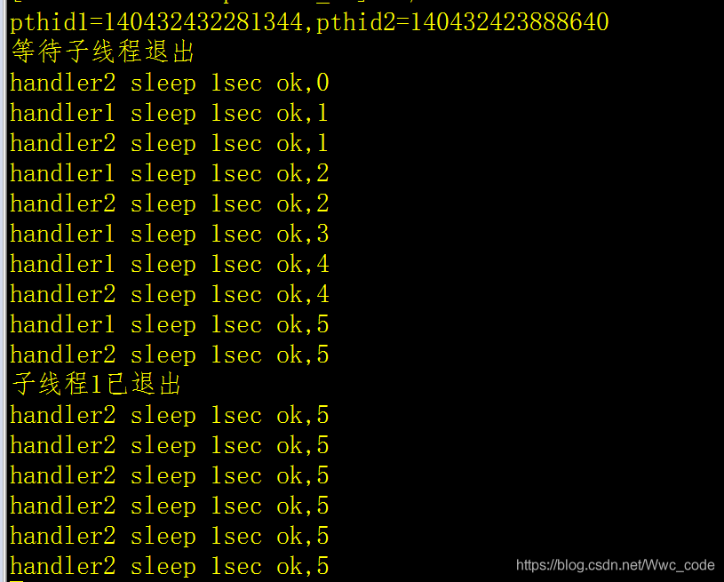

### 线程创建

- 一般情况下,main函数所在的线程我们称之为主线程（main线程），其余创建的线程称之为子线程。
- 程序中默认只有一个进程，`fork()`函数调用，2进程
- 程序中默认只有一个线程，`pthread_create()`函数调用，2个线程。

#### 相关函数

- `int pthread_create(pthread_t *thread, const pthread_attr_t *attr, void *(*start_routine) (void *), void *arg);`
    - 功能：创建一个子线程
    - 参数：
        - thread：传出参数，线程创建成功后，子线程的线程ID被写到该变量中。
        - attr : 设置线程的属性，一般使用默认值，NULL
        - start_routine : 函数指针，这个函数是子线程需要处理的逻辑代码
        - arg : 给第三个参数使用，传参
    - 返回值：
        - 成功：0
        - 失败：返回错误号。这个错误号和之前errno不太一样。
        - 获取错误号的信息： `char * strerror(int errnum);`

```C++
#include <stdio.h>
#include <pthread.h>
#include <string.h>
#include <unistd.h>

void * callback(void * arg) {
    printf("child thread...\n");
    printf("arg value: %d\n", *(int *)arg);
    return NULL;
}

int main() {

    pthread_t tid;

    int num = 10;

    // 创建一个子线程
    int ret = pthread_create(&tid, NULL, callback, (void *)&num);

    if(ret != 0) {
        char * errstr = strerror(ret);
        printf("error : %s\n", errstr);
    }

    for(int i = 0; i < 5; i++) {
        printf("%d\n", i);
    }

    sleep(1);

    return 0;   // exit(0);
}
```

#### 线程参数的传递

- 不能使用全局变量传参，因为线程跑起来，全局变量可能已经被改变了
- 数据类型的强制转换，用于线程的参数：指针8字节，int是4字节
    - `int i=10;`
    - `void* p=(void*)(long)i;`：先转8字节的long，再转指针类型
    - `int jj=(int)(long)p;`：先转8字节的long，再转int类型 二级指针概念：

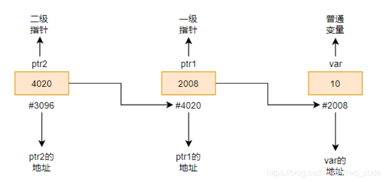

```c++
#include<stdio.h>
#include <pthread.h>
#include <unistd.h>
void* handler1(void* arg);
void* handler2(void* arg);
void* handler3(void* arg);
void* handler4(void* arg);
void* handler5(void* arg);
long var=0;
int main()
 {
   pthread_t pthid1,pthid2,pthid3,pthid4,pthid5;
  if(pthread_create(&pthid1,NULL,handler1,(void*)var)!=0)
  {
    printf("创建线程pthid1失败\n");
    return -1;
  }
  var++;
  if(pthread_create(&pthid2,NULL,handler2,(void*)var)!=0)
  {
    printf("创建线程pthid2失败\n");
    return -1;
  }
  var++;
  if(pthread_create(&pthid3,NULL,handler3,(void*)var)!=0)
  {
    printf("创建线程pthid3失败\n");
    return -1;
  }
  var++;
  if(pthread_create(&pthid4,NULL,handler4,(void*)var)!=0)
  {
    printf("创建线程pthid4失败\n");
    return -1;
  }
  var++;
  if(pthread_create(&pthid5,NULL,handler5,(void*)var)!=0)
  {
    printf("创建线程pthid5失败\n");
    return -1;
  }
   printf("pthid1=%lu,pthid2=%lu,pthid3=%lu,pthid4=%lu,pthid5=%lu\n",pthid1,pthid2,pthid3,pthid4,pthid5);
   printf("等待子线程退出\n");
   //pthread_join会使主进程阻塞在这里，用于调试
   pthread_join(pthid1,NULL);
   printf("子线程1已退出\n");
   pthread_join(pthid2,NULL);
   printf("子线程2已退出\n");
   pthread_join(pthid3,NULL);
   printf("子线程3已退出\n");
   pthread_join(pthid4,NULL);
   printf("子线程4已退出\n");
   pthread_join(pthid5,NULL);
   printf("子线程5已退出\n");
   return 0;
}
void* handler1(void* arg)
{
  for(int i=0;i<5;i++)
    {
       sleep(1);
       printf("handler1 sleep 1sec ok,%d\n",(int)(long)arg);
    }
   //子线程退出
   pthread_exit(0);
}
void* handler2(void* arg)
{
  for(int i=0;i<5;i++)
    {
       sleep(1);
       printf("handler2 sleep 1sec ok,%d\n",(int)(long)arg);
    }
   pthread_exit(0);
}
void* handler3(void* arg)
{
  for(int i=0;i<5;i++)
    {
       sleep(1);
       printf("handler3 sleep 1sec ok,%d\n",(int)(long)arg);
    }
   pthread_exit(0);
}
void* handler4(void* arg)
{
  for(int i=0;i<5;i++)
    {
       sleep(1);
       printf("handler4 sleep 1sec ok,%d\n",(int)(long)arg);
    }
   pthread_exit(0);
}
void* handler5(void* arg)
{
  for(int i=0;i<5;i++)
    {
       sleep(1);
       printf("handler5 sleep 1sec ok,%d\n",(int)(long)arg);
    }
   pthread_exit(0);
}
```

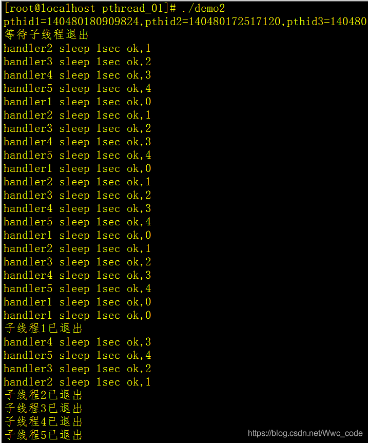

### 终止线程

- `void pthread_exit(void *retval);`
    - 功能：终止一个线程，在哪个线程中调用，就表示终止哪个线程
    - 参数
        - retval:需要传递一个指针，作为一个返回值，可以在`pthread_join()`中获取到。

- `pthread_t pthread_self(void);`
    - 功能：获取当前的线程的线程ID

- `int pthread_equal(pthread_t t1, pthread_t t2);`
    - 功能：比较两个线程ID是否相等
    - 不同的操作系统，`pthread_t`类型的实现不一样，有的是无符号的长整型，有的是使用结构体去实现的。

```c++
#include <stdio.h>
#include <pthread.h>
#include <string.h>

void * callback(void * arg) {
    printf("child thread id : %ld\n", pthread_self());  // pthread_self当前进程的id
    return NULL;    // pthread_exit(NULL);
}

int main() {

    // 创建一个子线程
    pthread_t tid;
    int ret = pthread_create(&tid, NULL, callback, NULL);

    if(ret != 0) {
        char * errstr = strerror(ret);
        printf("error : %s\n", errstr);
    }

    // 主线程
    for(int i = 0; i < 5; i++) {
        printf("%d\n", i);
    }

    printf("tid : %ld, main thread id : %ld\n", tid ,pthread_self());

    // 让主线程退出,当主线程退出时，不会影响其他正常运行的线程。
    pthread_exit(NULL);

    printf("main thread exit\n");

    return 0;   // exit(0);
}
```

### 连接已终止的线程

- 线程有两种状态：`joinable`,`unjoinable`
- `joinable`:当子线程主函数终止不会释放线程所占用的资源，线程为僵尸线 程，创建线程默认属性为`joinable`
- `pthread_join`会在主进程中阻塞线程，一般不会使用(多用于调试)
- 创建线程前，调用`pthread_attr_setdetachstate`将线程设为`detached`，这样线程退出时，系统自动回收线程资源。
- 分离前`pthread_join`返回值为0，分离后返回值为`errror=22,Invalid argument`
- 创建线程后调用`pthread_detach`将新的线程设置为`detach`状态
- 在线程主调函数里面调用`pthread_detach(pthread_self())`

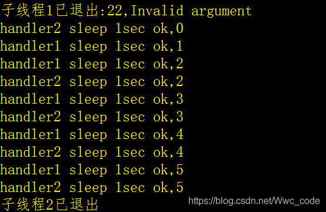

```c++
#include<stdio.h>
#include <pthread.h>
#include <unistd.h>
#include <string.h>
void* handler1(void* arg);
void* handler2(void* arg);
int var=0;
 {
   pthread_t pthid1,pthid2;
  /* pthread_attr_t attr;
  pthread_attr_init(&attr);
  pthread_attr_setdetachstate(&attr,PTHREAD_CREATE_DETACHED);  // 设置线程的属性。*/
  if(pthread_create(&pthid1,NULL,handler1,NULL)!=0) {
    printf("创建线程pthid1失败\n");
    return -1;
  } 
  //pthread_detach(pthid1);
  if(pthread_create(&pthid2,NULL,handler2,NULL)!=0)
  {
    printf("创建线程pthid2失败\n");
    return -1;
  } 
  //pthread_detach(pthid2);
   printf("pthid1=%lu,pthid2=%lu\n",pthid1,pthid2);
   printf("等待子线程退出\n");
   //pthread_join会使主进程阻塞在这里，用于调试
   int ret=pthread_join(pthid1,NULL);
   printf("子线程1已退出:%d,%s\n",ret,strerror(ret));
  // pthread_join(pthid2,NULL);
   printf("子线程2已退出\n");
   sleep(10);
   return 0;
}  
void* handler1(void* arg)
{
  pthread_detach(pthread_self());
  for(int i=0;i<5;i++)
    {
       sleep(1);
       ++var;
       printf("handler1 sleep 1sec ok,%d\n",var);
    }
   //子线程退出
   pthread_exit(0);

}
void* handler2(void* arg)
{
  pthread_detach(pthread_self());
  for(int i=0;i<5;i++)
    {
       sleep(1);
       printf("handler2 sleep 1sec ok,%d\n",var);
    }
    pthread_exit(0);
}
```

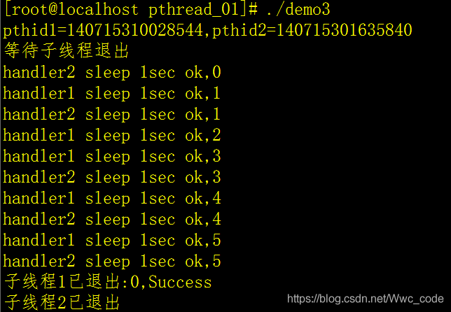

#### 相关函数

- `int pthread_join(pthread_t thread, void ** retval);`
    - 功能：和一个已经终止的线程进行连接
        - 回收子线程的资源
        - 这个函数是阻塞函数，调用一次只能回收一个子线程
        - 一般在主线程中使用
    - 参数：
        - thread：需要回收的子线程的ID
        - retval: 类型为二级指针，接收子线程退出时的返回值
    - 返回值：
        - 0 : 成功
        - 非0 : 失败，返回的错误号

- 示例1

```c++
#include <stdio.h>
#include <pthread.h>
#include <string.h>
#include <unistd.h>

int value = 10;

void * callback(void * arg) {
    printf("child thread id : %ld\n", pthread_self());
    // sleep(3);
    // return NULL;
    // int value = 10; // 局部变量
    pthread_exit((void *)&value);   // return (void *)&value;
}

int main() {

    // 创建一个子线程
    pthread_t tid;
    int ret = pthread_create(&tid, NULL, callback, NULL);

    if(ret != 0) {
        char * errstr = strerror(ret);
        printf("error : %s\n", errstr);
    }

    // 主线程
    for(int i = 0; i < 5; i++) {
        printf("%d\n", i);
    }

    printf("tid : %ld, main thread id : %ld\n", tid ,pthread_self());

    // 主线程调用pthread_join()回收子线程的资源
    int * thread_retval;
    ret = pthread_join(tid, (void **)&thread_retval);

    if(ret != 0) {
        char * errstr = strerror(ret);
        printf("error : %s\n", errstr);
    }

    printf("exit data : %d\n", *thread_retval);

    printf("回收子线程资源成功！\n");

    // 让主线程退出,当主线程退出时，不会影响其他正常运行的线程。
    pthread_exit(NULL);

    return 0;
}
```

- 示例2

```c++
#include<stdio.h>
#include <pthread.h>
#include <unistd.h>
void* handler1(void* arg);
void* handler2(void* arg);
int var=0;
int main()
 {
   pthread_t pthid1;
   if(pthread_create(&pthid1,NULL,handler1,NULL)!=0)
  {
    printf("创建线程pthid1失败\n");
    return -1;
  }
   printf("pthid1=%lu\n",pthid1);
   printf("等待子线程退出\n");
   //pthread_join会使主进程阻塞在这里，用于调试
   int ret;
   int result=pthread_join(pthid1,(void** )&ret);
   printf("子线程1已退出(result=%d,ret=%d)\n",result,ret);
   return 0;
}
void* handler1(void* arg)
{
  for(int i=0;i<5;i++)
    {
       sleep(1);
       ++var;
       printf("handler1 sleep 1sec ok,%d\n",var);
    }
   // return 0;
   // return (void*)1;
   //子线程退出
   // pthread_exit((void*)10);
   pthread_exit(0);

}
```


### 线程的分离

一般情况下，线程终止后，其终止状态一直保留到其它线程调用 `pthread_join` 获取它的状态为止，但是线程也可以被置为detach状态，这样的线程一旦终止就立刻回收它占用的所有资源，而不保留终止状态

- `int pthread_detach(pthread_t thread);`
    - 功能：分离一个线程。被分离的线程在终止的时候，会自动释放资源返回给系统。
        - 1.不能多次分离，会产生不可预料的行为。
        - 2.不能去连接(`pthread_join`)一个已经分离的线程，会报错。
    - 参数：需要分离的线程的ID
    - 返回值：
        - 成功：0
        - 失败：返回错误号

```c++
#include <stdio.h>
#include <pthread.h>
#include <string.h>
#include <unistd.h>

void * callback(void * arg) {
    printf("chid thread id : %ld\n", pthread_self());
    return NULL;
}

int main() {

    // 创建一个子线程
    pthread_t tid;

    int ret = pthread_create(&tid, NULL, callback, NULL);
    if(ret != 0) {
        char * errstr = strerror(ret);
        printf("error1 : %s\n", errstr);
    }

    // 输出主线程和子线程的id
    printf("tid : %ld, main thread id : %ld\n", tid, pthread_self());

    // 设置子线程分离,子线程分离后，子线程结束时对应的资源就不需要主线程释放
    ret = pthread_detach(tid);
    if(ret != 0) {
        char * errstr = strerror(ret);
        printf("error2 : %s\n", errstr);
    }

    // 设置分离后，对分离的子线程进行连接 pthread_join()
    // ret = pthread_join(tid, NULL);
    // if(ret != 0) {
    //     char * errstr = strerror(ret);
    //     printf("error3 : %s\n", errstr);
    // }

    pthread_exit(NULL);

    return 0;
}
```

### 线程取消

- `int pthread_cancel(pthread_t thread);`
    - 功能：取消线程（让线程终止）,
        - 取消某个线程，可以终止某个线程的运行，
        - 但是并不是立马终止，而是当子线程执行到一个取消点，线程才会终止。
        - 取消点：系统规定好的一些系统调用，我们可以粗略的理解为从用户区到内核区的切换，这个位置称之为取消点。
    - 线程返回值为-1

- `int pthread_setcancelstate(int state, int *oldstate);`
    - 其中state有两种状态：
        - PTHREAD_CANCEL_ENABLE（缺省情况）
        - PTHREAD_CANCEL_DISABLE

- 取消点（Cancellation points）:会产生I/O等待的函数

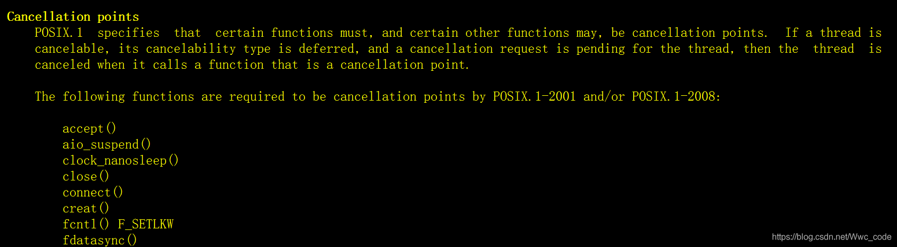

- 取消点设置函数：`void pthread_testcancel(void);`
- `int pthread_setcanceltype(int type, int *oldtype);`
    - 取消类型有两种：延迟取消，立即取消
        - PTHREAD_CANCEL_DEFERRED（延迟）
            - PTHREAD_CANCEL_ASYNCHRONOUS（立即）

- 应用于总线程获取多个线程的状态，一旦某个线程挂掉，总线程即cancel子线程

- 示例1

```c++
#include <stdio.h>
#include <pthread.h>
#include <string.h>
#include <unistd.h>

void * callback(void * arg) {
    printf("chid thread id : %ld\n", pthread_self());
    for(int i = 0; i < 5; i++) {
        printf("child : %d\n", i);
    }
    return NULL;
}

int main() {

    // 创建一个子线程
    pthread_t tid;

    int ret = pthread_create(&tid, NULL, callback, NULL);
    if(ret != 0) {
        char * errstr = strerror(ret);
        printf("error1 : %s\n", errstr);
    }

    // 取消线程
    pthread_cancel(tid);

    for(int i = 0; i < 5; i++) {
        printf("%d\n", i);
    }

    // 输出主线程和子线程的id
    printf("tid : %ld, main thread id : %ld\n", tid, pthread_self());


    pthread_exit(NULL);

    return 0;
}
```

- 示例2：立即取消

```c++
#include <pthread.h>
#include <unistd.h>
void* handler1(void* arg);
void* handler2(void* arg);
int var=0;
int main()
 {
   pthread_t pthid1;
   if(pthread_create(&pthid1,NULL,handler1,NULL)!=0)
  {
    printf("创建线程pthid1失败\n");
    return -1;
  }
   usleep(2);
   pthread_cancel(pthid1); printf("pthid1=%lu\n",pthid1);
   printf("等待子线程退出\n");
   //pthread_join会使主进程阻塞在这里，用于调试
   int ret;
   int result=pthread_join(pthid1,(void** )&ret);
   printf("子线程1已退出(result=%d,ret=%d)\n",result,ret);
   return 0;
}
void* handler1(void* arg)
{

 // pthread_setcancelstate(PTHREAD_CANCEL_DISABLE,NULL);
   //pthread_setcanceltype(PTHREAD_CANCEL_DEFERRED,NULL);
   pthread_setcanceltype(PTHREAD_CANCEL_ASYNCHRONOUS,NULL);
   int jj=0;
  for(int i=0;i<5000000;i++)
    {
       ;
       jj++;
       jj--;
       jj++;
      //sleep为延迟取消点
       //sleep(1);
       ++var;
    //设置取消点，
     // pthread_testcancel();
     //printf("handler1 sleep 1sec ok,%d\n",var);
    }
    printf("jj=%d\n",jj);
   // return (void*)1;
   //子线程退出
   pthread_exit(0);
}
```

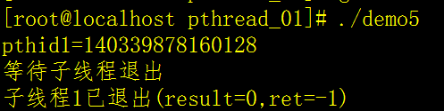

- 示例3：延迟取消

```c++
#include <pthread.h>
#include <unistd.h>
void* handler1(void* arg);
void* handler2(void* arg);
int var=0;
int main()
 {
   pthread_t pthid1;
   if(pthread_create(&pthid1,NULL,handler1,NULL)!=0)
  {
    printf("创建线程pthid1失败\n");
    return -1;
  }
   usleep(2);
   pthread_cancel(pthid1); printf("pthid1=%lu\n",pthid1);
   printf("等待子线程退出\n");
   //pthread_join会使主进程阻塞在这里，用于调试
   int ret;
   int result=pthread_join(pthid1,(void** )&ret);
   printf("子线程1已退出(result=%d,ret=%d)\n",result,ret);
   return 0;
}
void* handler1(void* arg)
{
 // pthread_setcancelstate(PTHREAD_CANCEL_DISABLE,NULL);
  pthread_setcanceltype(PTHREAD_CANCEL_DEFERRED,NULL);
  // pthread_setcanceltype(PTHREAD_CANCEL_ASYNCHRONOUS,NULL);
   int jj=0;
  for(int i=0;i<5000000;i++)
    {
       ;
       jj++;
       jj--;
       jj++;
      //sleep为延迟取消点
       //sleep(1);
       ++var;
    //设置取消点，
     // pthread_testcancel();
     //printf("handler1 sleep 1sec ok,%d\n",var);
    }
    printf("jj=%d\n",jj);
   // return (void*)1;
   //子线程退出
   pthread_exit(0);
}
```

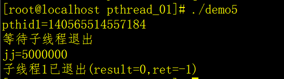

### 线程清理

- 子线程退出时可能需要执行善后工作，如释放资源和锁，回滚事务等
- 善后代码写在清理函数中，不写在主线程
- 清理函数定义：`void pthread_cleanup_push(void (*routine)(void *), void *arg);`
  在下面示例中清理函数中关闭socket,将socket传给arg,将该socket进行关闭
- `void pthread_cleanup_pop(int execute);`
    - 当execute=0时，清理函数不被执行，
    - execute=1清理函数被执行
- 当执行线程取消函数，会弹出清理函数，并且执行它
- 当执行`pthread_exit（0）`,也会弹出清理函数，并且执行它

```c++
#include<stdio.h>
#include <pthread.h>
#include <unistd.h>
void* handler1(void* arg);
int var=0;

void cleanfun1(void*);
void cleanfun2(void*);
void cleanfun3(void*);
int main()
 { 
   pthread_t pthid1;
   if(pthread_create(&pthid1,NULL,handler1,NULL)!=0)
  { 
    printf("创建线程pthid1失败\n");
    return -1;
  }
   printf("等待子线程退出\n");
   //pthread_join会使主进程阻塞在这里，用于调试
   sleep(2);
   pthread_cancel(pthid1);
   int ret;
   int result=pthread_join(pthid1,(void** )&ret);
   printf("子线程已退出(result=%d,ret=%d)\n",result,ret);
   return 0;
}
void* handler1(void* arg)
{
  // 注册线程清理函数
  int socketid=10;
  pthread_cleanup_push(cleanfun1,(void*)(long)socketid);
  pthread_cleanup_push(cleanfun2,NULL);
  pthread_cleanup_push(cleanfun3,NULL);
  for(int i=0;i<3;i++)
  {
     sleep(1);printf("sleep %dsec ok.\n",i+1);
  }
  //pthread_exit(0);

  pthread_cleanup_pop(1);
  pthread_cleanup_pop(1);
  pthread_cleanup_pop(1);
   pthread_exit(0);
}
void cleanfun1(void* arg )
{
  printf("fun1 is ok,arg=%d\n",(int)(long)arg);
}
void cleanfun2(void*)
{
  printf("fun2 is ok\n");
}
void cleanfun3(void*)
{
  printf("fun3 is ok\n");
}
```

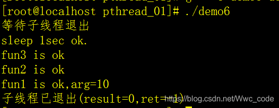

### 线程与信号

- 外部使用`killl`命令产生的信号，通常是SIGINT等控制信号，则会遍历所有线程，直到找到一个不阻塞的线程，然后调用处理（一般从主线程找起）
- 信号并不会中断线程，主进程，线程继续处理当信号到来时
- 多个线程程序中，在某一个线程中调用signal会改变所有线程中的信号处理函数
- 主进程向子线程发送信号用`pthread_kill`函数，当信号处理函数和和其他线程执行完，才会继续执行中断的线程

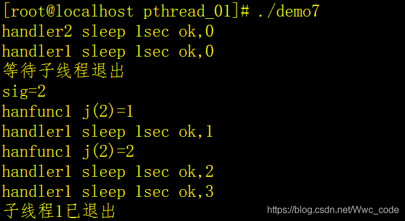

- 不存在对不同的线程设置不同处理函数的说法，正确的做法：设置一个公共的信号处理函数，并利用`pthread_kill(pthread,2)`对不同的信号进行中断，如果设置没有设置信号处理函数，则整个函数退出。

```c++
void* handler1(void* arg);
void* handler2(void* arg);
int var=0;
void hanfunc(int arg);
 {
  // signal(2,hanfunc);
   signal(2,hanfunc);
   pthread_t pthid1,pthid2;
  if(pthread_create(&pthid1,NULL,handler1,NULL)!=0)
  {
    printf("创建线程pthid1失败\n");
    return -1;
  } 
  if(pthread_create(&pthid2,NULL,handler2,NULL)!=0)
  {
    printf("创建线程pthid2失败\n");
    return -1;
  } 
   sleep(1),pthread_kill(pthid2,2);
   printf("等待子线程退出\n");
   //pthread_join会使主进程阻塞在这里，用于调试
   int ret,ists;
   ret=pthread_join(pthid1,NULL);
   ret=pthread_join(pthid2,NULL);
   printf("子线程1已退出\n");
   return 0;
}  
void* handler1(void* arg)
{
  for(int i=0;i<5;i++)
    {
       sleep(1);
       printf("handler1 sleep 1sec ok,%d\n",i);
    }
   //子线程退出
   pthread_exit(0);
}
void* handler2(void* arg)
{
  for(int i=0;i<5;i++)
    {
       sleep(1);
       printf("handler2 sleep 1sec ok,%d\n",i);
    }
   //子线程退出
   pthread_exit(0);
}
void hanfunc(int arg)
{
  printf("sig=%d\n",arg);
  for(int j=1;j<4;j++){
       printf("hanfunc j(%d)=%d\n",arg,j);
       sleep(1);
   }
}
```

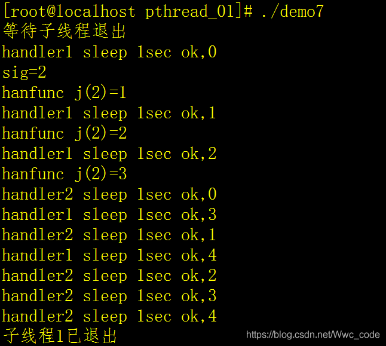

### 线程属性

- `int pthread_attr_init(pthread_attr_t *attr);`
    - 初始化线程属性变量

- `int pthread_attr_destroy(pthread_attr_t *attr);`
    - 释放线程属性的资源

- `int pthread_attr_getdetachstate(const pthread_attr_t *attr, int *detachstate);`
    - 获取线程分离的状态属性

- `int pthread_attr_setdetachstate(pthread_attr_t *attr, int detachstate);`
    - 设置线程分离的状态属性

```c++
#include <stdio.h>
#include <pthread.h>
#include <string.h>
#include <unistd.h>

void * callback(void * arg) {
    printf("chid thread id : %ld\n", pthread_self());
    return NULL;
}

int main() {

    // 创建一个线程属性变量
    pthread_attr_t attr;
    // 初始化属性变量
    pthread_attr_init(&attr);

    // 设置属性
    pthread_attr_setdetachstate(&attr, PTHREAD_CREATE_DETACHED);

    // 创建一个子线程
    pthread_t tid;

    int ret = pthread_create(&tid, &attr, callback, NULL);
    if(ret != 0) {
        char * errstr = strerror(ret);
        printf("error1 : %s\n", errstr);
    }

    // 获取线程的栈的大小
    size_t size;
    pthread_attr_getstacksize(&attr, &size);
    printf("thread stack size : %ld\n", size);

    // 输出主线程和子线程的id
    printf("tid : %ld, main thread id : %ld\n", tid, pthread_self());

    // 释放线程属性资源
    pthread_attr_destroy(&attr);

    pthread_exit(NULL);

    return 0;
}
```
