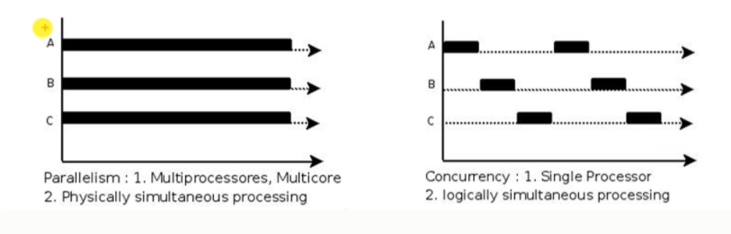
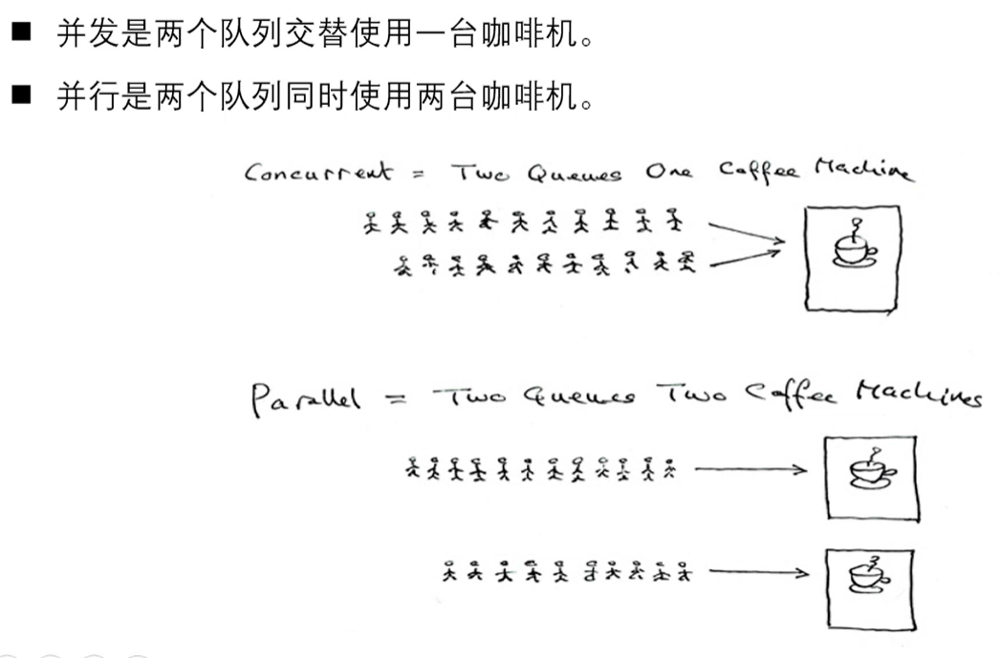
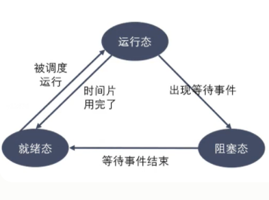
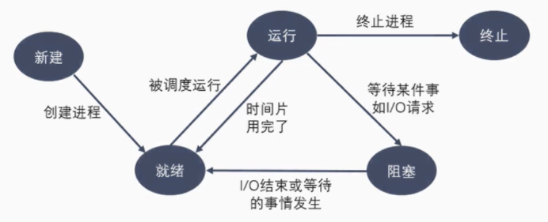
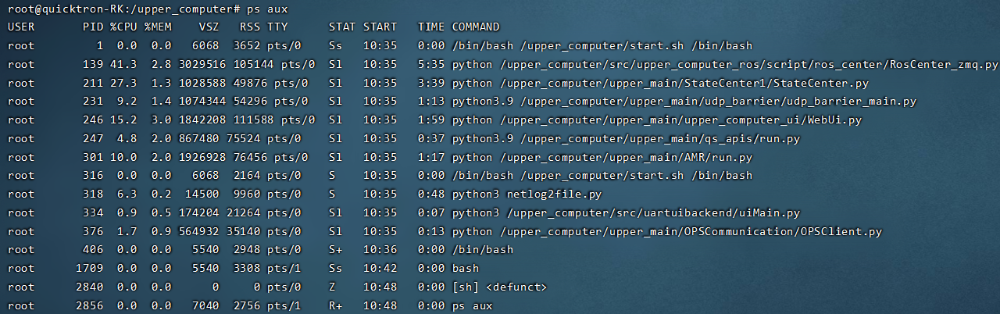
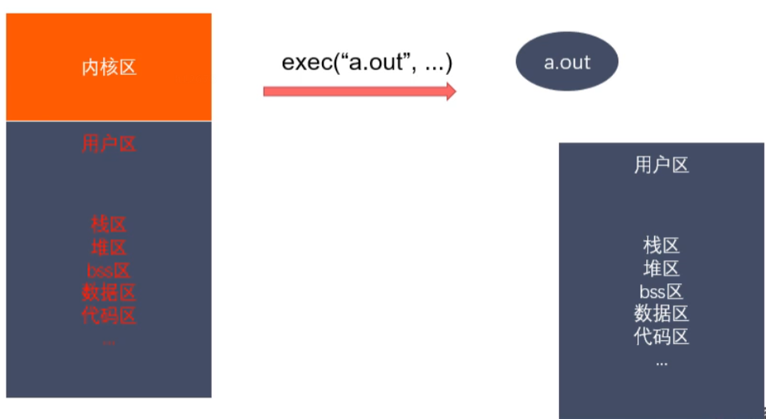

###### datetime:2023/01/04 11:15

###### author:nzb

# 进程概述

## 程序和进程

程序是包含一系列信息的文件，这些信息描述了如何在运行时创建一个进程：

- 二进制格式标识：每个程序文件都包含用于描述可执行文件格式的元信息。内核利用此信息来解释文件中的其他信息。（ELF可执行连接格式）
- 机器语言指令：对程序算法进行编码。
- 程序入口地址：标识程序开始执行时的起始指令位置。
- 数据：程序文件包含的变量初始值和程序使用的字面量值（比如字符串）。
- 符号表及重定位表：描述程序中函数和变量的位置及名称。这些表格有多重用途，其中包括调试 和运行时的符号解析（动态链接）。
- 共享库和动态链接信息：程序文件所包含的一些字段，列出了程序运行时需要使用的共享库，以 及加载共享库的动态连接器的路径名。
- 其他信息：程序文件还包含许多其他信息，用以描述如何创建进程。
- 进程是正在运行的程序的实例。是一个具有一定独立功能的程序关于某个数据集合的一次运行活动。它是操作系统动态执行的基本单元，在传统的操作系统中，进程既是基本的分配单元，也是基本的执行单元。
- 可以用一个程序来创建多个进程，进程是由内核定义的抽象实体，并为该实体分配用以执行程序的各项系统资源。从内核的角度看，进程由用户内存空间和一系列内核数据结构组成，其中用户内存空间包含了程序代码及代码所使用的变量，而内核数据结
  构则用于维护进程状态信息。记录在内核数据结构中的信息包括许多与进程相关的标 识号（IDs）、虚拟内存表、打开文件的描述符表、信号传递及处理的有关信息、进 程资源使用及限制、当前工作目录和大量的其他信息。

## 单道、多道程序设计

- 单道程序，即在计算机内存中只允许一个的程序运行。
- 多道程序设计技术是在计算机内存中同时存放几道相互独立的程序，使它们在管理程序控制下，相互穿插运行，两个或两个以上程序在计算机系统中同处于开始到结束之间的状态，
  这些程序共享计算机系统资源。引入多道程序设计技术的根本目的是为了提高CPU的利用率。
- 对于一个单CPU系统来说，程序同时处于运行状态只是一种宏观上的概念，他们虽然都已经开始运行，但就微观而言，任意时刻，CPU上运行的程序只有一个。
- 在多道程序设计模型中，多个进程轮流使用CPUo而当下常见CPU为纳秒级，1秒可以执行大约10亿条指令。由于人眼的反应速度是毫秒级，所以看似同时在运行。

## 时间片

- 时间片(timeslice)又称为"量子(quantum)"或'处理器片(processor slice) 是操作系统分配给每个正在运行的进程微观上的一段CPU时间。事实上，虽然一台计
  算机通常可能有多个CPU,但是同一个CPU永远不可能真正地同时运行多个任务。在 只考虑一个CPU的情况下，这些进程“看起来像"同时运行的，实则是轮番穿插地运行， 由于时间片通常很短(在Linux上为5ms- 800ms)
  ,用户不会感觉到。
- 时间片由操作系统内核的调度程序分配给每个进程。首先，内核会给每个进程分配相等 的初始时间片，然后每个进程轮番地执行相应的时间，当所有进程都处于时间片耗尽的 状态时，内核会重新为每个进程计算并分配时间片，如此往复。

## 并行和并发

- 并行(parallel)：指在同一时刻，有多条指令在多个处理器上同时执行。
- 并发(concurrency)：指在同一时刻只能有一条指令执行，但多个进程指令被快速的 轮换执行，使得在宏观上具有多个进程同时执行的效果，但在微观上并不是同时执行的, 只是把时间分成若干段，使多个进程快速交替的执行。

  
  

## 进程控制块(PCB)

- 为了管理进程，内核必须对每个进程所做的事情进行清楚的描述。内核为每个进程分 配一个`PCB (Processing Control Block)`进程控制块，维护进程相关的信息， Linux内核的进程控制块是`task_struct`
  结构体。
- 在 `/usr/src/linux-headers-xxx/include/linux/sched.h` 文件中可以查 看`struct task_struct`结构体定义。其内部成员有很多，我们只需要掌握以下 部分即可：
    - 进程id：系统中每个进程有唯一的`id`,用`pid_t`类型表示，其实就是一个非负整数
    - 进程的状态：有就绪、运行、挂起、停止等状态
    - 进程切换时需要保存和恢复的一些CPU寄存器
    - 描述虚拟地址空间的信息
    - 描述控制终端的信息

- 进程控制块(PCB)
    - 当前工作目录(Current Working Directory)
    - umask掩码
    - 文件描述符表，包含很多指向file结构体的指针
    - 和信号相关的信息
    - 用户id和组id
    - 会话(Session)和进程组
    - 进程可以使用的资源上限(Resource Limit)

## 进程状态转换

### 进程的状态

进程状态反映进程执行过程的变化。这些状态随着进程的执行和外界条件的变化而转换。 在三态模型中，进程状态分为三个基本状态， 即`就绪态`，`运行态`，`阻塞态`。在五态模型 中，进程分为`新建态`、`就绪态`，`运行态`，`阻塞态`
，`终止态`。

- 运行态：进程占有处理器正在运行
- 就绪态：进程具备运行条件，等待系统分配处理器以便运行。当进程已分配到除CPU以外的所有必要资源后，只要再获得CPU,便可立即执行。在一个系统中处于就绪状态的进程可能有多个，通常将它们排成一个队列，称为就绪队列
- 阻塞态：又称为等待(wait)态或睡眠(sleep)态，指进程不具备运行条件，正在等待某个事件的完成

  
  

- 新建态：进程刚被创建时的状态，尚未进入就绪队列
- 终止态：进程完成任务到达正常结束点，或出现无法克服的错误而异常终止，或被操作系统及有终止权的进程所终止时所处的状态。进入终止态的进程以后不再执行，但依然保留在操作系
  统中等待善后。一旦其他进程完成了对终止态进程的信息抽取之后，操作系统将删除该进程。

### 进程相关命令

- 查看进程: `ps aux / ajx`
    - a：显示终端上的所有进程，包括其他用户的进程
    - u：显示进程的详细信息
    - X：显示没有控制终端的进程
    - j:列出与作业控制相关的信息

  
    - STAT参数意义:
        - `D` 不可中断 Uninterruptible （usually 10）
        - `R` 正在运行，或在队列中的进程
        - `S`（大写） 处于休眠状态
        - `T` 停止或被追踪
        - `Z` 僵尸进程
        - `W` 进入内存交换（从内核2.6开始无效）
        - `X` 死掉的进程
        - `<` 高优先级
        - `N` 低优先级
        - `L` 有pages在内存中locked。用于实时或者自定义IO。
        - `s` 包含子进程
        - `l` 多线程
        - `+` 位于前台的进程组

- 实时显示进程动态: `top`  
  可以在使用top命令时加上`-d secs`来指定显示信息更新的时间间隔，在top命令执行后，可以按以下按键对显示的结果进行排序：
    - M 根据内存使用量排序
    - P 根据CPU占有率排序
    - T 根据进程运行时间长短排序
    - U 根据用户名来筛选进程
    - K 输入指定的PID杀死进程

- 杀死进程: `kill [-signal] pid`
    - `kill -l`: 列出所有信号
    - `kill -SIGKILL 进程ID`
    - `kill -9 进程ID`
    - `killall name`: 根据进程名杀死进程

### 进程号和相关函数

- 每个进程都由进程号来标识，其类型为 `pid_t`(整型)，进程号的范围：0~32767。进程号总是唯一的，但可以重用。当一个进程终止后，其进程号就可以再次使用。
- 任何进程(除 init 进程)都是有另一个进程创建，该进程称为被创建进程的父进程，对应的进程号称为父进程号(PPID)。
- 进程组是一个或多个进程的集合。他们之间相互关联，进程组可以接收同一终端的各种信号，关联的进程有一个进程组号(PGID)。默认情况下，当前的进程号会当做当前的进程组号。
- 进程号和进程组相关函数
    - `pid_t getpid(void);`
    - `pid_t getppid(void);`
    - `pid_t getpgid(pid_t pid);`

## 进程创建

系统允许一个进程创建新进程，新进程即为子进程，子进程还可以创建新的子进程，形成进程树结构模型。

```c++
#include <sys/types.h> 
#include <unistd.h>
pid_t fork(void);
```

- 返回值：
    - 成功：子进程中返回0,父进程中返回子进程ID
    - 失败：返回`-1`
- 失败的两个主要原因：
    - 当前系统的进程数已经达到了系统规定的上限，这时`errno`的值被设置为 `EAGAIN`
    - 系统内存不足，这时`errno`的值被设置为`ENOMEM`

`fork（）`读时共享，写时子进程才copy复制一份程序和虚拟地址空间，使得当父进程写的时候改变了物理地址，但是子进程指向的还是原来的物理空间指向的值，两者的物理空间指向的值可能不同。

> - 实际上，更准确来说，Linux的`fork()`使用是通过写时拷贝(copy- on-write) 实现。
> - 实时拷贝是一种可以推迟甚至避免拷贝数据的技术。
> - 内核此时并不复制整个进程的地址空间，而是让父子进程共享同一个地址空间。
> - 只用在需要写入的时候才会复制地址空间，从而使各个进行拥有各自的地址空间。
> - 也就是说，资源的复制是在需要写入的时候才会进行，在此之前，只有以只读方式共享, 注意：fork之后父子进程共享文件。
> - fork产生的子进程与父进程相同的文件文件描述符指向相同的文件表，引用计数增加。

### 父子进程关系和GDB多进程调试

父子进程之间的关系

- 区别
    - fork()函数的返回值不同
        - 父进程中：>0, 返回的子进程的ID
        - 子进程中：=0
    - pcb中的一些数据
        - 当前的进程的id pid
        - 当前的进程的父进程的id ppid,
        - 信号集

- 共同点
    - 某些状态下：子进程刚被创建出来，还没有执行任何的写数据的操作
        - 用户区的数据
        - 文件描述符表

- 父子进程对变量是不是共享的？
    - 刚开始的时候，是一样的，共享的。如果修改了数据，不共享了。
    - 读时共享，写时拷贝。

#### GDB多进程调试（面试常考）

使用GDB调试的时候，GDB默认只能跟踪一个进程，可以在fork函数调用之前，通 过指令设置GDB调试工具跟踪父进程或者是跟踪子进程，默认跟踪父进程。

设置调试父进程或者子进程：`set follow-fork-mode [parent （默认）| child]`

设置调试模式：`set detach-on-fork [on | off]`
默认为on,表示调试当前进程的时候，其它的进程继续运行，如果为off,调试当前进程的时候，其它进程被GDB挂起。

查看调试的进程：`info inferiors`  
切换当前调试的进程：`inferior id`  
使进程脱离 GDB 调试：`detach inferiors id`

## exec函数族

### exec函数族介绍

- exec函数族的作用是根据指定的文件名找到可执行文件，并用它来取代调用进程的内容，换句话说，就是在调用进程内部执行一个可执行文件。
- exec函数族的函数执行成功后不会返回，因为调用进程的实体，包括代码段，数据段和堆栈等都已经被新的内容取代，只留下进程ID等一些表面上的信息仍保持原样, 颇有些神似''三十六计〃中的''
  金蝉脱壳〃。看上去还是旧的躯壳，却已经注入了新的灵 魂。只有调用失败了，它们才会返回-1,从原程序的调用点接着往下执行。

### exec函数族作用图解



- `int execl (const char *path, const char *arg, . . ./* (char *) NULL */);`
    - 参数
        - path:需要指定的执行的文件的路径或者名称
            - `a.out /home/nowcoder/a.out` 推荐使用绝对路径
            - `./a.out hello world`
        - arg:是执行可执行文件所需要的参数列表
            - 第一个参数一般没有什么作用，为了方便，一般写的是执行的程序的名称 从第二个参数开始往后，就是程序执行所需要的的参数列表。 参数最后需要以NULL结束(哨兵)
- `int execlp (const char *file, const char *arg, ・・・ /* (char *) NULL */);`
    - 参数
        - file:
            - `a.out /home/nowcoder/a.out` 推荐使用绝对路径
            - `./a.out hello world`
        - arg:是执行可执行文件所需要的参数列表 第一个参数一般没有什么作用，为了方便，一般写的是执行的程序E 从第二个参数开始往后，就是程序执行所需要的的参数列表。 参数最后需要以NULL结束(哨兵)
    - 返回值： 只有当调用失败，才会有返回值，返回-1,并且设置errno 如果调用成功，没有返回值。
- `int execle(const char *path, const char *arg, ・・•/*, (char *) NULL, char *const envp[] */);`
- `int execv(const char *path, char *const argv[]);`
- `int execvp(const char *file, char *const argv[]);`
- `int execvpe(const char *file, char *const argv[], char *const envp[]);`
- `int execve (const char *filename, char *const argv[], char *const envp []);`
- `l(list)`    参数地址列表，以空指针结尾
- `v(vector)`    存有各参数地址的指针数组的地址
- `p(path)`    按PATH环境变量指定的目录搜索可执行文件
- `e(environment)` 存有环境变量字符串地址的指针数组的地址

示例代码
```c++
/*
#include <unistd.h>
int execl(const char *path, const char *arg, ...);
    - 参数：
        - path:需要指定的执行的文件的路径或者名称
            a.out /home/nowcoder/a.out 推荐使用绝对路径
            ./a.out hello world

        - arg:是执行可执行文件所需要的参数列表
            第一个参数一般没有什么作用，为了方便，一般写的是执行的程序的名称
            从第二个参数开始往后，就是程序执行所需要的的参数列表。
            参数最后需要以NULL结束（哨兵）

    - 返回值：
        只有当调用失败，才会有返回值，返回-1，并且设置errno
        如果调用成功，没有返回值。
*/
#include <unistd.h>
#include <stdio.h>

int main() {
    // 创建一个子进程，在子进程中执行exec函数族中的函数
    pid_t pid = fork();

    if(pid > 0) {
        // 父进程
        printf("i am parent process, pid : %d\n",getpid());
        sleep(1);
    }else if(pid == 0) {
        // 子进程
        // execl("hello","hello",NULL);

        execl("/bin/ps", "ps", "aux", NULL);
        perror("execl");
        printf("i am child process, pid : %d\n", getpid());

    }

    for(int i = 0; i < 3; i++) {
        printf("i = %d, pid = %d\n", i, getpid());
    }

    return 0;
}
```

```c++
/*
#include <unistd.h>
int execlp(const char *file, const char *arg, ... );
    - 会到环境变量中查找指定的可执行文件，如果找到了就执行，找不到就执行不成功。
    - 参数：
        - file:需要执行的可执行文件的文件名
            a.out
            ps

        - arg:是执行可执行文件所需要的参数列表
            第一个参数一般没有什么作用，为了方便，一般写的是执行的程序的名称
            从第二个参数开始往后，就是程序执行所需要的的参数列表。
            参数最后需要以NULL结束（哨兵）

    - 返回值：
        只有当调用失败，才会有返回值，返回-1，并且设置errno
        如果调用成功，没有返回值。


int execv(const char *path, char *const argv[]);
    argv是需要的参数的一个字符串数组
    char * argv[] = {"ps", "aux", NULL};
    execv("/bin/ps", argv);

int execve(const char *filename, char *const argv[], char *const envp[]);
    char * envp[] = {"/home/nowcoder", "/home/bbb", "/home/aaa"};
*/
#include <unistd.h>
#include <stdio.h>

int main() {

    // 创建一个子进程，在子进程中执行exec函数族中的函数
    pid_t pid = fork();

    if(pid > 0) {
        // 父进程
        printf("i am parent process, pid : %d\n",getpid());
        sleep(1);
    }else if(pid == 0) {
        // 子进程
        execlp("ps", "ps", "aux", NULL);

        printf("i am child process, pid : %d\n", getpid());

    }

    for(int i = 0; i < 3; i++) {
        printf("i = %d, pid = %d\n", i, getpid());
    }

    return 0;
}
```