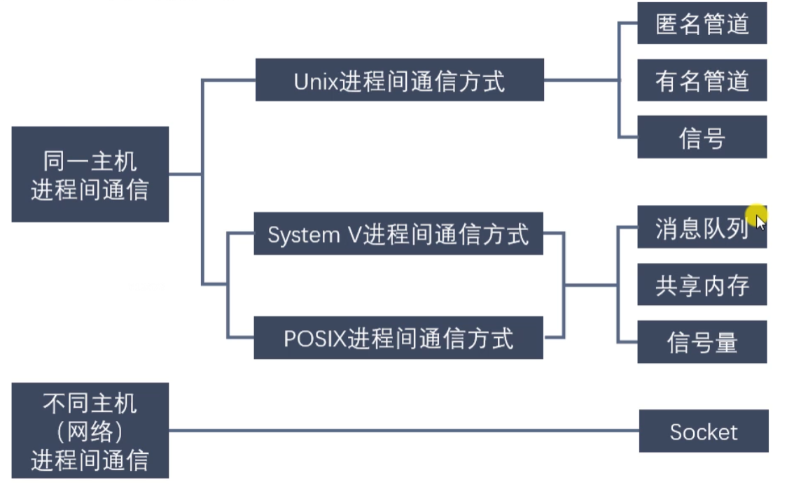
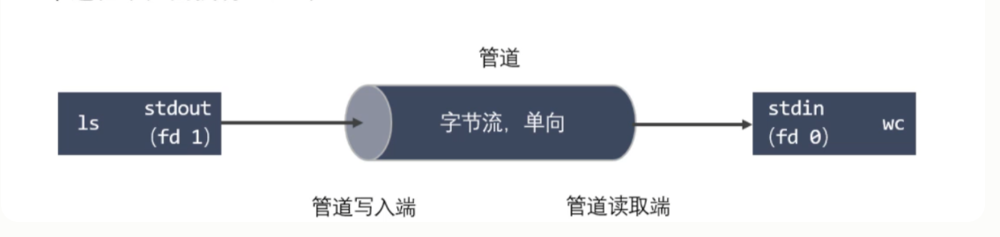
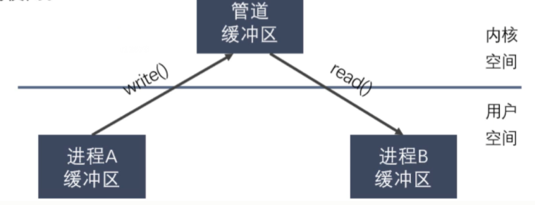
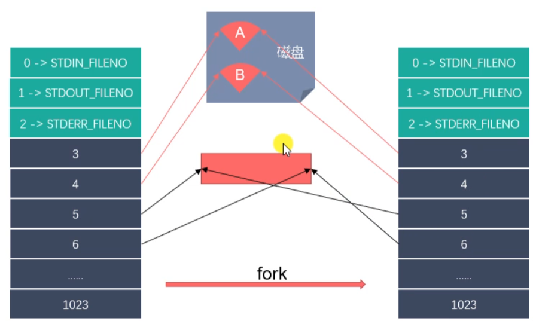
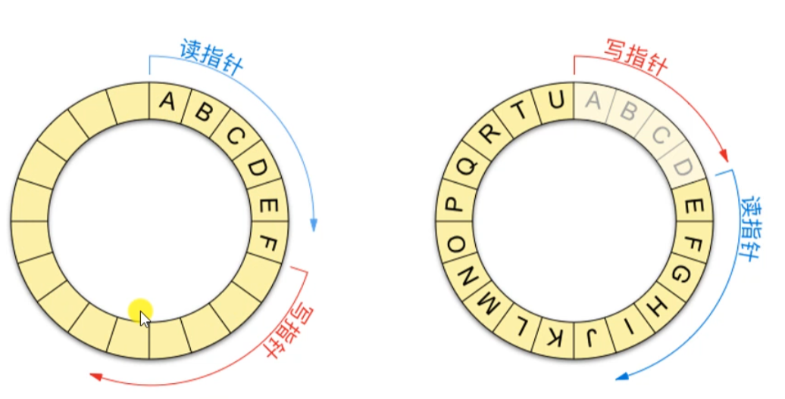
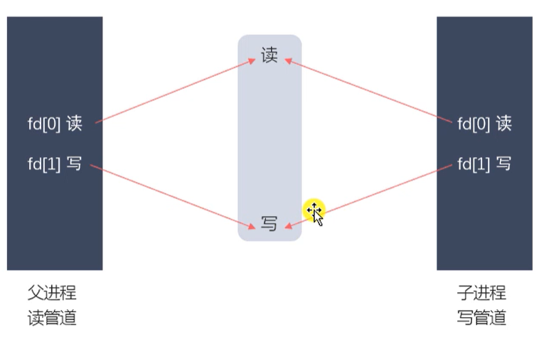
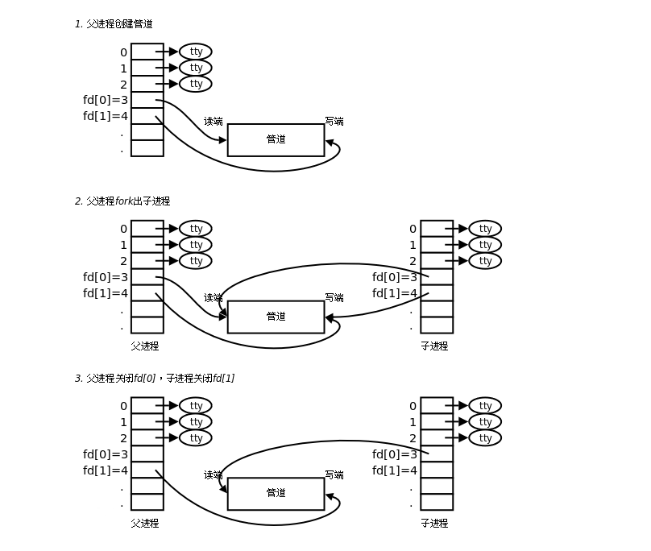
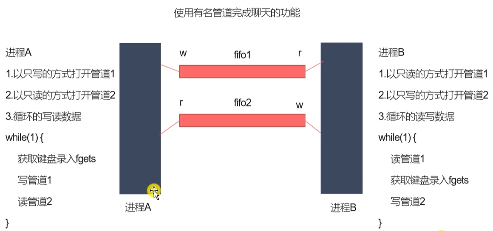

###### datetime:2023/01/09 11:40

###### author:nzb

# 进程间通信

## 1、进程间通信概念

- 进程是一个独立的资源分配单元，不同进程（这里所说的进程通常指的是用户进程）之间 的资源是独立的，没有关联，不能在一个进程中直接访问另一个进程的资源。
- 但是，进程不是孤立的，不同的进程需要进行信息的交互和状态的传递等，因此需要进程间通信（IPC： Inter Processes Communication ）
- 进程间通信的目的
    - 数据传输：一个进程需要将它的数据发送给另一个进程。
    - 通知事件：一个进程需要向另一个或一组进程发送消息，通知它（它们）发生了某种事件（如进程终止时要通知父进程）。
    - 资源共享：多个进程之间共享同样的资源。为了做到这一点，需要内核提供互斥和同步机制。
    - 进程控制：有些进程希望完全控制另一个进程的执行（如Debug进程），此时控制进程希望能够拦截另一个进程的所有陷入和异常，并能够及时知道它的状态改变。

## 2、进程通信的几种方式



进程同步与进程通信很容易混淆，它们的区别在于：

- 进程同步：控制多个进程按一定顺序执行；
- 进程通信：进程间传输信息。

进程通信是一种手段，而进程同步是一种目的。也可以说，为了能够达到进程同步的目的，需要让进程进行通信，传输一些进程同步所需要的信息。

* 1、管道(匿名管道)

    * 管道是通过调用 `pipe` 函数创建的，`fd[0]` 用于读，`fd[1]` 用于写。

    * 它具有以下限制：

        * 只支持半双工通信（单向交替传输）；

        * 只能在父子进程或者兄弟进程中使用。

* 2、FIFO(有名管道)  
  `命名管道，去除了管道只能在父子进程中使用的限制。常用于客户-服务器应用程序中，FIFO 用作汇聚点，在客户进程和服务器进程之间传递数据。`

* 3、信号
    - 信号一般用于一些异常情况下的进程间通信，是一种异步通信，它的数据结构一般就是一个数字。
    - 在`Linux`操作系统中，为了响应各种各样的事件，提供了几十种信号，分别代表不同的意义。我们可以通过`kill -l`命令，查看所有的信号。
    - 运行在`shell`终端的进程，我们可以通过键盘输入某些组合键的时候，给进程发送信号。例如
        - `Ctrl+C`产生 `SIGINT` 信号，表示终止该进程；
        - `Ctrl+Z`产生 `SIGTSTP` 信号，表示停止该进程，但还未结束；

    - 如果进程在后台运行，可以通过`kill`命令的方式给进程发送信号，但前提需要知道运行中的进程`PID`号，例如：
        - `kill -9 1050`，表示给`PID`为`1050`的进程发送 `SIGKILL` 信号，用来立即结束该进程（例如：在任务管理器右键结束进程）；
    - 所以，信号事件的来源主要有硬件来源(如键盘`Ctrl+C`)和软件来源(如`kill`命令)。
    - **信号是进程间通信机制中唯一的异步通信机制**
    - 进程需要为信号设置相应的监听处理，当收到特定信号时，执行相应的操作，类似很多编程语言里的通知机制。

* 4、消息队列

    * 相比于 `FIFO`，消息队列具有以下优点：

        * 可独立于读写进程存在，从而避免了 `FIFO` 中同步管道的打开和关闭时可能产生的困难；

        * 避免了 `FIFO` 的同步阻塞问题，不需要进程自己提供同步方法；

        * 读进程可以根据消息类型有选择地接收消息，而不像 `FIFO` 那样只能默认地接收。

* 5、信号量：`一个计数器，用于为多个进程提供对共享数据对象的访问。`

* 6、共享内存

    * 允许多个进程共享一个给定的存储区。因为数据不需要在进程之间复制，所以这是最快的一种 `IPC`。

    * 需要使用信号量用来同步对共享存储的访问。

    * 多个进程可以将同一个文件映射到它们的地址空间从而实现共享内存。另外 `XSI` 共享内存不是使用文件，而是使用内存的匿名段。

* 7、套接字(socket)：`用于不同机器间的进程通信`

## 3、匿名管道

- 管道也叫无名（匿名）管道，它是是`UNIX`系统`IPC` （进程间通信）的最古老形式， 所有的`UNIX`系统都支持这种通信机制。
- 统计一个目录中文件的数目命令：`ls | wc -l`,为了执行该命令，shell创建了两 个进程来分别执行`ls`和`wc`。



### 3.1、管道的特点

的进程可以读取任意大小的数据块，而不管写入进程写入管道的数据块的大小是多少。

- 管道其实是一个在内核内存中维护的缓冲器，这个缓冲器的存储能力是有限的，不同的操作系统大小不一定相同。
- 管道拥有文件的特质：读操作、写操作，匿名管道没有文件实例，有名管道有文件实体，但不存储数据。可以按照操作文件的方式对管道进行操作。
- 一个管道是一个字节流，使用管道时不存在消息或者消息边界的概念，从管道读取数据的进程可以读取任意大小的数据块，而不管写入进程写入管道的数据块的大小是多少。
- 通过管道传递的数据是顺序的，从管道中读取出来的字节的顺序和它们被写入管道的顺序是完全一样的。
- 在管道中的数据的传递方向是单向的，一端用于写入，一端用于读取，管道是半双工的。
- 从管道读数据是一次性操作，数据一旦被读走，它就从管道中被抛弃，释放空间以便写更多的数据，在管道中无法使用`lseek()`来随机的访问数据。
- 匿名管道只能在具有公共祖先的进程(父进程与子进程，或者两个兄弟进程，具有亲缘关系)之间使用。



### 3.2、为什么可以使用管道进行进程间通信？



### 3.3、管道的数据结构

逻辑上是环形的队列，实际数据结构不是环形的。



### 3.4、匿名管道的使用

- 创建匿名管道

```text
#include <unistd.h>
int pipe(int pipefd[2]);
```

- 查看管道缓存大小命令

```text
ulimit -a
```

- 查看管道缓存大小函数

```text
#include <unistd.h>
long fpathconf(int fd, int name);
```

```c++
/*
    #include <unistd.h>
    int pipe(int pipefd[2]);
        功能：创建一个匿名管道，用来进程间通信。
        参数：int pipefd[2] 这个数组是一个传出参数。
            pipefd[0] 对应的是管道的读端
            pipefd[1] 对应的是管道的写端
        返回值：
            成功 0
            失败 -1

    管道默认是阻塞的：如果管道中没有数据，read阻塞，如果管道满了，write阻塞

    注意：匿名管道只能用于具有关系的进程之间的通信（父子进程，兄弟进程）
*/

// 子进程发送数据给父进程，父进程读取到数据输出
#include <unistd.h>
#include <sys/types.h>
#include <stdio.h>
#include <stdlib.h>
#include <string.h>

int main() {

    // 在fork之前创建管道
    int pipefd[2];
    int ret = pipe(pipefd);
    if(ret == -1) {
        perror("pipe");
        exit(0);
    }

    // 创建子进程
    pid_t pid = fork();
    if(pid > 0) {
        // 父进程
        printf("i am parent process, pid : %d\n", getpid());

        // 关闭写端
        close(pipefd[1]);

        // 从管道的读取端读取数据
        char buf[1024] = {0};
        while(1) {
            int len = read(pipefd[0], buf, sizeof(buf));
            printf("parent recv : %s, pid : %d\n", buf, getpid());

            // 向管道中写入数据
            //char * str = "hello,i am parent";
            //write(pipefd[1], str, strlen(str));
            //sleep(1);
        }

    } else if(pid == 0){
        // 子进程
        printf("i am child process, pid : %d\n", getpid());
        // 关闭读端
        close(pipefd[0]);
        char buf[1024] = {0};
        while(1) {
            // 向管道中写入数据
            char * str = "hello,i am child";
            write(pipefd[1], str, strlen(str));
            //sleep(1);

            // int len = read(pipefd[0], buf, sizeof(buf));
            // printf("child recv : %s, pid : %d\n", buf, getpid());
            // bzero(buf, 1024);
        }

    }
    return 0;
}
```

```c++
#include <unistd.h>
#include <sys/types.h>
#include <stdio.h>
#include <stdlib.h>
#include <string.h>

int main() {

    int pipefd[2];

    int ret = pipe(pipefd);

    // 获取管道的大小
    long size = fpathconf(pipefd[0], _PC_PIPE_BUF);

    printf("pipe size : %ld\n", size);

    return 0;
}
```





### 3.5、匿名管道通信案例

```c++
/*
    实现 ps aux | grep xxx 父子进程间通信

    子进程： ps aux, 子进程结束后，将数据发送给父进程
    父进程：获取到数据，过滤
    pipe()
    execlp()
    子进程将标准输出 stdout_fileno 重定向到管道的写端。  dup2
*/

#include <unistd.h>
#include <sys/types.h>
#include <stdio.h>
#include <stdlib.h>
#include <string.h>
#include <wait.h>

int main() {

    // 创建一个管道
    int fd[2];
    int ret = pipe(fd);

    if(ret == -1) {
        perror("pipe");
        exit(0);
    }

    // 创建子进程
    pid_t pid = fork();

    if(pid > 0) {
        // 父进程
        // 关闭写端
        close(fd[1]);
        // 从管道中读取
        char buf[1024] = {0};

        int len = -1;
        while((len = read(fd[0], buf, sizeof(buf) - 1)) > 0) {
            // 过滤数据输出
            printf("%s", buf);
            memset(buf, 0, 1024);
        }

        wait(NULL);

    } else if(pid == 0) {
        // 子进程
        // 关闭读端
        close(fd[0]);

        // 文件描述符的重定向 stdout_fileno -> fd[1]
        dup2(fd[1], STDOUT_FILENO);
        // 执行 ps aux
        execlp("ps", "ps", "aux", NULL);
        perror("execlp");
        exit(0);
    } else {
        perror("fork");
        exit(0);
    }


    return 0;
}
```

### 3.6、管道的读写特点和管道设置为非阻塞的

- 管道的读写特点，使用管道时，需要注意以下几种特殊的情况（假设都是阻塞I/O操作）
    - 1.所有的指向管道写端的文件描述符都关闭了（管道写端引用计数为0），有进程从管道的读端 读数据，那么管道中剩余的数据被读取以后，再次read会返回0，就像读到文件末尾一样。

    - 2.如果有指向管道写端的文件描述符没有关闭（管道的写端引用计数大于0），而持有管道写端的进程 也没有往管道中写数据，这个时候有进程从管道中读取数据，那么管道中剩余的数据被读取后，
      再次read会阻塞，直到管道中有数据可以读了才读取数据并返回。

    - 3.如果所有指向管道读端的文件描述符都关闭了（管道的读端引用计数为0），这个时候有进程 向管道中写数据，那么该进程会收到一个信号`SIGPIPE`, 通常会导致进程异常终止。

    - 4.如果有指向管道读端的文件描述符没有关闭（管道的读端引用计数大于0），而持有管道读端的进程 也没有从管道中读数据，这时有进程向管道中写数据，那么在管道被写满的时候再次`write`会阻塞，
      直到管道中有空位置才能再次写入数据并返回。

- 总结
    - 读管道
        - 管道中有数据，read返回实际读到的字节数。
        - 管道中无数据：
            - 写端被全部关闭，read返回0（相当于读到文件的末尾）
            - 写端没有完全关闭，read阻塞等待

    - 写管道
        - 管道读端全部被关闭，进程异常终止（进程收到SIGPIPE信号）
        - 管道读端没有全部关闭：
            - 管道已满，write阻塞
            - 管道没有满，write将数据写入，并返回实际写入的字节数

```text
#include <unistd.h>
#include <sys/types.h>
#include <stdio.h>
#include <stdlib.h>
#include <string.h>
#include <fcntl.h>
/*
    设置管道非阻塞
    int flags = fcntl(fd[0], F_GETFL);  // 获取原来的flag
    flags |= O_NONBLOCK;            // 修改flag的值
    fcntl(fd[0], F_SETFL, flags);   // 设置新的flag
*/
int main() {

    // 在fork之前创建管道
    int pipefd[2];
    int ret = pipe(pipefd);
    if(ret == -1) {
        perror("pipe");
        exit(0);
    }

    // 创建子进程
    pid_t pid = fork();
    if(pid > 0) {
        // 父进程
        printf("i am parent process, pid : %d\n", getpid());

        // 关闭写端
        close(pipefd[1]);

        // 从管道的读取端读取数据
        char buf[1024] = {0};

        int flags = fcntl(pipefd[0], F_GETFL);  // 获取原来的flag
        flags |= O_NONBLOCK;            // 修改flag的值
        fcntl(pipefd[0], F_SETFL, flags);   // 设置新的flag

        while(1) {
            int len = read(pipefd[0], buf, sizeof(buf));
            printf("len : %d\n", len);
            printf("parent recv : %s, pid : %d\n", buf, getpid());
            memset(buf, 0, 1024);
            sleep(1);
        }

    } else if(pid == 0){
        // 子进程
        printf("i am child process, pid : %d\n", getpid());
        // 关闭读端
        close(pipefd[0]);
        char buf[1024] = {0};
        while(1) {
            // 向管道中写入数据
            char * str = "hello,i am child";
            write(pipefd[1], str, strlen(str));
            sleep(5);
        }

    }
    return 0;
}
```

## 4、有名管道介绍和使用

### 4.1、有名管道介绍

- 匿名管道，由于没有名字，只能用于亲缘关系的进程间通信。为了克服这个缺点，提出了有名管道(FIFO),也叫命名管道、FIFO文件。
- 有名管道(FIFO)不同于匿名管道之处在于它提供了一个路径名与之关联，以FIFO的文件形式存在于文件系统中，并且其打开方式与打开一个普通文件是一样的，
  这样即使与FIFO的创建进程不存在亲缘关系的进程，只要可以访问该路径，就能够彼此通过FIFO相互通信，因此，通过FIFO不相关的进程也能交换数据。
- 一旦打开了 FIFO,就能在它上面使用与操作匿名管道和其他文件的系统调用一样的`I/O`系统调用了(如`read()`、`write ()`和`close ()`)。与管道一样，FIFO也有一
  个写入端和读取端，并且从管道中读取数据的顺序与写入的顺序是一样的。FIFO的名称也由此而来：先入先出。
- 有名管道(FIFO)和匿名管道(pipe)有一些特点是相同的，不一样的地方在于
    - FIFO在文件系统中作为一个特殊文件存在，但FIFO中的内容却存放在内存中。
    - 当使用FIFO的进程退出后，FIFO文件将继续保存在文件系统中以便以后使用。
    - FIFO有名字，不相关的进程可以通过打开有名管道进行通信。

### 4.2、有名管道的使用

- 通过命令创建有名管道：`mkfifo名字`
- 通过函数创建有名管道

```text
#include <sys/types.h>
#include <sys/stat.h>
int mkfifo(const char *pathname, mode_t mode);
```

- 一旦使用 `mkfifo` 创建了一个FIFO,就可以使用`open`打开它，常见的文件 `I/O` 函数都可用于 `fifo` 如：`close`、`read`、`write`、`unlink` 等。
- FIFO严格遵循先进先出(First in First out),对管道及FIFO的读总是从开始处返回数据，对它们的写则把数据添加到末尾。它们不支持诸如`lseek()`等文件定位操作。

`mkfifo.c`

```c++
/*
    创建fifo文件
    1.通过命令： mkfifo 名字
    2.通过函数：int mkfifo(const char *pathname, mode_t mode);

    #include <sys/types.h>
    #include <sys/stat.h>
    int mkfifo(const char *pathname, mode_t mode);
        参数：
            - pathname: 管道名称的路径
            - mode: 文件的权限 和 open 的 mode 是一样的
                    是一个八进制的数
        返回值：成功返回0，失败返回-1，并设置错误号

*/

#include <stdio.h>
#include <sys/types.h>
#include <sys/stat.h>
#include <stdlib.h>
#include <unistd.h>

int main() {


    // 判断文件是否存在
    int ret = access("fifo1", F_OK);
    if(ret == -1) {
        printf("管道不存在，创建管道\n");

        ret = mkfifo("fifo1", 0664);

        if(ret == -1) {
            perror("mkfifo");
            exit(0);
        }

    }


    return 0;
}
```

`read.c`

```c++
#include <stdio.h>
#include <sys/types.h>
#include <sys/stat.h>
#include <stdlib.h>
#include <unistd.h>
#include <fcntl.h>

// 从管道中读取数据
int main() {

    // 1.打开管道文件
    int fd = open("test", O_RDONLY);
    if(fd == -1) {
        perror("open");
        exit(0);
    }

    // 读数据
    while(1) {
        char buf[1024] = {0};
        int len = read(fd, buf, sizeof(buf));
        if(len == 0) {
            printf("写端断开连接了...\n");
            break;
        }
        printf("recv buf : %s\n", buf);
    }

    close(fd);

    return 0;
}
```

`write.c`

```c++
#include <stdio.h>
#include <sys/types.h>
#include <sys/stat.h>
#include <stdlib.h>
#include <unistd.h>
#include <fcntl.h>
#include <string.h>

// 向管道中写数据
/*
    有名管道的注意事项：
        1.一个为只读而打开一个管道的进程会阻塞，直到另外一个进程为只写打开管道
        2.一个为只写而打开一个管道的进程会阻塞，直到另外一个进程为只读打开管道

    读管道：
        管道中有数据，read返回实际读到的字节数
        管道中无数据：
            管道写端被全部关闭，read返回0，（相当于读到文件末尾）
            写端没有全部被关闭，read阻塞等待

    写管道：
        管道读端被全部关闭，进行异常终止（收到一个SIGPIPE信号）
        管道读端没有全部关闭：
            管道已经满了，write会阻塞
            管道没有满，write将数据写入，并返回实际写入的字节数。
*/
int main() {

    // 1.判断文件是否存在
    int ret = access("test", F_OK);
    if(ret == -1) {
        printf("管道不存在，创建管道\n");

        // 2.创建管道文件
        ret = mkfifo("test", 0664);

        if(ret == -1) {
            perror("mkfifo");
            exit(0);
        }

    }

    // 3.以只写的方式打开管道
    int fd = open("test", O_WRONLY);
    if(fd == -1) {
        perror("open");
        exit(0);
    }

    // 写数据
    for(int i = 0; i < 100; i++) {
        char buf[1024];
        sprintf(buf, "hello, %d\n", i);
        printf("write data : %s\n", buf);
        write(fd, buf, strlen(buf));
        sleep(1);
    }

    close(fd);

    return 0;
}
```

### 4.3、有名管道实现简单版聊天功能



`chatA.c`

```c++
#include <stdio.h>
#include <unistd.h>
#include <sys/types.h>
#include <sys/stat.h>
#include <stdlib.h>
#include <fcntl.h>
#include <string.h>

int main() {

    // 1.判断有名管道文件是否存在
    int ret = access("fifo1", F_OK);
    if(ret == -1) {
        // 文件不存在
        printf("管道不存在，创建对应的有名管道\n");
        ret = mkfifo("fifo1", 0664);
        if(ret == -1) {
            perror("mkfifo");
            exit(0);
        }
    }

    ret = access("fifo2", F_OK);
    if(ret == -1) {
        // 文件不存在
        printf("管道不存在，创建对应的有名管道\n");
        ret = mkfifo("fifo2", 0664);
        if(ret == -1) {
            perror("mkfifo");
            exit(0);
        }
    }

    // 2.以只写的方式打开管道fifo1
    int fdw = open("fifo1", O_WRONLY);
    if(fdw == -1) {
        perror("open");
        exit(0);
    }
    printf("打开管道fifo1成功，等待写入...\n");
    // 3.以只读的方式打开管道fifo2
    int fdr = open("fifo2", O_RDONLY);
    if(fdr == -1) {
        perror("open");
        exit(0);
    }
    printf("打开管道fifo2成功，等待读取...\n");

    char buf[128];

    // 4.循环的写读数据
    while(1) {
        memset(buf, 0, 128);
        // 获取标准输入的数据
        fgets(buf, 128, stdin);
        // 写数据
        ret = write(fdw, buf, strlen(buf));
        if(ret == -1) {
            perror("write");
            exit(0);
        }

        // 5.读管道数据
        memset(buf, 0, 128);
        ret = read(fdr, buf, 128);
        if(ret <= 0) {
            perror("read");
            break;
        }
        printf("buf: %s\n", buf);
    }

    // 6.关闭文件描述符
    close(fdr);
    close(fdw);

    return 0;
}
```

`chatB.c`

```c++
#include <stdio.h>
#include <unistd.h>
#include <sys/types.h>
#include <sys/stat.h>
#include <stdlib.h>
#include <fcntl.h>
#include <string.h>

int main() {

    // 1.判断有名管道文件是否存在
    int ret = access("fifo1", F_OK);
    if(ret == -1) {
        // 文件不存在
        printf("管道不存在，创建对应的有名管道\n");
        ret = mkfifo("fifo1", 0664);
        if(ret == -1) {
            perror("mkfifo");
            exit(0);
        }
    }

    ret = access("fifo2", F_OK);
    if(ret == -1) {
        // 文件不存在
        printf("管道不存在，创建对应的有名管道\n");
        ret = mkfifo("fifo2", 0664);
        if(ret == -1) {
            perror("mkfifo");
            exit(0);
        }
    }

    // 2.以只读的方式打开管道fifo1
    int fdr = open("fifo1", O_RDONLY);
    if(fdr == -1) {
        perror("open");
        exit(0);
    }
    printf("打开管道fifo1成功，等待读取...\n");
    // 3.以只写的方式打开管道fifo2
    int fdw = open("fifo2", O_WRONLY);
    if(fdw == -1) {
        perror("open");
        exit(0);
    }
    printf("打开管道fifo2成功，等待写入...\n");

    char buf[128];

    // 4.循环的读写数据
    while(1) {
        // 5.读管道数据
        memset(buf, 0, 128);
        ret = read(fdr, buf, 128);
        if(ret <= 0) {
            perror("read");
            break;
        }
        printf("buf: %s\n", buf);

        memset(buf, 0, 128);
        // 获取标准输入的数据
        fgets(buf, 128, stdin);
        // 写数据
        ret = write(fdw, buf, strlen(buf));
        if(ret == -1) {
            perror("write");
            exit(0);
        }
    }

    // 6.关闭文件描述符
    close(fdr);
    close(fdw);

    return 0;
}
```
