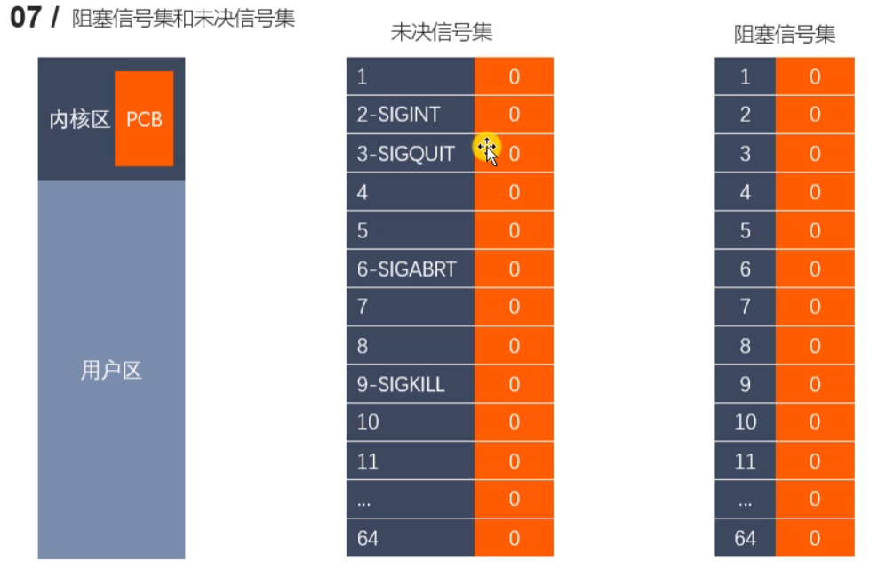

###### datetime:2023/01/09 11:40

###### author:nzb

# 进程间通信

## 6、信号

### 概述

- 信号是Linux进程间通信的最古老的方式之一，是事件发生时对进程的通知机制，有时也称之为软件中断，它是在软件层次上对中断机制的一种模拟，
  是一种异步通信的方式。信号可以导致一个正在运行的进程被另一个正在运行的异步进程中断，转而处理某一个突发事件
- 发往进程的诸多信号，通常都是源于内核。引发内核为进程产生信号的各类事件如下：
    - 对于前台进程，用户可以通过输入特殊的终端字符来给它发送信号。比如输入`Ctrl+C`通常会给进程发送一个中断信号。
    - 硬件发生异常，即硬件检测到一个错误条件并通知内核，随即再由内核发送相应信号给相关进程。比如执行一条异常的机器语言指令，诸如被0除，或者引用了无法访问的内存区域。
    - 系统状态变化，比如`alarm`定时器到期将引起`SIGALRM`信号，进程执行的`CPU`时间超限，或者该进程的某个子进程退出。
    - 运行`kill`命令或调用`kill`函数。

### 使用信号的两个主要目的是

- 让进程知道已经发生了一个特定的事情。
- 强迫进程执行它自己代码中的信号处理程序。

### 信号的特点

- 简单
- 不能携带大量信息
- 满足某个特定条件才发送
- 优先级比较高

### LUNIX信号一览表(加粗牢记)

|  编号 | 信号名称 | 对应事件 | 默认动作 |
|  ----- | ----- | ----- | ----- |
|  1 | SIGHUP | 用户退出shell时，由该shell启动的所有进程将 收到这个信号 | 终止进程(A) | 
|  2 | **SIGINT** | 当用户按下了＜Ctrl+C＞组合键时，用户终端向正在运行中的该终端后动的程序发出此信号 | 终止进程(A) | 
|  3 | **SIGQUIT** | 用户按下＜Ctrl+\＞组合键时产生该信号，用户终端向正在运行中的由该终端启动的程序发出些信号 | 终止进程(C) | 
|  4 | SIGILL | CPU检测到某进程执行了非法指令 | 终止进程并产生core文件(C) | 
|  5 | SIGTRAP | 该信号由断点指令或其他trap指令产生 | 终止进程并产生core文件 | 
|  6 | SIGABRT | 调用abort函数时产生该信号 | 终止进程并产生core文件(C) | 
|  7 | SIGBUS | 非法访问内存地址，包括内存对齐出错 | 终止进程并产生core文件 | 
|  8 | SIGFPE | 在发生致命的运算错误时发出。不仅包括浮点运算 错误，还包括溢出及除数为0等所有的算法错误 | 终止进程并产生core文件(C) |
|  9 | **SIGKILL** | 无条件终止进程。该信号不能被忽略，处理和阻塞 | 终止进程，可以杀死任何进程(AEF) | 
|  10 | SIGUSE1 | 用户定义的信号。即程序员可以在程序中定义并使用该信号 | 终止进程(A) | 
|  11 | **SIGSEGV** | 指示进程进行了无效内存访问（段错误） | 终止进程并产生core文件(C) | 
|  12 | SIGUSR2 | 另外一个用户自定义信号，程序员可以在程序中 定义并使用该信号 | 终止进程(A) | 
|  13 | **SIGPIPE** | Broken pipe向一个没有读端的管道写数据 | 终止进程(A) | 
|  14 | SIGALRM | 定时器超时，超时的时间由系统调用alarm设置 | 终止进程(A) | 
|  15 | SIGTERM | 程序结束信号，与SIGKILL不同的是，该信号可 以被阻塞和终止。通常用来要示程序正常退出。 执行shell命令Kill时，缺省产生这个信号 | 终止进程(A) | 
|  16 | SIGSTKFLT | Linux早期版本出现的信号，现仍保留向后兼容 | 终止进程(A) |
|  17 | **SIGCHLD** | 子进程结束时，父进程会收到这个信号 | 忽略这个信号(B) | 
|  18 | **SIGCONT** | 如果进程已停止，则使其继续运行 | 继续/忽略(D) | 
|  19 | **SIGSTOP** | 停止进程的执行。信号不能被忽略，处理和阻塞 | 为终止进程 | 
|  20 | SIGTSTP | 停止终端交互进程的运行。按下＜ctrl+z＞组合键时发出这个信号 | 暂停进程(D) | 
|  21 | SIGTTIN | 后台进程读终端控制台 | 暂停进程(D) | 
|  22 | SIGTTOU | 该信号类似于SIGTTIN,在后台进程要向终端输出数据时发生 | 暂停进程(D) | 
|  23 | SIGURG | 套接字上有紧急数据时，向当前正在运行的进程发出些信号，报告有紧急数据到达。如网络带外数据到达 | 忽略该信号 | 
|  24 | SIGXCPU | 进程执行时间超过了分配给该进程的CPU时间，系统产生该信号并 发送给该进程 | 终止进程 | 

默认动作字母含义

- A：默认动作是终止进程
- B：默认动作是忽略此信号，将该信号丢弃，不做处理
- C：默认的动作是终止进程并进行内核映像转储（core dump)
  ，内核映像转储将进程数据在内存的映像和进程在内核结构中的部分内容以一定格式转储到文件系统，并且进程退出执行，这样做的好处是为程序员提供了方便，使得他们可以得到进程当时执行时的数据值，允许他们确定转储的原因，并且可以调试他们的程序。
- D：默认动作是停止(暂停)进程，进入停止状态以后还能重新进行下去
- E：信号不能被捕获
- F：信号不能被忽略

### 信号的5种默认处理动作

- 查看信号的详细信息：man 7 signal
- 查看系统定义的信号列表：`kill -l`
- 前31个信号为常规信号，其余为实时信号。
- 信号的5中默认处理动作
    - Term 终止进程
    - Ign 当前进程忽略掉这个信号
    - Core 终止进程，并生成一个Core文件
    - Stop 暂停当前进程
    - Cont 继续执行当前被暂停的进程
- 信号的几种状态：**产生、未决、递达**
- SIGKILL和SIGSTOP信号不能被捕捉、阻塞或者忽略，只能执行默认动作。

### kill、raise、abort函数

- `int kill(pid_t pid, int sig);`
    - 功能：给任何的进程或者进程组pid, 发送任何的信号 sig
    - 参数：
        - pid ：
            - `> 0`: 将信号发送给指定的进程
            - `= 0`: 将信号发送给当前的进程组
            - `= -1`: 将信号发送给每一个有权限接收这个信号的进程
            - `< -1`: 这个pid=某个进程组的ID取反 （-12345）
        - sig : 需要发送的信号的编号或者是宏值，0表示不发送任何信号
        - 示例
            - `kill(getppid(), 9);`
            - `kill(getpid(), 9);`

- `int raise(int sig);`
    - 功能：给当前进程发送信号
    - 参数：
        - sig : 要发送的信号
    - 返回值：
        - 成功 0
        - 失败 非0
    - 示例：`kill(getpid(), sig);`

- `void abort(void);`
    - 功能： 发送SIGABRT信号给当前的进程，杀死当前进程
    - 示例：`kill(getpid(), SIGABRT);`

```c++
#include <stdio.h>
#include <sys/types.h>
#include <signal.h>
#include <unistd.h>

int main() {

    pid_t pid = fork();

    if(pid == 0) {
        // 子进程
        int i = 0;
        for(i = 0; i < 5; i++) {
            printf("child process\n");
            sleep(1);
        }

    } else if(pid > 0) {
        // 父进程
        printf("parent process\n");
        sleep(2);
        printf("kill child process now\n");
        kill(pid, SIGINT);
    }

    return 0;
}
```

### 可靠信号与不可靠信号

- 信号分为不可靠信号(1-32)与不可靠信号(34-64)
- 不可靠信号有以下问题
    - 每次信号处理完之后，就会恢复成默认处理（早期的signal函数，Linux2.6.35.6内核经验证已经不再恢复默认动作）
    - 存在信号丢失的问题（进程收到的信号不作排队处理，相同的信号多次到来会合并为一个）
- 现在的Linux对信号进行了改进，因此，不可靠信号主要是指信号丢失

### 信号处理函数被中断

当一个信号到达后，调用处理函数，如果这时候有其它的信号发生，会中断之前的处理函数，等新的信息处理函数执行完成后再继续执行之前的处理函数

但是，同一个信号会排队阻塞

### 信号的阻塞

- 如果不希望在接到信号时中断当前的处理函数，也不希望忽略该信号，而是延时一段时间再处理这个信号，这种情况可以通过阻塞信号实现的
- 信号的阻塞和忽略信号是不同的，被阻塞的信号也不会影响进程的行为，信号只是暂时被阻止传递
- 进程忽略一个信号时，信号会被传递出去但进程会将信号丢弃
- 执行信号的处理动作称为信号递达（Delivery），信号从产生到递达之间的状态，称为信号未决（Pending）

### alarm函数

- `unsigned int alarm(unsigned int seconds);`
    - 功能：设置定时器（闹钟）。函数调用，开始倒计时，当倒计时为0的时候，函数会给当前的进程发送一个信号：`SIGALARM`
    - 参数：
        - seconds: 倒计时的时长，单位：秒。如果参数为0，定时器无效（不进行倒计时，不发信号）。取消一个定时器，通过`alarm(0)`。
    - 返回值：
        - 之前没有定时器，返回0
        - 之前有定时器，返回之前的定时器剩余的时间

- `SIGALARM` ：默认终止当前的进程，每一个进程都有且只有唯一的一个定时器。
    - `alarm(10);`  -> 返回0
    - 过了1秒
    - `alarm(5);`   -> 返回9
- `alarm(100)` -> 该函数是不阻塞的

```c++
#include <stdio.h>
#include <unistd.h>

int main() {

    int seconds = alarm(5);
    printf("seconds = %d\n", seconds);  // 0

    sleep(2);
    seconds = alarm(2);    // 不阻塞
    printf("seconds = %d\n", seconds);  // 3

    while(1) {
    }

    return 0;
}
```

```c++
// 1秒钟电脑能数多少个数？
#include <stdio.h>
#include <unistd.h>

/*
    实际的时间 = 内核时间 + 用户时间 + 消耗的时间
    进行文件IO操作的时候比较浪费时间

    定时器，与进程的状态无关（自然定时法）。无论进程处于什么状态，alarm都会计时。
*/

int main() {

    alarm(1);

    int i = 0;
    while(1) {
        printf("%i\n", i++);
    }

    return 0;
}
```

### setitimer定时器函数

- `int setitimer(int which, const struct itimerval *new_value, struct itimerval *old_value);`
    - 功能：设置定时器（闹钟）。可以替代`alarm`函数。精度微妙us，可以实现周期性定时
    - 参数：
        - which : 定时器以什么时间计时
            - `ITIMER_REAL`: 真实时间，时间到达，发送 `SIGALRM`   常用
            - `ITIMER_VIRTUAL`: 用户时间，时间到达，发送 `SIGVTALRM`
            - `ITIMER_PROF`: 以该进程在用户态和内核态下所消耗的时间来计算，时间到达，发送 `SIGPROF`

        - new_value: 设置定时器的属性
            ```c++
            struct itimerval {      // 定时器的结构体
                struct timeval it_interval;  // 每个阶段的时间，间隔时间
                struct timeval it_value;     // 延迟多长时间执行定时器
            };
          
            struct timeval {        // 时间的结构体
                time_t      tv_sec;     //  秒数
                suseconds_t tv_usec;    //  微秒
            };
            ```

        - 过10秒后，每个2秒定时一次

        - old_value：记录上一次的定时的时间参数，一般不使用，指定NULL

    - 返回值：
        - 成功 0
        - 失败 -1 并设置错误号

```c++
#include <sys/time.h>
#include <stdio.h>
#include <stdlib.h>

// 过3秒以后，每隔2秒钟定时一次
int main() {

    struct itimerval new_value;

    // 设置间隔的时间
    new_value.it_interval.tv_sec = 2;
    new_value.it_interval.tv_usec = 0;

    // 设置延迟的时间,3秒之后开始第一次定时
    new_value.it_value.tv_sec = 3;
    new_value.it_value.tv_usec = 0;


    int ret = setitimer(ITIMER_REAL, &new_value, NULL); // 非阻塞的
    printf("定时器开始了...\n");

    if(ret == -1) {
        perror("setitimer");
        exit(0);
    }

    getchar();

    return 0;
}
```

### signal信号捕捉函数

- `typedef void (*sighandler_t)(int);`
- `sighandler_t signal(int signum, sighandler_t handler)`：设置程序对信号的处理方式
    - signum：表示信号的编号
    - handler：信号的处理方式，有以下三种
        - SIG_IGN：忽略参数 signum 所指的信号
        - 回调函数: 一个自定义的处理信号的函数，信号的编号为这个自定义函数的参数
            - 需要程序员实现，提前准备好的，函数的类型根据实际需求，看函数指针的定义
            - 不是程序员调用，而是当信号产生，由内核调用
            - 函数指针是实现回调的手段，函数实现之后，将函数名放到函数指针的位置就可以了。
        - SIG_DFL：恢复参数signum所指信号的处理方法为默认值
    - 返回值：
        - 成功，返回上一次注册的信号处理函数的地址。第一次调用返回NULL
        - 失败，返回SIG_ERR，设置错误号
    - `SIGKILL`、`SIGSTOP`不能被捕捉，不能被忽略。

```c++
#include <sys/time.h>
#include <stdio.h>
#include <stdlib.h>
#include <signal.h>

void myalarm(int num) {
    printf("捕捉到了信号的编号是：%d\n", num);
    printf("xxxxxxx\n");
}

// 过3秒以后，每隔2秒钟定时一次
int main() {

    // 注册信号捕捉
    // signal(SIGALRM, SIG_IGN);
    // signal(SIGALRM, SIG_DFL);
    // void (*sighandler_t)(int); 函数指针，int类型的参数表示捕捉到的信号的值。
    signal(SIGALRM, myalarm);

    struct itimerval new_value;

    // 设置间隔的时间
    new_value.it_interval.tv_sec = 2;
    new_value.it_interval.tv_usec = 0;

    // 设置延迟的时间,3秒之后开始第一次定时
    new_value.it_value.tv_sec = 3;
    new_value.it_value.tv_usec = 0;

    int ret = setitimer(ITIMER_REAL, &new_value, NULL); // 非阻塞的
    printf("定时器开始了...\n");

    if(ret == -1) {
        perror("setitimer");
        exit(0);
    }

    getchar();

    return 0;
}
```

### 信号集及相关函数

#### 信号集

- 许多信号相关的系统调用都需要能表示一组不同的信号，多个信号可使用一个称之为信号集的数据结构来表示，其系统数据类型为`sigset_t`
- 在`PCB`中有两个非常重要的信号集。一个称之为”阻塞信号集”,另一个称之为”未决信号集”。这两个信号集都是内核使用位图机制来实现的。
  但操作系统不允许我们直接对这两个信号集进行位操作。而需自定义另外一个集合，借助信号集操作函数来对PCB中的这两个信号集进行修改；
- 信号的“未决”是一种状态，指的是从信号的产生到信号被处理前的这一段时间。
- 信号的"阻塞”是一个开关动作，指的是阻止信号被处理，但不是阻止信号产生。
- 信号的阻塞就是让系统暂时保留信号留待以后发送。由于另外有办法让系统忽略信号,所以一般情况下信号的阻塞只是暂时的，只是为了防止信号打断敏感的操作。

#### 阻塞信号集和未决信号集



- 1.用户通过键盘 `Ctrl + C`, 产生2号信号`SIGINT` (信号被创建)

- 2.信号产生但是没有被处理 （未决）
    - 在内核中将所有的没有被处理的信号存储在一个集合中 （未决信号集）
    - `SIGINT`信号状态被存储在第二个标志位上
    - 这个标志位的值为0， 说明信号不是未决状态
    - 这个标志位的值为1， 说明信号处于未决状态

- 3.这个未决状态的信号，需要被处理，处理之前需要和另一个信号集（阻塞信号集），进行比较
    - 阻塞信号集默认不阻塞任何的信号
    - 如果想要阻塞某些信号需要用户调用系统的API

- 4.在处理的时候和阻塞信号集中的标志位进行查询，看是不是对该信号设置阻塞了
    - 如果没有阻塞，这个信号就被处理
    - 如果阻塞了，这个信号就继续处于未决状态，直到阻塞解除，这个信号就被处理

#### 信号集相关的函数

- `int sigemptyset(sigset_t *set);`
    - 功能：清空信号集中的数据,将信号集中的所有的标志位置为0
    - 参数：
        - set：传出参数，需要操作的信号集
    - 返回值：
        - 成功返回0
        - 失败返回-1

- `int sigfillset(sigset_t *set);`
    - 功能：将信号集中的所有的标志位置为1
    - 参数：
        - set：传出参数，需要操作的信号集
    - 返回值：
        - 成功返回0
        - 失败返回-1

- `int sigaddset(sigset_t *set, int signum);`
    - 功能：设置信号集中的某一个信号对应的标志位为1，表示阻塞这个信号
    - 参数：
        - set：传出参数，需要操作的信号集
        - signum：需要设置阻塞的那个信号
    - 返回值：
        - 成功返回0
        - 失败返回-1

- `int sigdelset(sigset_t *set, int signum);`
    - 功能：设置信号集中的某一个信号对应的标志位为0，表示不阻塞这个信号
    - 参数：
        - set：传出参数，需要操作的信号集
        - signum：需要设置不阻塞的那个信号
    - 返回值：
        - 成功返回0
        - 失败返回-1

- `int sigismember(const sigset_t *set, int signum);`
    - 功能：判断某个信号是否阻塞
    - 参数：
        - set：需要操作的信号集
        - signum：需要判断的那个信号
    - 返回值：
        - 1 ： signum被阻塞
        - 0 ： signum不阻塞
        - -1 ： 失败

```c++
#include <signal.h>
#include <stdio.h>

int main() {

    // 创建一个信号集
    sigset_t set;

    // 清空信号集的内容
    sigemptyset(&set);

    // 判断 SIGINT 是否在信号集 set 里
    int ret = sigismember(&set, SIGINT);
    if(ret == 0) {
        printf("SIGINT 不阻塞\n");
    } else if(ret == 1) {
        printf("SIGINT 阻塞\n");
    }

    // 添加几个信号到信号集中
    sigaddset(&set, SIGINT);
    sigaddset(&set, SIGQUIT);

    // 判断SIGINT是否在信号集中
    ret = sigismember(&set, SIGINT);
    if(ret == 0) {
        printf("SIGINT 不阻塞\n");
    } else if(ret == 1) {
        printf("SIGINT 阻塞\n");
    }

    // 判断SIGQUIT是否在信号集中
    ret = sigismember(&set, SIGQUIT);
    if(ret == 0) {
        printf("SIGQUIT 不阻塞\n");
    } else if(ret == 1) {
        printf("SIGQUIT 阻塞\n");
    }

    // 从信号集中删除一个信号
    sigdelset(&set, SIGQUIT);

    // 判断SIGQUIT是否在信号集中
    ret = sigismember(&set, SIGQUIT);
    if(ret == 0) {
        printf("SIGQUIT 不阻塞\n");
    } else if(ret == 1) {
        printf("SIGQUIT 阻塞\n");
    }

    return 0;
}
```

#### sigprocmask函数使用

- `int sigprocmask(int how, const sigset_t *set, sigset_t *oldset);`
    - 功能：将自定义信号集中的数据设置到内核中（设置阻塞，解除阻塞，替换）
    - 参数：
        - how : 如何对内核阻塞信号集进行处理
            - `SIG_BLOCK`: 将用户设置的阻塞信号集添加到内核中，内核中原来的数据不变 假设内核中默认的阻塞信号集是`mask`， `mask | set`
            - `SIG_UNBLOCK`: 根据用户设置的数据，对内核中的数据进行解除阻塞 `mask &= ~set`
            - `SIG_SETMASK`: 覆盖内核中原来的值

        - set ：已经初始化好的用户自定义的信号集
        - oldset : 保存设置之前的内核中的阻塞信号集的状态，可以是 NULL
    - 返回值：
        - 成功：0
        - 失败：-1，设置错误号：`EFAULT`、`EINVAL`

- `int sigpending(sigset_t *set);`
    - 功能：获取内核中的未决信号集
    - 参数：
        - set：传出参数，保存的是内核中的未决信号集中的信息。

```c++
// 编写一个程序，把所有的常规信号（1-31）的未决状态打印到屏幕
// 设置某些信号是阻塞的，通过键盘产生这些信号

#include <stdio.h>
#include <signal.h>
#include <stdlib.h>
#include <unistd.h>

int main() {

    // 设置2、3号信号阻塞
    sigset_t set;
    sigemptyset(&set);
    // 将2号和3号信号添加到信号集中
    sigaddset(&set, SIGINT);
    sigaddset(&set, SIGQUIT);

    // 修改内核中的阻塞信号集
    sigprocmask(SIG_BLOCK, &set, NULL);

    int num = 0;

    while(1) {
        num++;
        // 获取当前的未决信号集的数据
        sigset_t pendingset;
        sigemptyset(&pendingset);
        sigpending(&pendingset);

        // 遍历前32位
        for(int i = 1; i <= 31; i++) {
            if(sigismember(&pendingset, i) == 1) {
                printf("1");
            }else if(sigismember(&pendingset, i) == 0) {
                printf("0");
            }else {
                perror("sigismember");
                exit(0);
            }
        }

        printf("\n");
        sleep(1);
        if(num == 10) {
            // 解除阻塞
            sigprocmask(SIG_UNBLOCK, &set, NULL);
        }

    }


    return 0;
}
```

### SIGCHLG信号

```c++
/*
    SIGCHLD信号产生的3个条件：
        1.子进程结束
        2.子进程暂停了
        3.子进程继续运行
        都会给父进程发送该信号，父进程默认忽略该信号。

    使用SIGCHLD信号解决僵尸进程的问题。
*/

#include <stdio.h>
#include <unistd.h>
#include <sys/types.h>
#include <sys/stat.h>
#include <signal.h>
#include <sys/wait.h>

void myFun(int num) {
    printf("捕捉到的信号 ：%d\n", num);
    // 回收子进程PCB的资源
    // while(1) {
    //     wait(NULL);
    // }
    while(1) {
       int ret = waitpid(-1, NULL, WNOHANG);
       if(ret > 0) {
           printf("child die , pid = %d\n", ret);
       } else if(ret == 0) {
           // 说明还有子进程或者
           break;
       } else if(ret == -1) {
           // 没有子进程
           break;
       }
    }
}

int main() {

    // 提前设置好阻塞信号集，阻塞SIGCHLD，因为有可能子进程很快结束，父进程还没有注册完信号捕捉
    sigset_t set;
    sigemptyset(&set);
    sigaddset(&set, SIGCHLD);
    sigprocmask(SIG_BLOCK, &set, NULL);

    // 创建一些子进程
    pid_t pid;
    for(int i = 0; i < 20; i++) {
        pid = fork();
        if(pid == 0) {
            break;
        }
    }

    if(pid > 0) {
        // 父进程

        // 捕捉子进程死亡时发送的SIGCHLD信号
        struct sigaction act;
        act.sa_flags = 0;
        act.sa_handler = myFun;
        sigemptyset(&act.sa_mask);
        sigaction(SIGCHLD, &act, NULL);

        // 注册完信号捕捉以后，解除阻塞
        sigprocmask(SIG_UNBLOCK, &set, NULL);

        while(1) {
            printf("parent process pid : %d\n", getpid());
            sleep(2);
        }
    } else if( pid == 0) {
        // 子进程
        printf("child process pid : %d\n", getpid());
    }

    return 0;
}
```