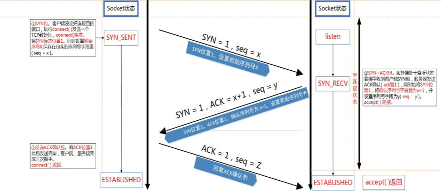

###### datetime:2022/12/19 19:31

###### author:nzb

# 数据类型和相关的库函数

## 1、结构体

```c++
struct sockaddr {
    unsigned short sa_family;       // 2字节地址类型， AF_xxx
    char sa_data[14];               // 14字节的端口和地址
};

struct in_addr {
    unsigned long s_addr;           // 4字节地址，为什么不直接放sockaddr_in，可能是为了扩展性
};

// 上面的sockaddr不好操作，所以提供了sockaddr_in，地址和端口分开了
struct sockaddr_in {
    short int sin_family;           // 2字节地址类型
    unsigned short int sin_port;    // 2字节端口号
    struct in_addr sin_addr;        // 4字节地址
    unsigned char sin_zero[8];      // 为了保持与 struct sockaddr 一样的长度，方便强制转换
};

struct hostent {
    char	*h_name;        // 主机名
    char	**h_aliases;    // 主机所有别名构成的字符串数组，统一IP可绑定多个域名
    short	h_addrtype;     // 主机IP地址的类型，例如IPV4(AF_INET)还是IPV6
    short	h_length;       // 主机IP地址长度，IPV4地址为4, IPV6地址则为16
    char	**h_addr_list;  // 主机的IP地址，以网络字节序存储
};

#define h_addr h_addr_list[0] /* for backward compatibility */

// gethostbyname函数可以利用字符串格式的域名获得IP网络字节顺序地址
struct hostent *gethostbyname(const char * name);

// 将一个字符串IP地址转换为一个32位的网络字节序IP地址，如果这个函数成功，函数的返回值非零，如果输入地址不正确则会返回零，使用这个函数并没有错误码存放在 *errno中，所以它的值会被忽略
int inet_aton(const char *cp, struct  in_addr *inp);

// 把网络字节序IP地址转换成字符串的IP地址
char *inet_ntoa(struct in_addr in);

in_addr_t inet_addr(const char *cp);
```

## 2、库函数

### 2.1、socket函数

socket函数用于创建一个新的socket，也就是向系统申请一个socket资源。socket函数用户客户端和服务端。

函数声明：`int socket(int domain, int type, int protocol);`

参数说明

- `domain`：协议域，又称协议族（family）。常用的协议族有`AF_INET`、`AF_INET6`、`AF_LOCAL`（或称`AF_UNIX`，`Unix`域`Socket`）、`AF_ROUTE`
  等。协议族决定了socket的地址类型，在通信中必须采用对应的地址，如AF_INET决定了要用ipv4地址（32位的）与端口号（16位的）的组合、AF_UNIX决定了要用一个绝对路径名作为地址。
- `type`
  ：指定socket类型。常用的socket类型有SOCK_STREAM、SOCK_DGRAM、SOCK_RAW、SOCK_PACKET、SOCK_SEQPACKET等。流式socket（SOCK_STREAM）是一种面向连接的socket，针对于面向连接的TCP服务应用。数据报式socket（SOCK_DGRAM）是一种无连接的socket，对应于无连接的UDP服务应用。
- `protocol`：指定协议。常用协议有`IPPROTO_TCP`、`IPPROTO_UDP`、`IPPROTO_STCP`、`IPPROTO_TIPC`等，分别对应TCP传输协议、UDP传输协议、STCP传输协议、TIPC传输协议。
- 第一个参数只能填AF_INET，第二个参数只能填SOCK_STREAM，第三个参数只能填0。
- 除非系统资料耗尽，socket函数一般不会返回失败。
- 返回值：成功则返回一个socket，失败返回-1，错误原因存于errno 中。

> 面试问题： 在一个程序里面最多打开多少个文件数？
>
> 答案：1024个。可以搜索“linux一般打开文件的数量”。

### 2.2、gethostbyname函数

把ip地址或域名转换为hostent 结构体表达的地址。

函数声明：`struct hostent *gethostbyname(const char *name);`

- 参数name，域名或者主机名，例如"192.168.1.3"、"www.freecplus.net"等。
- 返回值：如果成功，返回一个hostent结构指针，失败返回NULL。
- gethostbyname只用于客户端。
- gethostbyname只是把字符串的ip地址转换为结构体的ip地址，只要地址格式没错，一般不会返回错误。失败时不会设置errno的值。

### 2.3、connect函数

向服务器发起连接请求。

函数声明：`int connect(int sockfd, struct sockaddr * serv_addr, int addrlen);`

函数说明

- connect函数用于将参数sockfd 的socket 连至参数serv_addr 指定的服务端，参数addrlen为sockaddr的结构长度。
- 返回值：成功则返回0，失败返回-1，错误原因存于errno 中。
- connect函数只用于客户端。
- 如果服务端的地址错了，或端口错了，或服务端没有启动，connect一定会失败。

### 2.4、bind函数

服务端把用于通信的地址和端口绑定到socket上。

函数声明: `int bind(int sockfd, const struct sockaddr *addr,socklen_t addrlen);`

- 参数sockfd，需要绑定的socket。
- 参数addr，存放了服务端用于通信的地址和端口。
- 参数addrlen表示addr结构体的大小。
- 返回值：成功则返回0，失败返回-1，错误原因存于errno 中。
- 如果绑定的地址错误，或**端口已被占用**，bind函数一定会报错，否则一般不会返回错误。

> 设置服务端socket的SO_REUSEADDR属性
>
> 服务端程序的端口释放后可能会处于TIME_WAIT状态，等待两分钟之后才能再被使用，SO_REUSEADDR是让端口释放后立即就可以被再次利用。
> ```text
> //设置SO_REUSEADDR选项
> int opt=1;unsigned int len = sizeof(opt);
> setsockopt(listenfd, SOL_SOCKET, SO_REUSEADDR, &opt, len);
> ```

### 2.5、listen函数

listen函数把主动连接socket变为被动连接的socket，使得这个socket可以接受其它socket的连接请求，从而成为一个服务端的socket。

函数声明: `int listen(int sockfd, int backlog);`

- 参数sockfd是已经被bind过的socket。socket函数返回的socket是一个主动连接的socket，在服务端的编程中，
  程序员希望这个socket可以接受外来的连接请求，也就是被动等待客户端来连接。由于系统默认时认为一个socket是主动连接的，所以需要通过某种方式来告诉系统， 程序员通过调用listen函数来完成这件事。
- 参数backlog，这个参数涉及到一些网络的细节，比较麻烦，填5、10都行，一般不超过30。
- 当调用listen之后，服务端的socket就可以调用accept来接受客户端的连接请求。
- 返回值：成功则返回0，失败返回-1，错误原因存于errno 中。
- listen函数一般不会返回错误。

### 2.6、accept函数

服务端接受客户端的连接。

函数声明: `int accept(int sockfd,struct sockaddr *addr,socklen_t *addrlen);`

- 参数sockfd是已经被listen过的socket。
- 参数addr用于存放客户端的地址信息，用sockaddr结构体表达，如果不需要客户端的地址，可以填0。
- 参数addrlen用于存放addr参数的长度，如果addr为0，addrlen也填0。
- accept函数等待客户端的连接，如果没有客户端连上来，它就一直等待，这种方式称之为阻塞。
- accept等待到客户端的连接后，创建一个新的socket，函数返回值就是这个新的socket，服务端使用这个新的socket和客户端进行报文的收发。
- 返回值：成功则返回0，失败返回-1，错误原因存于errno 中。
- accept在等待的过程中，如果被中断或其它的原因，函数返回-1，表示失败，如果失败，可以重新accept。

### 2.7、send函数

send函数用于把数据通过socket发送给对端。不论是客户端还是服务端，应用程序都用send函数来向TCP连接的另一端发送数据。

函数声明：`ssize_t send(int sockfd, const void *buf, size_t len, int flags);`

- sockfd为已建立好连接的socket。
- buf为需要发送的数据的内存地址，可以是C语言基本数据类型变量的地址，也可以数组、结构体、字符串，内存中有什么就发送什么。
- len需要发送的数据的长度，为buf中有效数据的长度。
- flags填0, 其他数值意义不大。
- 函数返回已发送的字符数。出错时返回-1，错误信息errno被标记。
- 注意，就算是网络断开，或socket已被对端关闭，send函数不会立即报错，要过几秒才会报错。 如果send函数返回的错误（<=0），表示通信链路已不可用。

### 2.8、recv函数

recv函数用于接收对端socket发送过来的数据。

recv函数用于接收对端通过socket发送过来的数据。不论是客户端还是服务端，应用程序都用recv函数接收来自TCP连接的另一端发送过来数据。

函数声明：`ssize_t recv(int sockfd, void *buf, size_t len, int flags);`

- sockfd为已建立好连接的socket。
- buf为用于接收数据的内存地址，可以是C语言基本数据类型变量的地址，也可以数组、结构体、字符串，只要是一块内存就行了。
- len需要接收数据的长度，不能超过buf的大小，否则内存溢出。
- flags填0, 其他数值意义不大。
- 函数返回已接收的字符数。出错时返回-1，失败时不会设置errno的值。
- 如果socket的对端没有发送数据，recv函数就会等待，如果对端发送了数据，函数返回接收到的字符数。出错时返回-1。如果socket被对端关闭，返回值为0。
- 如果recv函数返回的错误（<=0），表示通信通道已不可用。

> TCP报文分包和粘包
> - 分包：发送方发送字符串"hello world", 接收方却接收到了两个字符串"hello" 和 "world"。
> - 粘包：发送方发送两个字符串"hello" + " world", 接收方却一次性接收到了"hello world"。
>
> 但是TCP传输数据能保证几点：
> - 顺序不变，例如发送方发送hello，接收方也一定顺序接收到hello，这个是TCP协议承诺的，因此这点成为我们解决分包和粘包问题的关键。
> - 分割的包中间不会插入其他数据。
>
> 实际开发中，为了解决分包和粘包的问题，就一定要自定义一份协议，最常用的方法是：报文长度+报文内容：`0011hello world`

### listen()、connect()和accept()函数

- 服务端在调用listen()之前，客户端不能向服务端发起连接请求的。
- 服务端调用listen()函数后，服务端的socket开始监听客户端的连接。
- 客户端调用connect()函数向服务端发起连接请求。
- 在TCP底层，客户端和服务端握手后建立起通信通道，如果有多个客户端请求，在服务端就会形成一个已准备好的连接的队列。
- 服务端调用accept()函数从队列中获取一个已准备好的连接，函数返回一个新的socket，新的socket用于与客户端通信，listen的socket只负责监听客户端的连接请求。

### listen的socket队列

- 内核会为listen状态的socket维护两个队列：不完全连接请求队列（SYN_RECV状态）和等待accept建立socket的队列（ESTABLISHED状态）
- 在Linux内核2.2之后，backlog参数的形为改变了，现在它指等待accept的完全建立的 socket的队列长度，而不是不完全连接请求的数量。 不完全连接队列的长度可以使用
  /proc/sys/net/ipv4/tcp_max_syn_backlog设置（缺省值 128）。 backlog参数如果比/proc/sys/net/ipv4/tcp_max_syn_backlog,则截断。




