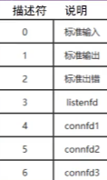

###### datetime:2022/12/30 11:00

###### author:nzb

# I/O复用-select

## 1、导语

多进程/线程并发模型，为每个socket分配一个进程/线程。

IO多路复用：通过一种机制，一个进程可以监视多个描述符，一旦某个描述符就绪（一般是读就绪或者写就绪），能够通知程序进行相应的读写操作。

应用：适用于针对大量的io请求的情况，对于服务器必须在同时处理来自客户端的大量的io操作的时候，就非常适合

与多进程和多线程技术相比，I/O多路复用技术的最大优势就是系统开销小，系统不必创建进程/线程，也不必维护这些进程/线程，从而大大减小了系统的开销。

目前支持I/O多路复用的系统调用有`select`, `pselect`, `poll`, `epoll`,
但他们本质上都是同步I/O，因为他们都需要在读写事件就绪后自己负责进行读写，也就是说这个读写过程是阻塞的，而异步I/O则无需自己负责进行读写，异步I/O的实现会负责把数据从内核拷贝到用户空间。

`select`, `pselect`, `poll`, `epoll` 都是属于IO设计模式Reactor的IO策略。

## 2、IO多路复用使用场景

IO多路复用是指内核一旦发现进程指定的一个或者多个IO条件准备读取，它就通知该进程。IO多路复用适用如下场合：

- 当客户处理多个描述符时（一般是交互式输入和网络套接口），必须使用I/O复用。
- 当一个客户同时处理多个套接口时，这种情况是可能的，但很少出现。
- 如果一个TCP服务器既要处理监听套接口，又要处理已连接套接口，一般也要用到I/O复用。
- 如果一个服务器即要处理TCP，又要处理UDP，一般要使用I/O复用。
- 如果一个服务器要处理多个服务或多个协议，一般要使用I/O复用。

## 3、select

### 3.1、select基本原理

select 函数监视的文件描述符分3类，分别是writefds、readfds、和exceptfds。调用后select函数会阻塞，直到有描述符就绪（有数据
可读、可写、或者有except），或者超时（timeout指定等待时间，如果立即返回设为null即可），函数返回。当select函数返回后，可以通过遍历fdset，来找到就绪的描述符。

### 3.2、select基本流程


### 3.3、select函数原型

该函数准许进程指示内核等待多个事件中的任何一个发送，并只在有一个或多个事件发生或经历一段指定的时间后才唤醒自己。函数原型如下：

```c++
#include <sys/select.h>
#include <sys/time.h>

int select(int maxfdp1, fd_set *readset, fd_set *writeset, fd_set *exceptset, const struct timeval *timeout);

// 返回值：就绪描述符的数目，超时返回0，出错返回-1
// 函数参数介绍如下：
//（1）第一个参数maxfdp1指定待测试的描述字个数，它的值是待测试的最大描述字加1（因此把该参数命名为maxfdp1）描述字0、1、2...(maxfdp1-1)均将被测试（文件描述符是从0开始的）。
//（2）中间的三个参数readset、writeset和exceptset指定我们要让内核测试读、写和异常条件的描述字。如果对某一个的条件不感兴趣，就可以把它设为空指针。
// writeset的write会阻塞，但是阻塞时间是非常短的，所以一般需要监听，设置为空
struct fd_set;   //可以理解为一个集合，这个集合中存放的是文件描述符，可通过以下四个宏进行设置：

void FD_ZERO(fd_set *fdset);           //清空集合
void FD_SET(int fd, fd_set *fdset);    //将一个给定的文件描述符加入集合之中
void FD_CLR(int fd, fd_set *fdset);    //将一个给定的文件描述符从集合中删除
int FD_ISSET(int fd, fd_set *fdset);   // 检查集合中指定的文件描述符是否可以读写 

//（3）timeout指定等待的时间，告知内核等待所指定描述字中的任何一个就绪可花多少时间。其timeval结构用于指定这段时间的秒数和微秒数。
struct timeval {
    long tv_sec;   //seconds
    long tv_usec;  //microseconds
};
/*
 这个参数有三种可能：
（1）永远等待下去：仅在有一个描述字准备好I/O时才返回。为此，把该参数设置为空指针NULL。
（2）等待一段固定时间：在有一个描述字准备好I/O时返回，但是不超过由该参数所指向的timeval结构中指定的秒数和微秒数。
（3）根本不等待：检查描述字后立即返回，这称为轮询。为此，该参数必须指向一个timeval结构，而且其中的定时器值必须为0。
*/
```

> 位图Bitmap的原理
>
> 
>
> 

## 3.4、select优点

- 跨平台。（几乎所有的平台都支持）
- 时间精度高。（ns级别）

## 3.6、select缺点

- **最大限制**：单个进程能够监视的文件描述符的数量存在最大限制。(基于数组存储的赶脚)一般来说这个数目和系统内存关系很大，具体数目可以cat
  /proc/sys/fs/file-max察看。它由FD_SETSIZE设置，32位机默认是1024个。64位机默认是2048.
- **时间复杂度**： 对socket进行扫描时是线性扫描，即采用轮询的方法，效率较低，时间复杂度O(n)。 当套接字比较多的时候，每次select()
  都要通过遍历FD_SETSIZE个Socket来完成调度，不管哪个Socket是活跃的，都遍历一遍。这会浪费很多CPU时间。  
  它仅仅知道有I/O事件发生了，却并不知道是哪那几个流（可能有一个，多个，甚至全部），我们只能无差别轮询所有流，找出能读出数据，或者写入数据的流，对他们进行操作。所以**select具有O(n)的无差别轮询复杂度**
  ，同时处理的流越多，无差别轮询时间就越长。
- **内存拷贝**：需要维护一个用来存放大量fd的数据结构，这样会使得用户空间和内核空间在传递该结构时复制开销大。

## 3.7、 Select的超时机制

- int maxfdp 是指集合中所有描述符的最大值加1
- fd_set *readfds 监视是否有新的socket连接，或现有的描述符是否有数据可读。
- fd_set *writefds 监视是否可以向描述符中写入数据，只要缓存没满，所监视的描述符都可以写，select立即返回。
- fd_set *exceptfds 监视描述符中的异常，从未使用过
- struct timeval *timeout 超时机制。

## 3.8、select模型会丢失事件和数据吗？

答：不会。select采用水平触发的方式，如果报告fd后事件没有被处理或者数据没有被完全读取，那么下次select时会再次报告该id，也就是说select不会丢失事件和数据。

## 3.9、select的其它用途

在Unix（Linux）世界里，一切皆文件，文件就是一串二进制流，不管socket、管道、终端、设备等都是文件，一切都是流，在信息交换的过程中， 都是对这些流进行数据的收发操作，简称为I/O操作(input and output),
往流中读出数据，系统调用read，写入数据，系统调用write。

select是I/O复用函数，除了用于网络通信，还可以用于文件、管道、终端、设备等操作，但开发场景比较少。

## 3.7、示例代码

tcpselect.cpp

```c++
#include <stdio.h>
#include <unistd.h>
#include <stdlib.h>
#include <string.h>
#include <sys/socket.h>
#include <arpa/inet.h>
#include <sys/fcntl.h>

// 初始化服务端的监听端口。
int initserver(int port);

int main(int argc, char *argv[]) {
    if (argc != 2) {
        printf("usage: ./tcpselect port\n");
        return -1;
    }

    // 初始化服务端用于监听的socket。
    int listensock = initserver(atoi(argv[1]));
    printf("listensock=%d\n", listensock);

    if (listensock < 0) {
        printf("initserver() failed.\n");
        return -1;
    }

    fd_set readfdset;  // 读事件的集合，包括监听socket和客户端连接上来的socket。
    int maxfd;  // readfdset中socket的最大值。

    // 初始化结构体，把listensock添加到集合中。
    FD_ZERO(&readfdset);

    FD_SET(listensock, &readfdset);
    maxfd = listensock;

    while (1) {
        // 调用select函数时，会改变socket集合的内容，所以要把socket集合保存下来，传一个临时的给select。
        fd_set tmpfdset = readfdset;

        int infds = select(maxfd + 1, &tmpfdset, NULL, NULL, NULL);
        // printf("select infds=%d\n",infds);

        // 返回失败。
        if (infds < 0) {
            printf("select() failed.\n");
            perror("select()");
            break;
        }

        // 超时，在本程序中，select函数最后一个参数为空，不存在超时的情况，但以下代码还是留着。
        if (infds == 0) {
            printf("select() timeout.\n");
            continue;
        }

        // 检查有事情发生的socket，包括监听和客户端连接的socket。
        // 这里是客户端的socket事件，每次都要遍历整个集合，因为可能有多个socket有事件。
        for (int eventfd = 0; eventfd <= maxfd; eventfd++) {
            if (FD_ISSET(eventfd, &tmpfdset) <= 0) continue;

            if (eventfd == listensock) {
                // 如果发生事件的是listensock，表示有新的客户端连上来。
                struct sockaddr_in client;
                socklen_t len = sizeof(client);
                int clientsock = accept(listensock, (struct sockaddr *) &client, &len);
                if (clientsock < 0) {
                    printf("accept() failed.\n");
                    continue;
                }

                printf("client(socket=%d) connected ok.\n", clientsock);

                // 把新的客户端socket加入集合。
                FD_SET(clientsock, &readfdset);

                if (maxfd < clientsock) maxfd = clientsock;

                continue;
            } else {
                // 客户端有数据过来或客户端的socket连接被断开。
                char buffer[1024];
                memset(buffer, 0, sizeof(buffer));

                // 读取客户端的数据。
                ssize_t isize = read(eventfd, buffer, sizeof(buffer));

                // 发生了错误或socket被对方关闭。
                if (isize <= 0) {
                    printf("client(eventfd=%d) disconnected.\n", eventfd);

                    close(eventfd);  // 关闭客户端的socket。

                    FD_CLR(eventfd, &readfdset);  // 从集合中移去客户端的socket。

                    // 重新计算maxfd的值，注意，只有当eventfd==maxfd时才需要计算。
                    if (eventfd == maxfd) {
                        for (int ii = maxfd; ii > 0; ii--) {
                            if (FD_ISSET(ii, &readfdset)) {
                                maxfd = ii;
                                break;
                            }
                        }

                        printf("maxfd=%d\n", maxfd);
                    }

                    continue;
                }

                printf("recv(eventfd=%d,size=%d):%s\n", eventfd, isize, buffer);

                // 把收到的报文发回给客户端。
                write(eventfd, buffer, strlen(buffer));
            }
        }
    }

    return 0;
}

// 初始化服务端的监听端口。
int initserver(int port) {
    int sock = socket(AF_INET, SOCK_STREAM, 0);
    if (sock < 0) {
        printf("socket() failed.\n");
        return -1;
    }

    // Linux如下
    int opt = 1;
    unsigned int len = sizeof(opt);
    setsockopt(sock, SOL_SOCKET, SO_REUSEADDR, &opt, len);
    setsockopt(sock, SOL_SOCKET, SO_KEEPALIVE, &opt, len);

    struct sockaddr_in servaddr;
    servaddr.sin_family = AF_INET;
    servaddr.sin_addr.s_addr = htonl(INADDR_ANY);
    servaddr.sin_port = htons(port);

    if (bind(sock, (struct sockaddr *) &servaddr, sizeof(servaddr)) < 0) {
        printf("bind() failed.\n");
        close(sock);
        return -1;
    }

    if (listen(sock, 5) != 0) {
        printf("listen() failed.\n");
        close(sock);
        return -1;
    }

    return sock;
}
```

client.cpp

```c++
#include <stdio.h>
#include <stdlib.h>
#include <unistd.h>
#include <errno.h>
#include <string.h>
#include <netinet/in.h>
#include <sys/socket.h>
#include <arpa/inet.h>

int main(int argc, char *argv[]) {
    if (argc != 3) {
        printf("usage:./tcpclient ip port\n");
        return -1;
    }

    int sockfd;
    struct sockaddr_in servaddr;
    char buf[1024];

    if ((sockfd = socket(AF_INET, SOCK_STREAM, 0)) < 0) {
        printf("socket() failed.\n");
        return -1;
    }

    memset(&servaddr, 0, sizeof(servaddr));
    servaddr.sin_family = AF_INET;
    servaddr.sin_port = htons(atoi(argv[2]));
    servaddr.sin_addr.s_addr = inet_addr(argv[1]);

    if (connect(sockfd, (struct sockaddr *) &servaddr, sizeof(servaddr)) != 0) {
        printf("connect(%s:%s) failed.\n", argv[1], argv[2]);
        close(sockfd);
        return -1;
    }

    printf("connect ok.\n");

    for (int ii = 0; ii < 10000; ii++) {
        // 从命令行输入内容。
        memset(buf, 0, sizeof(buf));
        printf("please input:");
        scanf("%s", buf);
        // sprintf(buf,"1111111111111111111111ii=%08d",ii);

        if (write(sockfd, buf, strlen(buf)) <= 0) {
            printf("write() failed.\n");
            close(sockfd);
            return -1;
        }

        memset(buf, 0, sizeof(buf));
        if (read(sockfd, buf, sizeof(buf)) <= 0) {
            printf("read() failed.\n");
            close(sockfd);
            return -1;
        }

        printf("recv:%s\n", buf);

        // close(sockfd); break;
    }
} 
```
