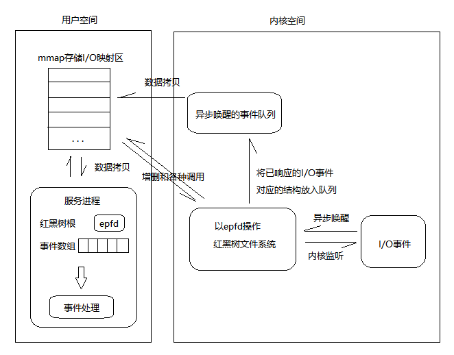
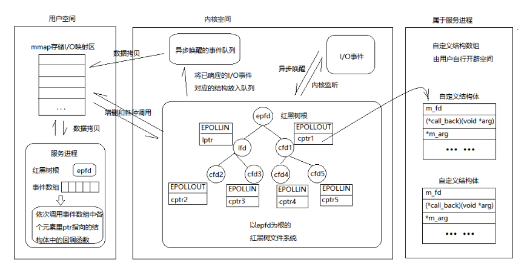
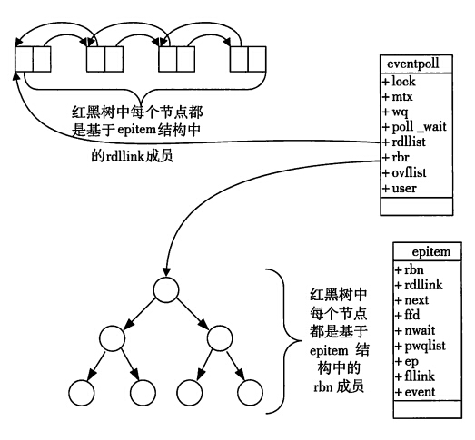
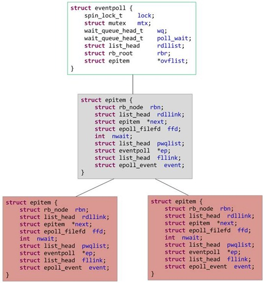
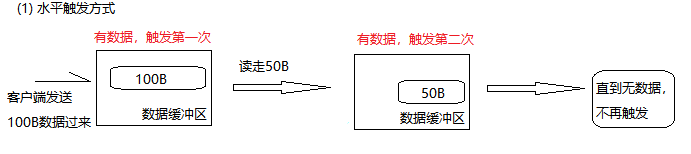
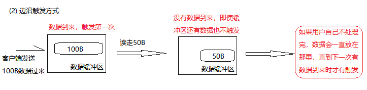
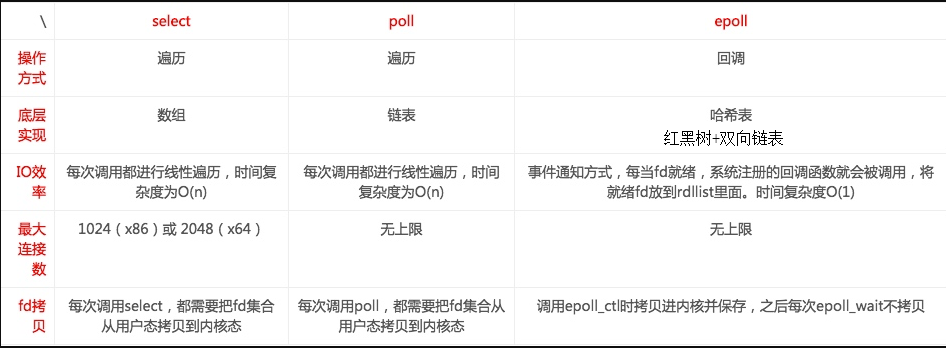

###### datetime:2022/12/30 17:36

###### author:nzb

# I/O复用-epoll

## 5、epoll

epoll是在2.6内核中提出的，是之前的select和poll的增强版本。是为处理大批量句柄而作了改进的poll。
epoll使用一个文件描述符管理多个描述符，将用户关系的文件描述符的事件存放到内核的一个事件表中，这样在用户空间和内核空间的拷贝只需要一次。

### 5.1、epoll基本原理

epoll有两大特点：

- **边缘触发**，它只告诉进程哪些fd刚刚变为就绪态，并且只会通知一次。

- **事件驱动**，每个事件关联上fd，使用事件就绪通知方式，通过 epoll_ctl 注册 fd，一旦该fd就绪，内核就会采用 callback 的回调机制来激活该fd，epoll_wait 便可以收到通知。

### 5.2、epoll基本流程

**一棵红黑树，一张准备就绪句柄链表，少量的内核cache，就帮我们解决了大并发下的socket处理问题。**

- 执行 epoll_create  
  内核在epoll文件系统中建了个file结点，（使用完，必须调用close()关闭，否则导致fd被耗尽） 在内核cache里建了红黑树存储epoll_ctl传来的socket，
  在内核cache里建了rdllist双向链表存储准备就绪的事件。
- 执行 epoll_ctl  
  如果增加socket句柄，检查红黑树中是否存在，存在立即返回，不存在则添加到树干上，然后向内核注册回调函数，告诉内核如果这个句柄的中断到了，就把它放到准备就绪list链表里。
  ps：所有添加到epoll中的事件都会与设备（如网卡）驱动程序建立回调关系，相应的事件发生时，会调用回调方法。
- 执行 epoll_wait  
  立刻返回准备就绪表里的数据即可（将内核cache里双向列表中存储的准备就绪的事件 复制到用户态内存） 当调用epoll_wait检查是否有事件发生时，只需要检查eventpoll对象中的rdlist双链表中是否有epitem元素即可。
  如果rdlist不为空，则把发生的事件复制到用户态，同时将事件数量返回给用户。









### 5.3、epoll函数原型

```c++
#include <sys/epoll.h>

int epoll_create(int size); // 创建epoll的句柄，它本身就是一个fd
int epoll_ctl(int epfd, int op, int fd, struct epoll_event *event);  //  注册需要监视fd和事件
int epoll_wait(int epfd, struct epoll_event *events, int maxevents, int timeout); // 等待事件发生

int epoll_create(int size);  /*创建一个epoll的句柄，size用来告诉内核这个监听的数目一共有多大。*/
// 这个参数不同于select()中的第一个参数，给出最大监听的fd+1的值。
// 需要注意的是:　当创建好epoll句柄后，它就是会占用一个fd值，在linux下如果查看/proc/进程id/fd/，是能够看到这个fd的，　　　　
// 所以在使用完epoll后，必须调用close()关闭，否则可能导致fd被耗尽。

int epoll_ctl(int epfd, int op, int fd, struct epoll_event *event);
/*
epoll的事件注册函数: 它不同与select()是在监听事件时告诉内核要监听什么类型的事件epoll的事件注册函数，而是在这里先注册要监听的事件类型。　
第一个参数 epfd 是epoll_create()的返回值，　　
第二个参数 op 表示动作，用三个宏来表示：
EPOLL_CTL_ADD：注册新的fd到epfd中；
EPOLL_CTL_MOD：修改已经注册的fd的监听事件；
EPOLL_CTL_DEL：从epfd中删除一个fd； 　　
第三个参数是需要监听的fd，　　
第四个参数是告诉内核需要监听什么事，　　　　　　
struct epoll_event结构如下：
*/
struct epoll_event {
    __uint32_t events; /* Epoll events */
    epoll_data_t data; /* User data variable */
};

/*
events可以是以下几个宏的集合： 　　　　　　
EPOLLIN ：表示对应的文件描述符可以读（包括对端SOCKET正常关闭）；　　　　　　
EPOLLOUT：表示对应的文件描述符可以写； 　　　　　　
EPOLLPRI：表示对应的文件描述符有紧急的数据可读（这里应该表示有带外数据到来）； 
EPOLLERR：表示对应的文件描述符发生错误； 　　　　　　
EPOLLHUP：表示对应的文件描述符被挂断； 　　　　　　
EPOLLET： 将EPOLL设为边缘触发(Edge Triggered)模式，这是相对于水平触发(Level Triggered)来说的。 　　　　　　
EPOLLONESHOT：只监听一次事件，当监听完这次事件之后，如果还需要继续监听这个socket的话，需要再次把这个socket加入到EPOLL队列里
*/

int epoll_wait(int epfd, struct epoll_event *events, int maxevents, int timeout);
/*
等待事件的产生　　　　
类似于select()调用。　　　　
参数 events用来从内核得到事件的集合，　　　　
参数 maxevents告之内核这个events有多大，这个maxevents的值不能大于创建epoll_create()时的size，　　　
参数 timeout是超时时间（毫秒，0会立即返回，-1将不确定，也有说法说是永久阻塞）。　　　　
该函数返回需要处理的事件数目，如返回0表示已超时。
*/
```

### 5.4、epoll优点

- **没有最大连接数的限制**。（基于 红黑树+双链表 来存储的:1G的内存上能监听约10万个端口）
- **时间复杂度低**： 边缘触发和事件驱动，监听回调，时间复杂度O(1)。
  只有活跃可用的fd才会调用callback函数；即epoll最大的优点就在于它只管“活跃”的连接，而跟连接总数无关，因此实际网络环境中，Epoll的效率就会远远高于select和poll。
- **内存拷贝**：利用mmap()文件映射内存加速与内核空间的消息传递，减少拷贝开销。

### 5.5、epoll缺点

依赖于操作系统：Lunix

### 5.6、epoll应用场景

- 适合用epoll的应用场景
    - 对于连接特别多，活跃的连接特别少
    - 典型的应用场景为一个需要处理上万的连接服务器，例如各种app的入口服务器，例如qq

- 不适合epoll的场景
    - 连接比较少，数据量比较大，例如ssh
    - epoll 的惊群问题： 因为epoll 多用于多个连接，只有少数活跃的场景，但是万一某一时刻，epoll 等的上千个文件描述符都就绪了，这时候epoll 要进行大量的I/O，此时压力太大。

### 5.7、epoll两种模式

epoll对文件描述符的操作有两种模式：`LT(level trigger)` 和 `ET(edge trigger)`。LT是默认的模式，ET是“高速”模式。

- LT（水平触发）模式下，只要有数据就触发，缓冲区剩余未读尽的数据会导致 epoll_wait都会返回它的事件；
- ET（边缘触发）模式下，只有新数据到来才触发，不管缓存区中是否还有数据，缓冲区剩余未读尽的数据不会导致epoll_wait返回。

#### 5.7.1、LT模式

**LT(level triggered)是缺省的工作方式，并且同时支持block和no-block socket**

在这种做法中，内核告诉你一个文件描述符是否就绪了，然后你可以对这个就绪的fd进行IO操作。

**如果你不作任何操作，内核还是会继续通知你的,只要这个文件描述符还有数据可读，每次 epoll_wait都会返回它的事件，提醒用户程序去操作**



#### 5.7.2、ET模式

**ET(edge-triggered)是高速工作方式，只支持no-block socket**，在这种模式下，当描述符从未就绪变为就绪时，内核通过epoll告诉你。
然后它会假设你知道文件描述符已经就绪，并且不会再为那个文件描述符发送更多的就绪通知，直到你做了某些操作导致那个文件描述符不再为就绪状态了
(比如，你在发送，接收或者接收请求，或者发送接收的数据少于一定量时导致了一个EWOULDBLOCK 错误）。
**但是请注意，如果一直不对这个fd作IO操作(从而导致它再次变成未就绪)，内核不会发送更多的通知(only once)。**

在它检测到有 I/O 事件时，通过 epoll_wait 调用会得到有事件通知的文件描述符，对于每一个被通知的文件描述符，如可读，则必须将该文件描述符一直读到空， 让 errno 返回 EAGAIN
（提示你的应用程序现在没有数据可读请稍后再试）为止，否则下次的 epoll_wait 不会返回余下的数据，会丢掉事件。



**ET模式在很大程度上减少了epoll事件被重复触发的次数，因此效率要比LT模式高**。epoll工作在ET模式的时候，**必须使用非阻塞套接口**，以避免由于一个文件句柄的阻塞读/阻塞写操作把处理多个文件描述符的任务饿死。

> 注意：
> - 1、在select/poll中，**进程只有在调用一定的方法后，内核才对所有监视的文件描述符进行扫描**，而epoll事先通过epoll_ctl()来注册一个文件描述符，
    > **一旦基于某个文件描述符就绪时，内核会采用类似callback的回调机制**，迅速激活这个文件描述符，当进程调用epoll_wait()时便得到通知。
    > **此处去掉了遍历文件描述符，而是通过监听回调的的机制。这正是epoll的魅力所在。**
> - 2、如果没有大量的idle-connection或者dead-connection，epoll的效率并不会比select/poll高很多，
    > 但是当遇到大量的idle-connection，就会发现epoll的效率大大高于select/poll。

### 5.8、示例代码

tcpselect.cpp

```c++
#include <stdio.h>
#include <stdlib.h>
#include <string.h>
#include <errno.h>
#include <unistd.h>
#include <fcntl.h>
#include <arpa/inet.h>
#include <netinet/in.h>
#include <sys/epoll.h>
#include <sys/socket.h>
#include <sys/types.h>

#define MAXEVENTS 100

// 把socket设置为非阻塞的方式。
int setnonblocking(int sockfd);

// 初始化服务端的监听端口。
int initserver(int port);

int main(int argc, char *argv[]) {
    if (argc != 2) {
        printf("usage:./tcpepoll port\n");
        return -1;
    }

    // 初始化服务端用于监听的socket。
    int listensock = initserver(atoi(argv[1]));
    printf("listensock=%d\n", listensock);

    if (listensock < 0) {
        printf("initserver() failed.\n");
        return -1;
    }

    int epollfd;

    char buffer[1024];
    memset(buffer, 0, sizeof(buffer));

    // 创建一个描述符
    epollfd = epoll_create(1);

    // 添加监听描述符事件
    struct epoll_event ev;
    ev.data.fd = listensock;
    ev.events = EPOLLIN;             // 默认水平触发
    // ev.events = EPOLLIN|EPOLLET;  // 设置边缘触发
    epoll_ctl(epollfd, EPOLL_CTL_ADD, listensock, &ev);

    while (1) {
        struct epoll_event events[MAXEVENTS]; // 存放有事件发生的结构数组。

        // 等待监视的socket有事件发生。
        int infds = epoll_wait(epollfd, events, MAXEVENTS, -1);
        // printf("epoll_wait infds=%d\n",infds);

        // 返回失败。
        if (infds < 0) {
            printf("epoll_wait() failed.\n");
            perror("epoll_wait()");
            break;
        }

        // 超时。
        if (infds == 0) {
            printf("epoll_wait() timeout.\n");
            continue;
        }

        // 遍历有事件发生的结构数组。
        for (int ii = 0; ii < infds; ii++) {
            if ((events[ii].data.fd == listensock) && (events[ii].events & EPOLLIN)) {
                // 如果发生事件的是listensock，表示有新的客户端连上来。
                struct sockaddr_in client;
                socklen_t len = sizeof(client);
                int clientsock = accept(listensock, (struct sockaddr *) &client, &len);
                if (clientsock < 0) {
                    printf("accept() failed.\n");
                    continue;
                }

                // 把新的客户端添加到epoll中。
                memset(&ev, 0, sizeof(struct epoll_event));
                ev.data.fd = clientsock;
                ev.events = EPOLLIN;
                epoll_ctl(epollfd, EPOLL_CTL_ADD, clientsock, &ev);

                printf("client(socket=%d) connected ok.\n", clientsock);

                continue;
            } else if (events[ii].events & EPOLLIN) {
                // 客户端有数据过来或客户端的socket连接被断开。
                char buffer[1024];
                memset(buffer, 0, sizeof(buffer));

                // 读取客户端的数据。
                ssize_t isize = read(events[ii].data.fd, buffer, sizeof(buffer));

                // 发生了错误或socket被对方关闭。
                if (isize <= 0) {
                    printf("client(eventfd=%d) disconnected.\n", events[ii].data.fd);

                    // 把已断开的客户端从epoll中删除。
                    memset(&ev, 0, sizeof(struct epoll_event));
                    ev.events = EPOLLIN;
                    ev.data.fd = events[ii].data.fd;
                    epoll_ctl(epollfd, EPOLL_CTL_DEL, events[ii].data.fd, &ev);
                    close(events[ii].data.fd);
                    continue;
                }

                printf("recv(eventfd=%d,size=%d):%s\n", events[ii].data.fd, isize, buffer);

                // 把收到的报文发回给客户端。
                write(events[ii].data.fd, buffer, strlen(buffer));
            }
        }
    }

    close(epollfd);

    return 0;
}

// 初始化服务端的监听端口。
int initserver(int port) {
    int sock = socket(AF_INET, SOCK_STREAM, 0);
    if (sock < 0) {
        printf("socket() failed.\n");
        return -1;
    }

    // Linux如下
    int opt = 1;
    unsigned int len = sizeof(opt);
    setsockopt(sock, SOL_SOCKET, SO_REUSEADDR, &opt, len);
    setsockopt(sock, SOL_SOCKET, SO_KEEPALIVE, &opt, len);

    struct sockaddr_in servaddr;
    servaddr.sin_family = AF_INET;
    servaddr.sin_addr.s_addr = htonl(INADDR_ANY);
    servaddr.sin_port = htons(port);

    if (bind(sock, (struct sockaddr *) &servaddr, sizeof(servaddr)) < 0) {
        printf("bind() failed.\n");
        close(sock);
        return -1;
    }

    if (listen(sock, 5) != 0) {
        printf("listen() failed.\n");
        close(sock);
        return -1;
    }

    return sock;
}

// 把socket设置为非阻塞的方式。
int setnonblocking(int sockfd) {
    if (fcntl(sockfd, F_SETFL, fcntl(sockfd, F_GETFD, 0) | O_NONBLOCK) == -1) return -1;

    return 0;
}
```

client.cpp

```c++
#include <stdio.h>
#include <stdlib.h>
#include <unistd.h>
#include <errno.h>
#include <string.h>
#include <netinet/in.h>
#include <sys/socket.h>
#include <arpa/inet.h>

int main(int argc, char *argv[]) {
    if (argc != 3) {
        printf("usage:./tcpclient ip port\n");
        return -1;
    }

    int sockfd;
    struct sockaddr_in servaddr;
    char buf[1024];

    if ((sockfd = socket(AF_INET, SOCK_STREAM, 0)) < 0) {
        printf("socket() failed.\n");
        return -1;
    }

    memset(&servaddr, 0, sizeof(servaddr));
    servaddr.sin_family = AF_INET;
    servaddr.sin_port = htons(atoi(argv[2]));
    servaddr.sin_addr.s_addr = inet_addr(argv[1]);

    if (connect(sockfd, (struct sockaddr *) &servaddr, sizeof(servaddr)) != 0) {
        printf("connect(%s:%s) failed.\n", argv[1], argv[2]);
        close(sockfd);
        return -1;
    }

    printf("connect ok.\n");

    for (int ii = 0; ii < 10000; ii++) {
        // 从命令行输入内容。
        memset(buf, 0, sizeof(buf));
        printf("please input:");
        scanf("%s", buf);
        // sprintf(buf,"1111111111111111111111ii=%08d",ii);

        if (write(sockfd, buf, strlen(buf)) <= 0) {
            printf("write() failed.\n");
            close(sockfd);
            return -1;
        }

        memset(buf, 0, sizeof(buf));
        if (read(sockfd, buf, sizeof(buf)) <= 0) {
            printf("read() failed.\n");
            close(sockfd);
            return -1;
        }

        printf("recv:%s\n", buf);

        // close(sockfd); break;
    }
} 
```

### 5.9、select、poll、epoll区别

- 1、支持一个进程所能打开的最大连接数

| select | poll | epoll |
| ----- | ----- | ----- |
| 单个进程所能打开的最大连接数有FD_SETSIZE宏定义，其大小是32个整数的大小（在32位的机器上，大小就是3232，同理64位机器上FD_SETSIZE为3264），当然我们可以对进行修改，然后重新编译内核，但是性能可能会受到影响，这需要进一步的测试。 | poll本质上和select没有区别，但是它没有最大连接数的限制，原因是它是基于链表来存储的 | 虽然连接数有上限，但是很大，1G内存的机器上可以打开10万左右的连接，2G内存的机器可以打开20万左右的连接 |

- 2、FD剧增后带来的IO效率问题

| select | poll | epoll |
| ----- | ----- | ----- |
| 因为每次调用时都会对连接进行线性遍历，所以随着FD的增加会造成遍历速度慢的“线性下降性能问题”。 | 同select | 因为epoll内核中实现是根据每个fd上的callback函数来实现的，只有活跃的socket才会主动调用callback，所以在活跃socket较少的情况下，使用epoll没有前面两者的线性下降的性能问题，但是所有socket都很活跃的情况下，可能会有性能问题。 |

- 3、消息传递方式

| select | poll | epoll |
| ----- | ----- | ----- |
| 内核需要将消息传递到用户空间，都需要内核拷贝动作 | 同select | epoll通过mmap把对应设备文件片断映射到用户空间上, 消息传递不通过内核, 内存与设备文件同步数据. |

- 总结：
    - 1、表面上看epoll的性能最好，但是在连接数少并且连接都十分活跃的情况下，select和poll的性能可能比epoll好，毕竟epoll的通知机制需要很多函数回调。
    - 2、select低效是因为每次它都需要轮询。但低效也是相对的，视情况而定，也可通过良好的设计改善
    - 3、


