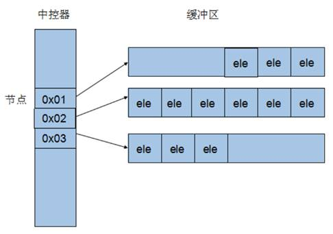

###### datetime:2022/11/03 10:32

###### author:nzb

# 3 STL- 常用容器

### 3.3 deque容器

#### 3.3.1 deque容器基本概念

功能：双端数组，可以对头端进行插入删除操作

**deque与vector区别：**

* vector对于头部的**插入删除效率低**，数据量越大，效率越低
* deque相对而言，对头部的插入删除速度回比vector快
* vector**访问元素**时的速度会比deque**快**,这和两者内部实现有关，因为deque需要先查询中控器


deque内部工作原理:

deque内部有个**中控器**，维护每段缓冲区中的内容，缓冲区中存放真实数据

中控器维护的是每个缓冲区的地址，使得使用deque时像一片连续的内存空间



* deque容器的迭代器也是支持随机访问的

#### 3.3.2 deque构造函数

功能描述：deque容器构造

函数原型

* `deque<T>` deqT; //默认构造形式
* `deque(beg, end);`                  //构造函数将`[beg, end)`区间中的元素拷贝给本身。
* `deque(n, elem);`                    //构造函数将n个elem拷贝给本身。
* `deque(const deque &deq);`   //拷贝构造函数

示例

```C++
#include <deque>

void printDeque(const deque<int>& d) 
{
	for (deque<int>::const_iterator it = d.begin(); it != d.end(); it++) {
		cout << *it << " ";

	}
	cout << endl;
}
//deque构造
void test01() {

	deque<int> d1; //无参构造函数
	for (int i = 0; i < 10; i++)
	{
		d1.push_back(i);
	}
	printDeque(d1);
	deque<int> d2(d1.begin(),d1.end());
	printDeque(d2);

	deque<int>d3(10,100);
	printDeque(d3);

	deque<int>d4 = d3;
	printDeque(d4);
}

int main() {

	test01();

	system("pause");

	return 0;
}
```

总结：deque容器和vector容器的构造方式几乎一致，灵活使用即可

#### 3.3.3 deque赋值操作

功能描述：给deque容器进行赋值

函数原型

* `deque& operator=(const deque &deq); `         //重载等号操作符
* `assign(beg, end);`                                           //将[beg, end)区间中的数据拷贝赋值给本身。
* `assign(n, elem);`                                             //将n个elem拷贝赋值给本身。

示例

```C++
#include <deque>

void printDeque(const deque<int>& d) 
{
	for (deque<int>::const_iterator it = d.begin(); it != d.end(); it++) {
		cout << *it << " ";

	}
	cout << endl;
}
//赋值操作
void test01()
{
	deque<int> d1;
	for (int i = 0; i < 10; i++)
	{
		d1.push_back(i);
	}
	printDeque(d1);

	deque<int>d2;
	d2 = d1;
	printDeque(d2);

	deque<int>d3;
	d3.assign(d1.begin(), d1.end());
	printDeque(d3);

	deque<int>d4;
	d4.assign(10, 100);
	printDeque(d4);

}

int main() {

	test01();

	system("pause");

	return 0;
}
```

总结：deque赋值操作也与vector相同，需熟练掌握

#### 3.3.4 deque大小操作

功能描述：对deque容器的大小进行操作

函数原型

* `deque.empty();`                       //判断容器是否为空
* `deque.size();`                         //返回容器中元素的个数
* `deque.resize(num);`                //重新指定容器的长度为num,若容器变长，则以默认值填充新位置。 //如果容器变短，则末尾超出容器长度的元素被删除。
* `deque.resize(num, elem);`     //重新指定容器的长度为num,若容器变长，则以elem值填充新位置。 //如果容器变短，则末尾超出容器长度的元素被删除。

示例

```C++
#include <deque>

void printDeque(const deque<int>& d) 
{
	for (deque<int>::const_iterator it = d.begin(); it != d.end(); it++) {
		cout << *it << " ";

	}
	cout << endl;
}

//大小操作
void test01()
{
	deque<int> d1;
	for (int i = 0; i < 10; i++)
	{
		d1.push_back(i);
	}
	printDeque(d1);

	//判断容器是否为空
	if (d1.empty()) {
		cout << "d1为空!" << endl;
	}
	else {
		cout << "d1不为空!" << endl;
		//统计大小
		cout << "d1的大小为：" << d1.size() << endl;
	}

	//重新指定大小
	d1.resize(15, 1);
	printDeque(d1);

	d1.resize(5);
	printDeque(d1);
}

int main() {

	test01();

	system("pause");

	return 0;
}
```

总结：

* deque没有容量的概念
* 判断是否为空 --- empty
* 返回元素个数 --- size
* 重新指定个数 --- resize

#### 3.3.5 deque 插入和删除

功能描述：向deque容器中插入和删除数据

函数原型

- 两端插入操作
    - `push_back(elem);`          //在容器尾部添加一个数据
    - `push_front(elem);`        //在容器头部插入一个数据
    - `pop_back();`                   //删除容器最后一个数据
    - `pop_front();`                 //删除容器第一个数据

- 指定位置操作
    * `insert(pos,elem);`         //在pos位置插入一个elem元素的拷贝，返回新数据的位置。
    * `insert(pos,n,elem);`     //在pos位置插入n个elem数据，无返回值。
    * `insert(pos,beg,end);`    //在pos位置插入[beg,end)区间的数据，无返回值。
    * `clear();`                           //清空容器的所有数据
    * `erase(beg,end);`             //删除[beg,end)区间的数据，返回下一个数据的位置。
    * `erase(pos);`                    //删除pos位置的数据，返回下一个数据的位置。

示例

```C++
#include <deque>

void printDeque(const deque<int>& d) 
{
	for (deque<int>::const_iterator it = d.begin(); it != d.end(); it++) {
		cout << *it << " ";

	}
	cout << endl;
}
//两端操作
void test01()
{
	deque<int> d;
	//尾插
	d.push_back(10);
	d.push_back(20);
	//头插
	d.push_front(100);
	d.push_front(200);

	printDeque(d);

	//尾删
	d.pop_back();
	//头删
	d.pop_front();
	printDeque(d);
}

//插入
void test02()
{
	deque<int> d;
	d.push_back(10);
	d.push_back(20);
	d.push_front(100);
	d.push_front(200);
	printDeque(d);

	d.insert(d.begin(), 1000);
	printDeque(d);

	d.insert(d.begin(), 2,10000);
	printDeque(d);

	deque<int>d2;
	d2.push_back(1);
	d2.push_back(2);
	d2.push_back(3);

	d.insert(d.begin(), d2.begin(), d2.end());
	printDeque(d);

}

//删除
void test03()
{
	deque<int> d;
	d.push_back(10);
	d.push_back(20);
	d.push_front(100);
	d.push_front(200);
	printDeque(d);

	d.erase(d.begin());
	printDeque(d);

	d.erase(d.begin(), d.end());
	d.clear();
	printDeque(d);
}

int main() {

	//test01();

	//test02();

    test03();
    
	system("pause");

	return 0;
}

```

总结：

* 插入和删除提供的位置是迭代器！
* 尾插 --- push_back
* 尾删 --- pop_back
* 头插 --- push_front
* 头删 --- pop_front

#### 3.3.6 deque 数据存取

功能描述：对deque 中的数据的存取操作

函数原型

- `at(int idx); `     //返回索引idx所指的数据
- `operator[]; `      //返回索引idx所指的数据
- `front(); `            //返回容器中第一个数据元素
- `back();`              //返回容器中最后一个数据元素

示例

```C++
#include <deque>

void printDeque(const deque<int>& d) 
{
	for (deque<int>::const_iterator it = d.begin(); it != d.end(); it++) {
		cout << *it << " ";

	}
	cout << endl;
}

//数据存取
void test01()
{

	deque<int> d;
	d.push_back(10);
	d.push_back(20);
	d.push_front(100);
	d.push_front(200);

	for (int i = 0; i < d.size(); i++) {
		cout << d[i] << " ";
	}
	cout << endl;


	for (int i = 0; i < d.size(); i++) {
		cout << d.at(i) << " ";
	}
	cout << endl;

	cout << "front:" << d.front() << endl;

	cout << "back:" << d.back() << endl;

}

int main() {

	test01();

	system("pause");

	return 0;
}
```

总结：

- 除了用迭代器获取deque容器中元素，`[ ]`和`at`也可以
- front返回容器第一个元素
- back返回容器最后一个元素

#### 3.3.7  deque 排序

功能描述：利用算法实现对deque容器进行排序

算法

* `sort(iterator beg, iterator end)`  //对beg和end区间内元素进行排序

示例

```C++
#include <deque>
#include <algorithm>

void printDeque(const deque<int>& d) 
{
	for (deque<int>::const_iterator it = d.begin(); it != d.end(); it++) {
		cout << *it << " ";

	}
	cout << endl;
}

void test01()
{

	deque<int> d;
	d.push_back(10);
	d.push_back(20);
	d.push_front(100);
	d.push_front(200);

	printDeque(d);
	sort(d.begin(), d.end());
	printDeque(d);

}

int main() {

	test01();

	system("pause");

	return 0;
}
```

总结：sort算法非常实用，使用时包含头文件 algorithm即可

### 3.4 案例-评委打分

#### 3.4.1 案例描述

有5名选手：选手ABCDE，10个评委分别对每一名选手打分，去除最高分，去除评委中最低分，取平均分。

#### 3.4.2 实现步骤

1. 创建五名选手，放到vector中
2. 遍历vector容器，取出来每一个选手，执行for循环，可以把10个评分打分存到deque容器中
3. sort算法对deque容器中分数排序，去除最高和最低分
4. deque容器遍历一遍，累加总分
5. 获取平均分

示例代码

```C++
//选手类
class Person
{
public:
	Person(string name, int score)
	{
		this->m_Name = name;
		this->m_Score = score;
	}

	string m_Name; //姓名
	int m_Score;  //平均分
};

void createPerson(vector<Person>&v)
{
	string nameSeed = "ABCDE";
	for (int i = 0; i < 5; i++)
	{
		string name = "选手";
		name += nameSeed[i];

		int score = 0;

		Person p(name, score);

		//将创建的person对象 放入到容器中
		v.push_back(p);
	}
}

//打分
void setScore(vector<Person>&v)
{
	for (vector<Person>::iterator it = v.begin(); it != v.end(); it++)
	{
		//将评委的分数 放入到deque容器中
		deque<int>d;
		for (int i = 0; i < 10; i++)
		{
			int score = rand() % 41 + 60;  // 60 ~ 100
			d.push_back(score);
		}

		//cout << "选手： " << it->m_Name << " 打分： " << endl;
		//for (deque<int>::iterator dit = d.begin(); dit != d.end(); dit++)
		//{
		//	cout << *dit << " ";
		//}
		//cout << endl;

		//排序
		sort(d.begin(), d.end());

		//去除最高和最低分
		d.pop_back();
		d.pop_front();

		//取平均分
		int sum = 0;
		for (deque<int>::iterator dit = d.begin(); dit != d.end(); dit++)
		{
			sum += *dit; //累加每个评委的分数
		}

		int avg = sum / d.size();

		//将平均分 赋值给选手身上
		it->m_Score = avg;
	}

}

void showScore(vector<Person>&v)
{
	for (vector<Person>::iterator it = v.begin(); it != v.end(); it++)
	{
		cout << "姓名： " << it->m_Name << " 平均分： " << it->m_Score << endl;
	}
}

int main() {

	//随机数种子
	srand((unsigned int)time(NULL));

	//1、创建5名选手
	vector<Person>v;  //存放选手容器
	createPerson(v);

	//测试
	//for (vector<Person>::iterator it = v.begin(); it != v.end(); it++)
	//{
	//	cout << "姓名： " << (*it).m_Name << " 分数： " << (*it).m_Score << endl;
	//}

	//2、给5名选手打分
	setScore(v);

	//3、显示最后得分
	showScore(v);

	system("pause");

	return 0;
}
```

总结：选取不同的容器操作数据，可以提升代码的效率
