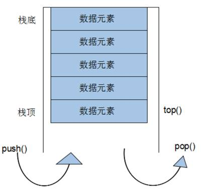

###### datetime:2022/11/03 10:32

###### author:nzb

# 3 STL- 常用容器

### 3.1 string容器

#### 3.1.1 string基本概念

**本质**： string是C++风格的字符串，而string本质上是一个类

**`string`和`char *` 区别：**

* `char *` 是一个指针
* `string`是一个类，类内部封装了`char *`，管理这个字符串，是一个`char *`型的容器。

**特点**：

string 类内部封装了很多成员方法

例如：查找find，拷贝copy，删除delete 替换replace，插入insert

string管理char*所分配的内存，不用担心复制越界和取值越界等，由类内部进行负责

#### 3.1.2 string构造函数

构造函数原型：

* `string();`                        //创建一个空的字符串 例如: string str;
  `string(const char* s);`            //使用字符串s初始化
* `string(const string& str);`    //使用一个string对象初始化另一个string对象
* `string(int n, char c);`           //使用n个字符c初始化

示例

```C++
#include <string>
//string构造
void test01()
{
	string s1; //创建空字符串，调用无参构造函数
	cout << "str1 = " << s1 << endl;

	const char * str = "hello world";
	string s2(str); //把c_string转换成了string

	cout << "str2 = " << s2 << endl;

	string s3(s2); //调用拷贝构造函数
	cout << "str3 = " << s3 << endl;

	string s4(10, 'a');
	cout << "str3 = " << s3 << endl;
}

int main() {

	test01();

	system("pause");

	return 0;
}
```

总结：string的多种构造方式没有可比性，灵活使用即可

#### 3.1.3 string赋值操作

功能描述： 给string字符串进行赋值

赋值的函数原型：

* `string& operator=(const char* s);`             //char*类型字符串 赋值给当前的字符串
* `string& operator=(const string &s);`         //把字符串s赋给当前的字符串
* `string& operator=(char c);`                          //字符赋值给当前的字符串
* `string& assign(const char *s);`                  //把字符串s赋给当前的字符串
* `string& assign(const char *s, int n);`     //把字符串s的前n个字符赋给当前的字符串
* `string& assign(const string &s);`              //把字符串s赋给当前字符串
* `string& assign(int n, char c);`                  //用n个字符c赋给当前字符串

示例

```C++
//赋值
void test01()
{
	string str1;
	str1 = "hello world";
	cout << "str1 = " << str1 << endl;

	string str2;
	str2 = str1;
	cout << "str2 = " << str2 << endl;

	string str3;
	str3 = 'a';
	cout << "str3 = " << str3 << endl;

	string str4;
	str4.assign("hello c++");
	cout << "str4 = " << str4 << endl;

	string str5;
	str5.assign("hello c++",5);
	cout << "str5 = " << str5 << endl;


	string str6;
	str6.assign(str5);
	cout << "str6 = " << str6 << endl;

	string str7;
	str7.assign(5, 'x');
	cout << "str7 = " << str7 << endl;
}

int main() {

	test01();

	system("pause");

	return 0;
}
```

总结：string的赋值方式很多，`operator=`  这种方式是比较实用的

#### 3.1.4 string字符串拼接

功能描述：实现在字符串末尾拼接字符串

函数原型

* `string& operator+=(const char* str);`                   //重载+=操作符
* `string& operator+=(const char c);`                         //重载+=操作符
* `string& operator+=(const string& str);`                //重载+=操作符
* `string& append(const char *s); `                               //把字符串s连接到当前字符串结尾
* `string& append(const char *s, int n);`                 //把字符串s的前n个字符连接到当前字符串结尾
* `string& append(const string &s);`                           //同operator+=(const string& str)
* `string& append(const string &s, int pos, int n);`//字符串s中从pos开始的n个字符连接到字符串结尾

示例

```C++
//字符串拼接
void test01()
{
	string str1 = "我";

	str1 += "爱玩游戏";

	cout << "str1 = " << str1 << endl;
	
	str1 += ':';

	cout << "str1 = " << str1 << endl;

	string str2 = "LOL DNF";

	str1 += str2;

	cout << "str1 = " << str1 << endl;

	string str3 = "I";
	str3.append(" love ");
	str3.append("game abcde", 4);
	//str3.append(str2);
	str3.append(str2, 4, 3); // 从下标4位置开始 ，截取3个字符，拼接到字符串末尾
	cout << "str3 = " << str3 << endl;
}
int main() {

	test01();

	system("pause");

	return 0;
}
```

总结：字符串拼接的重载版本很多，初学阶段记住几种即可

#### 3.1.5 string查找和替换

功能描述

* 查找：查找指定字符串是否存在
* 替换：在指定的位置替换字符串

函数原型

* `int find(const string& str, int pos = 0) const;`              //查找str第一次出现位置,从pos开始查找
* `int find(const char* s, int pos = 0) const; `                     //查找s第一次出现位置,从pos开始查找
* `int find(const char* s, int pos, int n) const; `               //从pos位置查找s的前n个字符第一次位置
* `int find(const char c, int pos = 0) const; `                       //查找字符c第一次出现位置
* `int rfind(const string& str, int pos = npos) const;`      //查找str最后一次位置,从pos开始查找
* `int rfind(const char* s, int pos = npos) const;`              //查找s最后一次出现位置,从pos开始查找
* `int rfind(const char* s, int pos, int n) const;`              //从pos查找s的前n个字符最后一次位置
* `int rfind(const char c, int pos = 0) const;  `                      //查找字符c最后一次出现位置
* `string& replace(int pos, int n, const string& str); `       //替换从pos开始n个字符为字符串str
* `string& replace(int pos, int n,const char* s); `                 //替换从pos开始的n个字符为字符串s

示例

```C++
//查找和替换
void test01()
{
	//查找
	string str1 = "abcdefgde";

	int pos = str1.find("de");

	if (pos == -1)
	{
		cout << "未找到" << endl;
	}
	else
	{
		cout << "pos = " << pos << endl;
	}
	

	pos = str1.rfind("de");

	cout << "pos = " << pos << endl;

}

void test02()
{
	//替换
	string str1 = "abcdefgde";
	str1.replace(1, 3, "1111");

	cout << "str1 = " << str1 << endl;
}

int main() {

	//test01();
	//test02();

	system("pause");

	return 0;
}
```

总结：

* find查找是从左往后，rfind从右往左
* find找到字符串后返回查找的第一个字符位置，找不到返回-1
* replace在替换时，要指定从哪个位置起，多少个字符，替换成什么样的字符串

#### 3.1.6 string字符串比较

功能描述：字符串之间的比较

比较方式：字符串比较是按字符的ASCII码进行对比

- = 返回 0

- \> 返回 1

- < 返回 -1

**函数原型：**

* `int compare(const string &s) const; `  //与字符串s比较
* `int compare(const char *s) const;`      //与字符串s比较

**示例：**

```C++
//字符串比较
void test01()
{

	string s1 = "hello";
	string s2 = "aello";

	int ret = s1.compare(s2);

	if (ret == 0) {
		cout << "s1 等于 s2" << endl;
	}
	else if (ret > 0)
	{
		cout << "s1 大于 s2" << endl;
	}
	else
	{
		cout << "s1 小于 s2" << endl;
	}

}

int main() {

	test01();

	system("pause");

	return 0;
}
```

总结：字符串对比主要是用于比较两个字符串是否相等，判断谁大谁小的意义并不是很大

#### 3.1.7 string字符存取

string中单个字符存取方式有两种

* `char& operator[](int n); `     //通过`[]`方式取字符
* `char& at(int n);   `                    //通过`at`方法获取字符

示例

```C++
void test01()
{
	string str = "hello world";

	for (int i = 0; i < str.size(); i++)
	{
		cout << str[i] << " ";
	}
	cout << endl;

	for (int i = 0; i < str.size(); i++)
	{
		cout << str.at(i) << " ";
	}
	cout << endl;


	//字符修改
	str[0] = 'x';
	str.at(1) = 'x';
	cout << str << endl;
	
}

int main() {

	test01();

	system("pause");

	return 0;
}
```

总结：string字符串中单个字符存取有两种方式，利用 `[ ]` 或 `at`

#### 3.1.8 string插入和删除

功能描述：对string字符串进行插入和删除字符操作

函数原型

* `string& insert(int pos, const char* s);  `                //插入字符串
* `string& insert(int pos, const string& str); `        //插入字符串
* `string& insert(int pos, int n, char c);`                //在指定位置插入n个字符c
* `string& erase(int pos, int n = npos);`                    //删除从Pos开始的n个字符

示例

```C++
//字符串插入和删除
void test01()
{
	string str = "hello";
	str.insert(1, "111");
	cout << str << endl;

	str.erase(1, 3);  //从1号位置开始3个字符
	cout << str << endl;
}

int main() {

	test01();

	system("pause");

	return 0;
}
```

总结：插入和删除的起始下标都是从0开始

#### 3.1.9 string子串

功能描述：从字符串中获取想要的子串

函数原型

* `string substr(int pos = 0, int n = npos) const;`   //返回由pos开始的n个字符组成的字符串

**示例：**

```C++
//子串
void test01()
{

	string str = "abcdefg";
	string subStr = str.substr(1, 3);
	cout << "subStr = " << subStr << endl;

	string email = "hello@sina.com";
	int pos = email.find("@");
	string username = email.substr(0, pos);
	cout << "username: " << username << endl;

}

int main() {

	test01();

	system("pause");

	return 0;
}
```

总结：灵活的运用求子串功能，可以在实际开发中获取有效的信息

### 3.2 vector容器

#### 3.2.1 vector基本概念

功能

* vector数据结构和**数组非常相似**，也称为**单端数组**

vector与普通数组区别

* 不同之处在于数组是静态空间，而`vector`可以**动态扩展**

动态扩展

* 并不是在原空间之后续接新空间，而是找更大的内存空间，然后将原数据拷贝新空间，释放原空间


* vector容器的迭代器是支持随机访问的迭代器

#### 3.2.2 vector构造函数

功能描述：创建vector容器

函数原型

* `vector<T> v; `                         //采用模板实现类实现，默认构造函数
* `vector(v.begin(), v.end());   `       //将`v[begin(), end())`区间中的元素拷贝给本身。
* `vector(n, elem);`                            //构造函数将n个elem拷贝给本身。
* `vector(const vector &vec);`         //拷贝构造函数。

示例

```C++
#include <vector>

void printVector(vector<int>& v) {

	for (vector<int>::iterator it = v.begin(); it != v.end(); it++) {
		cout << *it << " ";
	}
	cout << endl;
}

void test01()
{
	vector<int> v1; //无参构造
	for (int i = 0; i < 10; i++)
	{
		v1.push_back(i);
	}
	printVector(v1);
	// 通过区间方式进行构造
	vector<int> v2(v1.begin(), v1.end());
	printVector(v2);
	
	vector<int> v3(10, 100);
	printVector(v3);
	// 拷贝构造
	vector<int> v4(v3);
	printVector(v4);
}

int main() {

	test01();

	system("pause");

	return 0;
}
```

总结：vector的多种构造方式没有可比性，灵活使用即可

#### 3.2.3 vector赋值操作

功能描述：给vector容器进行赋值

函数原型

* `vector& operator=(const vector &vec);`//重载等号操作符
* `assign(beg, end);`       //将[beg, end)区间中的数据拷贝赋值给本身。
* `assign(n, elem);`        //将n个elem拷贝赋值给本身。

示例

```C++
#include <vector>

void printVector(vector<int>& v) {

	for (vector<int>::iterator it = v.begin(); it != v.end(); it++) {
		cout << *it << " ";
	}
	cout << endl;
}

//赋值操作
void test01()
{
	vector<int> v1; //无参构造
	for (int i = 0; i < 10; i++)
	{
		v1.push_back(i);
	}
	printVector(v1);

	vector<int>v2;
	v2 = v1;
	printVector(v2);

	vector<int>v3;
	v3.assign(v1.begin(), v1.end());
	printVector(v3);

	vector<int>v4;
	v4.assign(10, 100);
	printVector(v4);
}

int main() {

	test01();

	system("pause");

	return 0;
}

```

总结： vector赋值方式比较简单，使用operator=，或者assign都可以

#### 3.2.4  vector容量和大小

功能描述：对vector容器的容量和大小操作

函数原型

* `empty(); `                            //判断容器是否为空
* `capacity();`                      //容器的容量
* `size();`                              //返回容器中元素的个数
* `resize(int num);`             //重新指定容器的长度为num，若容器变长，则以默认值填充新位置。 //如果容器变短，则末尾超出容器长度的元素被删除。

* `resize(int num, elem);`  //重新指定容器的长度为num，若容器变长，则以elem值填充新位置。 //如果容器变短，则末尾超出容器长度的元素被删除

示例

```C++
#include <vector>

void printVector(vector<int>& v) {

	for (vector<int>::iterator it = v.begin(); it != v.end(); it++) {
		cout << *it << " ";
	}
	cout << endl;
}

void test01()
{
	vector<int> v1;
	for (int i = 0; i < 10; i++)
	{
		v1.push_back(i);
	}
	printVector(v1);
	if (v1.empty())
	{
		cout << "v1为空" << endl;
	}
	else
	{
		cout << "v1不为空" << endl;
		cout << "v1的容量 = " << v1.capacity() << endl;
		cout << "v1的大小 = " << v1.size() << endl;
	}

	//resize 重新指定大小 ，若指定的更大，默认用0填充新位置，可以利用重载版本替换默认填充
	v1.resize(15,10);
	printVector(v1);

	//resize 重新指定大小 ，若指定的更小，超出部分元素被删除
	v1.resize(5);
	printVector(v1);
}

int main() {

	test01();

	system("pause");

	return 0;
}

```

总结：

* 判断是否为空 --- empty
* 返回元素个数 --- size
* 返回容器容量 --- capacity
* 重新指定大小 --- resize

#### 3.2.5 vector插入和删除

功能描述：对vector容器进行插入、删除操作

函数原型

* `push_back(ele);`                                         //尾部插入元素ele
* `pop_back();`                                                //删除最后一个元素
* `insert(const_iterator pos, ele);`        //迭代器指向位置pos插入元素ele
* `insert(const_iterator pos, int count,ele);`//迭代器指向位置pos插入count个元素ele
* `erase(const_iterator pos);`                     //删除迭代器指向的元素
* `erase(const_iterator start, const_iterator end);`//删除迭代器从start到end之间的元素
* `clear();`                                                        //删除容器中所有元素

示例

```C++

#include <vector>

void printVector(vector<int>& v) {

	for (vector<int>::iterator it = v.begin(); it != v.end(); it++) {
		cout << *it << " ";
	}
	cout << endl;
}

//插入和删除
void test01()
{
	vector<int> v1;
	//尾插
	v1.push_back(10);
	v1.push_back(20);
	v1.push_back(30);
	v1.push_back(40);
	v1.push_back(50);
	printVector(v1);
	//尾删
	v1.pop_back();
	printVector(v1);
	//插入
	v1.insert(v1.begin(), 100);
	printVector(v1);

	v1.insert(v1.begin(), 2, 1000);
	printVector(v1);

	//删除
	v1.erase(v1.begin());
	printVector(v1);

	//清空
	v1.erase(v1.begin(), v1.end());
	v1.clear();
	printVector(v1);
}

int main() {

	test01();

	system("pause");

	return 0;
}
```

总结：

* 尾插 --- push_back
* 尾删 --- pop_back
* 插入 --- insert    (位置迭代器)
* 删除 --- erase （位置迭代器）
* 清空 --- clear

#### 3.2.6 vector数据存取

功能描述：对vector中的数据的存取操作

函数原型

* `at(int idx); `     //返回索引idx所指的数据
* `operator[]; `       //返回索引idx所指的数据
* `front(); `            //返回容器中第一个数据元素
* `back();`              //返回容器中最后一个数据元素

示例

```C++
#include <vector>

void test01()
{
	vector<int>v1;
	for (int i = 0; i < 10; i++)
	{
		v1.push_back(i);
	}

	for (int i = 0; i < v1.size(); i++)
	{
		cout << v1[i] << " ";
	}
	cout << endl;

	for (int i = 0; i < v1.size(); i++)
	{
		cout << v1.at(i) << " ";
	}
	cout << endl;

	cout << "v1的第一个元素为： " << v1.front() << endl;
	cout << "v1的最后一个元素为： " << v1.back() << endl;
}

int main() {

	test01();

	system("pause");

	return 0;
}
```

总结：

* 除了用迭代器获取`vector`容器中元素，`[ ]`和`at`也可以
* front返回容器第一个元素
* back返回容器最后一个元素

#### 3.2.7 vector互换容器

功能描述：实现两个容器内元素进行互换

函数原型

* `swap(vec);`  // 将vec与本身的元素互换

示例

```C++
#include <vector>

void printVector(vector<int>& v) {

	for (vector<int>::iterator it = v.begin(); it != v.end(); it++) {
		cout << *it << " ";
	}
	cout << endl;
}

void test01()
{
	vector<int>v1;
	for (int i = 0; i < 10; i++)
	{
		v1.push_back(i);
	}
	printVector(v1);

	vector<int>v2;
	for (int i = 10; i > 0; i--)
	{
		v2.push_back(i);
	}
	printVector(v2);

	//互换容器
	cout << "互换后" << endl;
	v1.swap(v2);
	printVector(v1);
	printVector(v2);
}

void test02()
{
	vector<int> v;
	for (int i = 0; i < 100000; i++) {
		v.push_back(i);
	}

	cout << "v的容量为：" << v.capacity() << endl;
	cout << "v的大小为：" << v.size() << endl;

	v.resize(3);

	cout << "v的容量为：" << v.capacity() << endl; // 容量没变
	cout << "v的大小为：" << v.size() << endl;

	//收缩内存
	vector<int>(v).swap(v); //匿名对象

	cout << "v的容量为：" << v.capacity() << endl;
	cout << "v的大小为：" << v.size() << endl;
}

int main() {

	test01();

	test02();

	system("pause");

	return 0;
}

```

总结：swap可以使两个容器互换，可以达到实用的收缩内存效果

#### 3.2.8 vector预留空间

功能描述：减少vector在动态扩展容量时的扩展次数

函数原型

* `reserve(int len);`//容器预留len个元素长度，预留位置不初始化，元素不可访问。

示例

```C++
#include <vector>

void test01()
{
	vector<int> v;

	//预留空间
	v.reserve(100000); // 不写，需要开辟30次

	int num = 0;
	int * p = NULL;
	for (int i = 0; i < 100000; i++) {
		v.push_back(i);
		if (p != &v[0]) {
			p = &v[0];
			num++;
		}
	}

	cout << "num:" << num << endl;
}

int main() {

	test01();
    
	system("pause");

	return 0;
}
```

总结：如果数据量较大，可以一开始利用reserve预留空间

### 3.3 deque容器

#### 3.3.1 deque容器基本概念

功能：双端数组，可以对头端进行插入删除操作

**deque与vector区别：**

* vector对于头部的**插入删除效率低**，数据量越大，效率越低
* deque相对而言，对头部的插入删除速度回比vector快
* vector**访问元素**时的速度会比deque**快**,这和两者内部实现有关，因为deque需要先查询中控器


deque内部工作原理:

deque内部有个**中控器**，维护每段缓冲区中的内容，缓冲区中存放真实数据

中控器维护的是每个缓冲区的地址，使得使用deque时像一片连续的内存空间


* deque容器的迭代器也是支持随机访问的

#### 3.3.2 deque构造函数

功能描述：deque容器构造

函数原型

* `deque<T>` deqT; //默认构造形式
* `deque(beg, end);`                  //构造函数将`[beg, end)`区间中的元素拷贝给本身。
* `deque(n, elem);`                    //构造函数将n个elem拷贝给本身。
* `deque(const deque &deq);`   //拷贝构造函数

示例

```C++
#include <deque>

void printDeque(const deque<int>& d) 
{
	for (deque<int>::const_iterator it = d.begin(); it != d.end(); it++) {
		cout << *it << " ";

	}
	cout << endl;
}
//deque构造
void test01() {

	deque<int> d1; //无参构造函数
	for (int i = 0; i < 10; i++)
	{
		d1.push_back(i);
	}
	printDeque(d1);
	deque<int> d2(d1.begin(),d1.end());
	printDeque(d2);

	deque<int>d3(10,100);
	printDeque(d3);

	deque<int>d4 = d3;
	printDeque(d4);
}

int main() {

	test01();

	system("pause");

	return 0;
}
```

总结：deque容器和vector容器的构造方式几乎一致，灵活使用即可

#### 3.3.3 deque赋值操作

功能描述：给deque容器进行赋值

函数原型

* `deque& operator=(const deque &deq); `         //重载等号操作符
* `assign(beg, end);`                                           //将[beg, end)区间中的数据拷贝赋值给本身。
* `assign(n, elem);`                                             //将n个elem拷贝赋值给本身。

示例

```C++
#include <deque>

void printDeque(const deque<int>& d) 
{
	for (deque<int>::const_iterator it = d.begin(); it != d.end(); it++) {
		cout << *it << " ";

	}
	cout << endl;
}
//赋值操作
void test01()
{
	deque<int> d1;
	for (int i = 0; i < 10; i++)
	{
		d1.push_back(i);
	}
	printDeque(d1);

	deque<int>d2;
	d2 = d1;
	printDeque(d2);

	deque<int>d3;
	d3.assign(d1.begin(), d1.end());
	printDeque(d3);

	deque<int>d4;
	d4.assign(10, 100);
	printDeque(d4);

}

int main() {

	test01();

	system("pause");

	return 0;
}
```

总结：deque赋值操作也与vector相同，需熟练掌握

#### 3.3.4 deque大小操作

功能描述：对deque容器的大小进行操作

函数原型

* `deque.empty();`                       //判断容器是否为空
* `deque.size();`                         //返回容器中元素的个数
* `deque.resize(num);`                //重新指定容器的长度为num,若容器变长，则以默认值填充新位置。 //如果容器变短，则末尾超出容器长度的元素被删除。
* `deque.resize(num, elem);`     //重新指定容器的长度为num,若容器变长，则以elem值填充新位置。 //如果容器变短，则末尾超出容器长度的元素被删除。

示例

```C++
#include <deque>

void printDeque(const deque<int>& d) 
{
	for (deque<int>::const_iterator it = d.begin(); it != d.end(); it++) {
		cout << *it << " ";

	}
	cout << endl;
}

//大小操作
void test01()
{
	deque<int> d1;
	for (int i = 0; i < 10; i++)
	{
		d1.push_back(i);
	}
	printDeque(d1);

	//判断容器是否为空
	if (d1.empty()) {
		cout << "d1为空!" << endl;
	}
	else {
		cout << "d1不为空!" << endl;
		//统计大小
		cout << "d1的大小为：" << d1.size() << endl;
	}

	//重新指定大小
	d1.resize(15, 1);
	printDeque(d1);

	d1.resize(5);
	printDeque(d1);
}

int main() {

	test01();

	system("pause");

	return 0;
}
```

总结：

* deque没有容量的概念
* 判断是否为空 --- empty
* 返回元素个数 --- size
* 重新指定个数 --- resize

#### 3.3.5 deque 插入和删除

功能描述：向deque容器中插入和删除数据

函数原型

- 两端插入操作
    - `push_back(elem);`          //在容器尾部添加一个数据
    - `push_front(elem);`        //在容器头部插入一个数据
    - `pop_back();`                   //删除容器最后一个数据
    - `pop_front();`                 //删除容器第一个数据

- 指定位置操作
    * `insert(pos,elem);`         //在pos位置插入一个elem元素的拷贝，返回新数据的位置。
    * `insert(pos,n,elem);`     //在pos位置插入n个elem数据，无返回值。
    * `insert(pos,beg,end);`    //在pos位置插入[beg,end)区间的数据，无返回值。
    * `clear();`                           //清空容器的所有数据
    * `erase(beg,end);`             //删除[beg,end)区间的数据，返回下一个数据的位置。
    * `erase(pos);`                    //删除pos位置的数据，返回下一个数据的位置。

示例

```C++
#include <deque>

void printDeque(const deque<int>& d) 
{
	for (deque<int>::const_iterator it = d.begin(); it != d.end(); it++) {
		cout << *it << " ";

	}
	cout << endl;
}
//两端操作
void test01()
{
	deque<int> d;
	//尾插
	d.push_back(10);
	d.push_back(20);
	//头插
	d.push_front(100);
	d.push_front(200);

	printDeque(d);

	//尾删
	d.pop_back();
	//头删
	d.pop_front();
	printDeque(d);
}

//插入
void test02()
{
	deque<int> d;
	d.push_back(10);
	d.push_back(20);
	d.push_front(100);
	d.push_front(200);
	printDeque(d);

	d.insert(d.begin(), 1000);
	printDeque(d);

	d.insert(d.begin(), 2,10000);
	printDeque(d);

	deque<int>d2;
	d2.push_back(1);
	d2.push_back(2);
	d2.push_back(3);

	d.insert(d.begin(), d2.begin(), d2.end());
	printDeque(d);

}

//删除
void test03()
{
	deque<int> d;
	d.push_back(10);
	d.push_back(20);
	d.push_front(100);
	d.push_front(200);
	printDeque(d);

	d.erase(d.begin());
	printDeque(d);

	d.erase(d.begin(), d.end());
	d.clear();
	printDeque(d);
}

int main() {

	//test01();

	//test02();

    test03();
    
	system("pause");

	return 0;
}

```

总结：

* 插入和删除提供的位置是迭代器！
* 尾插 --- push_back
* 尾删 --- pop_back
* 头插 --- push_front
* 头删 --- pop_front

#### 3.3.6 deque 数据存取

功能描述：对deque 中的数据的存取操作

函数原型

- `at(int idx); `     //返回索引idx所指的数据
- `operator[]; `      //返回索引idx所指的数据
- `front(); `            //返回容器中第一个数据元素
- `back();`              //返回容器中最后一个数据元素

示例

```C++
#include <deque>

void printDeque(const deque<int>& d) 
{
	for (deque<int>::const_iterator it = d.begin(); it != d.end(); it++) {
		cout << *it << " ";

	}
	cout << endl;
}

//数据存取
void test01()
{

	deque<int> d;
	d.push_back(10);
	d.push_back(20);
	d.push_front(100);
	d.push_front(200);

	for (int i = 0; i < d.size(); i++) {
		cout << d[i] << " ";
	}
	cout << endl;


	for (int i = 0; i < d.size(); i++) {
		cout << d.at(i) << " ";
	}
	cout << endl;

	cout << "front:" << d.front() << endl;

	cout << "back:" << d.back() << endl;

}

int main() {

	test01();

	system("pause");

	return 0;
}
```

总结：

- 除了用迭代器获取deque容器中元素，`[ ]`和`at`也可以
- front返回容器第一个元素
- back返回容器最后一个元素

#### 3.3.7  deque 排序

功能描述：利用算法实现对deque容器进行排序

算法

* `sort(iterator beg, iterator end)`  //对beg和end区间内元素进行排序

示例

```C++
#include <deque>
#include <algorithm>

void printDeque(const deque<int>& d) 
{
	for (deque<int>::const_iterator it = d.begin(); it != d.end(); it++) {
		cout << *it << " ";

	}
	cout << endl;
}

void test01()
{

	deque<int> d;
	d.push_back(10);
	d.push_back(20);
	d.push_front(100);
	d.push_front(200);

	printDeque(d);
	sort(d.begin(), d.end());
	printDeque(d);

}

int main() {

	test01();

	system("pause");

	return 0;
}
```

总结：sort算法非常实用，使用时包含头文件 algorithm即可

### 3.4 案例-评委打分

#### 3.4.1 案例描述

有5名选手：选手ABCDE，10个评委分别对每一名选手打分，去除最高分，去除评委中最低分，取平均分。

#### 3.4.2 实现步骤

1. 创建五名选手，放到vector中
2. 遍历vector容器，取出来每一个选手，执行for循环，可以把10个评分打分存到deque容器中
3. sort算法对deque容器中分数排序，去除最高和最低分
4. deque容器遍历一遍，累加总分
5. 获取平均分

示例代码

```C++
//选手类
class Person
{
public:
	Person(string name, int score)
	{
		this->m_Name = name;
		this->m_Score = score;
	}

	string m_Name; //姓名
	int m_Score;  //平均分
};

void createPerson(vector<Person>&v)
{
	string nameSeed = "ABCDE";
	for (int i = 0; i < 5; i++)
	{
		string name = "选手";
		name += nameSeed[i];

		int score = 0;

		Person p(name, score);

		//将创建的person对象 放入到容器中
		v.push_back(p);
	}
}

//打分
void setScore(vector<Person>&v)
{
	for (vector<Person>::iterator it = v.begin(); it != v.end(); it++)
	{
		//将评委的分数 放入到deque容器中
		deque<int>d;
		for (int i = 0; i < 10; i++)
		{
			int score = rand() % 41 + 60;  // 60 ~ 100
			d.push_back(score);
		}

		//cout << "选手： " << it->m_Name << " 打分： " << endl;
		//for (deque<int>::iterator dit = d.begin(); dit != d.end(); dit++)
		//{
		//	cout << *dit << " ";
		//}
		//cout << endl;

		//排序
		sort(d.begin(), d.end());

		//去除最高和最低分
		d.pop_back();
		d.pop_front();

		//取平均分
		int sum = 0;
		for (deque<int>::iterator dit = d.begin(); dit != d.end(); dit++)
		{
			sum += *dit; //累加每个评委的分数
		}

		int avg = sum / d.size();

		//将平均分 赋值给选手身上
		it->m_Score = avg;
	}

}

void showScore(vector<Person>&v)
{
	for (vector<Person>::iterator it = v.begin(); it != v.end(); it++)
	{
		cout << "姓名： " << it->m_Name << " 平均分： " << it->m_Score << endl;
	}
}

int main() {

	//随机数种子
	srand((unsigned int)time(NULL));

	//1、创建5名选手
	vector<Person>v;  //存放选手容器
	createPerson(v);

	//测试
	//for (vector<Person>::iterator it = v.begin(); it != v.end(); it++)
	//{
	//	cout << "姓名： " << (*it).m_Name << " 分数： " << (*it).m_Score << endl;
	//}

	//2、给5名选手打分
	setScore(v);

	//3、显示最后得分
	showScore(v);

	system("pause");

	return 0;
}
```

总结：选取不同的容器操作数据，可以提升代码的效率

### 3.5 stack容器

#### 3.5.1 stack 基本概念

概念：**stack**是一种**先进后出**(First In Last Out,FILO)的数据结构，它只有一个出口



栈中只有顶端的元素才可以被外界使用，因此栈不允许有遍历行为

栈中进入数据称为 --- **入栈**  `push`

栈中弹出数据称为 --- **出栈**  `pop`

生活中的栈：


#### 3.5.2 stack 常用接口

功能描述：栈容器常用的对外接口

构造函数

* `stack<T> stk;`                                 //stack采用模板类实现， stack对象的默认构造形式
* `stack(const stack &stk);`            //拷贝构造函数

赋值操作

* `stack& operator=(const stack &stk);`           //重载等号操作符

数据存取

* `push(elem);`      //向栈顶添加元素
* `pop();`                //从栈顶移除第一个元素
* `top(); `                //返回栈顶元素

大小操作

* `empty();`            //判断堆栈是否为空
* `size(); `              //返回栈的大小

示例

```C++
#include <stack>

//栈容器常用接口
void test01()
{
	//创建栈容器 栈容器必须符合先进后出
	stack<int> s;

	//向栈中添加元素，叫做 压栈 入栈
	s.push(10);
	s.push(20);
	s.push(30);

	while (!s.empty()) {
		//输出栈顶元素
		cout << "栈顶元素为： " << s.top() << endl;
		//弹出栈顶元素
		s.pop();
	}
	cout << "栈的大小为：" << s.size() << endl;

}

int main() {

	test01();

	system("pause");

	return 0;
}
```

总结：

* 入栈 --- push
* 出栈 --- pop
* 返回栈顶 --- top
* 判断栈是否为空 --- empty
* 返回栈大小 --- size

### 3.6 queue 容器

#### 3.6.1 queue 基本概念

概念：**Queue**是一种**先进先出**(First In First Out,FIFO)的数据结构，它有两个出口


队列容器允许从一端新增元素，从另一端移除元素

队列中只有队头和队尾才可以被外界使用，因此队列不允许有遍历行为

队列中进数据称为 --- **入队**    `push`

队列中出数据称为 --- **出队**    `pop`

生活中的队列：


#### 3.6.2 queue 常用接口

功能描述：栈容器常用的对外接口

构造函数

- `queue<T> que;`                                 //queue采用模板类实现，queue对象的默认构造形式
- `queue(const queue &que);`            //拷贝构造函数

赋值操作

- `queue& operator=(const queue &que);`           //重载等号操作符

数据存取

- `push(elem);`                             //往队尾添加元素
- `pop();`                                      //从队头移除第一个元素
- `back();`                                    //返回最后一个元素
- `front(); `                                  //返回第一个元素

大小操作

- `empty();`            //判断堆栈是否为空
- `size(); `              //返回栈的大小

示例

```C++
#include <queue>
#include <string>
class Person
{
public:
	Person(string name, int age)
	{
		this->m_Name = name;
		this->m_Age = age;
	}

	string m_Name;
	int m_Age;
};

void test01() {

	//创建队列
	queue<Person> q;

	//准备数据
	Person p1("唐僧", 30);
	Person p2("孙悟空", 1000);
	Person p3("猪八戒", 900);
	Person p4("沙僧", 800);

	//向队列中添加元素  入队操作
	q.push(p1);
	q.push(p2);
	q.push(p3);
	q.push(p4);

	//队列不提供迭代器，更不支持随机访问	
	while (!q.empty()) {
		//输出队头元素
		cout << "队头元素-- 姓名： " << q.front().m_Name 
              << " 年龄： "<< q.front().m_Age << endl;
        
		cout << "队尾元素-- 姓名： " << q.back().m_Name  
              << " 年龄： " << q.back().m_Age << endl;
        
		cout << endl;
		//弹出队头元素
		q.pop();
	}

	cout << "队列大小为：" << q.size() << endl;
}

int main() {

	test01();

	system("pause");

	return 0;
}
```

总结：

- 入队 --- push
- 出队 --- pop
- 返回队头元素 --- front
- 返回队尾元素 --- back
- 判断队是否为空 --- empty
- 返回队列大小 --- size

### 3.7 list容器

#### 3.7.1 list基本概念

功能：将数据进行链式存储

**链表**（list）是一种物理存储单元上非连续的存储结构，数据元素的逻辑顺序是通过链表中的指针链接实现的

链表的组成：链表由一系列**结点**组成

结点的组成：一个是存储数据元素的**数据域**，另一个是存储下一个结点地址的**指针域**

STL中的链表是一个双向循环链表


由于链表的存储方式并不是连续的内存空间，因此链表list中的迭代器只支持前移和后移，属于**双向迭代器**

list的优点：

* 采用动态存储分配，不会造成内存浪费和溢出
* 链表执行插入和删除操作十分方便，修改指针即可，不需要移动大量元素

list的缺点：

* 链表灵活，但是空间(指针域) 和 时间（遍历）额外耗费较大
* 占用空间比数组大，因为多了个指针域

List有一个重要的性质，插入操作和删除操作都不会造成原有list迭代器的失效，这在vector是不成立的。

总结：STL中**List和vector是两个最常被使用的容器**，各有优缺点

#### 3.7.2  list构造函数

功能描述：创建list容器

函数原型

* `list<T> lst;`                               //list采用采用模板类实现,对象的默认构造形式：
* `list(beg,end);`                           //构造函数将`[beg, end)`区间中的元素拷贝给本身。
* `list(n,elem);`                             //构造函数将n个elem拷贝给本身。
* `list(const list &lst);`            //拷贝构造函数。

**示例：**

```C++
#include <list>

void printList(const list<int>& L) {

	for (list<int>::const_iterator it = L.begin(); it != L.end(); it++) {
		cout << *it << " ";
	}
	cout << endl;
}

void test01()
{
	list<int>L1;
	L1.push_back(10);
	L1.push_back(20);
	L1.push_back(30);
	L1.push_back(40);

	printList(L1);

	list<int>L2(L1.begin(),L1.end());
	printList(L2);

	list<int>L3(L2);
	printList(L3);

	list<int>L4(10, 1000);
	printList(L4);
}

int main() {

	test01();

	system("pause");

	return 0;
}
```

总结：list构造方式同其他几个STL常用容器，熟练掌握即可

#### 3.7.3 list 赋值和交换

功能描述：给list容器进行赋值，以及交换list容器

函数原型

* `assign(beg, end);`            //将[beg, end)区间中的数据拷贝赋值给本身。
* `assign(n, elem);`              //将n个elem拷贝赋值给本身。
* `list& operator=(const list &lst);`         //重载等号操作符
* `swap(lst);`                         //将lst与本身的元素互换。

示例

```C++
#include <list>

void printList(const list<int>& L) {

	for (list<int>::const_iterator it = L.begin(); it != L.end(); it++) {
		cout << *it << " ";
	}
	cout << endl;
}

//赋值和交换
void test01()
{
	list<int>L1;
	L1.push_back(10);
	L1.push_back(20);
	L1.push_back(30);
	L1.push_back(40);
	printList(L1);

	//赋值
	list<int>L2;
	L2 = L1;
	printList(L2);

	list<int>L3;
	L3.assign(L2.begin(), L2.end());
	printList(L3);

	list<int>L4;
	L4.assign(10, 100);
	printList(L4);

}

//交换
void test02()
{

	list<int>L1;
	L1.push_back(10);
	L1.push_back(20);
	L1.push_back(30);
	L1.push_back(40);

	list<int>L2;
	L2.assign(10, 100);

	cout << "交换前： " << endl;
	printList(L1);
	printList(L2);

	cout << endl;

	L1.swap(L2);

	cout << "交换后： " << endl;
	printList(L1);
	printList(L2);

}

int main() {

	//test01();

	test02();

	system("pause");

	return 0;
}
```

总结：list赋值和交换操作能够灵活运用即可

#### 3.7.4 list 大小操作

功能描述：对list容器的大小进行操作

函数原型

* `size(); `                             //返回容器中元素的个数
* `empty(); `                           //判断容器是否为空
* `resize(num);`                   //重新指定容器的长度为num，若容器变长，则以默认值填充新位置。 //如果容器变短，则末尾超出容器长度的元素被删除。
* `resize(num, elem); `       //重新指定容器的长度为num，若容器变长，则以elem值填充新位置。 //如果容器变短，则末尾超出容器长度的元素被删除。

示例

```C++
#include <list>

void printList(const list<int>& L) {

	for (list<int>::const_iterator it = L.begin(); it != L.end(); it++) {
		cout << *it << " ";
	}
	cout << endl;
}

//大小操作
void test01()
{
	list<int>L1;
	L1.push_back(10);
	L1.push_back(20);
	L1.push_back(30);
	L1.push_back(40);

	if (L1.empty())
	{
		cout << "L1为空" << endl;
	}
	else
	{
		cout << "L1不为空" << endl;
		cout << "L1的大小为： " << L1.size() << endl;
	}

	//重新指定大小
	L1.resize(10);
	printList(L1);

	L1.resize(2);
	printList(L1);
}

int main() {

	test01();

	system("pause");

	return 0;
}
```

总结：

- 判断是否为空 --- empty
- 返回元素个数 --- size
- 重新指定个数 --- resize

#### 3.7.5 list 插入和删除

功能描述：对list容器进行数据的插入和删除

函数原型

* `push_back(elem);`//在容器尾部加入一个元素
* `pop_back();`//删除容器中最后一个元素
* `push_front(elem);`//在容器开头插入一个元素
* `pop_front();`//从容器开头移除第一个元素
* `insert(pos,elem);`//在pos位置插elem元素的拷贝，返回新数据的位置。
* `insert(pos,n,elem);`//在pos位置插入n个elem数据，无返回值。
* `insert(pos,beg,end);`//在pos位置插入`[beg,end)`区间的数据，无返回值。
* `clear();`//移除容器的所有数据
* `erase(beg,end);`//删除`[beg,end)`区间的数据，返回下一个数据的位置。
* `erase(pos);`//删除pos位置的数据，返回下一个数据的位置。
* `remove(elem);`//删除容器中所有与elem值匹配的元素。

示例

```C++
#include <list>

void printList(const list<int>& L) {

	for (list<int>::const_iterator it = L.begin(); it != L.end(); it++) {
		cout << *it << " ";
	}
	cout << endl;
}

//插入和删除
void test01()
{
	list<int> L;
	//尾插
	L.push_back(10);
	L.push_back(20);
	L.push_back(30);
	//头插
	L.push_front(100);
	L.push_front(200);
	L.push_front(300);

	printList(L);

	//尾删
	L.pop_back();
	printList(L);

	//头删
	L.pop_front();
	printList(L);

	//插入
	list<int>::iterator it = L.begin();
	L.insert(++it, 1000);
	printList(L);

	//删除
	it = L.begin();
	L.erase(++it);
	printList(L);

	//移除
	L.push_back(10000);
	L.push_back(10000);
	L.push_back(10000);
	printList(L);
	L.remove(10000);
	printList(L);
    
    //清空
	L.clear();
	printList(L);
}

int main() {

	test01();

	system("pause");

	return 0;
}
```

总结：

* 尾插 --- push_back
* 尾删 --- pop_back
* 头插 --- push_front
* 头删 --- pop_front
* 插入 --- insert
* 删除 --- erase
* 移除 --- remove
* 清空 --- clear

#### 3.7.6 list 数据存取

功能描述：对list容器中数据进行存取

函数原型

* `front();`        //返回第一个元素。
* `back();`         //返回最后一个元素。

示例

```C++
#include <list>

//数据存取
void test01()
{
	list<int>L1;
	L1.push_back(10);
	L1.push_back(20);
	L1.push_back(30);
	L1.push_back(40);

	
	//cout << L1.at(0) << endl;//错误 不支持at访问数据
	//cout << L1[0] << endl; //错误  不支持[]方式访问数据
	cout << "第一个元素为： " << L1.front() << endl;
	cout << "最后一个元素为： " << L1.back() << endl;

	//list容器的迭代器是双向迭代器，不支持随机访问
	list<int>::iterator it = L1.begin();
	//it = it + 1;//错误，不可以跳跃访问，即使是+1
}

int main() {

	test01();

	system("pause");

	return 0;
}

```

总结：

* list容器中不可以通过`[]`或者`at`方式访问数据
* 返回第一个元素 --- front
* 返回最后一个元素 --- back

#### 3.7.7 list 反转和排序

功能描述：将容器中的元素反转，以及将容器中的数据进行排序

函数原型

* `reverse();`   //反转链表
* `sort();`        //链表排序

示例

```C++
void printList(const list<int>& L) {

	for (list<int>::const_iterator it = L.begin(); it != L.end(); it++) {
		cout << *it << " ";
	}
	cout << endl;
}

bool myCompare(int val1 , int val2)
{
	return val1 > val2;
}

//反转和排序
void test01()
{
	list<int> L;
	L.push_back(90);
	L.push_back(30);
	L.push_back(20);
	L.push_back(70);
	printList(L);

	//反转容器的元素
	L.reverse();
	printList(L);

	//排序
	L.sort(); //默认的排序规则 从小到大
	printList(L);

	L.sort(myCompare); //指定规则，从大到小
	printList(L);
}

int main() {

	test01();

	system("pause");

	return 0;
}
```

总结：

* 反转 --- reverse（成员函数）
* 排序 --- sort （成员函数）

#### 3.7.8 排序案例

案例描述：将Person自定义数据类型进行排序，Person中属性有姓名、年龄、身高

排序规则：按照年龄进行升序，如果年龄相同按照身高进行降序

示例

```C++
#include <list>
#include <string>
class Person {
public:
	Person(string name, int age , int height) {
		m_Name = name;
		m_Age = age;
		m_Height = height;
	}

public:
	string m_Name;  //姓名
	int m_Age;      //年龄
	int m_Height;   //身高
};


bool ComparePerson(Person& p1, Person& p2) {

	if (p1.m_Age == p2.m_Age) {
		return p1.m_Height  > p2.m_Height;
	}
	else
	{
		return  p1.m_Age < p2.m_Age;
	}

}

void test01() {

	list<Person> L;

	Person p1("刘备", 35 , 175);
	Person p2("曹操", 45 , 180);
	Person p3("孙权", 40 , 170);
	Person p4("赵云", 25 , 190);
	Person p5("张飞", 35 , 160);
	Person p6("关羽", 35 , 200);

	L.push_back(p1);
	L.push_back(p2);
	L.push_back(p3);
	L.push_back(p4);
	L.push_back(p5);
	L.push_back(p6);

	for (list<Person>::iterator it = L.begin(); it != L.end(); it++) {
		cout << "姓名： " << it->m_Name << " 年龄： " << it->m_Age 
              << " 身高： " << it->m_Height << endl;
	}

	cout << "---------------------------------" << endl;
	L.sort(ComparePerson); //排序

	for (list<Person>::iterator it = L.begin(); it != L.end(); it++) {
		cout << "姓名： " << it->m_Name << " 年龄： " << it->m_Age 
              << " 身高： " << it->m_Height << endl;
	}
}

int main() {

	test01();

	system("pause");

	return 0;
}
```

总结：

* 对于自定义数据类型，必须要指定排序规则，否则编译器不知道如何进行排序

* 高级排序只是在排序规则上再进行一次逻辑规则制定，并不复杂

### 3.8 set/ multiset 容器

#### 3.8.1 set基本概念

简介

* 所有元素都会在插入时自动被排序

本质

* set/multiset属于**关联式容器**，底层结构是用**二叉树**实现。

set和multiset区别

* set不允许容器中有重复的元素
* multiset允许容器中有重复的元素

#### 3.8.2 set构造和赋值

功能描述：创建set容器以及赋值

构造：

* `set<T> st;`                        //默认构造函数：
* `set(const set &st);`       //拷贝构造函数

赋值：

* `set& operator=(const set &st);`    //重载等号操作符

示例

```C++
#include <set>

void printSet(set<int> & s)
{
	for (set<int>::iterator it = s.begin(); it != s.end(); it++)
	{
		cout << *it << " ";
	}
	cout << endl;
}

//构造和赋值
void test01()
{
	set<int> s1;

	s1.insert(10);
	s1.insert(30);
	s1.insert(20);
	s1.insert(40);
	printSet(s1);

	//拷贝构造
	set<int>s2(s1);
	printSet(s2);

	//赋值
	set<int>s3;
	s3 = s2;
	printSet(s3);
}

int main() {

	test01();

	system("pause");

	return 0;
}
```

总结：

* set容器插入数据时用insert
* set容器插入数据的数据会自动排序

#### 3.8.3 set大小和交换

功能描述：统计set容器大小以及交换set容器

函数原型

* `size();`          //返回容器中元素的数目
* `empty();`        //判断容器是否为空
* `swap(st);`      //交换两个集合容器

示例

```C++
#include <set>

void printSet(set<int> & s)
{
	for (set<int>::iterator it = s.begin(); it != s.end(); it++)
	{
		cout << *it << " ";
	}
	cout << endl;
}

//大小
void test01()
{

	set<int> s1;
	
	s1.insert(10);
	s1.insert(30);
	s1.insert(20);
	s1.insert(40);

	if (s1.empty())
	{
		cout << "s1为空" << endl;
	}
	else
	{
		cout << "s1不为空" << endl;
		cout << "s1的大小为： " << s1.size() << endl;
	}

}

//交换
void test02()
{
	set<int> s1;

	s1.insert(10);
	s1.insert(30);
	s1.insert(20);
	s1.insert(40);

	set<int> s2;

	s2.insert(100);
	s2.insert(300);
	s2.insert(200);
	s2.insert(400);

	cout << "交换前" << endl;
	printSet(s1);
	printSet(s2);
	cout << endl;

	cout << "交换后" << endl;
	s1.swap(s2);
	printSet(s1);
	printSet(s2);
}

int main() {

	//test01();

	test02();

	system("pause");

	return 0;
}
```

总结：

* 统计大小 --- size
* 判断是否为空 --- empty
* 交换容器 --- swap

#### 3.8.4 set插入和删除

功能描述：set容器进行插入数据和删除数据

函数原型

* `insert(elem);`           //在容器中插入元素。
* `clear();`                    //清除所有元素
* `erase(pos);`              //删除pos迭代器所指的元素，返回下一个元素的迭代器。
* `erase(beg, end);`    //删除区间[beg,end)的所有元素 ，返回下一个元素的迭代器。
* `erase(elem);`            //删除容器中值为elem的元素。

示例

```C++
#include <set>

void printSet(set<int> & s)
{
	for (set<int>::iterator it = s.begin(); it != s.end(); it++)
	{
		cout << *it << " ";
	}
	cout << endl;
}

//插入和删除
void test01()
{
	set<int> s1;
	//插入
	s1.insert(10);
	s1.insert(30);
	s1.insert(20);
	s1.insert(40);
	printSet(s1);

	//删除
	s1.erase(s1.begin());
	printSet(s1);

	s1.erase(30);
	printSet(s1);

	//清空
	//s1.erase(s1.begin(), s1.end());
	s1.clear();
	printSet(s1);
}

int main() {

	test01();

	system("pause");

	return 0;
}
```

总结：

* 插入 --- insert
* 删除 --- erase
* 清空 --- clear

#### 3.8.5 set查找和统计

功能描述：对set容器进行查找数据以及统计数据

函数原型

* `find(key);`                  //查找key是否存在,若存在，返回该键的元素的迭代器；若不存在，返回`set.end()`;
* `count(key);`                //统计key的元素个数

示例

```C++
#include <set>

//查找和统计
void test01()
{
	set<int> s1;
	//插入
	s1.insert(10);
	s1.insert(30);
	s1.insert(20);
	s1.insert(40);
	
	//查找
	set<int>::iterator pos = s1.find(30);

	if (pos != s1.end())
	{
		cout << "找到了元素 ： " << *pos << endl;
	}
	else
	{
		cout << "未找到元素" << endl;
	}

	//统计
	int num = s1.count(30);
	cout << "num = " << num << endl;
}

int main() {

	test01();

	system("pause");

	return 0;
}
```

总结：

* 查找 --- find （返回的是迭代器）
* 统计 --- count （对于set，结果为0或者1，因为不存在重复值）

#### 3.8.6 set和multiset区别

学习目标

* 掌握set和multiset的区别

区别

* set不可以插入重复数据，而multiset可以
* set插入数据的同时会返回插入结果，表示插入是否成功
* multiset不会检测数据，因此可以插入重复数据

示例

```C++
#include <set>

//set和multiset区别
void test01()
{
	set<int> s;
	pair<set<int>::iterator, bool>  ret = s.insert(10);
	if (ret.second) {
		cout << "第一次插入成功!" << endl;
	}
	else {
		cout << "第一次插入失败!" << endl;
	}

	ret = s.insert(10);
	if (ret.second) {
		cout << "第二次插入成功!" << endl;
	}
	else {
		cout << "第二次插入失败!" << endl;
	}
    
	//multiset
	multiset<int> ms;
	ms.insert(10);
	ms.insert(10);

	for (multiset<int>::iterator it = ms.begin(); it != ms.end(); it++) {
		cout << *it << " ";
	}
	cout << endl;
}

int main() {

	test01();

	system("pause");

	return 0;
}
```

总结：

* 如果不允许插入重复数据可以利用set
* 如果需要插入重复数据利用multiset

#### 3.8.7 pair对组创建

功能描述：成对出现的数据，利用对组可以返回两个数据

两种创建方式

* `pair<type, type> p ( value1, value2 );`
* `pair<type, type> p = make_pair( value1, value2 );`

示例

```C++
#include <string>

//对组创建
void test01()
{
	pair<string, int> p(string("Tom"), 20);
	cout << "姓名： " <<  p.first << " 年龄： " << p.second << endl;

	pair<string, int> p2 = make_pair("Jerry", 10);
	cout << "姓名： " << p2.first << " 年龄： " << p2.second << endl;
}

int main() {

	test01();

	system("pause");

	return 0;
}
```

总结：

两种方式都可以创建对组，记住一种即可

#### 3.8.8 set容器排序

学习目标：

* set容器默认排序规则为从小到大，掌握如何改变排序规则

主要技术点：

* 利用仿函数，可以改变排序规则

示例一：set存放内置数据类型

```C++
#include <set>

class MyCompare 
{
public:
	bool operator()(int v1, int v2) {
		return v1 > v2;
	}
};
void test01() 
{    
	set<int> s1;
	s1.insert(10);
	s1.insert(40);
	s1.insert(20);
	s1.insert(30);
	s1.insert(50);

	//默认从小到大
	for (set<int>::iterator it = s1.begin(); it != s1.end(); it++) {
		cout << *it << " ";
	}
	cout << endl;

	//指定排序规则
	set<int,MyCompare> s2;
	s2.insert(10);
	s2.insert(40);
	s2.insert(20);
	s2.insert(30);
	s2.insert(50);

	for (set<int, MyCompare>::iterator it = s2.begin(); it != s2.end(); it++) {
		cout << *it << " ";
	}
	cout << endl;
}

int main() {

	test01();

	system("pause");

	return 0;
}
```

总结：利用仿函数可以指定set容器的排序规则

示例二：set存放自定义数据类型

```C++
#include <set>
#include <string>

class Person
{
public:
	Person(string name, int age)
	{
		this->m_Name = name;
		this->m_Age = age;
	}

	string m_Name;
	int m_Age;

};
class comparePerson
{
public:
	bool operator()(const Person& p1, const Person &p2)
	{
		//按照年龄进行排序  降序
		return p1.m_Age > p2.m_Age;
	}
};

void test01()
{
	set<Person, comparePerson> s;

	Person p1("刘备", 23);
	Person p2("关羽", 27);
	Person p3("张飞", 25);
	Person p4("赵云", 21);

	s.insert(p1);
	s.insert(p2);
	s.insert(p3);
	s.insert(p4);

	for (set<Person, comparePerson>::iterator it = s.begin(); it != s.end(); it++)
	{
		cout << "姓名： " << it->m_Name << " 年龄： " << it->m_Age << endl;
	}
}
int main() {

	test01();

	system("pause");

	return 0;
}
```

总结：

对于自定义数据类型，set必须指定排序规则才可以插入数据

### 3.9 map/ multimap容器

#### 3.9.1 map基本概念

简介

* map中所有元素都是pair
* pair中第一个元素为key（键值），起到索引作用，第二个元素为value（实值）
* 所有元素都会根据元素的键值自动排序

本质

* map/multimap属于**关联式容器**，底层结构是用二叉树实现。

优点

* 可以根据key值快速找到value值

map和multimap区别

- map不允许容器中有重复key值元素
- multimap允许容器中有重复key值元素

#### 3.9.2  map构造和赋值

功能描述：对map容器进行构造和赋值操作

函数原型

构造

* `map<T1, T2> mp;`                     //map默认构造函数:
* `map(const map &mp);`             //拷贝构造函数

赋值

* `map& operator=(const map &mp);`    //重载等号操作符

示例

```C++
#include <map>

void printMap(map<int,int>&m)
{
	for (map<int, int>::iterator it = m.begin(); it != m.end(); it++)
	{
		cout << "key = " << it->first << " value = " << it->second << endl;
	}
	cout << endl;
}

void test01()
{
	map<int,int>m; //默认构造
	m.insert(pair<int, int>(1, 10));
	m.insert(pair<int, int>(2, 20));
	m.insert(pair<int, int>(3, 30));
	printMap(m);

	map<int, int>m2(m); //拷贝构造
	printMap(m2);

	map<int, int>m3;
	m3 = m2; //赋值
	printMap(m3);
}

int main() {

	test01();

	system("pause");

	return 0;
}
```

总结：map中所有元素都是成对出现，插入数据时候要使用对组

#### 3.9.3 map大小和交换

功能描述：统计map容器大小以及交换map容器

函数原型：

- `size();`          //返回容器中元素的数目
- `empty();`        //判断容器是否为空
- `swap(st);`      //交换两个集合容器

示例

```C++
#include <map>

void printMap(map<int,int>&m)
{
	for (map<int, int>::iterator it = m.begin(); it != m.end(); it++)
	{
		cout << "key = " << it->first << " value = " << it->second << endl;
	}
	cout << endl;
}

void test01()
{
	map<int, int>m;
	m.insert(pair<int, int>(1, 10));
	m.insert(pair<int, int>(2, 20));
	m.insert(pair<int, int>(3, 30));

	if (m.empty())
	{
		cout << "m为空" << endl;
	}
	else
	{
		cout << "m不为空" << endl;
		cout << "m的大小为： " << m.size() << endl;
	}
}


//交换
void test02()
{
	map<int, int>m;
	m.insert(pair<int, int>(1, 10));
	m.insert(pair<int, int>(2, 20));
	m.insert(pair<int, int>(3, 30));

	map<int, int>m2;
	m2.insert(pair<int, int>(4, 100));
	m2.insert(pair<int, int>(5, 200));
	m2.insert(pair<int, int>(6, 300));

	cout << "交换前" << endl;
	printMap(m);
	printMap(m2);

	cout << "交换后" << endl;
	m.swap(m2);
	printMap(m);
	printMap(m2);
}

int main() {

	test01();

	test02();

	system("pause");

	return 0;
}
```

总结：

- 统计大小 --- size
- 判断是否为空 --- empty
- 交换容器 --- swap

#### 3.9.4 map插入和删除

功能描述：map容器进行插入数据和删除数据

函数原型

- `insert(elem);`           //在容器中插入元素。
- `clear();`                    //清除所有元素
- `erase(pos);`              //删除pos迭代器所指的元素，返回下一个元素的迭代器。
- `erase(beg, end);`    //删除区间`[beg,end)`的所有元素 ，返回下一个元素的迭代器。
- `erase(key);`            //删除容器中值为key的元素。

示例

```C++
#include <map>

void printMap(map<int,int>&m)
{
	for (map<int, int>::iterator it = m.begin(); it != m.end(); it++)
	{
		cout << "key = " << it->first << " value = " << it->second << endl;
	}
	cout << endl;
}

void test01()
{
	//插入
	map<int, int> m;
	//第一种插入方式
	m.insert(pair<int, int>(1, 10));
	//第二种插入方式
	m.insert(make_pair(2, 20));
	//第三种插入方式
	m.insert(map<int, int>::value_type(3, 30));
	//第四种插入方式, 不建议使用插入，可以用来访问
	m[4] = 40; 
	printMap(m);

	//删除
	m.erase(m.begin());
	printMap(m);

	m.erase(3);
	printMap(m);

	//清空
	m.erase(m.begin(),m.end());
	m.clear();
	printMap(m);
}

int main() {

	test01();

	system("pause");

	return 0;
}
```

总结：

- map插入方式很多，记住其一即可
- 插入 --- insert
- 删除 --- erase
- 清空 --- clear

#### 3.9.5 map查找和统计

功能描述：对map容器进行查找数据以及统计数据

函数原型

- `find(key);`                  //查找key是否存在,若存在，返回该键的元素的迭代器；若不存在，返回`set.end();`
- `count(key);`                //统计key的元素个数(对于map，结果为0或1)

示例

```C++
#include <map>

//查找和统计
void test01()
{
	map<int, int>m; 
	m.insert(pair<int, int>(1, 10));
	m.insert(pair<int, int>(2, 20));
	m.insert(pair<int, int>(3, 30));

	//查找
	map<int, int>::iterator pos = m.find(3);

	if (pos != m.end())
	{
		cout << "找到了元素 key = " << (*pos).first << " value = " << (*pos).second << endl;
	}
	else
	{
		cout << "未找到元素" << endl;
	}

	//统计
	int num = m.count(3);
	cout << "num = " << num << endl;
}

int main() {

	test01();

	system("pause");

	return 0;
}
```

总结：

- 查找 --- find （返回的是迭代器）
- 统计 --- count （对于map，结果为0或者1）

#### 3.9.6 map容器排序

学习目标：map容器默认排序规则为 按照key值进行 从小到大排序，掌握如何改变排序规则

主要技术点

- 利用仿函数，可以改变排序规则

示例

```C++
#include <map>

class MyCompare {
public:
	bool operator()(int v1, int v2) {
		return v1 > v2;  // 降序
	}
};

void test01() 
{
	//默认从小到大排序
	//利用仿函数实现从大到小排序
	map<int, int, MyCompare> m;

	m.insert(make_pair(1, 10));
	m.insert(make_pair(2, 20));
	m.insert(make_pair(3, 30));
	m.insert(make_pair(4, 40));
	m.insert(make_pair(5, 50));

	for (map<int, int, MyCompare>::iterator it = m.begin(); it != m.end(); it++) {
		cout << "key:" << it->first << " value:" << it->second << endl;
	}
}
int main() {

	test01();

	system("pause");

	return 0;
}
```

总结：

* 利用仿函数可以指定map容器的排序规则
* 对于自定义数据类型，map必须要指定排序规则,同set容器

### 3.10 案例-员工分组

#### 3.10.1 案例描述

* 公司今天招聘了10个员工（ABCDEFGHIJ），10名员工进入公司之后，需要指派员工在那个部门工作
* 员工信息有: 姓名 工资组成；部门分为：策划、美术、研发
* 随机给10名员工分配部门和工资
* 通过multimap进行信息的插入 key(部门编号) value(员工)
* 分部门显示员工信息

#### 3.10.2 实现步骤

1. 创建10名员工，放到vector中
2. 遍历vector容器，取出每个员工，进行随机分组
3. 分组后，将员工部门编号作为key，具体员工作为value，放入到multimap容器中
4. 分部门显示员工信息

**案例代码：**

```C++
#include<iostream>
using namespace std;
#include <vector>
#include <string>
#include <map>
#include <ctime>

/*
- 公司今天招聘了10个员工（ABCDEFGHIJ），10名员工进入公司之后，需要指派员工在那个部门工作
- 员工信息有: 姓名  工资组成；部门分为：策划、美术、研发
- 随机给10名员工分配部门和工资
- 通过multimap进行信息的插入  key(部门编号) value(员工)
- 分部门显示员工信息
*/

#define CEHUA  0
#define MEISHU 1
#define YANFA  2

class Worker
{
public:
	string m_Name;
	int m_Salary;
};

void createWorker(vector<Worker>&v)
{
	string nameSeed = "ABCDEFGHIJ";
	for (int i = 0; i < 10; i++)
	{
		Worker worker;
		worker.m_Name = "员工";
		worker.m_Name += nameSeed[i];

		worker.m_Salary = rand() % 10000 + 10000; // 10000 ~ 19999
		//将员工放入到容器中
		v.push_back(worker);
	}
}

//员工分组
void setGroup(vector<Worker>&v,multimap<int,Worker>&m)
{
	for (vector<Worker>::iterator it = v.begin(); it != v.end(); it++)
	{
		//产生随机部门编号
		int deptId = rand() % 3; // 0 1 2 

		//将员工插入到分组中
		//key部门编号，value具体员工
		m.insert(make_pair(deptId, *it));
	}
}

void showWorkerByGourp(multimap<int,Worker>&m)
{
	// 0  A  B  C   1  D  E   2  F G ...
	cout << "策划部门：" << endl;

	multimap<int,Worker>::iterator pos = m.find(CEHUA);
	int count = m.count(CEHUA); // 统计具体人数
	int index = 0;
	for (; pos != m.end() && index < count; pos++ , index++)
	{
		cout << "姓名： " << pos->second.m_Name << " 工资： " << pos->second.m_Salary << endl;
	}

	cout << "----------------------" << endl;
	cout << "美术部门： " << endl;
	pos = m.find(MEISHU);
	count = m.count(MEISHU); // 统计具体人数
	index = 0;
	for (; pos != m.end() && index < count; pos++, index++)
	{
		cout << "姓名： " << pos->second.m_Name << " 工资： " << pos->second.m_Salary << endl;
	}

	cout << "----------------------" << endl;
	cout << "研发部门： " << endl;
	pos = m.find(YANFA);
	count = m.count(YANFA); // 统计具体人数
	index = 0;
	for (; pos != m.end() && index < count; pos++, index++)
	{
		cout << "姓名： " << pos->second.m_Name << " 工资： " << pos->second.m_Salary << endl;
	}

}

int main() {

	srand((unsigned int)time(NULL));

	//1、创建员工
	vector<Worker>vWorker;
	createWorker(vWorker);

	//2、员工分组
	multimap<int, Worker>mWorker;
	setGroup(vWorker, mWorker);


	//3、分组显示员工
	showWorkerByGourp(mWorker);

	////测试
	//for (vector<Worker>::iterator it = vWorker.begin(); it != vWorker.end(); it++)
	//{
	//	cout << "姓名： " << it->m_Name << " 工资： " << it->m_Salary << endl;
	//}

	system("pause");

	return 0;
}
```

总结：

* 当数据以键值对形式存在，可以考虑用map 或 multimap

