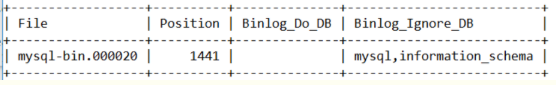
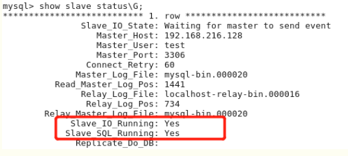
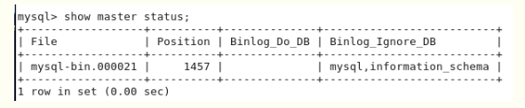
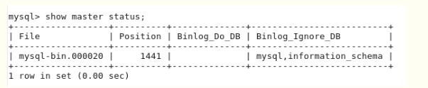

###### datetime:2019/9/5 10:01
###### author:nzb

## MySQL的主从复制

### 主从复制

- 两台数据库服务器(Linux服务器), IP分别为192.168.1.110和192.168.1.111,服务器上装上MySQL(版本为5.7)

- 打开主数据库配置文件：vim /etc/mysql/my.cnf, 加入以下内容后重启MySQL服务
```text
    [mysqld]
    log-bin=mysql-bin
    server-id=1     （默认为1，总之两台服务器要设置为不同的ID）
```

- 打开从数据库配置文件：vim /etc/mysql/my.cnf, 加入相同内容后将其中的 server-id 设为2（默认为1）然后重启MySQL服务

- 设192.168.1.110为主数据库, 在数据库中加入一个从服务器可以登录的用户, 语句如下：
```sql
    GRANT ALL PRIVILEGES ON *.* TO 'user'@'192.168.1.111' IDENTIFIED BY 'password' WITH GRANT OPTION;(或 GRANT REPLICATION SLAVE ON *.* TO 'username'@'192.168.1.111' IDENTIFIED BY 'password' WITH GRANT OPTION;)
    FLUSH PRIVILEGES;
```

- 完成后, 在192.168.1.111服务器上执行：mysql -h 192.168.1.110 -u用户名 -p密码, 查看连接是否成功

- 最后在主数据库中执行以下语句, 查询master状态：show master status;

可以看到以上结果，这儿只需要看 File 和 Position，其它的两个分别是白名单和黑名单，意思为同步哪几个数据库和不同步哪几个数据库，可自行根据需求进行设置。记录了前两个字段后，在从库上执行以下语句：
```sql
    CHANGE MASTER TO
    MASTER_HOST='192.168.1.110',
    MASTER_USER='user',
    MASTER_PASSWORD='password',
    MASTER_LOG_FILE='mysql-bin.000020',
    MASTER_LOG_POS=1441;
```

- 执行完成后, 在从数据库上继续执行以下语句：
```sql
    slava start;
    show slave status\G;
```

- 这样，查看从服务器的状态，如果状态中的用红线标出来两个参数的值都为YES，那证明配置已经成功，否则可以检查一下具体问题出现在什么地方。


- 这样，就算配置完成了。在主库中新建数据库，新建一张表，插几条数据，到从库上查询一下看是否已经同步过来。

- **PS**:如果失败，可以从以下几个方面去排查问题：　　

    - 1.首先试一下主从服务器相互之间是否 PING 得通
    
    - 2.试一下远程连接是否正确，如果连不上，则有可能是网卡不一致、防火墙没有放行 3306 端口
    
    - 3.server-id 是否配成一致
    
    - 4.bin-log 的信息是否正确

### 主主复制

- 上面说了主从复制的配置方法，现在接着上面的配置继续，然后实现双主复制，让以上的两个服务器互为主从。

- 在主服务器上配置 /etc/mysql/my.cnf 文件，配置如下,配置之后重启MYSQL服务:
```editorconfig
    auto_increment_increment=2         #步进值auto_imcrement。一般有n台主MySQL就填n
    auto_increment_offset=1            #起始值。一般填第n台主MySQL。此时为第一台主MySQL
    binlog-ignore=mysql                #忽略mysql库【一般都不写】
    binlog-ignore=information_schema   #忽略information_schema库【一般都不写】
```

- 在从服务器上配置 /etc/mysql/my.cnf 文件，配置如下, 配置之后重启MYSQL服务:
```editorconfig
    auto_increment_increment=2   #步进值auto_imcrement。一般有n台主MySQL就填n
    auto_increment_offset=2   #起始值。一般填第n台主MySQL。此时为第二台主MySQL
    binlog-ignore=mysql   #忽略mysql库【一般都不写】
    binlog-ignore=information_schema   #忽略information_schema库【一般都不写】
```

- 在从服务器上添加一个主服务器可以访问的用户，命令如下：
```sql
    GRANT REPLICATION SLAVE ON *.* TO 'user'@'192.168.1.110' IDENTIFIED BY 'password' with grant option ;
    FLUSH PRIVILEGES
```

- 建好之后在192.168.1.110服务器上访问从数据库, 测试是否成功，如果可以连上，则进行下一步，连不上的话，参考上面进行问题排查。

- 因为要互为主从，所以现在从服务器也是master ，所以也要查看一下状态：show master status;


- 查到相应的信息后，在原来的主服务器上执行以下命令（因为现在它现在也是另一台的从服务器）
```sql
    CHANGE MASTER TO
    MASTER_HOST='192.168.1.111',
    MASTER_USER='user',
    MASTER_PASSWORD='password',
    MASTER_LOG_FILE='mysql-bin.000021',
    MASTER_LOG_POS=1457;
```

- 执行完毕后，在原主库上继续执行如下语句：
```sql
    start slave;
    show slave status\G;
```

- 同上，如果出现如下画面，则证明配置成功。


- 在两台服务器的MYSQL中分别进行一些建库、建表、插入、更新等操作，看一下另一台会不会进行同步，如果可以则证明主主配置成功，否则还是上面的排错方法，进行错误排查。

### 双主多从

- 现在已经是双主配置了，但是如果要进行读写分离，那么我们要再增加N台从库，如何做呢？非常简单，按如下操作即可：

- 新增加一台数据库服务器，192.168.1.112，数据库配置均与前两台相同

- 确定一下要将哪一台当作自己的主服务器，我们姑且设 192.168.1.110 为主服务器

- 在第三台服务器中编辑 /etc/mysql/my.cnf ，将其 server-id 设为 3（保证与前两个不一样即可），然后重启MYSQL服务

- 在主服务器中，增加一条用户记录，用于当前服务器对主库对的连接，代码如下：
```sql
    GRANT REPLICATION SLAVE ON *.* TO 'user'@'192.168.1.112' IDENTIFIED BY 'password';
    FLUSH PRIVILEGES;
```

- 在 192.168.216.130 服务器上测试是否可以连接到主库: `mysql -h 192.168.1.110 -u用户名 -p密码`, 如果可以连上，则可以进行下一步，否则根据上面的提示排查问题。

- 在 192.168.216.130 服务器上查询 master 当前状态: show master status;


- 看到相关信息后，我们执行如下操作：
```sql
    CHANGE MASTER TO
    MASTER_HOST='192.168.1.110',
    MASTER_USER='user',
    MASTER_PASSWORD='password',
    MASTER_LOG_FILE='mysql-bin.000020',
    MASTER_LOG_POS=1441;
```

- 执行完毕后，在原主库上继续执行如下语句：
```sql
    start slave;
    show slave status\G;
```

- 同上，如果出现如下画面，则证明配置成功。如果此处有问题，参考上面所提排查并解决问题。


- 此时我们在 192.168.1.110 上建库、建表、插入、更新、删除数据，在 另外两台上分别进行查看，发现均已经同步。
但是如果我们在 192.168.1.111 上做相应的操作，则发现只有 192.168.1.110 上进行了相应的同步，而 192.168.1.112 上的数据并未同步。
这是为什么呢？因为我们设置的主库是 192.168.1.110，所以在 192.168.1.111 进行数据操作的时候并未同步，这显然不符合我们的需求，
那么，我们要怎么修改呢？非常简单，在互为主从的两台服务器的配置文件中均加入以下语句：`log-slave-updates=on`

- 加上后将两台服务器的MYSQL重启，然后再进行测试，发现数据已经可以同步了。如果要再多加一些从服务器，和以上类似，现在我们做的是双主一从，我们可以再加N台从服务器，配置也是一样的。

- 至此，MYSQL主从复制、主主复制、双主多从配置我们均已经搞定！