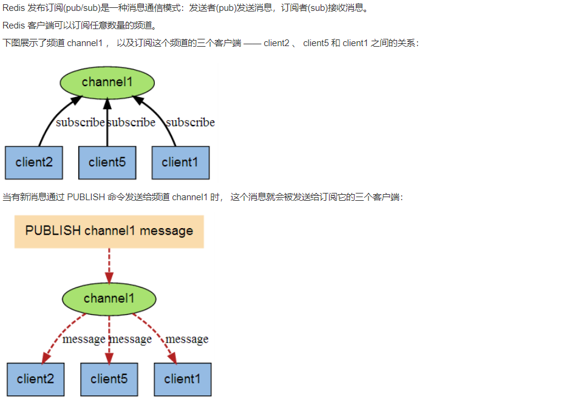
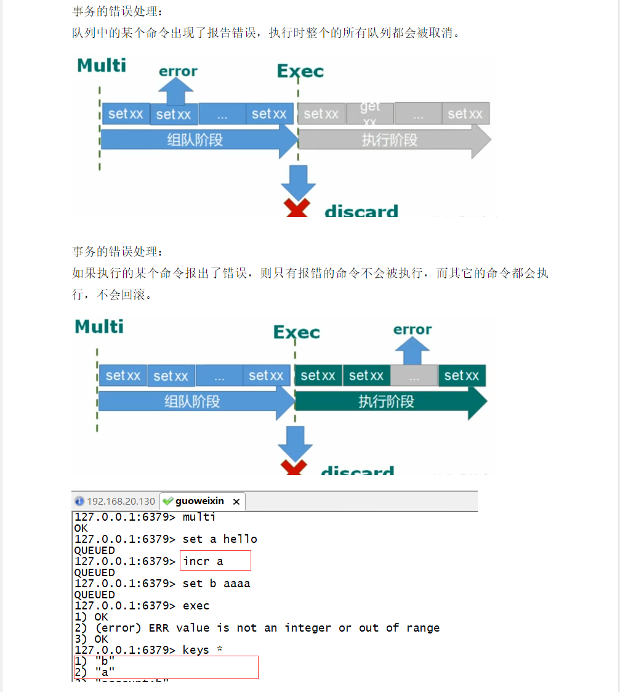
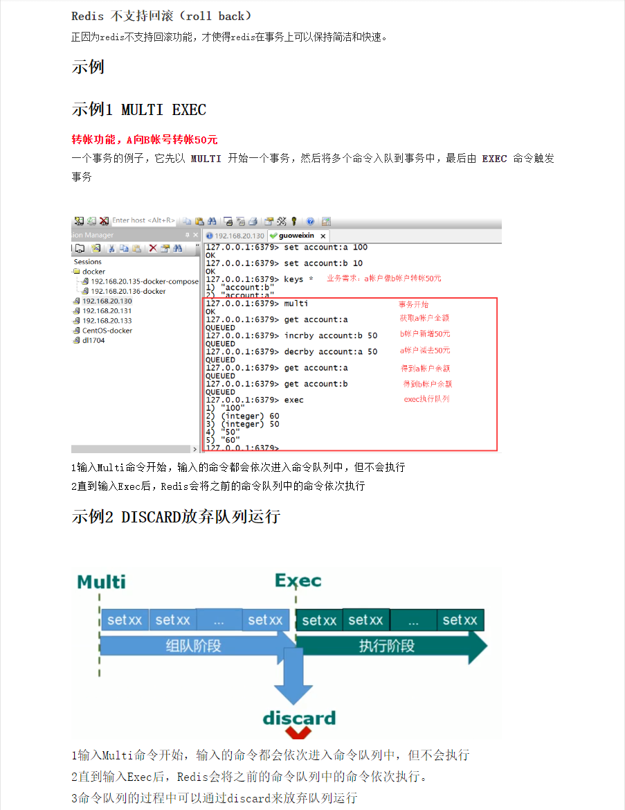
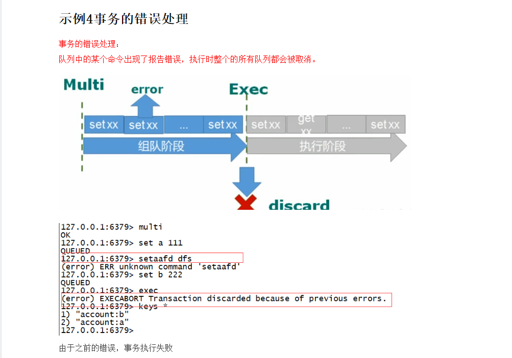
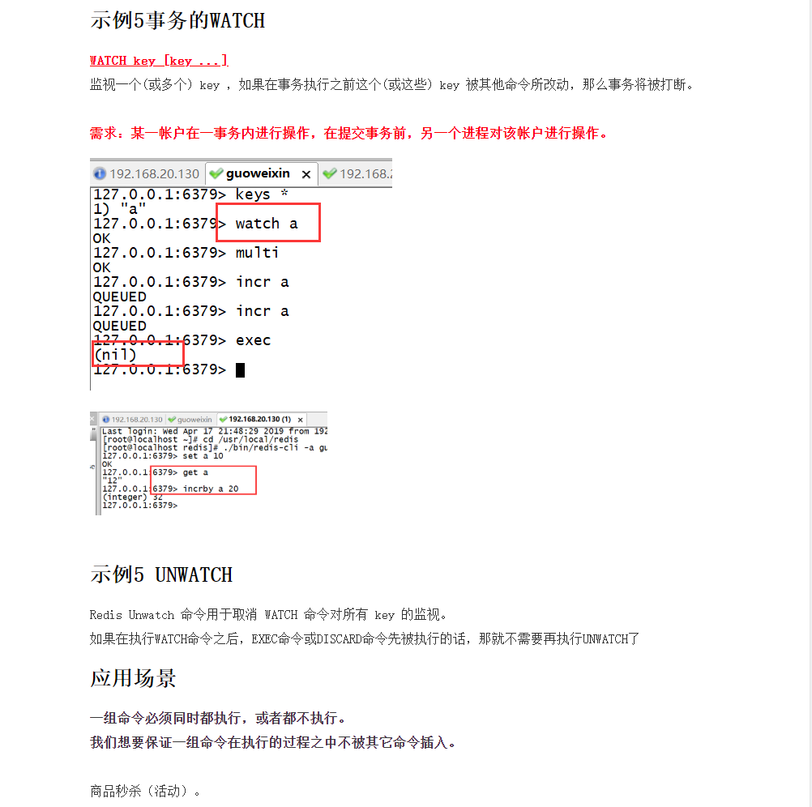
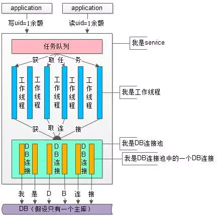
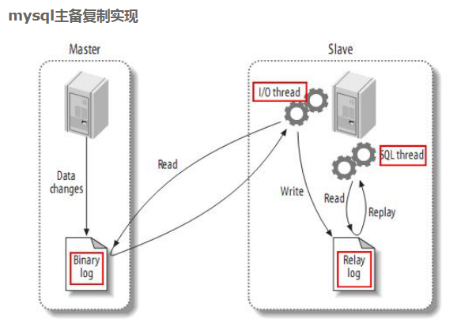

###### datetime:2019/10/31 16:02
###### author:nzb

## Redis基础

### 应用场景

- EXPIRE key seconds
    
    - 限时的优惠活动信息
    - 网站数据缓存(对于一些需要定时更新的数据,例如:积分排行榜)
    - 手机验证码
    - 限制网站访客访问频率(例如：1分钟最多访问10次)

### [Redis键(key)](https://www.runoob.com/redis/redis-keys.html)

- `DEL key`
该命令用于在 key 存在时删除 key(所有类型都可以使用)。

- `DUMP key`
序列化给定 key ，并返回被序列化的值。

- `EXISTS key`
检查给定 key 是否存在。

- `EXPIRE key seconds`
为给定 key 设置过期时间，以秒计。

- `EXPIREAT key timestamp`
EXPIREAT 的作用和 EXPIRE 类似，都用于为 key 设置过期时间。 不同在于 EXPIREAT 命令接受的时间参数是 UNIX 时间戳(unix timestamp)。

- `PEXPIRE key milliseconds`
设置 key 的过期时间以毫秒计。

- `PEXPIREAT key milliseconds-timestamp`
设置 key 过期时间的时间戳(unix timestamp) 以毫秒计

- `KEYS pattern`
查找所有符合给定模式( pattern)的 key 。

- `MOVE key db`
将当前数据库的 key 移动到给定的数据库 db 当中。

    示例：
    ```text
        # key 存在于当前数据库
        
        redis> SELECT 0                             # redis默认使用数据库 0，为了清晰起见，这里再显式指定一次。
        OK
        
        redis> SET song "secret base - Zone"
        OK
        
        redis> MOVE song 1                          # 将 song 移动到数据库 1
        (integer) 1
        
        redis> EXISTS song                          # song 已经被移走
        (integer) 0
        
        redis> SELECT 1                             # 使用数据库 1
        OK
        
        redis:1> EXISTS song                        # 证实 song 被移到了数据库 1 (注意命令提示符变成了"redis:1"，表明正在使用数据库 1)
        (integer) 1
        
        
        # 当 key 不存在的时候
        
        redis:1> EXISTS fake_key
        (integer) 0
        
        redis:1> MOVE fake_key 0                    # 试图从数据库 1 移动一个不存在的 key 到数据库 0，失败
        (integer) 0
        
        redis:1> select 0                           # 使用数据库0
        OK
        
        redis> EXISTS fake_key                      # 证实 fake_key 不存在
        (integer) 0
        
        
        # 当源数据库和目标数据库有相同的 key 时
        
        redis> SELECT 0                             # 使用数据库0
        OK
        redis> SET favorite_fruit "banana"
        OK
        
        redis> SELECT 1                             # 使用数据库1
        OK
        redis:1> SET favorite_fruit "apple"
        OK
        
        redis:1> SELECT 0                           # 使用数据库0，并试图将 favorite_fruit 移动到数据库 1
        OK
        
        redis> MOVE favorite_fruit 1                # 因为两个数据库有相同的 key，MOVE 失败
        (integer) 0
        
        redis> GET favorite_fruit                   # 数据库 0 的 favorite_fruit 没变
        "banana"
        
        redis> SELECT 1
        OK
        
        redis:1> GET favorite_fruit                 # 数据库 1 的 favorite_fruit 也是
        "apple"
    ```

- `PERSIST key`
移除 key 的过期时间，key 将持久保持。

    示例
    ```text
        redis> SET mykey "Hello"
        OK
        
        redis> EXPIRE mykey 10  # 为 key 设置生存时间
        (integer) 1
        
        redis> TTL mykey
        (integer) 10
        
        redis> PERSIST mykey    # 移除 key 的生存时间
        (integer) 1
        
        redis> TTL mykey
        (integer) -1
    ```

- `PTTL key`
以毫秒为单位返回 key 的剩余的过期时间。

- `TTL key`
以秒为单位，返回给定 key 的剩余生存时间(TTL, time to live)。

    示例
    ```text
        # 不存在的 key
        
        redis> FLUSHDB
        OK
        
        redis> TTL key
        (integer) -2
        
        
        # key 存在，但没有设置剩余生存时间
        
        redis> SET key value
        OK
        
        redis> TTL key
        (integer) -1
        
        
        # 有剩余生存时间的 key
        
        redis> EXPIRE key 10086
        (integer) 1
        
        redis> TTL key
        (integer) 10084
    ```

- `RANDOMKEY`
从当前数据库中随机返回一个 key 。

- `RENAME key newkey`
修改 key 的名称

- `RENAMENX key newkey`
仅当 newkey 不存在时，将 key 改名为 newkey 。

- `TYPE key`
返回 key 所储存的值的类型。     

- key的命名规范

    redis 单个key存入512M大小
    
    - key不要太长，尽量不要超过1024字节，这不仅消耗内存，而且降低查找的效率
    - key也不要太短，太短的话，key的可读性会降低
    - 在一个项目中，key最好使用统一的命名模式，例如：user:123:password(推荐":"，不建议"_"，因为程序里面有的变量是以下划线连接的)

### [Redis 字符串(String)](https://www.runoob.com/redis/redis-strings.html)

- `SET key value`
SET 命令用于设置给定 key 的值。如果 key 已经存储其他值， SET 就覆写旧值，且无视类型。

- `GET key`
Get 命令用于获取指定 key 的值。如果 key 不存在，返回 nil 。如果key 储存的值不是字符串类型，返回一个错误。

- `SETNX key value`  
只有在 key 不存在时设置 key 的值。应用于解决分布式锁方案之一

- `INCR key`
将 key 中储存的数字值增一。

- `INCRBY key increment`
将 key 所储存的值加上给定的增量值（increment） 。

- `DECR key`
将 key 中储存的数字值减一。

- `DECRBY key decrement`
key 所储存的值减去给定的减量值（decrement） 。

- `INCRBYFLOAT key increment`
将 key 所储存的值加上给定的浮点增量值（increment） 。

- `APPEND key value`
如果 key 已经存在并且是一个字符串， APPEND 命令将指定的 value 追加到该 key 原来值（value）的末尾。

- `GETRANGE key start end`
返回 key 中字符串值的子字符

- `GETSET key value`
将给定 key 的值设为 value ，并返回 key 的旧值(old value)。

- `GETBIT key offset`
对 key 所储存的字符串值，获取指定偏移量上的位(bit)。

- `MGET key1 [key2..]`
获取所有(一个或多个)给定 key 的值。

- `SETBIT key offset value`
对 key 所储存的字符串值，设置或清除指定偏移量上的位(bit)。

- `SETEX key seconds value`
将值 value 关联到 key ，并将 key 的过期时间设为 seconds (以秒为单位)。

- `SETRANGE key offset value`
用 value 参数覆写给定 key 所储存的字符串值，从偏移量 offset 开始。

- `STRLEN key`
返回 key 所储存的字符串值的长度。

- `MSET key value [key value ...]`
同时设置一个或多个 key-value 对。

- `MSETNX key value [key value ...]`
同时设置一个或多个 key-value 对，当且仅当所有给定 key 都不存在。

- `PSETEX key milliseconds value`
这个命令和 SETEX 命令相似，但它以毫秒为单位设置 key 的生存时间，而不是像 SETEX 命令那样，以秒为单位。

- 应用场景

    - String通常应用于保存单个字符串或json字符串数据
    - 因String是二进制安全的，所有完全可以把一个图片文件的内容作为字符串来存储
    - 计算器(通常key-value缓存一样，常规计数：微博数，粉丝数) INCR等指令就具有原子操作的特性，所有完全可以利用redis的INCR、INCRBY、DECR、DECRBY等指令来实现原子计数的效果。

### [Redis 哈希(Hash)](https://www.runoob.com/redis/redis-hashes.html)

```text
    Redis hash 是一个 string 类型的 field 和 value 的映射表，hash 特别适合用于存储对象。
    
    Redis 中每个 hash 可以存储 232 - 1 键值对（40多亿）。
```

- `HDEL key field1 [field2]`
删除一个或多个哈希表字段

- `HEXISTS key field`
查看哈希表 key 中，指定的字段是否存在。

- `HGET key field`
获取存储在哈希表中指定字段的值。

- `HGETALL key`
获取在哈希表中指定 key 的所有字段和值

- `HINCRBY key field increment`
为哈希表 key 中的指定字段的整数值加上增量 increment 。

- `HINCRBYFLOAT key field increment`
为哈希表 key 中的指定字段的浮点数值加上增量 increment 。

- `HKEYS key`
获取所有哈希表中的字段

- `HLEN key`
获取哈希表中字段的数量

- `HMGET key field1 [field2]`
获取所有给定字段的值

- `HMSET key field1 value1 [field2 value2 ]`
同时将多个 field-value (域-值)对设置到哈希表 key 中。

- `HSET key field value`
将哈希表 key 中的字段 field 的值设为 value 。

- `HSETNX key field value`
只有在字段 field 不存在时，设置哈希表字段的值。

- `HVALS key`
获取哈希表中所有值

- `HSCAN key cursor [MATCH pattern] [COUNT count]`
迭代哈希表中的键值对。

- 应用场景
    
    - 常用与存储一个对象
    - 为什么不用String存储一个对象？
    
        因为hash是最接近关系数据库结果的数据类型，可以将数据库一条记录或程序中一个对象转换成hashmap存放在redis中

### [Redis 列表(List)](https://www.runoob.com/redis/redis-lists.html)

```text
    Redis列表是简单的字符串列表，按照插入顺序排序。你可以添加一个元素到列表的头部（左边）或者尾部（右边）
    
    一个列表最多可以包含 232 - 1 个元素 (4294967295, 每个列表超过40亿个元素)。
```
- `BLPOP key1 [key2 ] timeout`
移出并获取列表的第一个元素， 如果列表没有元素会阻塞列表直到等待超时或发现可弹出元素为止。

- `BRPOP key1 [key2 ] timeout`
移出并获取列表的最后一个元素， 如果列表没有元素会阻塞列表直到等待超时或发现可弹出元素为止。

- `BRPOPLPUSH source destination timeout`
从列表中弹出一个值，将弹出的元素插入到另外一个列表中并返回它； 如果列表没有元素会阻塞列表直到等待超时或发现可弹出元素为止。

- `LINDEX key index`
通过索引获取列表中的元素

- `LINSERT key BEFORE|AFTER pivot value`
在列表的元素前或者后插入元素

- `LLEN key`
获取列表长度

- `LPOP key`
移出并获取列表的第一个元素

- `LPUSH key value1 [value2]`
将一个或多个值插入到列表头部

- `LPUSHX key value`
将一个值插入到已存在的列表头部

- `LRANGE key start stop`
获取列表指定范围内的元素

- `LREM key count value`
移除列表元素

- `LSET key index value`
通过索引设置列表元素的值

- `LTRIM key start stop`
对一个列表进行修剪(trim)，就是说，让列表只保留指定区间内的元素，不在指定区间之内的元素都将被删除。

- `RPOP key`
移除列表的最后一个元素，返回值为移除的元素。

- `RPOPLPUSH source destination`
移除列表的最后一个元素，并将该元素添加到另一个列表并返回

- `RPUSH key value1 [value2]`
在列表中添加一个或多个值

- `RPUSHX key value`
为已存在的列表添加值

- 应用场景(1、对数据量大的集合数据删减 2、任务队列 )

    - 对数据量大的集合数据删减：列表数据显示、关注列表、粉丝列表、留言评价等...分页、热点新闻(top)等。利用LANGE还可以很方便的实现分页的功能，在博客系统中，每片博文的评论也可以存入一个单独的list中。
    - 任务队列(list通常用来实现一个消息队列，而且可以确保先后顺序，不必像MySQL那样需要通过ORDER BY 来进行排序)
      
      - 任务队列介绍(生产者和消费者模式)
        
        ```text
            在处理Web客服端发送的命令请求时，某些操作的执行时间可能会比我们预期的更长一些，通过将待执行任务的相关信息放入队列里面，并在之后对队列进行处理，用户可以推迟执行那些需要一段时间才能完成的操作，这种将工作交给任务处理器来执行的做法被称为任务队列(task queue)
            常用案例：订单系统的下单流程、用户系统登录注册短信等。
        ```

### [Redis 集合(Set)](https://www.runoob.com/redis/redis-sets.html)

```text
    Redis 的 Set 是 String 类型的无序集合。集合成员是唯一的，这就意味着集合中不能出现重复的数据。
    
    Redis 中集合是通过哈希表实现的，所以添加，删除，查找的复杂度都是 O(1)。
    
    集合中最大的成员数为 232 - 1 (4294967295, 每个集合可存储40多亿个成员)。
```

- `SADD key member1 [member2]`
向集合添加一个或多个成员

- `SCARD key`
获取集合的成员数

- `SDIFF key1 [key2]`
返回给定所有集合的差集

- `SDIFFSTORE destination key1 [key2]`
返回给定所有集合的差集并存储在 destination 中

- `SINTER key1 [key2]`
返回给定所有集合的交集

- `SINTERSTORE destination key1 [key2]`
返回给定所有集合的交集并存储在 destination 中

- `SISMEMBER key member`
判断 member 元素是否是集合 key 的成员

- `SMEMBERS key`
返回集合中的所有成员

- `SMOVE source destination member`
将 member 元素从 source 集合移动到 destination 集合

- `SPOP key`
移除并返回集合中的一个随机元素

- `SRANDMEMBER key [count]`
返回集合中一个或多个随机数

- `SREM key member1 [member2]`
移除集合中一个或多个成员

- `SUNION key1 [key2]`
返回所有给定集合的并集

- `SUNIONSTORE destination key1 [key2]`
所有给定集合的并集存储在 destination 集合中

- `SSCAN key cursor [MATCH pattern] [COUNT count]`
迭代集合中的元素

- 应用场景
    
    常应用于：对两个集合间的数据[计算]进行交集、并集、差集运算 
    - 1、以非常方便的实现如共同关注、共同喜好、二度好友等功能。对上面的所有集合操作，你还可以使用不同的命令选择将结果返回给客户端还是存储到一个新的集合中。
    - 2、利用唯一性，可以统计访问网站的所有独立 IP

### [Redis 有序集合(sorted set)](https://www.runoob.com/redis/redis-sorted-sets.html)

```text
    Redis 有序集合和集合一样也是string类型元素的集合,且不允许重复的成员。
    
    不同的是每个元素都会关联一个double类型的分数。redis正是通过分数来为集合中的成员进行从小到大的排序。
    
    有序集合的成员是唯一的,但分数(score)却可以重复。
    
    集合是通过哈希表实现的，所以添加，删除，查找的复杂度都是O(1)。 集合中最大的成员数为 232 - 1 (4294967295, 每个集合可存储40多亿个成员)。
```


- `ZADD key score1 member1 [score2 member2]`
向有序集合添加一个或多个成员，或者更新已存在成员的分数

- `ZCARD key`
获取有序集合的成员数

- `ZCOUNT key min max`
计算在有序集合中指定区间分数的成员数

- `ZINCRBY key increment member`
有序集合中对指定成员的分数加上增量 increment

- `ZINTERSTORE destination numkeys key [key ...]`
计算给定的一个或多个有序集的交集并将结果集存储在新的有序集合 key 中

- `ZLEXCOUNT key min max`
在有序集合中计算指定字典区间内成员数量

- `ZRANGE key start stop [WITHSCORES]`
通过索引区间返回有序集合指定区间内的成员

- `ZRANGEBYLEX key min max [LIMIT offset count]`
通过字典区间返回有序集合的成员

- `ZRANGEBYSCORE key min max [WITHSCORES] [LIMIT]`
通过分数返回有序集合指定区间内的成员

- `ZRANK key member`
返回有序集合中指定成员的索引

- `ZREM key member [member ...]`
移除有序集合中的一个或多个成员

- `ZREMRANGEBYLEX key min max`
移除有序集合中给定的字典区间的所有成员

- `ZREMRANGEBYRANK key start stop`
移除有序集合中给定的排名区间的所有成员

- `ZREMRANGEBYSCORE key min max`
移除有序集合中给定的分数区间的所有成员

- `ZREVRANGE key start stop [WITHSCORES]`
返回有序集中指定区间内的成员，通过索引，分数从高到低

- `ZREVRANGEBYSCORE key max min [WITHSCORES]`
返回有序集中指定分数区间内的成员，分数从高到低排序

- `ZREVRANK key member`
返回有序集合中指定成员的排名，有序集成员按分数值递减(从大到小)排序

- `ZSCORE key member`
返回有序集中，成员的分数值

- `ZUNIONSTORE destination numkeys key [key ...]`
计算给定的一个或多个有序集的并集，并存储在新的 key 中

- `ZSCAN key cursor [MATCH pattern] [COUNT count]`
迭代有序集合中的元素（包括元素成员和元素分值）

- 应用场景

    常应用于：排行榜 
    - 比如twitter 的public timeline可以以发表时间作为score来存储，这样获取时就是自动按时间排好序的。
    - 比如一个存储全班同学成绩的Sorted Set，其集合value可以是同学的学号，而score就可以是其考试得分，这样在数据插入集合的时候，就已经进行了天然的排序。
    - 还可以用Sorted Set来做带权重的队列，比如普通消息的score为1，重要消息的score为2，然后工作线程可以选择按score的倒序来获取工作任务。让重要的任务优先执行。

### [Redis 发布订阅](https://www.runoob.com/redis/redis-pub-sub.html)




- `PSUBSCRIBE pattern [pattern ...]`
订阅一个或多个符合给定模式的频道。

- `SUBSCRIBE channel [channel ...]`
订阅给定的一个或多个频道的信息。

- `PUBLISH channel message`
将信息发送到指定的频道。

- `PUBSUB subcommand [argument [argument ...]]`
查看订阅与发布系统状态。


- `UNSUBSCRIBE [channel [channel ...]]`
指退订给定的频道。

- `PUNSUBSCRIBE [pattern [pattern ...]]`
退订所有给定模式的频道。

- 应用场景
    
    这一功能最明显的用法就是构建实时消息系统，比如普通的即时聊天，群聊等功能
    - 在一个博客网站中，有100个粉丝订阅了你，当你发布新文章，就可以推送消息给粉丝们。
    - 微信公众号模式

### Redis多数据库

```text
    Redis下，数据库是由一个整数索引标识，而不是由一个数据库名称。默认情况下，一个客户端连接到数据库0。
    redis配置文件中下面的参数来控制数据库总数：
        database 16  //(从0开始 1 2 3 …15)
    
    select 数据库//数据库的切换
    
    移动数据（将当前key移动另个库)
    move key名称   数据库
    数据库清空：
        flushdb    //清除当前数据库的所有key
        flushall   //清除整个Redis的数据库所有key
```

### [Redis 事务](https://www.runoob.com/redis/redis-transactions.html)

```text
    Redis 事务可以一次执行多个命令， 并且带有以下三个重要的保证：
    
        批量操作在发送 EXEC 命令前被放入队列缓存。
        收到 EXEC 命令后进入事务执行，事务中任意命令执行失败，其余的命令依然被执行。
        在事务执行过程，其他客户端提交的命令请求不会插入到事务执行命令序列中。
    
    一个事务从开始到执行会经历以下三个阶段：
    
        开始事务。
        命令入队。
        执行事务。
```

```text
    单个 Redis 命令的执行是原子性的，但 Redis 没有在事务上增加任何维持原子性的机制，所以 Redis 事务的执行并不是原子性的。
    
    事务可以理解为一个打包的批量执行脚本，但批量指令并非原子化的操作，中间某条指令的失败不会导致前面已做指令的回滚，也不会造成后续的指令不做。
```

- `DISCARD`
取消事务，放弃执行事务块内的所有命令。

- `EXEC`
执行所有事务块内的命令。

- `MULTI`
标记一个事务块的开始。

- `UNWATCH`
取消 WATCH 命令对所有 key 的监视。

- `WATCH key [key ...]`
监视一个(或多个) key ，如果在事务执行之前这个(或这些) key 被其他命令所改动，那么事务将被打断。







### Redis数据淘汰策略redis.conf

```text
    Redis官方给的警告，当内存不足时，Redis会根据配置的缓存策略淘汰部分Keys，以保证写入成功。当无淘汰策略时或没有找到适合淘汰的Key时，Redis直接返回out of memory错误。
    
    最大缓存配置
    在 redis 中，允许用户设置最大使用内存大小
                 maxmemory  512G
    
    redis 提供6种数据淘汰策略：
    volatile-lru：从已设置过期时间的数据集中挑选最近最少使用的数据淘汰
    volatile-lfu：从已设置过期的Keys中，删除一段时间内使用次数最少使用的
    volatile-ttl：从已设置过期时间的数据集中挑选最近将要过期的数据淘汰
    volatile-random：从已设置过期时间的数据集中随机选择数据淘汰
    allkeys-lru：从数据集中挑选最近最少使用的数据淘汰
    allkeys-lfu：从所有Keys中，删除一段时间内使用次数最少使用的
    allkeys-random：从数据集中随机选择数据淘汰
    no-enviction（驱逐）：禁止驱逐数据(不采用任何淘汰策略。默认即为此配置),针对写操作，返回错误信息
    
    建议：了解了Redis的淘汰策略之后，在平时使用时应尽量主动设置/更新key的expire时间，主动剔除不活跃的旧数据，有助于提升查询性能
```

### Redis持久化

```text
    数据存放于：
    内存：高效、断电（关机）内存数据会丢失
    硬盘：读写速度慢于内存，断电数据不会丢失
```

- RDB 

    RDB：是redis的默认持久化机制。     RDB相当于照快照，保存的是一种状态。
    
    几十G数据 -->  几KB快照
    
    快照是默认的持久化方式。这种方式是就是将内存中数据以快照的方式写入到二进制文件中,默认的文件名为dump.rdb。
    
    优点：
    - 快照保存数据极快、还原数据极快
    - 适用于灾难备份
    - 缺点：小内存机器不适合使用,RDB机制符合要求就会照快照
    
    快照条件：
    - 1、服务器正常关闭时  ./bin/redis-cli shutdown
    - 2、key满足一定条件，会进行快照
     
      - save 900 1     //每900秒（15分钟）至少1个key发生变化，产生快照
      
      - save 300 10   //每300秒（5分钟）至少10个key发生变化，产生快照
      
      - save 60 10000   //每60秒（1分钟）至少10000个key发生变化，产生快照

- AOF

```text
    由于快照方式是在一定间隔时间做一次的，所以如果redis 意外down 掉的话，就会丢失最后一次快照后的所有修改。如果应用要求不能丢失任何修改的话，可以采用aof 持久化方式。
    Append-only file:aof 比快照方式有更好的持久化性，是由于在使用aof 持久化方式时,redis 会将每一个收到的写命令都通过write 函数追加到文件中(默认是appendonly.aof)。当redis 重启时会通过重新执行文件中保存的写命令来在内存中重建整个数据库的内容。
```

有三种方式如下（默认是：每秒 fsync 一次）

    appendonly yes //启用 aof 持久化方式
    appendfsync always //收到写命令就立即写入磁盘，最慢，但是保证完全的持久化
    appendfsync everysec //每秒钟写入磁盘一次，在性能和持久化方面做了很好的折中
    appendfsync no //完全依赖 os，性能最好,持久化没保证


产生的问题：
 
    aof 的方式也同时带来了另一个问题。持久化文件会变的越来越大。例如我们调用 incr test命令 100 次，文件中必须保存全部的 100 条命令，其实有 99 条都是多余的。

### redis缓存与数据库(MySQL)一致性方案

#### 一、实时同步

对强一致要求比较高的，应采用实时同步方案，即查询缓存查询不到再从DB查询，保存到缓存；更新缓存时，先更新数据库，再将缓存的设置过期(建议不要去更新缓存内容，直接设置缓存过期)。
- @Cacheable：查询时使用，注意Long类型需转换为Sting类型，否则会抛异常
- @CachePut：更新时使用，使用此注解，一定会从DB上查询数据
- @CacheEvict：删除时使用；
- @Caching：组合用法  

#### 二、异步队列

对于并发程度较高的，可采用异步队列的方式同步，可采用kafka等消息中间件处理消息生产和消费。



#### 三、使用阿里的同步工具canal
canal实现方式是模拟mysql slave和master的同步机制，监控DB bitlog的日志更新来触发缓存的更新，此种方法可以解放程序员双手，减少工作量，但在使用时有些局限性。



- master将改变记录到二进制日志(binary log)中（这些记录叫做二进制日志事件，binary log events，可以通过show binlog events进行查看）；
- slave将master的binary log events拷贝到它的中继日志(relay log)；
- slave重做中继日志中的事件，将改变反映它自己的数据。


- canal模拟mysql slave的交互协议，伪装自己为mysql slave，向mysql master发送dump协议
- mysql master收到dump请求，开始推送binary log给slave(也就是canal)
- canal解析binary log对象(原始为byte流)

#### 四、采用UDF自定义函数的方式
面对mysql的API进行编程，利用触发器进行缓存同步，但UDF主要是c/c++语言实现，学习成本高。

#### 总结：

##### 穿透

- 缓存穿透是指查询一个一定不存在的数据，由于缓存是不命中时需要从数据库查询，查不到数据则不写入缓存，这将导致这个不存在的数据每次请求都要到数据库去查询，造成缓存穿透。
- 解决办法： 持久层查询不到就缓存空结果，查询时先判断缓存中是否exists(key) ,如果有直接返回空，没有则查询后返回，
- 注意insert时需清除查询的key，否则即便DB中有值也查询不到(当然也可以设置空缓存的过期时间）

##### 雪崩

- 雪崩：缓存大量失效的时候，引发大量查询数据库。
- 解决办法：
    - 用锁/分布式锁或者队列串行访问
    - 缓存失效时间均匀分布

##### 热点key

- 热点key:某个key访问非常频繁，当key失效的时候有大量线程来构建缓存，导致负载增加，系统崩溃。
- 解决办法：
    - 使用锁，单机用synchronized,lock等，分布式用分布式锁。
    - 缓存过期时间不设置，而是设置在key对应的value里。如果检测到存的时间超过过期时间则异步更新缓存。
    - 在value设置一个比过期时间t0小的过期时间值t1，当t1过期的时候，延长t1并做更新缓存操作。
    - 设置标签缓存，标签缓存设置过期时间，标签缓存过期后，需异步地更新实际缓存 


