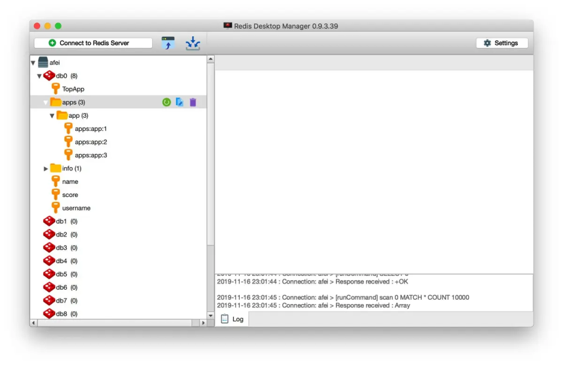
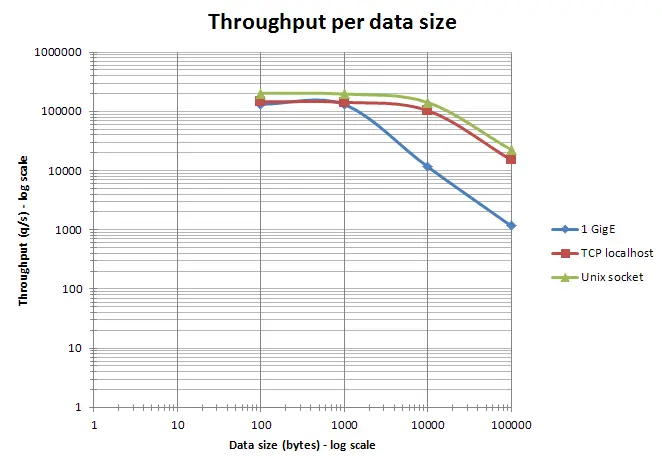

###### datetime:2022/06/30
###### author:nzb

# Redis开发规范

## 一、键值设计

### 1. key名设计

#### (1)【建议】: 可读性和可管理性

以业务名(或数据库名)为前缀(防止key冲突)，用冒号分隔，比如业务名:表名:id
```text
ugc:video:1
```

因为很多Redis客户端是根据冒号分类的。比如有几个Key：apps:app:1、apps:app:2和apps:app:3。Redis Desktop Manager能自动归类到apps目录下。如下图所示：


#### (2)【建议】：简洁性

保证语义的前提下，控制key的长度，当key较多时，内存占用也不容忽视，例如：
```text
user:{uid}:friends:messages:{mid}简化为u:{uid}:fr:m:{mid}。
```
#### (3)【强制】：不要包含特殊字符

反例：包含空格、换行、单双引号以及其他转义字符

[详细解析](https://mp.weixin.qq.com/s?spm=a2c6h.12873639.0.0.753b1feed5xp9e&__biz=Mzg2NTEyNzE0OA==&mid=2247483663&idx=1&sn=7c4ad441eaec6f0ff38d1c6a097b1fa4&chksm=ce5f9e8cf928179a2c74227da95bec575bdebc682e8630b5b1bb2071c0a1b4be6f98d67c37ca&scene=21#wechat_redirect)

### 2. value设计

#### (1)【强制】：拒绝bigkey(防止网卡流量、慢查询)

string类型控制在10KB以内，hash、list、set、zset元素个数不要超过5000。

> 这是因为Redis随着Value不断增长，在超过10KB后，有一个非常奇妙的性能拐点，如下图所示（[图片来自Redis官网](http://redis.cn/topics/benchmarks.html))



**反例：一个包含200万个元素的list。**

非字符串的bigkey，不要使用del删除，使用hscan、sscan、zscan方式渐进式删除，同时要注意防止bigkey过期时间自动删除问题(例如一个200万的zset设置1小时过期，会触发del操作，造成阻塞，而且该操作不会不出现在慢查询中(latency可查))，查找方法和删除方法。

[详细解析](https://mp.weixin.qq.com/s?spm=a2c6h.12873639.0.0.753b1feed5xp9e&__biz=Mzg2NTEyNzE0OA==&mid=2247483677&idx=1&sn=5c320b46f0e06ce9369a29909d62b401&chksm=ce5f9e9ef928178834021b6f9b939550ac400abae5c31e1933bafca2f16b23d028cc51813aec&scene=21#wechat_redirect)

#### (2)【推荐】：选择适合的数据类型。

例如：实体类型(要合理控制和使用数据结构内存编码优化配置,例如ziplist，但也要注意节省内存和性能之间的平衡)

反例：
```text
set user:1:name tom
set user:1:age 19
set user:1:favor football
```
正例:
```text
hmset user:1 name tom age 19 favor football
```

### 3.【推荐】：控制key的生命周期，redis不是垃圾桶。

建议使用expire设置过期时间(条件允许可以打散过期时间，防止集中过期)，不过期的数据重点关注idletime。

## 二、命令使用

### 1.【推荐】 O(N)命令关注N的数量  
    
例如hgetall、lrange、smembers、zrange、sinter等并非不能使用，但是需要明确N的值。有遍历的需求可以使用hscan、sscan、zscan代替。

### 2.【推荐】：禁用命令

禁止线上使用keys、flushall、flushdb等，通过redis的rename机制禁掉命令，或者使用scan的方式渐进式处理。

### 3.【推荐】合理使用select

redis的多数据库较弱，使用数字进行区分，很多客户端支持较差，同时多业务用多数据库实际还是单线程处理，会有干扰。

### 4.【推荐】使用批量操作提高效率

- 原生命令：例如mget、mset。
- 非原生命令：可以使用pipeline提高效率。

但要注意控制一次批量操作的元素个数(例如500以内，实际也和元素字节数有关)。

注意两者不同：

- 原生是原子操作，pipeline是非原子操作。
- pipeline可以打包不同的命令，原生做不到
- pipeline需要客户端和服务端同时支持。

### 5.【建议】Redis事务功能较弱，不建议过多使用

Redis的事务功能较弱(不支持回滚)，而且集群版本(自研和官方)要求一次事务操作的key必须在一个slot上(可以使用hashtag功能解决)

### 6.【建议】Redis集群版本在使用Lua上有特殊要求：

- 1.所有key都应该由 KEYS 数组来传递  
  redis.call/pcall 里面调用的redis命令，key的位置，必须是KEYS array, 否则直接返回error，"-ERR bad lua script for redis cluster, all the keys that the script uses should be passed using the KEYS array"

- 2.所有key，必须在1个slot上，否则直接返回error,  
    "-ERR eval/evalsha command keys must in same slot"

### 7.【建议】必要情况下使用monitor命令时，要注意不要长时间使用。

monitor命令一般是用来观察redis服务端都在执行哪些命令并实时输出。例如在其他redis-cli中执行两个set命令，在monitor中监控结果如下：
```text
$ redis-cli -h 172.31.239.79 monitor
OK
1638616687.781190 [15 172.19.0.3:55276] "COMMAND"
1638616687.781277 [15 172.19.0.3:55276] "set" "name" "Charles"
1638616687.789198 [15 172.19.0.3:55276] "publish" "socket.io….."
```
之所以规范建议控制monitor命令的使用时间，是因为随着monitor命令执行时间越来越长，会导致越来越多的数据积压在输出缓冲区，从而导致输出缓冲区占用内存越来越大。而且，这种影响会由于Redis并发越高，而更加放大。

## 三、客户端使用
### 1.【推荐】避免多个应用使用一个Redis实例

正例：不相干的业务拆分，公共数据做服务化。

### 2.【推荐】使用带有连接池的数据库，可以有效控制连接，同时提高效率

### 3.【建议】高并发下建议客户端添加熔断功能

例如netflix hystrix

### 4.【推荐】设置合理的密码

如有必要可以使用SSL加密访问（阿里云Redis支持）

### 5.【建议】最大内存淘汰策略

根据自身业务类型，选好maxmemory-policy(最大内存淘汰策略)，设置好过期时间。

默认策略是volatile-lru，即超过最大内存后，在过期键中使用lru算法进行key的剔除，保证不过期数据不被删除，但是可能会出现OOM问题。

其他策略如下：

- allkeys-lru：根据LRU算法删除键，不管数据有没有设置超时属性，直到腾出足够空间为止。
- allkeys-random：随机删除所有键，直到腾出足够空间为止。
- volatile-random：随机删除过期键，直到腾出足够空间为止。
- volatile-ttl：根据键值对象的ttl属性，删除最近将要过期数据。如果没有，回退到noeviction策略。
- noeviction：不会剔除任何数据，拒绝所有写入操作并返回客户端错误信息 "(error) OOM command not allowed when used memory"，此时Redis只响应读操作。

## 四、相关工具

### 1.【推荐】数据同步

redis间数据同步可以使用：redis-port

### 2.【推荐】big key搜索
### 3.【推荐】热点key寻找

内部实现使用monitor，所以建议短时间使用

## 五 附录：删除 bigkey

> 下面操作可以使用pipeline加速。
> 
> redis 4.0已经支持key的异步删除，欢迎使用。

### 1. Hash删除: hscan + hdel

### 2. List删除: ltrim

### 3. Set删除: sscan + srem

### 4. SortedSet删除: zscan + zrem