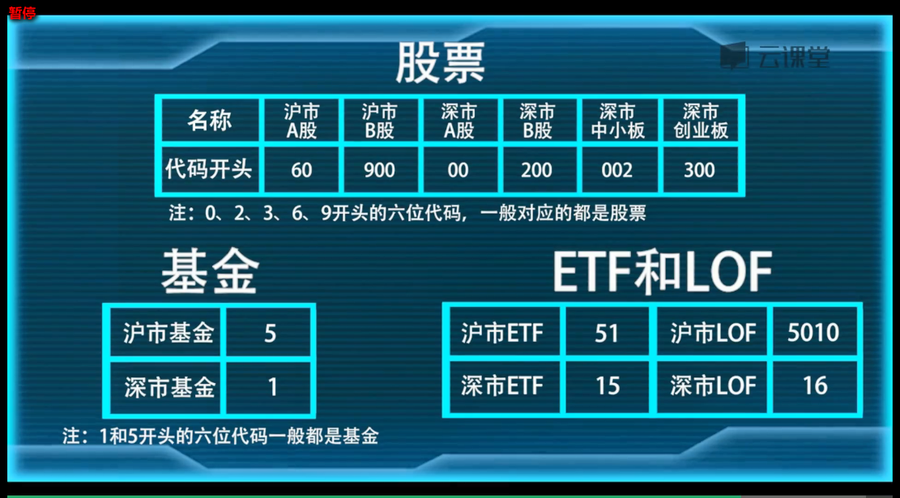

###### datetime:2019/5/16 16:13
###### author:nzb

## 投资理财原则：不懂不要碰、明确自己的风险承受能力。

- [单位净值](https://baike.baidu.com/item/%E5%8D%95%E4%BD%8D%E5%87%80%E5%80%BC/9410493?fr=aladdin)
- [累计净值](https://baike.baidu.com/item/%E7%B4%AF%E8%AE%A1%E5%87%80%E5%80%BC/9410521?fr=aladdin)
- [现代投资组合理论](https://baike.baidu.com/item/现代投资组合理论/8303372?fr=aladdin)
：货币基金、债券基金和股票基金组合
- [晨星投资风格箱](cn.morningstar.com/help/data/fundstylebox.html)
- 白马股：价值型股票、业绩稳定、分红能力強
- 黑马股：成长型股票、业绩一般、分红很少、成长空间大
- [β系数](https://baike.baidu.com/item/%CE%B2%E7%B3%BB%E6%95%B0/6685182?fr=aladdin)
:基金和业绩评价基准之间的相关性，大多数股票或基金的β系数介于0.5到1.5间。
- [基金业绩评价基准](https://zhidao.baidu.com/question/122122108.html)
：基金KPI，根据基金自身特性定制的考核标准
- [α系数](https://baike.baidu.com/item/%E9%98%BF%E5%B0%94%E6%B3%95%E7%B3%BB%E6%95%B0/4483859?fr=aladdin)
：代表一个基金的绝对回报或超额收益。
- [R平方](https://baike.baidu.com/item/R平方/1419748?fr=aladdin)
：表明α系数和β系数的精准度。R平方越高可信度越高。
- [夏普比率](https://baike.baidu.com/item/%E5%A4%8F%E6%99%AE%E6%AF%94%E7%8E%87/2549763?fr=aladdin)
：夏普比率 = (基金回报率-市场无风险回报率)/标准差。是评价基金优劣的最重要的标准化指标，夏普比率越高基金性价比越高。
- [特雷诺指数](https://baike.baidu.com/item/%E7%89%B9%E9%9B%B7%E8%AF%BA%E6%8C%87%E6%95%B0/1944946?fr=aladdin)
：特雷诺指数 = (基金回报率-市场无风险回报率)/β系数。
- 股票价格指数：描述股票市场总体价格水平变化的指标
- [上证指数](https://baike.baidu.com/item/%E4%B8%8A%E6%B5%B7%E8%AF%81%E5%88%B8%E7%BB%BC%E5%90%88%E6%8C%87%E6%95%B0/9556996?fromtitle=%E4%B8%8A%E8%AF%81%E6%8C%87%E6%95%B0&fromid=2839288&fr=aladdin#2_13)
：其样本股是在上海证券交易所全部上市股票，包括A股和B股，反映了上海证券交易所上市股票价格的变动情况
- [上证50指数](https://baike.baidu.com/item/%E4%B8%8A%E8%AF%8150%E6%8C%87%E6%95%B0)
- [上证180指数](https://baike.baidu.com/item/%E4%B8%8A%E8%AF%81180%E6%8C%87%E6%95%B0)
- [深证指数](https://baike.baidu.com/item/%E6%B7%B1%E8%AF%81%E6%8C%87%E6%95%B0/4477551?fr=aladdin)
- [深证成指](https://baike.baidu.com/item/%E6%B7%B1%E5%9C%B3%E8%AF%81%E5%88%B8%E4%BA%A4%E6%98%93%E6%89%80%E6%88%90%E4%BB%BD%E8%82%A1%E4%BB%B7%E6%8C%87%E6%95%B0/2114587?fromtitle=%E6%B7%B1%E8%AF%81%E6%88%90%E6%8C%87&fromid=408981&fr=aladdin)
：深证成分指数是深圳证券交易所的主要股指，代码为399001，简称：深成指
- [深证100指数](https://baike.baidu.com/item/%E6%B7%B1%E8%AF%81100%E6%8C%87%E6%95%B0/8394120?fr=aladdin)
：由深圳证券交易市场流通市值最大成交最活跃的100只成份股所编制的股票指数，代码为：399330
- [沪深300指数](https://baike.baidu.com/item/%E6%B2%AA%E6%B7%B1300%E6%8C%87%E6%95%B0)
：大盘股中的精华
- [中证500指数](https://baike.baidu.com/item/%E4%B8%AD%E8%AF%81500%E6%8C%87%E6%95%B0)
：中小盘股中的精华
- 上证50、中证500、沪深300是中国市场最具代表性的指数。
- [指数失真](http://www.360doc.com/content/12/0827/15/3013042_232625633.shtml)
- [成分指数](https://baike.baidu.com/item/%E6%88%90%E4%BB%BD%E6%8C%87%E6%95%B0/6430040?fr=aladdin)
：根据科学客观的选样方法挑选出的样本股所构成的指数，只计算流通股，剔除非流通股。
- [支付对价](https://baike.baidu.com/item/%E6%94%AF%E4%BB%98%E5%AF%B9%E4%BB%B7/10149723?fr=aladdin)
- [ETF基金](https://baike.baidu.com/item/%E4%BA%A4%E6%98%93%E5%9E%8B%E5%BC%80%E6%94%BE%E5%BC%8F%E6%8C%87%E6%95%B0%E5%9F%BA%E9%87%91/3228983?fromtitle=ETF%E5%9F%BA%E9%87%91&fromid=4661310&fr=aladdin)
- [ETF联接基金](https://baike.baidu.com/item/ETF%E8%81%94%E6%8E%A5%E5%9F%BA%E9%87%91/6386082?fr=aladdin)
- [集合竞价模式](https://baike.baidu.com/item/%E9%9B%86%E5%90%88%E7%AB%9E%E4%BB%B7/460444?fr=aladdin)
- [LOF基金](https://baike.baidu.com/item/lof基金/10908947?fr=aladdin)

- 
- [分级基金](https://baike.baidu.com/item/分级基金/1044558?fr=aladdin)
：把一个基金的资产和收益拆分成不同风险级别的两个子基金。
- [CPPI策略](http://www.360doc.com/content/16/0405/22/31785815_548157049.shtml)
- [TIPP策略](https://baike.baidu.com/item/TIPP%E7%AD%96%E7%95%A5/6200512?fr=aladdin)
- [OBPI策略](https://baike.baidu.com/item/%E6%8A%95%E8%B5%84%E7%BB%84%E5%90%88%E4%BF%9D%E9%99%A9%E7%AD%96%E7%95%A5/12750321?fr=aladdin)
- [打新基金](https://baike.baidu.com/item/%E6%89%93%E6%96%B0/387024?fr=aladdin)
：资金用于打新股的基金。
- [IPO](https://baike.baidu.com/item/%E9%A6%96%E6%AC%A1%E5%85%AC%E5%BC%80%E5%8B%9F%E8%82%A1/52072?fromtitle=IPO&fromid=210299&fr=aladdin)
- [市盈率](https://baike.baidu.com/item/%E5%B8%82%E7%9B%88%E7%8E%87/90136?fr=aladdin)
：（股份收益比率或本益比）股票市价与其每股收益的比例，最常用来评估股价水平是否合理的指标之一。
- [生命周期基金](https://baike.baidu.com/item/%E7%94%9F%E5%91%BD%E5%91%A8%E6%9C%9F%E5%9F%BA%E9%87%91/10082956?fr=aladdin)
- [定增基金](https://baike.baidu.com/item/%E5%AE%9A%E5%A2%9E%E5%9F%BA%E9%87%91/13895446?fr=aladdin)
- [量化基金](https://baike.baidu.com/item/%E9%87%8F%E5%8C%96%E5%9F%BA%E9%87%91/6025658?fr=aladdin)
- [量化对冲基金](https://baike.baidu.com/item/%E9%87%8F%E5%8C%96%E6%8A%95%E8%B5%84%E4%B8%8E%E5%AF%B9%E5%86%B2%E5%9F%BA%E9%87%91/7632294?fromtitle=%E9%87%8F%E5%8C%96%E5%AF%B9%E5%86%B2%E5%9F%BA%E9%87%91&fromid=15914072&fr=aladdin)
- [等额本金还款法](https://baike.baidu.com/item/%E7%AD%89%E9%A2%9D%E6%9C%AC%E9%87%91%E8%BF%98%E6%AC%BE%E6%B3%95/8040358?fr=aladdin)
- [等额本息还款法](https://baike.baidu.com/item/%E7%AD%89%E9%A2%9D%E6%9C%AC%E6%81%AF%E8%BF%98%E6%AC%BE%E6%B3%95)
- [QDII基金](https://baike.baidu.com/item/QDII%E5%9F%BA%E9%87%91/7613203?fr=aladdin)
- [房地产信托投资基金](https://baike.baidu.com/item/%E6%88%BF%E5%9C%B0%E4%BA%A7%E4%BF%A1%E6%89%98%E6%8A%95%E8%B5%84%E5%9F%BA%E9%87%91/7601047?fr=aladdin)
- [FOF基金](https://baike.baidu.com/item/%E5%9F%BA%E9%87%91%E4%B8%AD%E7%9A%84%E5%9F%BA%E9%87%91/3519478?fromtitle=FOF%E5%9F%BA%E9%87%91&fromid=10315394&fr=aladdin)
：一种专门投资于其他证券投资基金的证券投资基金。
- [场外基金](https://baike.baidu.com/item/%E5%9C%BA%E5%A4%96%E5%9F%BA%E9%87%91/12719522?fr=aladdin)
：不能在交易所上市交易的基金

