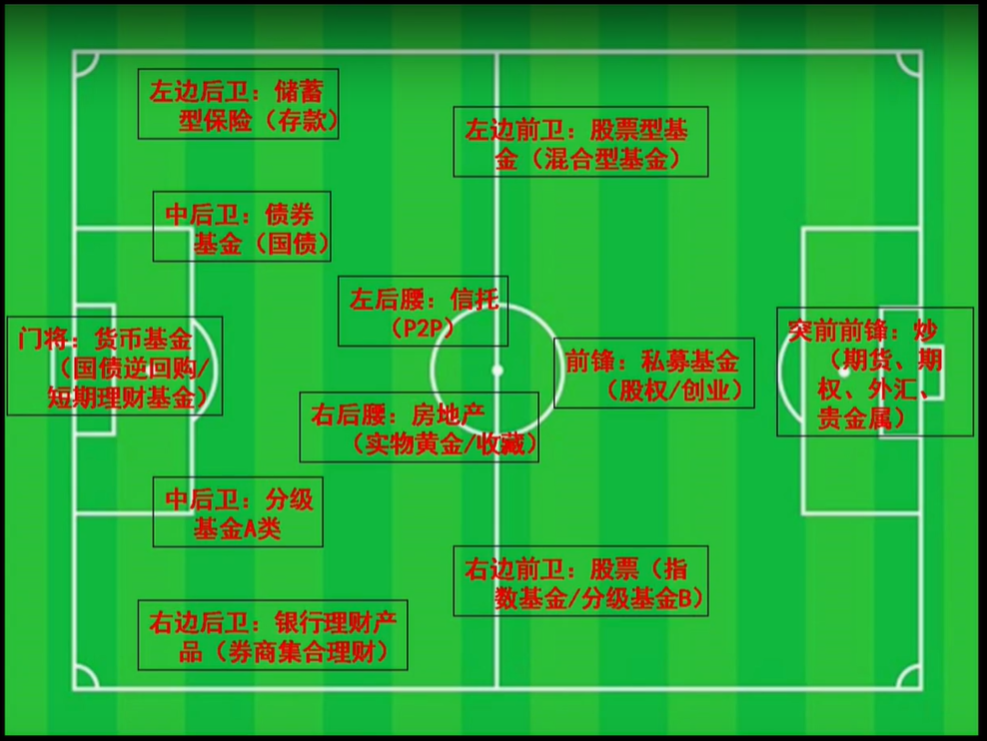
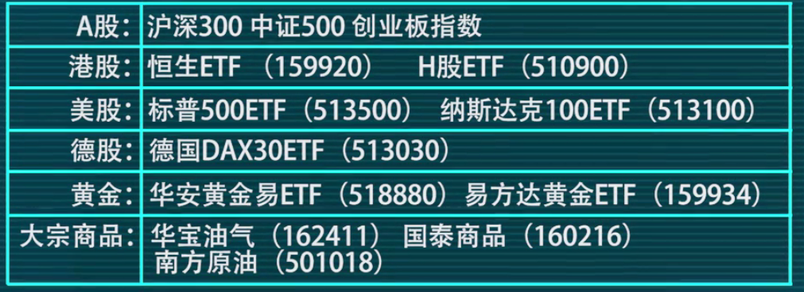

###### datetime:2019/5/16 16:13
###### author:nzb

# 基金全球配置大法

- 八个字：二维三核、左右护法

- 核心-卫星资产配置理论

- 股市：
    - 成熟市场
        - 北美市场
        - 西欧市场
        - 日本市场
    - 新兴市场
        - 亚太市场
            - 东亚市场
            - 东盟市场
            - 澳新市场
            - 南亚市场
        - 中东市场
        - 东欧市场
        - 拉美市场

- 二维三核市场标的(一一对应)
    - 核心：中国、中国香港、美国
    - 卫星：印度、东盟、德国

- 香港相比日本的优势：
    - 香港是全球三大金融中心之一
    - 中国大陆发展继续惠及香港
    
- 左右护法：黄金和石油
    - 具体投资建议：投资指数基金，尤其是成本最低可以场内交易的ETF基金

## 基金配置原则

- 估值越低投越多，估值越高投越少，高到一定程度后果断清仓
- 核心资产最低不低于50%，卫星资产最高不能高于50%，一般三七开或二八开

