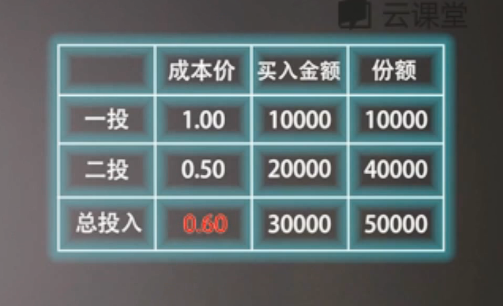

###### datetime:2019/5/16 16:13
###### author:nzb

# 基金被套牢怎么办

## 四大策略

- 加仓策略：通过不断在 更低的成本价买入更多份额的该基金来摊薄该基金的整体持有成本

    
    - 一投成本价1元，二投时减低至0.5元，买入20000快40000份额，最后持有成本摊薄到0.6元，只要涨会0.6元就可以解套
    - 执行加仓策略的前提
        - 被套牢的是个好基金
        - 足够多可长期投资的资金
    - 加仓策略的基本原则
        - 套牢越深，投入资金越多
        - 亏损渐小，投入速度放缓
    - **加仓策略难执行**，不要盲目加仓

- 装死策略：任由套牢基金跌下去，既不割肉止损也不加仓投入，等待下一轮牛市回归
    - 执行装死策略的难点
        - 时间成本难控制，时间是有价值的
        - 未来走势不确定
    - 装死策略执行前提
        - 套牢基金 长期无他用
        - 套牢基金 本身质地好
    - 指数基金比主动型基金更适合装死策略

- 换仓策略： 
    - 忘记成本，换个赛道
    
- 止损策略：
    - 最不推荐，原则是：止盈不止损

## 总结

- 基金质地好 + 资金允许 = 加仓策略
- 基金质地好 + 资金不够 = 装死策略
- 基金质地差 = 换仓策略

