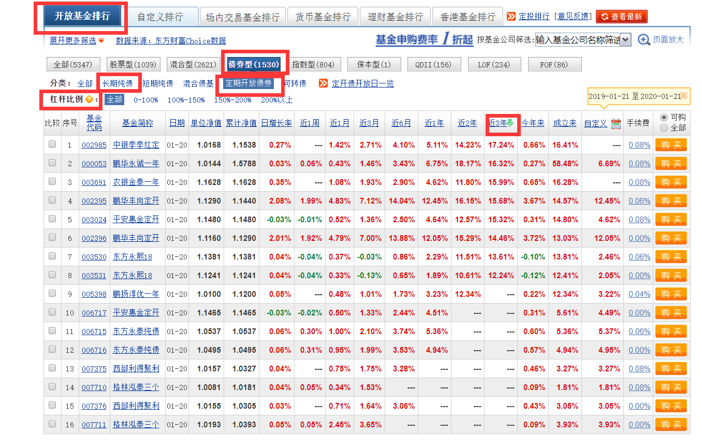
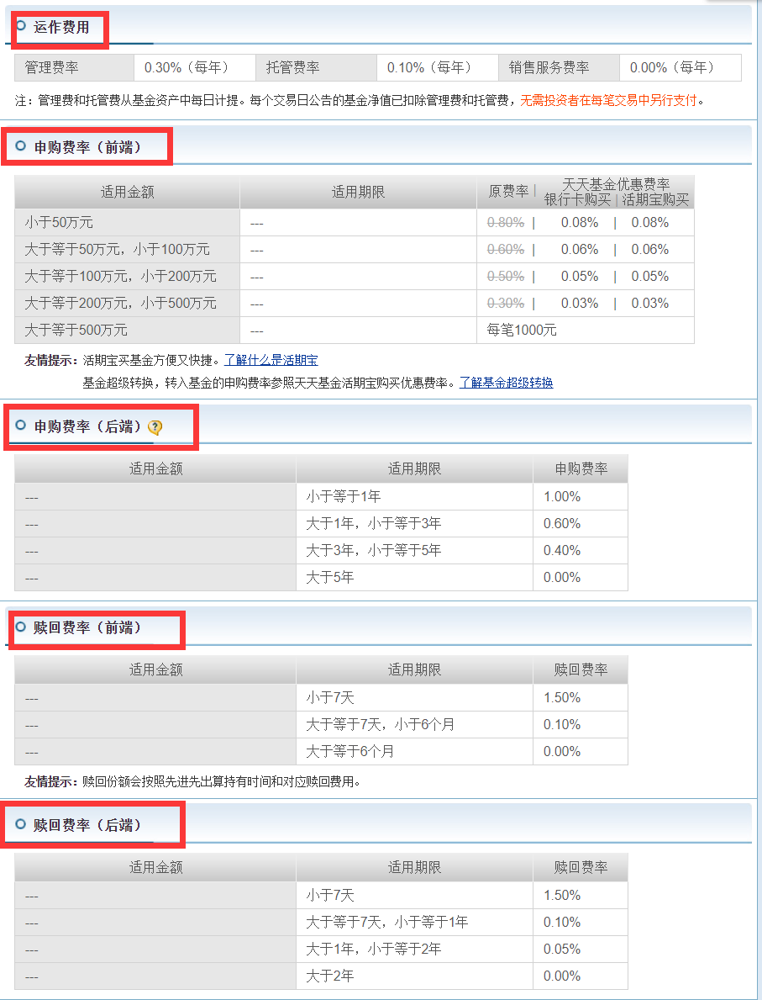

###### datetime:2020/1/13 14:00
###### author:nzb

[天天基金网](https://fund.eastmoney.com/)

## 纯债基金实战

- 选长期纯债基金

    - 基金排行
    
    - 开放基金排行
    
    - 债券型
    
    - 分类：**长期纯债**
    
    - 近3年、排名前30位作为候选基金池
    
    - 逐个点击基金名称，点击债券持仓：1、剔除投资可转债的基金；2、剔除小公司的基金；3、剔除规模较大（基金规模超过20亿）的基金；4、剔除同一家大型基金公司旗下排在第二名以及以下兄弟基金
    
    - 找出综合费率最低的、成立时间相对较长、基金经理年级较大、管理时间较长

    - 推荐后端一次性收取的，持有一年以上

- 选长期纯债基金

    - 基金排行
    
    - 开放基金排行
    
    - 债券型
    
    - 分类：**定期开放债券**
    
    - 别选杠杆比例超过160%的债基、选择封闭期为一年的债基、看准下次开放时间
    
  
    

## 总结：购买还是力哥推荐的股票指数基金，后续讲解

