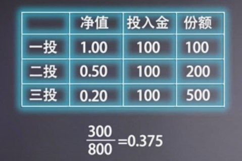
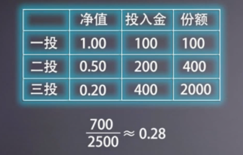
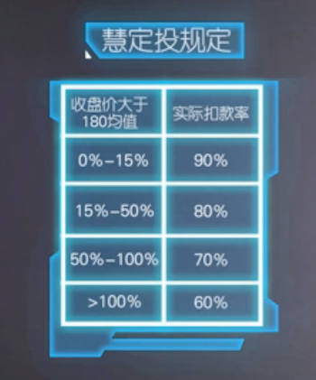

###### datetime:2019/5/16 16:13
###### author:nzb

# 基金定投

## 原理

- 通过定期定额投资不停的分批次小额买入基金，使基金的收益曲线更接近宏观经济的走势，变得比较平滑

    - 只要基金从0.2元反弹到0.375元，你就解套，到1元你就赚了

    - 只要基金从0.2元反弹到0.28元，你就解套，到1元你就赚了357%

- 下跌时坚持定投，亏损比例越来越小
- 上涨时坚持定投，盈利比例越来越小

- 波动剧烈的基金更适合定投，买指数基金就是买大盘，还有股票，黄金，石油等其他波动剧烈的产品
- 选择合适的进场时机，基金定投才能发挥最大作用

- **建议投资者每周或每月做一次变额定投**

## 智能定投

- 智能定投运用策略
    - 均线策略
        - 运用移动平均线MA作为参考指标来指导基金定投的策略
        - 蚂蚁财富的慧定投就是均线策略
        
        - 指数近十日振幅超过5%，定投金额减少
        - 指数近十日振幅小于5%，定投金额增加
        - 均线策略智能定投缺点
            - 未充分考虑定投时的估值因素，不够长的均线缺乏足够的参考价值
            - 未解决止盈问题
            
    - 风险偏好策略
        - 根据投资者的风险承受能力以及投资时长智能匹配基金类别和配置比例进行定投
        - 风险偏好型策略智能定投缺点
            - 门槛较高
            - 定投成本高
    
    - 动态再平衡策略
        - 选择关联度不大或负相关的基金品种构建基金定投组合
        - 蛋定投(变额定投)
            - 二八轮动策略：用量化模型去追涨杀跌，如果发现追错了毫不犹豫马上掉头通过多次轮换来不断积累收益
                - 二八轮动策略不适合震荡行情   
                        

## 力哥七步定投

- 解决上面定投缺点

### 概述篇

- 核心：2、4、5、7

- 2：回报率
    - 能获取15%~25%的回报，平均20%的年化收益

- 4：四大原则
    - 长期坚持定期不定额
    - 长期坚持止盈不止损(克服恐惧 战胜贪婪)
    - 只问贵贱 不看趋势(放下预测 安心定投)
    - 越跌越买 越涨越卖

- 5：5种具体投资策略
    - 全天候配置策略
    - 低估值折时轮动策略(哪个便宜，哪个多点，哪个贵了，少配点，太贵了不要去定投了)
    - 价值平均策略
    - 网格交易策略
    - 动态再平衡策略

- 7；具体的7个操作步骤
    - 完成风险偏好测试：保守型、稳健型、平衡型、进取型、激进型
    - 全面统计家庭财务信息
    - 做好家庭资产配置方案
        - 提取生活警急备用金(货基，把3~6个月的家庭支出金额拿出来作为备用金)
        - 购置合适的保险(不建议买储蓄型保险，只要买比较便宜的消费型保险有个基本保障就行了)
            - 消费型保险
            - 储蓄型保险
        - 将钱分成长期和短期(未来3年可能要用)
            - 现金口袋：现金流规划
            - 保险口袋：家庭保障规划
            - 消费口袋：消费和短期投资规划
            - 储蓄口袋：长期投资规划(只有前面3个口袋搞定才能实施定投策略)
    - 布局：设计存量资金定投计划(已经拥有的资金)
        - 计划定投阶段
            
            - 不同资金阶段，低阶级增值，高阶级保值
        - 布局定投阶段
        - 维持定投阶段
        - 调整定投阶段
    - 未来一年完成存量定投布局
    - 收割：对提前完成定投的基金进行网格收割(维持定投阶段)
    - 总结：设置增量资金定投计划(调整定投阶段)

### 布局篇

- 设计存量资金定投计划(已经拥有的资金)
    - 计划定投阶段
    - 布局定投阶段
    - 维持定投阶段
    - 调整定投阶段

### 选基篇

- 不同经济周期配置不同的大类资产，能获得截然不同的收益表现
- 大类资产：股票类，债券类，现金类，黄金在类的大宗商品
- 4种不同的经济时期(难以预测未来经济走势)
    - 经济复苏：经济上行，通胀下行，GDP在不懂上升，CPI却始终维持在低位----->增持股票，减持大宗商品
    - 经济过热阶段：经济上行，通胀上行----->增持股票，大宗商品，减持债券，减持现金
    - 经济滞胀阶段：经济下行，通胀上行----->减持各类资产，现金为王，本金保住
    - 经济衰退阶段：经济下行，通胀下行----->增持债券，减持大宗商品
    - 不管处于何种经济周期总有投资品种表现突出
- 适合定投的标主要是：股票、石油、黄金、大宗商品

### 估值篇

- 市盈率(PE)是判断估值高低最重要的指标，其次起到辅助参考价值的市净率(PB)
- 不建议投资个股或对股票进行定投
- 估值
    - 绝对估值：指数评价市盈率超过了50倍的，一律不碰
    - 相对估值
        - 纵向比较：以史为鉴(历史数据)
        - 横向比较
        - 倾向于纵向比较判断估值高不高
    - 分为点数组越小，估值越低，越有投资价值
    - 力式五分位法：
        - 低估：0% ~ 19.99%
        - 合理偏低：20% ~ 39.99%
        - 合理：40% ~ 59.99%
        - 合理偏高：60% ~ 79.99%
        - 高估：80% ~ 100%
    
    - 分位点低于40%开始定投(市净率也一样，如果市盈率很低 ，但是市净率超过了60%也不要定投)
    - 分位点高于41%不适合开始定投
    
    - 力哥看黄金价格(大宗商品影响因素很多)
        - 金价低估：< 1000美元/盎司
        - 金价合理：1000美元/盎司 ~ 1500美元/盎司
        - 金价高估：> 1500美元/盎司
       
    - 力哥看石油价格(大宗商品影响因素很多)
        - 石油低估：< 35美元/桶
        - 石油合理：35美元/桶 ~ 75美元/桶
        - 石油高估：> 75美元/桶
- 定投标的最少不少于3个，不高于12个
- 港股：恒生指数和H股指数
- 美股：标普指数和纳斯达克指数
- A股：沪深300、中证500、估值相对较低行业指数

### 操作篇

- 定投布局周期至少一年
    - 资金量较小的每月定投一次，存量资金分成12份，较多双周定投一次，存量资金分成25份，更多每周定投一次，存量资金分成50份
    - 如果后续没有足够的增量资金(资金来源)可以跟上，这时存量资金定投布局需要适当延长，以规避中短期的价格波动，但是最长不超过2年
    - 判断依据：存量资金/月收入 > 100 -----> 适当延长定投布局周期

- 定投方式更推荐场内基金(ETF、LOF和分级B)
    - 场内基金不能设置自动定投，需要主动打卡股票交易软件进行，容易情绪化

- 未来一年完成存量定投布局(价值平均策略)
    - 目标市值恒定策略：一直保持市值为定投目标即
        - 此次定投金额 = 目标定投市值 - 当前定投市值
        - 定投份额 = 此次定投金额 / 基金成交价 (最小100份额，需要四舍五入)
    - 分位点
        - 分位点：< 40% 可开始定投
        - 分位点：20% ~ 39.9% 按既定定投，正常的市值恒定定投
        - 分位点：< 20%  可加码定投
            - PE分位点 < 20% 把每次基准定投的金额提高到1.5倍
            - PE分位点 < 15% 把每次基准定投的金额提高到2倍
            - PE分位点 < 10% 把每次基准定投的金额提高到2.5倍
            - PE分位点 < 5% 把每次基准定投的金额提高到3倍
        - 分位点： > 45%  视情况而定
            - PE分位点 > 45% 把每次基准定投的金额降低到0.75倍
            - PE分位点 > 50% 把每次基准定投的金额降低到0.5倍
            - PE分位点 > 55% 把每次基准定投的金额降低高到0.25倍
            - PE分位点 > 60% 停止定投，维持恒定的市值就可以了
            - PE分位点 > 65% 抛售已投的基金份额25%
            - PE分位点 > 70% 再抛售已投的基金份额25%
            - PE分位点 > 75% 再抛售已投的基金份额25%
            - PE分位点 > 80% 清仓
        - 如果市盈率((PE)没有高于80%，而市净率(PB)高于80%，同样清仓

### 收割篇

- 对提前完成定投的基金进行网格收割(维持定投阶段)

- 网格交易：就是通过设定一个锚点以此为基准，通过涨跌来调控仓位大小的交易策略
    - 上涨网格空隙大
    - 下跌网格空隙小
    - 网格交易法利弊
        - 在熊市没有估值依托
        - 牛市容易卖光筹码
        - 对震荡市是十分有利
    - 涨跌幅度达到多少时可以网格交易一次呢？
        - 没有完全一定的说法
        - 单边行情中(牛市、熊市) 网格应放大一点(跌的时候跌得有点大了，一次性多补点，涨的时候涨得有点大了，收割一波大的)
        - 震荡行情中 网格应收小一点
    - 建议最大网格为20%，最小网格为3%
    - 同一时期上涨时收割网格大于下跌时补仓网格，比如：涨5%(20%)时收割一次，那么跌3%(15%)就要补仓一次

- 七步定投策略对后背资金的要求比较高

### 总结篇

- 设置增量资金定投计划(调整定投阶段)
    - 动态再平衡策略

- 总结：具体的7个操作步骤
    - 完成风险偏好测试：保守型、稳健型、平衡型、进取型、激进型
    - 全面统计家庭财务信息
    - 做好家庭资产配置方案
    - 布局：设计存量资金定投计划(已经拥有的资金)
        - 全天候配置策略(二维三核，左右护法)
        - 低估值折时轮动策略
    - 未来一年完成存量定投布局
        - 价值平均策略
    - 收割：对提前完成定投的基金进行网格收割(维持定投阶段)
        - 网格交易策略
    - 总结：设置增量资金定投计划(调整定投阶段)
        - 动态再平衡策略
        - 低估值折时轮动策略

- 普通定投成本比较高，怎么破？
    用超低佣金的场内基金代替

- 普通定投无法用量化指标做到低位多头高位少投，怎么破？
    运用价值平均策略

- 普通定投没考虑估值因素怎么破？
    运用低估值折时轮动策略
    
- 普通定投不会自动止盈怎么破？
    运用动态再平衡策略
 
- 普通定投震荡市不赚钱怎么破？
    运用网格交易策略市盈率(

