###### datetime:2022/1/28 11:11
###### author:nzb

# 看盘系列-K线图

## K线基础

K线又称蜡烛图、日本线、阴阳线、棒线等，源于日本德川幕府时代(1603~1867年)，被当时日本米市的商人用来记录米市的行情与价格波动，后因其细腻独到的标画方式而被广泛影用。

在股市中K线被用作记录当天的价格变化，一条K线代表当天的价格走势，多个K线在一起就形成了K线图，代表多日的价格变化。

K线分为两种：**阳线、阴线**。

K线计算周期：1分钟K线、5分钟K线、15分钟K线、30分钟K线、60分钟K线、日K线、周K线、月K线、年K线。也可以自定义制定周期K线。

K线有4个价位组成：开盘价、收盘价、最高价、最低价。中间的矩形为实体，实体以上的细线为上影线，实体以下的细线叫做下影线。

如下图：

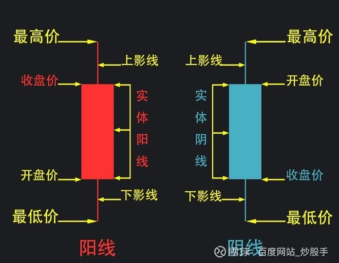

阳线在分时图上显示样式：

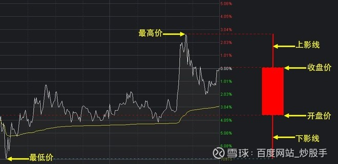

阴线和阳线一样，只不过阴线开盘价和收盘价反转过来，开盘价在上、收盘价在下，以阴线收盘。

K线每日的开盘价和收盘价以及波动范围不同，形成了不同的阳线和阴线。而每个K线都有它的基本意义，下面我们就来认识一下这些K线。

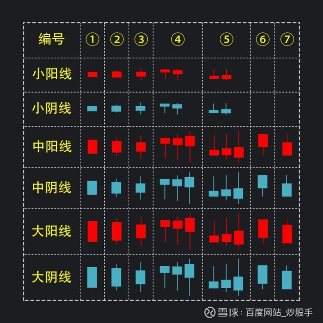

- 小阳线和小阴线：大盘波动范围一般在0.6--1.5%；个股波动范围一般在0.6—3%；
- 中阳线和中阴线：大盘波动范围一般在1.6-3.5%；个股波动范围一般在3—7%；
- 大阳线和大阴线：大盘波动范围一般在3.6%；个股波动范围一般在7%以上；

在上面所述的范围内，有无上下影线都属于相应阳线和阴线。如果实体部分占据波动范围的70%以上，说明方向越明确。单根k线只能看出当日的多空情况，后市的涨跌还需要根据量能、K线的位置、市场的情绪进行综合分析。

下面会以出现概率多的走势进行讲解，不排除还有其他的走势：

- ①此形态又称全秃阳（阴）线，也称光头光脚阳（阴）线，该线无上下影线。它属于行情一面倒的形态，此线的出现有很大的确定性，后市向着攻陷的方向继续前进。如果小阳和小阴出现此K线，由于量能的不足，后市可能会遇到反手打压、震荡调整的行情比较多。
- ②此形态为又称穿头破脚阳（阴）线，下有撑上有压，一日判多空形态。小阳和小阴会极易出现吞噬或方向不明的走势。中阴或中阳出现此形态，后市极易向着攻陷的方向继续前进，大阴或大阳出现此形态，极易出现反手洗盘或相反方向的走势。
- ③此形态又称电阻线，为下有撑上有压当日多空激烈交战形态，如果上下影线小于实体或影线过小，一般后市会向着攻陷的方向继续前进，如果上下影线是实体的1倍或2倍以上，说明当日多空交战十分激烈，消耗量能巨大，后市极易出现方向不明或调整的走势。
- ④此形态又称锤子线，无上影线实体较小，下影长度至少达到实体的2倍以上，下影线越长越好，越长代表信号越明朗强烈。在后市看涨时称为锤子线，在后市看跌时叫做上吊线，也叫吊颈线。该图线若处在高价位，是行情见顶的信号，若处在低价位，则是行情见底的信号，可考虑买入股票。所有的阴线和阳线出现这种形态都是低位看多，高位看空。有上影线的说明上方有压力，明日出现下杀洗盘，区间震荡整理的走势比较多。小阴小阳出现此形态多以上下震荡方向不明走势为多。
- ⑤此形态又称倒锤子线，反追线。在后市看跌或高位出现时叫做流星线。上影线越长越好，长度至少达到实体高度的2倍。明日开盘定多空，此形态意味着当日市场失去了继续上升的动力，股价出现新高之后立即遭到空方的严厉打压，可视为弱势。因而投资者应对倒锤子线的出现保持高度警惕。这个和锤子线一样，所有的阴线和阳线出现这种形态都是低位看多，高位看空。横盘整理出现此形态也应出局观望。所有阴线出现此形态应观望为主，阳线低位出现此形态，可根据明日开盘价和抛压量能考虑是否进场。小阴小阳出现此形态多以上下震荡方向不明走势为多。
- ⑥此形态为光头阳（阴）线，和锤子线的区别为，光头阳线实体大于下影线，而锤子线实体小于下影线。此形态实体越多越好，中阳线出现此形态有的是当日尾盘主力拉升诱多，有的是量能不足上有压力，有的是稳步上升，不管哪一种下个交易日多为下杀洗盘、获利筹码出局为主，如能突破光头阳（阴）线最高价继续看涨。 大阳出现此形态多以涨停为主，后市继续看涨。 中阴大阴出现此形态多为止跌信号，下影线越长止跌信号越强。需要注意的是阴线低位看多，高位看空。
- ⑦此形态为光脚阳（阴）线，和倒锤子线的区别为，光脚线实体大于下影线，而倒锤子线实体小于下影线。此形态实体越多越好， 中阳和大阳出现此形态是多方攻陷某个压力位遇到了阻力，但是不会阻碍多方继续上涨的趋势。有的个股会震荡调整后继续上攻，如果是真正强势股，这种形态，阳线继续上涨居多。需要注意的是阳线低位看多，高位看空。中阴和大阴出现此形态，一律看空。

注：上面所说的低位是近期一段时间的最低点或次低点，高位是指有一定涨幅，哪怕在横盘震荡也属于高位。

单根K线只能一日判多空，而无法辨别趋势，在看盘的过程中还应了解K线组合以及趋势、量能、大盘等种种因素，方能增加胜算。学习了K线的含义，还有K线十字星的含义也要懂得才可以。

## 八大经典卖出形态：

- 1.上吊线

    上吊线实际上就是上涨走势中的锤子线。它在上涨走势中一旦出现，就表明本来多方占据优势的局面有较大可能被扭转，之后股价有可能出现下跌走势。

    如图：  
    
    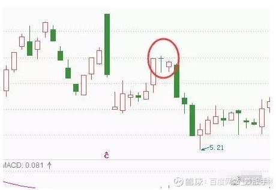

- 2.黄昏星

    黄昏星形态与启明星正好相反，它出现在上涨走势中，又三根K线组成。第一根是阳线，第二根是十字线，第三根是阴线。第三根K线实体深入到第一根K线实体之内。

    如图：

    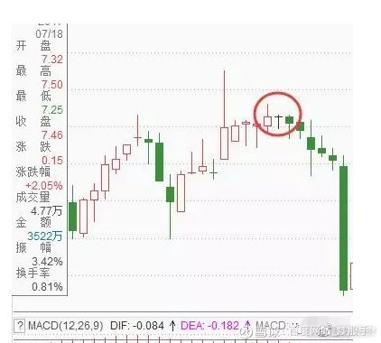

    黄昏星形态是较为强烈的看跌信号，它表明下跌动能在经过十字线的搏斗之后已经战胜了上涨动能，后市看跌。

- 3.看跌吞没

    该形态出现在上涨趋势中，由两根K线组成。第一根K线是实体较小的阳线，第二根K线是实体较长的阴线，且这根阴线的实体将前阳阴的实体从上到下全部吞没。
    
    如图：

    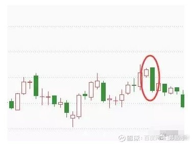

    看跌吞没是强烈的看跌信号。该形态中阴线实体完全吞没了阳线实体，说明下跌动能已经完全占据优势，股价接下来有较大可能出现一波跌势。

- 4.乌云盖顶

    乌云盖顶形态出现在涨势中，由一阴一阳两根K线组成。其中前根K线为中阳线或大阳线，后根K线为中阴线或大阴线，且阴线的开盘价要高于阳线的收盘价，阴线实体已深入到阳线实体的二分之一下处。
    
    如图：

    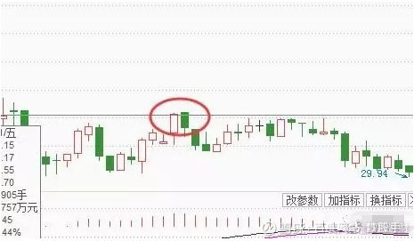

    乌云盖顶表明市场上涨动能急剧释放的同时，下跌动能突然而至并占据上风，之后股价有较大可能出现一波下跌走势。但其可靠性不如看跌吞没形态。
    
    需要注意的是，在实际操作中，阴线实体深入阳线实体部分越多，转势信号就越强烈。当阴线完全跌破阳线实体时，就转化为看跌吞没形态。由此就可以知道为什么看跌吞没的看跌意义强于乌云盖顶了。

- 5.倾盆大雨

    倾盆大雨形态出现在股价上涨途中，由一阳一阴两K线组成。与乌云盖顶形态类似，先是一根大阳线或中阳线，接着出现一根高开的大阴线或中阴线，阴线的收盘价要低于前一根阳线的开盘价。
    
    如图：
    
    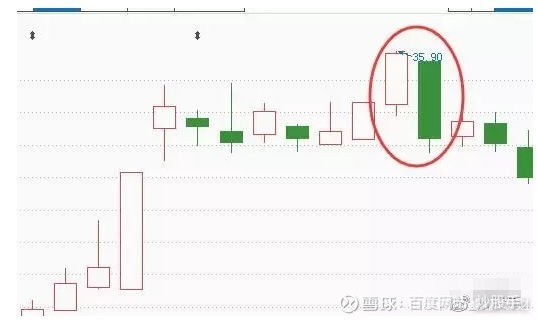

    倾盆大雨形态是见顶信号，且看跌意义更强于乌云盖顶，甚至强于看跌吞没。阴线实体高出阳线实体越多，转势信号就越强。

- 6.高位孕线

    高位孕线出现在上涨走势中，由两个K线组成。第一根K线实体较长，第二根K线实体较小，且被包括在第一根K线的实体之内。两根K线的颜色没有限制。
    
    如图：
    
    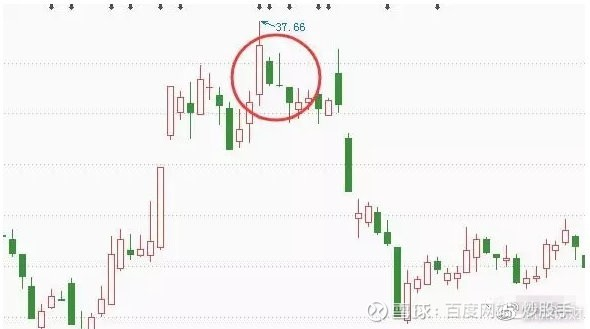
    
    与低位孕线形态类似，有时候高位孕线会出现多根K线组合在一起的“孕育”形态，这是因为后面几根K线的实体都较小，都被包括在第一根K线的实体之内，因此可以将后面几根K线叠加在一起。
    
    高位孕线表明市场在高位，多空双方正在进行激烈的交锋，多方占据优势的局面正在改变，之后股价有较大可能出现一波下跌走势。
    
    而且高位孕线的第二根K线还有可能是锤子线、十字星等，它预示着更强的下跌动能。

- 7.三只乌鸦

    三只乌鸦又称暴跌三杰，顾名思义是指在上涨走势中，连续出现三根阴线所组成的K线形态。这三根K线多为大阴线或中阴线，且每次均以调高开盘，最后以下跌收盘。
    
    如图：
    
    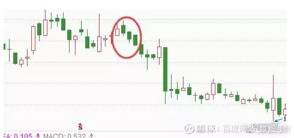

    传统观念认为乌鸦是不祥之物，三只乌鸦出现，预示着后市看跌意味深重。
    
    需要注意的一点是，三只乌鸦大多出现在下跌趋势启动之初。

- 8.下降三法

    下降三法又称下跌三部曲，出现在股价下跌过程中，由大小不等的5根K线组成。这5根K线中，第一根K线为大阴线或中阴线，接下来三根为小阳线，且阳线的最高价低于第一根阴线的开盘价，之后出现一根大阴线或中阴线，且其收盘价要低于第一根阳线的开盘价。
    
    如图：

    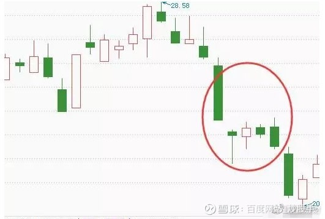

    下降三法表明上涨动能只是昙花一现，空方再次夺回控制权，股价接下来仍会延续下跌走势。

## 看涨的20种形态图

- 1、低位锤形线

    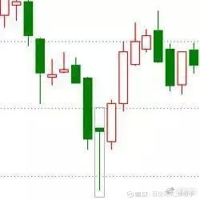
    
    形态介绍：上涨形态。一般在下跌趋势中，出现下影线较长上影线较短的K线形态，形状如一把锤子，称为低位锤型线。
    
    买入参考位：锤形线出现次日，若能确定收盘价能够越过锤形线实体，则构成买点。
    
    止损参考位：锤形线最低点。

- 2、低位倒锤线
    
    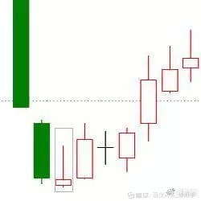
    
    形态介绍：上涨形态。一般在下跌趋势中，出现下影线较短而上影线较长的K线形态，形状如一把倒着的锤子，称为低位倒锤型线。
    
    买入参考位：倒锤形线出现次日，若能确定收盘价能够越过锤形线实体，则构成买点。
    
    止损参考位：倒锤形线最低点。

- 3、低位十字星

    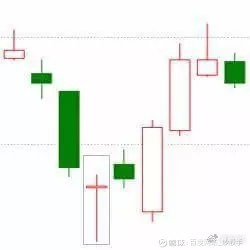

    形态介绍：上涨形态。一般在下跌趋势中，出现上影线和下影线均较长的K线，形状如一颗十字星，称为低位十字星。
    
    买入参考位：低位十字星出现次日，若股价上涨越过十字星实体，则构成买点。
    
    止损参考位：十字星最低点。

- 4、看涨捉腰带

    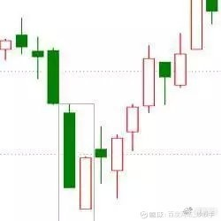

    形态介绍：上涨形态。一般在下跌趋势或盘整趋势中中，出现开盘价基本处于当日最低价，没有影线或影线极短，且实体较长的K线形态，称为看涨捉腰带线，又称为开盘光脚阳线。
    
    买入参考位：看涨捉腰带线出现次日，若股价未创新低，则构成买点。
    
    止损参考位：捉腰带线最低位。

- 5、低位螺旋桨

    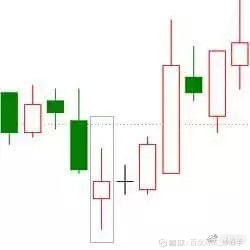

    形态介绍：上涨形态。在下跌趋势中，出现一根带有较长的上下影线小阴线或小阳线，形状如螺旋桨，称为低位螺旋桨。
    
    买入参考位：低位螺旋桨线出现次日，若股价上涨越过螺旋桨实体，则构成买点。
    
    止损参考位：螺旋桨线最低位。

- 6、启明之星

    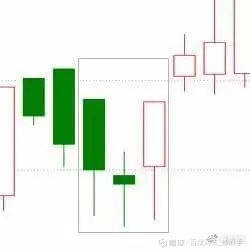

    形态介绍：上涨形态。在一根实体较长的阴线之后，出现一根实体向下低开的星线，之后是一根阳线，此阳线的实体上端进入第一根阴线的实体之内。这三根K线构成的形态，称为启明之星，或早晨之星。
    
    买入参考位：星线出现次日，若股价继续上涨越过前根阳线实体，则构成买点。
    
    止损参考位：星线最低位。

- 7、看涨吞没

    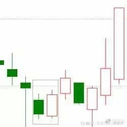

    形态介绍：上涨形态。在下跌趋势中，出现前阴后阳的两根K线，第二根K线实体吞没了第一根K线的实体，完全将第一根实体包住，这两根k线形成的组合称为看涨吞没。
    
    买入参考位：看涨吞没形态出现次日，若能确认股价不跌破形态最低点，则买点出现。
    
    止损参考位：形态最低点。

- 8、曙光初现

    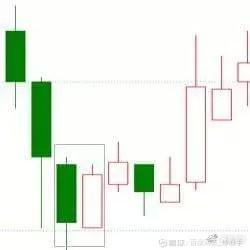

    形态介绍：上涨形态。在连续下跌的行情中，在一段下跌过后收出一根大阴线，之后由一根大阳线收在阴线的二分之一处上方，意为多头发力，但并未完全占据优势，此种形态被称为曙光初现。
    
    买入参考位：曙光初现形态出现次日，若能确认股价不跌破形态最低点，则买点出现。
    
    止损参考位：形态最低点。

- 9、平头底部

    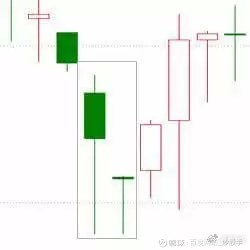
    
    形态介绍：上涨形态。在一轮下降趋势中，两根K线有相同的最低价，意味行情探低见底，股价将反转上升。此种形态称为平头底部，是较好的短线小幅加仓补仓的机会。
    
    买入参考位：平头底部形态出现次日，若股价继续上涨并越过前根K线的实体，则买点出现。
    
    止损参考位：形态最低点。

- 10、旭日东升
    
    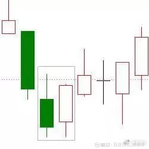
    
    形态介绍：上涨形态。在下跌趋势中，出现一根中阴线或大阴线，紧接着出现一根高开的中阳线或大阳线，阳线的收盘价高于阴线开盘价，意味着多头力量较强，此种形态称为旭日东升。
    
    买入参考位：旭日东升形态出现次日，若股价继续上涨并越过前根K线实体，则买点出现。
    
    止损参考位：阴线最低点。
        
- 11、好友反攻

    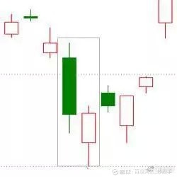

    形态介绍：上涨形态。在下跌趋势中，出现一根中阴线或大阴线，紧接着出现一根跳空低开但随即上涨的中阳线或大阳线，其收盘价与前根阴线的收盘价基本相同，这种形态称为好友反攻。
    
    买入参考位：好友反攻形态出现后，次日的股价上涨并越过前根K线实体，则买点出现。
    
    止损参考位：形态最低点。

- 12、阴孕十字

    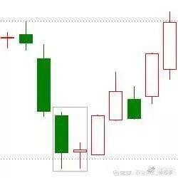
    
    形态介绍：上涨形态。在下跌趋势中，出现一根中阴线或大阴线，紧接着出现一根包含在前一根阴线的实体之内的十字星线，此种形态称为阴线孕十字线，又称为十字怀胎。
    
    买入参考位：阴线孕十字线出现后，次日若股价继续上涨并越过十字线实体，则买点出现。
    
    止损参考位：形态最低点。
       
- 13、多方炮
         
    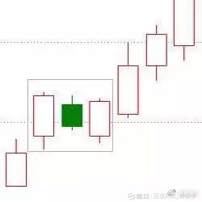

    形态介绍：上涨形态。在上涨或下跌趋势中，出现一根中阳线或大阳线，紧接着出现一根实体孕育于阳线实体内的阴线，在阴线之后，又出现一根将阴线完全包住且成交量放大的阳线，这三根K线形成的组合称为多方炮，即两阳夹一阴。
    
    买入参考位：多方炮形态出现后，次日股价继续上涨并越过第三根阳线实体，则买点出现。
    
    止损参考位：第三根K线最低点。

- 14、上升三法

    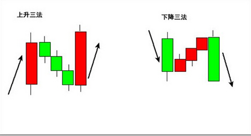

    形态介绍：上涨形态。上涨趋势中，放量出现一根中阳线或大阳线后，出现三根小实体K线，其实体位于第一根阳线实体之内，之后又出现一根高开阳线，其收盘价高于第一根阳线的收盘价。此种形态组合称为上升三法。
    
    买入参考位：上升三法形态出现后，次日股价一旦能够确认不会跌破前根K线最低价，则买点出现。
    
    止损参考位：该形态的最低点。

- 15、红三兵

    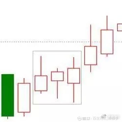

    形态介绍：上涨形态。在上涨或下跌趋势中，连续出现的三根小阳线，实体和影线均较短，且没有出现跳空高开的情况，预示着后势行情看涨，这三根K线的组合被形象地称为红三兵。
    
    买入参考位：红三兵形态出现次日，若股价继续上涨并越过第三根小阳线的实体，则买点出现。
    
    止损参考位：第一根阳线的最低点。

- 16、上涨分手

    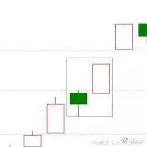
    
    形态介绍：上涨形态。在上涨趋势中，出现一根中阴线或大阴线；紧接着出现一根高开高走的阳线，该阳线的开盘价与前根阴线的开盘价大致相等，如果成交量放大，则预示着后面还有行情。这两根K线开盘价相同而运动方向相反，因此被称为上涨分手。
    
    买入参考位：上涨分手形态形成次日，若能确定股价不跌破前日K线开盘价，则买点出现。
    
    止损参考位：阴线的最低价。

- 17、三空阴线
    
    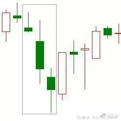
    
    形态介绍：上涨形态。在下跌趋势中，连续出现三根跳空低开下跌的阴线，过度下跌是对做空能量的极大消耗，当空头能量消耗尽时，股价极易出现见底行情，此种形态被称为三空阴线。
    
    买入参考位：买入参考位：三空阴线形态出现次日，若股价上涨并越过前根K根开盘价，则买点出现。
    
    止损参考位：第三根阴线最低点。

- 18、下跌尽头线

    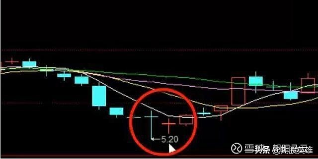

    形态介绍：上涨形态。在下跌趋势中，出现一根带长下影线的阴线，紧接着出现一根小K线，第二根K线的实体及阴线，完全处于前跟K线的长下影线之内，此时意味着下跌行情可能发生反转，被称为下跌尽头线。
    
    买入参考位：下跌尽头线形态出现次日，若股价继续上涨并越过前根K线实体，则买点出现。
    
    止损参考位：长下影阴线的最低点。

- 19、三阳开泰

    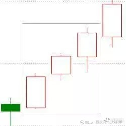

    形态介绍：上涨形态。通常在上涨行情初期，连续出现三根中阳线或大阳线，每一天的最高价都高于前一天的最高价，每一天的最低价都高于前一天最低价，且成交量放大，一般为加速进场的信号，此种K线形态称为三阳开泰。
    
    买入参考位：三阳开泰形态出现次日，若股价继续上涨并越过前根K线实体，则买点出现。
    
    止损参考位：第一根阳线的最低点。

- 20、看涨舍子线

    

    形态介绍：上涨形态。下跌趋势中，一根阴线之后出现一根十字线，接着又出现一根阳线，如果十字线和其前后的阴线、阳线都存在跳空缺口，且阳线的向上跳空缺口弥补了十字线的向下跳空缺口。则此种形态称为看涨舍子线。
    
    买入参考位：看涨舍子线形态出现次日，若能确认股价不跌回前根十字线的缺口，即未弥补之前的缺口，则买点出现。
    
    止损参考位：十字线的最低点。
