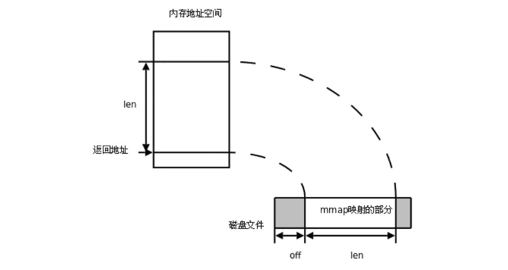

###### datetime:2022/02/01 18:53
###### author:nzb

# Go Mmap 文件内存映射简明教程



## 1 mmap 简介
> In computing, mmap is a POSIX-compliant Unix system call that maps files or devices into memory. It is a method of memory-mapped file I/O.
> [mmap - wikipedia.org](https://en.wikipedia.org/wiki/Mmap)

简单理解，mmap 是一种将文件/设备映射到内存的方法，实现文件的磁盘地址和进程虚拟地址空间中的一段虚拟地址的一一映射关系。也就是说，可以在某个进程中通过操作这一段映射的内存，实现对文件的读写等操作。修改了这一段内存的内容，文件对应位置的内容也会同步修改，而读取这一段内存的内容，相当于读取文件对应位置的内容。

mmap 另一个非常重要的特性是：减少内存的拷贝次数。在 linux 系统中，文件的读写操作通常通过 read 和 write 这两个系统调用来实现，这个过程会产生频繁的内存拷贝。比如 read 函数就涉及了 2 次内存拷贝：

- 操作系统读取磁盘文件到页缓存；
- 从页缓存将数据拷贝到 read 传递的 buf 中(例如进程中创建的byte数组)。

mmap 只需要一次拷贝。即操作系统读取磁盘文件到页缓存，进程内部直接通过指针方式修改映射的内存。因此 mmap 特别适合读写频繁的场景，既减少了内存拷贝次数，提高效率，又简化了操作。KV数据库 bbolt 就使用了这个方法持久化数据。

## 2 标准库 mmap
Go 语言标准库 [golang.org/x/exp/mmap](https://godoc.org/golang.org/x/exp/mmap) 仅实现了 read 操作，后续能否支持 write 操作未知。使用场景非常有限。看一个简单的例子：

从第4个byte开始，读取 tmp.txt 2个byte的内容。

```text
package main

import (
	"fmt"
	"golang.org/x/exp/mmap"
)

func main() {
	at, _ := mmap.Open("./tmp.txt")
	buff := make([]byte, 2)
	_, _ = at.ReadAt(buff, 4)
	_ = at.Close()
	fmt.Println(string(buff))
}
```
```text
$ echo "abcdefg" > tmp.txt
$ go run .
ef
```
如果使用 `os.File` 操作，代码几乎是一样的，`os.File` 还支持写操作 `WriteAt`：

```text
package main

import (
	"fmt"
	"os"
)

func main() {
	f, _ := os.OpenFile("tmp.txt", os.O_CREATE|os.O_RDWR, 0644)
	_, _ = f.WriteAt([]byte("abcdefg"), 0)

	buff := make([]byte, 2)
	_, _ = f.ReadAt(buff, 4)
	_ = f.Close()
	fmt.Println(string(buff))
}
```

## 3 mmap(linux)

如果要支持 write 操作，那么就需要直接调用 mmap 的系统调用来实现了。Linux 和 Windows 都支持 mmap，但接口有所不同。对于 linux 系统，mmap 方法定义如下：

```text
func Mmap(fd int, offset int64, length int, prot int, flags int) (data []byte, err error)
```

每个参数的含义分别是：
```text
- fd：待映射的文件描述符。
- offset：映射到内存区域的起始位置，0 表示由内核指定内存地址。
- length：要映射的内存区域的大小。
- prot：内存保护标志位，可以通过或运算符`|`组合
    - PROT_EXEC  // 页内容可以被执行
    - PROT_READ  // 页内容可以被读取
    - PROT_WRITE // 页可以被写入
    - PROT_NONE  // 页不可访问
- flags：映射对象的类型，常用的是以下两类
    - MAP_SHARED  // 共享映射，写入数据会复制回文件, 与映射该文件的其他进程共享。
    - MAP_PRIVATE // 建立一个写入时拷贝的私有映射，写入数据不影响原文件。
```
首先定义2个常量和数据类型Demo：
```text
const defaultMaxFileSize = 1 << 30        // 假设文件最大为 1G
const defaultMemMapSize = 128 * (1 << 20) // 假设映射的内存大小为 128M

type Demo struct {
	file    *os.File
	data    *[defaultMaxFileSize]byte
	dataRef []byte
}

func _assert(condition bool, msg string, v ...interface{}) {
	if !condition {
		panic(fmt.Sprintf(msg, v...))
	}
}
```
- 内存有换页机制，映射的物理内存可以远小于文件。
- Demo结构体由3个字段构成，file 即文件描述符，data 是映射内存的起始地址，dataRef 用于后续取消映射。

定义 mmap, grow, ummap 三个方法：
```text
func (demo *Demo) mmap() {
	b, err := syscall.Mmap(int(demo.file.Fd()), 0, defaultMemMapSize, syscall.PROT_WRITE|syscall.PROT_READ, syscall.MAP_SHARED)
	_assert(err == nil, "failed to mmap", err)
	demo.dataRef = b
	demo.data = (*[defaultMaxFileSize]byte)(unsafe.Pointer(&b[0]))
}

func (demo *Demo) grow(size int64) {
	if info, _ := demo.file.Stat(); info.Size() >= size {
		return
	}
	_assert(demo.file.Truncate(size) == nil, "failed to truncate")
}

func (demo *Demo) munmap() {
	_assert(syscall.Munmap(demo.dataRef) == nil, "failed to munmap")
	demo.data = nil
	demo.dataRef = nil
}
```
- mmap 传入的内存保护标志位为 `syscall.PROT_WRITE|syscall.PROT_READ`，即可读可写，映射类型为 `syscall.MAP_SHARED`，即对内存的修改会同步到文件。
- `syscall.Mmap` 返回的是一个切片对象，需要从该切片中获取到内存的起始地址，并转换为可操作的 byte 数组，byte数组的长度为 `defaultMaxFileSize`。
- grow 用于修改文件的大小，Linux 不允许操作超过文件大小之外的内存地址。例如文件大小为 4K，可访问的地址是`data[0~4095]`，如果访问 `data[10000]` 会报错。
- munmap 用于取消映射。

在文件中写入 hello, world!
```text
func main() {
	_ = os.Remove("tmp.txt")
	f, _ := os.OpenFile("tmp.txt", os.O_CREATE|os.O_RDWR, 0644)
	demo := &Demo{file: f}
	demo.grow(1)
	demo.mmap()
	defer demo.munmap()

	msg := "hello world!"

	demo.grow(int64(len(msg) * 2))
	for i, v := range msg {
		demo.data[2*i] = byte(v)
		demo.data[2*i+1] = byte(' ')
	}
}
```
- 在调用 `mmap` 之前，调用了 `grow(1)`，因为在 `mmap` 中使用 `&b[0]` 获取到映射内存的起始地址，所以文件大小至少为 1 byte。
- 接下来，便是通过直接操作 `demo.data`，修改文件内容了。
运行：
```text
$ go run .
$ cat tmp.txt
h e l l o   w o r l d !
```

## 4 mmap(Windows)

相对于 Linux，Windows 上 mmap 的使用要复杂一些。
```text
func (demo *Demo) mmap() {
	h, err := syscall.CreateFileMapping(syscall.Handle(demo.file.Fd()), nil, syscall.PAGE_READWRITE, 0, defaultMemMapSize, nil)
	_assert(h != 0, "failed to map", err)
	
	addr, err := syscall.MapViewOfFile(h, syscall.FILE_MAP_WRITE, 0, 0, uintptr(defaultMemMapSize))
	_assert(addr != 0, "MapViewOfFile failed", err)
	
	err = syscall.CloseHandle(syscall.Handle(h));
	_assert(err == nil, "CloseHandle failed")
	
	// Convert to a byte array.
	demo.data = (*[defaultMaxFileSize]byte)(unsafe.Pointer(addr))
}

func (demo *Demo) munmap() {
	addr := (uintptr)(unsafe.Pointer(&demo.data[0]))
	_assert(syscall.UnmapViewOfFile(addr) == nil, "failed to munmap")
}
```
- 需要 `CreateFileMapping` 和 `MapViewOfFile` 两步才能完成内存映射。`MapViewOfFile` 返回映射成功的内存地址，因此可以直接将该地址转换成 byte 数组。
- Windows 对文件的大小没有要求，直接操作内存`data`，文件大小会自动发生改变。

使用时无需关注文件的大小。
```text
func main() {
	_ = os.Remove("tmp.txt")
	f, _ := os.OpenFile("tmp.txt", os.O_CREATE|os.O_RDWR, 0644)
	demo := &Demo{file: f}
	demo.mmap()
	defer demo.munmap()

	msg := "hello world!"
	for i, v := range msg {
		demo.data[2*i] = byte(v)
		demo.data[2*i+1] = byte(' ')
	}
}
```
```text
$ go run .
$ cat .\tmp.txt
h e l l o   w o r l d !
```

## 参考链接
- [edsrzf/mmap-go - github.com](https://github.com/edsrzf/mmap-go)
- [golang 官方文档 syscall - golang.org](https://golang.org/pkg/syscall/)


