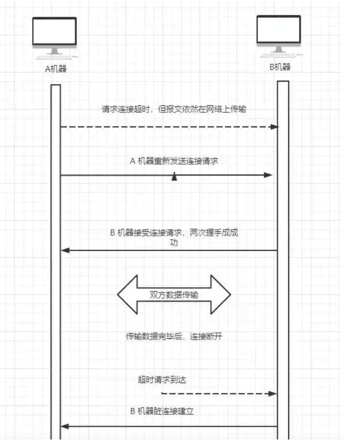
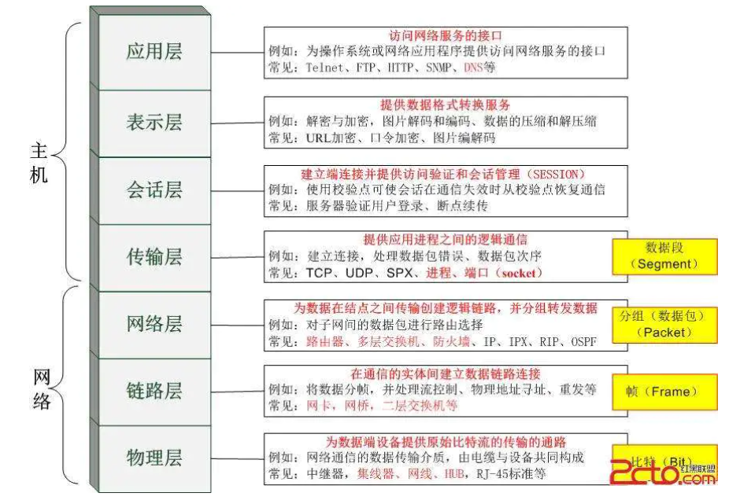
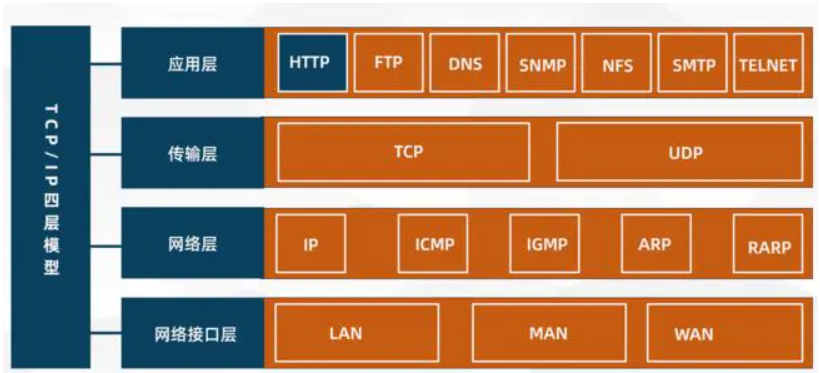
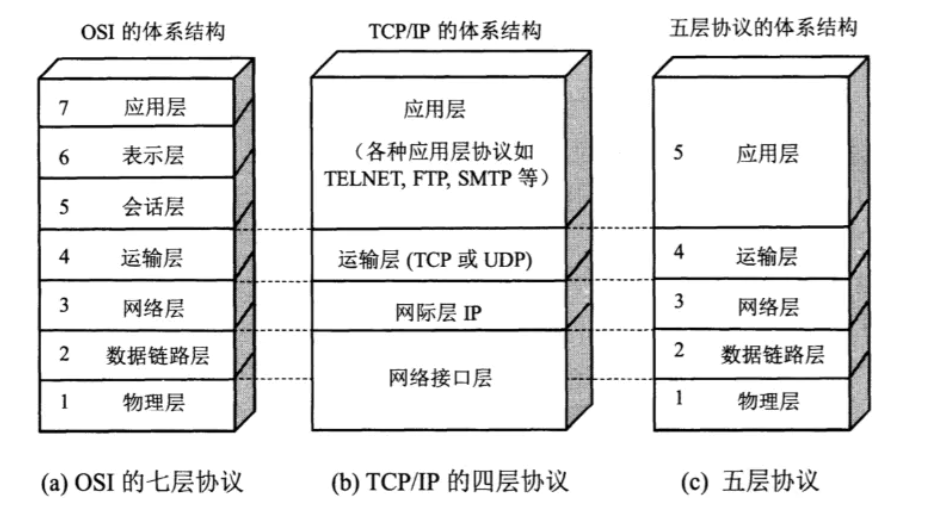
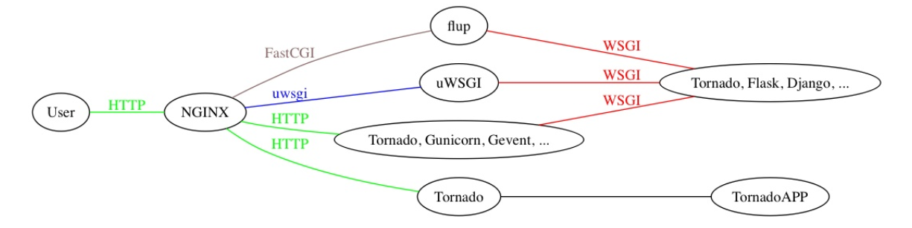

###### datetime:2020/10/27 16:58
###### author:nzb

# 文件操作
现在要处理一个大小为 10 G 的文件，但是内存只有 4 G，如果在只修改 get_lines 函数而其他代码保持不变的情况下，应该如何实现？需要考虑的问题都有那些？
```python
def get_lines():
    with open('file.txt','rb') as f:
        for i in f:
            yield i        
```

# 遍历目录与子目录

抓取.pyc文件
- 第一种
```python
import os
def get_files(dir,suffix):
    res = []
    for root,dirs,files in os.walk(dir):
        for filename in files:
            name,suf = os.path.splitext(filename)
            if suf == suffix:
                res.append(os.path.join(root,filename))
    print(res)
    
get_files("./",'.pyc')
```
- 第二种
```python
import os
def pick(obj):
    if obj.endswith(".pyc"):
        print(obj)
        
def scan_path(ph):
    file_list = os.listdir(ph)
    for obj in file_list:
        if os.path.isfile(obj):
            pick(obj)
        elif os.path.isdir(obj):
            scan_path(obj)
            
if __name__=='__main__':
    path = input('输入目录')
    scan_path(path)
```
- 第三种
```python
from glob import iglob
def func(fp, postfix):
    for i in iglob(f"{fp}/**/*{postfix}", recursive=True):
        print(i)

if __name__ == "__main__":
    postfix = ".pyc"
    func("K:\Python_script", postfix)
```

# 数字字符串转整形

字符串 "123" 转换成 123 ，不使用内置api，例如 int()

- 第一种
```python
def atoi(s):
    num = 0
    for v in s:
        for j in range(10):
            if v == str(j):
                num = num * 10 + j
    return num

```
- 第二种
```python
def atoi(s):
    num = 0
    for v in s:
        num = num * 10 + ord(v) - ord('0')
    return num
```
- 第三种
```python
def atoi(s):
    num = 0
    for v in s:
        t = "%s * 1" % v
        n = eval(t)
        num = num * 10 + n
    return num
```
- 第四种
```python
from functools import reduce
def atoi(s):
    return reduce(lambda num, v: num * 10 + ord(v) - ord('0'), s, 0)
```

# 数字字符串排序
让所有奇数都在偶数前面，而且奇数升序排列，偶数降序排序，如字符串'1982376455',变成'1355798642'

```python
print("".join(sorted('1982376455', key=lambda x: int(x) % 2 == 0 and 20 - int(x) or int(x))))

# 分解
int(x) % 2 == 0 and 20 - int(x)：这是排序偶数，降序排序
int(x)：剩下的奇数升序排序
```

# python函数重载机制？
函数重载主要是为了解决两个问题。
- 1。可变参数类型。
- 2。可变参数个数。

另外，一个基本的设计原则是，仅仅当两个函数除了参数类型和参数个数不同以外，其功能是完全相同
的，此时才使用函数重载，如果两个函数的功能其实不同，那么不应当使用重载，而应当使用一个名字
不同的函数。

好吧，那么对于情况 1 ，函数功能相同，但是参数类型不同，python 如何处理？答案是根本不需要处
理，因为 python 可以接受任何类型的参数，如果函数的功能相同，那么不同的参数类型在 python 中
很可能是相同的代码，没有必要做成两个不同函数。

那么对于情况 2 ，函数功能相同，但参数个数不同，python 如何处理？大家知道，答案就是缺省参
数。对那些缺少的参数设定为缺省参数即可解决问题。因为你假设函数功能相同，那么那些缺少的参数
终归是需要用的。

好了，鉴于情况 1 跟 情况 2 都有了解决方案，python 自然就不需要函数重载了。

# 回调函数，如何通信的?

回调函数是把函数的指针(地址)作为参数传递给另一个函数，将整个函数当作一个对象，赋值给调用的函数。

# 闭包延迟

[详情](https://blog.csdn.net/xie_0723/article/details/53925076)

下面这段代码的输出结果将是什么？请解释。
```python
    def multipliers():
        return [lambda x: i *x for i in range(4)]
    print([m(2) for m in multipliers()])
```
上面代码的输出结果是 [6,6,6,6]，不是我们想的 [0,2,4,6]

上述问题产生的原因是python闭包的延迟绑定。这意味着内部函数被调用时，参数的值在闭包内进行查找。
因此，当任何由multipliers()返回的函数被调用时,i的值将在附近的范围进行查找。
那时，不管返回的函数是否被调用，for循环已经完成，i被赋予了最终的值3.

```python
def multipliers():
    for i in range(4):
        yield lambda x: i *x
```

你如何修改上面的 multipliers 的定义产生想要的结果？

```python
def multipliers():
    return [lambda x,i = i: i*x for i in range(4)]

```

# 单例模式

- 装饰器

```python
from functools import wraps

def singleton(cls):
    _instance = {}
    
    @wraps(cls)
    def wrapper(*args, **kwargs):
        if cls not in _instance:
            _instance[cls] = cls(*args, **kwargs)
        return _instance[cls]
    return wrapper
```

- 使用基类

```python
class SingletonMeta(object):
    def __new__(cls, *args, **kwargs):
        if not hasattr(cls, "__instance"):
            setattr(cls, "__instance", super().__new__(cls, *args, **kwargs))
        return getattr(cls, "__instance")

class Foo(SingletonMeta):
    pass
```

- 使用元类

```python
class SingletonMeta(type):
    """自定义元类"""

    def __call__(cls, *args, **kwargs):
        if not hasattr(cls, "__instance"):
            setattr(cls, "__instance", super().__call__(*args, **kwargs))
        return getattr(cls, "__instance")

class Foo(metaclass=SingletonMeta):
    pass
```

# 请用一行代码实现将 1-N 的整数列表以 3 为单位分组
```python
    N =100
    print ([[x for x in range(1,100)] [i:i+3] for i in range(0,100,3)])
```

# Python的魔法方法

魔法方法就是可以给你的类增加魔力的特殊方法，如果你的对象实现（重载）了这些方法中的某一个，那么这个方法就会在特殊的情况下被Python所调用，
你可以定义自己想要的行为，而这一切都是自动发生的，它们经常是两个下划线包围来命名的（比如 `__init__` , `__len__` ),
Python的魔法方法是非常强的所以了解其使大用方法也变得尤为重要!

- `__init__`： 构造器，当一个实例被创建的时候初始化的方法，但是它并不是实例化调用的第一个方法。
- `__new__`：才是实例化对象调用的第一个方法，它只取下 cls 参数，并把其他参数传给 `__init___`。
- `___new__`： 很少使用，但是也有它适合的场景，尤其是当类继承自一个像元祖或者字符串这样不经常改变的类型的时候。
- `__call__`： 让一个类的实例像函数一样被调用
- `__getitem__`： 定义获取容器中指定元素的行为，相当于 self[key]
- `__getattr__`： 定义当用户试图访问一个不存在属性的时候的行为。
- `__setattr__`： 定义当一个属性被设置的时候的行为
- `__getattribute___`： 定义当一个属性被访问的时候的行为

# 多进程多线程以及协程的理解

这个问题被问的概念相当之大，
- 进程：一个运行的程序（代码）就是一个进程，没有运行的代码叫程序，进程是系统资源分配的最小单
位，进程拥有自己独立的内存空间，所有进程间数据不共享，开销大。
- 线程: cpu调度执行的最小单位，也叫执行路径，不能独立存在，依赖进程存在，一个进程至少有一个线
程，叫主线程，而多个线程共享内存（数据共享，共享全局变量),从而极大地提高了程序的运行效率。
- 协程: 是一种用户态的轻量级线程，协程的调度完全由用户控制。协程拥有自己的寄存器上下文和栈。
协程调度时，将寄存器上下文和栈保存到其他地方，在切回来的时候，恢复先前保存的寄存器上下文和
栈，直接操中栈则基本没有内核切换的开销，可以不加锁的访问全局变量，所以上下文的切换非常快。

# 协程
 
- python asyncio的原理？  
    asyncio 这个库就是使用 python 的 yield 这个可以打断保存当前函数的上下文的机制， 封装好了 selector 摆脱掉了复杂的回调关系
- [单线程+异步 I/O](../../../Python/Python语言基础/12-进程和线程.md#单线程异步I/O) 

# Python异步使用场景有那些
- 1、 不涉及共享资源，获对共享资源只读，即非互斥操作
- 2、 没有时序上的严格关系
- 3、 不需要原子操作，或可以通过其他方式控制原子性
- 4、 常用于IO操作等耗时操作，因为比较影响客户体验和使用性能
- 5、 不影响主线程逻辑

# 多线程竞争
线程是非独立的，同一个进程里线程是数据共享的，当各个线程访问数据资源时会出现竞争状态即：数据几乎同步会被多个线程占用，造成数据混乱，即所谓的线程不安全

那么怎么解决多线程竞争问题？---锁

- 锁的好处： 确保了某段关键代码（共享数据资源）只能由一个线程从头到尾完整地执行能解决多线程资源竞争下的原子操作问题。
- 锁的坏处： 阻止了多线程并发执行，包含锁的某段代码实际上只能以单线程模式执行，效率就大大地下降了
- 锁的致命问题: 死锁

# Python的线程同步

- setDaemon(False)

    当一个进程启动之后，会默认产生一个主线程，因为线程是程序执行的最小单位，当设置多线程时，主线程会创建多个子线程，在 Python 中，
默认情况下就是 setDaemon(False) ,主线程执行完自己的任务以后，就退出了，此时子线程会继续执行自己的任务，直到自己的任务结束。

```python
import threading
import time

def thread():
    time.sleep(2)
    print('---子线程结束---')
    
def main():
    t1 = threading.Thread(target=thread)
    t1.start()
    print('---主线程--结束')
    
if __name__ =='__main__':
    main()
    
#执行结果
---主线程--结束
---子线程结束---
```

-  setDaemon（True)
    当我们使用 setDaemon(True) 时，这是子线程为守护线程，主线程一旦执行结束，则全部子线程被强制终止
```python
import threading
import time

def thread():
    time.sleep(2)
    print(’---子线程结束---')

def main():
    t1 = threading.Thread(target=thread)
    t1.setDaemon(True)#设置子线程守护主线程
    t1.start()
    print('---主线程结束---')

if __name__ =='__main__':
    main()

#执行结果
---主线程结束--- #只有主线程结束，子线程来不及执行就被强制结束
```

-  join（线程同步)

    join 所完成的工作就是线程同步，即主线程任务结束以后，进入堵塞状态，一直等待所有的子线程结束以后，主线程再终止。

    当设置守护线程时，含义是主线程对于子线程等待 timeout 的时间将会杀死该子线程，最后退出程序，所以说，如果有 10 个子线程，
    全部的等待时间就是每个 timeout 的累加和，简单的来说，就是给每个子线程一个 timeout 的时间，让他去执行，时间一到，不管任务有没有完成，直接杀死。

    没有设置守护线程时，主线程将会等待timeout的累加和这样的一段时间，时间一到，主线程结束，但是并没有杀死子线程，子线程依然可以继续执行，直到子线程全部结束，程序退出。

```python
import threading
import time

def thread():
    time.sleep(2)
    print('---子线程结束---')

def main():
    t1 = threading.Thread(target=thread)
    t1.setDaemon(True)
    t1.start()
    t1.join(timeout=1)
    #1 线程同步，主线程堵塞1s 然后主线程结束，子线程继续执行
    #2 如果不设置timeout参数就等子线程结束主线程再结束
    #3 如果设置了setDaemon=True和timeout=1主线程等待1s后会强制杀死子线程，然后主线程结束
    print('---主线程结束---')

if __name__=='__main___':
    main()
```

# 锁及其分类

- 定义：锁(Lock)是 python 提供的对线程控制的对象。
- 分类：互斥锁，可重入锁，死锁
    - 死锁
    
        若干子线程在系统资源竞争时，都在等待对方对某部分资源解除占用状态，结果是谁也不愿先解锁，互相干等着，程序无法执行下去，这就是死锁。

    - GIL锁 全局解释器锁（互斥锁）
        - 作用： 限制多线程同时执行，保证同一时间只有一个线程执行，所以cython里的多线程其实是伪多线程！
        所以python里常常使用协程技术来代替多线程，协程是一种更轻量级的线程。
        进程和线程的切换时由系统决定，而协程由我们程序员自己决定，而模块gevent下切换是遇到了耗时操作时才会切换
    - 三者的关系：进程里有线程，线程里有协程。
- 多线程交互访问数据，怎么避免重读？
    
    创建一个已访问数据列表，用于存储已经访问过的数据，并加上互斥锁，在多线程访问数据的时候先查看数据是否在已访问的列表中，若已存在就直接跳过。
    
- 什么是线程安全，什么是互斥锁？

    每个对象都对应于一个可称为’互斥锁‘的标记，这个标记用来保证在任一时刻，只能有一个线程访问该对象。
    
    同一进程中的多线程之间是共享系统资源的，多个线程同时对一个对象进行操作，一个线程操作尚未结束，另一线程已经对其进行操作，
    导致最终结果出现错误，此时需要对被操作对象添加互斥锁，保证每个线程对该对象的操作都得到正确的结果。

# 同步、异步、阻塞、非阻塞

- 同步： 多个任务之间有先后顺序执行，一个执行完下个才能执行。
- 异步： 多个任务之间没有先后顺序，可以同时执行，有时候一个任务可能要在必要的时候获取另一个同时执行的任务的结果，这个就叫回调！
- 阻塞： 如果卡住了调用者，调用者不能继续往下执行，就是说调用者阻塞了。
- 非阻塞： 如果不会卡住，可以继续执行，就是说非阻塞的。
- 同步异步相对于多任务而言，阻塞非阻塞相对于代码执行而言。

# 僵尸进程和孤儿进程及怎么避免僵尸进程？

- 孤儿进程： 父进程退出，子进程还在运行的这些子进程都是孤儿进程，孤儿进程将被 init 进程（进程号为 1 ）所收养，并由 init 进程对他们完成状态收集工作。
- 僵尸进程： 进程使用fork 创建子进程，如果子进程退出，而父进程并没有调用 wait 获 waitpid 获取子进程的状态信息，那么子进程的进程描述符仍然保存在系统中的这些进程是僵尸进程。
- 避免僵尸进程的方法：
    - 1.fork 两次用孙子进程去完成子进程的任务
    - 2.用 wait() 函数使父进程阻塞
    - 3.使用信号量，在 signal handler 中调用 waitpid , 这样父进程不用阻塞
    
    
# IO密集型和CPU密集型区别？
- IO密集型：系统运行，大部分的状况是CPU在等 I/O（硬盘/内存）的读/写。
- CPU密集型：大部分时间用来做计算，逻辑判断等 CPU 动作的程序称之 CPU 密集型。
    
    
# python中进程与线程的使用场景？

- 多进程适合在 CPU 密集操作（ cpu 操作指令比较多，如位多的的浮点运算）。
- 多线程适合在 IO 密性型操作（读写数据操作比多的的，比如爬虫）

# 线程是并发还是并行，进程是并发还是并行？
- 并发是指一个处理器同时处理多个任务。
- 并行是指多个处理器或者是多核的处理器同时处理多个不同的任务。
- 线程是并发，进程是并行;
- 进程之间互相独立，是系统分配资源的最小单位，同一个进程中的所有线程共享资源。

# TCP和UDP
  - [详情](../../../Python/Python语言基础/13-网络编程入门.md#基于传输层协议的套接字编程) 
  - TCP 套接字：是使用 TCP 协议提供的传输服务来实现网络通信的编程接口。
  - UDP 套接字：一种非常轻便的传输协议，也称做用户数据报协议，简称 UDP。
  - TCP 和 UDP 都是提供端到端传输服务的协议。
  - 二者的差别：就如同打电话和发短信的区别，
  后者不对传输的可靠性和可达性做出任何承诺从而避免了 TCP 中握手和重传的开销，
  所以在强调性能和而不是数据完整性的场景中（例如传输网络音视频数据），UDP 可能是更好的选择。
  可能大家会注意到一个现象，就是在观看网络视频时，有时会出现卡顿，有时会出现花屏，
  这无非就是部分数据传丢或传错造成的。

# 浏览器通过WSGI请求动态资源的过程?

  浏览器发送的请求被 Nginx 监听到，Nginx 根据请求的 URL 的 PATH 或者后缀把请求静态资源的分发到静态资源的目录，
  别的请求根据配置好的转发到相应端口。
  
  实现了 WSGI 的程序会监听某个端口，监听到 Nginx 转发过来的请求接收后  (一般用 socket 的 recv 来接收  HTTP 的报文)以后把请求的报文封装成 environ 的字典对象，
  然后再提供一个 start_response 的方法。把这两个对象当成参数传入某个方法比如 
  wsgi_app(environ, start_response) 或者实现了 __call__(self, environ, start_response) 
  方法的某个实例。这个实例再调用 start_response 返回给实现了 WSGI 的中间件，再由中间件返回给 Nginx。

  Django 项目中有个 wsgi.py 的文件，里面设置了 DJANGO_SETTINGS_MODULE 为项目的配置文件，如何获取 wsgi 的APP。
  

# 浏览器访问www.baidu.com的过程
- (1) 浏览器获取输入的域名 www.baidu.com
- (2) 浏览器向 DNS 请求解析 www.baidu.com 的 IP 地址
- (3) 域名系统 DNS 解析出百度服务器的 IP 地址-通过网关出去
- (4) 浏览器与该服务器建立 TCP 连接(默认端口号 80 )
- (5) 浏览器发出 HTTP 请求，请求百度首页
- (6) 服务器通过 HTTP 响应把首页文件发送给浏览器
- (7) TCP 连接释放
- (8) 浏览器将首页文件进行解析，并将 Web 页显示给用户。

# Post和Get请求的区别
- GET：
  - 1.请求参数在请求行中，在url后。
  - 2.请求的url长度有限制的
  - 3.不太安全
  - 4.发送一次TCP数据包
- POST：
  - 1.请求参数在请求体中
  - 2.请求的url长度没有限制的
  - 3.相对安全
  - 4.发送两次TCP数据包

# cookie和session的区别
- cookie： 客户端技术，数据保存在客户端，数据不够安全，只能存储 4kb 数据
    - 单个 cookie 保存的数据不超过4K，浏览器限制一个站点最多保存 20 个 cookie
- session：服务器端技术，数据保存在服务器，数据相对安全，用户看不到数据只能看到 sessionid， 数据存储根据服务器的容量而定 
    - session 会在一定时间内保存在服务器上，当访问增多，会较占用服务器的性能，考虑到减轻服务器性能，应使用 cookie
    - 可以考虑将登陆信息等重要信息存放在 session，其他信息如果需要保留，可以放在 cookie 中
    

# 三次握手和四次挥手

- 三次握手主要有两个目的：信息对等和防止超时。
    - 信息对等
        - 两台机器通信时都需要确认四个信息：
            - 自己发报文的能力
            - 自己收报文的能力
            - 对方发报文的能力
            - 对方收报文的通知
        - 握手
            - 第一次握手：第一次握手 A 机器向 B 机器发送 SYN 数据包，此时只有 B 机器能确认自己收报文的能力和对方发报文的能力。
            - 第二次握手：每二次握手后 B 响应 A 机器的 SYN 数据包，此时 A 机器就能确认：自己发报文的能力、自己收报文的能力、对方发报文的能力、对方收报文的能力
            - 第三次握手：每三次握手后 A 应答 B 机器的 SYN + ACK 数据包，此时 B 机器就能确认：自己发报文的能力、对方收报文的能力

    - 防止超时
    
        三次握手除了保证**信息对等**也是了防止请求超时导致脏连接。TTL网络报文的生存往往会超过TCP请求超时时间，如果两次握手就能创建连接，传输数据并释放连接后，第一个超时的连接请求才到达B机器，B机器 会以为是 A 创建新连接的请求，然后确认同意创建连接。因为A机器的状态不是SYN_SENT，所以会直接丢弃了B的确认数据，导致 B 机器单方面的创建连接完毕。
        
        
- 四次挥手
    - 一次
        - 客户端发送关闭数据包
        - 服务端收到关闭连接请求后，通知应用程序处理完剩下的数据
    - 二次
        - 服务端响应客户端的关闭连接请求，说需要处理完剩下的数据，然后再发消息给你
        - 客户端收到应答后继续等待
    - 三次
        - 服务端处理完剩下的数据后，主动向客户端发送数据包
        - 客户端收到应答后，发送数据包
    - 四次
        - 服务端收到数据包后关闭连接
        - 客户端 TIME_WAIT 状态等待 2MSL 后，关闭连接
        
> 什么是2MSL：MSL是Maximum Segment Lifetime英文的缩写，中文可以译为“报文最大生存时间”，
  2MSL即两倍的MSL

- 为什么要有TIME_WAIT

    确认被动关闭（机器B）能够顺利进入CLOSED状态
    
    假如A机器发送最后一个ACK后，但由于网络原因ACK包未能到达 B 机器，此时 B机器通常会认为 A机器 没有收到 FIN+ACK报文，会重发一次FIN+ACK报文。如果 A机器 发送最后一个ACK后，自私的关闭连接进入 CLOSED状态，就可能导致 B 无法收到ACK报文，无法正常关闭。

        

# HTTPS和HTTP的区别

- 1、https 协议需要到 ca 申请证书，一般免费证书较少，因而需要一定费用。
- 2、http 是超文本传输协议，信息是明文传输，https 则是具有安全性的 ssl 加密传输协议。
- 3、http 和 https 使用的是完全不同的连接方式，用的端口也不一样，前者是 80，后者是 443。
- 4、http 的连接很简单，是无状态的；HTTPS 协议是由 SSL+HTTP 协议构建的可进行加密传输、身份认证的网络协议，比 http 协议安全。

# 使用Socket套接字需要传入哪些参数

- Address Family 和 Type，分别表示套接字应用场景和类型。
    - family 的值可以是 AF_UNIX(Unix 域，用于同一台机器上的进程间通讯)，也可以是 AF_INET（对于 IPV4 协议的 TCP 和 UDP）    
    - type 参数，
        - 流套接字(SOCK_STREAM)
        - 数据报文套接字(SOCK_DGRAM)
        - 原始套接字(SOCK_RAW)

# HTTP常见请求头

| 请求头 | 说明 |
| ------- | -------------------- |
| Accept | 浏览器可接受的MIME类型 | 
| Accept-Charset | 浏览器可接受的字符集 | 
| Accept-Encoding | 浏览器能够进行解码的数据编码方式，比如gzip。Servlet能够向支持gzip的浏览器返回经gzip编码的HTML页面。许多情形下这可以减少5到10倍的下载时间 | 
| Accept-Language | 浏览器所希望的语言种类，当服务器能够提供一种以上的语言版本时要用到 | 
| Authorization | 授权信息，通常出现在对服务器发送的WWW-Authenticate头的应答中 | 
| Connection | 表示是否需要持久连接。如果Servlet看到这里的值为“Keep-Alive”，或者看到请求使用的是HTTP 1.1（HTTP 1.1默认进行持久连接），它就可以利用持久连接的优点，当页面包含多个元素时（例如Applet，图片），显著地减少下载所需要的时间。要实现这一点，Servlet需要在应答中发送一个Content-Length头，最简单的实现方法是先把内容写入ByteArrayOutputStream，然后在正式写出内容之前计算它的大小 | 
| Content-Length | 表示请求消息正文的长度 | 
| Cookie | 这是最重要的请求头信息之一 | 
| From | 请求发送者的email地址，由一些特殊的Web客户程序使用，浏览器不会用到它 | 
| Host | 初始URL中的主机和端口 | 
| If-Modified-Since | 只有当所请求的内容在指定的日期之后又经过修改才返回它，否则返回304“Not Modified”应答 | 
| Pragma | 指定“no-cache”值表示服务器必须返回一个刷新后的文档，即使它是代理服务器而且已经有了页面的本地拷贝 | 
| Referer | 包含一个URL，用户从该URL代表的页面出发访问当前请求的页面 | 
| User-Agent | 浏览器类型，如果Servlet返回的内容与浏览器类型有关则该值非常有用 | 
| UA-Pixels，UA-Color，UA-OS，UA-CPU | 由某些版本的IE浏览器所发送的非标准的请求头，表示屏幕大小、颜色深度、操作系统和CPU类型 | 

# OSI七层模型和TCP/IP四层模型以及五层模型

- OSI
    - 7、应用层（Application）：为用户的应用程序提供网络服务
    - 6、表示层（Presentation）：将信息表示为一定形式和格式的数据流 
    - 5、会话层（Session）：负责通信主机之间会话的建立、管理和拆除，协调通信双方的会话
    - 4、传输层（Transport）：负责通信主机间端到端的连接
    - 3、网络层（Network）：负责将分组从源机送到目的机，包括寻址和最优路径选择等
    - 2、数据链路层（Data Link）：提供可靠的帧传递，实现差错控制、流控等等 
    - 1、物理层（Physical）：提供透明的比特流（01流）传递
    

- TCP/IP
    - 4、应用层（Application）：为用户提供所需要的各种服务
    - 3、传输层（Transport）：为应用层实体提供端到端的通信功能，保证了数据包的顺序传送及数据的完整性
    - 2、网际层（Internet）：主要解决主机到主机的通信问题
    - 1、网络接口层（Network Access）：负责监视数据在主机和网络之间的交换
    



# url的形式
- URL由三部分组成：资源类型、存放资源的主机域名、资源文件名。
- 也可认为由4部分组成：协议、主机、端口、路径

# 什么是WSGI和uwsgi以及uWSGI?
- WSGI：web 服务网关接口，是一套协议。用于接收用户请求并将请求进行初次封装，然后将请求交给 web 框架。
    - 实现 wsgi 协议的模块：
        - wsgiref：本质上就是编写一 socket 服务端，用于接收用户请求（django)
        - werkzeug：本质上就是编写一个 socket 服务端，用于接收用户请求(flask)
- uwsgi：是实现了 wsgi 协议的一个模块，模块本质：一个 socket 服务器
- uWSGI：是一个 web 服务器，它实现了WSGI协议、uwsgi、http等协议。
- 三种区别
    - WSGI 是一种通信协议。
    - uwsgi 是一种线路协议而不是通信协议，在此常用于在 uWSGI 服务器与其他网络服务器的数据通信。
    - uWSGI 是实现了 uwsgi 和 WSGI 两种协议的 Web 服务器。
    
    
# Nginx
nginx 是一个开源的高性能的HTTP服务器和反向代理：
- 1.作为web服务器，它处理静态文件和索引文件效果非常高
- 2.它的设计非常注重效率，最大支持5万个并发连接，但只占用很少的内存空间
- 3.稳定性高，配置简洁。
- 4.强大的反向代理和负载均衡功能，平衡集群中各个服务器的负载压力应用

# Django请求生命周期
- 1.wsgi ,请求封装后交给web框架（Flask，Django)
- 2.中间件，对请求进行校验或在请求对象中添加其他相关数据，例如：csrf,request.session
- 3.路由匹配 根据浏览器发送的不同url去匹配不同的视图函数
- 4.视图函数，在视图函数中进行业务逻辑的处理，可能涉及到：orm，templates
- 5.中间件，对响应的数据进行处理
- 6.wsgi，将响应的内容发送给浏览器

# scrapy和scrapy-redis有什么区别？为什么选择redis数据库？
- 1) scrapy 是一个 Python 爬虫框架，爬取效率极高，具有高度定制性，但是不支持分布式。
而 scrapy-redis 一套基于 redis 数据库、运行在 scrapy 框架之上的组件，可以让 scrapy 支持分布式策略，
Slave 端共享 Master 端 redis 数据库里的 item 队列、请求队列和请求指纹集合。
- 2)为什么选择 redis 数据库，因为 redis 支持主从同步，而且数据都是缓存在内存中的，所以基于 redis 的分布式爬虫，对请求和数据的高频读取效率非常高。

# 分布式爬虫主要解决什么问题？
- 1、ip
- 2、带宽
- 3、cpu
- 4、io

# [scrapy的去重与过滤器的使用](https://zhuanlan.zhihu.com/p/79120407)

# drop,delete与truncate的区别

drop 直接删掉表；truncate 删除表中数据，再插入时自增长 id 又从 1 开始；delete 删除表中数据，可以加where字句

- 1.delete 语句执行删除的过程是每次从表中删除一行，并且同时将该行的删除操作作为事务记录在日志中保存以便进行回滚操作。
truncate table则一次性地从表中删除所有的数据并不把单独的删除操作记录记入日志保存，删除行是不能恢复的。
并且在删除的过程中不会激活与表有关的删除触发器，执行速度快。
- 2.表和索引所占空间。当表被truncate后，这个表和索引所占用的空间会恢复到初始大小，而delete操作不会减少表或索引所占用的空间。
drop语句将表所占用的空间全释放掉。
- 3.一般而言，drop>truncate>delete
- 4.应用范围。truncate只能对table，delete可以是table和view
- 5.truncate和delete只删除数据，而drop则删除整个表（结构和数据)
- 6.truncate与不带where的delete：只删除数据，而不删除表的结构（定义）drop语句将删除表的结构被依赖的约束(constrain),
触发器（trigger)索引(index);依赖于该表的存储过程/函数将被保留，但其状态会变为:invalid.

# 索引的工作原理及其种类
数据库索引，是数据库管理系统中一个排序的数据结构，以协助快速查询，更新数据库表中数据。索引的实现通常使用B树以其变种B+树。

在数据之外，数据库系统还维护着满足特定查找算法的数据结构，这些数据结构以某种方式引用（指向）数据，这样就可以在这些数据结构上实现高级查找算法。这种数据结构，就是索引。

为表设置索引要付出代价的：一是增加了数据库的存储空间，二是在插入和修改数据时要花费较多的时间（因为索引也要随之变动）

# 存储函数与存储过程的区别
- [语法](../../../Database/MySQL/计算机二级MySQL.md#存储过程和存储函数) 
- 存储函数不能有输出参数，因为存储函数本身就是输出参数，而存储过程可以有输出参数
- 可以直接对存储函数进行调用，不需要使用 call
- 存储函数必须包含一条 return 语句，而这条语句不允许包含于存储过程中

# Redis宕机怎么解决?
  宕机:服务器停止服务
- 如果只有一台 redis，肯定会造成数据丢失，无法挽救
  
- 多台redis或者是redis集群，宕机则需要分为在主从模式下区分来看：
  - slave从redis宕机，配置主从复制的时候才配置从的redis，从的会从主的redis中读取主的redis的操作日志1，在redis中从库重新启动后会自动加入到主从架构中，自动完成同步数据;
  - 如果从数据库实现了持久化，此时千万不要立马重启服务，否则可能会造成数据丢失，正确的操作如下：在slave数据上执行SLAVEOF ON ONE,来断开主从关系并把slave升级为主库，此时重新启动主数据
  库，执行SLAVEOF，把它设置为从库，连接到主的redis上面做主从复制，自动备份数据。
- 以上过程很容易配置错误，可以使用redis提供的哨兵机制来简化上面的操作。简单的方法:redis的哨兵(sentinel)的功能
