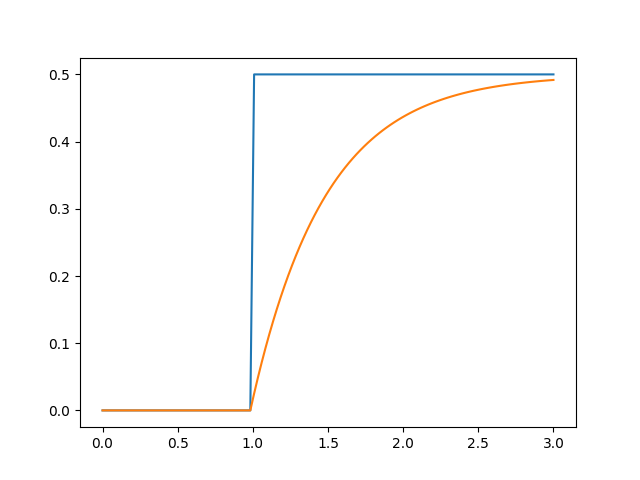
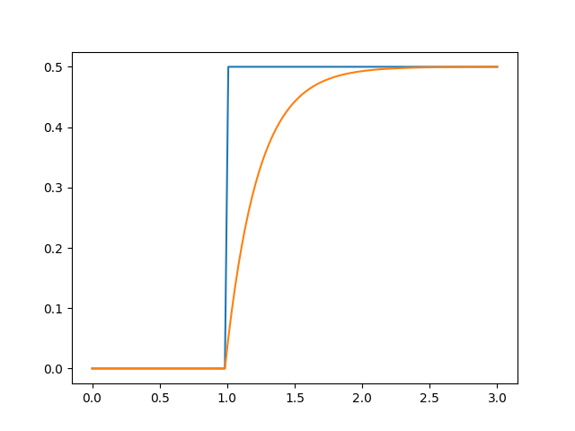
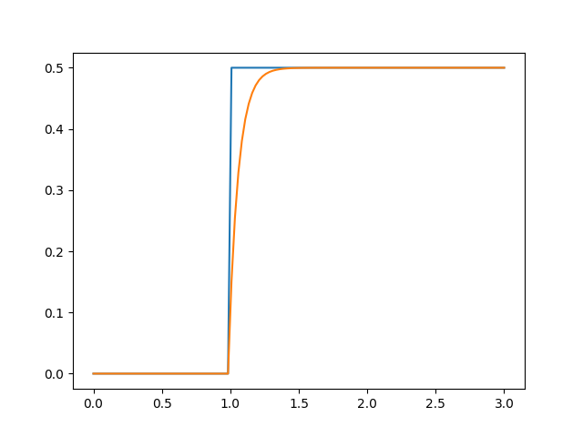

###### datetime:2025/04/18 16:07
###### author:nzb

# FirstOrderFilter(一阶滤波器)

```python
from copy import deepcopy
import matplotlib.pyplot as plt
import numpy as np
'''
For scalar filter
'''
class FirstOrderFilter:
    def __init__(self, param): # need to fine tune the param with freq
        self.param = param
        self.last_x = 0.

    def reset(self, init_x):
        self.last_x = init_x

    def filter(self, x): 
        filtered_x = self.param*x + (1-self.param)*self.last_x 
        self.last_x = filtered_x
        return filtered_x
    

def plot_filtered_x():

    steps = np.linspace(0, 3, 120)

    step_fun = np.where(steps <= 1, 0, 0.5)

    xfilter = FirstOrderFilter(0.1)

    response_fun = np.zeros_like(step_fun)

    for i in range(len(steps)):
        response_fun[i] = xfilter.filter(step_fun[i])

    plt.plot(steps, step_fun, label="cmd plot")
    plt.plot(steps, response_fun, label="filtered plot")
    plt.show()

if __name__ == "__main__":
    plot_filtered_x()

```

- `param = 0.05`
  


- `param = 0.1`



- `param = 0.3`

