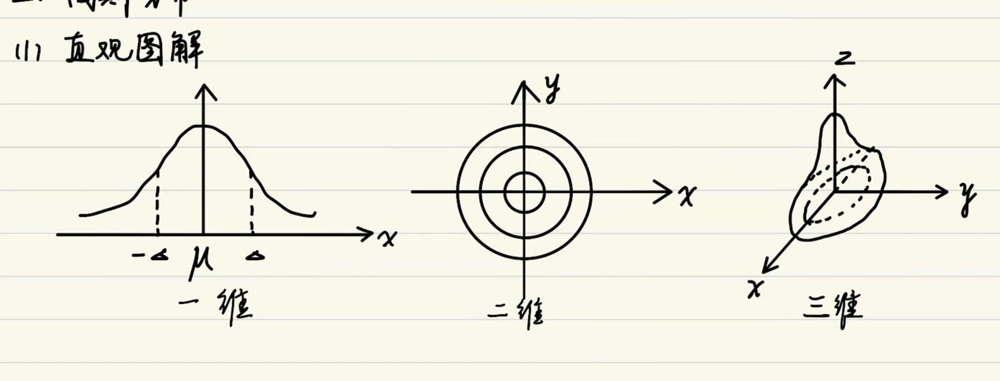
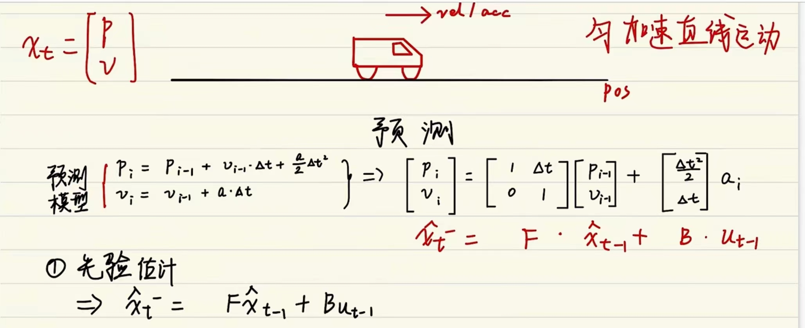
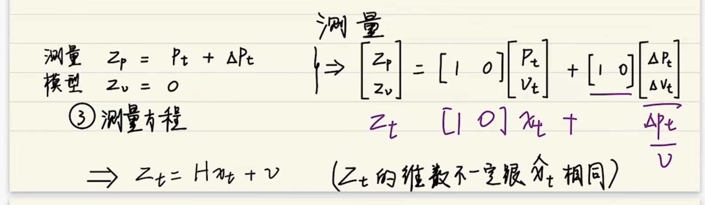
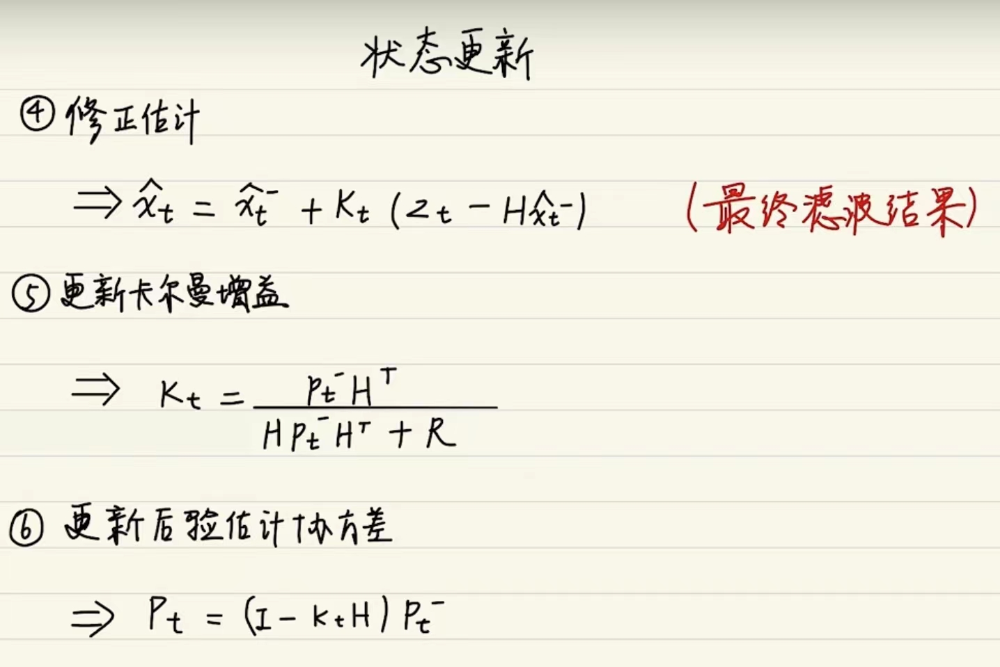
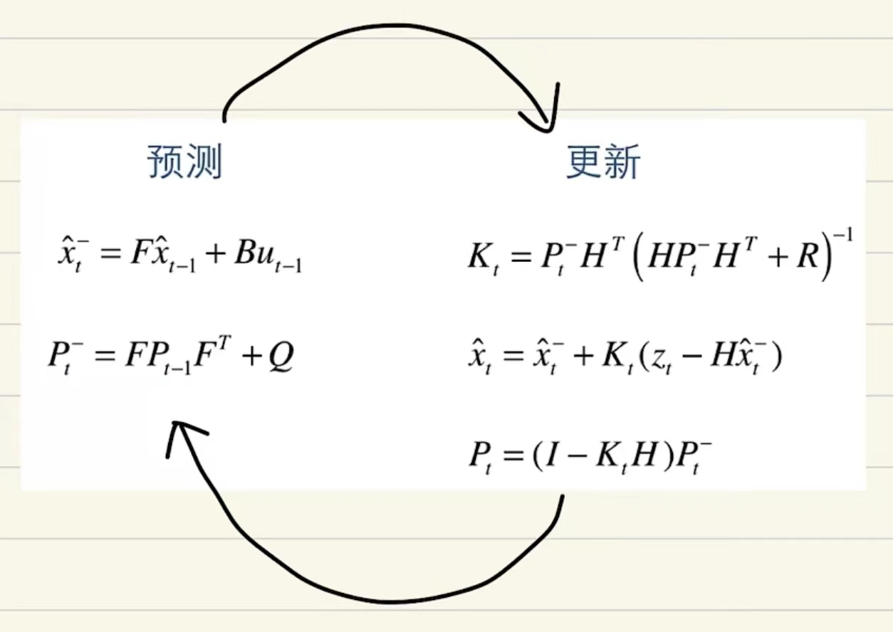
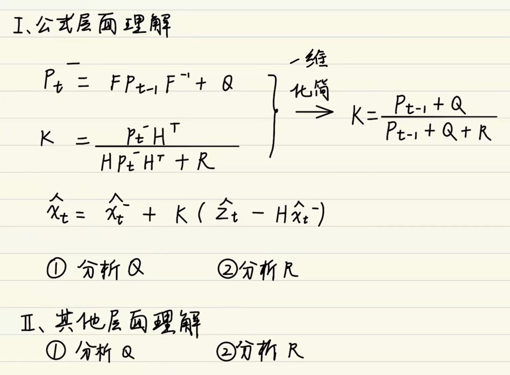
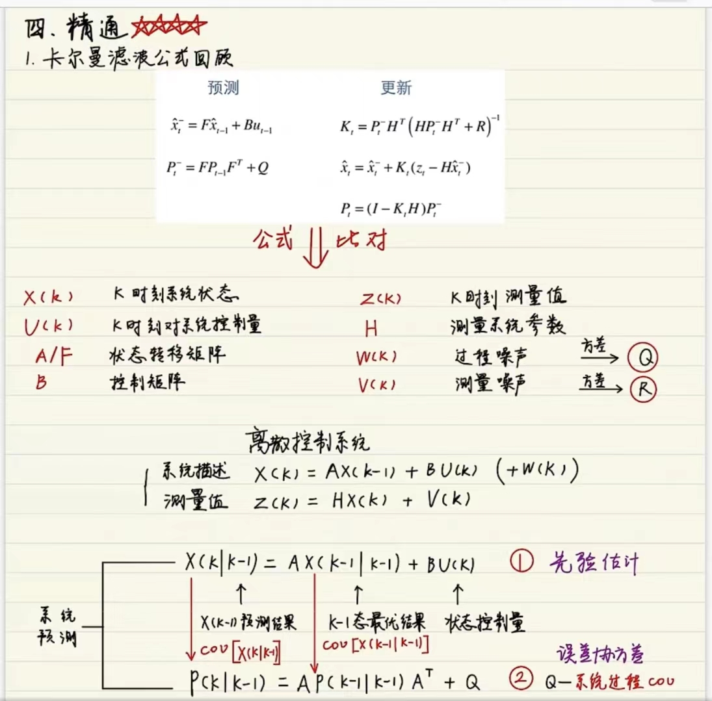
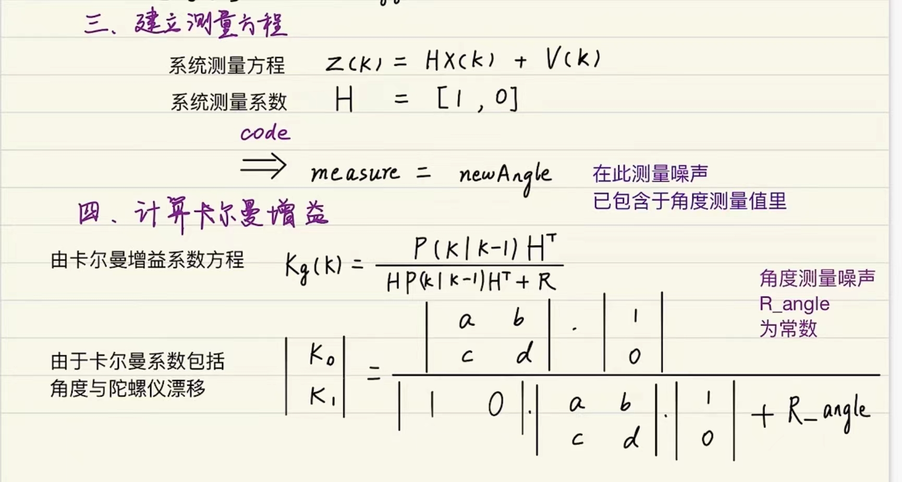
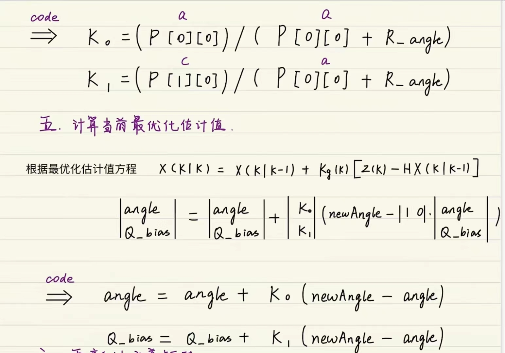
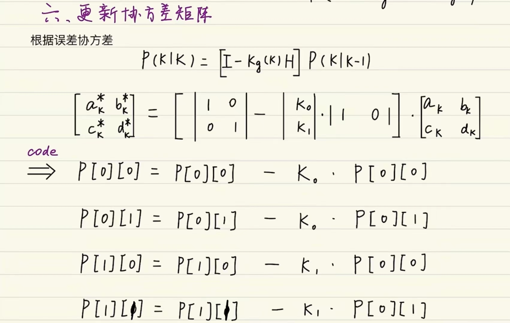

###### datetime:2024/6/16 16:07
###### author:nzb

# Kalman Filtering(卡尔曼滤波)

## 入门

> `^`表示估计值
>
> `-`表示先验估计值

- 引入

- 适用系统：线性高斯系统
    - 线性：满足**叠加性**和**齐次性**
 
    
        
    - 高斯：噪声满足高斯分布(正态分布)
        - `μ`：均值
        - `σ`：方差
    
    
- 宏观意义：滤波即加权
    - 理想状态：信号 * 1 + 噪声 * 0
    - 低通滤波：低频信号 * 1 + 高频信号 * 0
        - 因为大多情况下高频信号一般为噪声
    - 卡尔曼滤波：估计值 * (权重)  + 观测值 * (权重)

## 进阶

- 状态空间表达式(跟卡尔曼滤波方程相似)

    - 状态方程
 
        $$ x_{k} = A_{x_{k-1} } + Bu_{k} + W_{k} $$
    
        - $$ x_{k} $$：当前状态的当前值 
        - $$ A $$：状态转移矩阵，即当前状态上一刻的值乘上某种关系作用到 $$ x_{k} $$
        - $$ x_{k-1} $$： 上一时刻该状态的值
        - $$ B $$： 控制矩阵，即输入乘上某种关系作用到 $$ x_{k} $$
        - $$ u_{k} $$： 输入，给到 $$ x_{k} $$ 的输入
        - $$ W_{k} $$： 过程噪声
    
    - 观测方程
        
        $$ y_{k} = Cx_{k} + V_{k} $$
        
        - $$ y_{k} $$： 要观察的量
        - $$ C $$： $$ x_{k} $$ 乘上某种关系得到你要观察的值
        - $$ x_{k} $$： 状态量
        - $$ V_{k} $$： 观测噪声
    
    - 示例
    
    
    
    举个例子看一下，这个是火炉对水加温，
    那么这个蓝色的点呢就是水温的状态，这个红色是温度计，那么温度计是一个传感器，
    输出是一个yk，就是水温的值，那么很明显，这个时候这个C就是1。
    然后这边有一个误差，温度计也有误差，所以它输出的是观测方程下红色的那个方程，
    然后这边水温假设它是一个线性变化的，那么这个时候b乘uk就相当于得塔，每一时刻会增加多少度的温度，
    然后我们在这边的过程噪声也可以考虑进去，因为除了火炉对水加热之外，
    还有外面的环境，会影响它，所以它的过程温度并不是那么理想，然后这个要加一个过程噪声，
    然后这边是一个当前的水的温度值，温度值的话是基于之前的水温的，那么这个时候A只要取一个单位矩阵就好了。
    所以这个为状态方程下红色的方程，那么用一个方框图来表示如上图所示。

    
- 高斯分布

    - 直观图解
    
        
    
    - 参数分析
        
        - 高斯白噪声：$$ W_{k} $$ 和 $$ V_{k} $$
            - $$ W_{k} \in N(0;Q_{k}) $$；过程噪声，符合正态分布，均值为0，方差为 $$ Q_{k} $$ 
            - $$ V_{k} \in N(0;R_{k}) $$：观测噪声，符合正态分布，均值为0，方差为 $$ R_{k} $$
            - 示例：解释 $$ V_{k} $$ 和 $$ R_{k} $$ 定义
                - `GPS`检测到一辆车的`position`，开了`1000m`，但是`GPS`还是有精度误差的，所以为`1000 ± δ m`
                - `δ`就为噪声(误差)，则 $$ V_{k} = \delta m $$ 
                - `δ`符合正态分布，方差为 `1m`噪声(假设)，所以 $$ R_{k} = 1 m $$
            - 示例：解释 $$ W_{k} $$ 和 $$ Q_{k} $$ 定义
                - 假设有一个滑板，假设速度为 `5m/s`，由于风的作用，所以变成了 `5m/s ± δ m/s`
                - `δ`就为噪声(误差)，则 $$ W_{k} = \delta m/s $$
                - 假设`δ`符合正态分布，方差为 `1m/s`噪声(假设)，所以 $$ \delta \in (0,1),所以 Q_{k} = 1m/s $$ 
        - 方差
            
            - 一维方差
                - 过程和观测方差：$$ Q_{k} $$ 和 $$ R_{k} $$
                - 状态(估计值)方差：$$ \hat{\phantom{\;;}x_{t}^{-}} $$，一个值，该状态也符合正态分布
            - 二维协方差$$ cov(x,y) $$
                - $$ \hat{\phantom{\;;}x_{t}^{-}} = \begin{bmatrix}\hat{\phantom{\;;}x_{t1}^{-}} \\ \hat{\phantom{\;;}x_{t2}^{-}}\end{bmatrix}\begin{matrix}\to W_{k1}\\\to W_{k2}\end{matrix} $$
                - $$ cov(\hat{\phantom{\;}x_{t1}^{-}}, \hat{\phantom{\;}x_{t2}^{-}}) = \begin{bmatrix}  cov(x_{1}, x_{1})& cov(x_{1}, x_{2})\\  cov(x_{2}, x_{1})& cov(x_{2}, x_{2}) \end{bmatrix} $$
            - 多维协方差矩阵`C`
                - $$ C = \begin{bmatrix}cov(x_{1}, x_{1})  & cov(x_{1}, x_{2}) & ... & cov(x_{1}, x_{n})\\cov(x_{2}, x_{1})  & cov(x_{2}, x_{2}) & ... & cov(x_{2}, x_{n})\\\vdots   & \vdots & \ddots & \vdots\\cov(x_{n}, x_{1})  & cov(x_{n}, x_{2}) & ... & cov(x_{n}, x_{n})\\\end{bmatrix} $$              
    
- 超参数：`Q、R`，相当于调`PID`
    - `Q`：过程噪声方差
    - `R`：观测噪声方差
    - 主要就是调这两个参数

- 卡尔曼直观图解

- `x`轴为位置，`y`轴为概率密度
- $$ \hat{\phantom{\;;;}x_{k-1}} $$ ：无横杆，表示最优估计值，也叫修正值，后验估计值，卡尔曼滤波输出的值
- $$ \hat{\phantom{\;;;;}x_{k}^{-}} $$ ：先验估值值，基于最优估计值得出的
- $$ y_{k} $$ ：观测值，相当于直接等于`x_{k}`，传感器直接测量出来的值
- $$ \hat{\phantom{\;;;;}x_{k}} $$ ：当前时刻的最优估计值，明显方差更小，因为滤波次数过多，方差变小，趋于稳定
    - 当前的最优估计值是由：先验估计值 和 当前的观测值取公有的部分得到一个最优的值

## 放弃

### **卡尔曼公式理解**

实现过程：使用上一次的最优结果(先验估计)预测当前的值，同时使用观测值(传感器的值)修正当前值，得到最优结果  
    
- 预测
    - $$ \hat{\phantom{\;;}x_{t}^{-}} = \hat{\phantom{\;;}{F}x_{t-1}} + Bu_{t-1} $$
      - 基于之前的最优估计推出当前阶段的先验估计
    - $$ P_{t}^{-} = FP_{t-1} + Q $$
      - 协方差公式，对应上面的 $$ \hat{\phantom{\;;}x_{t}^{-}} $$ 的协方差矩阵
- 更新
    - $$ K_{t} = P_{t}^{-}H^{T}(HP_{t}^{-}H^{T} + R)^{-1}，卡尔曼增益$$
    - $$ \hat{\phantom{\;}x_{t}} = \hat{\phantom{\;;}x_{t}^{-}} + K_{t}(z_{t} - H\hat{\phantom{\;}x_{t}^{-}} ) $$
      - 最优估计(估计值+观测值)，先验估计 $$ \hat{\phantom{\;;}x_{t}^{-}} $$ 加上卡尔曼增益乘上观测值减去先验估计值，$$ K_{t}(z_{t} - H\hat{\phantom{\;}x_{t}^{-}} ) $$ 为观测值
    - $$ P_{t} = (I - K_{t}H)P_{t}^{-} $$
      - 后验估计协方差矩阵更新，基于原来预测估计的协方差矩阵乘以一个因子得出

- 示例

    
    
    - 先验估计  
       $$ \hat{x_{t}^{-}}  = F\hat x_{t-1} + Bu_{t-1} $$
    
    - $$ 预测模型\left.\begin{matrix}p_{i} = p_{i-1} + v_{i-1}\cdot \Delta t + \frac{a}{2} \Delta t^{2} & \\v_{i} = v_{i-1} + a \cdot \Delta t  &\end{matrix}\right\}\Rightarrow \begin{bmatrix} p_{i}\\ v_{i}\end{bmatrix} = \begin{bmatrix} 1 & \Delta t \\  0 & 1\end{bmatrix}\begin{bmatrix} p_{i-1}\\ v_{i-1}\end{bmatrix}+\begin{bmatrix}\frac{\Delta t^{2}}{2}  \\\Delta t\end{bmatrix}a_{i} $$

    - 先验估计协方差：
       $$ P_{t}^{-} = FP_{t-1}F^{T} + Q $$
      - 是由上面先验估计得出的，`Q`是上面先验估计的过程噪声 $$ W_{t} $$ 
        - 通常：`cov(x, x) = Var(x)`
        - 通常：`cov(Ax, Ax) = Acov(x,x)A^T`   
        - 通常：`cov(Ax+k, Ax+k) = Acov(x,x)A^T`，`k`为常数   
        - $$ cov(\hat x_{t}^{-}, \hat x_{t}^{-}) \\先验估计代入\Rightarrow cov(F\hat x_{t-1}+Bu_{t-1} + W_{t},F\hat x_{t-1}^{-}+Bu_{t-1} + W_{t})\\ \Rightarrow  Fcov(\hat x_{t-1}, \hat x_{t-1})F^{T} + cov(W_{t}, W_{t}) $$
            - $$ cov(\hat x_{t-1}, \hat x_{t-1})，就是P_{t-1}$$
            - $$ cov(W_{t}, W_{t})，就是Q$$ 
            - 化简就是最初的先验估计协方差公式
    
    - 测量方程：`Z_v`取0是为了凑维度，`H`和后面那个矩阵可以写成`[[1,0][0,0]]`
    
    - 状态更新
        
        - $$ 更新卡尔曼增益：K_{t} =\frac{P_{t}^{-}H^{T}}{HP_{t}^{-}H^{T} + R} \\\Rightarrow (假设一维，H简化为1) \frac{P_{t}^{-}}{P_{t}^{-} + R}\\\Rightarrow \frac{P_{t-1} + Q}{P_{t-1} + Q + R} 所以卡尔曼增益是跟Q和R有关的，R观测噪声方差 $$
        
    -  

### 调节超参数

- `Q`与`R`的取值
   
   

  - 公式层面理解
    - 当需要更信任观测值(观测值也有噪声)的时候，K就需要增大，R越小，K越大，越相信观测值
    - 当运动模型很完美，更相信估计值，需要K小，则Q小一点，R大一点
  - 其他层面理解
    - Q：过程噪声，如果运动模型非常完美，比如小车在光滑地面，没有风阻，这个时候运动模型基本没有噪声，则Q可以小一点，否则大一点
    - R：观测噪声，根据传感器觉得，如果精度不高噪声大，R需要大一点

- $$ P_{0} $$ 和 $$ \hat x_{0} $$ 的取值  
- 
  - 比较随意，经过迭代后期会趋于稳定值  
  - 习惯取 $$  \hat x_{0}  = 0 $$，P0往小的取，方便收敛（一般取1，不可为0）

### 卡尔曼滤波的使用
- 选择状态量，观测量
- 构建方程
- 初始化参数：`Q`,`R`,`P0`,`x0`
- 代入公式迭代
- 调节超参数：`Q`,`R`，需要多次人工调节

## 精通

### 卡尔曼滤波公式回顾

- 离散控制系统不需要滤波

### 机器人应用举例

#### 陀螺仪滤波

- 选择状态量，观测量
  - $$ 状态量\begin{bmatrix} angle (角度)\\Q\_bias (陀螺仪漂移)\end{bmatrix}\\观测量\begin{bmatrix} new\_angle (输出角度)\\\end{bmatrix} $$
  - 明确一下参数
    - 陀螺仪噪声协方差：`Q_angle`，对应状态量的`angle`
    - 陀螺仪漂移噪声协方差：`Q_gyro`，对应状态量的`Q_bias`
    - 角度测量噪声协方差：`R_angle`，对应观测量的`new_angle`
    - 陀螺仪测得的角速度：`newGyro`
    - 采样周期：`dt`
- 构建方程
  - 预测当前角度
    - $$ 由先验估计非常 X(k|k-1)  = AX(k-1|k-1) +Bu(k)  + W(k) \\之前上面的公式 \begin{bmatrix} p_{i}\\ v_{i}\end{bmatrix} = \begin{bmatrix} 1 & \Delta t \\  0 & 1\end{bmatrix}\begin{bmatrix} p_{i-1}\\ v_{i-1}\end{bmatrix}+\begin{bmatrix}\frac{\Delta t^{2}}{2}  \\\Delta t\end{bmatrix}a_{i}$$
    - $$ 预测模型\left.\begin{matrix}angle_{i} = angle_{i-1} - Q\_bias \cdot dt + newGyro \cdot dt\\Q\_bias = Q\_bias\end{matrix}\right\} \\构建方程\Rightarrow  \begin{bmatrix} angle\\ Q\_bias\end{bmatrix} = \begin{bmatrix} 1 & -dt \\  0 & 1\end{bmatrix}\begin{bmatrix} angle \\ Q\_bias\end{bmatrix}+\begin{bmatrix}dt  \\0\end{bmatrix}newGyro(newGyro在此过程噪声包含于加速度计测量值)\\代码计算\Rightarrow \begin{cases}angle = angle - Q\_bias \cdot dt + newGyro \cdot dt\\Q\_bias = Q\_bias\end{cases} $$
  - 预测协方差矩阵
    - $$ 由误差协方差方程P(k|k-1) = AP(k-1|k-1)A^{T} + Q $$ 
    - $$ 先验估计的系统参数A = \begin{bmatrix}1 & -dt \\0  &1\end{bmatrix} $$
    - $$ 得出系统过程协方差噪声Q定义\begin{vmatrix}cov(angle, angle)  & cov(angle, Q\_bias) \\cov(Q\_bias, andle)  & cov(Q\_bias, Q\_bias)\end{vmatrix} \\ 角度噪声和角速度漂移噪声独立，所以\Rightarrow \begin{vmatrix} D(angle) & 0\\  0 & D(Q\_bias)\end{vmatrix}，\\其中D(angle) = Q\_angle，D(Q\_bias) = Q\_gyro，Q\_angle和Q\_gyro的方差为常数，可由经验给出，或计算得出 $$
    - 已知`Q`和`A`了，怎么得出协方差方程？
      - 设上一次预测协方差矩阵P_k-1为
        $$ \begin{vmatrix}a_{k-1}^{*}  & b_{k-1}^{*}\\c_{k-1}^{*}  & d_{k-1}^{*}\end{vmatrix} $$
      - 本次预测协方差矩阵P_k为
        $$ \begin{vmatrix}a_{k} & b_{k} \\c_{k} & d_{k} \end{vmatrix} $$
      - 代入预测里面的协方差公式
        - $$ \begin{vmatrix}a_{k} & b_{k} \\c_{k} & d_{k} \end{vmatrix} = \begin{bmatrix}1 & -dt \\0  &1\end{bmatrix}\begin{vmatrix}a_{k-1}^{*}  & b_{k-1}^{*}\\c_{k-1}^{*}  & d_{k-1}^{*}\end{vmatrix}\begin{bmatrix}1 &  0\\-dt  &1\end{bmatrix} + \begin{vmatrix} D(angle) & 0\\  0 & D(Q\_gyro)\end{vmatrix} \\ \Rightarrow \begin{vmatrix}a_{k} & b_{k} \\c_{k} & d_{k} \end{vmatrix} = \begin{vmatrix}a_{k-1}^{*} - c_{k-1}^{*}\cdot dt - b_{k-1}^{*} \cdot dt + d_{k-1}^{*}(dt)^{2} & b_{k-1}^{*} - d_{k-1}^{*}\cdot dt \\c_{k-1}^{*} - d_{k-1}^{*}\cdot dt  & d_{k-1}^{*}\end{vmatrix} + \begin{vmatrix} D(angle) & 0\\  0 & D(Q\_gyro)\end{vmatrix} $$
      - 代码：`P`为`2x2`矩阵
        - $$ a_{k} 即为 P[0][0] = P[0][0] + Q\_angle - (P[0][1] + P[1][0]) *dt + P[1][1] * (dt)^{2}，由于dt^{2}太小，比如1ms，P[1][1]项可忽略 $$
        - $$ b_{k} 即为 P[0][1] = P[0][1] - P[1][1]*dt $$
        - $$ c_{k} 即为 P[1][0] = P[1][0] - P[1][1]*dt $$
        - $$ d_{k} 即为 P[1][1] = P[1][1] + Q\_gyro $$
    -  
    - 
    - 
- 初始化参数：`Q`,`R`,`P0`,`x0`
- 代入公式迭代
- 调节超参数：`Q`,`R`，需要多次人工调节

#### 视频目标跟踪器

##### 选择状态量，观测量

- 状态方程

  $$x_{k} = Ax_{k-1} + Bu_{k-1} + w_{k-1} $$
  - 状态量
    $$ X = [x, y, w, h, dx, dy]^{T} $$
    - `x`：`box`中心点的`x`坐标
    - `y`：`box`中心点的`y`坐标
    - `w`：`box`宽
    - `h`：`box`高
    - `dx`：中心点x坐标变化量(速度)
    - `dy`：中心点y坐标变化量(速度)
  - 状态转移矩阵 `A`
    $$ \begin{bmatrix} 1 & 0 &  0& 0 &1  &0\\ 0 & 1 &  0& 0 &0  &1 \\ 0 & 0 &  1& 0 &0  &0 \\ 0 & 0 &  0& 1 &0  &0 \\ 0 & 0 &  0& 0 &1  &0 \\ 0 & 0 &  0& 0 &0  &1 \\\end{bmatrix} $$
  - 控制输入矩阵`B=0`(零矩阵)
  - 过程噪声：来自于目标移动的不确定性(突然加速、减速、转弯等)
    $$ p(w) \sim  N(0, Q) $$

- 观测方程
  $$z_{k} = Hx_{k} + v_{k} $$
  - `t`时刻的最优估计值与`t+1`时刻所有框，`IOU`最大的，最为`t+1`时刻的观测值
  - 得到所有观测值`x, y, w, h, dx, dy`
    - `dx = x - x^-`(当前时刻 - 上一时刻)
    - `dy = y - y^-`(当前时刻 - 上一时刻)
  - 状态观测矩阵`H=E`
    $$ \begin{bmatrix} 1 & 0 &  0& 0 &0  &0\\ 0 & 1 &  0& 0 &0  &0 \\ 0 & 0 &  1& 0 &0  &0 \\ 0 & 0 &  0& 1 &0  &0 \\ 0 & 0 &  0& 0 &1  &0 \\ 0 & 0 &  0& 0 &0  &1 \\\end{bmatrix} $$
  - 观测噪声：来自于检测框丢失、重叠、不准确等
    $$ p(v) \sim  N(0, R) $$
  - 如果`IOU`匹配失败，使用上一次的最优估计值直接作为观测值
    $$ x_{k} = Ax_{k-1} $$
    - 此时每帧更新一次状态，直到在`t+n`帧找到匹配框

[代码请看](https://github.com/ZhangPHEngr/Kalman-in-MOT.git)
