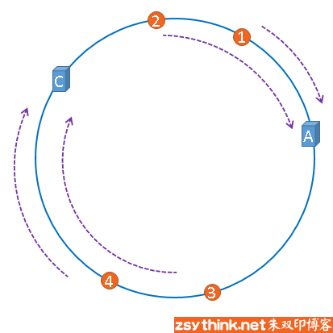

###### datetime:2024/02/04 10:54

###### author:nzb

# 哈希函数与哈希表

> 不用深入研究，底层的数学挺难的
>
> 掌握哈希函数的特点和用法就行了

## 认识哈希函数和哈希表的实现

### 哈希函数的特点

- **1、输入域是无穷的，输出域是相对有限的**
    - 函数`out = fn(in)`
    - 输入域`in`：
        - 标准是无穷的`∞`，（当也可以有限），什么叫无穷的，比如可以接收任意长度的字符串
    - 输出域`out`：比如一个S域 （输出域很大但一定是有穷尽的）
        - `md5`的返回值范围：`0~2^64-1`
        - `sha1`的返回值范围：`0~2^128-1`

> 种子码： ea089d31f 这是一个16进制的数
>
> 每一位的范围是 `0~9+a~f` 16个状态 MD5算法和SHA1算法返回的是某一个字符串，字符串的每一位字符有16种情况,
> 代表一个16进制的数,这个16进制数的范围，如果是MD5，那么这个16进制数的范围在 `0~2^64-1`， 如果是SHa1，那么这个16进制数的范围在 `0~2^128-1` ,
> 对于md5码来说他会返回一个长度为16的字符串,一个位表示16种状态，正好是`2^64(=16^16)`；如果是SHA1返回的字符串,字符串长度就是32，每一位有16种状态，
> 一共是`2^128(=16^32)`种情况

- **2、一个哈希函数，如果相同的输入参数，一定会返回相同的输出值**
    - `same in ==> same out`
    - 哈希函数内部没有任何随机的成分
- **3、由于输入是无限的，输出是有限的，则会有不同的输入对应相同的输出**
    - `dif in ==> same out` 哈希碰撞 产生的原因
- **4、离散性、均匀性**
    - 离散性是指相似输入会导致完全不一样的输出，也就是说不会存在输入相邻的两个数，输出相邻两个数的情况，比如一个圆，会分散开，不会靠在一起；
    - 均匀性是指所有产生的哈希值完全均匀的分布在整个域中，也就是给出大量相似数据，并计算哈希值，哈希值一定是均匀分布在整个域上的，不会大量聚集在某一处。 在一个圆的域，随便框一个区域点的数量是差不多的

### 实例应用上基本原理

```text
in1 --f--> out1 --%m--> m1
in2 --f--> out2 --%m--> m2
in3 --f--> out3 --%m--> m3
in4 --f--> out4 --%m--> m4
m的范围是0~m-1之间
out在S域范围内，S域范围太大了，模m可以将范围缩小，输出能再S域上均匀分布，模完m也能在`0~m-1`上均匀分布
```

### 哈希函数的使用示例

- 题目描述：
    - 有一个大文件，这个文件里面都是无符号的整数，每个整数的范围`0~2^32-1` `(== 0~42亿)`;
    - 这样的数在这个大文件中有40亿个
    - 如果只给你`1G`的内存,返回出现次数最多的数是哪一个?

- 传统使用哈希表解决该问题

    - 设计一个哈希表，`key（int）`是大文件中的某一个数，`value（int`）表示这个数出现的次数用`1G`内存设计一个哈希表，统计每个数出现的次数，最后返回
    - 特殊情况预测： 假设大文件中40亿个数都不一样，那么哈希表需要存储40亿条记录，每条记录(两个`int`，`(key,value)`)是8个字节(假设没有索引空间浪费)最差情况需要320亿个字节的存储空间，
      即`32GB >> 1GB`所以该种设计存在内存爆掉的情况

- 哈希函数和哈希表解法

- 第一步
    - 有40亿个数，`a1,a2,a3,a4……an`
    - 然后给每一个数调用一下哈希函数，产生一个输出, 即每个数的哈希值 为 `b1,b2,b3……bn`
    - 然后给每一个数模100,得到 `m1,m2,m3……mn`
- 第二步
    - 通过此过程可以知道：取模后的数m在`0~99`之间
    - 这个过程可以看做将一个大文件中的内容，分配到一些小文件里面去
    - 假设a1这个数调用哈希函数，得到的函数值模上100,得到`m1=17`，那么我们将a1分配在17号文件上
    - 同理假设a2这个数调用哈希函数，得到的函数值模上100,得到`m2=3`，那么我们将a2分配在3号文件上 …… …… ……
- 第三步
    - 根据刚才的分析，假设不同的数有40亿种，依据哈希函数的性质，我们可以认为0~99号文件中，每个文件含有不同种类的原始的数。
    - 每个小文件中，原始数的种类数是差不多的（由哈希函数的离散性和均分性可得),可能不是正好均分，但是也差不多。
    - 根据哈希函数的特性：**相同的数一定会发送到相同的小文件中，此过程将不同种类的数几乎均匀分配到100个小文件中去**
- 第四步
    - 接下来，对于每一个小文件，使用哈希表进行统计此时，每一个小文件最多使用的存储空间是`32GB/100`， 这样内存是不会爆的
    - 这样下来，每一个小文件中会出现一个次数出现最多的数, (相同的数肯定只出现在1个文件中，哈希函数的第二个特性)
- 第五步
    - 对每个小文件出现次数最多的数进行统计，然后将这个小文件的内存空间释放掉，统计下一个小文件的情况。
    - 我们将统计出的每个小文件中出现次数最多的数再进行比较，最终会得到一个出现次数最多的数。

- 总结： 利用哈希函数，让我们在数的种类上做到均分,然后我们再对每一个小文件进行分别的统计,统计完一个小文件，我们将小文件的内存释放掉，去统计下一个小文件,周而复始，我们将会统计完，最后通过比较，输出出现次数最多的数

## 哈希表

- 哈希表也叫散列表，哈希表是一种数据结构，它提供了快速的插入操作和查找操作，无论哈希表总中有多少条数据，插入和查找的时间复杂度都是为`O(1)`，所以哈希表的查找速度非常快。
- 哈希表的实现原理：先定义一个哈希表，假设该哈希表有17个空间（0~16）。将所要存储的字符串过一遍哈希函数，得到哈希值`out1`；然后将哈希值`out1`除以17取模， 假设模为7，那么将这个字符串用单向链表(也有可能是有序数组)
  的方式串联在7号空间上，不怕存在碰撞，因为是用单向链表串起来。因为哈希函数的均匀性，所以每个空间后面串联的结点数也是均匀的。
- 如果哈希表的每个空间中都串联了大量结点，这样会严重影响查找速度（因为要遍历结点）。所以当链的长度到达一个值k后，将哈希表扩容一倍（34个空间）。 扩容过程的时间复杂度是`O(logN)`，当k的值越大，时间复杂度越趋近于`O(1)`.
- 如果有`N`每次扩容需要重新算一遍前面的数的哈希值，需要`O(N)`，所以总扩容时间复杂度`O(NlogN)`，单次扩容代价实际是`O(logN)`，可以把链的长度k定为10，遍历10次很快，可以认为是`O(1)`
  ，还可以减小扩容代价，所以可以认为逼近`O(N)`

### 设计RandomPool结构

- 【题目】
    - 设计一种结构，在该结构中有如下三个功能:
    - `insert(key)`:将某个key加入到该结构，做到不重复加入
    - `delete(key)`:将原本在结构中的某个key移除
    - `get_random()`: 等概率随机返回结构中的任何一个key。
- 【要求】`insert`、`delete`和`get_random`方法的时间复杂度都是`O(1)`

- 解题思路
    - 针对`insert`我们可以实现一个字典一个列表同步操作，一个插入`(key, index)`，另外一个插入`key`，然后使用size计数即可，保持同步。
    - 针对`get_random`，虽然Hash表返回的是近似等概率的，但是不是严格等概率的，所有我们利用随机数得到一个索引然后取key。
    - 针对`delete`操作，我们确实可以直接在`(key, index)`进行操作，但是这样我们在使用`get_random`函数之后它会产生空洞了(空洞会影响随机数生成)，所以一种思路就是我们可以借助列表最后一个元素
      进行赋值给需要删除的key，这样就可以消除空洞。

```python
import random


class RandomPool:

    def __init__(self):
        self.key_index = {}
        self.index_key = []

    def insert(self, key):
        if key not in self.key_index:
            self.key_index[key] = len(self.index_key)
            self.index_key.append(key)

    def delete(self, key):
        if key in self.key_index:
            index = self.key_index[key]  # 需要删除的键的索引
            last_key = self.index_key[-1]  # 最后一个键
            # 交换和删除最后一个键
            self.index_key[index], self.index_key[-1] = self.index_key[-1], self.index_key[index]
            self.key_index[last_key] = index  # 最后一个key代替到要删除的位置
            # 删除对应键和索引
            self.key_index.pop(key)
            self.index_key.pop()

    def get_random(self):
        if self.index_key:
            index = random.randint(0, len(self.index_key) - 1)
            return self.index_key[index]
```

### 详解布隆过滤器

布隆过滤器（Bloom Filter）实际上是一个很长的二进制向量和一系列随机映射函数。布隆过滤器可以用于检索一个元素是否在一个集合中。

#### 优点：

- 可以高效地进行查询，可以用来告诉你“某样东西一定不存在或者可能存在”
- 可以高效的进行插入（但是不能删除）
- 相比于传统的`List`、`Set`、`Map`等数据结构，它占用空间更少，因为其本身并不存储任何数据（重点）
- 适用于海量数据的查找（亿量级）

#### 缺点：

- 不能提供删除操作
- 存在失误概率：将白名单中的内容误认为是黑名单中的（反之则不可能失误）。

例如：网络爬虫程序，为了不去爬相同的URL页面，需要记录下所有爬过的URL（极大数据量），在爬一个新的网页时，判断是否已经爬过。

#### 实现原理

- 定义一个m长度的位图(`bitmap`)。
- 将每个URL分别通过`K`个不同的哈希函数，并除以`m`取模，将得到的所有值都在位图上表示出来。（例如得到1，2，4，6……那么位图的1，2，4，6……空间上都涂黑。如果已经涂黑了则不进行操作）。
- 当查验一个URL是否在表上时，先将该URL通过`K`个哈希函数，并除以`m`取模，如果得到的所有值都在哈希表上被涂黑了，那么这个URL在表上。（例如得到1，2，4，6……但位图第6位空间未被涂黑，说明此URL不在表上）。

- 重点在于如何确定m和K的值(都向上取整)。

$$ m = -{n * lnP \over (ln2)^2} $$(其中n为样本量，P为预计失误率，ln以e为底)

$$ K = ln2 * {n \over m} $$(其中n为样本量，m为空间，可以多申请一些，比如26G，申请28G或32G)

$$ P = (1- e ^{-n*K \over m}) ^ K $$(其中P为实际失误率)

> - 当m(位图)过小，容易描满，就会出现失误率，白的误判为黑的，失误率与m的关系图，随着m的增大，失误率下降趋势，最后逐渐缓慢逼近0
>
> - 当K(哈希函数)过多时，也容易全部描黑，失误率和K的关系图，随着K的增大，失误率先下降，然后到达一个K值后最低，之前随着K值增大，失误率逐渐增大

```python

# python int 类型的大小是可变的
# 假设 4 bytes
arr = [0] * 10  # (4 * 8bit) * 10 = 320 bits

i = 178  # 想取178bit的状态

arr_index = i // 32  # 定位在数组哪一个数上
bit_index = i % 32  # 第几位

# 提取状态
# arr[arr_index] >> bit_index 178 移到最右边
# & 1 提取状态
status = (arr[arr_index] >> bit_index) & 1

# 修改状态为1
arr[arr_index] |= 1 << bit_index

# 修改状态为0
arr[arr_index] &= ~(1 << bit_index)
```

## 详解一致性哈希原理

逻辑服务器(查数据库的程序)对数据分布无要求，但数据服务器如何组织需要讨论。

可以利用哈希函数，再模上数据服务器个数，得到存到哪个数据服务器中，这样可以有效保证了每个数据服务器存储数据量的平均性。
为了保证数据服务器的负载均衡，哈希函数的key应该选择高频、中频、低频较为均匀的数据类型，而不是发布不均匀的，比如性别，国家等

逻辑端可以自由增加机器，但数据服务器增加时，经典方法需要改变模值，数据迁移的代价是全量的。

因此需要用到一致性哈希。将哈希的输出值域想象成一个环，设有3台机器，则有对应的三个哈希值。找到最近的哪个大于等于输入信息对应的哈希值的机器（顺时针最近的那台），如果没有则为机器1.

易知，如果增加机器/减少机器，数据迁移的代价很小。

- 问题1：机器不能做到将数据均分
- 问题2：增加/减少机器后，即使原先负载均衡，加入后也不均衡

### 解决方法（一致性哈希）

一致性哈希算法是对`2^32`取模


圆环的正上方的点代表0，0点右侧的第一个点代表1，以此类推，2、3、4、5、6……直到`2^32-1`,也就是说0点左侧的第一个点代表`2^32-1`

我们把这个由2的32次方个点组成的圆环称为hash环。

三台服务器肯定有自己的IP地址，我们使用它们各自的IP地址进行哈希计算，使用哈希后的结果对`2^32`取模

#### 一致性哈希的优点：

假设，服务器B出现了故障，我们现在需要将服务器B移除，那么，我们将上图中的服务器B从hash环上移除即可，移除服务器B以后示意图如下。


在服务器B未移除时，数据3应该被缓存到服务器B中，可是当服务器B移除以后，按照之前描述的一致性哈希算法的规则，数据3应该被缓存到服务器C中，
因为从数据3的位置出发，沿顺时针方向遇到的第一个缓存服务器节点就是服务器C，也就是说，如果服务器B出现故障被移除时，数据3的缓存位置会发生改变



但是，数据4仍然会被缓存到服务器C中，数据1与数据2仍然会被缓存到服务器A中，这与服务器B移除之前并没有任何区别，这就是一致性哈希算法的优点，
如果使用之前的hash算法，服务器数量发生改变时，所有服务器的所有缓存在同一时间失效了，而使用一致性哈希算法时，服务器的数量如果发生改变，
并不是所有缓存都会失效，而是只有部分缓存会失效，前端的缓存仍然能分担整个系统的压力，而不至于所有压力都在同一时间集中到后端服务器上。

- 存在的问题：服务器分布不均匀，造成服务器忙闲负载不同。


#### 解决方法：虚拟节点计数

给每个机器分配1000个字符串，让这1000个字符串去抢环。通过设置不同比例的字符串抢环，若增加机器，则从已有机器中按比例抢数据(比如每台服务器10%)，
还能管理负载，即给稍微弱点的机器分配少点的节点，比如1号服务器性能好，可以分配2000个字符串，3号性能差，分配800个字符串


“虚拟节点”是”实际节点”（实际的物理服务器）在hash环上的复制品,一个实际节点可以对应多个虚拟节点。

从上图可以看出，A、B、C三台服务器分别虚拟出了一个虚拟节点，当然，如果你需要，也可以虚拟出更多的虚拟节点。引入虚拟节点的概念后，缓存的分布就均衡多了，
上图中，1号、3号数据被缓存在服务器A中，5号、4号数据被缓存在服务器B中，6号、2号数据被缓存在服务器C中，如果你还不放心，可以虚拟出更多的虚拟节点，
以便减小hash环偏斜所带来的影响，虚拟节点越多，hash环上的节点就越多，缓存被均匀分布的概率就越大。

```text
去掉节点

m1服务器 {a1, a2, a3, ... a1000}字符串虚拟节点
m2服务器 {b1, b2, b3, ... b500, ... b1000}字符串虚拟节点
m3服务器 {c1, c2, c3, ... c1000}字符串虚拟节点

环上的顺序：a1 -> b1 -> c1 -> a2 -> b2 -> c2 -> ... -> b500 -> ... -> a1000 -> b1000 -> c1000 -> a1
比如去掉去掉b500，就需要把它管理的数据给a1000
```

## 岛问题

- 【题目】 一个矩阵中只有0和1两种值，每个位置都可以和自己的上、下、左、右四个位置相连，如果有一片1连在一起，这个部分叫做一个岛，求一个矩阵中有多少个岛?
- 【举例】

```text
001010
111010
100100
000000
```

这个矩阵中有三个岛

- 【解题思路】遍历矩阵，若当前数值为1，则以当前元素为感染源，进行感染，并计数+1。感染过程即：递归查询当前元素的上下左右是否为1，若为1，则将数值改为2，否则直接返回。

```python
def count_islands(data):
    if len(data) == 0:
        return 0
    row = len(data)
    column = len(data[0])
    cnt = 0
    for i in range(row):
        for j in range(column):
            if data[i][j] == 1:
                cnt += 1
                infect(data, i, j, row, column)
    return cnt


def infect(data, i, j, row, column):
    if i < 0 or i >= row or j < 0 or j >= column or data[i][j] != 1:
        return
    # i, j 都不越界
    data[i][j] = 2  # 感染
    infect(data, i + 1, j, row, column)
    infect(data, i - 1, j, row, column)
    infect(data, i, j + 1, row, column)
    infect(data, i, j - 1, row, column)


data = [[0, 0, 1, 0, 1, 0],
        [1, 1, 1, 0, 1, 0],
        [1, 0, 0, 1, 0, 0],
        [0, 0, 0, 0, 0, 0]]

print(count_islands(data))
```

- 时间复杂度，`O(N*M)`，大遍历阶段1次，感染阶段最多4次，上下左右各调用一次（如果给感染后会直接返回），所以每个位置被调用有限次数，不用思考这个位置调用几次，思考这个位置被调用几次
- 【进阶】如何设计一个并行算法解决这个问题，比如世界地图（面试中如果遇到并行算法的问题，由于代码会很复杂，往往只需要讲清楚算法，不需要写代码）
    - 【解决思路】利用并查集
    - 假设这个岛很大，需要多个CPU去计算。如下图，把岛分割成左右两边用两个cpu去计算，先分别统计分割完后每个矩阵中岛的个数，
      和边界上的1是由谁感染（感染完是2，应该是统计2是由谁感染来的，图中用的是1，所以就描述1。且图中只分成了两份，只统计中间的边界，当分成很多份时，四个边界都统计）。
      从上到下第一条绿色线划出来的两个1分别是会由图中圈出的A和C两个1感染成2，第二条绿色线的1会由B和C感染，第三条绿色线的1也会由B和C感染。

  

    - 这时候就要用并查集了，先把要去重的两个矩阵的岛的个数相加，左边是2，右边是1，所以是3。然后把边界上的每对1各自的感染源全部放入并查集初始化，
      A、B、C分别在一个集合里，然后每对1分别看两个感染源是不是同一个。第一对的感染源是A和C，不是同一个集合，岛的总数量-1，变成2，把A和C所在的集合合并。
      看第二对1，感染源是B、C，不是同一个集合，岛的总数量-1，变成1，把B和C所在的集合合并。最后看第三对1，感染源是B、C，是同一个集合，岛的总数量不变。 至此边界上所有对1都统计完了，这两个矩阵合并的岛的数量结果就是1。

## 并查集

### 什么是并查集

对于一个集合`S={a1, a2, ..., an-1, an}`，我们还可以对集合S进一步划分: `S1,S2,...,Sm-1,Sm`，我们希望能够快速确定S中的两两元素是否属于S的同一子集。
举个栗子，`S={0，1, 2, 3, 4, 5, 6}`，如果我们按照一定的规则对集合S进行划分，假设划分后为`S1={1, 2, 4}，S2={3, 6}，S3={0, 5}`
，任意给定两个元素，我们如何确定它们是否属于同一子集？某些合并子集后，又如何确定两两关系？基于此类问题便出现了并查集这种数据结构。

- 并查集有两个基本操作：
    - `is_same_set`: 查找两个元素是否属于同一个集合
    - `union`：合并两个子集为一个新的集合

### 经典结构实现并查集的不足之处

- 链表实现并查集，union方法会很快，可以达到`O(1)`，但是 is_same_set 需要遍历链表，做不到`O(1)`
- 哈希表实现并查集 is_same_set 方法会很快，可以达到`O(1)`，但是union方法需要把一张表里的所有元素重新加到另一张表里去，做不到`O(1)`

### is_same_set方法和union方法做到几乎都是O(1)的结构

数据结构使用一个向上指的图：

- 初始时每个元素自己外部包一层，有个指针指向自己。
- 调用 is_same_set 方法时，两个元素都通过指针往上走，一直走到不能再往上所找到的点，叫做集合的代表元素，如果两个元素找到的集合代表元素相同，则两个元素属于同一个集合。
-

调用union方法时，首先用is_same_set方法判定是否是同一个集合，如果不是，则两个元素向上走，找到各自集合的代表元素，之后比较两个集合元素个数的多少，少的那个集合的集合代表元素的指针指向多的那个集合的集合代表元素，这样就完成了union


### 路径压缩：并查集向上找集合代表元素过程的优化

如果 is_same_set 方法只做查找操作，那么由于union的频繁使用，链会越来越长，这样查找的效率就会越来越低。is_same_set 方法在查找的过程中，每找到一个集合代表元素，
就把发起查找的元素的指针重新指向它的集合代表元素，这样就可以做到扁平化，如果这个元素下次再发起查找，那么往上走一步就可以找到集合代表元素。

### 并查集的时间复杂度

数学证明太复杂，单说结论：假设样本有N个，`find_head`函数调用次数如果逼近或超过`O(N)`，因为路径压缩扁平化，单次平均调用`find_head`的时间复杂度为`O(1)`，所以整体的时间复杂度也是`O(1)`。

### 代码实现

- python

```python

__author__ = 'nzb'
__date__ = '2024/1/13 16:23'
__doc__ = ''


class Element:
    # 数据包装一层
    def __init__(self, value):
        self.value = value


class UnionFindSet(object):

    def __init__(self, data_set):
        self.element_map = dict()
        self.father_map = dict()  # key 某个元素 value 该元素的父
        self.size_map = dict()  # key 某个集合的代表元素， value 该集合的大小

        for val in data_set:
            ele = Element(val)
            self.element_map[val] = ele
            self.father_map[ele] = ele
            self.size_map[ele] = 1

    # 给定一个ele, 往上一直找，把代表元素返回
    def _find_head(self, element):
        path = []
        while element != self.father_map.get(element):  # 当前元素为最顶部
            path.append(element)
            element = self.father_map.get(element)
        while path:
            self.father_map[path.pop()] = element  # 把沿路的所有元素指向最上面的元素，扁平化
        return element

    def is_same_set(self, first, second):
        if first in self.element_map and second in self.element_map:
            return self._find_head(self.element_map.get(first)) == self._find_head(self.element_map.get(second))
        return False

    def union(self, first, second):
        if first in self.element_map and second in self.element_map:
            fir_ele = self._find_head(self.element_map.get(first))
            sec_ele = self._find_head(self.element_map.get(second))
            if fir_ele != sec_ele:
                big_ele = fir_ele if self.size_map.get(fir_ele) >= self.size_map.get(sec_ele) else sec_ele
                small_ele = sec_ele if big_ele == fir_ele else fir_ele
                self.father_map[small_ele] = big_ele  # 小的头部指向长
                self.size_map[big_ele] = self.size_map.get(fir_ele) + self.size_map.get(small_ele)  # 更新长度
                self.size_map.pop(small_ele)  # 移除

```

- c++

```text
class Element
{
public:
    Element(string value)
    {
        this->m_Value = value;
    }
public:
    string m_Value;
};

class UnionFindSet
{
public:
    UnionFindSet(list<string> str)   //初始化并查集的时候需要用户把所有的元素都传进来，这里采用了list的方式，也可以用其他方式
    {
        for (auto value : str)
        {
            Element *temp = new Element(value);
            elementMap.insert(make_pair(value, temp));
            fatherMap.insert(make_pair(temp, temp));       //初始时自己的父就是自己
            sizeMap.insert(make_pair(temp, 1));          //初始时每个元素都是自己集合的代表元素，每个集合元素个数都是1
        }
    }

    ~UnionFindSet()       //由于并查集内部自己在用户传入的元素外包了一层，即用new在堆区开辟了空间，等并查集调用自己的析构函数时需要释放这些空间
    {
        Element* temp = nullptr;
        for (auto element : elementMap)
        {
            temp = element.second;
            elementMap.erase(element.first);
            delete temp;
            temp = nullptr;
        }
    }

public:
    bool isSameSet(string str1, string str2)
    {
        if (elementMap.count(str1) != 0 && elementMap.count(str2) != 0)
        {
            return findHead(elementMap.at(str1)) == findHead(elementMap.at(str2));
        }
        return false;
    }

    void unionSet(string str1, string str2)
    {
        if (elementMap.count(str1) != 0 && elementMap.count(str2) != 0)
        {
            Element* small = nullptr;
            Element* big = nullptr;
            Element* head1 = findHead(elementMap.at(str1));
            Element* head2 = findHead(elementMap.at(str2));
            if (head1 != head2)
            {
                big = sizeMap.at(head1) > sizeMap.at(head2) ? head1 : head2;
                small = big == head1 ? head2 : head1;
                fatherMap.at(small) = big;
                sizeMap.at(big) += sizeMap.at(small);
                sizeMap.erase(small);
            }
        }
    }

private:
    Element* findHead(Element* element)
    {
        Element* temp = element;
        stack<Element*> path;
        while (temp != fatherMap.at(temp))
        {
            path.push(temp);
            element = fatherMap.at(temp);
        }
        while (!path.empty())
        {
            fatherMap.at(path.top()) = temp;
            path.pop();
        }
        return temp;
    }

private:
    unordered_map<string, Element*> elementMap;   //key代表用户传入的元素，value代表外面包了一层的元素
    unordered_map<Element*, Element*> fatherMap;   //key代表元素，value代表这个元素的父节点
    unordered_map<Element*, int> sizeMap;     //key代表一个集合的代表元素，value代表这个集合中有多少个元素
};


```
