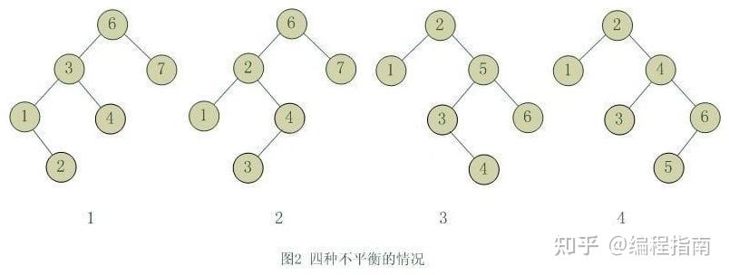

###### datetime:2024/3/05 14:31

###### author:nzb

# 有序表

- 红黑树(平衡搜索二叉树BST)
- AVL树(平衡搜索二叉树BST)
- SB树(平衡搜索二叉树BST)，比较好改
- 跳表(单链表)

## 搜索二叉树

- 构造
    - 通过新建节点，大于头节点放右边，小于放左边，暂时不考虑平衡性。直至放下
    - 一般默认搜索二叉树是没有重复的节点的，如果有重复数据，可以在每个节点加功能项，比如计数或字符串数组保存相关信息

- 查找：找小于等于6离它最近的

```text
     4
   /   \
  2     8
   \    /\
    3  7  9
      /
     5
首先来到头结点，4 < 6, 变量记录下ans=4，左树都比4小，只能在右树找
来到8, 8>6, 8的右树肯定都比6大，所以来到左树
来到7, 7>6
来到5, 5<6, ans=5, 那5的右树还有没有小于等于6的呢，5没有右树了，所以最后ans=5
```

- 删除：删除前需要先查找
    - 删除的节点没有左右孩子，直接删(找到当前节点，记下父节点，然后把父节点指为空)
    - 删除的节点左右孩子不双全(直接把父节点指向孩子)
    - 删除的节点都有左右孩子：可以用左树最右节点代替或者右树最左节点代替

```text
       ...
      /
     3
   /   \
  2     7
 / \    /\
1 2.5  6  ...
      / \...
     4
      \...


假如需要删除3,3上面还有节点
可以用左树最右节点代替或者右树最左节点代替

比如：用4替代
4剥离出来，4的右孩子给6,6的左树指向4的右孩子(因为4是6的左树,所以4的右树也小于6)
然后把4替换到3

       ...
      /
     4
   /   \
  2     7
 / \    /\
1 2.5  6  ...
      / \...
     /...
```

- 红黑树，AVL树，SB树的增删改查都是以上这些
- 上面的操作没有平衡性，做不到`O(logN)`，比如用户给`1,2,3,4,5,6`就变成`O(N)`，棒状结构，查的时候就像单链表一样

```text
1
 \
  2
   \
    3
     \
      4
       \
        ...
```

## 何为具有平衡性的树?

> 狭义的平衡二叉树需要节点的左右高度差小于等于1
>
> 广义可以是左右数节点相差不大或者左右树高度相差不大即可

- 树的左旋：头节点倒向左边

```text
  ①：节点
  ⑴：子树
  
             ①
           /    \
          ②     ③ 
         /  \   /  \  
        ⑷   ⑸ ⑹  ⑺

①左旋后
              ③
             /  \    
            ①    ⑺
           /  \
          ②   ⑹   
         /  \   
        ⑷   ⑸  
反过来③右旋后是不是变回去，平衡了
```

- 树的右旋：头节点导向右边

```text
  ①：节点
  ⑴：子树
  
             ①
           /    \
          ②     ③ 
         /  \   /  \  
        ⑷   ⑸ ⑹  ⑺

①右旋后
              ②
             /  \    
           ⑷    ①
                / \
               ⑸   ③
                  /  \
                 ⑹   ⑺
反过来②左旋后是不是变回去，平衡了
```

```text

——————————————————————————————————————
|                                    |               
|                                    |                 
|     —————————————————————————      |     
|     |                       |      |               
|     |                       |      |               
|     |       —————————       |      | 
|     |       |  搜索  |      |      |               
|     |       | 二叉树 |      |      |               
|     |       |       |       |      |               
|     |       —————————       |      |               
|     |      有左旋右旋的操作   |     |               
|     |                       |      |               
|     —————————————————————————      |
|           AVL树/红黑树/SB树         |               
|                                    |               
——————————————————————————————————————
```

- 首先是搜索二叉树，其次提供了左旋右旋的操作，在此基础上每颗树根据自己的平衡标准，利用左旋右旋做平衡

## AVL树

- 增加，删除导致不平衡
- 其为**狭义平衡化**
- 增删改查就是上面的搜索二叉树的操作
    - 增加操作后，检查时机，会往上查一下每个节点是否有平衡性
    - 删除操作后，检查时机，会往上查一下每个节点是否有平衡性
        - 但有个特殊情况，就是如果节点有左右孩子，应该从哪里开始查，比如上面删除3，就要从6开始查

### 具体如何看平衡性被破坏



- 6节点的左子树3节点高度比右子树7节点大2，左子树3节点的左子树1节点高度大于右子树4节点，这种情况成为左左(LL)(左孩子的左子树深度大), 右旋调整。
- 6节点的左子树2节点高度比右子树7节点大2，左子树2节点的左子树1节点高度小于右子树4节点，这种情况成为左右(LR)。
    - 保持平衡性：想办法让4做头部，步骤： 2节点左旋，然后4节点右旋
- 2节点的左子树1节点高度比右子树5节点小2，右子树5节点的左子树3节点高度大于右子树6节点，这种情况成为右左(RL)。
    - 保持平衡性：想办法让3做头部，步骤：5节点右旋，然后3节点左旋
- 2节点的左子树1节点高度比右子树4节点小2，右子树4节点的左子树3节点高度小于右子树6节点，这种情况成为右右(RR)，左旋调整。

- 往上调整时间复杂度：往上走的节点数`log(N)`个，每个节点调整代价`O(1)`，所以时间复杂度为`O(logN)`

如何判断是什么类型

```java
    // 检查调整函数
    private void rebalance(AVLNode node) {
        while (node != null) {
            
            Node parent = node.parent;
            
            int leftHeight = (node.left == null) ? -1 : ((AVLNode) node.left).height;
            int rightHeight = (node.right == null) ? -1 : ((AVLNode) node.right).height;
            int nodeBalance = rightHeight - leftHeight;
            // rebalance (-2 means left subtree outgrow, 2 means right subtree)
            if (nodeBalance == 2) {                                 // 右树比左树高
                if (node.right.right != null) {                     // RR型
                    node = (AVLNode)avlRotateLeft(node);            // 内部有更新高度
                    break;
                } else {                                            // RL型
                    node = (AVLNode)doubleRotateRightLeft(node);    // 内部有更新高度
                    break;
                }
            } else if (nodeBalance == -2) {
                if (node.left.left != null) {                       // LL型
                    node = (AVLNode)avlRotateRight(node);           // 内部有更新高度
                    break;
                } else {                                            // LR型
                    node = (AVLNode)doubleRotateLeftRight(node);    // 内部有更新高度
                    break;
                }
            } else {
                updateHeight(node);                                 // 更新高度，插入或删除时平衡性没破坏，但是也要更新高度
            }
            
            node = (AVLNode)parent;                                 //往上走
        }
    }
```

## 介绍SB树及其实现

### 平衡性

每棵子树的大小，不小于其兄弟的子树大小，既每棵叔叔树的大小，不小于其任何侄子树的大小

```text
      A
    /    \
   B      C
  / \     /\
 D   E   F  G
/\   /\ /\  /\
...............

[B] >= max([F], [G])
[C] >= max([D], [E])
```

### 跟AVL树一样有4种类型，`LL`, `LR`, `RR`, `RL`

- 具体实现与调整细节

- `LL`：左孩子的左孩子的大小比右孩子大

```text
L R 是节点，A B C D 都是子树

      T
    /    \
   L      R
  / \     /\
 A   B   C  D       

假设来到T, 它的平衡性被破坏了，是因为 [A] >= [R]
它的调整过程叫m(T), m(T)有以下构成
    1、先做右旋
       L
    /    \
   A      T
          /\
         B  R       
            /\
           C  D
    2、往下检查哪个节点孩子变了，T变化了，执行m(T)继续递归
    3、往下检查哪个节点孩子变了，L变化了，执行m(L)继续递归
```

- `RR`：右孩子的右孩子的大小比左孩子大，即`[D] > [A]`，调整跟`LL`类似，先左旋，继续递归
- `LR`：左孩子的右孩子的大小比左孩子大，`[B] > [R]`

```text
L R B是节点，A C D E F 都是子树

      T
    /    \
   L      R
  / \     /\
 A   B   C  D   
    / \
   E   F

调整 m(T)，调整步骤如下
    1、L左旋
    2、T右旋
    3、谁的孩子变化了，递归m(L)
    4、谁的孩子变化了，递归m(T)
    5、谁的孩子变化了，递归m(B)

和AVL树一样，想办法把B改为大头部
B左旋，再右旋

      B
    /    \
   L      T
  / \    / \
 A   E  F   R   
           / \
          C   D
```

```text
        // 检查调整函数
		private SBTNode<K, V> matain(SBTNode<K, V> cur) {
			if (cur == null) {
				return null;
			}
			if (cur.l != null && cur.l.l != null && cur.r != null && cur.l.l.size > cur.r.size) {           // LL型
				cur = rightRotate(cur);
				cur.r = matain(cur.r);
				cur = matain(cur);
			} else if (cur.l != null && cur.l.r != null && cur.r != null && cur.l.r.size > cur.r.size) {    // LR
				cur.l = leftRotate(cur.l);
				cur = rightRotate(cur);
				cur.l = matain(cur.l);
				cur.r = matain(cur.r);
				cur = matain(cur);
			} else if (cur.r != null && cur.r.r != null && cur.l != null && cur.r.r.size > cur.l.size) {    // RR
				cur = leftRotate(cur);
				cur.l = matain(cur.l);
				cur = matain(cur);
			} else if (cur.r != null && cur.r.l != null && cur.l != null && cur.r.l.size > cur.l.size) {    // RL
				cur.r = rightRotate(cur.r);
				cur = leftRotate(cur);
				cur.l = matain(cur.l);
				cur.r = matain(cur.r);
				cur = matain(cur);
			}
			return cur;
		}
```

## 红黑树

> 最复杂, 现在不怎么用，SB树和AVL树比它好，面试官要你手撕，怼他

- 平衡标准
    - 新增操作：标准为5个情况
    - 删除操作：标准为8个情况
- 平衡标准是什么
    - 每个节点不是红就是黑
    - 头结点和叶节点(最底层的空节点，不是没有左右孩子的节点)，必须为黑
    - 任何2个**红节点**不能相邻
    - 最重要一点：对于任何一个子树来说，从cur当前头部到它叶节点的每一条路径，要求黑节点数量一样
        - 如果我从一个节点出发，往下走，怎么样最长，那一定是：红->黑->红->黑...交替
        - 最短的路就是全黑

当然实际中不同的红黑树情况是不一样的，所以我们这里来分析一种极端的情况： 大家想，如果一棵红黑树有红有黑，它里面如果有一条全黑的路径，那这条全黑的路径一定就是最短路径；
如果有一条是一黑一红，一黑一红...，这样黑红相间的，那他就是最长的路径。 然后它们里面的黑色结点个数又是相同的的，所以最长路径最多是最短路径的两倍，不可能超过最短路径两倍。
所以这样红黑树的高度就能够保持在一个相对平衡的范围内，当然他就没有AVL树那么严格


## 介绍SkipList及其实现

跳表有着和红黑树、SBT树相同的功能，都能实现在`O(log(N))`内实现对数据的增删改查操作。但跳表不是以二叉树为原型的

- 平衡性：
    - 利用随机函数打破输入规律
- 具体实现与调整细节

记该结构为`SkipList`，该结构中可以包含有很多结点（`SkipListNode`），每个结点代表一个被添加到该结构的数据项。 当实例化`SkipList`时，该对象就会自带一个`SkipListNode`
（不代表任何数据项的头结点）。

```text
	public static class SkipListNode<K extends Comparable<K>, V> {
		public K key;
		public V val;
		public ArrayList<SkipListNode<K, V>> nextNodes;

		public SkipListNode(K k, V v) {
			key = k;
			val = v;
			nextNodes = new ArrayList<SkipListNode<K, V>>();
		}
```

- 刚开始有一个默认节点，该`key`是全局最小(无穷小)，用户给的任何数据都没他小，有一条往外指向空的指针
- 添加数据
    - 当你向其中添加数据之前，首先会抛硬币，将第一次出现正面朝上时硬币被抛出的次数作为该数据的层数（`level`，最小为1）， 接着将数据和其层数封装成一个`SkipListNode`添加到`SkipList`
      中，其他节点抛完硬币就不会再变了 结构初始化时，其头结点的层数为0，但每次添加数据后都会更新头结点(默认节点)的层数为所添数据中层数最大的。

```text
例子1

      3->                 3->
      2->   2->           2->
      1->   1->   1->     1->
      0->   0->   0->     0->
      默认   3      4       5
来了一个4，层数为2层，如何加进去
    默认不需要扩充，永远从最高层开始
    最高层开始找到小于等于4最右的节点(默认节点)，也就找到大于4最左的节点(5)
        但是4没有到第三层，什么也不做，默认节点本层往下跳，来到第二层
    找到小于等于4的最右节点(3节点)
        但是4没有到第二层，什么也不做，3节点本层往下跳，来到第一层
    找到小于等于4的最右节点(3节点)
        4有一层，则3节点的第一层指向4,4的第一层指向5，3节点继续往下跳，来到第零层
    找到小于等于4的最右节点(3节点)
        4有第零层，则3节点的第零层指向4,4的第零层指向5，结束
```

```text
例子2

      5---------------------->5---------------------->5->
      4---------------------->4---------------->4---->4->
      3---------------->3---->3---------->3---->3---->3->
      2---->2---------->2---->2---------->2---->2---->2->
      1---->1---->1---->1---->1---------->1---->1---->1->
      0---->0---->0---->0---->0---->0---->0---->0---->0->        
      默认   3     10    15    20    30    40   50    100

- 增加节点
假设加入2层的70
    默认节点，不用扩充，永远从最高层第5层开始，找到小于等于70的节点(20节点第5层)，加速一下子把3,10,15跨过去了，但是70没有第5层，往下跳
    来到20第4层，找到小于等于70的节点(50节点第4层)，加速跨过去30,40，但是70没有第4层，往下跳
    50来到第3层，找到小于等于70的节点(还是50节点自己)，70没有第3层，往下跳
    50来到第2层，找到小于等于70的节点(还是50节点自己)，70没有第2层，往下跳
    50来到第1层，找到小于等于70的节点(还是50节点自己)，70有第1层，50第1层指向70第1层，70第1层指向100第1层
    50来到第0层，找到小于等于70的节点(还是50节点自己)，70有第0层，50第0层指向70第0层，70第0层指向100第0层

      5---------------------->5---------------------------->5->
      4---------------------->4---------------->4---------->4->
      3---------------->3---->3---------->3---->3---------->3->
      2---->2---------->2---->2---------->2---->2---------->2->
      1---->1---->1---->1---->1---------->1---->1---->1---->1->
      0---->0---->0---->0---->0---->0---->0---->0---->0---->0->        
      默认   3     10    15    20    30    40   50    70    100

- 查询节点
假设找70节点
    肯定不能从第0层开始
    从最高层找小于等于70最右的节点(20节点)，它不是70，往下跳到第4层
    第4层找小于等于70最右的节点(50节点)，它不是70
    50往下跳到第3层,100 > 70
    50往下跳到第2层，还是100
    50往下跳到第1层，70，找到了

- 删除节点
    删除的时候先查询节点，然后把前面的节点指向删除节点后的节点
```

### 时间复杂度

- 利用随机概率生成，0.5的概率为0，0.5的概率为1
- 假如`N`个节点
    - 第0层肯定`N`个
    - 第1层肯定`N/2`个
    - 第2层差不多`N/4`个
- 相当于一颗完全二叉树

## 总结

- AVL树，红黑树，SB树相同点和不同点
    - 相同点
        - 增删改查一样
        - 检查时机一样
        - 调整的方法一样（左旋，右旋）
    - 不同点
        - 具体到每个节点的时候，所判断的违规条件不一样
        - AVL维持的是高度信息
        - SB树维持的是节点个数信息
        - 红黑树维持的他自己的标准信息