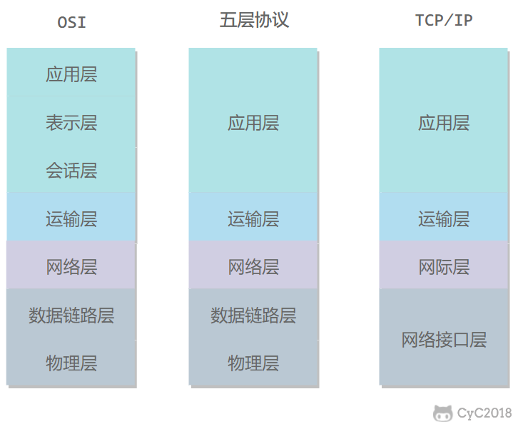
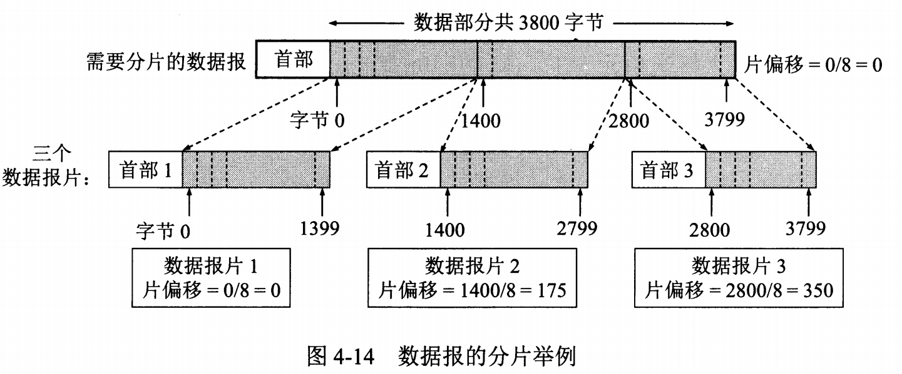

###### datetime:2022-03-08 17:19

###### author:nzb

# 技术面试必备基础知识

> [传送门](https://github.com/CyC2018/CS-Notes)

## 网络

### [计算机网络](https://github.com/CyC2018/CS-Notes/blob/master/notes/%E8%AE%A1%E7%AE%97%E6%9C%BA%E7%BD%91%E7%BB%9C%20-%20%E7%9B%AE%E5%BD%95.md)

* [概述](https://github.com/CyC2018/CS-Notes/blob/master/notes/%E8%AE%A1%E7%AE%97%E6%9C%BA%E7%BD%91%E7%BB%9C%20-%20%E6%A6%82%E8%BF%B0.md)

    * [网络的网络](https://github.com/CyC2018/CS-Notes/blob/master/notes/%E8%AE%A1%E7%AE%97%E6%9C%BA%E7%BD%91%E7%BB%9C%20-%20%E6%A6%82%E8%BF%B0.md#%E7%BD%91%E7%BB%9C%E7%9A%84%E7%BD%91%E7%BB%9C)

    * [ISP](https://github.com/CyC2018/CS-Notes/blob/master/notes/%E8%AE%A1%E7%AE%97%E6%9C%BA%E7%BD%91%E7%BB%9C%20-%20%E6%A6%82%E8%BF%B0.md#isp)
      `互联网服务提供商 ISP`

    * [主机之间的通信方式](https://github.com/CyC2018/CS-Notes/blob/master/notes/%E8%AE%A1%E7%AE%97%E6%9C%BA%E7%BD%91%E7%BB%9C%20-%20%E6%A6%82%E8%BF%B0.md#%E4%B8%BB%E6%9C%BA%E4%B9%8B%E9%97%B4%E7%9A%84%E9%80%9A%E4%BF%A1%E6%96%B9%E5%BC%8F)

        * 客户-服务器（C/S）：客户是服务的请求方，服务器是服务的提供方

        * 对等（P2P）：不区分客户和服务器

    * [电路交换与分组交换](https://github.com/CyC2018/CS-Notes/blob/master/notes/%E8%AE%A1%E7%AE%97%E6%9C%BA%E7%BD%91%E7%BB%9C%20-%20%E6%A6%82%E8%BF%B0.md#%E7%94%B5%E8%B7%AF%E4%BA%A4%E6%8D%A2%E4%B8%8E%E5%88%86%E7%BB%84%E4%BA%A4%E6%8D%A2)

        * [1\. 电路交换](https://github.com/CyC2018/CS-Notes/blob/master/notes/%E8%AE%A1%E7%AE%97%E6%9C%BA%E7%BD%91%E7%BB%9C%20-%20%E6%A6%82%E8%BF%B0.md#1-%E7%94%B5%E8%B7%AF%E4%BA%A4%E6%8D%A2)

          `用于电话通信系统，两个用户要通信之前需要建立一条专用的物理链路，并且在整个通信过程中始终占用该链路。由于通信的过程中不可能一直在使用传输线路，因此电路交换对线路的利用率很低，往往不到 10%。`

        * [2\. 分组交换](https://github.com/CyC2018/CS-Notes/blob/master/notes/%E8%AE%A1%E7%AE%97%E6%9C%BA%E7%BD%91%E7%BB%9C%20-%20%E6%A6%82%E8%BF%B0.md#2-%E5%88%86%E7%BB%84%E4%BA%A4%E6%8D%A2)

          `每个分组都有首部和尾部，包含了源地址和目的地址等控制信息，在同一个传输线路上同时传输多个分组互相不会影响，因此在同一条传输线路上允许同时传输多个分组，也就是说分组交换不需要占用传输线路。`

    * [时延](https://github.com/CyC2018/CS-Notes/blob/master/notes/%E8%AE%A1%E7%AE%97%E6%9C%BA%E7%BD%91%E7%BB%9C%20-%20%E6%A6%82%E8%BF%B0.md#%E6%97%B6%E5%BB%B6)

      `总时延 = 排队时延 + 处理时延 + 传输时延 + 传播时延`

        * [1\. 排队时延](https://github.com/CyC2018/CS-Notes/blob/master/notes/%E8%AE%A1%E7%AE%97%E6%9C%BA%E7%BD%91%E7%BB%9C%20-%20%E6%A6%82%E8%BF%B0.md#1-%E6%8E%92%E9%98%9F%E6%97%B6%E5%BB%B6)

          `分组在路由器的输入队列和输出队列中排队等待的时间，取决于网络当前的通信量。`

        * [2\. 处理时延](https://github.com/CyC2018/CS-Notes/blob/master/notes/%E8%AE%A1%E7%AE%97%E6%9C%BA%E7%BD%91%E7%BB%9C%20-%20%E6%A6%82%E8%BF%B0.md#2-%E5%A4%84%E7%90%86%E6%97%B6%E5%BB%B6)

          `主机或路由器收到分组时进行处理所需要的时间，例如分析首部、从分组中提取数据、进行差错检验或查找适当的路由等。`

        * [3\. 传输时延](https://github.com/CyC2018/CS-Notes/blob/master/notes/%E8%AE%A1%E7%AE%97%E6%9C%BA%E7%BD%91%E7%BB%9C%20-%20%E6%A6%82%E8%BF%B0.md#3-%E4%BC%A0%E8%BE%93%E6%97%B6%E5%BB%B6)

          `主机或路由器传输数据帧所需要的时间。`

        * [4\. 传播时延](https://github.com/CyC2018/CS-Notes/blob/master/notes/%E8%AE%A1%E7%AE%97%E6%9C%BA%E7%BD%91%E7%BB%9C%20-%20%E6%A6%82%E8%BF%B0.md#4-%E4%BC%A0%E6%92%AD%E6%97%B6%E5%BB%B6)

          `电磁波在信道中传播所需要花费的时间，电磁波传播的速度接近光速。`

    * [计算机网络体系结构](https://github.com/CyC2018/CS-Notes/blob/master/notes/%E8%AE%A1%E7%AE%97%E6%9C%BA%E7%BD%91%E7%BB%9C%20-%20%E6%A6%82%E8%BF%B0.md#%E8%AE%A1%E7%AE%97%E6%9C%BA%E7%BD%91%E7%BB%9C%E4%BD%93%E7%B3%BB%E7%BB%93%E6%9E%84)

        * 
        * [1\. 五层协议](https://github.com/CyC2018/CS-Notes/blob/master/notes/%E8%AE%A1%E7%AE%97%E6%9C%BA%E7%BD%91%E7%BB%9C%20-%20%E6%A6%82%E8%BF%B0.md#1-%E4%BA%94%E5%B1%82%E5%8D%8F%E8%AE%AE)

            * **应用层** ：为特定应用程序提供数据传输服务，例如 HTTP、DNS 等协议。**数据单位为报文**。

            * **传输层** ：运输层包括两种协议：传输控制协议 TCP，提供面向连接、可靠的数据传输服务，**数据单位为报文段**；用户数据报协议 UDP，提供无连接、尽最大努力的数据传输服务，**数据单位为用户数据报**
              。TCP 主要提供完整性服务，UDP 主要提供及时性服务。

            * **网络层** ：为主机提供数据传输服务。而传输层协议是为主机中的进程提供数据传输服务。**网络层把传输层传递下来的报文段或者用户数据报封装成分组**。

            * **数据链路层** ：网络层针对的还是主机之间的数据传输服务，而主机之间可以有很多链路，链路层协议就是为同一链路的主机提供数据传输服务。**数据链路层把网络层传下来的分组封装成帧**。

            * **物理层** ：考虑的是怎样在传输媒体上传输数据比特流，而不是指具体的传输媒体。物理层的作用是尽可能屏蔽传输媒体和通信手段的差异，使数据链路层感觉不到这些差异。

        * [2\. OSI](https://github.com/CyC2018/CS-Notes/blob/master/notes/%E8%AE%A1%E7%AE%97%E6%9C%BA%E7%BD%91%E7%BB%9C%20-%20%E6%A6%82%E8%BF%B0.md#2-osi)

            * 其中表示层和会话层用途如下：

                * **表示层** ：数据压缩、加密以及数据描述，这使得应用程序不必关心在各台主机中数据内部格式不同的问题。

                * **会话层** ：建立及管理会话。

            * 五层协议没有表示层和会话层，而是将这些功能留给应用程序开发者处理。

        * [3\. TCP/IP](https://github.com/CyC2018/CS-Notes/blob/master/notes/%E8%AE%A1%E7%AE%97%E6%9C%BA%E7%BD%91%E7%BB%9C%20-%20%E6%A6%82%E8%BF%B0.md#3-tcpip)

            * 它只有四层，相当于五层协议中数据链路层和物理层合并为网络接口层。

            * TCP/IP 体系结构不严格遵循 OSI 分层概念，应用层可能会直接使用 IP 层或者网络接口层。

                * 

        * [4\. 数据在各层之间的传递过程](https://github.com/CyC2018/CS-Notes/blob/master/notes/%E8%AE%A1%E7%AE%97%E6%9C%BA%E7%BD%91%E7%BB%9C%20-%20%E6%A6%82%E8%BF%B0.md#4-%E6%95%B0%E6%8D%AE%E5%9C%A8%E5%90%84%E5%B1%82%E4%B9%8B%E9%97%B4%E7%9A%84%E4%BC%A0%E9%80%92%E8%BF%87%E7%A8%8B)

            * 在向下的过程中，需要添加下层协议所需要的首部或者尾部，而在向上的过程中不断拆开首部和尾部。

            * 路由器只有下面三层协议，因为路由器位于网络核心中，不需要为进程或者应用程序提供服务，因此也就不需要传输层和应用层。

* [物理层](https://github.com/CyC2018/CS-Notes/blob/master/notes/%E8%AE%A1%E7%AE%97%E6%9C%BA%E7%BD%91%E7%BB%9C%20-%20%E7%89%A9%E7%90%86%E5%B1%82.md)

    * 通信方式

        * 根据信息在传输线上的传送方向，分为以下三种通信方式：

        * 单工通信：单向传输

        * 半双工通信：双向交替传输

        * 全双工通信：双向同时传输

    * 带通调制

        * 模拟信号是连续的信号，数字信号是离散的信号。带通调制把数字信号转换为模拟信号。

* [链路层](https://github.com/CyC2018/CS-Notes/blob/master/notes/%E8%AE%A1%E7%AE%97%E6%9C%BA%E7%BD%91%E7%BB%9C%20-%20%E9%93%BE%E8%B7%AF%E5%B1%82.md)
    - 包含协议
        - CSMA/CD 协议
        - PPP 协议

    * [基本问题](https://github.com/CyC2018/CS-Notes/blob/master/notes/%E8%AE%A1%E7%AE%97%E6%9C%BA%E7%BD%91%E7%BB%9C%20-%20%E9%93%BE%E8%B7%AF%E5%B1%82.md#%E5%9F%BA%E6%9C%AC%E9%97%AE%E9%A2%98)

        * [1\. 封装成帧](https://github.com/CyC2018/CS-Notes/blob/master/notes/%E8%AE%A1%E7%AE%97%E6%9C%BA%E7%BD%91%E7%BB%9C%20-%20%E9%93%BE%E8%B7%AF%E5%B1%82.md#1-%E5%B0%81%E8%A3%85%E6%88%90%E5%B8%A7)

          `将网络层传下来的分组添加首部和尾部，用于标记帧的开始和结束。`

        * [2\. 透明传输](https://github.com/CyC2018/CS-Notes/blob/master/notes/%E8%AE%A1%E7%AE%97%E6%9C%BA%E7%BD%91%E7%BB%9C%20-%20%E9%93%BE%E8%B7%AF%E5%B1%82.md#2-%E9%80%8F%E6%98%8E%E4%BC%A0%E8%BE%93)

          `透明表示一个实际存在的事物看起来好像不存在一样。 透明传输的内容是转义字符，用户察觉不到转义字符的存在。`

        * [3\. 差错检测](https://github.com/CyC2018/CS-Notes/blob/master/notes/%E8%AE%A1%E7%AE%97%E6%9C%BA%E7%BD%91%E7%BB%9C%20-%20%E9%93%BE%E8%B7%AF%E5%B1%82.md#3-%E5%B7%AE%E9%94%99%E6%A3%80%E6%B5%8B)

          `目前数据链路层广泛使用了循环冗余检验（CRC）来检查比特差错。`

    * [信道分类](https://github.com/CyC2018/CS-Notes/blob/master/notes/%E8%AE%A1%E7%AE%97%E6%9C%BA%E7%BD%91%E7%BB%9C%20-%20%E9%93%BE%E8%B7%AF%E5%B1%82.md#%E4%BF%A1%E9%81%93%E5%88%86%E7%B1%BB)

        * [1\. 广播信道](https://github.com/CyC2018/CS-Notes/blob/master/notes/%E8%AE%A1%E7%AE%97%E6%9C%BA%E7%BD%91%E7%BB%9C%20-%20%E9%93%BE%E8%B7%AF%E5%B1%82.md#1-%E5%B9%BF%E6%92%AD%E4%BF%A1%E9%81%93)

            * 一对多通信，一个节点发送的数据能够被广播信道上所有的节点接收到。

            * 所有的节点都在同一个广播信道上发送数据，因此需要有专门的控制方法进行协调，避免发生冲突（冲突也叫碰撞）。

            * 主要有两种控制方法进行协调，**一个是使用信道复用技术，一是使用 CSMA/CD 协议**。

                * [信道复用技术](https://github.com/CyC2018/CS-Notes/blob/master/notes/%E8%AE%A1%E7%AE%97%E6%9C%BA%E7%BD%91%E7%BB%9C%20-%20%E9%93%BE%E8%B7%AF%E5%B1%82.md#%E4%BF%A1%E9%81%93%E5%A4%8D%E7%94%A8%E6%8A%80%E6%9C%AF)

                    * [1\. 频分复用](https://github.com/CyC2018/CS-Notes/blob/master/notes/%E8%AE%A1%E7%AE%97%E6%9C%BA%E7%BD%91%E7%BB%9C%20-%20%E9%93%BE%E8%B7%AF%E5%B1%82.md#1-%E9%A2%91%E5%88%86%E5%A4%8D%E7%94%A8)

                      `频分复用的所有主机在相同的时间占用不同的频率带宽资源。 会一直占用一部分信道资源，利用率都不高。`

                    * [2\. 时分复用](https://github.com/CyC2018/CS-Notes/blob/master/notes/%E8%AE%A1%E7%AE%97%E6%9C%BA%E7%BD%91%E7%BB%9C%20-%20%E9%93%BE%E8%B7%AF%E5%B1%82.md#2-%E6%97%B6%E5%88%86%E5%A4%8D%E7%94%A8)

                      `时分复用的所有主机在不同的时间占用相同的频率带宽资源。 会一直占用一部分信道资源，利用率都不高。`

                    * [3\. 统计时分复用](https://github.com/CyC2018/CS-Notes/blob/master/notes/%E8%AE%A1%E7%AE%97%E6%9C%BA%E7%BD%91%E7%BB%9C%20-%20%E9%93%BE%E8%B7%AF%E5%B1%82.md#3-%E7%BB%9F%E8%AE%A1%E6%97%B6%E5%88%86%E5%A4%8D%E7%94%A8)

                      `是对时分复用的一种改进，不固定每个用户在时分复用帧中的位置，只要有数据集集中起来组成统计时分复用帧然后发送。`

                    * [4\. 波分复用](https://github.com/CyC2018/CS-Notes/blob/master/notes/%E8%AE%A1%E7%AE%97%E6%9C%BA%E7%BD%91%E7%BB%9C%20-%20%E9%93%BE%E8%B7%AF%E5%B1%82.md#4-%E6%B3%A2%E5%88%86%E5%A4%8D%E7%94%A8)

                      `光的频分复用。由于光的频率很高，因此习惯上用波长而不是频率来表示所使用的光载波。`

                    * [5\. 码分复用](https://github.com/CyC2018/CS-Notes/blob/master/notes/%E8%AE%A1%E7%AE%97%E6%9C%BA%E7%BD%91%E7%BB%9C%20-%20%E9%93%BE%E8%B7%AF%E5%B1%82.md#5-%E7%A0%81%E5%88%86%E5%A4%8D%E7%94%A8)

                * [CSMA/CD 协议](https://github.com/CyC2018/CS-Notes/blob/master/notes/%E8%AE%A1%E7%AE%97%E6%9C%BA%E7%BD%91%E7%BB%9C%20-%20%E9%93%BE%E8%B7%AF%E5%B1%82.md#csmacd-%E5%8D%8F%E8%AE%AE)
                  `多点接入、载波监听、碰撞检测`

                    * **多点接入** ：说明这是总线型网络，许多主机以多点的方式连接到总线上。

                    * **载波监听** ：每个主机都必须不停地监听信道。在发送前，如果监听到信道正在使用，就必须等待。

                    * **碰撞检测** ：在发送中，如果监听到信道已有其它主机正在发送数据，就表示发生了碰撞。虽然每个主机在发送数据之前都已经监听到信道为空闲，但是由于电磁波的传播时延的存在，还是有可能会发生碰撞。

        * [2\. 点对点信道](https://github.com/CyC2018/CS-Notes/blob/master/notes/%E8%AE%A1%E7%AE%97%E6%9C%BA%E7%BD%91%E7%BB%9C%20-%20%E9%93%BE%E8%B7%AF%E5%B1%82.md#2-%E7%82%B9%E5%AF%B9%E7%82%B9%E4%BF%A1%E9%81%93)

          `一对一通信。 因为不会发生碰撞，因此也比较简单，使用 PPP 协议进行控制。`

            * [PPP 协议](https://github.com/CyC2018/CS-Notes/blob/master/notes/%E8%AE%A1%E7%AE%97%E6%9C%BA%E7%BD%91%E7%BB%9C%20-%20%E9%93%BE%E8%B7%AF%E5%B1%82.md#ppp-%E5%8D%8F%E8%AE%AE)

              `PPP 协议是用户计算机和 ISP 进行通信时所使用的数据链路层协议。`

                * PPP 的帧格式

                    * 
                    * F 字段为帧的定界符

                    * A 和 C 字段暂时没有意义

                    * FCS 字段是使用 CRC 的检验序列

                    * 信息部分的长度不超过 1500

    * [MAC 地址](https://github.com/CyC2018/CS-Notes/blob/master/notes/%E8%AE%A1%E7%AE%97%E6%9C%BA%E7%BD%91%E7%BB%9C%20-%20%E9%93%BE%E8%B7%AF%E5%B1%82.md#mac-%E5%9C%B0%E5%9D%80)

      `MAC 地址是链路层地址，长度为 6 字节（48 位），用于唯一标识网络适配器（网卡）。 一台主机拥有多少个网络适配器就有多少个 MAC 地址。例如笔记本电脑普遍存在无线网络适配器和有线网络适配器，因此就有两个 MAC 地址。`

    * [局域网](https://github.com/CyC2018/CS-Notes/blob/master/notes/%E8%AE%A1%E7%AE%97%E6%9C%BA%E7%BD%91%E7%BB%9C%20-%20%E9%93%BE%E8%B7%AF%E5%B1%82.md#%E5%B1%80%E5%9F%9F%E7%BD%91)

      `局域网是一种典型的广播信道，主要特点是网络为一个单位所拥有，且地理范围和站点数目均有限。`

        * 主要有以太网、令牌环网、FDDI 和 ATM 等局域网技术，目前以太网占领着有线局域网市场。

        * 可以按照网络拓扑结构对局域网进行分类：

            * 

    * [以太网](https://github.com/CyC2018/CS-Notes/blob/master/notes/%E8%AE%A1%E7%AE%97%E6%9C%BA%E7%BD%91%E7%BB%9C%20-%20%E9%93%BE%E8%B7%AF%E5%B1%82.md#%E4%BB%A5%E5%A4%AA%E7%BD%91)

        * 以太网是一种星型拓扑结构局域网。 早期使用集线器进行连接，如果集线器同时收到两个不同接口的帧，那么就发生了碰撞。

        * 目前以太网使用交换机替代了集线器，交换机是一种链路层设备，它不会发生碰撞，能根据 MAC 地址进行存储转发。

        * 以太网帧格式：

            * 

            * **类型** ：标记上层使用的协议；

            * **数据** ：长度在 46-1500 之间，如果太小则需要填充；

            * **FCS** ：帧检验序列，使用的是 CRC 检验方法；

    * [交换机](https://github.com/CyC2018/CS-Notes/blob/master/notes/%E8%AE%A1%E7%AE%97%E6%9C%BA%E7%BD%91%E7%BB%9C%20-%20%E9%93%BE%E8%B7%AF%E5%B1%82.md#%E4%BA%A4%E6%8D%A2%E6%9C%BA)

      `交换机具有自学习能力，学习的是交换表的内容，交换表中存储着 MAC 地址到接口的映射。`

    * [虚拟局域网](https://github.com/CyC2018/CS-Notes/blob/master/notes/%E8%AE%A1%E7%AE%97%E6%9C%BA%E7%BD%91%E7%BB%9C%20-%20%E9%93%BE%E8%B7%AF%E5%B1%82.md#%E8%99%9A%E6%8B%9F%E5%B1%80%E5%9F%9F%E7%BD%91)

      `虚拟局域网可以建立与物理位置无关的逻辑组，只有在同一个虚拟局域网中的成员才会收到链路层广播信息。`

* [网络层](https://github.com/CyC2018/CS-Notes/blob/master/notes/%E8%AE%A1%E7%AE%97%E6%9C%BA%E7%BD%91%E7%BB%9C%20-%20%E7%BD%91%E7%BB%9C%E5%B1%82.md)
    - 包含协议
        - IP 协议
        - ARP 地址解析协议
        - ICMP 网际控制报文协议
        - IGMP 网际组管理协议
        - RIP、OSPF 内部网关协议
        - BGP 外部网关协议

    * [概述](https://github.com/CyC2018/CS-Notes/blob/master/notes/%E8%AE%A1%E7%AE%97%E6%9C%BA%E7%BD%91%E7%BB%9C%20-%20%E7%BD%91%E7%BB%9C%E5%B1%82.md#%E6%A6%82%E8%BF%B0)

      `使用 IP 协议，可以把异构的物理网络连接起来，使得在网络层看起来好像是一个统一的网络。`

        * 与 IP 协议配套使用的还有三个协议：

            * 地址解析协议 ARP（Address Resolution Protocol）

            * 网际控制报文协议 ICMP（Internet Control Message Protocol）

            * 网际组管理协议 IGMP（Internet Group Management Protocol）

    * [IP 数据报格式](https://github.com/CyC2018/CS-Notes/blob/master/notes/%E8%AE%A1%E7%AE%97%E6%9C%BA%E7%BD%91%E7%BB%9C%20-%20%E7%BD%91%E7%BB%9C%E5%B1%82.md#ip-%E6%95%B0%E6%8D%AE%E6%8A%A5%E6%A0%BC%E5%BC%8F)

        * 

        * **版本** : 有 4（IPv4）和 6（IPv6）两个值；

        * **首部长度** : 占 4 位，因此最大值为 15。值为 1 表示的是 1 个 32 位字的长度，也就是 4 字节。因为固定部分长度为 20 字节，因此该值最小为 5。如果可选字段的长度不是 4
          字节的整数倍，就用尾部的填充部分来填充。

        * **区分服务** : 用来获得更好的服务，一般情况下不使用。

        * **总长度** : 包括首部长度和数据部分长度。

        * **生存时间** ：TTL，它的存在是为了防止无法交付的数据报在互联网中不断兜圈子。以路由器跳数为单位，当 TTL 为 0 时就丢弃数据报。

        * **协议** ：指出携带的数据应该上交给哪个协议进行处理，例如 ICMP、TCP、UDP 等。

        * **首部检验和** ：因为数据报每经过一个路由器，都要重新计算检验和，因此检验和不包含数据部分可以减少计算的工作量。

        * **标识** : 在数据报长度过长从而发生分片的情况下，相同数据报的不同分片具有相同的标识符。

        * **片偏移** : 和标识符一起，用于发生分片的情况。片偏移的单位为 8 字节。

            * 

    * [IP 地址编址方式](https://github.com/CyC2018/CS-Notes/blob/master/notes/%E8%AE%A1%E7%AE%97%E6%9C%BA%E7%BD%91%E7%BB%9C%20-%20%E7%BD%91%E7%BB%9C%E5%B1%82.md#ip-%E5%9C%B0%E5%9D%80%E7%BC%96%E5%9D%80%E6%96%B9%E5%BC%8F)

        * [1\. 分类](https://github.com/CyC2018/CS-Notes/blob/master/notes/%E8%AE%A1%E7%AE%97%E6%9C%BA%E7%BD%91%E7%BB%9C%20-%20%E7%BD%91%E7%BB%9C%E5%B1%82.md#1-%E5%88%86%E7%B1%BB)

            * 由两部分组成，网络号和主机号，其中不同分类具有不同的网络号长度，并且是固定的。

            * IP 地址 ::= {< 网络号 >, < 主机号 >}

            * 

        * [2\. 子网划分](https://github.com/CyC2018/CS-Notes/blob/master/notes/%E8%AE%A1%E7%AE%97%E6%9C%BA%E7%BD%91%E7%BB%9C%20-%20%E7%BD%91%E7%BB%9C%E5%B1%82.md#2-%E5%AD%90%E7%BD%91%E5%88%92%E5%88%86)

            * 通过在主机号字段中拿一部分作为子网号，把两级 IP 地址划分为三级 IP 地址。

            * IP 地址 ::= {< 网络号 >, < 子网号 >, < 主机号 >}

            * 要使用子网，必须配置子网掩码。一个 B 类地址的默认子网掩码为 255.255.0.0，如果 B 类地址的子网占两个比特，那么子网掩码为 11111111 11111111 11000000
              00000000，也就是 255.255.192.0。

            * 注意，外部网络看不到子网的存在。

        * [3\. 无分类](https://github.com/CyC2018/CS-Notes/blob/master/notes/%E8%AE%A1%E7%AE%97%E6%9C%BA%E7%BD%91%E7%BB%9C%20-%20%E7%BD%91%E7%BB%9C%E5%B1%82.md#3-%E6%97%A0%E5%88%86%E7%B1%BB)

    * [地址解析协议 ARP](https://github.com/CyC2018/CS-Notes/blob/master/notes/%E8%AE%A1%E7%AE%97%E6%9C%BA%E7%BD%91%E7%BB%9C%20-%20%E7%BD%91%E7%BB%9C%E5%B1%82.md#%E5%9C%B0%E5%9D%80%E8%A7%A3%E6%9E%90%E5%8D%8F%E8%AE%AE-arp)

      `ARP 实现由 IP 地址得到 MAC 地址。`

    * [网际控制报文协议 ICMP](https://github.com/CyC2018/CS-Notes/blob/master/notes/%E8%AE%A1%E7%AE%97%E6%9C%BA%E7%BD%91%E7%BB%9C%20-%20%E7%BD%91%E7%BB%9C%E5%B1%82.md#%E7%BD%91%E9%99%85%E6%8E%A7%E5%88%B6%E6%8A%A5%E6%96%87%E5%8D%8F%E8%AE%AE-icmp)

      `ICMP 是为了更有效地转发 IP 数据报和提高交付成功的机会。它封装在 IP 数据报中，但是不属于高层协议。 ICMP 报文分为差错报告报文和询问报文。`

        * [1\. Ping](https://github.com/CyC2018/CS-Notes/blob/master/notes/%E8%AE%A1%E7%AE%97%E6%9C%BA%E7%BD%91%E7%BB%9C%20-%20%E7%BD%91%E7%BB%9C%E5%B1%82.md#1-ping)

          `主要用来测试两台主机之间的连通性。 Ping 会根据时间和成功响应的次数估算出数据包往返时间以及丢包率。`

        * [2\. Traceroute](https://github.com/CyC2018/CS-Notes/blob/master/notes/%E8%AE%A1%E7%AE%97%E6%9C%BA%E7%BD%91%E7%BB%9C%20-%20%E7%BD%91%E7%BB%9C%E5%B1%82.md#2-traceroute)

          `用来跟踪一个分组从源点到终点的路径`

    * [虚拟专用网 VPN](https://github.com/CyC2018/CS-Notes/blob/master/notes/%E8%AE%A1%E7%AE%97%E6%9C%BA%E7%BD%91%E7%BB%9C%20-%20%E7%BD%91%E7%BB%9C%E5%B1%82.md#%E8%99%9A%E6%8B%9F%E4%B8%93%E7%94%A8%E7%BD%91-vpn)

      `一个机构并不需要把所有的主机接入到外部的互联网中，机构内的计算机可以使用仅在本机构有效的 IP 地址（专用地址）。`

        * 有三个专用地址块：

            * 10.0.0.0 ~ 10.255.255.255

            * 172.16.0.0 ~ 172.31.255.255

            * 192.168.0.0 ~ 192.168.255.255

    * [网络地址转换 NAT](https://github.com/CyC2018/CS-Notes/blob/master/notes/%E8%AE%A1%E7%AE%97%E6%9C%BA%E7%BD%91%E7%BB%9C%20-%20%E7%BD%91%E7%BB%9C%E5%B1%82.md#%E7%BD%91%E7%BB%9C%E5%9C%B0%E5%9D%80%E8%BD%AC%E6%8D%A2-nat)

    * [路由器的结构](https://github.com/CyC2018/CS-Notes/blob/master/notes/%E8%AE%A1%E7%AE%97%E6%9C%BA%E7%BD%91%E7%BB%9C%20-%20%E7%BD%91%E7%BB%9C%E5%B1%82.md#%E8%B7%AF%E7%94%B1%E5%99%A8%E7%9A%84%E7%BB%93%E6%9E%84)

        * 路由器从功能上可以划分为

            * 路由选择

            * 分组转发。

                * 分组转发结构由三个部分组成

                    * 交换结构

                    * 一组输入端口

                    * 一组输出端口。

        * [路由器分组转发流程](https://github.com/CyC2018/CS-Notes/blob/master/notes/%E8%AE%A1%E7%AE%97%E6%9C%BA%E7%BD%91%E7%BB%9C%20-%20%E7%BD%91%E7%BB%9C%E5%B1%82.md#%E8%B7%AF%E7%94%B1%E5%99%A8%E5%88%86%E7%BB%84%E8%BD%AC%E5%8F%91%E6%B5%81%E7%A8%8B)

        * [路由选择协议](https://github.com/CyC2018/CS-Notes/blob/master/notes/%E8%AE%A1%E7%AE%97%E6%9C%BA%E7%BD%91%E7%BB%9C%20-%20%E7%BD%91%E7%BB%9C%E5%B1%82.md#%E8%B7%AF%E7%94%B1%E9%80%89%E6%8B%A9%E5%8D%8F%E8%AE%AE)

            * 可以把路由选择协议划分为两大类：

                * 自治系统内部的路由选择：RIP 和 OSPF

                * 自治系统间的路由选择：BGP

            * [1\. 内部网关协议 RIP](https://github.com/CyC2018/CS-Notes/blob/master/notes/%E8%AE%A1%E7%AE%97%E6%9C%BA%E7%BD%91%E7%BB%9C%20-%20%E7%BD%91%E7%BB%9C%E5%B1%82.md#1-%E5%86%85%E9%83%A8%E7%BD%91%E5%85%B3%E5%8D%8F%E8%AE%AE-rip)

              `RIP 是一种基于距离向量的路由选择协议。距离是指跳数，直接相连的路由器跳数为 1。跳数最多为 15，超过 15 表示不可达。 RIP 协议实现简单，开销小。但是 RIP 能使用的最大距离为 15，限制了网络的规模。并且当网络出现故障时，要经过比较长的时间才能将此消息传送到所有路由器。`

            * [2\. 内部网关协议 OSPF](https://github.com/CyC2018/CS-Notes/blob/master/notes/%E8%AE%A1%E7%AE%97%E6%9C%BA%E7%BD%91%E7%BB%9C%20-%20%E7%BD%91%E7%BB%9C%E5%B1%82.md#2-%E5%86%85%E9%83%A8%E7%BD%91%E5%85%B3%E5%8D%8F%E8%AE%AE-ospf)

              `开放最短路径优先 OSPF，是为了克服 RIP 的缺点而开发出来的。`

            * [3\. 外部网关协议 BGP](https://github.com/CyC2018/CS-Notes/blob/master/notes/%E8%AE%A1%E7%AE%97%E6%9C%BA%E7%BD%91%E7%BB%9C%20-%20%E7%BD%91%E7%BB%9C%E5%B1%82.md#3-%E5%A4%96%E9%83%A8%E7%BD%91%E5%85%B3%E5%8D%8F%E8%AE%AE-bgp)

              `边界网关协议`

* [传输层](https://github.com/CyC2018/CS-Notes/blob/master/notes/%E8%AE%A1%E7%AE%97%E6%9C%BA%E7%BD%91%E7%BB%9C%20-%20%E4%BC%A0%E8%BE%93%E5%B1%82.md)
    - 包含协议
        - TCP 传输控制协议
        - UDP 用户数据报协议`

    * [UDP 和 TCP 的特点](https://github.com/CyC2018/CS-Notes/blob/master/notes/%E8%AE%A1%E7%AE%97%E6%9C%BA%E7%BD%91%E7%BB%9C%20-%20%E4%BC%A0%E8%BE%93%E5%B1%82.md#udp-%E5%92%8C-tcp-%E7%9A%84%E7%89%B9%E7%82%B9)

        * 用户数据报协议 UDP（User Datagram Protocol）是无连接的，尽最大可能交付，没有拥塞控制，面向报文（对于应用程序传下来的报文不合并也不拆分，只是添加 UDP
          首部），支持一对一、一对多、多对一和多对多的交互通信。

        * 传输控制协议 TCP（Transmission Control
          Protocol）是面向连接的，提供可靠交付，有流量控制，拥塞控制，提供全双工通信，面向字节流（把应用层传下来的报文看成字节流，把字节流组织成大小不等的数据块），每一条 TCP 连接只能是点对点的（一对一）。

    * [UDP 首部格式](https://github.com/CyC2018/CS-Notes/blob/master/notes/%E8%AE%A1%E7%AE%97%E6%9C%BA%E7%BD%91%E7%BB%9C%20-%20%E4%BC%A0%E8%BE%93%E5%B1%82.md#udp-%E9%A6%96%E9%83%A8%E6%A0%BC%E5%BC%8F)

      `首部字段只有 8 个字节，包括源端口、目的端口、长度、检验和。12 字节的伪首部是为了计算检验和临时添加的。`

    * [TCP 首部格式](https://github.com/CyC2018/CS-Notes/blob/master/notes/%E8%AE%A1%E7%AE%97%E6%9C%BA%E7%BD%91%E7%BB%9C%20-%20%E4%BC%A0%E8%BE%93%E5%B1%82.md#tcp-%E9%A6%96%E9%83%A8%E6%A0%BC%E5%BC%8F)

        * **序号** ：用于对字节流进行编号，例如序号为 301，表示第一个字节的编号为 301，如果携带的数据长度为 100 字节，那么下一个报文段的序号应为 401。

        * **确认号** ：期望收到的下一个报文段的序号。例如 B 正确收到 A 发送来的一个报文段，序号为 501，携带的数据长度为 200 字节，因此 B 期望下一个报文段的序号为 701，B 发送给 A
          的确认报文段中确认号就为 701。

        * **数据偏移** ：指的是数据部分距离报文段起始处的偏移量，实际上指的是首部的长度。

        * **确认 ACK** ：当 ACK=1 时确认号字段有效，否则无效。TCP 规定，在连接建立后所有传送的报文段都必须把 ACK 置 1。

        * **同步 SYN** ：在连接建立时用来同步序号。当 SYN=1，ACK=0 时表示这是一个连接请求报文段。若对方同意建立连接，则响应报文中 SYN=1，ACK=1。

        * **终止 FIN** ：用来释放一个连接，当 FIN=1 时，表示此报文段的发送方的数据已发送完毕，并要求释放连接。

        * **窗口** ：窗口值作为接收方让发送方设置其发送窗口的依据。之所以要有这个限制，是因为接收方的数据缓存空间是有限的。

    * [TCP 的三次握手](https://github.com/CyC2018/CS-Notes/blob/master/notes/%E8%AE%A1%E7%AE%97%E6%9C%BA%E7%BD%91%E7%BB%9C%20-%20%E4%BC%A0%E8%BE%93%E5%B1%82.md#tcp-%E7%9A%84%E4%B8%89%E6%AC%A1%E6%8F%A1%E6%89%8B)

        * 假设 A 为客户端，B 为服务器端。

        * 首先 B 处于 LISTEN（监听）状态，等待客户的连接请求。

        * A 向 B 发送连接请求报文，SYN=1，ACK=0，选择一个初始的序号 x。

        * B 收到连接请求报文，如果同意建立连接，则向 A 发送连接确认报文，SYN=1，ACK=1，确认号为 x+1，同时也选择一个初始的序号 y。

        * A 收到 B 的连接确认报文后，还要向 B 发出确认，确认号为 y+1，序号为 x+1。

        * B 收到 A 的确认后，连接建立。

    * [TCP 的四次挥手](https://github.com/CyC2018/CS-Notes/blob/master/notes/%E8%AE%A1%E7%AE%97%E6%9C%BA%E7%BD%91%E7%BB%9C%20-%20%E4%BC%A0%E8%BE%93%E5%B1%82.md#tcp-%E7%9A%84%E5%9B%9B%E6%AC%A1%E6%8C%A5%E6%89%8B)

        * 以下描述不讨论序号和确认号，因为序号和确认号的规则比较简单。并且不讨论 ACK，因为 ACK 在连接建立之后都为 1。

            * A 发送连接释放报文，FIN=1。

            * B 收到之后发出确认，此时 TCP 属于半关闭状态，B 能向 A 发送数据但是 A 不能向 B 发送数据。

            * 当 B 不再需要连接时，发送连接释放报文，FIN=1。

            * A 收到后发出确认，进入 TIME-WAIT 状态，等待 2 MSL（最大报文存活时间）后释放连接。

            * B 收到 A 的确认后释放连接。

    * [TCP 可靠传输](https://github.com/CyC2018/CS-Notes/blob/master/notes/%E8%AE%A1%E7%AE%97%E6%9C%BA%E7%BD%91%E7%BB%9C%20-%20%E4%BC%A0%E8%BE%93%E5%B1%82.md#tcp-%E5%8F%AF%E9%9D%A0%E4%BC%A0%E8%BE%93)

      `TCP 使用超时重传来实现可靠传输：如果一个已经发送的报文段在超时时间内没有收到确认，那么就重传这个报文段。`

    * [TCP 滑动窗口](https://github.com/CyC2018/CS-Notes/blob/master/notes/%E8%AE%A1%E7%AE%97%E6%9C%BA%E7%BD%91%E7%BB%9C%20-%20%E4%BC%A0%E8%BE%93%E5%B1%82.md#tcp-%E6%BB%91%E5%8A%A8%E7%AA%97%E5%8F%A3)

      `窗口是缓存的一部分，用来暂时存放字节流。`

    * [TCP 流量控制](https://github.com/CyC2018/CS-Notes/blob/master/notes/%E8%AE%A1%E7%AE%97%E6%9C%BA%E7%BD%91%E7%BB%9C%20-%20%E4%BC%A0%E8%BE%93%E5%B1%82.md#tcp-%E6%B5%81%E9%87%8F%E6%8E%A7%E5%88%B6)

      `流量控制是为了控制发送方发送速率，保证接收方来得及接收。 接收方发送的确认报文中的窗口字段可以用来控制发送方窗口大小，从而影响发送方的发送速率。将窗口字段设置为 0，则发送方不能发送数据。`

    * [TCP 拥塞控制](https://github.com/CyC2018/CS-Notes/blob/master/notes/%E8%AE%A1%E7%AE%97%E6%9C%BA%E7%BD%91%E7%BB%9C%20-%20%E4%BC%A0%E8%BE%93%E5%B1%82.md#tcp-%E6%8B%A5%E5%A1%9E%E6%8E%A7%E5%88%B6)

      `如果网络出现拥塞，分组将会丢失，此时发送方会继续重传，从而导致网络拥塞程度更高。因此当出现拥塞时，应当控制发送方的速率。这一点和流量控制很像，但是出发点不同。流量控制是为了让接收方能来得及接收，而拥塞控制是为了降低整个网络的拥塞程度。 发送方需要维护一个叫做拥塞窗口（cwnd）的状态变量，注意拥塞窗口与发送方窗口的区别：拥塞窗口只是一个状态变量，实际决定发送方能发送多少数据的是发送方窗口。`

        * [1\. 慢开始与拥塞避免](https://github.com/CyC2018/CS-Notes/blob/master/notes/%E8%AE%A1%E7%AE%97%E6%9C%BA%E7%BD%91%E7%BB%9C%20-%20%E4%BC%A0%E8%BE%93%E5%B1%82.md#1-%E6%85%A2%E5%BC%80%E5%A7%8B%E4%B8%8E%E6%8B%A5%E5%A1%9E%E9%81%BF%E5%85%8D)

        * [2\. 快重传与快恢复](https://github.com/CyC2018/CS-Notes/blob/master/notes/%E8%AE%A1%E7%AE%97%E6%9C%BA%E7%BD%91%E7%BB%9C%20-%20%E4%BC%A0%E8%BE%93%E5%B1%82.md#2-%E5%BF%AB%E9%87%8D%E4%BC%A0%E4%B8%8E%E5%BF%AB%E6%81%A2%E5%A4%8D)

* [应用层](https://github.com/CyC2018/CS-Notes/blob/master/notes/%E8%AE%A1%E7%AE%97%E6%9C%BA%E7%BD%91%E7%BB%9C%20-%20%E5%BA%94%E7%94%A8%E5%B1%82.md)
    - 包含协议
        - FTP 文本传输协议
        - HTTP 超文本传输协议
        - DHCP 动态主机配置协议
        - TELNET 远程登录协议
        - SMTP 邮件发送协议
        - POP3、IMAP 邮件读取协议`

    * [域名系统](https://github.com/CyC2018/CS-Notes/blob/master/notes/%E8%AE%A1%E7%AE%97%E6%9C%BA%E7%BD%91%E7%BB%9C%20-%20%E5%BA%94%E7%94%A8%E5%B1%82.md#%E5%9F%9F%E5%90%8D%E7%B3%BB%E7%BB%9F)

      `DNS 是一个分布式数据库，提供了主机名和 IP 地址之间相互转换的服务。 这里的分布式数据库是指，每个站点只保留它自己的那部分数据。 域名具有层次结构，从上到下依次为：根域名、顶级域名、二级域名。`

    * [文件传送协议](https://github.com/CyC2018/CS-Notes/blob/master/notes/%E8%AE%A1%E7%AE%97%E6%9C%BA%E7%BD%91%E7%BB%9C%20-%20%E5%BA%94%E7%94%A8%E5%B1%82.md#%E6%96%87%E4%BB%B6%E4%BC%A0%E9%80%81%E5%8D%8F%E8%AE%AE)

        * FTP 使用 TCP 进行连接，它需要两个连接来传送一个文件：

            * 控制连接：服务器打开端口号 21 等待客户端的连接，客户端主动建立连接后，使用这个连接将客户端的命令传送给服务器，并传回服务器的应答。

            * 数据连接：用来传送一个文件数据。

        * 根据数据连接是否是服务器端主动建立，FTP 有主动和被动两种模式：

            * 主动模式：服务器端主动建立数据连接，其中服务器端的端口号为 20，客户端的端口号随机，但是必须大于 1024，因为 0~1023 是熟知端口号。

            * 被动模式：客户端主动建立数据连接，其中客户端的端口号由客户端自己指定，服务器端的端口号随机。

    * [动态主机配置协议](https://github.com/CyC2018/CS-Notes/blob/master/notes/%E8%AE%A1%E7%AE%97%E6%9C%BA%E7%BD%91%E7%BB%9C%20-%20%E5%BA%94%E7%94%A8%E5%B1%82.md#%E5%8A%A8%E6%80%81%E4%B8%BB%E6%9C%BA%E9%85%8D%E7%BD%AE%E5%8D%8F%E8%AE%AE)

        * DHCP (Dynamic Host Configuration Protocol) 提供了即插即用的连网方式，用户不再需要手动配置 IP 地址等信息。

        * DHCP 配置的内容不仅是 IP 地址，还包括子网掩码、网关 IP 地址。

    * [远程登录协议](https://github.com/CyC2018/CS-Notes/blob/master/notes/%E8%AE%A1%E7%AE%97%E6%9C%BA%E7%BD%91%E7%BB%9C%20-%20%E5%BA%94%E7%94%A8%E5%B1%82.md#%E8%BF%9C%E7%A8%8B%E7%99%BB%E5%BD%95%E5%8D%8F%E8%AE%AE)

      `TELNET 用于登录到远程主机上，并且远程主机上的输出也会返回。 TELNET 可以适应许多计算机和操作系统的差异，例如不同操作系统系统的换行符定义。`

    * [电子邮件协议](https://github.com/CyC2018/CS-Notes/blob/master/notes/%E8%AE%A1%E7%AE%97%E6%9C%BA%E7%BD%91%E7%BB%9C%20-%20%E5%BA%94%E7%94%A8%E5%B1%82.md#%E7%94%B5%E5%AD%90%E9%82%AE%E4%BB%B6%E5%8D%8F%E8%AE%AE)

      `一个电子邮件系统由三部分组成：用户代理、邮件服务器以及邮件协议。 邮件协议包含发送协议和读取协议，发送协议常用 SMTP，读取协议常用 POP3 和 IMAP。`

        * [1\. SMTP](https://github.com/CyC2018/CS-Notes/blob/master/notes/%E8%AE%A1%E7%AE%97%E6%9C%BA%E7%BD%91%E7%BB%9C%20-%20%E5%BA%94%E7%94%A8%E5%B1%82.md#1-smtp)

        * [2\. POP3](https://github.com/CyC2018/CS-Notes/blob/master/notes/%E8%AE%A1%E7%AE%97%E6%9C%BA%E7%BD%91%E7%BB%9C%20-%20%E5%BA%94%E7%94%A8%E5%B1%82.md#2-pop3)

        * [3\. IMAP](https://github.com/CyC2018/CS-Notes/blob/master/notes/%E8%AE%A1%E7%AE%97%E6%9C%BA%E7%BD%91%E7%BB%9C%20-%20%E5%BA%94%E7%94%A8%E5%B1%82.md#3-imap)

    * [常用端口](https://github.com/CyC2018/CS-Notes/blob/master/notes/%E8%AE%A1%E7%AE%97%E6%9C%BA%E7%BD%91%E7%BB%9C%20-%20%E5%BA%94%E7%94%A8%E5%B1%82.md#%E5%B8%B8%E7%94%A8%E7%AB%AF%E5%8F%A3)

        * 

    * [Web 页面请求过程](https://github.com/CyC2018/CS-Notes/blob/master/notes/%E8%AE%A1%E7%AE%97%E6%9C%BA%E7%BD%91%E7%BB%9C%20-%20%E5%BA%94%E7%94%A8%E5%B1%82.md#web-%E9%A1%B5%E9%9D%A2%E8%AF%B7%E6%B1%82%E8%BF%87%E7%A8%8B)

        * [1\. DHCP 配置主机信息](https://github.com/CyC2018/CS-Notes/blob/master/notes/%E8%AE%A1%E7%AE%97%E6%9C%BA%E7%BD%91%E7%BB%9C%20-%20%E5%BA%94%E7%94%A8%E5%B1%82.md#1-dhcp-%E9%85%8D%E7%BD%AE%E4%B8%BB%E6%9C%BA%E4%BF%A1%E6%81%AF)

        * [2\. ARP 解析 MAC 地址](https://github.com/CyC2018/CS-Notes/blob/master/notes/%E8%AE%A1%E7%AE%97%E6%9C%BA%E7%BD%91%E7%BB%9C%20-%20%E5%BA%94%E7%94%A8%E5%B1%82.md#2-arp-%E8%A7%A3%E6%9E%90-mac-%E5%9C%B0%E5%9D%80)

        * [3\. DNS 解析域名](https://github.com/CyC2018/CS-Notes/blob/master/notes/%E8%AE%A1%E7%AE%97%E6%9C%BA%E7%BD%91%E7%BB%9C%20-%20%E5%BA%94%E7%94%A8%E5%B1%82.md#3-dns-%E8%A7%A3%E6%9E%90%E5%9F%9F%E5%90%8D)

        * [4\. HTTP 请求页面](https://github.com/CyC2018/CS-Notes/blob/master/notes/%E8%AE%A1%E7%AE%97%E6%9C%BA%E7%BD%91%E7%BB%9C%20-%20%E5%BA%94%E7%94%A8%E5%B1%82.md#4-http-%E8%AF%B7%E6%B1%82%E9%A1%B5%E9%9D%A2)

### [HTTP](https://github.com/CyC2018/CS-Notes/blob/master/notes/HTTP.md)

* [一 、基础概念](https://github.com/CyC2018/CS-Notes/blob/master/notes/HTTP.md#%E4%B8%80-%E5%9F%BA%E7%A1%80%E6%A6%82%E5%BF%B5)

    * [请求和响应报文](https://github.com/CyC2018/CS-Notes/blob/master/notes/HTTP.md#%E8%AF%B7%E6%B1%82%E5%92%8C%E5%93%8D%E5%BA%94%E6%8A%A5%E6%96%87)

    * [URL](https://github.com/CyC2018/CS-Notes/blob/master/notes/HTTP.md#url)

      `统一资源定位符`

        * 

* [二、HTTP 方法](https://github.com/CyC2018/CS-Notes/blob/master/notes/HTTP.md#%E4%BA%8Chttp-%E6%96%B9%E6%B3%95)

    * [GET](https://github.com/CyC2018/CS-Notes/blob/master/notes/HTTP.md#get)

      `获取资源`

    * [HEAD](https://github.com/CyC2018/CS-Notes/blob/master/notes/HTTP.md#head)

      `获取报文首部`

    * [POST](https://github.com/CyC2018/CS-Notes/blob/master/notes/HTTP.md#post)

      `传输实体主体`

    * [PUT](https://github.com/CyC2018/CS-Notes/blob/master/notes/HTTP.md#put)

      `上传文件`

    * [PATCH](https://github.com/CyC2018/CS-Notes/blob/master/notes/HTTP.md#patch)

      `对资源进行部分修改`

    * [DELETE](https://github.com/CyC2018/CS-Notes/blob/master/notes/HTTP.md#delete)

      `删除文件`

    * [OPTIONS](https://github.com/CyC2018/CS-Notes/blob/master/notes/HTTP.md#options)

      `查询支持的方法`

    * [CONNECT](https://github.com/CyC2018/CS-Notes/blob/master/notes/HTTP.md#connect)

      `要求在与代理服务器通信时建立隧道`

    * [TRACE](https://github.com/CyC2018/CS-Notes/blob/master/notes/HTTP.md#trace)

      `追踪路径`

* [三、HTTP 状态码](https://github.com/CyC2018/CS-Notes/blob/master/notes/HTTP.md#%E4%B8%89http-%E7%8A%B6%E6%80%81%E7%A0%81)

    * [1XX 信息](https://github.com/CyC2018/CS-Notes/blob/master/notes/HTTP.md#1xx-%E4%BF%A1%E6%81%AF)

    * [2XX 成功](https://github.com/CyC2018/CS-Notes/blob/master/notes/HTTP.md#2xx-%E6%88%90%E5%8A%9F)

    * [3XX 重定向](https://github.com/CyC2018/CS-Notes/blob/master/notes/HTTP.md#3xx-%E9%87%8D%E5%AE%9A%E5%90%91)

    * [4XX 客户端错误](https://github.com/CyC2018/CS-Notes/blob/master/notes/HTTP.md#4xx-%E5%AE%A2%E6%88%B7%E7%AB%AF%E9%94%99%E8%AF%AF)

    * [5XX 服务器错误](https://github.com/CyC2018/CS-Notes/blob/master/notes/HTTP.md#5xx-%E6%9C%8D%E5%8A%A1%E5%99%A8%E9%94%99%E8%AF%AF)

* [四、HTTP 首部](https://github.com/CyC2018/CS-Notes/blob/master/notes/HTTP.md#%E5%9B%9Bhttp-%E9%A6%96%E9%83%A8)

  `有 4 种类型的首部字段：通用首部字段、请求首部字段、响应首部字段和实体首部字段。`

    * [通用首部字段](https://github.com/CyC2018/CS-Notes/blob/master/notes/HTTP.md#%E9%80%9A%E7%94%A8%E9%A6%96%E9%83%A8%E5%AD%97%E6%AE%B5)

      `e.g：Date 创建报文的日期时间`

    * [请求首部字段](https://github.com/CyC2018/CS-Notes/blob/master/notes/HTTP.md#%E8%AF%B7%E6%B1%82%E9%A6%96%E9%83%A8%E5%AD%97%E6%AE%B5)

      `e.g： Accept 用户代理可处理的媒体类型 Authorization Web 认证信息 User-Agent HTTP 客户端程序的信息`

    * [响应首部字段](https://github.com/CyC2018/CS-Notes/blob/master/notes/HTTP.md#%E5%93%8D%E5%BA%94%E9%A6%96%E9%83%A8%E5%AD%97%E6%AE%B5)

      `e.g：Location 令客户端重定向至指定 URI`

    * [实体首部字段](https://github.com/CyC2018/CS-Notes/blob/master/notes/HTTP.md#%E5%AE%9E%E4%BD%93%E9%A6%96%E9%83%A8%E5%AD%97%E6%AE%B5)

      `e.g： Content-Type 实体主体的媒体类型 Allow 资源可支持的 HTTP 方法`

* [五、具体应用](https://github.com/CyC2018/CS-Notes/blob/master/notes/HTTP.md#%E4%BA%94%E5%85%B7%E4%BD%93%E5%BA%94%E7%94%A8)

    * [连接管理](https://github.com/CyC2018/CS-Notes/blob/master/notes/HTTP.md#%E8%BF%9E%E6%8E%A5%E7%AE%A1%E7%90%86)

        * 1\. 短连接与长连接

          `从 HTTP/1.1 开始默认是长连接的，如果要断开连接，需要由客户端或者服务器端提出断开，使用 Connection : close； 在 HTTP/1.1 之前默认是短连接的，如果需要使用长连接，则使用 Connection :
          Keep-Alive。`

        * 2\. 流水线

          `在同一条长连接上连续发出请求，而不用等待响应返回，这样可以减少延迟。`

    * [Cookie](https://github.com/CyC2018/CS-Notes/blob/master/notes/HTTP.md#cookie)

    * [缓存](https://github.com/CyC2018/CS-Notes/blob/master/notes/HTTP.md#%E7%BC%93%E5%AD%98)

    * [内容协商](https://github.com/CyC2018/CS-Notes/blob/master/notes/HTTP.md#%E5%86%85%E5%AE%B9%E5%8D%8F%E5%95%86)

    * [内容编码](https://github.com/CyC2018/CS-Notes/blob/master/notes/HTTP.md#%E5%86%85%E5%AE%B9%E7%BC%96%E7%A0%81)

    * [范围请求](https://github.com/CyC2018/CS-Notes/blob/master/notes/HTTP.md#%E8%8C%83%E5%9B%B4%E8%AF%B7%E6%B1%82)

    * [分块传输编码](https://github.com/CyC2018/CS-Notes/blob/master/notes/HTTP.md#%E5%88%86%E5%9D%97%E4%BC%A0%E8%BE%93%E7%BC%96%E7%A0%81)

    * [多部分对象集合](https://github.com/CyC2018/CS-Notes/blob/master/notes/HTTP.md#%E5%A4%9A%E9%83%A8%E5%88%86%E5%AF%B9%E8%B1%A1%E9%9B%86%E5%90%88)

    * [虚拟主机](https://github.com/CyC2018/CS-Notes/blob/master/notes/HTTP.md#%E8%99%9A%E6%8B%9F%E4%B8%BB%E6%9C%BA)

    * [通信数据转发](https://github.com/CyC2018/CS-Notes/blob/master/notes/HTTP.md#%E9%80%9A%E4%BF%A1%E6%95%B0%E6%8D%AE%E8%BD%AC%E5%8F%91)

        * 1\. 代理

            * 使用代理的主要目的是：

                * 缓存

                * 负载均衡

                * 网络访问控制

                * 访问日志记录

        * 2\. 网关

        * 3\. 隧道

* [六、HTTPS](https://github.com/CyC2018/CS-Notes/blob/master/notes/HTTP.md#%E5%85%ADhttps)

  `HTTPS 并不是新协议，而是让 HTTP 先和 SSL（Secure Sockets Layer）通信，再由 SSL 和 TCP 通信，也就是说 HTTPS 使用了隧道进行通信。 通过使用 SSL，HTTPS 具有了加密（防窃听）、认证（防伪装）和完整性保护（防篡改）。`

    * [加密](https://github.com/CyC2018/CS-Notes/blob/master/notes/HTTP.md#%E5%8A%A0%E5%AF%86)

        * 1\. 对称密钥加密

            * 对称密钥加密（Symmetric-Key Encryption），加密和解密使用同一密钥。

            * 优点：运算速度快；

            * 缺点：无法安全地将密钥传输给通信方。

        * 2.非对称密钥加密

            * 非对称密钥加密，又称公开密钥加密（Public-Key Encryption），加密和解密使用不同的密钥。

            * 优点：可以更安全地将公开密钥传输给通信发送方；

            * 缺点：运算速度慢。

        * 3\. HTTPS 采用的加密方式

            * HTTPS 采用混合的加密机制，正是利用了上面提到的方案：

                * 使用非对称密钥加密方式，传输对称密钥加密方式所需要的 Secret Key，从而保证安全性;

                * 获取到 Secret Key 后，再使用对称密钥加密方式进行通信，从而保证效率。（下图中的 Session Key 就是 Secret Key）

    * [认证](https://github.com/CyC2018/CS-Notes/blob/master/notes/HTTP.md#%E8%AE%A4%E8%AF%81)

      `数字证书认证机构（CA，Certificate Authority）是客户端与服务器双方都可信赖的第三方机构。`

    * [完整性保护](https://github.com/CyC2018/CS-Notes/blob/master/notes/HTTP.md#%E5%AE%8C%E6%95%B4%E6%80%A7%E4%BF%9D%E6%8A%A4)

    * [HTTPS 的缺点](https://github.com/CyC2018/CS-Notes/blob/master/notes/HTTP.md#https-%E7%9A%84%E7%BC%BA%E7%82%B9)

        * 因为需要进行加密解密等过程，因此速度会更慢；

        * 需要支付证书授权的高额费用。

* [七、HTTP/2.0](https://github.com/CyC2018/CS-Notes/blob/master/notes/HTTP.md#%E4%B8%83http20)

    * [HTTP/1.x 缺陷](https://github.com/CyC2018/CS-Notes/blob/master/notes/HTTP.md#http1x-%E7%BC%BA%E9%99%B7)

    * [二进制分帧层](https://github.com/CyC2018/CS-Notes/blob/master/notes/HTTP.md#%E4%BA%8C%E8%BF%9B%E5%88%B6%E5%88%86%E5%B8%A7%E5%B1%82)

    * [服务端推送](https://github.com/CyC2018/CS-Notes/blob/master/notes/HTTP.md#%E6%9C%8D%E5%8A%A1%E7%AB%AF%E6%8E%A8%E9%80%81)

      `HTTP/2.0 在客户端请求一个资源时，会把相关的资源一起发送给客户端，客户端就不需要再次发起请求了。例如客户端请求 page.html 页面，服务端就把 script.js 和 style.css 等与之相关的资源一起发给客户端。`

    * [首部压缩](https://github.com/CyC2018/CS-Notes/blob/master/notes/HTTP.md#%E9%A6%96%E9%83%A8%E5%8E%8B%E7%BC%A9)

* [八、HTTP/1.1 新特性](https://github.com/CyC2018/CS-Notes/blob/master/notes/HTTP.md#%E5%85%ABhttp11-%E6%96%B0%E7%89%B9%E6%80%A7)

* [九、GET 和 POST 比较](https://github.com/CyC2018/CS-Notes/blob/master/notes/HTTP.md#%E4%B9%9Dget-%E5%92%8C-post-%E6%AF%94%E8%BE%83)

    * [作用](https://github.com/CyC2018/CS-Notes/blob/master/notes/HTTP.md#%E4%BD%9C%E7%94%A8)

      `GET 用于获取资源，而 POST 用于传输实体主体。`

    * [参数](https://github.com/CyC2018/CS-Notes/blob/master/notes/HTTP.md#%E5%8F%82%E6%95%B0)

      `GET 和 POST 的请求都能使用额外的参数，但是 GET 的参数是以查询字符串出现在 URL 中，而 POST 的参数存储在实体主体中。不能因为 POST 参数存储在实体主体中就认为它的安全性更高，因为照样可以通过一些抓包工具（Fiddler）查看。 因为 URL 只支持 ASCII 码，因此 GET 的参数中如果存在中文等字符就需要先进行编码。例如 中文 会转换为 %E4%B8%AD%E6%96%87，而空格会转换为 %20。POST 参数支持标准字符集。`

    * [安全](https://github.com/CyC2018/CS-Notes/blob/master/notes/HTTP.md#%E5%AE%89%E5%85%A8)

        * 安全的 HTTP 方法不会改变服务器状态，也就是说它只是可读的。

        * **GET 方法是安全的，而 POST 却不是**，因为 POST 的目的是传送实体主体内容，这个内容可能是用户上传的表单数据，上传成功之后，服务器可能把这个数据存储到数据库中，因此状态也就发生了改变。

        * 安全的方法除了 GET 之外还有：HEAD、OPTIONS。

        * 不安全的方法除了 POST 之外还有 PUT、DELETE。

    * [幂等性](https://github.com/CyC2018/CS-Notes/blob/master/notes/HTTP.md#%E5%B9%82%E7%AD%89%E6%80%A7)

        * 幂等的 HTTP 方法，同样的请求被执行一次与连续执行多次的效果是一样的，服务器的状态也是一样的。

        * 所有的安全方法也都是幂等的。

        * 在正确实现的条件下，GET，HEAD，PUT 和 DELETE 等方法都是幂等的，而 POST 方法不是。

    * [可缓存](https://github.com/CyC2018/CS-Notes/blob/master/notes/HTTP.md#%E5%8F%AF%E7%BC%93%E5%AD%98)

    * [XMLHttpRequest](https://github.com/CyC2018/CS-Notes/blob/master/notes/HTTP.md#xmlhttprequest)

      `XMLHttpRequest 是一个 API，它为客户端提供了在客户端和服务器之间传输数据的功能。它提供了一个通过 URL 来获取数据的简单方式，并且不会使整个页面刷新。这使得网页只更新一部分页面而不会打扰到用户。XMLHttpRequest 在 AJAX 中被大量使用。`

        * 在使用 XMLHttpRequest 的 POST 方法时，浏览器会先发送 Header 再发送 Data。但并不是所有浏览器会这么做，例如火狐就不会。

        * 而 GET 方法 Header 和 Data 会一起发送。

### [Socket](https://github.com/CyC2018/CS-Notes/blob/master/notes/Socket.md)

* [一、I/O 模型](https://github.com/CyC2018/CS-Notes/blob/master/notes/Socket.md#%E4%B8%80io-%E6%A8%A1%E5%9E%8B)

  `一个输入操作通常包括两个阶段： 1、等待数据准备好 2、从内核向进程复制数据`

    * [阻塞式 I/O](https://github.com/CyC2018/CS-Notes/blob/master/notes/Socket.md#%E9%98%BB%E5%A1%9E%E5%BC%8F-io)

      `应用进程被阻塞，直到数据从内核缓冲区复制到应用进程缓冲区中才返回 CPU 利用率会比较高`

    * [非阻塞式 I/O](https://github.com/CyC2018/CS-Notes/blob/master/notes/Socket.md#%E9%9D%9E%E9%98%BB%E5%A1%9E%E5%BC%8F-io)

      `应用进程执行系统调用之后，内核返回一个错误码。应用进程可以继续执行，但是需要不断的执行系统调用来获知 I/O 是否完成，这种方式称为轮询（polling） CPU 利用率比较低`

    * [I/O 复用](https://github.com/CyC2018/CS-Notes/blob/master/notes/Socket.md#io-%E5%A4%8D%E7%94%A8)

      `使用 select 或者 poll 等待数据，并且可以等待多个套接字中的任何一个变为可读。这一过程会被阻塞，当某一个套接字可读时返回，之后再使用 recvfrom 把数据从内核复制到进程中 它可以让单个进程具有处理多个 I/O 事件的能力。又被称为 Event Driven I/O，即事件驱动 I/O`

    * [信号驱动 I/O](https://github.com/CyC2018/CS-Notes/blob/master/notes/Socket.md#%E4%BF%A1%E5%8F%B7%E9%A9%B1%E5%8A%A8-io)

      `应用进程使用 sigaction 系统调用，内核立即返回，应用进程可以继续执行，也就是说等待数据阶段应用进程是非阻塞的。内核在数据到达时向应用进程发送 SIGIO 信号，应用进程收到之后在信号处理程序中调用 recvfrom 将数据从内核复制到应用进程中 相比于非阻塞式 I/O 的轮询方式，信号驱动 I/O 的 CPU 利用率更高`

    * [异步 I/O](https://github.com/CyC2018/CS-Notes/blob/master/notes/Socket.md#%E5%BC%82%E6%AD%A5-io)

      `应用进程执行 aio_read 系统调用会立即返回，应用进程可以继续执行，不会被阻塞，内核会在所有操作完成之后向应用进程发送信号 异步 I/O 与信号驱动 I/O 的区别在于，异步 I/O 的信号是通知应用进程 I/O 完成，而信号驱动 I/O 的信号是通知应用进程可以开始 I/O`

    * [五大 I/O 模型比较](https://github.com/CyC2018/CS-Notes/blob/master/notes/Socket.md#%E4%BA%94%E5%A4%A7-io-%E6%A8%A1%E5%9E%8B%E6%AF%94%E8%BE%83)

        * 同步 I/O：将数据从内核缓冲区复制到应用进程缓冲区的阶段（第二阶段），应用进程会阻塞。

        * 异步 I/O：第二阶段应用进程不会阻塞。

        * 同步 I/O 包括阻塞式 I/O、非阻塞式 I/O、I/O 复用和信号驱动 I/O ，它们的主要区别在第一个阶段。

        * 非阻塞式 I/O 、信号驱动 I/O 和异步 I/O 在第一阶段不会阻塞。

        * 

* [二、I/O 复用](https://github.com/CyC2018/CS-Notes/blob/master/notes/Socket.md#%E4%BA%8Cio-%E5%A4%8D%E7%94%A8)

  `select/poll/epoll 都是 I/O 多路复用的具体实现，select 出现的最早，之后是 poll，再是 epoll。`

    * [select](https://github.com/CyC2018/CS-Notes/blob/master/notes/Socket.md#select)

      `select 允许应用程序监视一组文件描述符，等待一个或者多个描述符成为就绪状态，从而完成 I/O 操作。`

    * [poll](https://github.com/CyC2018/CS-Notes/blob/master/notes/Socket.md#poll)

      `poll 的功能与 select 类似，也是等待一组描述符中的一个成为就绪状态。`

    * [比较](https://github.com/CyC2018/CS-Notes/blob/master/notes/Socket.md#%E6%AF%94%E8%BE%83)

        * 1\. 功能

            * select 和 poll 的功能基本相同，不过在一些实现细节上有所不同。

            * select 会修改描述符，而 poll 不会；

            * select 的描述符类型使用数组实现，FD_SETSIZE 大小默认为 1024，因此默认只能监听少于 1024 个描述符。如果要监听更多描述符的话，需要修改 FD_SETSIZE 之后重新编译；而 poll
              没有描述符数量的限制；

            * poll 提供了更多的事件类型，并且对描述符的重复利用上比 select 高。

            * 如果一个线程对某个描述符调用了 select 或者 poll，另一个线程关闭了该描述符，会导致调用结果不确定。

        * 2\. 速度

            * select 和 poll 速度都比较慢，每次调用都需要将全部描述符从应用进程缓冲区复制到内核缓冲区。

        * 3\. 可移植性

            * 几乎所有的系统都支持 select，但是只有比较新的系统支持 poll。

    * [epoll](https://github.com/CyC2018/CS-Notes/blob/master/notes/Socket.md#epoll)

      `epoll_ctl() 用于向内核注册新的描述符或者是改变某个文件描述符的状态。已注册的描述符在内核中会被维护在一棵红黑树上，通过回调函数内核会将 I/O 准备好的描述符加入到一个链表中管理，进程调用 epoll_wait()
      便可以得到事件完成的描述符。`

    * [工作模式](https://github.com/CyC2018/CS-Notes/blob/master/notes/Socket.md#%E5%B7%A5%E4%BD%9C%E6%A8%A1%E5%BC%8F)

        * epoll 的描述符事件有两种触发模式：LT（level trigger）和 ET（edge trigger）。

        * 1\. LT 模式

            * 当 epoll_wait() 检测到描述符事件到达时，将此事件通知进程，进程可以不立即处理该事件，下次调用 epoll_wait() 会再次通知进程。是默认的一种模式，并且同时支持 Blocking 和
              No-Blocking。

        * 2\. ET 模式

            * 和 LT 模式不同的是，通知之后进程必须立即处理事件，下次再调用 epoll_wait() 时不会再得到事件到达的通知。

            * 很大程度上减少了 epoll 事件被重复触发的次数，因此效率要比 LT 模式高。只支持 No-Blocking，以避免由于一个文件句柄的阻塞读/阻塞写操作把处理多个文件描述符的任务饿死。

    * [应用场景](https://github.com/CyC2018/CS-Notes/blob/master/notes/Socket.md#%E5%BA%94%E7%94%A8%E5%9C%BA%E6%99%AF)

        * 很容易产生一种错觉认为只要用 epoll 就可以了，select 和 poll 都已经过时了，其实它们都有各自的使用场景。

        * 1\. select 应用场景

            * select 的 timeout 参数精度为微秒，而 poll 和 epoll 为毫秒，因此 select 更加适用于实时性要求比较高的场景，比如核反应堆的控制。

            * select 可移植性更好，几乎被所有主流平台所支持。

        * 2\. poll 应用场景

            * poll 没有最大描述符数量的限制，如果平台支持并且对实时性要求不高，应该使用 poll 而不是 select。

        * 3\. epoll 应用场景

            * 只需要运行在 Linux 平台上，有大量的描述符需要同时轮询，并且这些连接最好是长连接。

            * 需要同时监控小于 1000 个描述符，就没有必要使用 epoll，因为这个应用场景下并不能体现 epoll 的优势。

            * 需要监控的描述符状态变化多，而且都是非常短暂的，也没有必要使用 epoll。因为 epoll 中的所有描述符都存储在内核中，造成每次需要对描述符的状态改变都需要通过 epoll_ctl()
              进行系统调用，频繁系统调用降低效率。并且 epoll 的描述符存储在内核，不容易调试。

* [通俗举例](https://www.zhihu.com/question/32163005)
