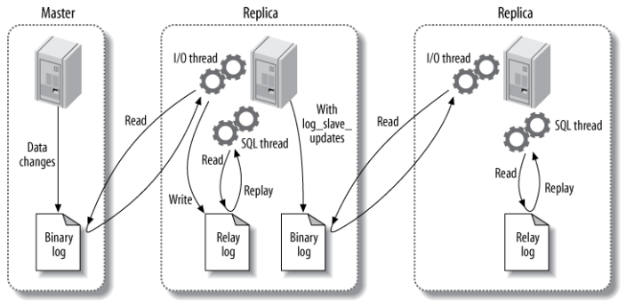
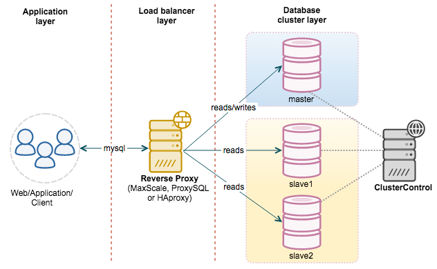
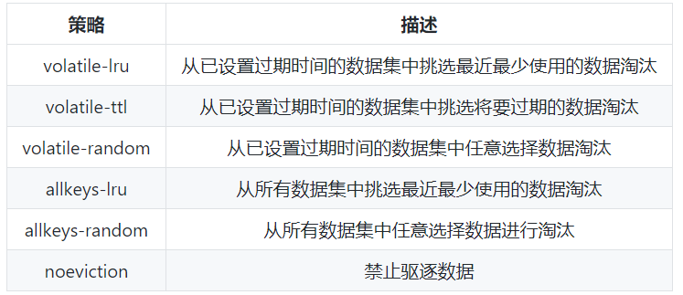
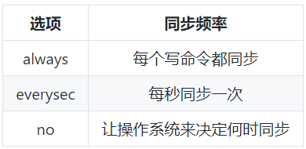

###### datetime:2022-03-08 17:19

###### author:nzb

# 技术面试必备基础知识

> [传送门](https://github.com/CyC2018/CS-Notes)

## 数据库

### [数据库系统原理](https://github.com/CyC2018/CS-Notes/blob/master/notes/%E6%95%B0%E6%8D%AE%E5%BA%93%E7%B3%BB%E7%BB%9F%E5%8E%9F%E7%90%86.md)

* [一、事务](https://github.com/CyC2018/CS-Notes/blob/master/notes/%E6%95%B0%E6%8D%AE%E5%BA%93%E7%B3%BB%E7%BB%9F%E5%8E%9F%E7%90%86.md#%E4%B8%80%E4%BA%8B%E5%8A%A1)

    * [概念](https://github.com/CyC2018/CS-Notes/blob/master/notes/%E6%95%B0%E6%8D%AE%E5%BA%93%E7%B3%BB%E7%BB%9F%E5%8E%9F%E7%90%86.md#%E6%A6%82%E5%BF%B5)

      `满足 ACID 特性的一组操作，可以通过 Commit 提交一个事务，也可以使用 Rollback 进行回滚。`

    * [ACID](https://github.com/CyC2018/CS-Notes/blob/master/notes/%E6%95%B0%E6%8D%AE%E5%BA%93%E7%B3%BB%E7%BB%9F%E5%8E%9F%E7%90%86.md#acid)

        * 1\. 原子性（Atomicity）

        * 2\. 一致性（Consistency）

        * 3\. 隔离性（Isolation）

        * 4\. 持久性（Durability）

    * [AUTOCOMMIT](https://github.com/CyC2018/CS-Notes/blob/master/notes/%E6%95%B0%E6%8D%AE%E5%BA%93%E7%B3%BB%E7%BB%9F%E5%8E%9F%E7%90%86.md#autocommit)

      `MySQL 默认采用自动提交模式。也就是说，如果不显式使用START TRANSACTION语句来开始一个事务，那么每个查询操作都会被当做一个事务并自动提交。`

* [二、并发一致性问题](https://github.com/CyC2018/CS-Notes/blob/master/notes/%E6%95%B0%E6%8D%AE%E5%BA%93%E7%B3%BB%E7%BB%9F%E5%8E%9F%E7%90%86.md#%E4%BA%8C%E5%B9%B6%E5%8F%91%E4%B8%80%E8%87%B4%E6%80%A7%E9%97%AE%E9%A2%98)

    * [丢失修改](https://github.com/CyC2018/CS-Notes/blob/master/notes/%E6%95%B0%E6%8D%AE%E5%BA%93%E7%B3%BB%E7%BB%9F%E5%8E%9F%E7%90%86.md#%E4%B8%A2%E5%A4%B1%E4%BF%AE%E6%94%B9)

    * [读脏数据](https://github.com/CyC2018/CS-Notes/blob/master/notes/%E6%95%B0%E6%8D%AE%E5%BA%93%E7%B3%BB%E7%BB%9F%E5%8E%9F%E7%90%86.md#%E8%AF%BB%E8%84%8F%E6%95%B0%E6%8D%AE)

    * [不可重复读](https://github.com/CyC2018/CS-Notes/blob/master/notes/%E6%95%B0%E6%8D%AE%E5%BA%93%E7%B3%BB%E7%BB%9F%E5%8E%9F%E7%90%86.md#%E4%B8%8D%E5%8F%AF%E9%87%8D%E5%A4%8D%E8%AF%BB)

    * [幻影读](https://github.com/CyC2018/CS-Notes/blob/master/notes/%E6%95%B0%E6%8D%AE%E5%BA%93%E7%B3%BB%E7%BB%9F%E5%8E%9F%E7%90%86.md#%E5%B9%BB%E5%BD%B1%E8%AF%BB)

* [三、封锁](https://github.com/CyC2018/CS-Notes/blob/master/notes/%E6%95%B0%E6%8D%AE%E5%BA%93%E7%B3%BB%E7%BB%9F%E5%8E%9F%E7%90%86.md#%E4%B8%89%E5%B0%81%E9%94%81)

    * [封锁粒度](https://github.com/CyC2018/CS-Notes/blob/master/notes/%E6%95%B0%E6%8D%AE%E5%BA%93%E7%B3%BB%E7%BB%9F%E5%8E%9F%E7%90%86.md#%E5%B0%81%E9%94%81%E7%B2%92%E5%BA%A6)

        * MySQL 中提供了两种封锁粒度：行级锁以及表级锁。

        * 应该尽量只锁定需要修改的那部分数据，而不是所有的资源。锁定的数据量越少，发生锁争用的可能就越小，系统的并发程度就越高。

        * 但是加锁需要消耗资源，锁的各种操作（包括获取锁、释放锁、以及检查锁状态）都会增加系统开销。因此封锁粒度越小，系统开销就越大。

        * 在选择封锁粒度时，需要在锁开销和并发程度之间做一个权衡。

    * [封锁类型](https://github.com/CyC2018/CS-Notes/blob/master/notes/%E6%95%B0%E6%8D%AE%E5%BA%93%E7%B3%BB%E7%BB%9F%E5%8E%9F%E7%90%86.md#%E5%B0%81%E9%94%81%E7%B1%BB%E5%9E%8B)

        * 1\. 读写锁

            * 互斥锁（Exclusive），简写为 X 锁，又称写锁。

            * 共享锁（Shared），简写为 S 锁，又称读锁。

            * 有以下两个规定：

                * 一个事务对数据对象 A 加了 X 锁，就可以对 A 进行读取和更新。加锁期间其它事务不能对 A 加任何锁。

                * 一个事务对数据对象 A 加了 S 锁，可以对 A 进行读取操作，但是不能进行更新操作。加锁期间其它事务能对 A 加 S 锁，但是不能加 X 锁。

        * 2\. 意向锁

    * [封锁协议](https://github.com/CyC2018/CS-Notes/blob/master/notes/%E6%95%B0%E6%8D%AE%E5%BA%93%E7%B3%BB%E7%BB%9F%E5%8E%9F%E7%90%86.md#%E5%B0%81%E9%94%81%E5%8D%8F%E8%AE%AE)

        * 1\. 三级封锁协议

            * 一级封锁协议

              `事务 T 要修改数据 A 时必须加 X 锁，直到 T 结束才释放锁。 解决丢失修改问题。 因为不能同时有两个事务对同一个数据进行修改，那么事务的修改就不会被覆盖。`

            * 二级封锁协议

              `在一级的基础上，要求读取数据 A 时必须加 S 锁，读取完马上释放 S 锁。 解决读脏数据问题。 因为如果一个事务在对数据 A 进行修改，根据 1 级封锁协议，会加 X 锁，那么就不能再加 S 锁了，也就是不会读入数据。`

            * 三级封锁协议

              `在二级的基础上，要求读取数据 A 时必须加 S 锁，直到事务结束了才能释放 S 锁。 解决不可重复读的问题。 因为读 A 时，其它事务不能对 A 加 X 锁，从而避免了在读的期间数据发生改变。`

        * 2\. 两段锁协议

    * [MySQL 隐式与显示锁定](https://github.com/CyC2018/CS-Notes/blob/master/notes/%E6%95%B0%E6%8D%AE%E5%BA%93%E7%B3%BB%E7%BB%9F%E5%8E%9F%E7%90%86.md#mysql-%E9%9A%90%E5%BC%8F%E4%B8%8E%E6%98%BE%E7%A4%BA%E9%94%81%E5%AE%9A)

        * MySQL 的 InnoDB 存储引擎采用两段锁协议，会根据隔离级别在需要的时候自动加锁，并且所有的锁都是在同一时刻被释放，这被称为隐式锁定。

        * InnoDB 也可以使用特定的语句进行显示锁定：

            * SELECT ... LOCK In SHARE MODE;

              `加 S 锁`

            * SELECT ... FOR UPDATE;

              `加 X 锁`

* [四、隔离级别](https://github.com/CyC2018/CS-Notes/blob/master/notes/%E6%95%B0%E6%8D%AE%E5%BA%93%E7%B3%BB%E7%BB%9F%E5%8E%9F%E7%90%86.md#%E5%9B%9B%E9%9A%94%E7%A6%BB%E7%BA%A7%E5%88%AB)

    * [未提交读（READ UNCOMMITTED）](https://github.com/CyC2018/CS-Notes/blob/master/notes/%E6%95%B0%E6%8D%AE%E5%BA%93%E7%B3%BB%E7%BB%9F%E5%8E%9F%E7%90%86.md#%E6%9C%AA%E6%8F%90%E4%BA%A4%E8%AF%BBread-uncommitted)

      `事务中的修改，即使没有提交，对其它事务也是可见的。`

    * [提交读（READ COMMITTED）](https://github.com/CyC2018/CS-Notes/blob/master/notes/%E6%95%B0%E6%8D%AE%E5%BA%93%E7%B3%BB%E7%BB%9F%E5%8E%9F%E7%90%86.md#%E6%8F%90%E4%BA%A4%E8%AF%BBread-committed)

      `一个事务只能读取已经提交的事务所做的修改。换句话说，一个事务所做的修改在提交之前对其它事务是不可见的。`

    * [可重复读（REPEATABLE READ）](https://github.com/CyC2018/CS-Notes/blob/master/notes/%E6%95%B0%E6%8D%AE%E5%BA%93%E7%B3%BB%E7%BB%9F%E5%8E%9F%E7%90%86.md#%E5%8F%AF%E9%87%8D%E5%A4%8D%E8%AF%BBrepeatable-read)

      `保证在同一个事务中多次读取同一数据的结果是一样的。`

    * [可串行化（SERIALIZABLE）](https://github.com/CyC2018/CS-Notes/blob/master/notes/%E6%95%B0%E6%8D%AE%E5%BA%93%E7%B3%BB%E7%BB%9F%E5%8E%9F%E7%90%86.md#%E5%8F%AF%E4%B8%B2%E8%A1%8C%E5%8C%96serializable)

      `强制事务串行执行，这样多个事务互不干扰，不会出现并发一致性问题。 该隔离级别需要加锁实现，因为要使用加锁机制保证同一时间只有一个事务执行，也就是保证事务串行执行。`

* [五、多版本并发控制](https://github.com/CyC2018/CS-Notes/blob/master/notes/%E6%95%B0%E6%8D%AE%E5%BA%93%E7%B3%BB%E7%BB%9F%E5%8E%9F%E7%90%86.md#%E4%BA%94%E5%A4%9A%E7%89%88%E6%9C%AC%E5%B9%B6%E5%8F%91%E6%8E%A7%E5%88%B6)

  `多版本并发控制（Multi-Version Concurrency Control, MVCC）是 MySQL 的 InnoDB 存储引擎实现隔离级别的一种具体方式，用于实现提交读和可重复读这两种隔离级别。而未提交读隔离级别总是读取最新的数据行，要求很低，无需使用 MVCC。可串行化隔离级别需要对所有读取的行都加锁，单纯使用 MVCC 无法实现。`

    * [基本思想](https://github.com/CyC2018/CS-Notes/blob/master/notes/%E6%95%B0%E6%8D%AE%E5%BA%93%E7%B3%BB%E7%BB%9F%E5%8E%9F%E7%90%86.md#%E5%9F%BA%E6%9C%AC%E6%80%9D%E6%83%B3)

    * [版本号](https://github.com/CyC2018/CS-Notes/blob/master/notes/%E6%95%B0%E6%8D%AE%E5%BA%93%E7%B3%BB%E7%BB%9F%E5%8E%9F%E7%90%86.md#%E7%89%88%E6%9C%AC%E5%8F%B7)

        * 系统版本号 SYS_ID：是一个递增的数字，每开始一个新的事务，系统版本号就会自动递增。

        * 事务版本号 TRX_ID ：事务开始时的系统版本号。

    * [Undo 日志](https://github.com/CyC2018/CS-Notes/blob/master/notes/%E6%95%B0%E6%8D%AE%E5%BA%93%E7%B3%BB%E7%BB%9F%E5%8E%9F%E7%90%86.md#undo-%E6%97%A5%E5%BF%97)

    * [ReadView](https://github.com/CyC2018/CS-Notes/blob/master/notes/%E6%95%B0%E6%8D%AE%E5%BA%93%E7%B3%BB%E7%BB%9F%E5%8E%9F%E7%90%86.md#readview)

    * [快照读与当前读](https://github.com/CyC2018/CS-Notes/blob/master/notes/%E6%95%B0%E6%8D%AE%E5%BA%93%E7%B3%BB%E7%BB%9F%E5%8E%9F%E7%90%86.md#%E5%BF%AB%E7%85%A7%E8%AF%BB%E4%B8%8E%E5%BD%93%E5%89%8D%E8%AF%BB)

        * 1\. 快照读

            * MVCC 的 SELECT 操作是快照中的数据，不需要进行加锁操作。

        * 2\. 当前读

            * MVCC 其它会对数据库进行修改的操作（INSERT、UPDATE、DELETE）需要进行加锁操作，从而读取最新的数据。可以看到 MVCC 并不是完全不用加锁，而只是避免了 SELECT 的加锁操作。

            * 在进行 SELECT 操作时，可以强制指定进行加锁操作。以下第一个语句需要加 S 锁，第二个需要加 X 锁。

                * SELECT * FROM table WHERE ? lock in share mode;

                * SELECT * FROM table WHERE ? for update;

* [六、Next-Key Locks](https://github.com/CyC2018/CS-Notes/blob/master/notes/%E6%95%B0%E6%8D%AE%E5%BA%93%E7%B3%BB%E7%BB%9F%E5%8E%9F%E7%90%86.md#%E5%85%ADnext-key-locks)

  `使用 MVCC + Next-Key Locks 可以解决幻读问题`

    * [Record Locks](https://github.com/CyC2018/CS-Notes/blob/master/notes/%E6%95%B0%E6%8D%AE%E5%BA%93%E7%B3%BB%E7%BB%9F%E5%8E%9F%E7%90%86.md#record-locks)

      `锁定一个记录上的索引，而不是记录本身。 如果表没有设置索引，InnoDB 会自动在主键上创建隐藏的聚簇索引，因此 Record Locks 依然可以使用。`

    * [Gap Locks](https://github.com/CyC2018/CS-Notes/blob/master/notes/%E6%95%B0%E6%8D%AE%E5%BA%93%E7%B3%BB%E7%BB%9F%E5%8E%9F%E7%90%86.md#gap-locks)

      `锁定索引之间的间隙，但是不包含索引本身。`

    * [Next-Key Locks](https://github.com/CyC2018/CS-Notes/blob/master/notes/%E6%95%B0%E6%8D%AE%E5%BA%93%E7%B3%BB%E7%BB%9F%E5%8E%9F%E7%90%86.md#next-key-locks)

      `它是 Record Locks 和 Gap Locks 的结合，不仅锁定一个记录上的索引，也锁定索引之间的间隙。它锁定一个前开后闭区间，例如一个索引包含以下值：10, 11, 13, and 20，那么就需要锁定以下区间： (-∞, 10] (10, 11] (11, 13] (13, 20] (20, +∞)`

* [七、关系数据库设计理论](https://github.com/CyC2018/CS-Notes/blob/master/notes/%E6%95%B0%E6%8D%AE%E5%BA%93%E7%B3%BB%E7%BB%9F%E5%8E%9F%E7%90%86.md#%E4%B8%83%E5%85%B3%E7%B3%BB%E6%95%B0%E6%8D%AE%E5%BA%93%E8%AE%BE%E8%AE%A1%E7%90%86%E8%AE%BA)

    * [函数依赖](https://github.com/CyC2018/CS-Notes/blob/master/notes/%E6%95%B0%E6%8D%AE%E5%BA%93%E7%B3%BB%E7%BB%9F%E5%8E%9F%E7%90%86.md#%E5%87%BD%E6%95%B0%E4%BE%9D%E8%B5%96)

    * [异常](https://github.com/CyC2018/CS-Notes/blob/master/notes/%E6%95%B0%E6%8D%AE%E5%BA%93%E7%B3%BB%E7%BB%9F%E5%8E%9F%E7%90%86.md#%E5%BC%82%E5%B8%B8)

    * [范式](https://github.com/CyC2018/CS-Notes/blob/master/notes/%E6%95%B0%E6%8D%AE%E5%BA%93%E7%B3%BB%E7%BB%9F%E5%8E%9F%E7%90%86.md#%E8%8C%83%E5%BC%8F)

* [八、ER 图](https://github.com/CyC2018/CS-Notes/blob/master/notes/%E6%95%B0%E6%8D%AE%E5%BA%93%E7%B3%BB%E7%BB%9F%E5%8E%9F%E7%90%86.md#%E5%85%ABer-%E5%9B%BE)

    * [实体的三种联系](https://github.com/CyC2018/CS-Notes/blob/master/notes/%E6%95%B0%E6%8D%AE%E5%BA%93%E7%B3%BB%E7%BB%9F%E5%8E%9F%E7%90%86.md#%E5%AE%9E%E4%BD%93%E7%9A%84%E4%B8%89%E7%A7%8D%E8%81%94%E7%B3%BB)

      `三个组成部分：实体、属性、联系`

        * 包含一对一，一对多，多对多三种。

        * 如果 A 到 B 是一对多关系，那么画个带箭头的线段指向 B；

        * 如果是一对一，画两个带箭头的线段；

        * 如果是多对多，画两个不带箭头的线段。

    * [表示出现多次的关系](https://github.com/CyC2018/CS-Notes/blob/master/notes/%E6%95%B0%E6%8D%AE%E5%BA%93%E7%B3%BB%E7%BB%9F%E5%8E%9F%E7%90%86.md#%E8%A1%A8%E7%A4%BA%E5%87%BA%E7%8E%B0%E5%A4%9A%E6%AC%A1%E7%9A%84%E5%85%B3%E7%B3%BB)

    * [联系的多向性](https://github.com/CyC2018/CS-Notes/blob/master/notes/%E6%95%B0%E6%8D%AE%E5%BA%93%E7%B3%BB%E7%BB%9F%E5%8E%9F%E7%90%86.md#%E8%81%94%E7%B3%BB%E7%9A%84%E5%A4%9A%E5%90%91%E6%80%A7)

    * [表示子类](https://github.com/CyC2018/CS-Notes/blob/master/notes/%E6%95%B0%E6%8D%AE%E5%BA%93%E7%B3%BB%E7%BB%9F%E5%8E%9F%E7%90%86.md#%E8%A1%A8%E7%A4%BA%E5%AD%90%E7%B1%BB)

      `用一个三角形和两条线来连接类和子类，与子类有关的属性和联系都连到子类上，而与父类和子类都有关的连到父类上。`

### [SQL 语法](https://github.com/CyC2018/CS-Notes/blob/master/notes/SQL%20%E8%AF%AD%E6%B3%95.md)

### [SQL 练习](https://github.com/CyC2018/CS-Notes/blob/master/notes/SQL%20%E7%BB%83%E4%B9%A0.md)

### [MySQL](https://github.com/CyC2018/CS-Notes/blob/master/notes/MySQL.md)

* [一、索引](https://github.com/CyC2018/CS-Notes/blob/master/notes/MySQL.md#%E4%B8%80%E7%B4%A2%E5%BC%95)

    * [B+ Tree 原理](https://github.com/CyC2018/CS-Notes/blob/master/notes/MySQL.md#b-tree-%E5%8E%9F%E7%90%86)

    * [MySQL 索引](https://github.com/CyC2018/CS-Notes/blob/master/notes/MySQL.md#mysql-%E7%B4%A2%E5%BC%95)

        * 1\. B+Tree 索引

          `是大多数 MySQL 存储引擎的默认索引类型。 因为不再需要进行全表扫描，只需要对树进行搜索即可，所以查找速度快很多。 因为 B+ Tree 的有序性，所以除了用于查找，还可以用于排序和分组。`

            * InnoDB 的 B+Tree 索引分为主索引和辅助索引。主索引的叶子节点 data 域记录着完整的数据记录，这种索引方式被称为聚簇索引。因为无法把数据行存放在两个不同的地方，所以一个表只能有一个聚簇索引。

            * 辅助索引的叶子节点的 data 域记录着主键的值，因此在使用辅助索引进行查找时，需要先查找到主键值，然后再到主索引中进行查找。

        * 2\. 哈希索引

            * 哈希索引能以 O(1) 时间进行查找，但是失去了有序性：

                * 无法用于排序与分组；

                * 只支持精确查找，无法用于部分查找和范围查找。

            * InnoDB 存储引擎有一个特殊的功能叫“自适应哈希索引”，当某个索引值被使用的非常频繁时，会在 B+Tree 索引之上再创建一个哈希索引，这样就让 B+Tree 索引具有哈希索引的一些优点，比如快速的哈希查找。

        * 3\. 全文索引

            * MyISAM 存储引擎支持全文索引，用于查找文本中的关键词，而不是直接比较是否相等。

            * 查找条件使用 MATCH AGAINST，而不是普通的 WHERE。

            * 全文索引使用倒排索引实现，它记录着关键词到其所在文档的映射。

            * InnoDB 存储引擎在 MySQL 5.6.4 版本中也开始支持全文索引。

        * 4\. 空间数据索引

            * MyISAM 存储引擎支持空间数据索引（R-Tree），可以用于地理数据存储。空间数据索引会从所有维度来索引数据，可以有效地使用任意维度来进行组合查询。

            * 必须使用 GIS 相关的函数来维护数据。

    * [索引优化](https://github.com/CyC2018/CS-Notes/blob/master/notes/MySQL.md#%E7%B4%A2%E5%BC%95%E4%BC%98%E5%8C%96)

        * 1\. 独立的列

            * 在进行查询时，索引列不能是表达式的一部分，也不能是函数的参数，否则无法使用索引。

            * 例如下面的查询不能使用 actor_id 列的索引：

                ```sql
                    SELECT actor_id FROM sakila.actor WHERE actor_id + 1 = 5;
                ```

        * 2\. 联合索引（多列索引）

            * 在需要使用多个列作为条件进行查询时，使用多列索引比使用多个单列索引性能更好。例如下面的语句中，最好把 actor_id 和 film_id 设置为多列索引。

                ```sql
                    SELECT film_id, actor_ id FROM sakila.film_actorWHERE actor_id = 1 AND film_id = 1;
                ```

        * 3\. 索引列的顺序

            * 让选择性最强的索引列放在前面。

            * 索引的选择性是指：不重复的索引值和记录总数的比值。最大值为 1，此时每个记录都有唯一的索引与其对应。选择性越高，每个记录的区分度越高，查询效率也越高。

            * 例如下面显示的结果中 customer_id 的选择性比 staff_id 更高，因此最好把 customer_id 列放在多列索引的前面。

                ```sql
                    SELECT COUNT(DISTINCT staff_id)/COUNT(*) AS staff_id_selectivity, COUNT(DISTINCT customer_id)/COUNT(*) AS customer_id_selectivity, COUNT(*) FROM payment; 
                    
                    staff_id_selectivity: 0.0001 
                    customer_id_selectivity: 0.0373 
                    COUNT(*): 16049
                ```

        * 4\. 前缀索引

            * 对于 BLOB、TEXT 和 VARCHAR 类型的列，必须使用前缀索引，只索引开始的部分字符。

            * 前缀长度的选取需要根据索引选择性来确定。

        * 5\. 覆盖索引

            * 索引包含所有需要查询的字段的值。

                * 具有以下优点：

                    * 索引通常远小于数据行的大小，只读取索引能大大减少数据访问量。

                    * 一些存储引擎（例如 MyISAM）在内存中只缓存索引，而数据依赖于操作系统来缓存。因此，只访问索引可以不使用系统调用（通常比较费时）。

                    * 对于 InnoDB 引擎，若辅助索引能够覆盖查询，则无需访问主索引。

    * [索引的优点](https://github.com/CyC2018/CS-Notes/blob/master/notes/MySQL.md#%E7%B4%A2%E5%BC%95%E7%9A%84%E4%BC%98%E7%82%B9)

        * 大大减少了服务器需要扫描的数据行数。

        * 帮助服务器避免进行排序和分组，以及避免创建临时表（B+Tree 索引是有序的，可以用于 ORDER BY 和 GROUP BY 操作。临时表主要是在排序和分组过程中创建，不需要排序和分组，也就不需要创建临时表）。

        * 将随机 I/O 变为顺序 I/O（B+Tree 索引是有序的，会将相邻的数据都存储在一起）。

    * [索引的使用条件](https://github.com/CyC2018/CS-Notes/blob/master/notes/MySQL.md#%E7%B4%A2%E5%BC%95%E7%9A%84%E4%BD%BF%E7%94%A8%E6%9D%A1%E4%BB%B6)

        * 对于非常小的表、大部分情况下简单的全表扫描比建立索引更高效；

        * 对于中到大型的表，索引就非常有效；

        * 但是对于特大型的表，建立和维护索引的代价将会随之增长。这种情况下，需要用到一种技术可以直接区分出需要查询的一组数据，而不是一条记录一条记录地匹配，例如可以使用分区技术。

    * 索引失效

        * 没有遵循最左匹配原则。

          `键前缀查找只适用于最左前缀查找。如果不是按照索引列的顺序进行查找，则无法使用索引。`

        * 一些关键字会导致索引失效，例如 or， ！= ， not in，is null ,is not unll like查询是以%开头 隐式转换会导致索引失效。

        * 索引列是表达式的一部分，或者是函数的参数

* [二、查询性能优化](https://github.com/CyC2018/CS-Notes/blob/master/notes/MySQL.md#%E4%BA%8C%E6%9F%A5%E8%AF%A2%E6%80%A7%E8%83%BD%E4%BC%98%E5%8C%96)

    * [使用 Explain 进行分析](https://github.com/CyC2018/CS-Notes/blob/master/notes/MySQL.md#%E4%BD%BF%E7%94%A8-explain-%E8%BF%9B%E8%A1%8C%E5%88%86%E6%9E%90)

        * Explain 用来分析 SELECT 查询语句，开发人员可以通过分析 Explain 结果来优化查询语句。

        * 比较重要的字段有：

            * select_type : 查询类型，有简单查询、联合查询、子查询等

            * key : 使用的索引

            * rows : 扫描的行数

    * [优化数据访问](https://github.com/CyC2018/CS-Notes/blob/master/notes/MySQL.md#%E4%BC%98%E5%8C%96%E6%95%B0%E6%8D%AE%E8%AE%BF%E9%97%AE)

        * 1\. 减少请求的数据量

            * 只返回必要的列：最好不要使用 SELECT * 语句。

            * 只返回必要的行：使用 LIMIT 语句来限制返回的数据。

            * 缓存重复查询的数据：使用缓存可以避免在数据库中进行查询，特别在要查询的数据经常被重复查询时，缓存带来的查询性能提升将会是非常明显的。

        * 2\. 减少服务器端扫描的行数

            * 最有效的方式是使用索引来覆盖查询。

    * [重构查询方式](https://github.com/CyC2018/CS-Notes/blob/master/notes/MySQL.md#%E9%87%8D%E6%9E%84%E6%9F%A5%E8%AF%A2%E6%96%B9%E5%BC%8F)

        * 1\. 切分大查询

            * 一个大查询如果一次性执行的话，可能一次锁住很多数据、占满整个事务日志、耗尽系统资源、阻塞很多小的但重要的查询。
                ```sql
                DELETE FROM messages WHERE create < DATE_SUB(NOW(), INTERVAL 3 MONTH); 
                rows_affected = 0 
                do {
                  rows_affected = do_query( 
                    "DELETE FROM messages WHERE create < DATE_SUB(NOW(), INTERVAL 3 MONTH) LIMIT 10000") 
                } while rows_affected > 0 
                ```

        * 2\. 分解大连接查询

            * 将一个大连接查询分解成对每一个表进行一次单表查询，然后在应用程序中进行关联，这样做的好处有：

                * 让缓存更高效。对于连接查询，如果其中一个表发生变化，那么整个查询缓存就无法使用。而分解后的多个查询，即使其中一个表发生变化，对其它表的查询缓存依然可以使用。

                * 分解成多个单表查询，这些单表查询的缓存结果更可能被其它查询使用到，从而减少冗余记录的查询。

                * 减少锁竞争；

                * 在应用层进行连接，可以更容易对数据库进行拆分，从而更容易做到高性能和可伸缩。

                * 查询本身效率也可能会有所提升。例如下面的例子中，使用 IN() 代替连接查询，可以让 MySQL 按照 ID 顺序进行查询，这可能比随机的连接要更高效。

                ```sql
                    SELECT * FROM tag JOIN tag_post ON tag_post.tag_id=[tag.id](http://tag.id/)
                                      JOIN post ON tag_post.post_id=[post.id](http://post.id/) WHERE tag.tag='mysql'; 
                    
                    SELECT * FROM tag WHERE tag='mysql'; 
                    SELECT * FROM tag_post WHERE tag_id=1234; 
                    SELECT * FROM post WHERE [post.id](http://post.id/) IN
                                      (123,456,567,9098,8904);
                ```

* [三、存储引擎](https://github.com/CyC2018/CS-Notes/blob/master/notes/MySQL.md#%E4%B8%89%E5%AD%98%E5%82%A8%E5%BC%95%E6%93%8E)

    * [InnoDB](https://github.com/CyC2018/CS-Notes/blob/master/notes/MySQL.md#innodb)

    * [MyISAM](https://github.com/CyC2018/CS-Notes/blob/master/notes/MySQL.md#myisam)

    * [比较](https://github.com/CyC2018/CS-Notes/blob/master/notes/MySQL.md#%E6%AF%94%E8%BE%83)

        * 事务：InnoDB 是事务型的，可以使用 Commit 和 Rollback 语句。

        * 并发：MyISAM 只支持表级锁，而 InnoDB 还支持行级锁。

        * 外键：InnoDB 支持外键。

        * 备份：InnoDB 支持在线热备份。

        * 崩溃恢复：MyISAM 崩溃后发生损坏的概率比 InnoDB 高很多，而且恢复的速度也更慢。

        * 其它特性：MyISAM 支持压缩表和空间数据索引。

* [四、数据类型](https://github.com/CyC2018/CS-Notes/blob/master/notes/MySQL.md#%E5%9B%9B%E6%95%B0%E6%8D%AE%E7%B1%BB%E5%9E%8B)

    * [整型](https://github.com/CyC2018/CS-Notes/blob/master/notes/MySQL.md#%E6%95%B4%E5%9E%8B)

    * [浮点数](https://github.com/CyC2018/CS-Notes/blob/master/notes/MySQL.md#%E6%B5%AE%E7%82%B9%E6%95%B0)

    * [字符串](https://github.com/CyC2018/CS-Notes/blob/master/notes/MySQL.md#%E5%AD%97%E7%AC%A6%E4%B8%B2)

    * [时间和日期](https://github.com/CyC2018/CS-Notes/blob/master/notes/MySQL.md#%E6%97%B6%E9%97%B4%E5%92%8C%E6%97%A5%E6%9C%9F)

* [五、切分](https://github.com/CyC2018/CS-Notes/blob/master/notes/MySQL.md#%E4%BA%94%E5%88%87%E5%88%86)

    * [水平切分](https://github.com/CyC2018/CS-Notes/blob/master/notes/MySQL.md#%E6%B0%B4%E5%B9%B3%E5%88%87%E5%88%86)

        * 水平切分又称为 Sharding，它是将同一个表中的记录拆分到多个结构相同的表中。

        * 当一个表的数据不断增多时，Sharding 是必然的选择，它可以将数据分布到集群的不同节点上，从而减缓单个数据库的压力。

    * [垂直切分](https://github.com/CyC2018/CS-Notes/blob/master/notes/MySQL.md#%E5%9E%82%E7%9B%B4%E5%88%87%E5%88%86)

        * 垂直切分是将一张表按列切分成多个表，通常是按照列的关系密集程度进行切分，也可以利用垂直切分将经常被使用的列和不经常被使用的列切分到不同的表中。

        * 在数据库的层面使用垂直切分将按数据库中表的密集程度部署到不同的库中，例如将原来的电商数据库垂直切分成商品数据库、用户数据库等。

    * [Sharding 策略](https://github.com/CyC2018/CS-Notes/blob/master/notes/MySQL.md#sharding-%E7%AD%96%E7%95%A5)

        * 哈希取模：hash(key) % N；

        * 范围：可以是 ID 范围也可以是时间范围；

        * 映射表：使用单独的一个数据库来存储映射关系。

    * [Sharding 存在的问题](https://github.com/CyC2018/CS-Notes/blob/master/notes/MySQL.md#sharding-%E5%AD%98%E5%9C%A8%E7%9A%84%E9%97%AE%E9%A2%98)

        * 1\. 事务问题

            * 使用分布式事务来解决，比如 XA 接口。

        * 2\. 连接

            * 可以将原来的连接分解成多个单表查询，然后在用户程序中进行连接。

        * 3\. ID 唯一性

            * 使用全局唯一 ID（GUID）

            * 为每个分片指定一个 ID 范围

            * 分布式 ID 生成器 (如 Twitter 的 Snowflake 算法)

* [六、复制](https://github.com/CyC2018/CS-Notes/blob/master/notes/MySQL.md#%E5%85%AD%E5%A4%8D%E5%88%B6)

    * [主从复制](https://github.com/CyC2018/CS-Notes/blob/master/notes/MySQL.md#%E4%B8%BB%E4%BB%8E%E5%A4%8D%E5%88%B6)

        * 主要涉及三个线程：binlog 线程、I/O 线程和 SQL 线程。

            * **binlog 线程** ：负责将主服务器上的数据更改写入二进制日志（Binary log）中。

            * **I/O 线程** ：负责从主服务器上读取二进制日志，并写入从服务器的中继日志（Relay log）。

            * **SQL 线程** ：负责读取中继日志，解析出主服务器已经执行的数据更改并在从服务器中重放（Replay）。

            * 

    * [读写分离](https://github.com/CyC2018/CS-Notes/blob/master/notes/MySQL.md#%E8%AF%BB%E5%86%99%E5%88%86%E7%A6%BB)

        * 主服务器处理写操作以及实时性要求比较高的读操作，而从服务器处理读操作。

        * 读写分离能提高性能的原因在于：

            * 主从服务器负责各自的读和写，极大程度缓解了锁的争用；

            * 从服务器可以使用 MyISAM，提升查询性能以及节约系统开销；

            * 增加冗余，提高可用性。

        * 读写分离常用代理方式来实现，代理服务器接收应用层传来的读写请求，然后决定转发到哪个服务器。

        * 

* [参考资料](https://github.com/CyC2018/CS-Notes/blob/master/notes/MySQL.md#%E5%8F%82%E8%80%83%E8%B5%84%E6%96%99)

### [Redis](https://github.com/CyC2018/CS-Notes/blob/master/notes/Redis.md)

* [一、概述](https://github.com/CyC2018/CS-Notes/blob/master/notes/Redis.md#%E4%B8%80%E6%A6%82%E8%BF%B0)

    * Redis 是速度非常快的非关系型（NoSQL）内存键值数据库，可以存储键和五种不同类型的值之间的映射。

    * **键的类型只能为字符串，值支持五种数据类型：字符串、列表、集合、散列表、有序集合**。

    * Redis 支持很多特性，例如将内存中的数据持久化到硬盘中，使用复制来扩展读性能，使用分片来扩展写性能。

* [二、数据类型](https://github.com/CyC2018/CS-Notes/blob/master/notes/Redis.md#%E4%BA%8C%E6%95%B0%E6%8D%AE%E7%B1%BB%E5%9E%8B)

    * [STRING](https://github.com/CyC2018/CS-Notes/blob/master/notes/Redis.md#string)

        - set
        - get
        - del

    * [LIST](https://github.com/CyC2018/CS-Notes/blob/master/notes/Redis.md#list)

        - rpush
        - lrange list-key 0 -1 lindex list-key 1
        - lpop

    * [SET](https://github.com/CyC2018/CS-Notes/blob/master/notes/Redis.md#set)

        - sadd
        - smembers
        - sismember
        - srem

    * [HASH](https://github.com/CyC2018/CS-Notes/blob/master/notes/Redis.md#hash)

        - hset hash-key sub-key1 value1
        - hgetall
        - hdel hash-key sub-key2
        - hget hash-key sub-key1

    * [ZSET](https://github.com/CyC2018/CS-Notes/blob/master/notes/Redis.md#zset)

        - zadd zset-key 728 member1
        - zrange zset-key 0 -1 withscores
        - zrangebyscore zset- key 0 800 withscores
        - zrem

* [三、数据结构](https://github.com/CyC2018/CS-Notes/blob/master/notes/Redis.md#%E4%B8%89%E6%95%B0%E6%8D%AE%E7%BB%93%E6%9E%84)

    * [字典](https://github.com/CyC2018/CS-Notes/blob/master/notes/Redis.md#%E5%AD%97%E5%85%B8)
      `dictht 是一个散列表结构，使用拉链法解决哈希冲突。`

    * [跳跃表](https://github.com/CyC2018/CS-Notes/blob/master/notes/Redis.md#%E8%B7%B3%E8%B7%83%E8%A1%A8)

        * 是有序集合的底层实现之一。

        * 跳跃表是基于多指针有序链表实现的，可以看成多个有序链表。

        * 与红黑树等平衡树相比，跳跃表具有以下优点：

            * 插入速度非常快速，因为不需要进行旋转等操作来维护平衡性；

            * 更容易实现；

            * 支持无锁操作。

* [四、使用场景](https://github.com/CyC2018/CS-Notes/blob/master/notes/Redis.md#%E5%9B%9B%E4%BD%BF%E7%94%A8%E5%9C%BA%E6%99%AF)

    * [计数器](https://github.com/CyC2018/CS-Notes/blob/master/notes/Redis.md#%E8%AE%A1%E6%95%B0%E5%99%A8)

        * 可以对 String 进行自增自减运算，从而实现计数器功能。

        * Redis 这种内存型数据库的读写性能非常高，很适合存储频繁读写的计数量。

    * [缓存](https://github.com/CyC2018/CS-Notes/blob/master/notes/Redis.md#%E7%BC%93%E5%AD%98)

        * 将热点数据放到内存中，设置内存的最大使用量以及淘汰策略来保证缓存的命中率。

    * [查找表](https://github.com/CyC2018/CS-Notes/blob/master/notes/Redis.md#%E6%9F%A5%E6%89%BE%E8%A1%A8)

        * 查找表和缓存类似，也是利用了 Redis 快速的查找特性。但是查找表的内容不能失效，而缓存的内容可以失效，因为缓存不作为可靠的数据来源。

        * 例如 DNS 记录就很适合使用 Redis 进行存储。

    * [消息队列](https://github.com/CyC2018/CS-Notes/blob/master/notes/Redis.md#%E6%B6%88%E6%81%AF%E9%98%9F%E5%88%97)

        * List 是一个双向链表，可以通过 lpush 和 rpop 写入和读取消息

        * 不过最好使用 Kafka、RabbitMQ 等消息中间件。

    * [会话缓存](https://github.com/CyC2018/CS-Notes/blob/master/notes/Redis.md#%E4%BC%9A%E8%AF%9D%E7%BC%93%E5%AD%98)

        * 可以使用 Redis 来统一存储多台应用服务器的会话信息。

        * 当应用服务器不再存储用户的会话信息，也就不再具有状态，一个用户可以请求任意一个应用服务器，从而更容易实现高可用性以及可伸缩性。

    * [分布式锁实现](https://github.com/CyC2018/CS-Notes/blob/master/notes/Redis.md#%E5%88%86%E5%B8%83%E5%BC%8F%E9%94%81%E5%AE%9E%E7%8E%B0)

        * 在分布式场景下，无法使用单机环境下的锁来对多个节点上的进程进行同步。

        * 可以使用 Redis 自带的 SETNX 命令实现分布式锁，除此之外，还可以使用官方提供的 RedLock 分布式锁实现。

    * [其它](https://github.com/CyC2018/CS-Notes/blob/master/notes/Redis.md#%E5%85%B6%E5%AE%83)

        * Set 可以实现交集、并集等操作，从而实现共同好友等功能。

        * ZSet 可以实现有序性操作，从而实现排行榜等功能。

* [五、Redis 与 Memcached](https://github.com/CyC2018/CS-Notes/blob/master/notes/Redis.md#%E4%BA%94redis-%E4%B8%8E-memcached)

    * [数据类型](https://github.com/CyC2018/CS-Notes/blob/master/notes/Redis.md#%E6%95%B0%E6%8D%AE%E7%B1%BB%E5%9E%8B)

      `Memcached 仅支持字符串类型，而 Redis 支持五种不同的数据类型，可以更灵活地解决问题。`

    * [数据持久化](https://github.com/CyC2018/CS-Notes/blob/master/notes/Redis.md#%E6%95%B0%E6%8D%AE%E6%8C%81%E4%B9%85%E5%8C%96)

      `Redis 支持两种持久化策略：RDB 快照和 AOF 日志，而 Memcached 不支持持久化。`

    * [分布式](https://github.com/CyC2018/CS-Notes/blob/master/notes/Redis.md#%E5%88%86%E5%B8%83%E5%BC%8F)

        * Memcached 不支持分布式，只能通过在客户端使用一致性哈希来实现分布式存储，这种方式在存储和查询时都需要先在客户端计算一次数据所在的节点。

        * Redis Cluster 实现了分布式的支持。

    * [内存管理机制](https://github.com/CyC2018/CS-Notes/blob/master/notes/Redis.md#%E5%86%85%E5%AD%98%E7%AE%A1%E7%90%86%E6%9C%BA%E5%88%B6)

        * 在 Redis 中，并不是所有数据都一直存储在内存中，可以将一些很久没用的 value 交换到磁盘，而 Memcached 的数据则会一直在内存中。

        * Memcached 将内存分割成特定长度的块来存储数据，以完全解决内存碎片的问题。但是这种方式会使得内存的利用率不高，例如块的大小为 128 bytes，只存储 100 bytes 的数据，那么剩下的 28 bytes
          就浪费掉了。

* [六、键的过期时间](https://github.com/CyC2018/CS-Notes/blob/master/notes/Redis.md#%E5%85%AD%E9%94%AE%E7%9A%84%E8%BF%87%E6%9C%9F%E6%97%B6%E9%97%B4)

    * Redis 可以为每个键设置过期时间，当键过期时，会自动删除该键。

    * 对于散列表这种容器，只能为整个键设置过期时间（整个散列表），而不能为键里面的单个元素设置过期时间。

* [七、数据淘汰策略](https://github.com/CyC2018/CS-Notes/blob/master/notes/Redis.md#%E4%B8%83%E6%95%B0%E6%8D%AE%E6%B7%98%E6%B1%B0%E7%AD%96%E7%95%A5)

    * 可以设置内存最大使用量，当内存使用量超出时，会施行数据淘汰策略。

    * Redis 具体有 6 种淘汰策略：

        * 

    * 作为内存数据库，出于对性能和内存消耗的考虑，Redis 的淘汰算法实际实现上并非针对所有 key，而是抽样一小部分并且从中选出被淘汰的 key。

    * 使用 Redis 缓存数据时，为了提高缓存命中率，需要保证缓存数据都是热点数据。可以将内存最大使用量设置为热点数据占用的内存量，然后启用 allkeys-lru 淘汰策略，将最近最少使用的数据淘汰。

    * Redis 4.0 引入了 volatile-lfu 和 allkeys-lfu 淘汰策略，LFU 策略通过统计访问频率，将访问频率最少的键值对淘汰。

* [八、持久化](https://github.com/CyC2018/CS-Notes/blob/master/notes/Redis.md#%E5%85%AB%E6%8C%81%E4%B9%85%E5%8C%96)

  `Redis 是内存型数据库，为了保证数据在断电后不会丢失，需要将内存中的数据持久化到硬盘上。`

    * [RDB 持久化](https://github.com/CyC2018/CS-Notes/blob/master/notes/Redis.md#rdb-%E6%8C%81%E4%B9%85%E5%8C%96)

        * 将某个时间点的所有数据都存放到硬盘上。

        * 可以将快照复制到其它服务器从而创建具有相同数据的服务器副本。

        * 如果系统发生故障，将会丢失最后一次创建快照之后的数据。

        * 如果数据量很大，保存快照的时间会很长。

    * [AOF 持久化](https://github.com/CyC2018/CS-Notes/blob/master/notes/Redis.md#aof-%E6%8C%81%E4%B9%85%E5%8C%96)

        * 将写命令添加到 AOF 文件（Append Only File）的末尾。

        * 使用 AOF 持久化需要设置同步选项，从而确保写命令同步到磁盘文件上的时机。这是因为对文件进行写入并不会马上将内容同步到磁盘上，而是先存储到缓冲区，然后由操作系统决定什么时候同步到磁盘。有以下同步选项：

            * 
            * always 选项会严重减低服务器的性能；

            * everysec 选项比较合适，可以保证系统崩溃时只会丢失一秒左右的数据，并且 Redis 每秒执行一次同步对服务器性能几乎没有任何影响；

            * no 选项并不能给服务器性能带来多大的提升，而且也会增加系统崩溃时数据丢失的数量。

        * 随着服务器写请求的增多，AOF 文件会越来越大。Redis 提供了一种将 AOF 重写的特性，能够去除 AOF 文件中的冗余写命令。

* [九、事务](https://github.com/CyC2018/CS-Notes/blob/master/notes/Redis.md#%E4%B9%9D%E4%BA%8B%E5%8A%A1)

    * 一个事务包含了多个命令，服务器在执行事务期间，不会改去执行其它客户端的命令请求。

    * 事务中的多个命令被一次性发送给服务器，而不是一条一条发送，这种方式被称为流水线，它可以减少客户端与服务器之间的网络通信次数从而提升性能。

    * Redis 最简单的事务实现方式是使用 MULTI 和 EXEC 命令将事务操作包围起来。

* [十、事件](https://github.com/CyC2018/CS-Notes/blob/master/notes/Redis.md#%E5%8D%81%E4%BA%8B%E4%BB%B6)

  `Redis 服务器是一个事件驱动程序。`

    * [文件事件](https://github.com/CyC2018/CS-Notes/blob/master/notes/Redis.md#%E6%96%87%E4%BB%B6%E4%BA%8B%E4%BB%B6)

    * [时间事件](https://github.com/CyC2018/CS-Notes/blob/master/notes/Redis.md#%E6%97%B6%E9%97%B4%E4%BA%8B%E4%BB%B6)

    * [事件的调度与执行](https://github.com/CyC2018/CS-Notes/blob/master/notes/Redis.md#%E4%BA%8B%E4%BB%B6%E7%9A%84%E8%B0%83%E5%BA%A6%E4%B8%8E%E6%89%A7%E8%A1%8C)

* [十一、复制](https://github.com/CyC2018/CS-Notes/blob/master/notes/Redis.md#%E5%8D%81%E4%B8%80%E5%A4%8D%E5%88%B6)

    * [连接过程](https://github.com/CyC2018/CS-Notes/blob/master/notes/Redis.md#%E8%BF%9E%E6%8E%A5%E8%BF%87%E7%A8%8B)

    * [主从链](https://github.com/CyC2018/CS-Notes/blob/master/notes/Redis.md#%E4%B8%BB%E4%BB%8E%E9%93%BE)

* [十二、Sentinel](https://github.com/CyC2018/CS-Notes/blob/master/notes/Redis.md#%E5%8D%81%E4%BA%8Csentinel)

  `Sentinel（哨兵）可以监听集群中的服务器，并在主服务器进入下线状态时，自动从从服务器中选举出新的主服务器。`

* [十三、分片](https://github.com/CyC2018/CS-Notes/blob/master/notes/Redis.md#%E5%8D%81%E4%B8%89%E5%88%86%E7%89%87)

    * 分片是将数据划分为多个部分的方法，可以将数据存储到多台机器里面，这种方法在解决某些问题时可以获得线性级别的性能提升。

    * 假设有 4 个 Redis 实例 R0，R1，R2，R3，还有很多表示用户的键 user:1，user:2，... ，有不同的方式来选择一个指定的键存储在哪个实例中。

        * 最简单的方式是范围分片，例如用户 id 从 0~1000 的存储到实例 R0 中，用户 id 从 1001~2000 的存储到实例 R1 中，等等。但是这样需要维护一张映射范围表，维护操作代价很高。

        * 还有一种方式是哈希分片，使用 CRC32 哈希函数将键转换为一个数字，再对实例数量求模就能知道应该存储的实例。

    * 根据执行分片的位置，可以分为三种分片方式：

        * 客户端分片：客户端使用一致性哈希等算法决定键应当分布到哪个节点。

        * 代理分片：将客户端请求发送到代理上，由代理转发请求到正确的节点上。

        * 服务器分片：Redis Cluster。

* [十四、一个简单的论坛系统分析](https://github.com/CyC2018/CS-Notes/blob/master/notes/Redis.md#%E5%8D%81%E5%9B%9B%E4%B8%80%E4%B8%AA%E7%AE%80%E5%8D%95%E7%9A%84%E8%AE%BA%E5%9D%9B%E7%B3%BB%E7%BB%9F%E5%88%86%E6%9E%90)

    * [文章信息](https://github.com/CyC2018/CS-Notes/blob/master/notes/Redis.md#%E6%96%87%E7%AB%A0%E4%BF%A1%E6%81%AF)

    * [点赞功能](https://github.com/CyC2018/CS-Notes/blob/master/notes/Redis.md#%E7%82%B9%E8%B5%9E%E5%8A%9F%E8%83%BD)

    * [对文章进行排序](https://github.com/CyC2018/CS-Notes/blob/master/notes/Redis.md#%E5%AF%B9%E6%96%87%E7%AB%A0%E8%BF%9B%E8%A1%8C%E6%8E%92%E5%BA%8F)
