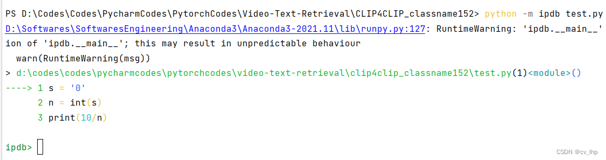
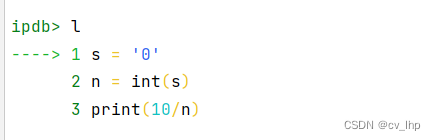
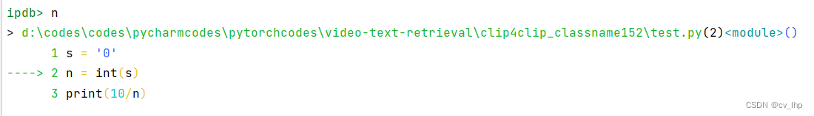
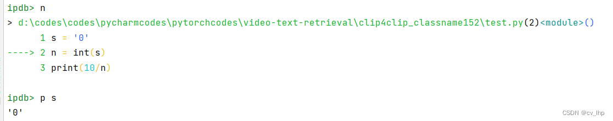
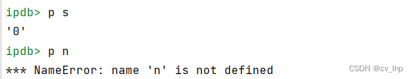
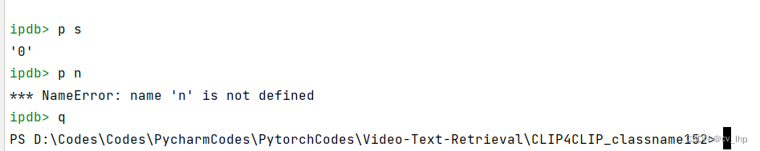
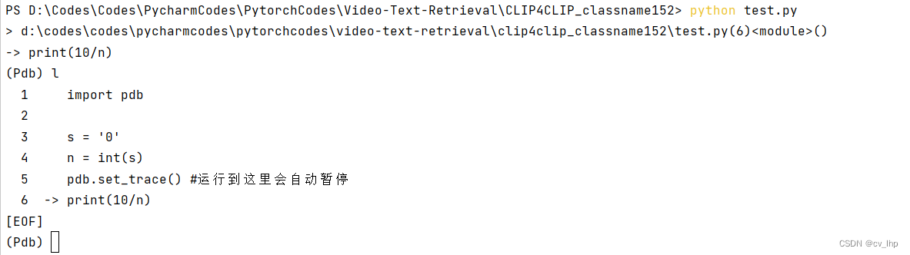

###### datetime:2024-10-23 10:55:00

###### author:nzb

# python调试器 ipdb

## 1. 介绍

Pdb是一个交互式的调试工具，集成于Python标准库中

Pdb能让你根据需求跳转到任意的Python代码断点、查看任意变量、单步执行代码，甚至还能修改变量的值，而不必重启程序

⚠️pdb 调试有个明显的缺陷就是对于多线程，远程调试等支持得不够好，同时没有较为直观的界面显示，不太适合大型的 python 项目。

而在较大的 python 项目中，这些调试需求比较常见，因此需要使用更为高级的调试工具，如PyCharm IDE。

手册：https://docs.python.org/3.5/library/pdb.html#pdbcommand-where

pdb的使用方式和ipdb是一样的（ipdb是增强版的pdb）

### 1.1 常用调试方式

- 用眼睛直接看代码出错在哪里
- `print/logging` 大法好
- `Pycharm` 专业的 IDE 断点调试
- `pdb/ipdb`，好处是可以在终端和服务器上使用，调试期间可以使用 `pdb` 各种命令和 `python` 自带的 `print, pprint, vars, dir, locals()` 等辅助调试

### 1.2 安装 ipdb

```bash
pip install ipdb
```

## 2. 用法

pdb有2种用法：

2.1、非侵入式方法（不用额外修改源代码，在命令行下直接运行就能调试，建议这样用哦）

```bash
python3 -m pdb filename.py
```

注意：**-m**参数，这样调用 **filename.py** 的话断点就是程序的执行第一行之前，然后再使用调试命令进行程序调试

2.2、侵入式方法（需要在被调试的代码中添加一行代码然后再正常运行代码）

```bash
import pdb;
pdb.set_trace()
```

当你在命令行看到下面这个提示符时，说明已经正确打开了pdb

```bash
(Pdb)
```

## 3. 命令

现在你已经进入了单步执行模式，然后就可以开始输入pdb命令了，下面是pdb的常用命令：

### 3.1、查看源代码

- `l`
  - `l`是`list`的缩写：默认查看当前位置前后11行源代码（多次会翻页）
  - 当前位置在代码中会用`–>`这个符号标出来

- `l start,end`
  - 查看第start到end行的代码，指定具体的范围
  - 例如：`l 1,18 : list 1,18`的缩写，查看第1行到18行的代码

- `ll`：查看当前函数或框架的所有源代码

### 3.2、添加断点

```bash
b
b line_no
b file_name:line_no 
b function_name
```

- 参数：
  - filename文件名，断点添加到哪个文件，如test.py
  - lineno断点添加到哪一行
  - function：函数名，在该函数执行的第一行设置断点
- 重点注意第3行，表示在脚本filename的line_no行添加断点。
- 但其实第2行更实用。
- 说明：
  - 不带参数表示查看断点设置
  - 带参则在指定位置设置一个断点

### 3.3 添加临时断点

```bash
tbreak
tbreak lineno
tbreak filename:lineno
tbreak functionname
```

- 参数：
  - 同b命令的参数
- 说明：
  - 执行一次后时自动删除（这就是它被称为临时断点的原因）

### 3.4 清除断点

- 命令1：
```bash
cl
cl filename:lineno
cl bpnumber [bpnumber ...]
```

- 参数：
  - bpnumber 断点序号（多个以空格分隔）
- 说明：
  - 1.不带参数用于清除所有断点，会提示确认（包括临时断点）
  - 2.带参数则清除指定文件行或当前文件指定序号的断点

- 命令2：`disable/enable`：禁用/激活断点

### 3.5、打印变量值

- `p expression`
  - 参数：
    - expression：Python表达式
    - 注意，也可以直接使用变量名直接打印出来，除了这些变量名与ipdb的命令名一样时，可以使用 p 来把变量名打印出来

### 3.6、逐行调试命令

包括 s ，n ， r 这3个相似的命令，区别在如何对待函数上

- `s`：step的缩写，能进入函数内部，执行下一行（能够进入函数体）
- `n`：next的缩写，执行下一步;如果当前语句有一个函数调用，用 n 是不会进入被调用的函数体中的，执行下一行（不会进入函数体）
- `r`：return的缩写，继续运行，直到函数返回，结束该函数的运算，执行当前运行函数到结束

### 3.7、非逐行调试命令

- `c`：持续执行下去，直到遇到一个断点
- `unt lineno`：持续执行直到运行到指定行（或遇到断点）
- `j lineno`：
  - 说明：
    - 让程序跳转到指定的行数 ，能够跳过中间某些行代码的执行。
    - 注意：但是必须跳转到的地方在当前的代码块中
### 3.8 跳出函数，跳入函数
- `u`: up的缩写，跳回上一层（函数）的调用
- `d`: down的缩写，跳回之前调用到的下一层的位置（跟up命令搭配使用）
### 3.9、查看当前函数所有参数

`a`：args 的缩写，在函数中时打印函数的参数和参数的值。

### 3.10 打印变量的值

`p` 或 `pp expression`: 打印变量的值，两者的不同是p用的是print()，pp用的是pprint()

### 3.11、打印变量类型

`whatis expression`：打印表达式的类型，常用来打印变量值类型

### 3.12、启动交互式解释器

`interact`：启动一个python的交互式解释器，使用当前代码的全局命名空间（使用ctrl+d（或者ctrl+z）返回pdb）

### 3.13、打印堆栈信息

`w`：where的缩写，打印堆栈信息，最新的帧在最底部。箭头表示当前帧。

### 3.14、退出pdb

`q或者exit(),quit`

### 3.15 注意

- 直接输入Enter，会执行上一条命令；
- 输入PDB不认识的命令，PDB会把他当做Python语句在当前环境下执行；
- h(elp)能够查看调试命令的用法，比如h h可以查看h(elp)命令的用法，h jump能够查看j(ump)命令的用法


### 3.16 程序运行中退出`pdb.set_trace()（撤销pdb.set_trace()）`

程序中设置了pdb.set_trace（）作为断点，运行程序时可以取消pdb.set_trace（），命令如下：

```python
pdb.set_trace = lambda: None
```

## 4. 实例

- test.py
```python
s = '0'
n = int(s)
print(10/n)
```

```shell
python -m pdb test.py
```



pdb定位到下一步要执行的代码-----> s = ‘0’,

输入命令l，就是命令l(list)来查看前后上下文10行代码：



输入命令n可以单步执行代码：



还可以输入p 变量名来查看变量：



但是这个变量所在的代码必须是运行过之后才能查看，否则，会出现找不到变量的情况，如下：



运行test.py到第二行代码 n = int(s) 这行代码实际还未执行。此时查看变量n会提示找不到变量。

输入命令q结束调试，退出程序：



## 5. 第二种方法（侵入式调试）

pdb单步执行太麻烦了，所以第二种方法是import pdb 之后，直接在代码里需要调试的地方放一个pdb.set_trace()，就可以设置一个断点。

程序会在pdb.set_trace()暂停并进入pdb debug调试环境，在该模式中，我们可使用调试命令，如next或缩写n实现单步执行；也可以查看Python变量，或是运行Python代码。

如果Python变量名和调试命令冲突，需在变量名前加！或者 p 以及 pp ，这样ipdb会执行对应的Python命令，而不是pdb调试命令。

上面的方式虽然简单，但是存在着两个较为比较明显的问题：

- 插入的断点代码会污染原来的代码空间
- 每次插入断点都需要修改源码

修改下上面的实例如下，import pdb, 添加了pdb.set_trace()到可能出错的代码前面：

- test.py
```python
import pdb

s = '0'
n = int(s)
pdb.set_trace() #运行到这里会自动暂停
print(10/n)
```

运行之后，程序到断点的下一行代码就暂停了，如下图所示：



## 6. 总结

在pytorch中使用ipdb可以对程序实现单步调试等，使用命令pip install ipdb安装即可。
在需要调试的代码前面加上ipdb.set_trace()即可，当程序运行到这一步的时候，自动进入调试模式或者在命令行加上-m pdb，例如采用next或者缩写n进行单步执行，如果程序中有跟调试相冲的变量名，在前面加！即可或者加上p或pp都行。

下面说下ipdb的两大功能：

- 查看：查看函数的局部变量。
- 修改：修改程序中的变量，并影响后面程序的运行结果。

常用的调试命令：

- n：单步执行。
- s：step，如果当前行为函数，进入函数内部。
- u：up，返回上一层，即跳出函数外部，回到还未执行s这一步（还没有进入函数内部）
- d：down，跳回之前调用到的下一层的位置（跟up成对使用，up跳出函数内部，down恢复到函数内部已经运行过的位置）
- r：return，继续运行直到函数返回。
- 查看变量名：当需要查看某个变量的时候，直接输入变量名，如果跟调试命令重复，使用！+变量名或者p（pp）+变量名
- c：continue，继续运行，直到遇到下一个断点。
- q：quit，退出调试。
- j 跳过中间某些代码的执行。

ipdb使用的小技巧：
  - tab键：自动补齐。

此外，可以在pytorch中查看神经网络的各个层的输出，以及分析各个参数的梯度，动态修改pytorch的训练流程（不建议动态修改模型网络结构）。

程序运行一段时间后，可以通过touch/tmp/debug创建debug标识文件，当程序检测到这个文件的存在时，就会自动进入debug模式，退出则可以直接使用quit即可，程序结束后可以删除该文件。（未使用，不清楚）

