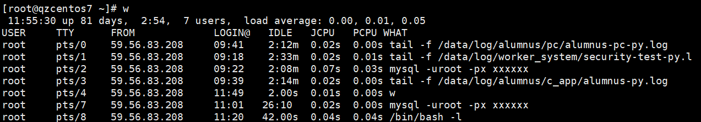
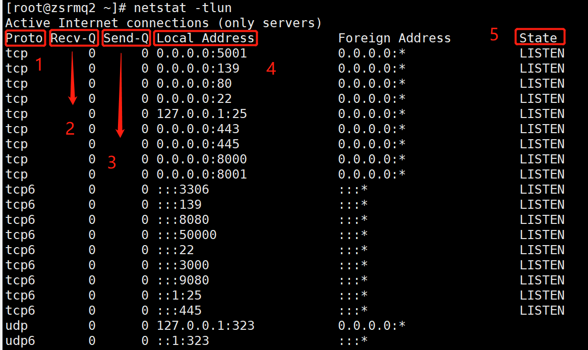
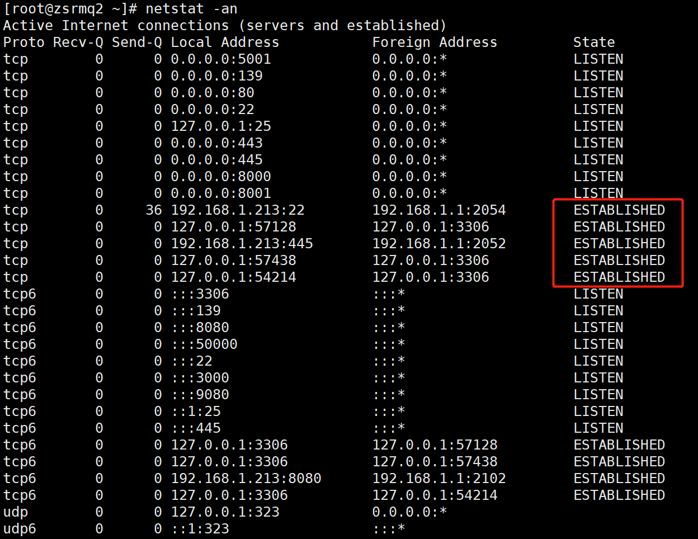

###### datetime:2022-01-08 14:34:00

###### author:nzb

## Linux常用命令

### 文件处理命令

* ls（list）

  `ls [参数] [路径]`

    * ls -l：查看文件所有属性

        * 

    * ls -d：查看目录本身（而不是查看目录下的信息）

    * ls -i：查看文件的inode号

    * ls -h：人性化显示（文件大小以K, M显示）

    * ls -s：显示文件占用的块的数量

    * ls -a：查看隐藏文件

* mkdir（make directories）  
  `创建目录：mkdir [参数] [目录]`

    * mkdir -p：递归创建目录

* cd（change directories）

  `切换目录：cd [路径]`

* pwd（print work directories）

  `查看完整工作路径`

* rmdir （remove empty directories）

  `删除空目录：rmdir [目录名]`

* cp（copy）

  `复制文件或目录：cp -rp [原文件或目录] [目标目录]`

    * cp -r：复制目录

    * cp -p：原文件和新文件属性完全一致

    * 注：复制的同时可以改名

* mv（move）

  `剪切文件、改名：mv [原文件或目录] [目标目录]`

    *  注：移动的同时可以改名

* rm（remove）

  `删除文件或目录：rm -rf [文件或目录]`

    * rm -r：文件夹递归删除（删除目录）

    * rm -f：强制删除，不询问

    * 注：

        * 删除之前做好备份

        * 误删除之后对硬盘少做读写操作

* touch

  `创建空文件：touch [文件名]`

* cat

  `显示文件内容：cat [文件名]`

    * cat -n：显示行号

* tac

  `显示文件内容（反向查看）：tac[文件名]`

* more

  `分页显示文件：空格翻页，回车换行，q退出 查看命令帮助信息时就是使用more来查看`

* less

  `分页显示文件（可向上翻页）：空格翻页，回车换行，q退出，还可以pageup回翻页，上箭头网上翻一行，还可以搜索：/关 键词，再按n搜索下一个匹配的`

* head

  `显示文件前面几行：head [参数] [文件名]`

    * head -m：指定看前几行，默认前10行

* tail

  `显示文件后面几行：tail [参数] [文件名]`

    * tail -n：指定看后几行，默认后10行

    * tail -f：动态看文件动态变化

* ln（link）

  `生成链接文件：ln [原文件] [目标文件]`

    * ln -s：生成软链接

        * 软连接特征：类似Windows快捷方式

            * lrwxrwxrwx：软连接的权限不起作用，还是要看源文件权限

            * 文件大小：很小，只是符号链接

            * 箭头指向源文件

        * 什么时候需要用到软连接？Windows时你什么时候需要用到快捷方式时就用

    * ln：生成硬链接

        * 硬链接特征

            * 拷贝cp -p + 同步更新：cp -p的区别是硬链接文件和原文件可以同步更新

            * 硬链接通过inode号来区分

            * 不能跨分区

            * 不能针对目录

    * 硬链接和软连接的区别

        * 1.硬链接不能跨分区

        * 2.硬链接不能针对目录

### 权限管理命令

* chmod（change the permissions mode of a life）

  `改变文件或目录权限：chmod [参数] [文件或目录]`

    * chmod [u/g/o/a] [+/-/=] [r/w/x]

      `u：所有者；g：所属组；a：所有人；举例：chmod u+w；chmod u+x, o-wr`

    * chmod 三位数XXX：r—4，w—2，x—1：举例：rwxr-xr-x：755 （最常用）

    * chmod -R：递归修改目录及目录下的权限

* 注释：**深入理解文件的wrx和目录的wrx的意义**

`删除一个文件的权限不是对这个文件有写权限，而是对这个文件的目录有写权限 一个目录往往都是同时有r和x权限，可进入目录和查看目录下的文件`

* 

* chown（change file ownership）

  `改变文件或目录所有者：chown [用户名] [文件或目录]：只有管理员root能执行 例：chown root:testgroup /test/`
* chgrp（change file group ownership）

  `改变文件或目录所属组：chgrp [组名] [文件或目录]：只有管理员root能执行`

    * 注：每个文件都只有一个user和一个group，某些others拥有拥有共同的权限，这些others在一个组里，也就是group所属组。所属者user可以不在所属组group里面，并且一个用户可以在不同的组里。 相关的命令是：

        * groupadd YYY //创建组

        * useradd -g YYY XXX //创建用户并将YYY设置为其主要组

        * usermod -g ZZZ XXX //修改用户XXX的主要组为ZZZ

* umask（the user file-creation mask）

  `显示、设置文件的缺省权限`

    * umask -S：人性化显示默认权限，以rwx形式显示新建文件缺省权限

    * umask：显示掩码（非人性化）

      比如：0022，权限 实际上为：777 - 022 = 755

    * 注：Linux中，默认创建的文件是没有可执行权限的（touch 创建的文件），所以文件是666，目录是777

    * umask 三位数：修改掩码，使默认权限变化  
      umask 023；中文修改户的掩码为0023，权限为：754，并不建议修改

### 文件搜索命令

> 尽量少搜索，特别是在高峰期时

* find

  `文件精准搜索：find [搜索范围] [匹配条件]`

    * find [搜索范围] -name：根据文件名搜索

    * find [搜索范围] -iname：根据文件名搜索，不区分大小写
        - 注：通配符：`*`，`？`，`[]`
            - `*`：匹配多个字符；举例：find /ete -name *init*（模糊搜索，包含即可）
            - `？`：匹配单个字符；举例：find /ete -name init???（搜索以init开头后面还有3个字符的文件）

        * find [搜索范围] -size [+/-]n：

            * +n：大于；

            * -n：小于，只有数据块（0.5KB）个数；

            * n：等于

        * find [搜索范围] -user：根据所有者查找

        * find [搜索范围] -group：根据所属组查找

        * find [搜索范围] -amin [-/+]分钟数：查找指定时间内或者超过该时间被修改过访问时间的文件(`access`)

        * find [搜索范围] -cmin [-/+]分钟数：查找指定时间内或者超过该时间被修改过文件属性的文件(`change`)

        * find [搜索范围] -mmin [-/+]分钟数：查找指定时间内或者超过该时间被修改过文件内容的文件(`modify`)

        * 还可以在两个查找条件之间加上

            * -a ：一个是同时满足(`and`)

            * -o ：一个是满足任意一个即可(`or`)

            * 或者-exec/-ok 命令 [空格] {} [空格] \； 对搜索结果执行操作

                - 示例：find ./ -name test.txt -exec ls -l {} \\;
                - -ok：是对后面的命令逐个询问

        * find [搜索范围] -type：根据文件类型查找

        * find [搜索范围] -inum：根据inode号查找

* locate

  `模糊查找：locate 文件名`

    * 系统里所有的文件都会定期收录到/var/lib/mlocate.db这个文件库里，locate就是在这个里去找，但是新的文件没别收录进去，所以就找不到，需要手动更新文件资料库updatedb （但是tmp目录下不收录进去）

    * locate -i：不区分大小写

* which

  `查找命令的地址和别名alias：which 命令名`

* whereis

  `查找命令地址和其帮助文档的位置：whereis 命令名`

* grep

  `在文件里面查找字串匹配的行并输出：grep [-iv] [指定字串] [文件]`

    * grep -i：不区分大小写，查找指定字串所在的行

    * grep -v：排除指定字串所在的行

    * 指定字串前面加个 ^ 表示以什么字串开头

### 帮助命令

* man （manual）或 info （information）

  `查看命令和配置文件的帮助信息，浏览和more操作一样：man 命令名/配置文件名`

    * 帮助类型里1是命令的帮助，5是配置文件的帮助

    * For Example：man 1 passwd，man 5 passwd

* whatis

  `更加简单的命令查询，查看命令作用`

* apropos

  `更加简单的配置文件查询`

* –-help

  `得到信息更加简单：命令 ––help`

* help

  `获得shell的内置命令的帮助，比如：cd，pwd，umask，if等`

### 用户管理命令

* useradd和passwd

  `新建用户和修改密码`

* who和w

  `查看当前登录用户名：tty是本地登录，pts表示远程登录 who简单信息 w`

  
    * 其中第一行：当前时间，已经运行的时间（服务器），多少个用户登录，服务器负载均衡（CPU，内存等负载情况）这行类型也可以 通过uptime获得

    * IDLE：表示用户空闲时间（多久没操作了）

    * JCPU：累计占用的CPU时间

    * PCPU ：当前用户登录后占用CPU的时间

    * WHAT：当前执行的操作

### 压缩解压命令

* 几种压缩格式

    * .gz

    * .zip

    * .bz2

* gzip（GNU zip）和 gunzip/gzip -d （GNU unzip）

  `压缩/解压文件：gzip/gunzip [文件]`

    * 解压缩：gunzip[文件] 或 gzip -d [文件]

    * 只能压缩文件，不能压缩目录，并且不保留原文件

    * 压缩文件后缀：.gz

* tar

  `打包目录：tar [选项] [压缩后文件名] [目录（可以多个空格隔开）]`

    * tar -c：打包

    * tar -x：解包

    * tar -v：显示详细信息

    * tar -f：指定文件名

    * tar -z：打包的同时压缩，或者解包的时候解压缩,适用于压缩解压gz

    * tar -j：同-z，适用于压缩解压bz2

    * 举例：tar -cvf XXX.tar YYY gzip XXX.tar ，最后生成XXX.tar.gz 。或者直接tar -zcvf打包压缩一部合成，反向是tar -zxvf

    * 压缩文件后缀：.tar.gz

* zip和unzip

  `压缩文件或目录：zip [选项] [压缩后文件名] [文件或目录]，压缩比不高`

    * 压缩后能保留原文件

    * zip -r：压缩目录

    * 压缩文件后缀：.zip

* bzip2和bunzip2

  `bzip2 /bunzip2 [选项] [文件]`

    * bzip2 -k：压缩的同时保留原文件

    * bunzip -k：解压的同时保留原文件

    * gzip的升级版本，压缩比较好

    * 用tar生成.tar.bz2文件：tar -cjf xxx.tar.bz2 xxx

    * 压缩文件后缀：.bz2

### 网络命令

* write

  `给在线用户发信息，以ctrl+D保存结束：write <用户名>`

* wall （write all）

  `给当前在线的所有用户发送信息：wall [信息内容]`

* ping

  `测试网络连通性：ping 选项 [IP地址]`

    * 网络踩点，Linux会一直ping下去

    * ping -c 次数：定义ping的次数

* ifconfig （interface configure）

  `查看当前系统网卡信息和设置网卡信息（临时的）：ifconfig 网卡名称 IP地址`

* mail

  `查看和发送邮件：mail [用户名]`

    * 不一定要在线

    * mail 用户名：发送

    * mail：查看的子命令：

        * q：退出

        * help(帮助)，

        * 数字(查看指定邮件)，

        * 列表：h(列表)，

        * 删除：d 数字(删)

* last

  `日志查询命令，统计系统的所有登录信息：`

* lastlog

  `查看用户最后登录的信息`

    * lastlog -u uid：查看指定用户上次登录的信息

* traceroute

  `跟踪节点的路径：traceroute ip地址`

* netstat

  `显示网络相关信息：netstat [选项]`

    * netstat -t：TCP协议（有3次握手）

    * netstat -u：UDP协议（无3次握手，快，但是不保证数据收到）

    * netstat -l：监听

    * netstat -r：路由

    * netstat -n：显示ip地址和端口号

    * 最常用的三种组合命令：

        * netstat -tlun：查看本机监听的端口

          
            * 1：标志协议：TCP/UDP

            * 2：数据包接收队列：0代表网络通畅，表示收到的数据已经在本地接收缓冲，但是还有多少没有被进程取走，`recv()`如果接收队列`Recv-Q`一直处于阻塞状态，可能是遭受了拒绝服务 `denial-of-service` 攻击。

            * 3：数据包发送队列：0代表网络通畅，对方没有收到的数据或者说没有`Ack`的,还是本地缓冲区. 如果发送队列`Send-Q`不能很快的清零，可能是有应用向外发送数据包过快，或者是对方接收数据包不够快。

            * 4：本机IP地址和端口（主要查看的内容）

            * 5：监测状态：TCP才有，UDP没有（你可以直接发送，不管在不在线，不需要监听）

        * netstat -an：查看本机所有的网络连接

          
            * 跟-tlun的区别是可以查看正在连接的服务

        * netstat -rn：查看本机路由表

* setup

  `redhat系linux独有`

    * 配置网络的工具：永久生效

    * 配置玩需要重启网络服务：service network restart

### 挂载命令

* mount

  `mount [-t 文件系统] 设备文件名 挂载点`

    * 举例：mount -t iso9660 /dev/sr0 /mnt/cdrom

        * /dev/sr0：设备文件名，系统默认的

* umount

  `卸载：umount 设备文件名`

### 关机重启命令

* shutdown

  `shutdown [选项] 时间`

    * shutdown -h 时间（new）：关机

    * shutdown -r 时间：重启

    * shutdown -c：取消前一个关机命令

    * 谨慎操作

* 其他关机命令：`halt`,`poweroff`,`init 0`

* 其他重启命令：`reboot`,`init 6`

* init

    * 系统运行级别：
        - 0：关机，
        - 1：单用户，
        - 2：不含NFS服务的多用户，
        - 3：完全多用户，
        - 4：未分配，
        - 5：图形界面，
        - 6：重启

    * `/etc/inittab`配置文件里面有运行级别的信息，方便查询，也可以改运行级别

    * init 数字：设置系统运行级别，临时更改

* runlevel：查询系统运行级别

* logout和exit

    * 都是退出登录：logout退出是把因为你注销了登陆机而把你踢出的退出，exit是你直接退出连接的机器。