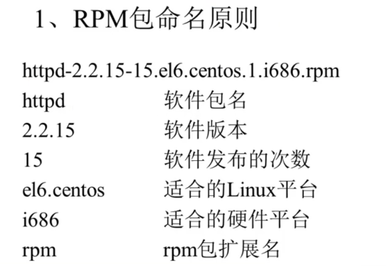
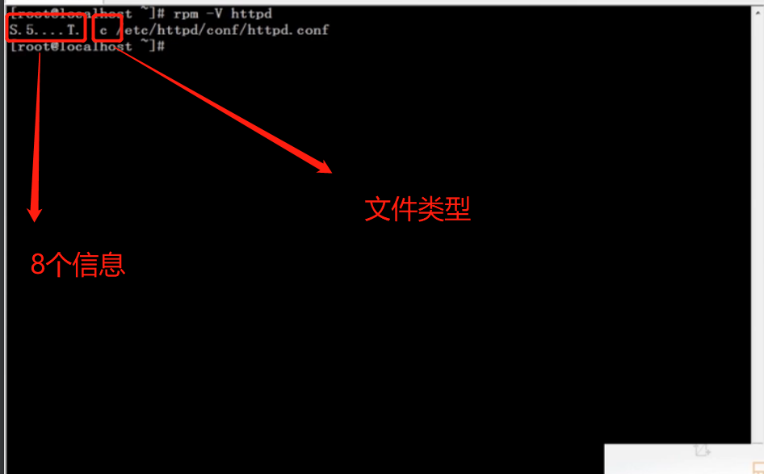
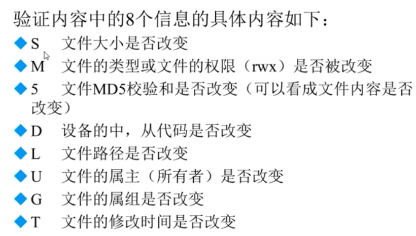
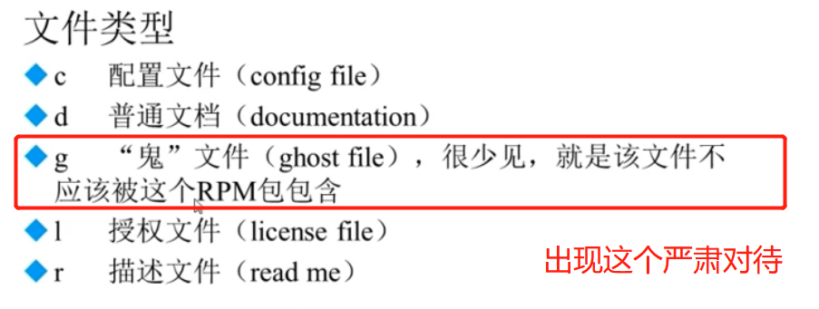

###### datetime:2022-01-08 14:34:00

###### author:nzb

## Linux软件包管理

### 软件包管理简介

*  软件包分类：

    * 源码包：包括脚本安装包

    * 二进制包：RPM包，系统默认包（ubuntu中是deb包），源码包编译后的包

    * 源码包的优点

        * 开源

        * 可以自由选择所需的功能

        * 软件是便宜安装，所以更加是个自己的系统，更加稳定也效率更高

        * 卸载方便（直接把目录删除）

    * 源码包的缺点

        * 安装步骤多

        * 编译并安装时间过长

        * 因为是编译安装，安装过程中一旦报错新手很难解决

    * RPM包优点

        * 包管理系统简单，只需要几个命令就可以实现软件包的安装，升级，查询和卸载

        * 安装速度比源码包快很多

    * RPM包缺点

        * 不能看见原代码

        * 功能选择不如源码包灵活

        * 依赖性

### RPM包管理

#### rpm命令管理

* RPM包名和包全名

* RPM包的依赖性：树形依赖，环形依赖，模块依赖(以.iso.数组结束的就是模块依赖，也叫库文件依赖模块依赖查询网站)

* 安装和升级使用包全名，卸载和查询使用包名（在/var/lib/rpm/中的数据库总搜索）

* RPM安装：rpm -ivh 包全名

    * -i（install）：安装

    * -v（verbose）：显示详细信息

    * -h（hash）：显示进度

    * \--nodeps：不检测依赖性（该选项不用）

* RPM升级：rpm -Uvh 包全名

    * -U（upgrade）：升级

* RPM卸载：rpm -e 包名,也要考虑依赖性，当有包被依赖时，此时这个包不能删掉

    * -e（erase）：卸载

* RPM查询包：`查询包还是用RPM，yum没有查询功能`

    * 查询包是否安装：rpm -q 包名

      `-q（query）`

    * 查询所有安装的包：rpm -qa

      `-a（all）`

    * RPM查询包详细信息：rpm -qi 包名

      `-i（information）`

    * RPM查询未安装包的详细信息：rpm -qip 包全名

      `-p（package）`

    * RPM查询文件安装位置：rpm -ql 包名

      `-l（list）`

    * RPM查询未安装包的文件安装的默认位置：rpm -qlp 包名

    * RPM查询系统文件属于哪个rpm包：rpm -qf 系统文件名

      `-f（file）`

    * RPM查询软件包的依赖性：rpm -qR 包名

      `-R（requires）`

    * RPM查询未安装软件包的依赖性：rpm -qRp 包全名

    * RPM包校验：rpm -V 包名

      `-V（verify）`

* RPM包中文件提取（用来修复系统）：

    * rpm2cpio 包全名 | cpio -idv . 包中的文件绝对路径

        * -i（copy-in模式）：还原

        * -d：还原时自动新建目录

        * -v：显示还原过程

#### yum在线管理

* 既可以用在线yum源文件服务器，也可以用本地光盘作为yum源文件服务器。

* 会自动解决依赖性问题

* 更换yum源：保存在/etc/yum.repos.d/目录下

* 查询：yum list

* 搜索：yum search 包名

* 安装：yum -y install 包名

  `-y（yes）`

* 升级：yum -y update 包名

  `yum -y update：不写包名，直接升级全部（包括Linux内核，远程升级了的话不能开机，需要本地配置文件），慎用`

* 卸载，会卸载所有依赖的包：yum -y remove 包名

    * Linux服务器应该采用最小化安装的原则，用什么装什么

    * 装完了最好不要用yum卸载，也不要随便升级

* yum的软件组管理：

    * 查询所有可用的软件组列表：yum grouplist

    * 安装指定软件组：yum groupinstall 软件包组名

    * 卸载指定软件组：yum groupremove 软件包组名

#### 用光盘做yum源：修改/etc/yum.repos.d/下的media配置文件，该源为关盘挂载点，注意：配置文件的格式要求很严格，注释应该顶头写。

### 源码包管理

* 区别：

    * 安装前的区别：概念上的区别，见上述

    * 安装后的区别：安装位置的区别

* RPM包（一个软件）的默认安装位置：

    * /etc/：配置文件

    * /usr/bin/：可执行的命令

    * /usr/lib/：程序所使用的函数库

    * /usr/share/doc/：基本的软件使用手册

    * /usr/share/man/：版主文档

    * /var/www/html/：服务器类软件的默认网页位置

* 源码包的安装位置：

    * 需要手动指定安装目录：一般推荐/usr/local/软件名/

* RPM包和源码包安装软件带来的影响：启动服务的方式不同

    * RPM包在/etc/rc.d/init.d/下有执行文件，采用两种方式启动：

        * /etc/rc.d/init.d/httpd start

        * service httpd start

    * 源码包的服务启动方式不能用系统服务管理命令例如service来管理

        * 只能在/usr/local/软件名/bin/执行软件码 start 目录下启动服务

* Apache源码包的具体安装步骤：

* 安装C语言编译器：gcc

* 下载apache的源码包：path

* 确认源码保存位置/usr/local/src/

* 确认软件安装位置：/usr/local/

* 如何确认安装过程报错`安装过程停止并出现error，warning，no等提示语言`

* 解压缩下载的源码包：tar -zxvf 源码包名

* 进入解压缩目录：INSTALL和README时安装说明和使用说明

* 执行./configure --prefix=默认安装目录：编译前准备

    * 定义需要的功能选项

    * 检测系统环境是否符合安装要求

    * 把定义好的的功能选项和检测系统环境的信息都写入Makefile文件（./configure过程会生成），用于后续的编译

* 执行make：编译

* 如果前两步报错，执行make clean，清空过程中生成的临时文件。

* 执行make install：安装

* 删除源码包安装的软件：直接rm -rf /usr/local/软件名/

### 脚本安装包与软件包管理

* 脚本安装包不是独立的软件包类型，常见安装的是源码包

* 人为包安装过程写成额自动安装的脚本，只要执行脚本，定义简单的参数，就可以完成安装

* 非常类似于windows下软件的安装方式

* Webmin是一个基于Web的Linux系统管理界面，可以通过图形化的方式设置用户账号、Apache、DNS、文件共享等服务。下载软件，下载后解压缩，并进入解压缩目录，执行.sh安装脚本,最后登录ip地址的自己配置的端口号进入该网站即可

### 如何选择包安装？

* 如果对外服务，选择源码包安装，例如：Apache

* 如果本机使用，RPM包安装，例如：gcc编译器