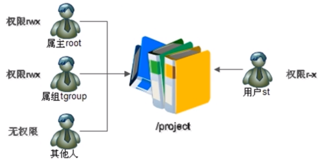
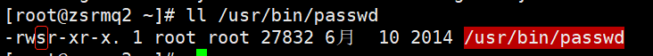
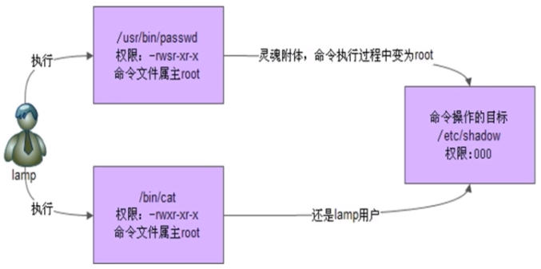

###### datetime:2022-01-08 14:34:00

###### author:nzb

## Linux权限管理

### ACL权限

* ACL权限的简介和开启方式

  

    * 任何一个文件在一个时刻只能有一个所有者和所属组

    * ACL权限用来解决文件的权限身份不够用的情况

    * ACL权限需要分区支持：

        * dumpe2fs -h /dev/sda5/ 查看是否支持acl选项，如果不支持。

          `/dev/sda5/ 为df -h 查看根分区对应的文件系统`

        * 可以临时开启：mount -o remount,acl /

          `重新挂载根分区，并挂载加入acl权限`

        * 或者永久开启：vim /etc/fstab，然后重启系统

          `在根分区的defaults后面加个：,act 慎用：任何错误都会导致挂载失败`

    * ACL权限类似于windows的权限设置方法，就是不考虑user，group和others的权限设置，单独添加一个用户或者一个用户组对一个文件或者目录的权限

* 查看与设定ACL权限

    * getfacl

      `查看ACL的权限：getfacle 文件名`

    * setfacl

      `设置ACL的权限：setfacl [选项 ] 文件名`

        * setfacl -m u/g/m：用户名/组名/不写权限 文件名：设定文件的ACL权限

            * setfacl -m u:用户名:权限 文件名：设定文件用户的ACL权限

              `为用户分配ACL权限，使用“u:用户名:权限”格式 例：setfacl -m u:user1:rwx /test/`

            * setfacl -m g:组名:不写权限 文件名：设定文件用户组的ACL权限

              `为组分配ACL权限，使用“g:组名:权限”格式`

        * setfacl -x ：删除指定的ACL权限

        * setfacl -b ：删除所有的ACL权限

        * setfacl -d ：设定默认ACL权限

        * setfacl -k ：删除默认ACL权限

        * setfacl -R ：递归设定ACL权限

* 最大有效权限与删除ACL权限

    * 最大有效权限mask：可以通过getfacl 文件名来查看ACL的权限，里面有mask，可以通过控制mask的值来修改默认最大有效权限。

    * 需要注意的是mask权限不会影响当前文件所有者，只会影响ACL权限和所属组的权限

    * setfacl -x u/g:用户名/组名 文件名：删除文件指定的ACL权限

    * setfacl -b 文件名：删除文件所有ACL权限

* 默认ACL和递归ACL权限（只能针对目录）

    * setfacl -m d:u/g: 用户名/组名:权限 文件名：设定父目录的默认ACL权限，父目录里所有的新建文件都会继承父目录的ACL权限

      `d参数就是设置默认的ACL权限`

    * setfacl -k：删除父目录的默认ACL权限

    * setfacl -m [选项] -R 文件名：递归设定文件夹的ACL权限

      `setfacl -m u:test:rx -R 文件名`

### 文件特殊权限

* SetUID：在所有者的x位置上变成了s  
  `针对二进制文件`
    * passwd命令拥有SetUID权限，所以普通用户能修改自己密码

      
      

    * 四个条件缺一不可：

        * 只有二进制文件（例如命令和脚本文件）才能设定SUID权限

        * 命令执行者必须对该程序有x权限

        * 命令执行者会在执行的时候获得该程序文件的属主身份

        * SUID权限只在该程序执行过程中生效，也就是身份改变旨在程序执行过程中有效

    * 我们通常会看到4777，2777，1777的权限标识，依次是加了SUID，SGID，SBIT权限

      `4代表SUID 2代表SGID 1代表SBIT`

    * 设定SetUID的方法

      `4代表SUID`

        * chmod 4755 文件名

        * chmod u+s 文件名

    * 取消SetUID的方法

        * chmod 755 文件名

        * chmod u-s 文件名

    * 可以用chmod来赋予和删除SUID

    * **SetUID是非常危险的，一个命令只要有了s权限，例如passwd命令，普通用户就可以通过执行这个命令获得passwd的属主身份，也就是进入root权限。**

      `比如：给vim加了SetUID后，普通用户就会有root权限，例如：修改/etc/passwd文件，非常危险。`

        * 关键目录应严格控制写权限（普通写权限，不是SetUID权限）。比如“/”、“/usr”等

        * 用户的密码设置要严格遵守密码三原则

        * 对系统中默认应该具有SetUID权限的文件作出备份，定时检查有没有这之外的文件被设置了SetUID权限

* SetGID：在所属组的x位置上变成了s

  `针对二进制文件和目录`

    * 针对二进制文件，四个条件缺一不可：

        * 只有可执行的二进制文件才能设置

        * 命令执行者必须对该程序有x权限

        * 命令执行者会在执行的时候获得该程序文件的所属组身份

        * SUID权限只在该程序执行过程中生效，也就是所属组身份改变旨在程序执行过程中有效

    * 注：例如/usr/bin/locate命令

    * 针对目录，三个条件缺一不可：

        * 普通用户必须对此目录拥有r和x权限，才能进入该目录

        * 普通用户在此目录中的有效组会变成此目录的所属组

        * 若普通用户对此目录拥有w权限时，新建的文件的默认组不是文件自己的初始组，而是这个目录自己的所属组

    * 可以用chmod来赋予和删除SGID

        * 设定SetGID的方法

          `2代表SGID`

            * chmod 2755 文件名/二进制文件

            * chmod g+s 文件名/二进制文件

        * 取消SetGID的方法

            * chmod 2755 文件名/二进制文件

            * chmod g-s 文件名/二进制文件

* Sticky BIT(黏着位)：在其他人的x位置上变成了t

  `针对目录`

    * 三个条件缺一不可：

        * 只有目录才能设定SBIT权限

        * 普通用户必须对该目录有x和w权限

        * 有了SBIT，普通用户即使有目录的w权限，也不能删除其他用户建立的文件

    * 设定SBIT的方法

      `1代表SBIT`

        * chmod 1755 文件名

        * chmod o+s 文件名

    * 取消SBIT的方法

        * chmod 1755 文件名

        * chmod o-s 文件名

* **需要注意的安全性**：

    * 需要定期对系统中含有SUID或者SGID权限的文件进行检查，如果有异常多出来的含有该权限的文件，如果多出来了，是一个极大的安全隐患，需要手工清除。

### 文件系统属性chattr权限

* chattr（change file attributes on a linux file system）

    * 格式：`chattr [+-=] [选项] 文件或目录名`

        * 符号

            * +：增加权限

            * -：删除权限

            * =：等于某权限

        * 选项

            * i：

                *  1.对文件：不允许任何用户（包括root用户）对文件进行任何修改，只能读

                *  2.对目录：任何用户（包括root用户）只能在目录下修改文件内容，但是不能删除和创建文件

            * a：

                *  1.对文件：任何用户（包括root用户）只能对文件增加数据，但是不能删除和修改现有数据

                *  2.对目录：任何用户（包括root用户）只能在目录中建立和修改文件里的内容，但是不能删除文件

* lsattr

  `查看文件系统属性：lsattr 选项 文件名`

    *  lsattr -a 文件名：显示所有文件和目录

    *  lsattr -d 文件名：若文件时目录，仅列出目录自己的属性

### 系统命令sudo权限

* 之前学的是对文件的操作权限，sudo是对系统命令的权限。

* sudo权限是root把本来只能超级用户执行的命令赋予普通用户的执行

* root权限先执行命令visudo命令

  `实际修改的是：/etc/sudoers文件`

* 在这一行root ALL=(ALL) ALL下面添加

    * root ALL=(ALL) ALL

      `给用户`

        * 格式：用户名 被管理主机的地址 = （可使用的身份）授权命令（绝对路径）

        * 第一个ALL：允许在命令在哪台计算机上执行

        * 第二个ALL：把前面的用户转变成这个身份，一般不用

        * 第三个ALL：所有命令，应该写具体权限

    * %wheel ALL=(ALL) ALL

      `给组`

        * %组名 被管理主机的地址=（可使用的身份）授权命令 （绝对路径）

    * 例如：jack ALL=/sbin/shutdown -r now：授权jack能重启服务器的权限

* sudo -l：`查看自己能用那些sudo命令`

* sudo：`执行sudo命令：sudo [绝对路径命令]`

* **注意：vim命令不用设置sudo给普通用户，否则会拥有root的所有权限，非常危险**