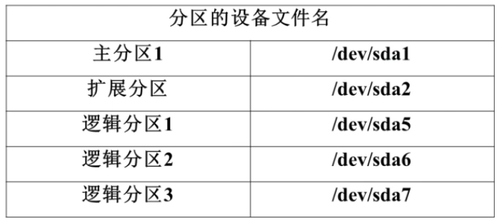
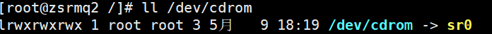

###### datetime:2022-01-08 14:34:00

###### author:nzb

## Linux的文件系统管理

### 分区和系统文件

#### 分区类型

* 对于硬盘分区形式是MBR的

    * 分区图

    * 一：

      
      
    * 二：

      
        * 规定了：1、2、3、4只能分配给主分区（主分区最多4个），所以逻辑分区从5开始

            * 

    * 主分区：总共最多只能分4个

    * 扩展分区：
      `包含逻辑分区`

        * 只能有一个

        * 也算作主分区的一种

        * 主分区+扩展分区<=4个

        * 不能存储数据和格式化

        * 必须再分成逻辑分区才能使用

            * 如果是IDE硬盘，Linux最多支持59个逻辑分区

            * 如果是SCSI硬盘，Linux最多支持11个逻辑分区

* 对于GPT分区形式而言，没有上述限制

#### 文件系统

* Linux的文件系统可分为

    * ext2：是ext文件系统的升级版本，最大支持16TB的分区和最大2TB的文件（1TB=1024G=1024*1024KB）

    * ext3：是ext2文件系统的升级版本，最大的区别就是带日志功能，以在系统突然停止时提高文件系统的可靠性，最大支持16TB的分区和最大2TB的文件（1TB=1024G=1024*1024KB）

    * ext4：是ext3文件系统的升级版本，ext4在性能、伸缩性和可靠性方面进行了大量改进。

        * 向下兼容EXT3

        * 最大1EB文件文件系统和16TB文件（1EB=1024PB=1024*1024TB）

        * 无限数量子目录

        * Extents连续数据块概念

        * 多块分配

        * 延迟分配

        * 持久预分配

        * 快速FSCK

        * 日志校验

        * 无日志模式

        * 在线碎片整理

        * inode增强

        * 默认弃用barrier等，默认CentOS 6.3的默认文件系统

    * swap：

    * vfat：

* Windows文件系统为：FAT16、FAT32、FAT64和NTFS。而格式化的目的就是写入文件系统

### 文件系统常用命令

#### df命令，du命令，fsck命令，dumpe2fs命令

* df

  `df [选项]`

    * df -a： 显示所有分区

    * df -h：人性化显示。(一般用来统计系统空间大小)

* du

  `du [选项] [目录或文件名]`

    * du -a：显示每个子文件的磁盘占用量。默认只统计子目录的磁盘占用量

    * du -h ：人性化显示

    * du -s：弥补ls命令的不足，可以统计文件夹包括里面的内容的大小而不是单单文件夹的大小。(一般用来统计文件大小)，避免服务器高运载下使用

      

* df和du的区别

    * du只是面向文件的，只会计算文件或目录占用的空间；

    * df是从文件系统角度考虑的，不光要考虑文件占用的空间，还要统计被命令或程序占用的空间（**最常见的就是文件已经删除但是程序并没有释放空间**），

    * **所以df看到的才是真正的可以使用的空间**

* fsck

  `文件系统修复命令，不需要自己手动执行：fsck [选项] 分区设备文件名 系统会自动执行，除非需要手动去执行，否则不用管`

    * fsck -a 分区设备文件名：不用显示用户提示，自动修复文件系统

    * fsck -y 分区设备文件名：自动修复，和-a作用一致，不过有些文件系统只支持-y

* dumpe2fs

  `显示磁盘状态：dumpe2fs 分区设备文件名 显示ext2、ext3、ext4文件系统的超级块和块组信息`

#### 挂载命令

`将设备文件名和绑定到盘符(挂载点)上，Windows是自动，Linux默认是手动分配`

* mount -l：查询异已挂载的设备，加-l会显示卷标名

* mount -a：依据配置文件/etc/fstab中的内容，自动挂载

* mount

  `挂载命令格式：mount [-t 文件系统] [-L 卷标名] [-o 特殊选项] 设备文件名 挂载点`

    * -t：文件系统：加入文件系统类型来指定挂载的类型，可以ext3、ext4、iso9660等文件系统

    * -L：卷标名：挂载指定卷标的分区，而不是安装设备文件名挂载

    * -o：特殊选项：可以制度挂载的额外选项

      `没特殊需求不需要加特殊选项`

      

#### 挂载光盘和U盘

* Linux中的分区时开机自动挂载，但是光盘和U盘时手动挂载，系统准备了/mnt/和/media/来挂载

  `/mnt：挂载U盘 /media：挂载光盘`

* 挂载光盘步骤

  `sr0和cdrom都可以作为设备文件名`

    * 建立挂载点：mkdir /mnt/cdrom/

    * 挂载：mount -t iso9660 /dev/cdrom /mnt/cdrom/或者mount /dev/sr0 /mnt/cdrom

        * 

          `设备文件名：/dev/cdrom和/dev/sr0是固定的`

    * 去挂载点访问：cd /mnt/cdrom/

    * 在拿走光盘之前需要先卸载光盘：umount 设备文件名或挂载点

* 挂载U盘步骤

  `U盘的设备文件名是自动识别的，用fdisk -l查看`

    * 建立挂载点：mkdir /mnt/usb/

    * 挂载：mount -t vfat /dev/sdb1 /mnt/usb/

      `/dev/sdb1：fdisk -l 查看的`

    * 去挂载点访问：cd /mnt/usb/

    * 在拔U盘之前需要先卸载光盘：umount 设备文件名或挂载点

* 注意：

    * 挂载U盘只能用本机或者虚拟机，不能用远程工具

    *  Linux默认是不支持NTFS文件系统的外设的，U盘只能FAT格式的

#### Linux如何支持NTFS文件系统

* Linux系统的内核中已经把市面上常见的驱动包括了，所以安装系统后一般不需要安装驱动，Linux会自动匹配识别，如果Linux默认没有把一个文件系统的驱动加载进来，我们就需要手动去安装驱动。

* 几种让Linux支持NTFS文件系统的方法：

    * 内核重新编译

    * 第三方的插件：ntfs-3g

* 内核编译太麻烦，太高端，一般选择“ntfs-3g插件”来实现

* 安装步骤：

    * 解压：tar -zxvf ntfs-3g_ntfsprogs-2013.1.13.tgz

    * 进入解压目录：cd ntfs-3g_ntfsprogs-2013.1.13

    * 编译前准备：./configure

    * 编译：make

    * 编译安装：make install

    * 挂载NTFS分区的硬盘：mount -t ntfs-3g 设备文件名 挂载点

### fdisk分区

#### fdisk命令分区过程

* 虚拟机添加新硬盘，并用fdisk -l查询新硬盘是否被识别

* 若已识别新硬盘/dev/sdb/，就开始为新硬盘分区

    * 进入fdisk交互模式：fdisk /dev/sdb/

  

* partprobe

  `分完区后必须执行这个命令，重新读取分区表信息`

* 然后格式化分区

    * mkfs -t ext4 /dev/sdb1

    * mkfs -t ext4 /dev/sdb5

* 最后创建挂载点并挂载

    * mkdir /disk1

    * mkdir /disk5

    * mount /dev/sdb1 /disk1/

    * mount /dev/sdb1 /disk5/

* fdisk -l：查看，两个分区挂载完毕

#### 分区自动挂载和/etc/fstab文件修复

* 上面的mount命令挂载只能临时生效，每次重启都要手动挂载硬盘，要想永久生效，就要修改/etc/fstab配置文件的内容。

* 添加了挂载信息后，执行mount -a，依据配置文件/etc/fstab中的内容，自动挂载

* 万一/etc/fstab文件写错了，会导致系统崩溃

* /etc/fstab文件修复

    * 出错后按提示进入root操作界面，发现/etc/fstab文件是只读

    * 执行：mount -o remount,rw /
      `就可以修改/etc/fstab文件了，就可以修复了。`

#### 分配swap分区

* free

  `查看内存与swap分区使用状况`

  

* 新建swap分区

    * fdisk /dev/sdb

      `进入分区交互模式`

        * 记得修改分区ID号为82

          `使用t修改分区ID号`

        * l：查看分区类型

            * 
        * partprobe

        * mkswap /dev/sdb6
          `格式化`

        * swapon /dev/sdb6
          `加入swap分区`
        * swapoff /dev/sdb6
          `取消swap分区`

    * swap分区开机自动挂载

      