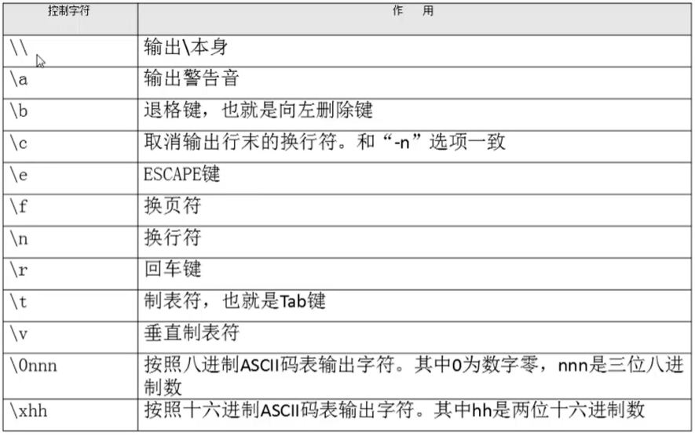
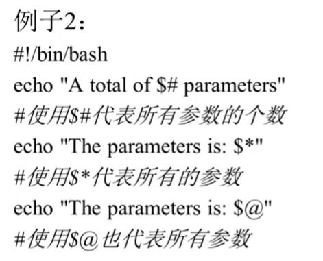
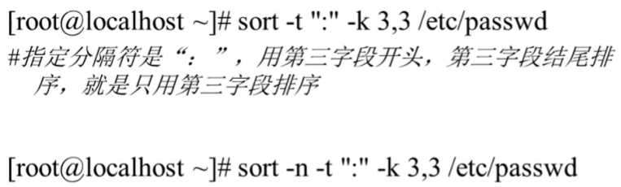

###### datetime:2022-01-08 14:34:00

###### author:nzb

## Shell

### Shell基础

#### Shell概述

* shell就是Linux中的命令解释器，说白了，就是一个命令行的交互界面。

* 与Linux不同Windows中就是图形的交互界面。

* shell还是一个强大的编程语言，因为它可以直接调用Linux的系统命令。

* Shell的种类：

    * Bourne Shell语法类：sh，ksh，Bash，psh，zsh

    * C Shell语法类（只要同于BSD的Linux版本中）：csh，tcsh

    * Bash Shell：Bash与sh兼容，是目前的主流

* 在文件/etc/shells中，可以查看Linux中默认支持的Shell类型，在命令行下输入shell的名字就可以切换shell类型

#### Shell脚本的执行方式

* echo

  `输出指定内容：echo [选项] [输出内容]`

    * echo -e：支持反斜线的字符转换

  
    * 支持颜色输出

  

* First Script

    * \# ！bin/bash：表示以下代码为shell

        * 

* 执行方法

    * 第一种：

        * chmod 755 hello.sh

        * ./hello.sh

    * 第二种：

        * bash hello.sh

* 注意：如果一个shell脚本在Windows中编辑完成，在Linux中发现运行出错，这是因为Windows和Linux格式不同，你可以用cat -A [文件名]
  来验证，换行符不同。解决方法就是用命令dos2unix将Windows格式转化为Linux格式

#### Bash的基本功能

##### 历史命令与命令补全

* history

  `历史命令：history [选项] [历史命令保存文件]`

    * history n：显示最近的n条命令

    * history -d n：删除第n条命令

    * history -c：清空历史命令

    * history -w：把缓存中的历史命令写入每个用户的缓存文件~/.bash_history

    * 历史命令默认会保存1000条，可以在环境变量配置文件/etc/profile中进行修改

    * 使用

        * 使用上，下箭头的方式调用历史命令，

        * 使用“!n”重复执行第n条历史命令

        * 使用“!!”重复执行上一条命令

        * 使用“!字符串”重复执行最后一条以该字符串开头的命令

* 命令与文件补全

    * 在Bash中，命令与文件补全是非常方便与实用的功能，我们只要在输入命令或文件时，按“Tab”键就会自动进行补全

##### 命令别名与常用快捷键

* 命令别名

    * alias

      `查询命令别名，实际就是查看~/.bashrc文件的内容`

    * alias 别名="原命令"

      `设定命令别名；For Example：alias vi='vim'`

    * unalias

      `删除别名：unalias 别名`

    * 命令执行的顺序：

        * 第一顺位执行用绝对路径或相对路径的命令

        * 第二顺位执行别名

        * 第三顺位执行Bash的内部命令（内部命令就时用whereis找不到的Linux自带命令）

        * 第四顺位执行按照$PATH环境变量定义的目录查找顺序找到的第一的命令（外部命令）

    * 让别名永久生效：写入~/.bashrc配置文件

* 常用快捷键

  `Ctrl+下列的字母`

    * c：强制终止当前命令

    * l：清屏

    * **u：剪切光标之前的内容**

    * k：剪切光标后的内容

    * **y：粘贴**

    * **r：搜索历史**

    * d：退出当前终端，相当于logout

    * z：暂停进程，放入后台
      `建议别用`

    * s：暂停屏幕输出

    * q：恢复屏幕输出

##### 输入输出重定向

* 标准输入输出设备

    * 键盘：/dev/stdin：标准输入：0文件描述符

    * 显示器：/dev/sdtout：标准输出：1文件描述符

    * 显示器：/dev/sdterr：标准错误输出：2文件描述符

  

* 输出重定向

  `改变输出方向，把命令的正确或者输出结果输出到指定的文件中`

  
    * 正确输出和错误输出同时保存进一个文件中：

        * 以覆盖的方式：

            * 命令 > 文件 2>&1
                - \> ：覆盖
                - 2>&1 ：是标准格式

            * 命令 &> 文件

        * 以追加的方式：

            * 命令 >> 文件 2>&1
                - \>> ：追加
                - 2>>&1 ：是标准格式

            * 命令 &>> 文件
              `比较简洁`

        * 把正确的输出保存进文件A，错误的输出保存进文件B：

            * 命令 >>文件A 2>>文件B

          

* 输入重定向：

  `后面既可以直接加文件名，也可以将输入重定向作为输入，不过后者在结果中不会显示文件名，因为它指挥识别输入的文件内容流`

    * wc

      `wc [选项] [文件名]，用得不多`

        * wc -c：统计字节数

        * wc -w：统计单词数

        * wc -l：统计行数

##### 多命令顺序执行与管道符

* 多命令顺序执行

    * `;`：两个命令都会执行
      `命令1;命令2`

    * `&&`：命令1正确执行，命令2才会执行

      `命令1 && 命令2，例子：源码安装的时候，make && make install`

    * `||`：命令1错误执行，命令2才会执行
      `命令1 || 命令2`

    * 
    * dd命令

        * 磁盘复制命令，和cp命令不同，dd可以复制特殊文件，分区甚至整个硬盘。主要的作用就是磁盘复制

        * dd if=输入文件 of=输出文件 bs=多少字节数作为一个块 count=块的个数

            * if=输入文件 ：指定源文件或源设备

            * of=输出文件：指定目标文件或目标设备

            * bs=字节数：指定一次输入/输出多少字节，即把这些字节看做一个数据块

            * count=个数：指定输入/输出多少个数据块

        * 例子：date;dd if=/dev/zero of=/root/testfile bs=1k count=100000;date

          `用来显示磁盘复制的时间`

    * 命令 && echo yes || echo no

      `shell编程里面应用判断命令是否执行成功：如果命令执行成功，输出yes，执行失败，输出no`

* 管道符

  `命令1的正确输出作为命令2的操作对象：命令1 | 命令2`

    * grep

      `在文件中搜索符合条件的字符串：grep [选项] "搜索内容"`

        * grep -i：忽略大小写

        * grep -n：输出行号

        * grep -v：反向查找

        * grep –color=auto：搜索出的关键字用颜色显示

        * netstat -an | grep ESTABLISHED

##### 通配符与其他特殊符号

* 通配符

    * `?`：匹配一个任意字符

    * `*`：匹配任何内容（0个或任意多个字符）

    * `[]`：匹配中括号中的任意一个

    * `[-]`：匹配中括号中范围内任意一个

    * `[^]`：逻辑非，表示匹配任意一个不是中括号内的一个字符[^0-9]表示任意一个不是数字的字符

  

    * 通配符是用来匹配文件名的，通配符通常会用来删除指定范围的文件

* 特殊符号

    * 单引号中的所有符号都是符号

      `echo '$SHELL'`

    * 双引号中的符号可能会有特殊意义

      `echo "$SHELL"`

    * 反引号和$()

      `符号中的内容是系统命令 反引号：`` $()：推荐使用`

    * echo "$(ls)"和echo '$(ls)'

        * echo "$(ls)"：双引号输出ls查询的结果

        * echo '$(ls)'：单引号输出$(ls)

    * `#` ：开头时注释

    * `$`：用来调用变量

    * `\ `：用来将特殊符号变成普通符号

      

##### Bash的变量

###### 变量分类

* 用户自定义变量

* 环境变量

  `主要保存的是和系统操作环境相关的数据，允许新建`

* 位置参数变量

  `主要用来向脚本当中传递参数或数据的，变量名不能自定义，变量作用是固定的，是预定义变量的一种`

* 预定义变量

  `是Bash中已经定义好的变量，变量名不能自定义，变量作用也是固定的`

###### 变量命名规则

* 由字母、数字和下划线组成，但是变量名不能用数字开头

* bash中，变量的默认类型都是字符串型，如果要进行数值运算，需要指定变量类型为数值型

* 变量用等号连接值，等号左右两侧不能有空格

* 变量名若有空格，需要单引号或双引号包括

* 变量值中可以用转义符\让特殊字符失去特殊含义

* 变量值可以进行叠加，不过变量需要用双引号包括“$变量名”或${变量名}包括

* 如果是把命令的结果作为变量值赋予变量，则需要使用反引号或$()包含命令

* 环境变量名建议大写

###### 用户自定义变量

* 用户自定义变量（本地变量）

* name=”jack” 可以叠加：

    * newname="$name"yang

    * newname=${name}yang

* $

  `调用变量：$变量名`

* set

  `查看系统中所有的变量`

* unset

  `删除变量：unset 变量名`

###### 环境变量

* 本地变量只在当前的shell中生效

* 环境变量会在当前和这个shell的所有子shell中生效，如果把环境变量写入相关的文件，那么这个环境变量会在所有的shell中生效

* 用pstree可以查看shell的父子关系

* export

  `申明普通变量为环境变量：export 变量名=变量值`

* env

  `专门查看环境变量`

* unset

  `删除变量：unset 变量名`

* 常用系统环境变量

    * PATH

        * 查找系统命令的变量

        * tab键补全和外部命令的查找都是根据$PATH来的

        * 可以用变量叠加的方式把自己的命令加到$PATH中，PATH="$PATH":/root/test.sh

    * PS1

        * 定义系统提示符的变量

        * echo $PS1
          `查看`

        * PS1='格式'
          `自定义命令提示符`

      
      
      

###### 位置参数变量

`不建议写位置参数脚本，其他人不知道各个位置参数的用处`

* `$n`：$0表示命令本身，之后就是命令行参数

* `$*`：所有参数，把所有参数当作一个整体

* `$@`：所有参数，把参数区别对待

* `$#`：所有参数的个数

* 举例

    * ./test.sh 11 22

        * 
          
          

###### 预定义变量

* `$?`：返回上一次执行结果正确与否

* `$$`：当前进程的PID

* `$!`：后台运行的最后一个进程的PID

* read

  `接收键盘输入：read [选项] [变量名]`

    * -p “提示信息”：在等待read输入时，输出提示信息

      `必须携带`

    * -t 秒数：限定时间，指定等待时间

      `必须携带`

    * -n 字符数：限定字符数，不加-n就要回车键结束

    * -s：隐藏输入的信息，适用于输入密码时

  

* 举例

  
  

##### Bash的运算

* 数值运算与运算符

    * 数值运算

        * Linux中变量默认类型时字符串

        * declare

          `声明变量类型：declare [+/-][选项] 变量名`

            * -：给变量设定类型属性

                * -i：将变量声明为整数类型

                * -x：将变量声明为环境变量

            * +：取消变量的类型属性

            * -p：显示指定变量的被声明的类型

        * 举例:（四种计算格式，最常用的是第三种）

          `aa=11；bb=22`

            * declare -i cc=$aa+$bb

            * cc=$(expr $aa + $bb)

              `cc的值是aa和bb的和，注意“+”好左右两侧必须有空格`

            * cc=$(($aa+$bb))

              `双小括号：运算；单小括号：系统命令`

            * cc=$[$aa+$bb]

    * 运算符

        * 越靠上的优先级越高

            * 
        * 示例

            * 

* 变量测试与内容替换

    * 需要的时候对照使用

        * 

##### 环境变量配置文件

* 环境变量配置文件简介

    * source

      `不需要重新登录，让修改后的配置文件直接生效`

        * source 配置文件

        * `. 配置文件`

              `“.” 就是source的缩写，注意“.”后面有个空格`

    * 环境变量配置文件中主要就是定义对系统的操作环境生效的系统默认环境变量，比如PATH，HISTSIZE，PS1，HOSTNAME等

    * 主要的5个配置文件

        * /etc/profile：针对所有用户

        * /etc/profile.d/*.sh：针对所有用户

        * ~/.bash_profile：针对单个用户

        * ~/.bashrc：针对单个用户

        * /etc/bashrc：针对所有用户

* 环境变量配置文件作用

    * 环境变量配置文件调用的顺序

      

    * /etc/profile：针对所有用户

        * USER变量

        * LOGNAME变量

        * MAIL变量

        * PATH变量

        * HOSTNAME变量

        * HISTNAME变量

        * HISTSIZE变量

        * umask

        * 调用/etc/profile.d/*.sh文件

    * /etc/profile.d/*.sh：针对所有用户

        * 执行profile.d目录下所有sh文件

    * ~/.bash_profile：针对单个用户

        * 追加PATH：在PATH变量后面加上了:$HOME/bin这个目录

        * 调用~/.bashrc

    * ~/.bashrc：针对单个用户

        * 定义别名

    * /etc/bashrc：针对所有用户

        * 定义别名和PS1（登录提示符）

        * 会重复调用PATH，umask啥的，但是只针对no login shell的情况，就是直接敲sh进入一个shell的情况

* 其他配置文件和登录信息

    * 注销时的配置文件：~/.bash_logout

      `可以清空一些环境变量等`

    * 历史命令的保存文件：~/.bash_history

      `排错依据`

    * 登录信息

        * 本地终端欢迎信息：/etc/issue

          

        * 远程终端欢迎信息：/etc/issue.net

            * 转义符在该文件中不能使用，只能纯文本登录

            * 是否生效由ssh的配置文件/etc/ssh/sshd/config决定，要加入Banner /etc/issue.net，重启ssh服务生效：service sshd restart

    * 登陆后的欢迎信息：/etc/motd（本地和远程都适用）

    * 推荐特效字符定制网站ASCII Generator

### Shell编程

#### 基础正则表达式

* 正则表达式和通配符区别

    * 通配符：在系统中搜索匹配文件名，是完全匹配。支持命令ls，find，cp，他们不认识正则表达式

    * 正则表达式：用来在文件中匹配符合条件的字符串，是包含匹配。支持命令：grep，awk，sed

* *：前一个字符匹配0次或者任意多次

* .：匹配任意一个字符（换行符除外）

* ^：匹配以后面字符作为行首的行

* $：匹配以后面字符作为行尾的行

* ^$：匹配空白行

* []：匹配中括号中的指定的任意一个字符

* [^]：匹配除中括号中的字符外的任意一个字符

* \：转义符

* \{n\}：表示其前面的字符恰好出现n次

* \{n,\}：表示其前面的字符出现不少于n次

* \{n,m\}：表示其前面的字符至少出现n次，最多出现m次

#### 字符截取命令

* grep

  `提取符合条件的行`

    * -c：只输出匹配行的计数

    * -i：不区分大小写

    * -v：显示不包含匹配文本的所有行

* cut

  `提取符合条件的列：cut [选项] 文件名`

    * -f 列号：提取第几列

    * -d 分隔符：按照指定分隔符分割列，默认是制表符tab

    * 示例

        * cat/etc/passwd | grep /bin/bash | grep -v root | cut -d ":" -f 1：用来提取出普通用户名

        * df -h | grep "sda5" | cut -f 5：用来提取硬盘的使用率

          `如果是空格，则不能很好使用，需要更复杂的awk命令`

* printf

  `按找类型输出格式输出内容，使用awk时格式化输出：printf "输出类型输出格式" 输出内容`

    * %ns：输出字符串

      `n是数字代指输出几个字符`

    * %ni：输出整数

      `n是数字代指输出几个数字`

    * %m.nf：输出浮点数

      `m和n是数字，指代输出的整数位数和小数位数。如%8.2f代表共输出8位数，其中2位是小数，6位是整数。`

    * \n，\r，\t：换行，回车，tab键

      

    * printf '%s %s %s' 1 2 3 4 5 6：最后输出结果按照%s %s %s格式分为两组

      

    * printf命令不能用管道符，只能printf %s $(cat XXX.txt)

    * 在awk命令的输出中支持print和printf命令

        * print：print会在每个输出之后自动加入一个换行符（Linux默认没有print命令）

        * printf：printf是标准格式输出命令，并不会自动加入换行符，如果需要换行，需要手工加入换行符

* awk

  `截取列： cut可以截取字符时，使用cut，否则使用awk`

    * 很强大的命令，可以说是一门编程语言

    * 格式：awk ’条件1{动作1} 条件2{动作2} 条件3{动作3}‘ 文件名

      `前面可以加管道符`

        * 动作

            * 格式化输出：printf

            * 流程控制语句

        * 示例

            * awk ‘{printf $2 “\t” $6 “\n”}’ XXX.txt

            * df -h | awk '{printf $1 "\t" $5 "\t" $6}'：可以处理空格，弥补了cut的不足，但是awk很多命令很复杂

            * df -h | grep sda5 | awk ’{print $5}‘ | cut -d "%" -f 1

              `print可以在awk里面使用默认结尾加个换行符`

    * BEGIN：在所有命令执行之前先执行BEGIN后面的语句块,awk默认是先读入一行再执行后面的语句

    * END：在所有语句处理完后执行

    * FS：指定分隔符，awk ’{FS=":"}‘

        * awk ‘{FS=":"} {print $1 "\t" $3}’ /etc/passwd

        * awk ‘BEGIN{FS=":"} {print $1 "\t" $3}’ /etc/passwd

      

    * awk还支持条件判断：awk ’$6>=87 {printf $2 "\n"}‘：

* sed

  `数据的流编辑器，主要是用来将数据进行选取、替换、删除、新增的命令`

    * vim只能修改文件，sed还可以直接修改管道符传过来的流

    * `格式：sed [选项] ‘[动作]’ 文件名`

    * 选项：

        * -n：sed默认把所有数据都输出到屏幕，加上-n表示只把经过sed修改过后的行输出到屏幕

        * -e：允许对输入数据应用多条sed命令编辑

        * -i：用sed的修改结果直接修改读取数据的文件，而不是由屏幕输出

          `会改变源文件，比较危险，不建议使用`

    * 动作：

        * a：行后追加（多行时，行尾要加\）

          `sed ‘2a hello’ XXX.txt`

        * c：替换（多行时，行尾要加\）

          `sed ‘4c no the line’ XXX.txt：替换第二行`

        * i：行前插入（多行时，行尾要加\）

          `sed ‘2i hello \ world’ XXX.txt：在第二行前面插入`

        * d：删除

          `sed ‘2,4d’ XXX.txt：删除第二行（没加-i选项不会修改源文件，只是删除输出的结果）`

        * p：打印

          `sed ‘2p’ XXX.txt：打印第二行`

        * s：字串替换

          `sed ‘4s old/new/g’ XXX.txt：替换第四行的旧字符串替换为新字符串`

#### 字符处理命令

* sort

  `排序（可接收管道符数据）：sort [选项] 文件名`

    * -f：忽略大小写

    * -r：反向排序

    * -t ：指定分隔符，默认分隔符是制表符

    * -n：按照数值大小来排，默认使用字符串型排序

    * -k n[,m]：按照指定的字段范围排序，从第n字段开始，m字段结束（默认到行尾）

      
      

* wc：

  `统计字符（可接收管道符数据）：wc [选项] 文件名`

    * -l：只统计行数

    * -c：只统计字符数

    * -w：只统计单词数

#### 条件判断

* 两种判断格式

    * test -e XXX.txt

    * [ -e XXX.txt ]：注意首尾各有一个空格
      `shell中常用`

    * 示例

        * [ -d /root ] && echo "yes" || echo "no"：如果是目录yes，否则no

* 按照文件类型判断

    * **-e：判断文件是否存在（存在为真）**

    * -b：判断文件是否存在，并且是否是块设备文件

    * -c：判断文件是否存在，并且是否是字符设备文件

    * **-d：判断文件是否存在，并且是否是目录文件**

    * **-f：判断文件是否存在，并且是否是普通文件**

    * -L：判断文件是否存在，并且是否是链接文件

    * -p：判断文件是否存在，并且是否是管道文件

    * -S：判断文件是否存在，并且是否是套接字文件

    * -s：判断文件是否存在，并且是否是非空

* 按照文件权限进行判断

    * **-r：判断文件是否存在，并且是否该文件有读权限，u，g，o中任意一个有都为真**

    * **-w：判断文件是否存在，并且是否该文件有写权限，u，g，o中任意一个有都为真**

    * **-x：判断文件是否存在，并且是否该文件有执行权限，u，g，o中任意一个有都为真**

    * -u：判断文件是否存在，并且是否该文件有SUID权限，u，g，o中任意一个有都为真

    * -g：判断文件是否存在，并且是否该文件有SGID权限，u，g，o中任意一个有都为真

    * -k：判断文件是否存在，并且是否该文件有SBIT权限，u，g，o中任意一个有都为真

* 两个文件之间进行比较

    * 文件1 -nt 文件2：判断文件1的修改时间是否比文件2新

    * 文件1 -ot 文件2：判断文件1的修改时间是否比文件2旧

    * 文件1 -ef 文件2：判断文件1的inode号是否和文件2一致，可以用来判断两个文件是不是互为硬链接

* 两个整数之间比较

    * 整数1 -eq 整数2：相等

    * 整数1 -ne 整数2：不等

    * 整数1 -gt 整数2：大于

    * 整数1 -lt 整数2：小于

    * 整数1 -ge 整数2：大于等于

    * 整数1 -le 整数2：小于等于

    * 示例：[ 3 -lt 2 ] && echo yes || echo no

* 字符串的判断

    * -z：判断是否为空

      `判断变量是否为空：[ -z "$name" ] && echo yes || echo no`

    * -n：判断是否为非空

    * 字串1 == 字串2：判断是否相等

    * 字串1 != 字串2：判断是否不等

* 多重条件判断

    * 判断1 -a 判断2：逻辑与

      `示例： aa = 10 [ -n "$aa" -a "$aa" -gt 9 ] && echo yes || echo no`

    * 判断1 -o 判断2：逻辑或

    * ! 判断：逻辑非
      `注意!后面有空格`

#### 流程判断

* if语句

    * 和[-d /root] && echo "yes" || echo "no"作用一样，但更直观

    * 单分支if

      
        * 实例

          

    * 双分支if

      

    * 多分支if

      

* case语句

  

* for循环

    * 第一种语法

      
        * 示例

          

    * 第二种语法

      
        * 示例

          

* while循环和until编程

    * while循环

      
        * 示例

          

    * until循环

      
        * 示例

          