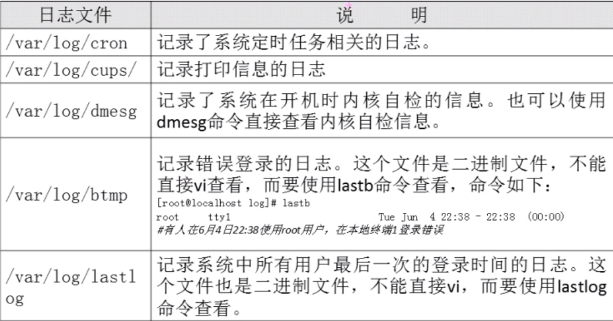
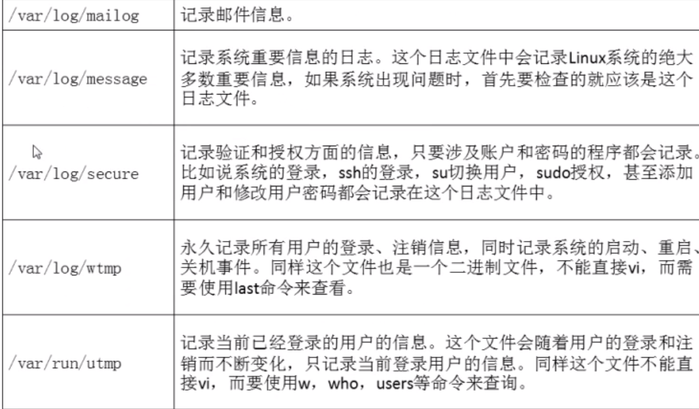
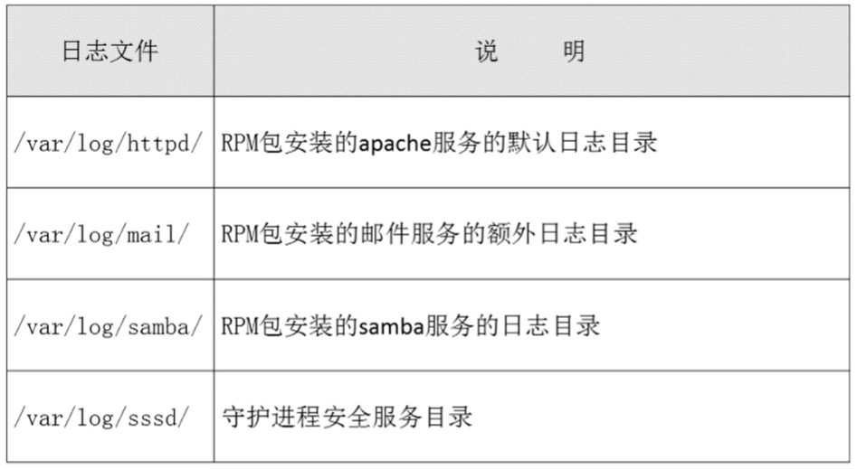
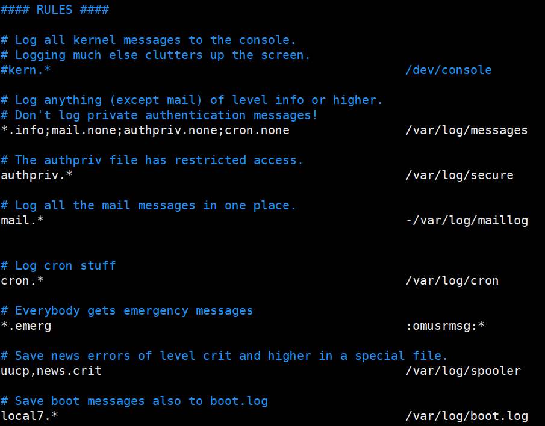
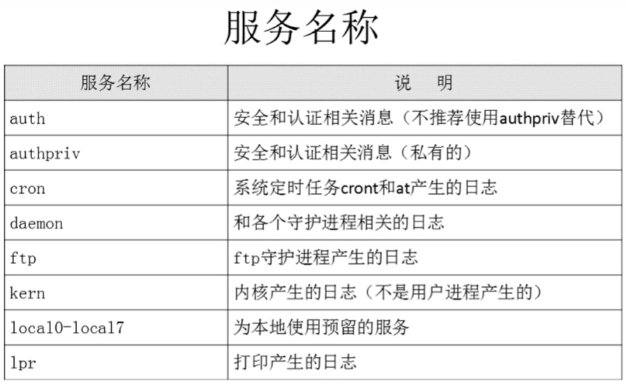
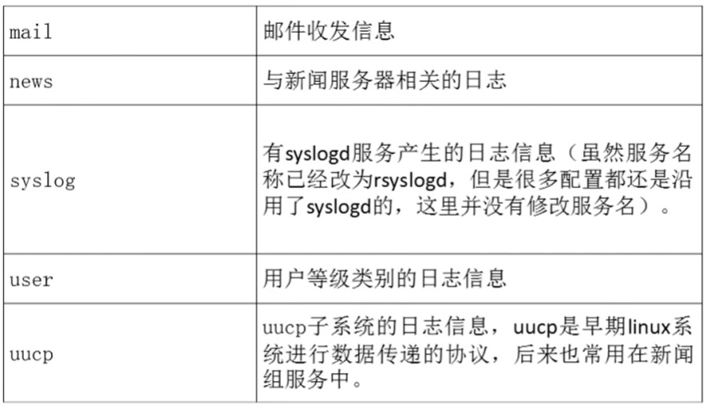
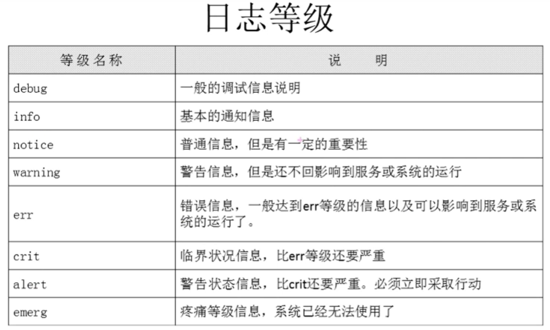
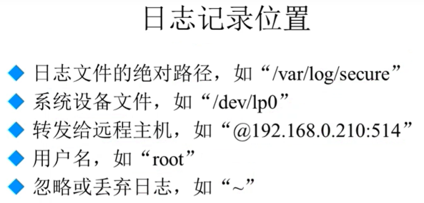
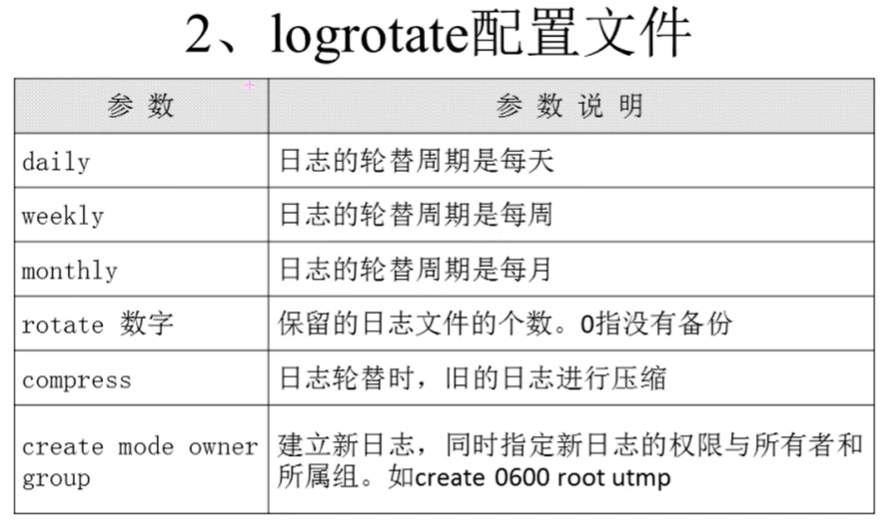

###### datetime:2022-01-08 14:34:00

###### author:nzb

## Linux日志管理

### 日志管理简介

* 百度百科简介：系统日志是记录系统中硬件、软件和系统问题的信息，同时还可以监视系统中发生的事件。用户可以通过它来检查错误发生的原因，或者寻找受到攻击时攻击者留下的痕迹。系统日志包括系统日志、应用程序日志和安全日志。

* 服务器出现问题先查看日志，才能找准原因

* CentOS7中原来的日志服务syslogd被rsyslogd取代，两者兼容

* 确认服务是否启动和自启动：

    * ps aux | grep rsyslogd

    * chkconfig --list | grep rsylog

* 常见的日志的作用

  
  

* RPM包安装的服务日志也会在/var/log/目录下

* 源码包安装的服务日志在源码包指定目录（一般是/usr/local）中，这些日志不是有rsyslogd服务来管理的，而是由各个服务使用自己的日志管理文档来记录自身日志

    * 你安装了这些服务就会有

      

### rsyslogd日志服务

* 日志文件格式

    * 事件产生的时间

    * 产生事件的服务器的主机名

    * 产生事件的服务名或程序名

    * 事件的具体信息

* /etc/rsyslog.conf配置文件

    *  格式

  
        * authpriv.* /var/log/secure

        * 服务名称 [连接符号] 日志等级 日志记录位置

          `authpriv：服务名称 .：连接符号 *：日志等级`

        * 服务名称，连接符，日志等级，日志记录位置都有多个，内容很多，自行百度。

    * 常见的服务

      
      

    * 连接符号

        * “*”不是连接符号，是所有日志等级

          

    * 日志等级

        * 从低等级到高等级（上到下）

          

    * 日志记录位置

      

### 日志轮替

* 如果日志都记录在一个文件中，那么可能会占据大量存储空间，纯文本文档打开会非常慢，所以日志需要处理：切割（把大日志按天切割成小的）+轮换（删除旧的，保存新的）

* 日志文件的命名规则

    * 如果配置文件中有“dateext”参数，那么日志会用日期作为后缀，例如：“secure-20200603”，只需要保存指定的日志个数，删除多余的日志文件即可
      `推荐使用`

    * 如果没有“dateext”参数，那么日志文件就需要改名了，当第一次使用日志轮替时，当前的“secure”日志会自动改名为“secure.1”，然后新建“secure”日志。第二次时，1变2，0变1，又新建0，以此类推

* 配置文件

    * /etc/logrotate.conf

  
  
  

* 只要是RPM包安装的服务，它默认已经支持轮替，但是源码包安装的服务需要vim /etc/logrotate.conf，然后手动加入轮替

    * 示例

      

* logrotate

  `logrotate [选项] 配置文件名`

    * 如果此命令没有选项，则会按照配置文件中的条件进行日志轮替

    * logrotate -v /etc/logrotate.conf：显示日志轮替过程

    * logrotate -f /etc/logrotate.conf：强制轮替，不管日志轮替的条件是否已经满足