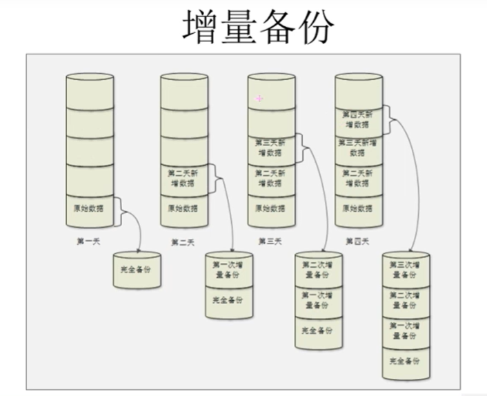
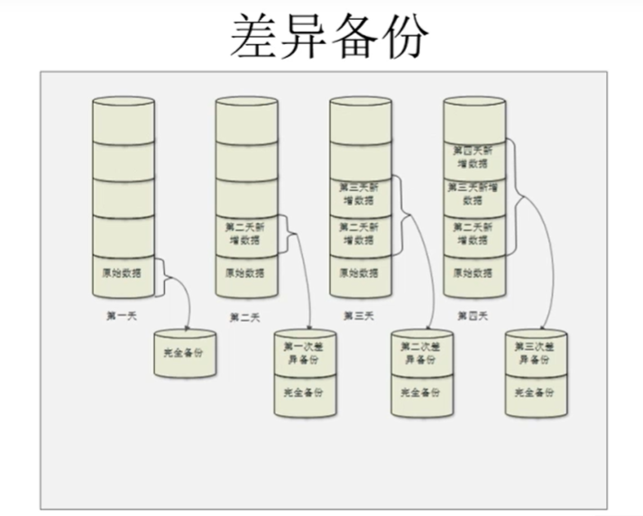
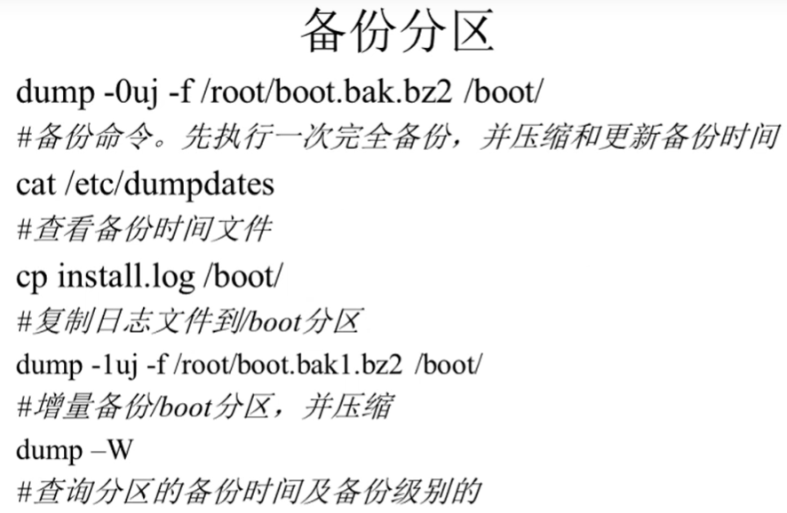
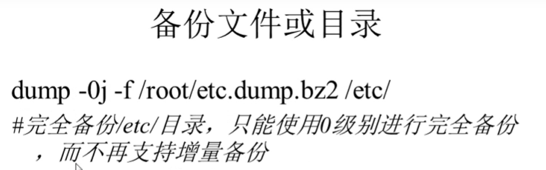
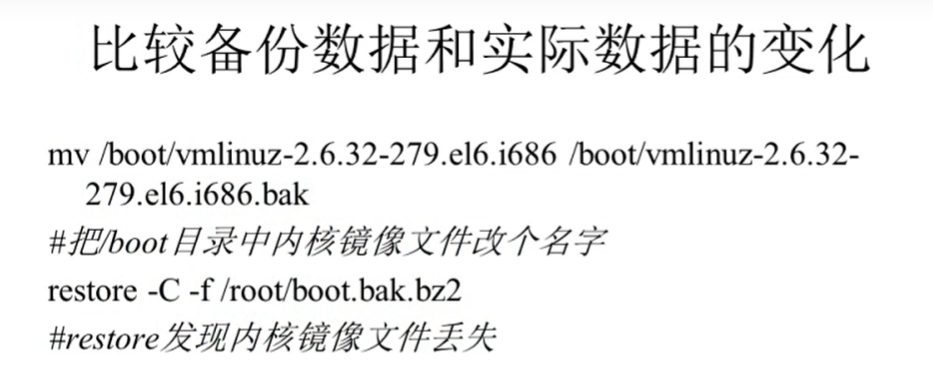
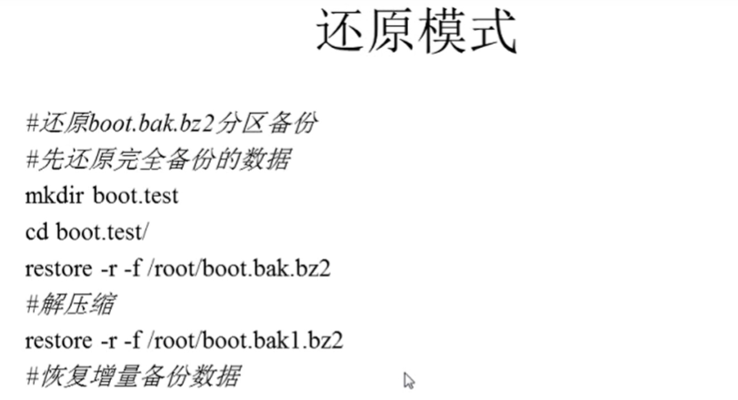

###### datetime:2022-01-08 14:34:00

###### author:nzb

## Linux备份与恢复

* 备份概述

    * Linux中需要备份的数据：/root/目录，/home/目录，/var/spool/mail/目录，/etc/目录，其他目录

    * 安装的服务的数据也需要备份

        * apache需要备份的数据：配置文件，网页主目录，日志文件

        * mysql需要备份的数据

            * 源码包安装的：/usr/local/mysql/data/

            * RPM包安装的：/var/lib/mysql

    * 备份策略

        * 完全备份：效果最高，但需要更大的硬盘空间

        * 增量备份：每次备份只备份新的数据，占用空间少，但是恢复起来麻烦

          

        * 差异备份：每次备份都只备份完全备份中不存在的，折中方法

          

* 备份命令

    * 完全备份完全可以用tar打包压缩来做，但是如果是差异备份就会非常麻烦，这时就需要用到Linux为数据备份量是打造的备份和恢复命令dump命令和restore命令

    * dump

      `dump [选项] 备份之后的文件名 原文件名或目录`

        * -级别：0到9个备份级别

          `0是完全备份，1就是第一次增量备份，以此类推9就是第9次增量备份`

        * -f 文件名：指定备份之后的文件名

        * -u：把备份时间记录在/etc/dumpdates文件中

        * -v：显示备份过程

        * -j：把备份文件压缩为.bz2格式

        * -W：查看详情，显示允许被dump的分区的备份等级及备份时间

        * **注意：dump命令只有在备份分区的时候才能增量备份，备份普通目录或文件只能完全备份**

            * 示例

              
              

    * restore

      `restore [模式选项] [选项]`

        * 四个模式
          `不能混用`

            * -C：比较备份数据和实际数据的变化

              

            * -i：交互模式，手工选择需要恢复的文件

            * -t：查看模式，用于查看备份文件中拥有哪些数据

            * -r：还原模式，用于数据还原

              

        * 一个选项

            * -f：指定备份文件的文件名