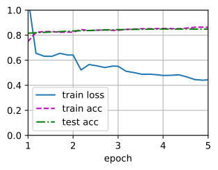
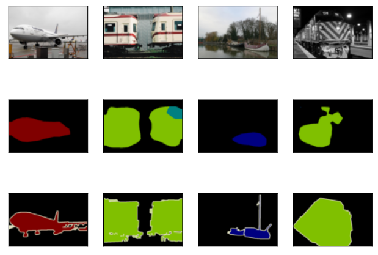

###### datetime:2024/11/01 11:11

###### author:nzb

本项目源于《[动手学深度学习](https://github.com/d2l-ai/d2l-zh)》，添加了一些自己的学习笔记，方便搜索查阅。正版GitHub地址：https://github.com/d2l-ai/d2l-zh

# 全卷积网络

如《语义分割和数据集》中所介绍的那样，语义分割是对图像中的每个像素分类。
*全卷积网络*（fully convolutional network，FCN）采用卷积神经网络实现了从图像像素到像素类别的变换 `Long.Shelhamer.Darrell.2015`。
与我们之前在图像分类或目标检测部分介绍的卷积神经网络不同，全卷积网络将中间层特征图的高和宽变换回输入图像的尺寸：这是通过在 《转置卷积》中引入的*转置卷积*（transposed convolution）实现的。
因此，输出的类别预测与输入图像在像素级别上具有一一对应关系：通道维的输出即该位置对应像素的类别预测。


```python
#@tab pytorch
%matplotlib inline
from d2l import torch as d2l
import torch
import torchvision
from torch import nn
from torch.nn import functional as F
```

## 构造模型

下面我们了解一下全卷积网络模型最基本的设计。
如 图13.11.1所示，全卷积网络先使用卷积神经网络抽取图像特征，然后通过$$1\times 1$$卷积层将通道数变换为类别个数，最后在 《转置卷积》中通过转置卷积层将特征图的高和宽变换为输入图像的尺寸。
因此，模型输出与输入图像的高和宽相同，且最终输出通道包含了该空间位置像素的类别预测。


图13.11.1 全卷积网络

下面，我们[**使用在ImageNet数据集上预训练的ResNet-18模型来提取图像特征**]，并将该网络记为`pretrained_net`。
ResNet-18模型的最后几层包括全局平均汇聚层和全连接层，然而全卷积网络中不需要它们。


```python
#@tab pytorch
pretrained_net = torchvision.models.resnet18(pretrained=True)
list(pretrained_net.children())[-3:]

# [Sequential(
#    (0): BasicBlock(
#      (conv1): Conv2d(256, 512, kernel_size=(3, 3), stride=(2, 2), padding=(1, 1), bias=False)
#      (bn1): BatchNorm2d(512, eps=1e-05, momentum=0.1, affine=True, track_running_stats=True)
#      (relu): ReLU(inplace=True)
#      (conv2): Conv2d(512, 512, kernel_size=(3, 3), stride=(1, 1), padding=(1, 1), bias=False)
#      (bn2): BatchNorm2d(512, eps=1e-05, momentum=0.1, affine=True, track_running_stats=True)
#      (downsample): Sequential(
#        (0): Conv2d(256, 512, kernel_size=(1, 1), stride=(2, 2), bias=False)
#        (1): BatchNorm2d(512, eps=1e-05, momentum=0.1, affine=True, track_running_stats=True)
#      )
#    )
#    (1): BasicBlock(
#      (conv1): Conv2d(512, 512, kernel_size=(3, 3), stride=(1, 1), padding=(1, 1), bias=False)
#      (bn1): BatchNorm2d(512, eps=1e-05, momentum=0.1, affine=True, track_running_stats=True)
#      (relu): ReLU(inplace=True)
#      (conv2): Conv2d(512, 512, kernel_size=(3, 3), stride=(1, 1), padding=(1, 1), bias=False)
#      (bn2): BatchNorm2d(512, eps=1e-05, momentum=0.1, affine=True, track_running_stats=True)
#    )
#  ),
#  AdaptiveAvgPool2d(output_size=(1, 1)),
#  Linear(in_features=512, out_features=1000, bias=True)]
```

接下来，我们[**创建一个全卷积网络`net`**]。
它复制了ResNet-18中大部分的预训练层，除了最后的全局平均汇聚层和最接近输出的全连接层。

```python
#@tab pytorch, paddle
net = nn.Sequential(*list(pretrained_net.children())[:-2])
```

给定高度为320和宽度为480的输入，`net`的前向传播将输入的高和宽减小至原来的$$1/32$$，即10和15。


```python
#@tab pytorch
X = torch.rand(size=(1, 3, 320, 480))
net(X).shape

# torch.Size([1, 512, 10, 15])
```

接下来[**使用$$1\times1$$卷积层将输出通道数转换为Pascal VOC2012数据集的类数（21类）。**]
最后需要(**将特征图的高度和宽度增加32倍**)，从而将其变回输入图像的高和宽。
回想一下《填充和步幅》中卷积层输出形状的计算方法：
由于$$(320-64+16\times2+32)/32=10$$且$$(480-64+16\times2+32)/32=15$$，我们构造一个步幅为$$32$$的转置卷积层，并将卷积核的高和宽设为$$64$$，填充为$$16$$。
我们可以看到如果步幅为$$s$$，填充为$$s/2$$（假设$$s/2$$是整数）且卷积核的高和宽为$$2s$$，转置卷积核会将输入的高和宽分别放大$$s$$倍。


```python
#@tab pytorch
num_classes = 21
net.add_module('final_conv', nn.Conv2d(512, num_classes, kernel_size=1))
net.add_module('transpose_conv', nn.ConvTranspose2d(num_classes, num_classes,
                                    kernel_size=64, padding=16, stride=32))
```

## [**初始化转置卷积层**]

在图像处理中，我们有时需要将图像放大，即*上采样*（upsampling）。
*双线性插值*（bilinear interpolation）
是常用的上采样方法之一，它也经常用于初始化转置卷积层。

为了解释双线性插值，假设给定输入图像，我们想要计算上采样输出图像上的每个像素。

1. 将输出图像的坐标$$(x,y)$$映射到输入图像的坐标$$(x',y')$$上。
例如，根据输入与输出的尺寸之比来映射。
请注意，映射后的$$x′$$和$$y′$$是实数。
2. 在输入图像上找到离坐标$$(x',y')$$最近的4个像素。
3. 输出图像在坐标$$(x,y)$$上的像素依据输入图像上这4个像素及其与$$(x',y')$$的相对距离来计算。

双线性插值的上采样可以通过转置卷积层实现，内核由以下`bilinear_kernel`函数构造。
限于篇幅，我们只给出`bilinear_kernel`函数的实现，不讨论算法的原理。


```python
#@tab pytorch
def bilinear_kernel(in_channels, out_channels, kernel_size):
    factor = (kernel_size + 1) // 2
    if kernel_size % 2 == 1:
        center = factor - 1
    else:
        center = factor - 0.5
    og = (torch.arange(kernel_size).reshape(-1, 1),
          torch.arange(kernel_size).reshape(1, -1))
    filt = (1 - torch.abs(og[0] - center) / factor) * \
           (1 - torch.abs(og[1] - center) / factor)
    weight = torch.zeros((in_channels, out_channels,
                          kernel_size, kernel_size))
    weight[range(in_channels), range(out_channels), :, :] = filt
    return weight
```

让我们用[**双线性插值的上采样实验**]它由转置卷积层实现。
我们构造一个将输入的高和宽放大2倍的转置卷积层，并将其卷积核用`bilinear_kernel`函数初始化。

```python
#@tab pytorch
conv_trans = nn.ConvTranspose2d(3, 3, kernel_size=4, padding=1, stride=2,
                                bias=False)
conv_trans.weight.data.copy_(bilinear_kernel(3, 3, 4));
```

读取图像`X`，将上采样的结果记作`Y`。为了打印图像，我们需要调整通道维的位置。

```python
#@tab pytorch
img = torchvision.transforms.ToTensor()(d2l.Image.open('../img/catdog.jpg'))
X = img.unsqueeze(0)
Y = conv_trans(X)
out_img = Y[0].permute(1, 2, 0).detach()
```

可以看到，转置卷积层将图像的高和宽分别放大了2倍。
除了坐标刻度不同，双线性插值放大的图像和在 《目标检测和边界框》中打印出的原图看上去没什么两样。

```python
#@tab pytorch
d2l.set_figsize()
print('input image shape:', img.permute(1, 2, 0).shape)
d2l.plt.imshow(img.permute(1, 2, 0));
print('output image shape:', out_img.shape)
d2l.plt.imshow(out_img);

# input image shape: torch.Size([561, 728, 3])
# output image shape: torch.Size([1122, 1456, 3])
```


全卷积网络[**用双线性插值的上采样初始化转置卷积层。对于$$1\times 1$$卷积层，我们使用Xavier初始化参数。**]

```python
#@tab pytorch
W = bilinear_kernel(num_classes, num_classes, 64)
net.transpose_conv.weight.data.copy_(W);
```

## [**读取数据集**]

我们用《区域卷积神经网络（R-CNN）系列》中介绍的语义分割读取数据集。
指定随机裁剪的输出图像的形状为$$320\times 480$$：高和宽都可以被$$32$$整除。

```python
#@tab mxnet, pytorch
batch_size, crop_size = 32, (320, 480)
train_iter, test_iter = d2l.load_data_voc(batch_size, crop_size)
```


## [**训练**]

现在我们可以训练全卷积网络了。
这里的损失函数和准确率计算与图像分类中的并没有本质上的不同，因为我们使用转置卷积层的通道来预测像素的类别，所以需要在损失计算中指定通道维。
此外，模型基于每个像素的预测类别是否正确来计算准确率。

```python
#@tab pytorch
def loss(inputs, targets):
    return F.cross_entropy(inputs, targets, reduction='none').mean(1).mean(1)

num_epochs, lr, wd, devices = 5, 0.001, 1e-3, d2l.try_all_gpus()
trainer = torch.optim.SGD(net.parameters(), lr=lr, weight_decay=wd)
d2l.train_ch13(net, train_iter, test_iter, loss, trainer, num_epochs, devices)

# loss 0.443, train acc 0.863, test acc 0.848
# 254.0 examples/sec on [device(type='cuda', index=0), device(type='cuda', index=1)]
```



## [**预测**]

在预测时，我们需要将输入图像在各个通道做标准化，并转成卷积神经网络所需要的四维输入格式。

```python
#@tab pytorch
def predict(img):
    X = test_iter.dataset.normalize_image(img).unsqueeze(0)
    pred = net(X.to(devices[0])).argmax(dim=1)
    return pred.reshape(pred.shape[1], pred.shape[2])
```

为了[**可视化预测的类别**]给每个像素，我们将预测类别映射回它们在数据集中的标注颜色。

```python
#@tab pytorch
def label2image(pred):
    colormap = torch.tensor(d2l.VOC_COLORMAP, device=devices[0])
    X = pred.long()
    return colormap[X, :]
```

测试数据集中的图像大小和形状各异。
由于模型使用了步幅为32的转置卷积层，因此当输入图像的高或宽无法被32整除时，转置卷积层输出的高或宽会与输入图像的尺寸有偏差。
为了解决这个问题，我们可以在图像中截取多块高和宽为32的整数倍的矩形区域，并分别对这些区域中的像素做前向传播。
请注意，这些区域的并集需要完整覆盖输入图像。
当一个像素被多个区域所覆盖时，它在不同区域前向传播中转置卷积层输出的平均值可以作为`softmax`运算的输入，从而预测类别。

为简单起见，我们只读取几张较大的测试图像，并从图像的左上角开始截取形状为$$320\times480$$的区域用于预测。
对于这些测试图像，我们逐一打印它们截取的区域，再打印预测结果，最后打印标注的类别。


```python
#@tab pytorch
voc_dir = d2l.download_extract('voc2012', 'VOCdevkit/VOC2012')
test_images, test_labels = d2l.read_voc_images(voc_dir, False)
n, imgs = 4, []
for i in range(n):
    crop_rect = (0, 0, 320, 480)
    X = torchvision.transforms.functional.crop(test_images[i], *crop_rect)
    pred = label2image(predict(X))
    imgs += [X.permute(1,2,0), pred.cpu(),
             torchvision.transforms.functional.crop(
                 test_labels[i], *crop_rect).permute(1,2,0)]
d2l.show_images(imgs[::3] + imgs[1::3] + imgs[2::3], 3, n, scale=2);
```



## 小结

* 全卷积网络先使用卷积神经网络抽取图像特征，然后通过$$1\times 1$$卷积层将通道数变换为类别个数，最后通过转置卷积层将特征图的高和宽变换为输入图像的尺寸。
* 在全卷积网络中，我们可以将转置卷积层初始化为双线性插值的上采样。

## 练习

1. 如果将转置卷积层改用Xavier随机初始化，结果有什么变化？
1. 调节超参数，能进一步提升模型的精度吗？
1. 预测测试图像中所有像素的类别。
1. 最初的全卷积网络的论文中 `Long.Shelhamer.Darrell.2015`还使用了某些卷积神经网络中间层的输出。试着实现这个想法。