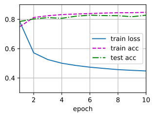

###### datetime:2024/07/27 11:28

###### author:nzb

本项目源于《[动手学深度学习](https://github.com/d2l-ai/d2l-zh)》，添加了一些自己的学习笔记，方便搜索查阅。正版GitHub地址：https://github.com/d2l-ai/d2l-zh

# softmax回归的简洁实现

在前面章节中，
我们发现(**通过深度学习框架的高级API能够使实现**)
(~~softmax~~)
线性(**回归变得更加容易**)。
同样，通过深度学习框架的高级API也能更方便地实现softmax回归模型。
本节如在《softmax从零开始实现》中一样，
继续使用Fashion-MNIST数据集，并保持批量大小为256。


```python
#@tab pytorch
from d2l import torch as d2l
import torch
from torch import nn

batch_size = 256
train_iter, test_iter = d2l.load_data_fashion_mnist(batch_size)
```

## 初始化模型参数

如我们在《softmax回归》所述，
[**softmax回归的输出层是一个全连接层**]。
因此，为了实现我们的模型，
我们只需在`Sequential`中添加一个带有10个输出的全连接层。
同样，在这里`Sequential`并不是必要的，
但它是实现深度模型的基础。
我们仍然以均值0和标准差0.01随机初始化权重。

```python
#@tab pytorch
# PyTorch不会隐式地调整输入的形状。因此，
# 我们在线性层前定义了展平层（flatten），来调整网络输入的形状
net = nn.Sequential(nn.Flatten(), nn.Linear(784, 10))

def init_weights(m):
    if type(m) == nn.Linear:
        nn.init.normal_(m.weight, std=0.01)

net.apply(init_weights);
```


## 重新审视Softmax的实现

在前面的例子中，
我们计算了模型的输出，然后将此输出送入交叉熵损失。
从数学上讲，这是一件完全合理的事情。
然而，从计算角度来看，指数可能会造成数值稳定性问题。

回想一下，softmax函数$$\hat y_j = \frac{\exp(o_j)}{\sum_k \exp(o_k)}$$，
其中$$\hat y_j$$是预测的概率分布。
$$o_j$$
是未规范化的预测$$\mathbf{o}$$的第$$j$$个元素。
如果$$o_k$$中的一些数值非常大，
那么$$\exp(o_k)$$可能大于数据类型容许的最大数字，即*上溢*（overflow）。
这将使分母或分子变为`inf`（无穷大），
最后得到的是0、`inf`或`nan`（不是数字）的$$\hat y_j$$。
在这些情况下，我们无法得到一个明确定义的交叉熵值。

解决这个问题的一个技巧是：
在继续softmax计算之前，先从所有$$o_k$$中减去$$\max(o_k)$$。
这里可以看到每个$$o_k$$按常数进行的移动不会改变softmax的返回值：

$$
\begin{aligned}
\hat y_j & =  \frac{\exp(o_j - \max(o_k))\exp(\max(o_k))}{\sum_k \exp(o_k - \max(o_k))\exp(\max(o_k))} \\
& = \frac{\exp(o_j - \max(o_k))}{\sum_k \exp(o_k - \max(o_k))}.
\end{aligned}
$$


在减法和规范化步骤之后，可能有些$$o_j - \max(o_k)$$具有较大的负值。
由于精度受限，$$\exp(o_j - \max(o_k))$$将有接近零的值，即*下溢*（underflow）。
这些值可能会四舍五入为零，使$$\hat y_j$$为零，
并且使得$$\log(\hat y_j)$$的值为`-inf`。
反向传播几步后，我们可能会发现自己面对一屏幕可怕的`nan`结果。

尽管我们要计算指数函数，但我们最终在计算交叉熵损失时会取它们的对数。
通过将softmax和交叉熵结合在一起，可以避免反向传播过程中可能会困扰我们的数值稳定性问题。
如下面的等式所示，我们避免计算$$\exp(o_j - \max(o_k))$$，
而可以直接使用$$o_j - \max(o_k)$$，因为$$\log(\exp(\cdot))$$被抵消了。

$$
\begin{aligned}
\log{(\hat y_j)} & = \log\left( \frac{\exp(o_j - \max(o_k))}{\sum_k \exp(o_k - \max(o_k))}\right) \\
& = \log{(\exp(o_j - \max(o_k)))}-\log{\left( \sum_k \exp(o_k - \max(o_k)) \right)} \\
& = o_j - \max(o_k) -\log{\left( \sum_k \exp(o_k - \max(o_k)) \right)}.
\end{aligned}
$$

我们也希望保留传统的softmax函数，以备我们需要评估通过模型输出的概率。
但是，我们没有将softmax概率传递到损失函数中，
而是[**在交叉熵损失函数中传递未规范化的预测，并同时计算softmax及其对数**]，
这是一种类似["LogSumExp技巧"](https://en.wikipedia.org/wiki/LogSumExp)的聪明方式（[见拓展知识点](#关于logsumexp)）。


```python
#@tab pytorch, paddle
loss = nn.CrossEntropyLoss(reduction='none')
```

## 优化算法

在这里，我们(**使用学习率为0.1的小批量随机梯度下降作为优化算法**)。
这与我们在线性回归例子中的相同，这说明了优化器的普适性。


```python
#@tab pytorch
trainer = torch.optim.SGD(net.parameters(), lr=0.1)
```

## 训练

接下来我们[**调用**]《从零开始实现softmax函数》中
(**定义的训练函数来训练模型**)。

```python
#@tab all
num_epochs = 10
d2l.train_ch3(net, train_iter, test_iter, loss, num_epochs, trainer)
```



和以前一样，这个算法使结果收敛到一个相当高的精度，而且这次的代码比之前更精简了。

## 小结

* 使用深度学习框架的高级API，我们可以更简洁地实现softmax回归。
* 从计算的角度来看，实现softmax回归比较复杂。在许多情况下，深度学习框架在这些著名的技巧之外采取了额外的预防措施，来确保数值的稳定性。这使我们避免了在实践中从零开始编写模型时可能遇到的陷阱。

## 拓展知识点

### 关于LogSumExp

#### 由来  

假设我们有 $$ N $$ 个值的数据集 $$ \left \{ x_{n} \right \}_{n=1}^{N}  $$，我们想要求 $$ z = log {\textstyle \sum_{n=1}^{N}}exp\left \{ x_{n} \right \}  $$
 的值，应该如何计算？

看上去这个问题可能比较奇怪，但是实际上我们在神经网络中经常能碰到这个问题。

在神经网络中，假设我们的最后一层是使用softmax去得到一个概率分布，softmax的形式为： 

$$ \frac{e^{x_{j}}}{ {\textstyle \sum_{i=1}^{n}e^{x_{j}}} }  $$

这里的 $$ x_{j} $$ 是其中的一个值。最终loss函数如果使用cross entropy，那么就涉及到需要对该式求 log
 ，也就是

 $$ log(\frac{e^{x_{j}}}{ {\textstyle \sum_{i=1}^{n}e^{x_{j}}} } ) = log(e^{x_{j}}) - log(\sum_{i=1}^{n}e^{x_{i}}) \\ 
= x_{j} - log(\sum_{i=1}^{n}e^{x_{i}})  $$

这里的减号后面的部分，也就是我们上面所要求的 $$ z $$ ，即LogSumExp（之后简称LSE）。

#### 特点

因为我们通过softmax想要得到概率分布，假设我们目前有两个例子：一个数据集为 `[1000,1000,1000]` ，另一个数据集为 `[-1000,-1000,-1000]`

这两组数据在理论上应该得到的概率分布都应该是 `[1/3,1/3,1/3]` ，但是实际上如果我们直接按照 $$ \frac{e^{x_{j}}}{ {\textstyle \sum_{i=1}^{n}e^{x_{j}}} }  $$ 去计算的时候，会发现：

```python
>>> import math
>>> math.e**1000
Traceback (most recent call last):
  File "<stdin>", line 1, in <module>
OverflowError: (34, 'Result too large')
>>> math.e**-1000
0.0
```

可以发现，一个计算不出来，另一个得0，很明显这些结果都是有问题的。实际上在 64-bit 系统中，因为下溢(underflow) 和上溢(overflow) 的存在，我们没有办法精确计算这些值的结果。那么我们就需要别的方法来解决这个问题，这时候我们就需要对该式进行分析。由于在softmax的时候是针对指数进行操作的，值一定会很大，但是之后在计算cross-entropy的时候由于log的存在导致值又回到正常范围。因此我们考虑如何去重写这个正常范围内的值。也就是如何去近似LSE。

#### 近似

我们可以根据指数函数的性质得到

$$ e^{a} \cdot e^{b} = e^{a+b} $$

而对于log函数而言，

$$ loga + logb = log(a\cdot b) $$

所以我们可以将LSE重写为：

$$ logSumExp(x_{1}...x_{n}) = log(\sum_{i=1}^{n}e^{x_{i}}) \\
= log(\sum_{i=1}^{n}e^{x_{i}-c}e^{c}) \\
= log(e^{c}\sum_{i=1}^{n}e^{x_{i}-c}) \\
= log(\sum_{i=1}^{n}e^{x_{i}-c}) + log(e^{c}) \\
= log(\sum_{i=1}^{n}e^{x_{i}-c}) + c $$

将这个带入到cross-entropy里，那么

$$ log(Softmax(x_{j},x_{1}...x_{n})) = x_{j} - logSumExp(x_{1}...x_{n}) \\
= x_{j} - log(\sum_{i=1}^{n}e^{x_{i}-c}) - c $$

而对于`[1000,1000,1000]`来说，就变成了

$$ log(Softmax(1000,[1000,1000,1000]))  = 1000 - log(3) - 1000 = -log(3) $$

这样就变成了可计算的。

在实际应用中，往往会取到 $$ c = max(x_{i}) $$，这样就可以保证 $$ e^{c} $$ 在计算的时候不会溢出，而导致报错，即使取余的下溢，也可以得到一个合理的值

#### 性质

LSE函数是凸函数，且在域内严格单调递增，但是其并非处处严格凸（[摘自维基百科](https://link.zhihu.com/?target=https%3A//en.wikipedia.org/wiki/LogSumExp)）

严格凸的LSE应该是 $$ LSE_{0}^{+}(x_{1},...,x_{n}) = LSE(0,x_{1},...,x_{n}) $$

首先，如果我们使用线性近似 的方法，依据定义 $$ f(x) \approx f(c) + f^{'}(c)(x-c) $$

那么对于 $$ f(x)=log(x+a) $$ 来说，令 $$ c  = x - a $$ 得

$$ f(x)=log(x+a)\approx f(x-a)+f^{'}(x-a)\cdot a = log(x) + \frac{1}{x}\cdot a  $$

因此 $$ log(x + a) \approx log(x) + \frac{a}{x} $$

那么 $$ LSE(x) = log( {\textstyle \sum_{i}^{}\exp x_{i}})\approx log(\exp x_{j})+( {\textstyle \sum_{i\ne j}^{}\exp x_{i}} )/\exp x_{j} $$

在维基百科中，该式直接 $$ \approx x_{j}=max(x_i) $$ 了。但是由于不清楚这样写的原因，因此在此无法详细描述。

由于$$  {\textstyle \sum_{i}^{}}x_{i} \le n\cdot max(x_{i}) $$，且对于正数来说 $$  {\textstyle \sum_{i}^{}} x_{i} \ge x_{i} $$，因此

$$ \max(x_{1}...x_{n}) = \log(\exp(\max (x_i))) \\
\le \log(\exp (x_{1})+ ... + \exp(x_{n})) \\
\le \log(n\cdot \exp (\max(x_{i})) \\
= \max({x_{1},...,x_{n}}) + \log(n)   $$

即

$$ \max \left \{ x_{1},...,x_{n} \right \} \lt LSE(x_{1},...,x_{n}) \le \max\left \{  x_{1},...,x_{n}\right \} + \log (n) $$

因此可以说 $$ LSE\left \{ x_{1},...,x_{n} \right \}  < LSE(x_{1},...,x_{n}) \le \max\left \{  x_{1},...,x_{n}\right \} + \log (n) $$ ，所以它实际上是针对max函数的一种平滑操作，从字面上理解来说，LSE函数才是真正意义上的softmax函数。而我们在神经网络里所说的softmax函数其实是近似于argmax函数的，也就是我们平时所用的softmax应该叫做softargmax。


## 练习

1. 尝试调整超参数，例如批量大小、迭代周期数和学习率，并查看结果。
1. 增加迭代周期的数量。为什么测试精度会在一段时间后降低？我们怎么解决这个问题？

- 答
  - 1.调整超参数，例如批量大小、迭代周期数和学习率，可以影响模型的性能。例如，增加批量大小可以提高模型的训练速度，但可能会降低模型的泛化能力。增加迭代周期数可以提高模型的精度，但可能会过拟合。调整学习率可以影响模型的收敛速度和稳定性。
  - 2.测试精度在一段时间后降低是因为模型开始过拟合训练数据。过拟合是指模型在训练数据上表现良好，但在测试数据上表现较差。这是由于模型学习了训练数据中的噪声和细节，而不是泛化能力强的特征。为了解决这个问题，可以使用正则化技术，如L2正则化或Dropout，或者使用早停法来提前停止训练。