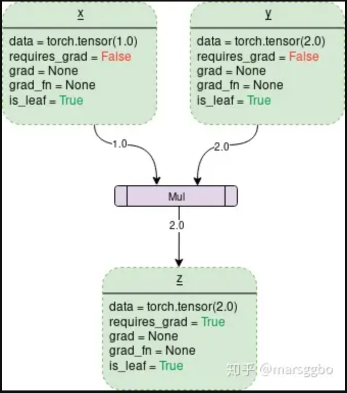

###### datetime:2024/07/19 10:05

###### author:nzb

本项目源于《[动手学深度学习](https://github.com/d2l-ai/d2l-zh)》，添加了一些自己的学习笔记，方便搜索查阅。正版GitHub地址：https://github.com/d2l-ai/d2l-zh

# 自动微分

正如前面微积分中所说，求导是几乎所有深度学习优化算法的关键步骤。
虽然求导的计算很简单，只需要一些基本的微积分。
但对于复杂的模型，手工进行更新是一件很痛苦的事情（而且经常容易出错）。

深度学习框架通过自动计算导数，即*自动微分*（automatic differentiation）来加快求导。
实际中，根据设计好的模型，系统会构建一个*计算图*（computational graph），
来跟踪计算是哪些数据通过哪些操作组合起来产生输出。
自动微分使系统能够随后反向传播梯度。
这里，*反向传播*（backpropagate）意味着跟踪整个计算图，填充关于每个参数的偏导数。

## 一个简单的例子

作为一个演示例子，(**假设我们想对函数$y=2\mathbf{x}^{\top}\mathbf{x}$关于列向量$\mathbf{x}$求导**)。
首先，我们创建变量`x`并为其分配一个初始值。


```python
#@tab pytorch
import torch

x = torch.arange(4.0)
x
```

[**在我们计算$y$关于$\mathbf{x}$的梯度之前，需要一个地方来存储梯度。**]
重要的是，我们不会在每次对一个参数求导时都分配新的内存。
因为我们经常会成千上万次地更新相同的参数，每次都分配新的内存可能很快就会将内存耗尽。
注意，一个标量函数关于向量$\mathbf{x}$的梯度是向量，并且与$\mathbf{x}$具有相同的形状。


```python
#@tab pytorch
x.requires_grad_(True)  # 等价于x=torch.arange(4.0,requires_grad=True)
x.grad  # 默认值是None
```

(**现在计算$y$。**)


```python
#@tab pytorch
y = 2 * torch.dot(x, x)
y
```


`x`是一个长度为4的向量，计算`x`和`x`的点积，得到了我们赋值给`y`的标量输出。
接下来，[**通过调用反向传播函数来自动计算`y`关于`x`每个分量的梯度**]，并打印这些梯度。

```python
#@tab pytorch
y.backward()
x.grad
```

函数$y=2\mathbf{x}^{\top}\mathbf{x}$关于$\mathbf{x}$的梯度应为$4\mathbf{x}$。
让我们快速验证这个梯度是否计算正确。


```python
#@tab pytorch
x.grad == 4 * x
```

[**现在计算`x`的另一个函数。**]


```python
#@tab pytorch
# 在默认情况下，PyTorch会累积梯度，我们需要清除之前的值
x.grad.zero_()
y = x.sum()
y.backward()
x.grad
```


## 非标量变量的反向传播

> 详情请看拓展知识点

当`y`不是标量时，向量`y`关于向量`x`的导数的最自然解释是一个矩阵。
对于高阶和高维的`y`和`x`，求导的结果可以是一个高阶张量。

然而，虽然这些更奇特的对象确实出现在高级机器学习中（包括[**深度学习中**]），
但当调用向量的反向计算时，我们通常会试图计算一批训练样本中每个组成部分的损失函数的导数。
这里(**，我们的目的不是计算微分矩阵，而是单独计算批量中每个样本的偏导数之和。**)


```python
#@tab pytorch
# 对非标量调用backward需要传入一个gradient参数，该参数指定微分函数关于self的梯度。
# 本例只想求偏导数的和，所以传递一个1的梯度是合适的
x.grad.zero_()
y = x * x
# 等价于y.backward(torch.ones(len(x)))
y.sum().backward()
x.grad
```

## 分离计算

有时，我们希望[**将某些计算移动到记录的计算图之外**]。
例如，假设`y`是作为`x`的函数计算的，而`z`则是作为`y`和`x`的函数计算的。
想象一下，我们想计算`z`关于`x`的梯度，但由于某种原因，希望将`y`视为一个常数，
并且只考虑到`x`在`y`被计算后发挥的作用。

这里可以分离`y`来返回一个新变量`u`，该变量与`y`具有相同的值，
但丢弃计算图中如何计算`y`的任何信息。
换句话说，梯度不会向后流经`u`到`x`。
因此，下面的反向传播函数计算`z=u*x`关于`x`的偏导数，同时将`u`作为常数处理，
而不是`z=x*x*x`关于`x`的偏导数。

```python
#@tab pytorch
x.grad.zero_()
y = x * x
u = y.detach()
z = u * x

z.sum().backward()
x.grad == u
```

由于记录了`y`的计算结果，我们可以随后在`y`上调用反向传播，
得到`y=x*x`关于的`x`的导数，即`2*x`。


```python
#@tab pytorch
x.grad.zero_()
y.sum().backward()
x.grad == 2 * x
```

## Python控制流的梯度计算

使用自动微分的一个好处是：
[**即使构建函数的计算图需要通过Python控制流（例如，条件、循环或任意函数调用），我们仍然可以计算得到的变量的梯度**]。
在下面的代码中，`while`循环的迭代次数和`if`语句的结果都取决于输入`a`的值。


```python
#@tab pytorch
def f(a):
    b = a * 2
    while b.norm() < 1000:  # 求范数
        b = b * 2
    if b.sum() > 0:
        c = b
    else:
        c = 100 * b
    return c
```

让我们计算梯度。


```python
#@tab pytorch
a = torch.randn(size=(), requires_grad=True)
d = f(a)
d.backward()
```

我们现在可以分析上面定义的`f`函数。
请注意，它在其输入`a`中是分段线性的。
换言之，对于任何`a`，存在某个常量标量`k`，使得`f(a)=k*a`，其中`k`的值取决于输入`a`，因此可以用`d/a`验证梯度是否正确。


```python
#@tab pytorch
a.grad == d / a
```

## 小结

* 深度学习框架可以自动计算导数：我们首先将梯度附加到想要对其计算偏导数的变量上，然后记录目标值的计算，执行它的反向传播函数，并访问得到的梯度。

## 拓展知识点 Pytorch autograd,backward详解

> 以下笔记基于Pytorch1.0

### Tensor

Pytorch中所有的计算其实都可以回归到Tensor上，所以有必要重新认识一下Tensor。如果我们需要计算某个Tensor的导数，那么我们需要设置其.requires_grad属性为True。为方便说明，在本文中对于这种我们自己定义的变量，我们称之为**叶子节点(leaf nodes)**，而基于叶子节点得到的中间或最终变量则可称之为**结果节点**。例如下面例子中的x则是叶子节点，y则是结果节点。

```python
x = torch.rand(3, requires_grad=True) 
y = x**2
z = x + x
```

另外一个Tensor中通常会记录如下图中所示的属性：

- `data`: 即存储的数据信息
- `requires_grad`: 设置为True则表示该Tensor需要求导
- `grad`: 该Tensor的梯度值，每次在计算backward时都需要将前一时刻的梯度归零，否则梯度值会一直累加，这个会在后面讲到。
- `grad_fn`: 叶子节点通常为`None`，只有结果节点的`grad_fn`才有效，用于指示梯度函数是哪种类型。例如上面示例代码中的`y.grad_fn=<PowBackward0 at 0x213550af048>, z.grad_fn=<AddBackward0 at 0x2135df11be0>`
- `is_leaf`: 用来指示该Tensor是否是叶子节点。



*图片出处：[PyTorch Autograd](https://towardsdatascience.com/pytorch-autograd-understanding-the-heart-of-pytorchs-magic-2686cd94ec95)*

上图中的`z.is_leaf`应该是`False`。原图作者应该是画错了。

### torch.autograd.backward

有如下代码：

```python
x = torch.tensor(1.0, requires_grad=True)
y = torch.tensor(2.0, requires_grad=True)
z = x**2+y
z.backward()
print(z, x.grad, y.grad)

>>> tensor(3., grad_fn=<AddBackward0>) tensor(2.) tensor(1.)
```

可以z是一个标量，当调用它的backward方法后会根据链式法则自动计算出叶子节点的梯度值。

但是如果遇到z是一个向量或者是一个矩阵的情况，这个时候又该怎么计算梯度呢？这种情况我们需要定义grad_tensor来计算矩阵的梯度。在介绍为什么使用之前我们先看一下源代码中backward的接口是如何定义的：

```python
torch.autograd.backward(
		tensors, 
		grad_tensors=None, 
		retain_graph=None, 
		create_graph=False, 
		grad_variables=None)
```

- `tensor`: 用于计算梯度的tensor。也就是说这两种方式是等价的：`torch.autograd.backward(z) == z.backward()`
- `grad_tensors`: 在计算矩阵的梯度时会用到。他其实也是一个tensor，shape一般需要和前面的tensor保持一致。
- `retain_graph`: 通常在调用一次backward后，pytorch会自动把计算图销毁，所以要想对某个变量重复调用backward，则需要将该参数设置为True
- `create_graph`: 当设置为True的时候可以用来计算更高阶的梯度
- `grad_variables`: 这个官方说法是`grad_variables' is deprecated. Use 'grad_tensors' instead.`也就是说这个参数后面版本中应该会丢弃，直接使用grad_tensors就好了。

好了，参数大致作用都介绍了，下面我们看看pytorch为什么设计了grad_tensors这么一个参数，以及它有什么用呢？

还是用代码做个示例


```python
x = torch.ones(2,requires_grad=True)
z = x + 2
z.backward()

>>> ...
RuntimeError: grad can be implicitly created only for scalar outputs
```

当我们运行上面的代码的话会报错，报错信息为`RuntimeError: grad can be implicitly created only for scalar outputs。`

上面的报错信息意思是只有对标量输出它才会计算梯度，而求一个矩阵对另一矩阵的导数束手无策。

$$ X = \begin{bmatrix}x_{0},x_{1}\end{bmatrix}Z = X + 2 = \begin{bmatrix}x_{0}+2,x_{1} + 2\end{bmatrix} \Rightarrow \frac{\partial Z}{\partial X} = ? $$

那么我们只要想办法把矩阵转变成一个标量不就好了？比如我们可以对z求和，然后用求和得到的标量在对x求导，这样不会对结果有影响，例如：

$$ Z_{sum} = \sum z_{i} = x_{0} + x_{1} + 4;then \frac{\partial Zsum}{\partial x_{0}} = \frac{\partial Zsum}{\partial x_{1}} = 1 $$

我们可以看到对z求和后再计算梯度没有报错，结果也与预期一样：

```python
x = torch.ones(2,requires_grad=True)
z = x + 2
z.sum().backward()
print(x.grad)

>>> tensor([1., 1.])
```


我们再仔细想想，对z求和不就是等价于z 点乘一个相同维度的全为1的矩阵吗？即 $$ sum(Z)=dot(Z,I) $$
 ,而这个I也就是我们需要传入的grad_tensors参数。(点乘只是相对于一维向量而言的，对于矩阵或更高为的张量，可以看做是对每一个维度做点乘)

代码如下：

```python
x = torch.ones(2,requires_grad=True)
z = x + 2
z.backward(torch.ones_like(z)) # grad_tensors需要与输入tensor大小一致
print(x.grad)

>>> tensor([1., 1.])
```

弄个再复杂一点的：

```python
x = torch.tensor([2., 1.], requires_grad=True)
y = torch.tensor([[1., 2.], [3., 4.]], requires_grad=True)

z = torch.mm(x.view(1, 2), y)
print(f"z:{z}")
z.backward(torch.Tensor([[1., 0]]), retain_graph=True)
print(f"x.grad: {x.grad}")
print(f"y.grad: {y.grad}")

>>> z:tensor([[5., 8.]], grad_fn=<MmBackward>)
x.grad: tensor([[1., 3.]])
y.grad: tensor([[2., 0.],
        [1., 0.]])
```

结果解释如下：

$$ x = \begin{bmatrix}
x_{1}  & x_{2}
\end{bmatrix} = \begin{bmatrix}
2  & 1
\end{bmatrix}
$$
$$ y = \begin{bmatrix}
 y_{1} & y_{2} \\
 y_{3} & y_{4}
\end{bmatrix} = \begin{bmatrix}
 1 & 2 \\
 3 & 4
\end{bmatrix} 
$$ 
$$ z = torch.mm(x,y) = \begin{bmatrix}
x_{1}  & x_{2}
\end{bmatrix} \begin{bmatrix}
 y_{1} & y_{2} \\
 y_{3} & y_{4}
\end{bmatrix} = \begin{bmatrix}
x_{1}y_{1}+x_{2}y_{3}  & x_{1}y_{2} + x_{2}y_{4}
\end{bmatrix}
$$
$$grad_tensor = \begin{bmatrix}
1  & 0
\end{bmatrix} $$

$$ \Rightarrow z^{'} = z^{'}\begin{bmatrix}
1  & 0
\end{bmatrix} = (x_{1}y_{1}+x_{2}y_{3}) * 1  + (x_{1}y_{2} + x_{2}y_{4}) *0 = x_{1}y_{1}+x_{2}y_{3}  $$

$$ \Rightarrow z^{'}.backward(\begin{bmatrix}
\begin{bmatrix}
1  & 0
\end{bmatrix}
\end{bmatrix}) 
\Longleftrightarrow 
\frac{\partial z^{'}}{\partial x_{1}}  = y_{1} = 1(求偏导数时其他变量看成常量)，
\frac{\partial z^{'}}{\partial x_{2}}  = y_{3} = 3，
\frac{\partial z^{'}}{\partial y_{1}}  = x_{1} = 2，
\frac{\partial z^{'}}{\partial y_{3}}  = x_{2} = 1，
\frac{\partial z^{'}}{\partial y_{2}}  = \frac{\partial z^{'}}{\partial y_{4}} = 0
 $$

总结：

说了这么多，grad_tensors的作用其实可以简单地理解成在求梯度时的权重，因为可能不同值的梯度对结果影响程度不同，所以pytorch弄了个这种接口，而没有固定为全是1。[引用自知乎上的一个评论](https://zhuanlan.zhihu.com/p/29923090)：如果从最后一个节点(总loss)来backward，这种实现**(torch.sum(y*w))**的意义就具体化为 multiple loss term with difference weights 这种需求了吧。

### torch.autograd.grad

```python
torch.autograd.grad(
		outputs, 
		inputs, 
		grad_outputs=None, 
		retain_graph=None, 
		create_graph=False, 
		only_inputs=True, 
		allow_unused=False)
```

看了前面的内容后在看这个函数就很好理解了，各参数作用如下：

- `outputs`: 结果节点，即被求导数
- `inputs`: 叶子节点
- `grad_outputs`: 类似于backward方法中的grad_tensors
- `retain_graph`: 同上
- `create_graph`: 同上
- `only_inputs`: 默认为True, 如果为True, 则只会返回指定input的梯度值。 若为False，则会计算所有叶子节点的梯度，并且将计算得到的梯度累加到各自的.grad属性上去。
- `allow_unused`: 默认为False, 即必须要指定input,如果没有指定的话则报错。

### 参考
- [PyTorch 中 backward() 详解](https://link.zhihu.com/?target=https%3A//www.pytorchtutorial.com/pytorch-backward/)
- [PyTorch 的backward 为什么有一个grad_variables 参数?](https://zhuanlan.zhihu.com/p/29923090)
- [AUTOMATIC DIFFERENTIATION PACKAGE - TORCH.AUTOGRAD](https://link.zhihu.com/?target=https%3A//pytorch.org/docs/stable/autograd.html%23)
- [PyTorch中的backward](https://zhuanlan.zhihu.com/p/27808095)

## 练习

1. 为什么计算二阶导数比一阶导数的开销要更大？
1. 在运行反向传播函数之后，立即再次运行它，看看会发生什么。
1. 在控制流的例子中，我们计算`d`关于`a`的导数，如果将变量`a`更改为随机向量或矩阵，会发生什么？
1. 重新设计一个求控制流梯度的例子，运行并分析结果。
1. 使$f(x)=\sin(x)$，绘制$f(x)$和$\frac{df(x)}{dx}$的图像，其中后者不使用$f'(x)=\cos(x)$。

```python
from d2l import torch as d2l
x = torch.linspace(-5, 5, 100)
x.requires_grad_(True)
y = torch.sin(x)
y.backward(torch.ones_like(x))

d2l.plot(x.detach(), [y.detach(), x.grad], 'f(x)', "f'(x)", legend=['f(x)', 'Tangent line'])
d2l.plt.show()
```

