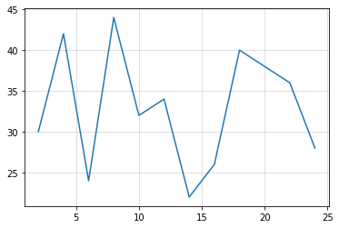
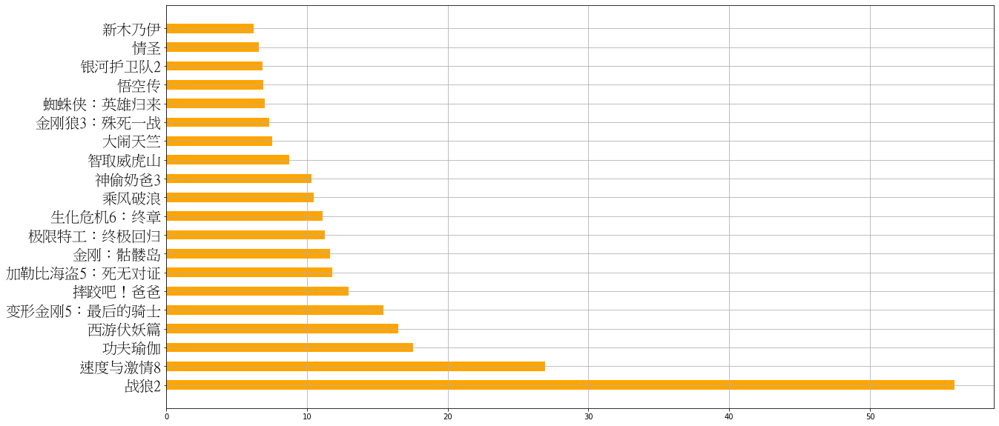

# matplotlib基础

[中文文档](https://www.matplotlib.org.cn/gallery/#lines-bars-and-markers)


```python
import matplotlib.pyplot as plt
import random
import pandas as pd
from matplotlib import font_manager as fm
%matplotlib inline
```

### matplotlib设置中文字体


```python
# 配置中文字体：
my_font = fm.FontProperties(fname=r"C:\Users\Admin\AppData\Local\Microsoft\FontCache\CloudFonts\TTC\107373335009.ttc")
```


```python
x = range(2, 26, 2)   # x轴数据
y = list(range(22, 46, 2))   # y轴数据
random.shuffle(y)
```

# 基本用法
- 双击可查看大图


```python
# 基本用法
plt.plot(x, y)    # 绘制
plt.grid(alpha=0.5)   # 绘制网格（会根据x和y轴的刻度间隔绘制） alpha:透明度：0-1
plt.show()   # 展示
```





# 设置图标大小和分辨率


```python
# 设置图标大小
# figure图形图标的意思，在这里指的是我们画的图
# 通过实例化一个figure并且传递参数，能够在后台自动使用该figure实例
# 在图形模糊的时候可以传入dpi参数，让图形更清晰（每一英寸上的像素点）
fig = plt.figure(figsize=(20, 8), dpi=100)
plt.plot(x, y)
# 图片保存(还可以保存为svg这种矢量图格式，放大不会有锯齿)
# plt.savefig("./t1.png")
plt.show()
```


# 设置x轴和y轴刻度间隔


```python
# 设置x轴和y轴刻度间隔
# 当刻度太密集时候使用列表的步长（间隔取值）来取值，matplotlib会自动帮我们对应
plt.figure(figsize=(25, 15))
plt.subplot(3,3,1)
plt.plot(x, y)
plt.xticks(x)
plt.grid()
# 设置y的刻度
plt.yticks(range(min(y),max(y)+1)[::2])

plt.subplot(3,3,2)
plt.plot(x, y)
plt.xticks(range(2, 26))

plt.subplot(3,3,3)
plt.plot(x, y)
plt.xticks(range(2, 26, 3))

plt.subplot(3,3,4)
plt.plot(x, y)
_xtick_labels = [i+0.5 for i in range(2,26)]
plt.xticks(_xtick_labels)

plt.subplot(3,3,5)
plt.plot(x, y)
_xtick_labels = [i+0.5 for i in range(2,26)]
plt.xticks(_xtick_labels[::3])

plt.subplot(3,3,6)
plt.plot(x, y)
# 需注意x绘制的是2到26的值，超过了就没有可以绘制了
plt.xticks(range(26, 50, 2))

plt.show()
```


```python
# 绘制11点到1点每一分钟的气温变化
tmp = [random.randint(20, 45) for _ in range(120)]
minus = pd.date_range('2020-07-28 11:00:00', '2020-07-28 13:00:00', freq='T')
minus
```


    DatetimeIndex(['2020-07-28 11:00:00', '2020-07-28 11:01:00',
                   '2020-07-28 11:02:00', '2020-07-28 11:03:00',
                   '2020-07-28 11:04:00', '2020-07-28 11:05:00',
                   '2020-07-28 11:06:00', '2020-07-28 11:07:00',
                   '2020-07-28 11:08:00', '2020-07-28 11:09:00',
                   ...
                   '2020-07-28 12:51:00', '2020-07-28 12:52:00',
                   '2020-07-28 12:53:00', '2020-07-28 12:54:00',
                   '2020-07-28 12:55:00', '2020-07-28 12:56:00',
                   '2020-07-28 12:57:00', '2020-07-28 12:58:00',
                   '2020-07-28 12:59:00', '2020-07-28 13:00:00'],
                  dtype='datetime64[ns]', length=121, freq='T')


### x轴和y轴添加描述信息


```python
plt.figure(figsize=(30, 10))
plt.plot(tmp)

# x = range(120)[::2]
# _xtick_labels = ["a{0}".format(i) for i in x]
# plt.xticks(x ,_xtick_labels)

# 刻度字符串映射
# 刻度数据长度和x轴数据长度需对应
# rotation=90旋转90度
plt.xticks(range(120)[::2], minus[::2], rotation=45, fontsize=15)  
plt.yticks(fontsize=20)

plt.xlabel("时间", fontproperties=my_font, fontsize=50)
plt.ylabel("温度", fontproperties=my_font, fontsize=50)
plt.title("11点到1点每一分钟的气温变化",fontproperties=my_font, fontsize=50)

plt.show()
```


# 绘制多次图像很不同图像的差异

- 绘制的时候指定
    - color：颜色
    - linestyle：线条风格
    - linewidth：线条粗细
    - alpha：透明度

| 颜色字符 | 风格字符 |
|-------|----|
| `r`红色 | `-`实线 |
| `g`绿色 | `--`虚线，破折线 |
| `b`蓝色 | `-.`点划线 |
| `w`白色 | `:`点虚线，虚线 |
|  | `''`留空或空格，无线条 |
| `c`青色 |  |
| `m`洋红 |  |
| `y`黄色 |  |
| `k`黑色 |  |
| `#00ff00`16进制 |  |
| `0.8`灰度值字符串 |  |


```python
y_1 = [random.randint(1,50) for _ in range(25)]
y_2 = [random.randint(1,50) for _ in range(25)]
```


```python
plt.figure(figsize=(20,10))

plt.plot(y_1, label="y1的线", linestyle='-.')
plt.plot(y_2, label="y2的线", color='r')

plt.grid(linestyle="--")

# 添加图例(展示上面的label)
# prop：字体
# loc：位置
plt.legend(prop=my_font, loc="best")

plt.show()
```


# 散点图


```python
y1 = [random.randint(20, 45) for _ in range(30)]
y2 = [random.randint(20, 45) for _ in range(30)]

x1 = range(1, 31)
x2 = range(51, 81)

plt.figure(figsize=(20,10),dpi=80)

#散点图
plt.scatter(x1, y1, label="3月份")
plt.scatter(x2, y2, label="10月份")

# 修改x轴刻度
_x = list(x1) + list(x2)
_xtick_label = ["3月{0}日".format(i) for i in x1]
_xtick_label += ["10月{0}日".format(i-50) for i in x2]
plt.xticks(_x[::2], _xtick_label[::2], fontproperties=my_font, rotation=45, fontsize=10)

# 添加描述信息
plt.xlabel("时间", fontproperties=my_font, fontsize=20)
plt.ylabel("温度", fontproperties=my_font, fontsize=20)

# t添加图例
plt.legend(prop=my_font, handlelength=5, handleheight=5, fontsize=50)

plt.show()
```


# 条形图


```python
a = ["战狼2","速度与激情8","功夫瑜伽","西游伏妖篇","变形金刚5：最后的骑士","摔跤吧！爸爸","加勒比海盗5：死无对证","金刚：骷髅岛","极限特工：终极回归","生化危机6：终章","乘风破浪","神偷奶爸3","智取威虎山","大闹天竺","金刚狼3：殊死一战","蜘蛛侠：英雄归来","悟空传","银河护卫队2","情圣","新木乃伊",]
b=[56.01,26.94,17.53,16.49,15.45,12.96,11.8,11.61,11.28,11.12,10.49,10.3,8.75,7.55,7.32,6.99,6.88,6.86,6.58,6.23]

x = range(len(a))

plt.figure(figsize=(20,10))
# width：宽度
plt.bar(x, b, width=0.5)
# 修改x轴信息
plt.xticks(x, a, fontproperties=my_font, fontsize=15, rotation=90)

plt.show()
```


### 横条形图


```python
a = ["战狼2","速度与激情8","功夫瑜伽","西游伏妖篇","变形金刚5：最后的骑士","摔跤吧！爸爸","加勒比海盗5：死无对证","金刚：骷髅岛","极限特工：终极回归","生化危机6：终章","乘风破浪","神偷奶爸3","智取威虎山","大闹天竺","金刚狼3：殊死一战","蜘蛛侠：英雄归来","悟空传","银河护卫队2","情圣","新木乃伊",]
b=[56.01,26.94,17.53,16.49,15.45,12.96,11.8,11.61,11.28,11.12,10.49,10.3,8.75,7.55,7.32,6.99,6.88,6.86,6.58,6.23]

x = range(len(a))

plt.figure(figsize=(20,10))
# height：宽度(因为是横条形图，所以是高度)
plt.barh(x, b, height=0.5, color='orange')
# 修改y轴信息(横条形图)
plt.yticks(x, a, fontproperties=my_font, fontsize=20)
# 网格
plt.grid()
plt.show()
```





### 绘制多次条形图


```python
a = ["猩球崛起3：终极之战","敦刻尔克","蜘蛛侠：英雄归来","战狼2"]
b_16 = [15746,312,4497,319]
b_15 = [12357,156,2045,168]
b_14 = [2358,399,2358,362]

bar_width = 0.2

plt.figure(figsize=(20,10))

x16 = list(range(len(a)))
x15 = [i+bar_width for i in x16]   # 移动2个宽度
x14 = [i+bar_width*2 for i in x16]


plt.bar(x16, b_16, width=bar_width, label="16日票房")
plt.bar(x15, b_15, width=bar_width, label="15日票房")
plt.bar(x14, b_14, width=bar_width, label="14日票房")

# 设置x刻度(因为刻度是在黄色上，即x15对应一下即可，x16和x14对应也可以就是标注会左右移动一点)
plt.xticks(x15, a,fontproperties=my_font, fontsize=25)

plt.grid()
plt.legend(prop=my_font)

plt.show()
```


# 直方图

- 组数：将数据分组，如果数据在100个以内，按数据多少分为5-12组
- 组距：指每个小组的两个端点的距离
- 组数 = 极值 / 组距 = (max(a) - min(a)) / bin_width

### 原始数据

- 如果是统计之后的数据，需要用条形图绘制


```python
a=[131,  98, 125, 131, 124, 139, 131, 117, 128, 108, 135, 138, 131, 102, 107, 114, 119, 128, 121, 142, 127, 130, 124, 101, 110, 116, 117, 110, 128, 128, 115,  99, 136, 126, 134,  95, 138, 117, 111,78, 132, 124, 113, 150, 110, 117,  86,  95, 144, 105, 126, 130,126, 130, 126, 116, 123, 106, 112, 138, 123,  86, 101,  99, 136,123, 117, 119, 105, 137, 123, 128, 125, 104, 109, 134, 125, 127,105, 120, 107, 129, 116, 108, 132, 103, 136, 118, 102, 120, 114,105, 115, 132, 145, 119, 121, 112, 139, 125, 138, 109, 132, 134,156, 106, 117, 127, 144, 139, 139, 119, 140,  83, 110, 102,123,107, 143, 115, 136, 118, 139, 123, 112, 118, 125, 109, 119, 133,112, 114, 122, 109, 106, 123, 116, 131, 127, 115, 118, 112, 135,115, 146, 137, 116, 103, 144,  83, 123, 111, 110, 111, 100, 154,136, 100, 118, 119, 133, 134, 106, 129, 126, 110, 111, 109, 141,120, 117, 106, 149, 122, 122, 110, 118, 127, 121, 114, 125, 126,114, 140, 103, 130, 141, 117, 106, 114, 121, 114, 133, 137,  92,121, 112, 146,  97, 137, 105,  98, 117, 112,  81,  97, 139, 113,134, 106, 144, 110, 137, 137, 111, 104, 117, 100, 111, 101, 110,105, 129, 137, 112, 120, 113, 133, 112,  83,  94, 146, 133, 101,131, 116, 111,  84, 137, 115, 122, 106, 144, 109, 123, 116, 111,111, 133, 150]

plt.figure(figsize=(20, 15))

# 计算组数
bin_width = 3
num_bins = (max(a) - min(a)) // bin_width

# 频数分布直方图
plt.subplot(2,1,1)
# 也可以传一个列表，长度为组数，值为分组依据，当组距不均匀的时候使用
plt.hist(a, num_bins)

# 设置x刻度
plt.xticks(range(min(a), max(a) + bin_width, bin_width))
plt.xlabel("电影时长(分钟)", fontproperties=my_font, fontsize=20)
plt.ylabel("频数", fontproperties=my_font, fontsize=30)
plt.title("频数分布直方图", fontproperties=my_font, fontsize=30)
plt.grid()

# 频率分布直方图（density=1）
plt.subplot(2,1,2)
plt.hist(a, num_bins, density=1)

plt.xticks(range(min(a), max(a) + bin_width, bin_width))
plt.xlabel("电影时长(分钟)", fontproperties=my_font, fontsize=20)
plt.ylabel("频率", fontproperties=my_font, fontsize=30)
plt.title("频率分布直方图", fontproperties=my_font, fontsize=30)
plt.grid()

plt.show()
```


### 统计后数据

- 在美国2004年人口普查发现有124 million的人在离家相对较远的地方工作。根据他们从家到上班地点所需要的时间,通过抽样统计(最后一列)出了下表的数据,这些数据能够绘制成直方图么?


```python
# 还有些疑问
interval = [0,5,10,15,20,25,30,35,40,45,60,90]
width = [5,5,5,5,5,5,5,5,5,15,30,60]
quantity = [836,2737,3723,3926,3596,1438,3273,642,824,613,215,47]

plt.figure(figsize=(20,10), dpi=80)

plt.bar(interval, quantity, width=width)
x = interval
_xtick_label = interval.append(150)
plt.xticks(x, _xtick_label)

# plt.grid()

plt.show()
```


