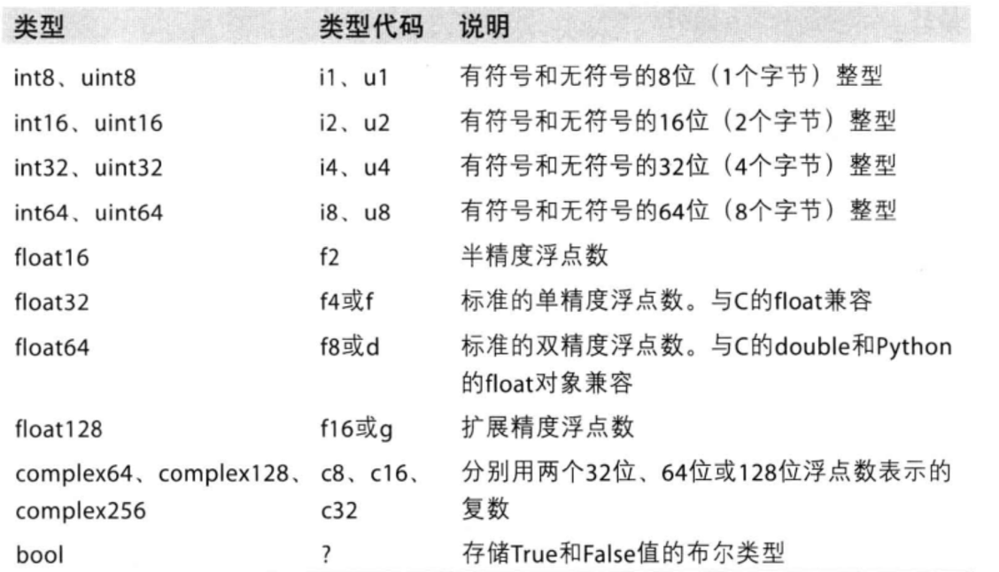
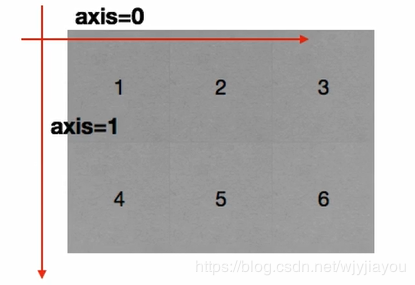
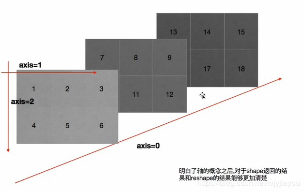
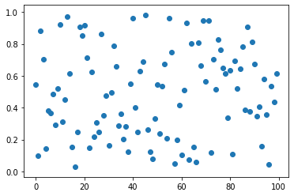

###### datetime:2020/8/1 13:28
###### author:nzb

# numpy基础

- [幕布numpy基础](https://mubu.com/doc5dUHWBcWYxQ)
- [幕布numpy方法](https://mubu.com/doc5-Wv4smcc1Q)

# numpy用于数组计算
[中文文档](https://www.numpy.org.cn/user/quickstart.html#%E5%BF%AB%E9%80%9F%E5%85%A5%E9%97%A8%E6%95%99%E7%A8%8B)


```python
import numpy as np
import random
```

## 创建数组


```python
a1 = np.array([1,2,3])
a2 = np.array(range(5))
a3 = np.arange(8)
a4 = np.array(range(4), dtype='f4')
a5 = np.array([1,0,1,0,1,0], dtype=bool)

print(a1, a2, a3, sep='\n')
print(type(a1), type(a2), type(a3))
print("a3:dtype:", a3.dtype)
print("a4:dtype:", a4.dtype)
print("a5:dtype:", a5.dtype)
print("a1调整dtype前",a1.dtype )
# a1.dtype = 'f2'
a1 = a1.astype('float32')
print("a1调整dtype后",a1.dtype )

print("\n")
# 保留小数点
a6 = np.array([random.random() for _ in range(10)])
print(a6)
print(np.round(a6, 3))
```

    [1 2 3]
    [0 1 2 3 4]
    [0 1 2 3 4 5 6 7]
    <class 'numpy.ndarray'> <class 'numpy.ndarray'> <class 'numpy.ndarray'>
    a3:dtype: int32
    a4:dtype: float32
    a5:dtype: bool
    a1调整dtype前 int32
    a1调整dtype后 float32
    
    
    [0.67067085 0.2306847  0.25868171 0.71041073 0.53141459 0.40654488
     0.62679249 0.51855766 0.30907571 0.63072732]
    [0.671 0.231 0.259 0.71  0.531 0.407 0.627 0.519 0.309 0.631]
    

### 数据类型



## 形状


```python
a7 = np.array([[1,2,3],[4,5,6]])
a8 = np.array([[[1,2,3],[4,5,6]],[[7,8,9],[4,5,6]] ])
print(a3, a7, a8, sep='\n')
print(a3.shape, a7.shape, a8.shape)
```

    [0 1 2 3 4 5 6 7]
    [[1 2 3]
     [4 5 6]]
    [[[1 2 3]
      [4 5 6]]
    
     [[7 8 9]
      [4 5 6]]]
    (8,) (2, 3) (2, 2, 3)
    


```python
a9 = np.arange(12)
# 转换为2维，
print(a9.reshape((3,4)), a9.reshape((2,6)), a9.reshape((2,2,3)), a9.reshape((2,3,2)), sep='\n\n\n')
```

    [[ 0  1  2  3]
     [ 4  5  6  7]
     [ 8  9 10 11]]
    
    
    [[ 0  1  2  3  4  5]
     [ 6  7  8  9 10 11]]
    
    
    [[[ 0  1  2]
      [ 3  4  5]]
    
     [[ 6  7  8]
      [ 9 10 11]]]
    
    
    [[[ 0  1]
      [ 2  3]
      [ 4  5]]
    
     [[ 6  7]
      [ 8  9]
      [10 11]]]
    


```python
print(a9.reshape((12,)),a9.reshape((1,12)), a9.reshape((12,1)), sep='\n\n\n')
```

    [ 0  1  2  3  4  5  6  7  8  9 10 11]
    
    
    [[ 0  1  2  3  4  5  6  7  8  9 10 11]]
    
    
    [[ 0]
     [ 1]
     [ 2]
     [ 3]
     [ 4]
     [ 5]
     [ 6]
     [ 7]
     [ 8]
     [ 9]
     [10]
     [11]]
    


```python
a10 = np.arange(12).reshape((2,2,3))
print(a10, a10.flatten(), sep='\n\n\n')
```

    [[[ 0  1  2]
      [ 3  4  5]]
    
     [[ 6  7  8]
      [ 9 10 11]]]
    
    
    [ 0  1  2  3  4  5  6  7  8  9 10 11]
    

## 计算


```python
a11 = np.arange(12).reshape((3,-1))
```


```python
# nan：没有的意思
# infinity：无限，无穷的意思，所以这里是无限大的意思

print(a11, a11/2, a11/0, sep='\n\n\n')
```

    [[ 0  1  2  3]
     [ 4  5  6  7]
     [ 8  9 10 11]]
    
    
    [[0.  0.5 1.  1.5]
     [2.  2.5 3.  3.5]
     [4.  4.5 5.  5.5]]
    
    
    [[nan inf inf inf]
     [inf inf inf inf]
     [inf inf inf inf]]
    

    C:\Users\Admin\Anaconda3\lib\site-packages\ipykernel_launcher.py:4: RuntimeWarning: divide by zero encountered in true_divide
      after removing the cwd from sys.path.
    C:\Users\Admin\Anaconda3\lib\site-packages\ipykernel_launcher.py:4: RuntimeWarning: invalid value encountered in true_divide
      after removing the cwd from sys.path.
    

#### 维度相同


```python
a12 = np.arange(1,13).reshape((3,4))
a13 = np.arange(11, 23).reshape((3,4))
print(a12, a13, sep='\n'*3)
```

    [[ 1  2  3  4]
     [ 5  6  7  8]
     [ 9 10 11 12]]
    
    
    [[11 12 13 14]
     [15 16 17 18]
     [19 20 21 22]]
    


```python
print("加：", a12 + a13, end="\n"*3)
print("减：", a12 - a13, end="\n"*3)
print("乘：", a12 * a13, end="\n"*3)
print("除：", a12 / a13, end="\n"*3)
```

    加： [[12 14 16 18]
     [20 22 24 26]
     [28 30 32 34]]
    
    
    减： [[-10 -10 -10 -10]
     [-10 -10 -10 -10]
     [-10 -10 -10 -10]]
    
    
    乘： [[ 11  24  39  56]
     [ 75  96 119 144]
     [171 200 231 264]]
    
    
    除： [[0.09090909 0.16666667 0.23076923 0.28571429]
     [0.33333333 0.375      0.41176471 0.44444444]
     [0.47368421 0.5        0.52380952 0.54545455]]
    
    
    

#### 维度不相同
- 需要有一个维度的相同
- 广播原则
    - 如果两个数组的后缘维度（即从末尾开始算起的维度）的轴长度相符或其中一方的长度为1，则认为它们是广播兼容的，广播会在缺失和（或）长度为1的维度上进行


```python
a14 = np.arange(6)
a15 = np.arange(24).reshape((4,6))
a16 = np.arange(4).reshape((4,1))
a17 = np.arange(10)
```


```python
print(a14, a15, a16, a17, sep="\n"*3)
```

    [0 1 2 3 4 5]
    
    
    [[ 0  1  2  3  4  5]
     [ 6  7  8  9 10 11]
     [12 13 14 15 16 17]
     [18 19 20 21 22 23]]
    
    
    [[0]
     [1]
     [2]
     [3]]
    
    
    [0 1 2 3 4 5 6 7 8 9]
    


```python
# 维度不一样时会计算对应位置
print(a15-a14, a15-a16, sep='\n'*3)
```

    [[ 0  0  0  0  0  0]
     [ 6  6  6  6  6  6]
     [12 12 12 12 12 12]
     [18 18 18 18 18 18]]
    
    
    [[ 0  1  2  3  4  5]
     [ 5  6  7  8  9 10]
     [10 11 12 13 14 15]
     [15 16 17 18 19 20]]
    


```python
# 维度不一样时会计算对应位置不一样也不一定可以计算
print(a15-a14, a15-a16, a15-a17, sep='\n'*3)
```


    ---------------------------------------------------------------------------

    ValueError                                Traceback (most recent call last)

    <ipython-input-16-3ad53f5deac4> in <module>
          1 # 维度不一样时会计算对应位置不一样也不一定可以计算
    ----> 2 print(a15-a14, a15-a16, a15-a17, sep='\n'*3)
    

    ValueError: operands could not be broadcast together with shapes (4,6) (10,) 


### 轴

- 二维
    - axis=0：行
    - axis=1：列

- 三维
    - axis=0：行
    - aixs=1：列（每一行的每一列）
    - aixs=2：块（每一行的每一列的每个元素）



```python
print(a10, np.sum(a10, axis=0), np.sum(a10, axis=1), np.sum(a10, axis=2), sep='\n'*3)
```

    [[[ 0  1  2]
      [ 3  4  5]]
    
     [[ 6  7  8]
      [ 9 10 11]]]
    
    
    [[ 6  8 10]
     [12 14 16]]
    
    
    [[ 3  5  7]
     [15 17 19]]
    
    
    [[ 3 12]
     [21 30]]
    

#### 转置


```python
a18 = np.arange(24).reshape((4,6))
print(a18, a18.transpose(), a18.T, a18.swapaxes(1,0), sep='\n'*3)
```

    [[ 0  1  2  3  4  5]
     [ 6  7  8  9 10 11]
     [12 13 14 15 16 17]
     [18 19 20 21 22 23]]
    
    
    [[ 0  6 12 18]
     [ 1  7 13 19]
     [ 2  8 14 20]
     [ 3  9 15 21]
     [ 4 10 16 22]
     [ 5 11 17 23]]
    
    
    [[ 0  6 12 18]
     [ 1  7 13 19]
     [ 2  8 14 20]
     [ 3  9 15 21]
     [ 4 10 16 22]
     [ 5 11 17 23]]
    
    
    [[ 0  6 12 18]
     [ 1  7 13 19]
     [ 2  8 14 20]
     [ 3  9 15 21]
     [ 4 10 16 22]
     [ 5 11 17 23]]
    

### 索引与切片
 [中文文档](https://www.numpy.org.cn/user/quickstart.html#%E7%B4%A2%E5%BC%95%E3%80%81%E5%88%87%E7%89%87%E5%92%8C%E8%BF%AD%E4%BB%A3)


```python
# 一维（前闭后开）
print(a2, a2[0], a2[2:5],a2[::-1], sep='\n'*2)
```

    [0 1 2 3 4]
    
    0
    
    [2 3 4]
    
    [4 3 2 1 0]
    

#### 三个点（ ... ）表示产生完整索引元组所需的冒号。例如，如果 x 是rank为5的数组（即，它具有5个轴），则：

- `x[1,2,...]` 相当于 `x[1,2,:,:,:]`
- `x[...,3]` 等效于 `x[:,:,:,:,3]`
- `x[4,...,5,:]` 等效于 `x[4,:,:,5,:]`


```python
# 多维
print("二维",a12,a12[:2,:2], a12[:, 1:3],a12[[0, 1,2],[1,2,0]], sep='\n'*2)
print("三维",a10, a10[:,:2,:2], a10[1,...],sep='\n'*3)
```

    二维
    
    [[ 1  2  3  4]
     [ 5  6  7  8]
     [ 9 10 11 12]]
    
    [[1 2]
     [5 6]]
    
    [[ 2  3]
     [ 6  7]
     [10 11]]
    
    [2 7 9]
    三维
    
    
    [[[ 0  1  2]
      [ 3  4  5]]
    
     [[ 6  7  8]
      [ 9 10 11]]]
    
    
    [[[ 0  1]
      [ 3  4]]
    
     [[ 6  7]
      [ 9 10]]]
    
    
    [[ 6  7  8]
     [ 9 10 11]]
    


```python
index = np.where(a12 < 5)
print(a12,index, a12[index] ,sep='\n'*2)
```

    [[ 1  2  3  4]
     [ 5  6  7  8]
     [ 9 10 11 12]]
    
    (array([0, 0, 0, 0], dtype=int64), array([0, 1, 2, 3], dtype=int64))
    
    [1 2 3 4]
    


```python
# 小于5的赋值为1，,大于等于5的赋值为0
# 三目运算符
print(np.where(a12 < 5, 1, 0))
```

    [[1 1 1 1]
     [0 0 0 0]
     [0 0 0 0]]
    

### 数据拼接


```python
a1 = np.arange(12).reshape((2,6))
a2 = np.arange(12, 24).reshape((2,6))
```


```python
# 竖直拼接
a3 = np.vstack((a1, a2))
# 水平拼接
a4 = np.hstack((a1, a2))
print(a3, a4, sep="\n"*3)
```

    [[ 0  1  2  3  4  5]
     [ 6  7  8  9 10 11]
     [12 13 14 15 16 17]
     [18 19 20 21 22 23]]
    
    
    [[ 0  1  2  3  4  5 12 13 14 15 16 17]
     [ 6  7  8  9 10 11 18 19 20 21 22 23]]
    

### 行列交换


```python
a3
```


    array([[ 0,  1,  2,  3,  4,  5],
           [ 6,  7,  8,  9, 10, 11],
           [12, 13, 14, 15, 16, 17],
           [18, 19, 20, 21, 22, 23]])


```python
# 行交换
a3[[1,2], :] = a3[[2,1], :]
print("行交换",a3, sep='\n')
# 列交换
a3[:, [0,2]] = a3[:,[2,0]]
print("行交换",a3, sep='\n')
```

    行交换
    [[ 0  1  2  3  4  5]
     [12 13 14 15 16 17]
     [ 6  7  8  9 10 11]
     [18 19 20 21 22 23]]
    行交换
    [[ 2  1  0  3  4  5]
     [14 13 12 15 16 17]
     [ 8  7  6  9 10 11]
     [20 19 18 21 22 23]]
    


```python
import matplotlib.pyplot as plt 
%matplotlib inline
```


```python
a1 = np.random.rand(100)
plt.scatter(range(100), a1)
plt.show()
```





### nan和inf


```python
print(type(np.nan),np.nan == np.nan, np.nan is np.nan, sep="\n"*2)
```

    <class 'float'>
    
    False
    
    True
    


```python
a1 = np.array([1,2,np.nan])
print(a1 != a1, np.count_nonzero(a1 != a1), sep="\n")
print(np.isnan(a1))
print("求和：", np.sum(a1))
a1[np.isnan(a1)]=0
print(a1)
```

    [False False  True]
    1
    [False False  True]
    求和： nan
    [1. 2. 0.]
    


```python
np.isnan(a1) 
```


    array([False, False, False])


```python
a1 = np.array([1,2,np.nan])
a2 = np.arange(12).reshape((3,4)).astype("float")
a2[[1], 2:] = np.nan

```


```python
# 使用了 ~（取补运算符）来过滤 NaN。
a = np.array([np.nan,  1,2,np.nan,3,4,5])  
print (a[~np.isnan(a)])
```

    [1. 2. 3. 4. 5.]
    
