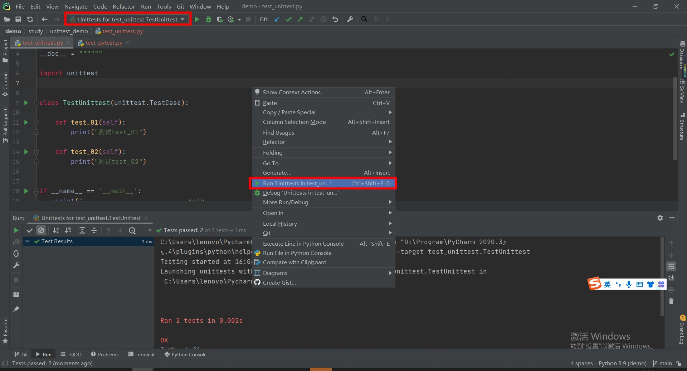
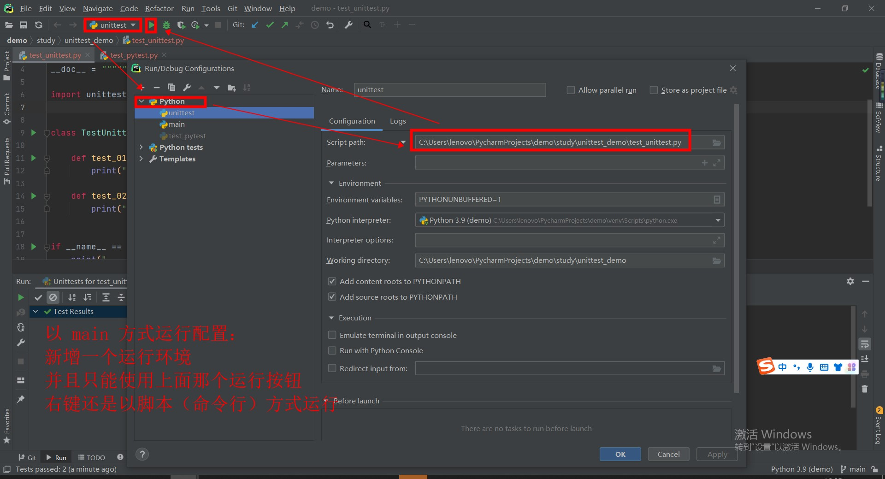

###### datetime:2022/04/12 14:47

###### author:nzb

## 单元测试：unittest 框架基础

### 一、框架详解

- 什么是框架？

  开发者封装好的一个半成品，它已经对基础的代码进行了封装并提供了相应的接口，其他的开发者只需要去调用封装之后的接口即可。 例如：Selenium 框架

- unittest 单元测试框架

  单元测试框架：在编程当中，针对程序的最小单元（函数、方法、类）进行正确性的测试框架。

- 自动化测试框架  
  针对软件封装的系统框架，这个代码框架就是自动化测试框架
    - 作用
        - 提高测试效率，降低维护成本
        - 提高测试准确性，增加代码的重用性和可靠性

  单元测试框架它是自动化测试框架的其中的组成部分，主要用于管理和运行测试用例

### 二、单元测试框架对比

- python(市场使用占比80%)
    - unittest(市场使用占比30%)
    - pytest
- java(市场使用占比20%)
    - junit
    - testing

- unittest与pytest差异
    - 用例编写差异
        - unittest用例规则(耦合，一台unittest)
            - 测试文件必须导包：`import unittest`
            - 测试类必须继承 `unittest.Testcase`
            - 测试方法必须以`test_`开头
        - pytest 用例规则(非耦合)
            - 测试文件必须以 `test_`开头或者`_test`结尾
            - 测试类名必须以`Test`开头
            - 测试方法必须`test_`开头

    - 测试用例的夹具(钩子函数、前后置)
        - unittest
            - `setUp/tearDown`：在测试用例之前和之后执行
            - `setUpClass/tearDownClass`：在测试用例类之前和之后执行
            - `setUpModule/teardownModule`：在测试模块之前和之后执行
        - pytest
            - `setup/teardown`：在测试用例之前和之后执行
            - `setup_class/teardown_class`：在测试用例类之前和之后执行
            - `setup_module/teardown_module`：在测试模块之前和之后执行
            - 其他夹具 pytest 独有：`@pytest.fixtrue()`

    - 断言差异
        - unittest：`self.assertEqual()、self.assertIn()`
        - pytest：`python` 自带的 `assert`

    - 报告
        - unittest：`HtmlTestrunner.py`
        - pytest：`pytest-html、allure插件`

    - 失败重跑
        - unittest：没有
        - pytest：`pytest-rerunfailures`

    - 参数化
        - unittest：ddt
        - pytest：`@pytest.mark.parametrize()`

### 三、单元测试框架作用

- 发现测试用例
- 执行测试用例
- 判断测试用例
- 生成测试报告

### 四、unittest 重要组件

- `TestCase` 测试用例：最小单元，业务逻辑
- `TestSuite` 测试套件：一组测试用例的集合，或者测试套件的集合
- `TestFixtrue` 测试夹具：执行测试用例之前和之后的操作
- `TestLoader` 测试加载器：加载测试用例
- `TestRunner` 测试运行器：运行指定的测试用例

### 五、unittest 实例

单元测试：测试函数
> 光标放置某一函数后面，右键运行，可单独运行该用例
>
> 光标放置某一测试类后面，右键运行，可单独运行该测试类的所有用例

- 为什么没有 main 方法也可以运行呢？

```python
    import unittest
    
    class TestUnittest(unittest.TestCase):
    
        def test_01(self):
            print("测试test_01")
    
        def test_02(self):
            print("测试test_02")
    
    if __name__ == '__main__':
        print("___________________________main___________________________") # 未打印
        unittest.main()
    
```
  输出
```text
    C:\Users\lenovo\PycharmProjects\demo\venv\Scripts\python.exe "D:\Program\PyCharm 2020.3.4\plugins\python\helpers\pycharm\_jb_unittest_runner.py" --target test_unittest.TestUnittest
    Testing started at 15:49 ...
    Launching unittests with arguments python -m unittest test_unittest.TestUnittest in C:\Users\lenovo\PycharmProjects\demo\study\unittest_demo
    
    Ran 2 tests in 0.002s
    
    OK
    测试test_01
    测试test_02
    
    Process finished with exit code 0
    
```

- unittest 运行方式有两种
    - 命令行的运行方式(**右键运行即为默认的测试用例的运行方式，也就是为什么不写 main 也可以运行的原因**)
        - 方式1： `python -m unittest 模块名.py`
            - 例：`python -m unittest test_unittest.py`
        - 方式2：`python -m unittest 模块名.类名.方法名`
        - 方式3：`python -m unittest -v 模块名.py`
            - -v：详细(verbose), 上面简介运行后的 `.` 变成了 `ok`
        - 方式4：`python -m unittest -v 模块名.py -k *_01`
            - -k：通过通配符匹配方法名
      > python -m：以脚本(命令行)的方式来运行(测试用例)
        - 
    - **通过 main 运行**
        ```python
        if __name__ == "__main__":
                    unittest.main()
        ```
        - 

### 六、unittest 的测试用例运行结果

- `.`：成功
- `F`：失败
- `E`：异常
- `s`：跳过
- 以上不能通过 `-v` 的方式运行。因为这是详细的报错方式，不是简洁的报错方式
    
```python
    __date__ = "2022/4/12 15:18"
    
    import unittest

    class TestUnittest(unittest.TestCase):
    
        def test_01(self):
            print("测试 test_01")
    
        def test_02(self):
            print("测试 test_02")
            self.assertEqual(1, 2)
    
        def test_03(self):
            print("测试 test_03")
            raise Exception("报错了")
    
        @unittest.skip("直接跳过")
        def test_04(self):
            print("测试 test_04")
    
    if __name__ == '__main__':
        print("___________________________main___________________________")
        unittest.main()
    
```
```text
    C:\Users\lenovo\PycharmProjects\demo\venv\Scripts\python.exe C:/Users/lenovo/PycharmProjects/demo/study/unittest_demo/test_unittest.py
    ___________________________main___________________________
    测试 test_01
    测试 test_02
    测试 test_03
    .FEs
    ======================================================================
    ERROR: test_03 (__main__.TestUnittest)
    ----------------------------------------------------------------------
    Traceback (most recent call last):
      File "C:\Users\lenovo\PycharmProjects\demo\study\unittest_demo\test_unittest.py", line 20, in test_03
        raise Exception("报错了")
    Exception: 报错了
    
    ======================================================================
    FAIL: test_02 (__main__.TestUnittest)
    ----------------------------------------------------------------------
    Traceback (most recent call last):
      File "C:\Users\lenovo\PycharmProjects\demo\study\unittest_demo\test_unittest.py", line 16, in test_02
        self.assertEqual(1, 2)
    AssertionError: 1 != 2
    
    ----------------------------------------------------------------------
    Ran 4 tests in 0.001s
    
    FAILED (failures=1, errors=1, skipped=1)
    
    Process finished with exit code 1
    
```

### 七、多种 unittest 的加载和运行测试用例的方式

- main 方法

- 通过测试套件来加载和运行

```python
    __date__ = "2022/4/12 16:21"
    
    import unittest
    from unittest_demo.test_unittest import TestUnittest
    
    if __name__ == '__main__':
        # 创建一个测试套件
        suite = unittest.TestSuite()
        # 通过测试套件加载测试用例
        # suite.addTest(TestUnittest("test_01"))
        # suite.addTest(TestUnittest("test_02"))
        test_cases = [TestUnittest("test_01"), TestUnittest("test_02")]
        suite.addTests(test_cases)
        # 运行
        unittest.main(defaultTest='suite')
 
```

- 加载一个目录下所有的用例

```python
    __date__ = "2022/4/12 16:21"
    
    import unittest
    
    if __name__ == '__main__':
        suite = unittest.defaultTestLoader.discover('.', pattern="*.py")
        # suite = unittest.defaultTestLoader.discover('.', pattern="test_unittest.py")
        unittest.main(defaultTest='suite')
    
```

- 为什么调用 unittest.main() 就可以执行测试用例？？？

```python
        class TestProgram(object):
            """A command-line program that runs a set of tests; this is primarily
               for making test modules conveniently executable.
            """
            # defaults for testing
            module=None
            verbosity = 1
            failfast = catchbreak = buffer = progName = warnings = testNamePatterns = None
            _discovery_parser = None
        
            def __init__(self, module='__main__', defaultTest=None, argv=None,
                            testRunner=None, testLoader=loader.defaultTestLoader,
                            exit=True, verbosity=1, failfast=None, catchbreak=None,
                            buffer=None, warnings=None, *, tb_locals=False):
                """
                :param module: 测试用例所在的路径，__main__：默认当前
                :param defaultTest: 默认的待测试的测试用例的名称，默认执行所有用例
                :param argv: 接收外部传递给程序的参数
                :param testRunner: 测试运行器
                :param testLoader: 测试加载器
                :param exit: 是否在测试完成结束之后退出程序
                :param verbosity: 显示信息的详细程度，verbose -v
                    <= 0: 只显示用例的总数和全局的执行结果
                    1: 默认值，显示用例总数和全局结果，并且对每个用例的结果有个标注
                         `.`：成功
                         `F`：失败
                         `E`：异常
                         `s`：跳过
                    >= 2: 显示用例总数和全局结果，并输出每个用例的详解
                :param failfast: 是否在测试用例失败时终止测试
                :param catchbreak: 
                :param buffer: 
                :param warnings: 
                :param tb_locals: 
                """
```

- `TestCase` 测试用例：最小单元，业务逻辑
- `TestSuite` 测试套件：一组测试用例的集合，或者测试套件的集合
    ```python
        # 解析测试用例和测试套件
        elif self.testNames is None:
            self.test = self.testLoader.loadTestsFromModule(self.module)
        else:
            self.test = self.testLoader.loadTestsFromNames(self.testNames,
                                                           self.module)
    ```
- `TestFixtrue` 测试夹具：执行测试用例之前和之后的操作
- `TestLoader` 测试加载器：加载测试用例：
  `__init__`时已经给了默认的加载器
- `TestRunner` 测试运行器：运行指定的测试用例
```python
    if self.testRunner is None:
        self.testRunner = runner.TextTestRunner
```

```python
    # !/usr/bin/env python
    # -*- coding:utf8 -*-
    __date__ = "2022/4/12 16:21"
    
    import unittest
    
    if __name__ == '__main__':
        suite = unittest.defaultTestLoader.discover('.', pattern="*.py")
        unittest.main(defaultTest='suite')
    
        # 一连串的加载相关组件后运行相当于以下运行
        suite = unittest.defaultTestLoader.discover('.', pattern="*.py")
        unittest.TextTestRunner().run(suite)
    
```


