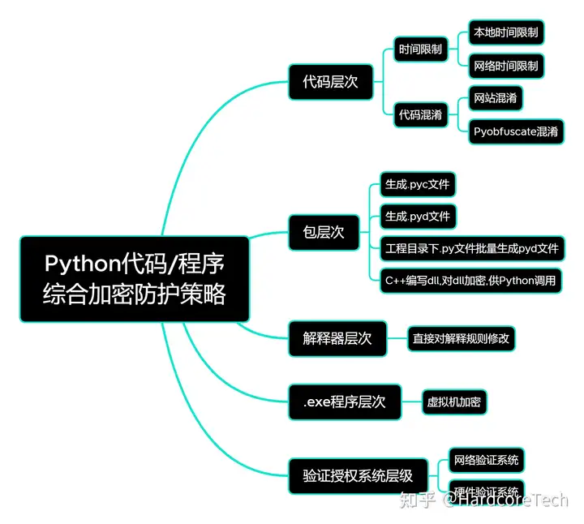

###### datetime:2024/11/19 15:12

###### author:nzb

# Python代码程序综合防护



## 为什么要加密代码/程序呢？

商业活动中，你辛辛苦苦开发出来的软件，本来是你的饭碗，但是别人搞到了你的源码之后，做了一些修改，直接发布，变成了别人的摇钱树，这~~ Rockstar公司的大作GTA5这款游戏虽然达100个G大小，仅仅泄露了300行C++源码，就让R星坐不住了，可见程序保护的重要性。

### 1：时间限制

虽然这是最小儿科的保护的方式，但是也可以帮我们初步建立程序防护思维。 **本地时间限制**就是不联网，使用datetime库，依赖系统时间。 **网络时间限制**，需要联网通过NTP协议获取网络时间。

- 思路：设立一个过期时间戳，检测当下时间，如果当前时间大于设立时间戳，程序自动Crash. 
- 优点：操作简单  
- 缺点：太简单，有基础的人一眼能开出来。单独使用，基本没用

### 2：代码混淆

无论是用网站混淆还是用Pyobfuscate这个库混淆。效果都差不多。 直接看效果： 混淆前：

```python
__all__ = []

class Foo(Bar):
    class_public_var = 'class_public_var'
    _class_public_var = '_class_public_var'
    __class_private_var = 'class_private'
    
    def __init__(self, private):
        self.__class_private_var = private
        
    def public_method(self, arg):
        self.class_public_var = arg
        
    def __class_priv_method(self, arg):
        self.__class_private_var = arg

foo = Foo()
foo.public_method()
```

混淆后：

```python
__all__ =[]#line:1
class O0OO0O00000O0000O (Bar ):#line:3
    class_public_var ='class_public_var'#line:4
    _class_public_var ='_class_public_var'#line:5
    __OO000O00OOO00O0O0 ='class_private'#line:6
    def __init__ (O00OOOO000O0000OO ,O0OO0O000O0OOOO0O ):#line:8
        O00OOOO000O0000OO .__OO000O00OOO00O0O0 =O0OO0O000O0OOOO0O #line:9
    def public_method (O0O0000OO00O00OOO ,OO000O00OOO0OOOO0 ):#line:11
        O0O0000OO00O00OOO .class_public_var =OO000O00OOO0OOOO0 #line:12
    def __O0OO0O0O0000O00OO (O0OOOO0O0O0OOO000 ,OOOOOO0OOOOO0O0O0 ):#line:14
        O0OOOO0O0O0OOO000 .__OO000O00OOO00O0O0 =OOOOOO0OOOOO0O0O0 #line:15
OOOO00000O00O0OOO =O0OO0O00000O0000O ()#line:17
OOOO00000O00O0OOO .public_method ()#line:18
```

- 优点：降低可读性
- 缺点：可看出你的逻辑，只修改了类名，实例名，函数名，变量名，增加破解时间，仅此而已

### 3: 生成pyc文件

先看看把 print("hello world") 生成的pyc文件长什么样子：

```python
610d 0d0a 0000 0000 b053 1964 1400 0000
e300 0000 0000 0000 0000 0000 0000 0000
0002 0000 0040 0000 0073 0c00 0000 6500
6400 8301 0100 6401 5300 2902 7a0b 6865
6c6c 6f20 776f 726c 644e 2901 da05 7072
696e 74a9 0072 0200 0000 7202 0000 00fa
0431 2e70 79da 083c 6d6f 6475 6c65 3e01
0000 00f3 0000 0000
```

- 优点：看起来好厉害
- 缺点：pyc是由Python文件经过编译后所生成的文件，目前已经有非常成熟的针对pyc反编译出py的包, 此加密效果比较感人

### 4: 生成pyd文件

.pyd 文件是由非 Python语言编写编译生成的 Python 扩展模块，是类似 .so .dll 动态链接库的一种 Python 文件。看看同样是print("hello world") 生成的pyd是怎样的？

**pyd文件长得和pyc文件一样，但是大的多，同样的命令，pyd文件大小有195kb**

- 优点：提升运行速度，加密效果好，推荐, **破解门槛很高**,破解需要掌握**逆向和Assembly**,想得到源码无法反编译，**只能反汇编爆破**, 劝退99%的人
- 缺点：如果项目更新需要重新手动迭代。 

### 5: C++代码生成dll文件供python调用(dll可以被vmprotect加密)

这一种方法太硬核，关键代码直接C++写，生成dll，Python再调用。 dll还能通过vmprotect这个虚拟机加密软件加密

- 优点：**提升运行速度同时基本无法破解**
- 缺点：对加密者要求比较高~~熟悉python和C++两种语言，灵活切换 

### 5: .py生成.exe后使用虚拟机加密软件加密

虚拟机加密有名的软件，**vmprotect ，反编译，反汇编，加壳防护，底层汇编代码添加虚假跳转，垃圾指令，无法有效调试......**，效果太过恐怖，劝退 吾爱破解 和 看雪论坛 两大专注逆向的很多大神..
- 优点：一键完成恐怖效果的加密
- 缺点：无 

### 6: 验证系统

其实验证系统本质上来算并不算是加密的领域。**基本上在商业化盈利或者是为了防止别人把软件再未经授权的情况下分享出去，使用的一种注册验证手段.**

最典型的就是有些视频播放软件会绑定你的**机器码**，这属于**硬件验证**；还有的你购买**游戏辅助**时商家给你发的**激活卡密**,属于**网络验证**

### 总结

实际生产中，我们根据实际需求，选择性的混合以上的几种方法. 加密终究是手段，不是目的，过度的加密会显著降低程序运行效率速度，得不偿失。

## 对代码/软件进行时间限制

什么是时间限制？

比如你在使用有的软件，**试用期30天**，到期之后打开会给你一个购买license的提示，不进行购买， **软件自动退出**。
这就属于时间限制.

### 1： 本地时间限制

- 思路：
  - 检测当前时间 current time
  - 设定过期时间 expire time
  - 比较当前时间 和 过期时间
  - 如果：当前时间 < 过期时间: PASS
  - 反之：你想让程序干的事情(比如自动退出，或者提示付费后退出)

- 框架：

```python
import datetime
import sys
import time
import os


current_time = str(datetime.datetime.now())[:-7]
expire_time = "2022-10-21 08:22:59" # 你设置的过期时间

current = time.strptime(str(current_time), '%Y-%m-%d %H:%M:%S')
expire = time.strptime(str(expire_time),"%Y-%m-%d %H:%M:%S")

if expire > current:
    pass
else:
    os.remove("xxxxx.py")# 甚至可以删除自己
    sys.exit() # 程序自动退出
    # 加上让程序一旦检测到过期，
    # 你想执行的所有操作......
    # 高度自定义
```

- 缺点:绕过太简单，直接修改本地系统时间即可。

### 2： 网络时间限制
- 思路：
  - 爬虫爬取网站上的时间得到current time
  - 然后与自己设定的expire time做对比

- 实例代码

```python
import os
import time
import requests

def getNetTime():
    try:
        head = {'User-Agent': 'Mozilla/5.0'}
        url = r'http://time1909.beijing-time.org/time.asp'
        # requests get
        r = requests.get(url=url,headers=head)
        # 检查返回码
        if r.status_code == 200: 
            # 得到返回报文信息
            result = r.text
            # print('r.text:',r.text)
            # 通过;分割文本；
            data = result.split(";")

            # print('data:',data)
            # ======================================================
            # 以下是数据文本处理：切割；
            year = data[1].split('=')[1]    # year=2021
            month = data[2].split('=')[1]
            day = data[3].split('=')[1]
            # wday = data[4].split('=')[1]
            hrs = data[5].split('=')[1]
            minute = data[6].split('=')[1]
            sec = data[7].split('=')[1]
            # ======================================================
            timestr = "%s-%s-%s %s:%s:%s" % (year, month, day, hrs, minute, sec)
            # print(timestr)
            # 将timestr转为时间戳格式；
            timestrp = time.strptime(timestr, "%Y-%m-%d %H:%M:%S")
            #返回时间戳；
            return timestrp
    except:
        return (-1)
        


if __name__ == '__main__':

    expire_time = "2022-10-21 08:22:59"
    expire = time.strptime(str(expire_time),"%Y-%m-%d %H:%M:%S")

    current = getNetTime()

    if current > expire:
        print("Expired!")
        os.remove("xxxxxx.py") 
        sys.exit()
```

- 缺点:成功与否取决于你爬虫的网站是否正常运行，我的这个实例来自于一个小网站，可能你看到我这篇推文的时候网站已经倒闭了~~~~~~~

### 3： NTP协议获取时间

什么是NTP协议？ 网络时间协议，Network Time Protocol（NTP）是用来使计算机时间同步化的一种协议，它可以使计算机对其服务器或时钟源（如石英钟，GPS等等)做同步化，它可以提供高精准度的时间校正（LAN上与标准间差小于1毫秒，WAN上几十毫秒），且可介由加密确认的方式来防止恶毒的协议攻击。NTP的目的是在无序的Internet环境中提供精确和健壮的时间服务。


- 优点:简单灵活，高度自定义时区，服务器遍布全球，并且由国家进行维护。


如何在你的代码中使用NTP协议？ 需要安装ntplib库

```shell
pip install ntplib
```

- 代码框架

```python
import ntplib
from time import ctime
import time


ntp_client = ntplib.NTPClient()
response = ntp_client.request('pool.ntp.org')
time_local = time.localtime(response.tx_time)


current_time = time.strftime("%Y-%m-%d %H:%M:%S",time_local)   
expire_time = "2022-10-21 08:22:59"


if expire_time < current_time:
 print("已过期")
```

**特别注意这一行**

```python
response = ntp_client.request('pool.ntp.org')
```

这里面的网站 **http://pool.ntp.org** 是**全球网址，默认会根据ip地址选择到你的时区**, 如果你需要**自定义到中国的时区**, 里面的网址改为 **http://cn.pool.ntp.org** 如果需要别的时区,
下面列出全球国家ntp服务器网址:

| 国家地区 | 网址 | 国家地区 | 网址 | 国家地区 | 网址 |
| --- | ----- | --- | ----- | --- | ----- |
| 欧洲 | http://europe.pool.ntp.org | 斯洛伐克  | http://sk.pool.ntp.org | 澳大利亚  | http://au.pool.ntp.org |
| 亚洲 | http://asia.pool.ntp.org | 乌克兰  | http://ua.pool.ntp.org | 新西兰  | http://nz.pool.ntp.org |
| 欧洲 | http://europe.pool.ntp.org| 立陶宛  | http://lt.pool.ntp.org | 新喀里多尼亚  | http://nc.pool.ntp.org |
| 奥地利  | http://at.pool.ntp.org| 马其顿 | http://mk.pool.ntp.org |北美 | http://north-america.pool.ntp.org|
| 瑞士  | http://ch.pool.ntp.org| 摩尔多瓦  | http://md.pool.ntp.org | 加拿大  | http://ca.pool.ntp.org |
| 德国  | http://de.pool.ntp.org| 拉脱维亚  | http://lv.pool.ntp.org | 美国  | http://us.pool.ntp.org |
| 丹麦  | http://dk.pool.ntp.org| 克罗地亚  | http://hr.pool.ntp.org | 墨西哥  | http://mx.pool.ntp.org |
| 西班牙  | http://es.pool.ntp.org | 亚洲 | http://asia.pool.ntp.org | 危地马拉  | http://gt.pool.ntp.org |
| 法国  | http://fr.pool.ntp.org | 菲律宾  | http://ph.pool.ntp.org | 巴拿马  | http://pa.pool.ntp.org |
| 意大利  | http://it.pool.ntp.org | 马来西亚  | http://my.pool.ntp.org | 巴哈马  | http://bs.pool.ntp.org |
| 卢森堡  | http://lu.pool.ntp.org | 土耳其  | http://tr.pool.ntp.org | 哥斯达黎加  | http://cr.pool.ntp.org |
| 荷兰  | http://nl.pool.ntp.org | 新加坡  | http://sg.pool.ntp.org | 萨尔瓦多  | http://sv.pool.ntp.org |
| 挪威  | http://no.pool.ntp.org | 印度|http://in.pool.ntp.org | 南美洲| http://south-america.pool.ntp.org|
| 波兰  | http://pl.pool.ntp.org | 香港  | http://hk.pool.ntp.org | 巴西  | http://br.pool.ntp.org |
| 瑞典  | http://se.pool.ntp.org | 日本  | http://jp.pool.ntp.org | 智利  | http://cl.pool.ntp.org |
| 斯洛文尼亚| http://si.pool.ntp.org | 孟加拉国  | http://bd.pool.ntp.org | 阿根廷  | http://ar.pool.ntp.org |
| 英国  | http://uk.pool.ntp.org | 以色列  | http://il.pool.ntp.org | 委内瑞拉  | http://ve.pool.ntp.org |
| 芬兰  | http://fi.pool.ntp.org | 韩国  | http://kr.pool.ntp.org | 非洲 | http://africa.pool.ntp.org |
| 爱尔兰  | http://ie.pool.ntp.org | 泰国  | http://th.pool.ntp.org | 坦桑尼亚  | http://tz.pool.ntp.org |
| 俄罗斯联邦| http://ru.pool.ntp.org | 伊朗  | http://ir.pool.ntp.org | 南非  | http://za.pool.ntp.org |
| 比利时  | http://be.pool.ntp.org | 台湾  | http://tw.pool.ntp.org | 安哥拉  | http://ao.pool.ntp.org |
| 葡萄牙  | http://pt.pool.ntp.org | 中国  | http://cn.pool.ntp.org | 马达加斯加  | http://mg.pool.ntp.org |
| 希腊  | http://gr.pool.ntp.org | 印尼  | http://id.pool.ntp.org | 塞尔维亚共和国  | http://rs.pool.ntp.org |
| 匈牙利  | http://hu.pool.ntp.org | 越南  | http://vn.pool.ntp.org | 波斯尼亚和黑塞哥维那  | http://ba.pool.ntp.org |
| 保加利亚  | http://bg.pool.ntp.org | 巴基斯坦  | http://pk.pool.ntp.org | 大洋洲 | http://oceania.pool.ntp.org |
| 罗马尼亚  | http://ro.pool.ntp.org | 阿曼  | http://om.pool.ntp.org | 北美 |http://north-america.pool.ntp.org |
| 捷克共和国| http://cz.pool.ntp.org | 斯里兰卡  | http://lk.pool.ntp.org | 南美洲|http://south-america.pool.ntp.org|
| 南斯拉夫  | http://yu.pool.ntp.org | 柬埔寨  | http://kh.pool.ntp.org | 非洲 | http://africa.pool.ntp.org       |
| 爱沙尼亚  | http://ee.pool.ntp.org | 卡塔尔  | http://qa.pool.ntp.org | 阿拉伯联合酋长国  | http://ae.pool.ntp.org |
| 白俄罗斯  | http://by.pool.ntp.org | 沙特阿拉伯  | http://sa.pool.ntp.org | 吉尔吉斯斯坦  | http://kg.pool.ntp.org |
| 大洋洲 | http://oceania.pool.ntp.org | 乌兹别克斯坦  | http://uz.pool.ntp.org | |  |

## 代码混淆 ( 网站混淆 & Pyarmor库 混淆)

### 1、什么是代码混淆？

代码混淆是指将代码进行加密、压缩、乱序等操作，使得代码难以被阅读和理解，从而达到保护代码的目的。代码混淆可以有效地防止代码被反编译和盗用，提高代码的安全性。

- Python代码混淆宏观思路
  - 1: 重命名变量名和函数名
  - 2: 删除注释和空格,使用加密算法对代码进行加密.
  - 3: 使用反编译工具对代码进行反编译，查看代码是否容易被破解。
  - 4: 使用代码混淆工具对代码进行混淆，使得代码难以被反编译和盗用。
  - 5: 使用代码压缩工具对代码进行压缩，减小代码的体积，提高代码的运行效率。
  - 6: 使用代码优化工具对代码进行优化，提高代码的运行效率。

### 2、在线网站混淆Python代码：

网址： **https://pyob.oxyry.com**
可以一键无脑混淆，请自行摸索

混淆前：

```python
__all__ = []

class Foo(Bar):
    class_public_var = 'class_public_var'
    _class_public_var = '_class_public_var'
    __class_private_var = 'class_private'
    
    def __init__(self, private):
        self.__class_private_var = private
        
    def public_method(self, arg):
        self.class_public_var = arg
        
    def __class_priv_method(self, arg):
        self.__class_private_var = arg

foo = Foo()
foo.public_method()
```

混淆后：

```python
__all__ =[]#line:1
class O0OOOO0OO0OOOOO0O (Bar ):#line:3
    class_public_var ='class_public_var'#line:4
    _class_public_var ='_class_public_var'#line:5
    __O00O0O0O000O0O000 ='class_private'#line:6
    def __init__ (OO00O0OOOOOOO0000 ,O00OOO000O0O0000O ):#line:8
        OO00O0OOOOOOO0000 .__O00O0O0O000O0O000 =O00OOO000O0O0000O #line:9
    def public_method (OO0OOO0O000O0O00O ,OO0000O000000000O ):#line:11
        OO0OOO0O000O0O00O .class_public_var =OO0000O000000000O #line:12
    def __O0OOOOO0O00OO0000 (OOO0O0OOOO0O00OOO ,O0O00O0OO00OOOOOO ):#line:14
        OOO0O0OOOO0O00OOO .__O00O0O0O000O0O000 =O0O00O0OO00OOOOOO #line:15
OO0O0OO0O0OOOO0O0 =O0OOOO0OO0OOOOO0O ()#line:17
OO0O0OO0O0OOOO0O0 .public_method ()#line:18
```

### 3、使用 Pyarmor 库进行混淆

#### 安装Pyarmor
  
```shell
pip install pyarmor
```

#### 加密混淆
  
```shell
pyarmor obfuscate --recursive --output=dist_dir src_dir
```

- `--recursive` 可选参数，表示递归加密子目录中的Python代码
- `--output=dist_dir`参数表示加密后的Python代码输出到dist_dir目录中
- `src_dir`表示要加密的Python代码所在目录

```text
# 比如一次性加密两个脚本
pyarmor obfuscate a.py b.py
# 运行后自动在目录下生成dist文件夹
# 用来存放加密后的脚本
```

#### 运行混淆代码

```shell
cd dist 进入刚刚生成的文件夹
python a.py
```

> 加密脚本给别人不需要Pyarmor库

#### Pyarmor生成许可文件

许可文件可以**指定过期时间，指定的机器运行.**

假如我们设置名称为L1的license，**功能为限制程序在2023年3月27日过期**，在未加密脚本目录下运行如下命令：

```shell
pyarmor licenses --expired 2023-03-27 L1
```

假如我们设置名称为L2的license，**功能为绑定硬盘信息以及MAC网卡信息**，在未加密脚本目录下运行如下命令：

```shell
# 获取硬件信息
pyarmor hdinfo
# 此时会打印出hardisk信息和MAC信息

# 生成 L2 license
pyarmor licenses --bind-disk "xxx" --bind-mac "xxx" L2
# xxx 填写你刚刚打印出来的硬盘信息和MAC网卡信息
```

假如我们设置名称为L3的license，**综合以上限制时间和绑定机器这两个功能**，在未加密脚本目录下运行如下命令：

```shell
pyarmor licenses --bind-disk "xxx" --bind-mac "xxx" --expired 2023-03-27 L3
```

#### 用生成的license对代码进行加密

比如说我要用上面最强的L3license对2个Python脚本加密

```shell
pyarmor obfuscate --with-license licenses/L3/license.lic a.py b.py
```

效果展示
Before：
```python
print("Hello World")
```

After：
```python
from pytransform import pyarmor_runtime
pyarmor_runtime()
__pyarmor__(__name__, __file__, b'\x50\x59\x41\x52\x4d\x4f\x52\x00\x00\x03\x09\x00\x61\x0d\x0d\x0a\x09\x34\xe0\x02\x00\x00\x00\x00\x01\x00\x00\x00\x40\x00\x00\x00\xd3\x00\x00\x00\x00\x00\x00\x18\xf3\xd0\x2e\xdf\x73\xa4\x07\x19\x67\x81\x80\xcf\x64\x7b\x02\xc7\x00\x00\x00\x00\x00\x00\x00\x00\xc0\x57\x52\x60\x7d\x36\x4f\xc9\xa2\xc5\x6a\x62\xa1\x16\x70\x97\xb9\x68\xda\x9f\x30\xec\x19\x6a\x83\x10\xb9\x14\xdc\x6a\x3a\x28\x57\x59\x10\x53\x5a\xd2\x4e\xa1\x1f\x4d\x1f\x10\x50\x09\x64\x51\x13\xfc\x70\xbf\x4a\xc3\x7c\xb5\xac\x6a\x71\xad\x6a\xda\x9f\xeb\x32\xf5\x98\x97\xe9\x49\x8f\xa6\x11\xe0\x17\x7c\xd4\x5c\xb4\x7f\x25\x49\xa2\x20\xb2\x65\x46\x95\x47\xdc\x13\x4c\x20\x24\xd2\x6e\xcf\x83\x8b\x11\x26\x8c\xae\x37\x65\x3a\x4c\x79\x36\x44\x20\x4c\x2f\x77\x4b\x22\x34\x7d\x57\xd4\xa9\xf1\x16\x35\x59\xed\x6b\xfd\x2d\xd2\x09\x3e\x0c\x25\x33\x01\x61\x18\x90\xde\xaa\xd2\x59\xe6\x65\x46\x2d\x19\xf1\x31\x36\x4d\x64\xaa\xee\x7b\x52\x26\x82\x1e\x23\x15\x2e\x0e\xe2\xb7\x2a\x82\x84\xc8\x9c\xea\x79\x85\x5b\xea\x41\x62\xaf\xb5\x30\x37\xb1\x39\x83\x0d\x74\x34\x42\xc5\xa2\x76\x8f\xda\x45\x25\xc2\xd6\x75\xa9\x6e\xfe\xa5\xde\x44\x43\xd5\xb5\x08\xdb\x21', 2)
```
