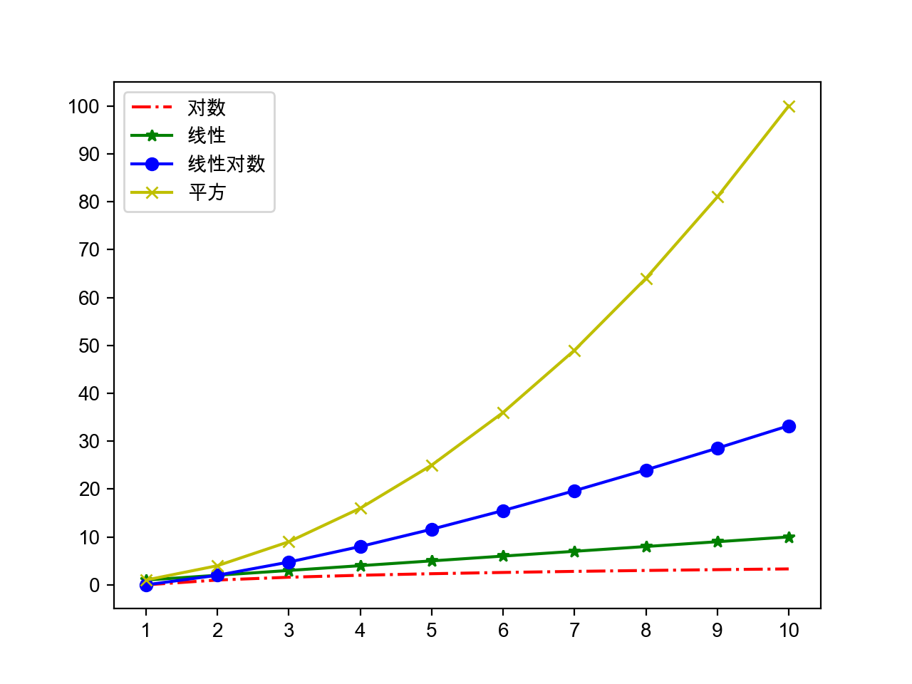

###### datetime:2019/5/15 17:46
###### author:nzb

## 数据结构和算法

   - 算法：解决问题的方法和步骤

   - 评价算法的好坏：渐近时间复杂度和渐近空间复杂度。

   - 渐近时间复杂度的大O标记：
     -  - 常量时间复杂度 - 布隆过滤器 / 哈希存储
     -  - 对数时间复杂度 - 折半查找（二分查找）
     -  - 线性时间复杂度 - 顺序查找 / 桶排序
     -  - 对数线性时间复杂度 - 高级排序算法（归并排序、快速排序）
     -  - 平方时间复杂度 - 简单排序算法（选择排序、插入排序、冒泡排序）
     -  - 立方时间复杂度 - Floyd算法 / 矩阵乘法运算
     -  - 几何级数时间复杂度 - 汉诺塔
     -  - 阶乘时间复杂度 - 旅行经销商问题 - NP

     

     

   - 排序算法（选择、冒泡和归并）和查找算法（顺序和折半）

     ```Python
     def select_sort(origin_items, comp=lambda x, y: x < y):
         """简单选择排序"""
         items = origin_items[:]
         for i in range(len(items) - 1):
             min_index = i
             for j in range(i + 1, len(items)):
                 if comp(items[j], items[min_index]):
                     min_index = j
             items[i], items[min_index] = items[min_index], items[i]
         return items
     ```

     ```Python
     def bubble_sort(origin_items, comp=lambda x, y: x > y):
         """高质量冒泡排序(搅拌排序)"""
         items = origin_items[:]
         for i in range(len(items) - 1):
             swapped = False
             for j in range(i, len(items) - 1 - i):
                 if comp(items[j], items[j + 1]):
                     items[j], items[j + 1] = items[j + 1], items[j]
                     swapped = True
             if swapped:
                 swapped = False
                 for j in range(len(items) - 2 - i, i, -1):
                     if comp(items[j - 1], items[j]):
                         items[j], items[j - 1] = items[j - 1], items[j]
                         swapped = True
             if not swapped:
                 break
         return items
     ```

     ```Python
     def merge_sort(items, comp=lambda x, y: x <= y):
         """归并排序(分治法)"""
         if len(items) < 2:
             return items[:]
         mid = len(items) // 2
         left = merge_sort(items[:mid], comp)
         right = merge_sort(items[mid:], comp)
         return merge(left, right, comp)
     
     
     def merge(items1, items2, comp):
         """合并(将两个有序的列表合并成一个有序的列表)"""
         items = []
         index, index2 = 0, 0
         while index1 < len(items1) and index2 < len(items2):
             if comp(items1[index1], items2[index2]):
                 items.append(items1[index1])
                 index1 += 1
             else:
                 items.append(items2[index2])
                 index2 += 1
         items += items1[index1:]
         items += items2[index2:]
         return items
     ```

     ```Python
     def seq_search(items, key):
         """顺序查找"""
         for index, item in enumerate(items):
             if item == key:
                 return index
         return -1
     ```

     ```Python
     def bin_search(items, key):
         """折半查找"""
         start, end = 0, len(items) - 1
         while start <= end:
             mid = (start + end) // 2
             if key > items[mid]:
                 start = mid + 1
             elif key < items[mid]:
                 end = mid - 1
             else:
                 return mid
         return -1
     ```

   - 使用生成式（推导式）语法

     ```Python
     prices = {
         'AAPL': 191.88,
         'GOOG': 1186.96,
         'IBM': 149.24,
         'ORCL': 48.44,
         'ACN': 166.89,
         'FB': 208.09,
         'SYMC': 21.29
     }
     # 用股票价格大于100元的股票构造一个新的字典
     prices2 = {key: value for key, value in prices.items() if value > 100}
     print(prices2)
     ```

     > 说明：生成式（推导式）可以用来生成列表、集合和字典。

   - 嵌套的列表

     ```Python
     names = ['关羽', '张飞', '赵云', '马超', '黄忠']
     courses = ['语文', '数学', '英语']
     # 录入五个学生三门课程的成绩
     # 错误 - 参考http://pythontutor.com/visualize.html#mode=edit
     # scores = [[None] * len(courses)] * len(names)
     scores = [[None] * len(courses) for _ in range(len(names))]
     for row, name in enumerate(names):
         for col, course in enumerate(courses):
             scores[row][col] = float(input(f'请输入{name}的{course}成绩: '))
             print(scores)
     ```

     [Python Tutor](http://pythontutor.com/) - VISUALIZE CODE AND GET LIVE HELP

   - heapq、itertools等的用法
     ```Python
     """
     从列表中找出最大的或最小的N个元素
     堆结构(大根堆/小根堆)
     """
     import heapq
     
     list1 = [34, 25, 12, 99, 87, 63, 58, 78, 88, 92]
     list2 = [
         {'name': 'IBM', 'shares': 100, 'price': 91.1},
         {'name': 'AAPL', 'shares': 50, 'price': 543.22},
         {'name': 'FB', 'shares': 200, 'price': 21.09},
         {'name': 'HPQ', 'shares': 35, 'price': 31.75},
         {'name': 'YHOO', 'shares': 45, 'price': 16.35},
         {'name': 'ACME', 'shares': 75, 'price': 115.65}
     ]
     print(heapq.nlargest(3, list1))
     print(heapq.nsmallest(3, list1))
     print(heapq.nlargest(2, list2, key=lambda x: x['price']))
     print(heapq.nlargest(2, list2, key=lambda x: x['shares']))
     ```

     ```Python
     """
     迭代工具 - 排列 / 组合 / 笛卡尔积
     """
     import itertools
     
     itertools.permutations('ABCD')
     itertools.combinations('ABCDE', 3)
     itertools.product('ABCD', '123')
     ```

   - collections模块下的工具类

     ```Python
     """
     找出序列中出现次数最多的元素
     """
     from collections import Counter
     
     words = [
         'look', 'into', 'my', 'eyes', 'look', 'into', 'my', 'eyes',
         'the', 'eyes', 'the', 'eyes', 'the', 'eyes', 'not', 'around',
         'the', 'eyes', "don't", 'look', 'around', 'the', 'eyes',
         'look', 'into', 'my', 'eyes', "you're", 'under'
     ]
     counter = Counter(words)
     print(counter.most_common(3))
     ```

   - 常用算法：

     - 穷举法 - 又称为暴力破解法，对所有的可能性进行验证，直到找到正确答案。
     - 贪婪法 - 在对问题求解时，总是做出在当前看来是最好的选择，不追求最优解，快速找到满意解。
     - 分治法 - 把一个复杂的问题分成两个或更多的相同或相似的子问题，再把子问题分成更小的子问题，直到可以直接求解的程度，最后将子问题的解进行合并得到原问题的解。
     - 回溯法 - 回溯法又称为试探法，按选优条件向前搜索，当搜索到某一步发现原先选择并不优或达不到目标时，就退回一步重新选择。
     - 动态规划 - 基本思想也是将待求解问题分解成若干个子问题，先求解并保存这些子问题的解，避免产生大量的重复运算。

     穷举法例子：百钱百鸡和五人分鱼。

     ```Python
     # 公鸡5元一只 母鸡3元一只 小鸡1元三只
     # 用100元买100只鸡 问公鸡/母鸡/小鸡各多少只
     for x in range(20):
         for y in range(33):
             z = 100 - x - y
             if 5 * x + 3 * y + z // 3 == 100 and z % 3 == 0:
                 print(x, y, z)
     
     # A、B、C、D、E五人在某天夜里合伙捕鱼 最后疲惫不堪各自睡觉
     # 第二天A第一个醒来 他将鱼分为5份 扔掉多余的1条 拿走自己的一份
     # B第二个醒来 也将鱼分为5份 扔掉多余的1条 拿走自己的一份
     # 然后C、D、E依次醒来也按同样的方式分鱼 问他们至少捕了多少条鱼
     fish = 1
     while True:
         total = fish
         enough = True
         for _ in range(5):
             if (total - 1) % 5 == 0:
                 total = (total - 1) // 5 * 4
             else:
                 enough = False
                 break
         if enough:
             print(fish)
             break
         fish += 1
     ```

     贪婪法例子：假设小偷有一个背包，最多能装20公斤赃物，他闯入一户人家，发现如下表所示的物品。很显然，他不能把所有物品都装进背包，所以必须确定拿走哪些物品，留下哪些物品。

     |  名称  | 价格（美元） | 重量（kg） |
     | :----: | :----------: | :--------: |
     |  电脑  |     200      |     20     |
     | 收音机 |      20      |     4      |
     |   钟   |     175      |     10     |
     |  花瓶  |      50      |     2      |
     |   书   |      10      |     1      |
     |  油画  |      90      |     9      |

     ```Python
     """
     贪婪法：在对问题求解时，总是做出在当前看来是最好的选择，不追求最优解，快速找到满意解。
     输入：
     20 6
     电脑 200 20
     收音机 20 4
     钟 175 10
     花瓶 50 2
     书 10 1
     油画 90 9
     """
     class Thing(object):
         """物品"""
     
         def __init__(self, name, price, weight):
             self.name = name
             self.price = price
             self.weight = weight
     
         @property
         def value(self):
             """价格重量比"""
             return self.price / self.weight
     
     
     def input_thing():
         """输入物品信息"""
         name_str, price_str, weight_str = input().split()
         return name_str, int(price_str), int(weight_str)
     
     
     def main():
         """主函数"""
         max_weight, num_of_things = map(int, input().split())
         all_things = []
         for _ in range(num_of_things):
             all_things.append(Thing(*input_thing()))
         all_things.sort(key=lambda x: x.value, reverse=True)
         total_weight = 0
         total_price = 0
         for thing in all_things:
             if total_weight + thing.weight <= max_weight:
                 print(f'小偷拿走了{thing.name}')
                 total_weight += thing.weight
                 total_price += thing.price
         print(f'总价值: {total_price}美元')
     
     
     if __name__ == '__main__':
         main()
     ```

     分治法例子：[快速排序](https://zh.wikipedia.org/zh/%E5%BF%AB%E9%80%9F%E6%8E%92%E5%BA%8F)。

     ```Python
     """
     快速排序 - 选择枢轴对元素进行划分，左边都比枢轴小右边都比枢轴大
     """
     def quick_sort(origin_items, comp=lambda x, y: x <= y):
         items = origin_items[:]
         _quick_sort(items, 0, len(items) - 1, comp)
         return items
     
     
     def _quick_sort(items, start, end, comp):
         if start < end:
             pos = _partition(items, start, end, comp)
             _quick_sort(items, start, pos - 1, comp)
             _quick_sort(items, pos + 1, end, comp)
     
     
     def _partition(items, start, end, comp):
         pivot = items[end]
         i = start - 1
         for j in range(start, end):
             if comp(items[j], pivot):
                 i += 1
                 items[i], items[j] = items[j], items[i]
         items[i + 1], items[end] = items[end], items[i + 1]
         return i + 1
     ```

     回溯法例子：[骑士巡逻](https://zh.wikipedia.org/zh/%E9%AA%91%E5%A3%AB%E5%B7%A1%E9%80%BB)。

     ```Python
     """
     递归回溯法：叫称为试探法，按选优条件向前搜索，当搜索到某一步，发现原先选择并不优或达不到目标时，就退回一步重新选择，比较经典的问题包括骑士巡逻、八皇后和迷宫寻路等。
     """
     import sys
     import time
     
     SIZE = 5
     total = 0
     
     
     def print_board(board):
         for row in board:
             for col in row:
                 print(str(col).center(4), end='')
             print()
     
     
     def patrol(board, row, col, step=1):
         if row >= 0 and row < SIZE and \
             col >= 0 and col < SIZE and \
             board[row][col] == 0:
             board[row][col] = step
             if step == SIZE * SIZE:
                 global total
                 total += 1
                 print(f'第{total}种走法: ')
                 print_board(board)
             patrol(board, row - 2, col - 1, step + 1)
             patrol(board, row - 1, col - 2, step + 1)
             patrol(board, row + 1, col - 2, step + 1)
             patrol(board, row + 2, col - 1, step + 1)
             patrol(board, row + 2, col + 1, step + 1)
             patrol(board, row + 1, col + 2, step + 1)
             patrol(board, row - 1, col + 2, step + 1)
             patrol(board, row - 2, col + 1, step + 1)
             board[row][col] = 0
     
     
     def main():
         board = [[0] * SIZE for _ in range(SIZE)]
         patrol(board, SIZE - 1, SIZE - 1)
     
     
     if __name__ == '__main__':
         main()
     ```

     动态规划例子1：[斐波拉切数列]()。（不使用动态规划将会是几何级数复杂度）

     ```Python
     """
     动态规划 - 适用于有重叠子问题和最优子结构性质的问题
     使用动态规划方法所耗时间往往远少于朴素解法(用空间换取时间)
     """
     def fib(num, temp={}):
         """用递归计算Fibonacci数"""
         if num in (1, 2):
             return 1
         try:
             return temp[num]
         except KeyError:
             temp[num] = fib(num - 1) + fib(num - 2)
             return temp[num]
     ```

     动态规划例子2：子列表元素之和的最大值。（使用动态规划可以避免二重循环）

     > 说明：子列表指的是列表中索引（下标）连续的元素构成的列表；列表中的元素是int类型，可能包含正整数、0、负整数；程序输入列表中的元素，输出子列表元素求和的最大值，例如：
     >
     > 输入：1 -2 3 5 -3 2
     >
     > 输出：8
     >
     > 输入：0 -2 3 5 -1 2
     >
     > 输出：9
     >
     > 输入：-9 -2 -3 -5 -3
     >
     > 输出：-2

     ```Python
     def main():
         items = list(map(int, input().split()))
         size = len(items)
         overall, partial = {}, {}
         overall[size - 1] = partial[size - 1] = items[size - 1]
         for i in range(size - 2, -1, -1):
             partial[i] = max(items[i], partial[i + 1] + items[i])
             overall[i] = max(partial[i], overall[i + 1])
         print(overall[0])
     
     
     if __name__ == '__main__':
         main()
     ```
