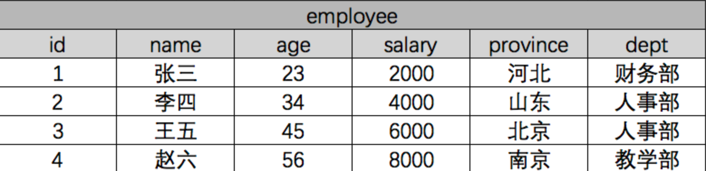
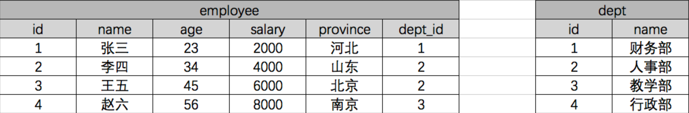

###### datetime:2019/6/12 16:47
###### author:nzb

## Django ORM相关操作

### 一般操作

[官方文档](https://docs.djangoproject.com/en/1.11/ref/models/querysets/)

#### 必知必会13条

    <1> all():                 查询所有结果
     
    <2> filter(**kwargs):      它包含了与所给筛选条件相匹配的对象
     
    <3> get(**kwargs):         返回与所给筛选条件相匹配的对象，返回结果有且只有一个，如果符合筛选条件的对象超过一个或者没有都会抛出错误。
     
    <4> exclude(**kwargs):     它包含了与所给筛选条件不匹配的对象
     
    <5> values(*field):        返回一个ValueQuerySet——一个特殊的QuerySet，运行后得到的并不是一系列model的实例化对象，而是一个可迭代的字典序列
     
    <6> values_list(*field):   它与values()非常相似，它返回的是一个元组序列，values返回的是一个字典序列
     
    <7> order_by(*field):      对查询结果排序
     
    <8> reverse():             对查询结果反向排序，请注意reverse()通常只能在具有已定义顺序的QuerySet上调用(在model类的Meta中指定ordering或调用order_by()方法)。
     
    <9> distinct():            从返回结果中剔除重复纪录(如果你查询跨越多个表，可能在计算QuerySet时得到重复的结果。此时可以使用distinct()，注意只有在PostgreSQL中支持按字段去重。)
     
    <10> count():              返回数据库中匹配查询(QuerySet)的对象数量。
     
    <11> first():              返回第一条记录
     
    <12> last():               返回最后一条记录
     
    <13> exists():             如果QuerySet包含数据，就返回True，否则返回False

##### 返回QuerySet对象的方法有

    all()
    
    filter()
    
    exclude()
    
    order_by()
    
    reverse()
    
    distinct()

##### 特殊QuerySet

    values()       返回一个可迭代的字典序列
    
    values_list() 返回一个可迭代的元祖序列

##### 返回具体对象的

    get()
    
    first()
    
    last()

##### 返回布尔值的方法有

    exists()

##### 返回数字的方法有

    count()

#### 单表查询之神奇的双下划线

    models.Tb1.objects.filter(id__lt=10, id__gt=1)   # 获取id大于1 且 小于10的值
     
    models.Tb1.objects.filter(id__in=[11, 22, 33])   # 获取id等于11、22、33的数据
    models.Tb1.objects.exclude(id__in=[11, 22, 33])  # not in
     
    models.Tb1.objects.filter(name__contains="ven")  # 获取name字段包含"ven"的
    models.Tb1.objects.filter(name__icontains="ven") # icontains大小写不敏感
     
    models.Tb1.objects.filter(id__range=[1, 3])      # id范围是1到3的，等价于SQL的bettwen and
     
    类似的还有：startswith，istartswith, endswith, iendswith　
    
    date字段还可以：
    models.Class.objects.filter(first_day__year=2017)

### ForeignKey操作

#### 正向查找

##### 对象查找(跨表)

语法：

对象.关联字段.字段

示例：

    book_obj = models.Book.objects.first()  # 第一本书对象
    print(book_obj.publisher)  # 得到这本书关联的出版社对象
    print(book_obj.publisher.name)  # 得到出版社对象的名称

##### 字段查找(跨表)

语法：

关联字段__字段

示例：

    print(models.Book.objects.values_list("publisher__name"))

#### 反向操作

##### 对象查找

语法：

obj.表名_set

示例：

    publisher_obj = models.Publisher.objects.first()  # 找到第一个出版社对象
    books = publisher_obj.book_set.all()  # 找到第一个出版社出版的所有书
    titles = books.values_list("title")  # 找到第一个出版社出版的所有书的书名

##### 字段查找

语法：

表名__字段

示例：

    titles = models.Publisher.objects.values_list("book__title")

### ManyToManyField

#### class RelatedManager

"关联管理器"是在一对多或者多对多的关联上下文中使用的管理器。

它存在于下面两种情况：

- 外键关系的反向查询
- 多对多关联关系

简单来说就是当 点后面的对象 可能存在多个的时候就可以使用以下的方法。

##### 方法

**create()**

创建一个新的对象，保存对象，并将它添加到关联对象集之中，返回新创建的对象。

    >>> import datetime
    >>> models.Author.objects.first().book_set.create(title="番茄物语", publish_date=datetime.date.today())

**add()**

把指定的model对象添加到关联对象集中。

添加对象

    >>> author_objs = models.Author.objects.filter(id__lt=3)
    >>> models.Book.objects.first().authors.add(*author_objs)

添加id

    >>> models.Book.objects.first().authors.add(*[1, 2])

**set()**

更新model对象的关联对象。

    >>> book_obj = models.Book.objects.first()
    >>> book_obj.authors.set([2, 3])

**remove()**

从关联对象集中移除执行的model对象

    >>> book_obj = models.Book.objects.first()
    >>> book_obj.authors.remove(3)

**clear()**

从关联对象集中移除一切对象。

    >>> book_obj = models.Book.objects.first()
    >>> book_obj.authors.clear()

注意：

对于ForeignKey对象，clear()和remove()方法仅在null=True时存在。

举个例子：

ForeignKey字段没设置null=True时，

```python
    class Book(models.Model):
        title = models.CharField(max_length=32)
        publisher = models.ForeignKey(to=Publisher)
```

没有clear()和remove()方法：

    >>> models.Publisher.objects.first().book_set.clear()
    Traceback (most recent call last):
      File "<input>", line 1, in <module>
    AttributeError: 'RelatedManager' object has no attribute 'clear'

当ForeignKey字段设置null=True时，

```python
    class Book(models.Model):
        name = models.CharField(max_length=32)
        publisher = models.ForeignKey(to=Class, null=True)
```

此时就有clear()和remove()方法：

    >>> models.Publisher.objects.first().book_set.clear()
 

注意：

- 对于所有类型的关联字段，add()、create()、remove()和clear(),set()都会马上更新数据库。换句话说，在关联的任何一端，都不需要再调用save()方法。

### 聚合查询和分组查询

#### 聚合

aggregate()是QuerySet 的一个终止子句，意思是说，它返回一个包含一些键值对的字典。

键的名称是聚合值的标识符，值是计算出来的聚合值。键的名称是按照字段和聚合函数的名称自动生成出来的。

用到的内置函数：
```python
    from django.db.models import Avg, Sum, Max, Min, Count
```

示例：

    >>> from django.db.models import Avg, Sum, Max, Min, Count
    >>> models.Book.objects.all().aggregate(Avg("price"))
    {'price__avg': 13.233333}
    
如果你想要为聚合值指定一个名称，可以向聚合子句提供它。

    >>> models.Book.objects.aggregate(average_price=Avg('price'))
    {'average_price': 13.233333}
    
如果你希望生成不止一个聚合，你可以向aggregate()子句中添加另一个参数。所以，如果你也想知道所有图书价格的最大值和最小值，可以这样查询：

    >>> models.Book.objects.all().aggregate(Avg("price"), Max("price"), Min("price"))
    {'price__avg': 13.233333, 'price__max': Decimal('19.90'), 'price__min': Decimal('9.90')}

#### 分组

我们在这里先复习一下SQL语句的分组。

假设现在有一张公司职员表：


我们使用原生SQL语句，按照部分分组求平均工资：

    select dept,AVG(salary) from employee group by dept;

ORM查询:
```python
    from django.db.models import Avg
    Employee.objects.values("dept").annotate(avg=Avg("salary").values(dept, "avg")
```

连表查询的分组：


SQL查询：

    select dept.name,AVG(salary) from employee inner join dept on (employee.dept_id=dept.id) group by dept_id;

ORM查询：
```python
    from django.db.models import Avg
    models.Dept.objects.annotate(avg=Avg("employee__salary")).values("name", "avg")
```

##### 更多示例

示例1：统计每一本书的作者个数

    >>> book_list = models.Book.objects.all().annotate(author_num=Count("author"))
    >>> for obj in book_list:
    ...     print(obj.author_num)
    ...
    2
    1
    1

示例2：统计出每个出版社买的最便宜的书的价格

    >>> publisher_list = models.Publisher.objects.annotate(min_price=Min("book__price"))
    >>> for obj in publisher_list:
    ...     print(obj.min_price)
    ...     
    9.90
    19.90

方法二：

    >>> models.Book.objects.values("publisher__name").annotate(min_price=Min("price"))
    <QuerySet [{'publisher__name': '沙河出版社', 'min_price': Decimal('9.90')}, {'publisher__name': '人民出版社', 'min_price': Decimal('19.90')}]>

示例3：统计不止一个作者的图书

    >>> models.Book.objects.annotate(author_num=Count("author")).filter(author_num__gt=1)
    <QuerySet [<Book: 番茄物语>]>

示例4：根据一本图书作者数量的多少对查询集 QuerySet进行排序

    >>> models.Book.objects.annotate(author_num=Count("author")).order_by("author_num")
    <QuerySet [<Book: 香蕉物语>, <Book: 橘子物语>, <Book: 番茄物语>]>

示例5：查询各个作者出的书的总价格

    >>> models.Author.objects.annotate(sum_price=Sum("book__price")).values("name", "sum_price")
    <QuerySet [{'name': '小精灵', 'sum_price': Decimal('9.90')}, {'name': '小仙女', 'sum_price': Decimal('29.80')}, {'name': '小魔女', 'sum_price': Decimal('9.90')}]>

### F查询和Q查询

#### F查询

在上面所有的例子中，我们构造的过滤器都只是将字段值与某个常量做比较。如果我们要对两个字段的值做比较，那该怎么做呢？

Django 提供 F() 来做这样的比较。F() 的实例可以在查询中引用字段，来比较同一个 model 实例中两个不同字段的值。

示例1：

查询评论数大于收藏数的书籍
```python
    from django.db.models import F
    models.Book.objects.filter(commnet_num__gt=F('keep_num'))
```

Django 支持 F() 对象之间以及 F() 对象和常数之间的加减乘除和取模的操作。
```python
    models.Book.objects.filter(commnet_num__lt=F('keep_num')*2)
```

修改操作也可以使用F函数,比如将每一本书的价格提高30元
```python
    models.Book.objects.all().update(price=F("price")+30)
```

**引申：**

如果要修改char字段咋办？

如：把所有书名后面加上(第一版)

    >>> from django.db.models.functions import Concat
    >>> from django.db.models import Value
    >>> models.Book.objects.all().update(title=Concat(F("title"), Value("("), Value("第一版"), Value(")")))

#### Q查询

filter() 等方法中的关键字参数查询都是一起进行“AND” 的。 如果你需要执行更复杂的查询（例如OR语句），你可以使用Q对象。

示例1：

查询作者名是小仙女或小魔女的
````python
    models.Book.objects.filter(Q(authors__name="小仙女")|Q(authors__name="小魔女"))
````

你可以组合& 和|  操作符以及使用括号进行分组来编写任意复杂的Q 对象。同时，Q 对象可以使用~ 操作符取反，这允许组合正常的查询和取反(NOT) 查询。

示例：查询作者名字是小仙女并且不是2018年出版的书的书名。

    >>> models.Book.objects.filter(Q(author__name="小仙女") & ~Q(publish_date__year=2018)).values_list("title")
    <QuerySet [('番茄物语',)]>
    
查询函数可以混合使用Q 对象和关键字参数。所有提供给查询函数的参数（关键字参数或Q 对象）都将"AND”在一起。但是，如果出现Q 对象，它必须位于所有关键字参数的前面。

例如：查询出版年份是2017或2018，书名中带物语的所有书。

    >>> models.Book.objects.filter(Q(publish_date__year=2018) | Q(publish_date__year=2017), title__icontains="物语")
    <QuerySet [<Book: 番茄物语>, <Book: 香蕉物语>, <Book: 橘子物语>]>

### 锁和事务

#### 锁

select_for_update(nowait=False, skip_locked=False)

返回一个锁住行直到事务结束的查询集，如果数据库支持，它将生成一个 SELECT ... FOR UPDATE 语句。

举个例子：

    entries = Entry.objects.select_for_update().filter(author=request.user)

所有匹配的行将被锁定，直到事务结束。这意味着可以通过锁防止数据被其它事务修改。

一般情况下如果其他事务锁定了相关行，那么本查询将被阻塞，直到锁被释放。 如果这不想要使查询阻塞的话，使用select_for_update(nowait=True)。 如果其它事务持有冲突的锁, 那么查询将引发 DatabaseError 异常。你也可以使用select_for_update(skip_locked=True)忽略锁定的行。 nowait和skip_locked是互斥的，同时设置会导致ValueError。

目前，postgresql，oracle和mysql数据库后端支持select_for_update()。 但是，MySQL不支持nowait和skip_locked参数。

使用不支持这些选项的数据库后端（如MySQL）将nowait=True或skip_locked=True转换为select_for_update()将导致抛出DatabaseError异常，这可以防止代码意外终止。

#### 事务

```python
    import os
    
    if __name__ == '__main__':
        os.environ.setdefault("DJANGO_SETTINGS_MODULE", "BMS.settings")
        import django
        django.setup()
    
        import datetime
        from app01 import models
    
        try:
            from django.db import transaction
            with transaction.atomic():
                new_publisher = models.Publisher.objects.create(name="火星出版社")
                models.Book.objects.create(title="橘子物语", publish_date=datetime.date.today(), publisher_id=10)  # 指定一个不存在的出版社id
        except Exception as e:
            print(str(e))
```

### 其他鲜为人知的操作(了解为主)
#### Django ORM执行原生SQL
##### 执行原生查询

##### 直接执行自定义SQL

#### QuerySet方法大全

### Django终端打印SQL语句

### 在Python脚本中调用Django环境
