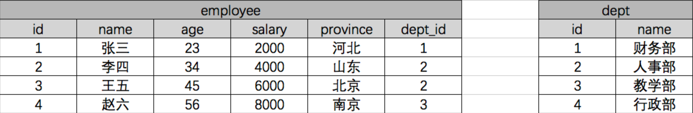

###### datetime:2019/6/12 16:47
###### author:nzb

## Django ORM相关操作

### 一般操作

[官方文档](https://docs.djangoproject.com/en/1.11/ref/models/querysets/)

#### 必知必会13条

    <1> all():                 查询所有结果
     
    <2> filter(**kwargs):      它包含了与所给筛选条件相匹配的对象
     
    <3> get(**kwargs):         返回与所给筛选条件相匹配的对象，返回结果有且只有一个，如果符合筛选条件的对象超过一个或者没有都会抛出错误。
     
    <4> exclude(**kwargs):     它包含了与所给筛选条件不匹配的对象
     
    <5> values(*field):        返回一个ValueQuerySet——一个特殊的QuerySet，运行后得到的并不是一系列model的实例化对象，而是一个可迭代的字典序列，需要哪些字段就写进去。
     
    <6> values_list(*field):   它与values()非常相似，它返回的是一个元组序列，values返回的是一个字典序列
     
    <7> order_by(*field):      对查询结果排序
     
    <8> reverse():             对查询结果反向排序，请注意reverse()通常只能在具有已定义顺序的QuerySet上调用(在model类的Meta中指定ordering或调用order_by()方法)。
     
    <9> distinct():            从返回结果中剔除重复纪录(如果你查询跨越多个表，可能在计算QuerySet时得到重复的结果。此时可以使用distinct()，注意只有在PostgreSQL中支持按字段去重。)
     
    <10> count():              返回数据库中匹配查询(QuerySet)的对象数量。
     
    <11> first():              返回第一条记录
     
    <12> last():               返回最后一条记录
     
    <13> exists():             如果QuerySet包含数据，就返回True，否则返回False

values()方法例子：


##### 返回QuerySet对象的方法有

    all()
    
    filter()
    
    exclude()
    
    order_by()
    
    reverse()
    
    distinct()

##### 特殊QuerySet

    values()       返回一个可迭代的字典序列
    
    values_list() 返回一个可迭代的元祖序列

##### 返回具体对象的

    get()
    
    first()
    
    last()

##### 返回布尔值的方法有

    exists()

##### 返回数字的方法有

    count()

#### 单表查询之神奇的双下划线

    models.Tb1.objects.filter(id__lt=10, id__gt=1)   # 获取id大于1 且 小于10的值
     
    models.Tb1.objects.filter(id__in=[11, 22, 33])   # 获取id等于11、22、33的数据
    models.Tb1.objects.exclude(id__in=[11, 22, 33])  # not in
     
    models.Tb1.objects.filter(name__contains="ven")  # 获取name字段包含"ven"的
    models.Tb1.objects.filter(name__icontains="ven") # icontains大小写不敏感
     
    models.Tb1.objects.filter(id__range=[1, 3])      # id范围是1到3的，等价于SQL的bettwen and
     
    类似的还有：startswith，istartswith, endswith, iendswith　
    
    date字段还可以：
    models.Class.objects.filter(first_day__year=2017)

### ForeignKey操作


#### 正向查找

##### 对象查找(跨表)

    这是对对象进行操作，不能values()和values_list()
    
语法：

**对象.关联字段.字段**

示例：

    book_obj = models.Book.objects.first()  # 第一本书对象
    print(book_obj.publisher)  # 得到这本书关联的出版社对象
    print(book_obj.publisher.name)  # 得到出版社对象的名称

##### 字段查找(跨表)

    这是对QuerySet进行操作，可以 values()和values_list()

语法：

**关联字段__字段**

示例：

    print(models.Book.objects.values_list("publisher__name"))  # 双下划线表示跨表

#### 反向操作

##### 对象查找

语法：

**obj.表名_set**

示例：

    publisher_obj = models.Publisher.objects.first()  # 找到第一个出版社对象
    books = publisher_obj.book_set.all()  # 找到第一个出版社出版的所有书
    titles = books.values_list("title")  # 找到第一个出版社出版的所有书的书名
    
如果外键字段设置了：related_name：用于获取关联对象的关联管理器对象（反向查询），如果不允许反向，该属性应该被设置为`'+'`，或者以`'+'`结尾。
    
例子：

    course = models.ForeignKey(Course, verbose_name=u'课程', on_delete=models.CASCADE, related_name='course')
语法：

    未设置：
        **obj.表名_set**
    设置：
        **obj.course** 

##### 字段查找

语法：

**表名__字段**
  
示例：

    titles = models.Publisher.objects.values_list("book__title")

### OneToOneField
    
当一张表的某些字段查询的比较繁琐，另外一些字段查询的不是特别繁琐，把不怎么常用的字段单独拿出来做成一张表，然后用一对一关联起来。    

优势：

- 既保证数据能完整的保存下来，有能保证大部分的检索更快。

用法：

    OneToOneField(to="")

例子：
```python
    作者
    class Author(models.Model):
        name = models.CharField(max_length=12)
        age = models.IntegerField()
        phone = models.IntegerField()
        detail = models.OneToOneField(to="AuthorDetail")
    
        def __str__(self):
            return self.name
    
    作者详情    
    class AuthorDetail(models.Model):
        爱好
        hobby = models.CharField(max_length=32)
        地址
        addr = models.CharField(max_length=128)
```

### ManyToManyField

#### class RelatedManager

"关联管理器"是在一对多或者多对多的关联上下文中使用的管理器。

它存在于下面两种情况：

- 外键关系的反向查询
- 多对多关联关系

简单来说就是当 点后面的对象 可能存在多个的时候就可以使用以下的方法。

##### 方法

**create()**

创建一个新的对象，保存对象，并将它添加到关联对象集之中，返回新创建的对象。

    >>> import datetime
    >>> models.Author.objects.first().book_set.create(title="番茄物语", publish_date=datetime.date.today())

**add()**

把指定的model对象添加到关联对象集中。

添加对象

    >>> author_objs = models.Author.objects.filter(id__lt=3)
    >>> models.Book.objects.first().authors.add(*author_objs)

添加id

    >>> models.Book.objects.first().authors.add(*[1, 2])

**set()**

更新model对象的关联对象。

    >>> book_obj = models.Book.objects.first()
    >>> book_obj.authors.set([2, 3])

**remove()**

从关联对象集中移除执行的model对象

    >>> book_obj = models.Book.objects.first()
    >>> book_obj.authors.remove(3)

**clear()**

从关联对象集中移除一切对象。

    >>> book_obj = models.Book.objects.first()
    >>> book_obj.authors.clear()

注意：

对于ForeignKey对象，clear()和remove()方法仅在null=True时存在。

举个例子：

ForeignKey字段没设置null=True时，

```python
    class Book(models.Model):
        title = models.CharField(max_length=32)
        publisher = models.ForeignKey(to=Publisher)
```

没有clear()和remove()方法：

    >>> models.Publisher.objects.first().book_set.clear()
    Traceback (most recent call last):
      File "<input>", line 1, in <module>
    AttributeError: 'RelatedManager' object has no attribute 'clear'

当ForeignKey字段设置null=True时，

```python
    class Book(models.Model):
        name = models.CharField(max_length=32)
        publisher = models.ForeignKey(to=Class, null=True)
```

此时就有clear()和remove()方法：

    >>> models.Publisher.objects.first().book_set.clear()
 

注意：

- 对于所有类型的关联字段，add()、create()、remove()和clear(),set()都会马上更新数据库。换句话说，在关联的任何一端，都不需要再调用save()方法。

#### 自己创建第三张表

多对多的方式
    
- ORM自动创建第三种表

- 自己创建第三张表，利用外键分别关联作者和书
    
    关联查询比较麻烦，因为没办法使用ORM提供的便利方法

- 自己创建第三张表，使用ORM 的ManyToManyField() 

    使用此种方式创建多对多表的时候，没有add()、remove()等方法
    而是直接操作第三张表

使用方法(依情况而定)：
    
1. 如果你第三张表没有额外的字段，就用第一种
2. 如果你第三张表有额外的字段，就用第三种或第一种

```python
    # 作者
    class Author(models.Model):
        name = models.CharField(max_length=12)
        age = models.IntegerField()
        phone = models.IntegerField()
        # 通过through="AuthorBook",through_fields=("author", "book") 来指定使用我创建的第三张表来构建多对多的关系，而不是django自动创建的
        book = models.ManyToManyField(to="Book", through="AuthorBook", through_fields=("author", "book"))
        # through_field中，第一个字段，多对多设置在哪一张表里，第三张表通过什么字段找到这张表，就把这个字段写在前面，有关联关系的才要写进去
        detail = models.OneToOneField(to="AuthorDetail")
    
        def __str__(self):
            return self.name
            
    # 书
    class Book(models.Model):
        name = models.CharField(max_length=50)
        
            
    # 自己创建作者和书关联的第三张表
    # 此时，在ORM层面 作者和书就没有多对多的关系了
    class AuthorBook(models.Model):
        # 作者id
        author = models.ForeignKey(to="Author")
        # 书id 
        book = models.ForeignKey(to="Book")
        # 其他字段
        info = models.CharField(max_length=12)
        
        class Meta:
            # 作者id和书id联合唯一
            unique_together = ('author', 'book')
       
```

### 聚合查询和分组查询

#### 聚合

aggregate()是QuerySet 的一个终止子句，意思是说，它返回一个包含一些键值对的字典。

键的名称是聚合值的标识符，值是计算出来的聚合值。键的名称是按照字段和聚合函数的名称自动生成出来的。

用到的内置函数：
```python
    from django.db.models import Avg, Sum, Max, Min, Count
```

示例：

    >>> from django.db.models import Avg, Sum, Max, Min, Count
    >>> models.Book.objects.all().aggregate(Avg("price"))
    {'price__avg': 13.233333}
    
如果你想要为聚合值指定一个名称，可以向聚合子句提供它。

    >>> models.Book.objects.aggregate(average_price=Avg('price'))
    {'average_price': 13.233333}
    
如果你希望生成不止一个聚合，你可以向aggregate()子句中添加另一个参数。所以，如果你也想知道所有图书价格的最大值和最小值，可以这样查询：

    >>> models.Book.objects.all().aggregate(Avg("price"), Max("price"), Min("price"))
    {'price__avg': 13.233333, 'price__max': Decimal('19.90'), 'price__min': Decimal('9.90')}

#### 分组

我们在这里先复习一下SQL语句的分组。

假设现在有一张公司职员表：


我们使用原生SQL语句，按照部分分组求平均工资：

    select dept,AVG(salary) from employee group by dept;

ORM查询:
```python
    from django.db.models import Avg
    Employee.objects.values("dept").annotate(avg=Avg("salary").values("dept", "avg")
    # values()就是取哪些字段，同时具有分组的作用。
```

连表查询的分组：


SQL查询：

    select dept.name,AVG(salary) from employee inner join dept on (employee.dept_id=dept.id) group by dept_id;

ORM查询：
```python
    from django.db.models import Avg
    
    models.Employee.objects.values('dept_id').annotate(avg=Avg('salary')).values('dept__name', 'avg')
    # 或
    models.Dept.objects.annotate(avg=Avg("employee__salary")).values("name", "avg")
```

##### extra()方法分组

```python
extra(select=None, where=None, params=None, 
      tables=None, order_by=None, select_params=None)
```

有些情况下，Django的查询语法难以简单的表达复杂的 WHERE 子句，对于这种情况, Django 提供了 extra() QuerySet修改机制 — 它能在 QuerySet生成的SQL从句中注入新子句

extra可以指定一个或多个 参数,例如 select, where or tables. 这些参数都不是必须的，但是你至少要使用一个!要注意这些额外的方式对不同的数据库引擎可能存在移植性问题.(因为你在显式的书写SQL语句),除非万不得已,尽量避免这样做

- 参数之select

    The select 参数可以让你在 SELECT 从句中添加其他字段信息，它应该是一个字典，存放着属性名到 SQL 从句的映射。

    ```python
    queryResult=models.Article
    　　　　　　　　　　　.objects.extra(select={'is_recent': "create_time > '2017-09-05'"})
    ```
    结果集中每个 Entry 对象都有一个额外的属性is_recent, 它是一个布尔值，表示 Article对象的create_time 是否晚于2017-09-05.
    ```python
    article_obj=models.Article.objects.filter(nid=1).extra(select={"standard_time":"strftime('%%Y-%%m-%%d',create_time)"}).values("standard_time","nid","title")
    print(article_obj)
    # <QuerySet [{'title': 'MongoDb 入门教程', 'standard_time': '2017-09-03', 'nid': 1}]>
    ```
- 参数之where / tables

    您可以使用where定义显式SQL WHERE子句 - 也许执行非显式连接。您可以使用tables手动将表添加到SQL FROM子句。

    where和tables都接受字符串列表。所有where参数均为“与”任何其他搜索条件。
    
    ```python
    queryResult=models.Article.objects.extra(where=['nid in (1,3) OR title like "py%" ','nid>2'])
    ```
    
- 运用
    - 按日查询
    ```python
    ret = Spenging.objects.extra(select={'date':"DATE_FORMAT(date,'%%Y-%%m-%%d')"}).values("date").annotate(total=Sum("money")).values("date", "total")
    ```
    - 按月查询
    ```python
    ret = Spenging.objects.extra(select={'date':"DATE_FORMAT(date,'%%Y-%%m')"}).values("date").annotate(total=Sum("money")).values("date", "total")
    ```
    - 按年查询
    ```python
    ret = Spenging.objects.extra(select={'date':"DATE_FORMAT(date,'%%Y')"}).values("date").annotate(total=Sum("money")).values("date", "total")
    ```

##### 更多示例

示例1：统计每一本书的作者个数

    >>> book_list = models.Book.objects.all().annotate(author_num=Count("author"))
    >>> for obj in book_list:
    ...     print(obj.author_num)
    ...
    2
    1
    1

示例2：统计出每个出版社买的最便宜的书的价格

    >>> publisher_list = models.Publisher.objects.annotate(min_price=Min("book__price"))
    >>> for obj in publisher_list:
    ...     print(obj.min_price)
    ...     
    9.90
    19.90

方法二：

    >>> models.Book.objects.values("publisher__name").annotate(min_price=Min("price"))
    <QuerySet [{'publisher__name': '沙河出版社', 'min_price': Decimal('9.90')}, {'publisher__name': '人民出版社', 'min_price': Decimal('19.90')}]>

示例3：统计不止一个作者的图书

    >>> models.Book.objects.annotate(author_num=Count("author")).filter(author_num__gt=1)
    <QuerySet [<Book: 番茄物语>]>

示例4：根据一本图书作者数量的多少对查询集 QuerySet进行排序

    >>> models.Book.objects.annotate(author_num=Count("author")).order_by("author_num")
    <QuerySet [<Book: 香蕉物语>, <Book: 橘子物语>, <Book: 番茄物语>]>

示例5：查询各个作者出的书的总价格

    >>> models.Author.objects.annotate(sum_price=Sum("book__price")).values("name", "sum_price")
    <QuerySet [{'name': '小精灵', 'sum_price': Decimal('9.90')}, {'name': '小仙女', 'sum_price': Decimal('29.80')}, {'name': '小魔女', 'sum_price': Decimal('9.90')}]>

示例6：查询动态最多的组织并排序

    >>> model.Organization.objects.filter(is_del=False, userdynamic__is_pass=2).annotate(dynamic_nums=Count('userdynamic__org')).order_by('-dynamic_nums').all()

### F查询和Q查询

#### F查询

在上面所有的例子中，我们构造的过滤器都只是将字段值与某个常量做比较。如果我们要对两个字段的值做比较，那该怎么做呢？

Django 提供 F() 来做这样的比较。F() 的实例可以在查询中引用字段，来比较同一个 model 实例中两个不同字段的值。

示例1：

查询评论数大于收藏数的书籍
```python
    from django.db.models import F
    models.Book.objects.filter(commnet_num__gt=F('keep_num'))
```

Django 支持 F() 对象之间以及 F() 对象和常数之间的加减乘除和取模的操作。
```python
    models.Book.objects.filter(commnet_num__lt=F('keep_num')*2)
```

修改操作也可以使用F函数,比如将每一本书的价格提高30元
```python
    models.Book.objects.all().update(price=F("price")+30)
```

**引申：**

如果要修改char字段咋办？

如：把所有书名后面加上：(第一版)

    >>> from django.db.models.functions import Concat
    >>> from django.db.models import Value
    >>> models.Book.objects.all().update(title=Concat(F("title"), Value("("), Value("第一版"), Value(")")))

#### Q查询

filter() 等方法中的关键字参数查询都是一起进行“AND” 的。 如果你需要执行更复杂的查询（例如OR语句），你可以使用Q对象。

示例1：

查询作者名是小仙女或小魔女的
````python
    models.Book.objects.filter(Q(authors__name="小仙女")|Q(authors__name="小魔女"))
````

你可以组合& 和|  操作符以及使用括号进行分组来编写任意复杂的Q 对象。同时，Q 对象可以使用~ 操作符取反，这允许组合正常的查询和取反(NOT) 查询。

示例：查询作者名字是小仙女并且不是2018年出版的书的书名。

    >>> models.Book.objects.filter(Q(author__name="小仙女") & ~Q(publish_date__year=2018)).values_list("title")
    <QuerySet [('番茄物语',)]>
    
**查询函数可以混合使用Q 对象和关键字参数。所有提供给查询函数的参数（关键字参数或Q 对象）都将"AND”在一起。但是，如果出现Q 对象，它必须位于所有关键字参数的前面。**

例如：查询出版年份是2017或2018，书名中带物语的所有书。

    >>> models.Book.objects.filter(Q(publish_date__year=2018) | Q(publish_date__year=2017), title__icontains="物语")
    <QuerySet [<Book: 番茄物语>, <Book: 香蕉物语>, <Book: 橘子物语>]>

### 锁和事务

#### 锁

select_for_update(nowait=False, skip_locked=False)

返回一个锁住行直到事务结束的查询集，如果数据库支持，它将生成一个 SELECT ... FOR UPDATE 语句。

举个例子：

    entries = Entry.objects.select_for_update().filter(author=request.user)

所有匹配的行将被锁定，直到事务结束。这意味着可以通过锁防止数据被其它事务修改。

一般情况下如果其他事务锁定了相关行，那么本查询将被阻塞，直到锁被释放。 如果这不想要使查询阻塞的话，使用select_for_update(nowait=True)。 如果其它事务持有冲突的锁, 那么查询将引发 DatabaseError 异常。你也可以使用select_for_update(skip_locked=True)忽略锁定的行。 nowait和skip_locked是互斥的，同时设置会导致ValueError。

目前，postgresql，oracle和mysql数据库后端支持select_for_update()。 但是，MySQL不支持nowait和skip_locked参数。

使用不支持这些选项的数据库后端（如MySQL）将nowait=True或skip_locked=True转换为select_for_update()将导致抛出DatabaseError异常，这可以防止代码意外终止。

#### 事务

```python
    import os
    
    if __name__ == '__main__':
        os.environ.setdefault("DJANGO_SETTINGS_MODULE", "BMS.settings")
        import django
        django.setup()
    
        import datetime
        from app01 import models
    
        try:
            from django.db import transaction
            with transaction.atomic():
                new_publisher = models.Publisher.objects.create(name="火星出版社")
                models.Book.objects.create(title="橘子物语", publish_date=datetime.date.today(), publisher_id=10)  # 指定一个不存在的出版社id
        except Exception as e:
            print(str(e))
```

### 其他鲜为人知的操作(了解为主)

#### Django_ORM执行原生SQL

在模型查询API不够用的情况下，我们还可以使用原始的SQL语句进行查询。

Django 提供两种方法使用原始SQL进行查询：一种是使用raw()方法，进行原始SQL查询并返回模型实例；另一种是完全避开模型层，直接执行自定义的SQL语句。

##### 执行原生查询

raw()管理器方法用于原始的SQL查询，并返回模型的实例：

注意：raw()语法查询必须包含主键。

这个方法执行原始的SQL查询，并返回一个django.db.models.query.RawQuerySet 实例。 这个RawQuerySet 实例可以像一般的QuerySet那样，通过迭代来提供对象实例。

举个例子：
```python
    class Person(models.Model):
        first_name = models.CharField(...)
        last_name = models.CharField(...)
        birth_date = models.DateField(...)
```
可以像下面这样执行原生SQL语句

    >>> for p in Person.objects.raw('SELECT * FROM myapp_person'):
    ...     print(p)
    
raw()查询可以查询其他表的数据。

举个例子：
```python
    ret = models.Student.objects.raw('select id, tname as hehe from app02_teacher')
        for i in ret:
            print(i.id, i.hehe)
```

raw()方法自动将查询字段映射到模型字段。还可以通过translations参数指定一个把查询的字段名和ORM对象实例的字段名互相对应的字典

```python
    d = {'tname': 'haha'}
    ret = models.Student.objects.raw('select * from app02_teacher', translations=d)
    for i in ret:
        print(i.id, i.sname, i.haha)
```

原生SQL还可以使用参数，注意不要自己使用字符串格式化拼接SQL语句，防止SQL注入！
```python
    d = {'tname': 'haha'}
    ret = models.Student.objects.raw('select * from app02_teacher where id > %s', translations=d, params=[1,])
    for i in ret:
        print(i.id, i.sname, i.haha)
```

##### 直接执行自定义SQL

有时候raw()方法并不十分好用，很多情况下我们不需要将查询结果映射成模型，或者我们需要执行DELETE、 INSERT以及UPDATE操作。在这些情况下，我们可以直接访问数据库，完全避开模型层。

我们可以直接从django提供的接口中获取数据库连接，然后像使用pymysql模块一样操作数据库。
```python
    from django.db import connection, connections
    cursor = connection.cursor()  # cursor = connections['default'].cursor()
    cursor.execute("""SELECT * from auth_user where id = %s""", [1])
    ret = cursor.fetchone()
```

#### QuerySet方法大全

```python
    ##################################################################
    # PUBLIC METHODS THAT ALTER ATTRIBUTES AND RETURN A NEW QUERYSET #
    ##################################################################
    
    def all(self)
        # 获取所有的数据对象
    
    def filter(self, *args, **kwargs)
        # 条件查询
        # 条件可以是：参数，字典，Q
    
    def exclude(self, *args, **kwargs)
        # 条件查询
        # 条件可以是：参数，字典，Q
    
    def select_related(self, *fields)
        性能相关：表之间进行join连表操作，一次性获取关联的数据。
    
        总结：
        1. select_related主要针一对一和多对一关系进行优化。
        2. select_related使用SQL的JOIN语句进行优化，通过减少SQL查询的次数来进行优化、提高性能。
    
    def prefetch_related(self, *lookups)
        性能相关：多表连表操作时速度会慢，使用其执行多次SQL查询在Python代码中实现连表操作。
    
        总结：
        1. 对于多对多字段（ManyToManyField）和一对多字段，可以使用prefetch_related()来进行优化。
        2. prefetch_related()的优化方式是分别查询每个表，然后用Python处理他们之间的关系。
    
    def annotate(self, *args, **kwargs)
        # 用于实现聚合group by查询
    
        from django.db.models import Count, Avg, Max, Min, Sum
    
        v = models.UserInfo.objects.values('u_id').annotate(uid=Count('u_id'))
        # SELECT u_id, COUNT(ui) AS `uid` FROM UserInfo GROUP BY u_id
    
        v = models.UserInfo.objects.values('u_id').annotate(uid=Count('u_id')).filter(uid__gt=1)
        # SELECT u_id, COUNT(ui_id) AS `uid` FROM UserInfo GROUP BY u_id having count(u_id) > 1
    
        v = models.UserInfo.objects.values('u_id').annotate(uid=Count('u_id',distinct=True)).filter(uid__gt=1)
        # SELECT u_id, COUNT( DISTINCT ui_id) AS `uid` FROM UserInfo GROUP BY u_id having count(u_id) > 1
    
    def distinct(self, *field_names)
        # 用于distinct去重
        models.UserInfo.objects.values('nid').distinct()
        # select distinct nid from userinfo
    
        注：只有在PostgreSQL中才能使用distinct进行去重
    
    def order_by(self, *field_names)
        # 用于排序
        models.UserInfo.objects.all().order_by('-id','age')
    
    def extra(self, select=None, where=None, params=None, tables=None, order_by=None, select_params=None)
        # 构造额外的查询条件或者映射，如：子查询
    
        Entry.objects.extra(select={'new_id': "select col from sometable where othercol > %s"}, select_params=(1,))
        Entry.objects.extra(where=['headline=%s'], params=['Lennon'])
        Entry.objects.extra(where=["foo='a' OR bar = 'a'", "baz = 'a'"])
        Entry.objects.extra(select={'new_id': "select id from tb where id > %s"}, select_params=(1,), order_by=['-nid'])
    
     def reverse(self):
        # 倒序
        models.UserInfo.objects.all().order_by('-nid').reverse()
        # 注：如果存在order_by，reverse则是倒序，如果多个排序则一一倒序
    
    
     def defer(self, *fields):
        models.UserInfo.objects.defer('username','id')
        或
        models.UserInfo.objects.filter(...).defer('username','id')
        #映射中排除某列数据
    
     def only(self, *fields):
        #仅取某个表中的数据
         models.UserInfo.objects.only('username','id')
         或
         models.UserInfo.objects.filter(...).only('username','id')
    
     def using(self, alias):
         指定使用的数据库，参数为别名（setting中的设置）
    
    
    ##################################################
    # PUBLIC METHODS THAT RETURN A QUERYSET SUBCLASS #
    ##################################################
    
    def raw(self, raw_query, params=None, translations=None, using=None):
        # 执行原生SQL
        models.UserInfo.objects.raw('select * from userinfo')
    
        # 如果SQL是其他表时，必须将名字设置为当前UserInfo对象的主键列名
        models.UserInfo.objects.raw('select id as nid from 其他表')
    
        # 为原生SQL设置参数
        models.UserInfo.objects.raw('select id as nid from userinfo where nid>%s', params=[12,])
    
        # 将获取的到列名转换为指定列名
        name_map = {'first': 'first_name', 'last': 'last_name', 'bd': 'birth_date', 'pk': 'id'}
        Person.objects.raw('SELECT * FROM some_other_table', translations=name_map)
    
        # 指定数据库
        models.UserInfo.objects.raw('select * from userinfo', using="default")
    
        ################### 原生SQL ###################
        from django.db import connection, connections
        cursor = connection.cursor()  # cursor = connections['default'].cursor()
        cursor.execute("""SELECT * from auth_user where id = %s""", [1])
        row = cursor.fetchone() # fetchall()/fetchmany(..)
    
    
    def values(self, *fields):
        # 获取每行数据为字典格式
    
    def values_list(self, *fields, **kwargs):
        # 获取每行数据为元祖
    
    def dates(self, field_name, kind, order='ASC'):
        # 根据时间进行某一部分进行去重查找并截取指定内容
        # kind只能是："year"（年）, "month"（年-月）, "day"（年-月-日）
        # order只能是："ASC"  "DESC"
        # 并获取转换后的时间
            - year : 年-01-01
            - month: 年-月-01
            - day  : 年-月-日
    
        models.DatePlus.objects.dates('ctime','day','DESC')
    
    def datetimes(self, field_name, kind, order='ASC', tzinfo=None):
        # 根据时间进行某一部分进行去重查找并截取指定内容，将时间转换为指定时区时间
        # kind只能是 "year", "month", "day", "hour", "minute", "second"
        # order只能是："ASC"  "DESC"
        # tzinfo时区对象
        models.DDD.objects.datetimes('ctime','hour',tzinfo=pytz.UTC)
        models.DDD.objects.datetimes('ctime','hour',tzinfo=pytz.timezone('Asia/Shanghai'))
    
        """
        pip3 install pytz
        import pytz
        pytz.all_timezones
        pytz.timezone(‘Asia/Shanghai’)
        """
    
    def none(self):
        # 空QuerySet对象
    
    
    ####################################
    # METHODS THAT DO DATABASE QUERIES #
    ####################################
    
    def aggregate(self, *args, **kwargs):
       # 聚合函数，获取字典类型聚合结果
       from django.db.models import Count, Avg, Max, Min, Sum
       result = models.UserInfo.objects.aggregate(k=Count('u_id', distinct=True), n=Count('nid'))
       ===> {'k': 3, 'n': 4}
    
    def count(self):
       # 获取个数
    
    def get(self, *args, **kwargs):
       # 获取单个对象
    
    def create(self, **kwargs):
       # 创建对象
    
    def bulk_create(self, objs, batch_size=None):
        # 批量插入
        # batch_size表示一次插入的个数
        objs = [
            models.DDD(name='r11'),
            models.DDD(name='r22')
        ]
        models.DDD.objects.bulk_create(objs, 10)
    
    def get_or_create(self, defaults=None, **kwargs):
        # 如果存在，则获取，否则，创建
        # defaults 指定创建时，其他字段的值
        obj, created = models.UserInfo.objects.get_or_create(username='root1', defaults={'email': '1111111','u_id': 2, 't_id': 2})
    
    def update_or_create(self, defaults=None, **kwargs):
        # 如果存在，则更新，否则，创建
        # defaults 指定创建时或更新时的其他字段
        obj, created = models.UserInfo.objects.update_or_create(username='root1', defaults={'email': '1111111','u_id': 2, 't_id': 1})
    
    def first(self):
       # 获取第一个
    
    def last(self):
       # 获取最后一个
    
    def in_bulk(self, id_list=None):
       # 根据主键ID进行查找
       id_list = [11,21,31]
       models.DDD.objects.in_bulk(id_list)
    
    def delete(self):
       # 删除
    
    def update(self, **kwargs):
        # 更新
    
    def exists(self):
       # 是否有结果
```

### Django终端打印SQL语句

在Django项目的settings.py文件中，在最后复制粘贴如下代码：
```python
    LOGGING = {
        'version': 1,
        'disable_existing_loggers': False,
        'handlers': {
            'console':{
                'level':'DEBUG',
                'class':'logging.StreamHandler',
            },
        },
        'loggers': {
            'django.db.backends': {
                'handlers': ['console'],
                'propagate': True,
                'level':'DEBUG',
            },
        }
    }
```
即为你的Django项目配置上一个名为django.db.backends的logger实例即可查看翻译后的SQL语句。 

### 在Python脚本中调用Django环境

```python
    import os
    
    if __name__ == '__main__':
        os.environ.setdefault("DJANGO_SETTINGS_MODULE", "BMS.settings")
        import django
        django.setup()
    
        from app01 import models
    
        books = models.Book.objects.all()
        print(books)
```
##### PS:  BMS为项目名
