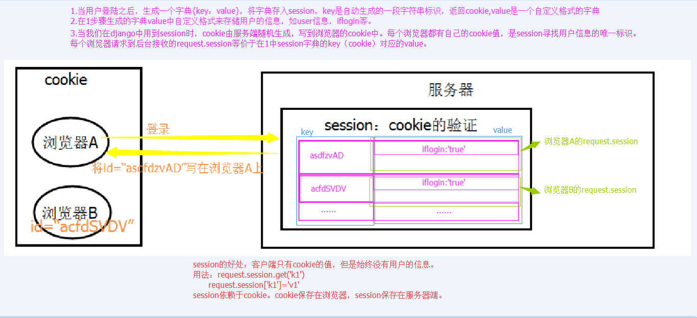
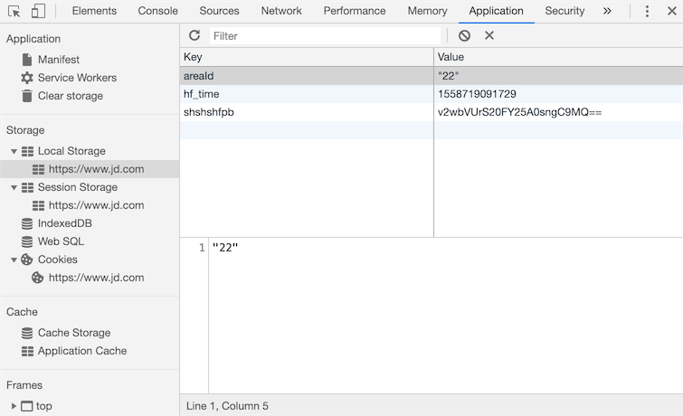

###### datetime:2019/6/24 9:46
###### author:nzb

## Cookie、Session和分页

### Cookie

#### Cookie的由来

大家都知道HTTP协议是无状态的。

无状态的意思是每次请求都是独立的，它的执行情况和结果与前面的请求和之后的请求都无直接关系，它不会受前面的请求响应情况直接影响，
也不会直接影响后面的请求响应情况。

一句有意思的话来描述就是人生只如初见，对服务器来说，每次的请求都是全新的。

状态可以理解为客户端和服务器在某次会话中产生的数据，那无状态的就以为这些数据不会被保留。会话中产生的数据又是我们需要保存的，
也就是说要“保持状态”。因此Cookie就是在这样一个场景下诞生。

#### 什么是Cookie

Cookie具体指的是一段小信息，它是服务器发送出来存储在浏览器上的一组组键值对，下次访问服务器时浏览器会自动携带这些键值对，以便服务器提取有用信息。

#### Cookie的原理

cookie的工作原理是：由服务器产生内容，浏览器收到请求后保存在本地；当浏览器再次访问时，浏览器会自动带上Cookie，这样服务器就能通过Cookie的内容来判断这个是“谁”了。

#### 查看Cookie

我们使用Chrome浏览器，打开开发者工具。


### Django中操作Cookie

#### 获取Cookie

```python
    request.COOKIES['key']
    request.get_signed_cookie(key, default=RAISE_ERROR, salt='', max_age=None)
```
参数：

- default: 默认值
- salt: 加密盐
- max_age: 后台控制过期时间

#### 设置Cookie

```python
    rep = HttpResponse(...)
    rep ＝ render(request, ...)
    
    rep.set_cookie(key,value,...)
    rep.set_signed_cookie(key,value,salt='加密盐', max_age=None, ...)
```
参数：

- key, 键
- value='', 值
- max_age=None, 超时时间
- expires=None, 超时时间(IE requires expires, so set it if hasn't been already.)
- path='/', Cookie生效的路径，/ 表示根路径，特殊的：根路径的cookie可以被任何url的页面访问
- domain=None, Cookie生效的域名
- secure=False, https传输
- httponly=False 只能http协议传输，无法被JavaScript获取（不是绝对，底层抓包可以获取到也可以被覆盖）

#### 删除Cookie

```python
    def logout(request):
        rep = redirect("/login/")
        rep.delete_cookie("user")  # 删除用户浏览器上之前设置的usercookie值
        return rep
```
Cookie版登陆校验
```python
    def check_login(func):
        @wraps(func)
        def inner(request, *args, **kwargs):
            next_url = request.get_full_path()
            if request.get_signed_cookie("login", salt="SSS", default=None) == "yes":
                # 已经登录的用户...
                return func(request, *args, **kwargs)
            else:
                # 没有登录的用户，跳转刚到登录页面
                return redirect("/login/?next={}".format(next_url))
        return inner
    
    @check_login
    def login(request):
        if request.method == "POST":
            username = request.POST.get("username")
            passwd = request.POST.get("password")
            if username == "xxx" and passwd == "dashabi":
                next_url = request.GET.get("next")
                if next_url and next_url != "/logout/":
                    response = redirect(next_url)
                else:
                    response = redirect("/class_list/")
                response.set_signed_cookie("login", "yes", salt="SSS")
                return response
        return render(request, "login.html")
```

### Session

#### Session的由来

Cookie虽然在一定程度上解决了“保持状态”的需求，但是由于Cookie本身最大支持4096字节，以及Cookie本身保存在客户端，可能被拦截或窃取，因此就需要有一种新的东西，它能支持更多的字节，并且他保存在服务器，有较高的安全性。这就是Session。

问题来了，基于HTTP协议的无状态特征，服务器根本就不知道访问者是“谁”。那么上述的Cookie就起到桥接的作用。

我们可以给每个客户端的Cookie分配一个唯一的id，这样用户在访问时，通过Cookie，服务器就知道来的人是“谁”。然后我们再根据不同的Cookie的id，在服务器上保存一段时间的私密资料，如“账号密码”等等。

总结而言：Cookie弥补了HTTP无状态的不足，让服务器知道来的人是“谁”；但是Cookie以文本的形式保存在本地，自身安全性较差；所以我们就通过Cookie识别不同的用户，对应的在Session里保存私密的信息以及超过4096字节的文本。

另外，上述所说的Cookie和Session其实是共通性的东西，不限于语言和框架。

### Django中Session相关方法

```python
    # 获取、设置、删除Session中数据
    request.session['k1']
    request.session.get('k1',None)
    request.session['k1'] = 123
    request.session.setdefault('k1',123) # 存在则不设置
    del request.session['k1']
    
    
    # 所有 键、值、键值对
    request.session.keys()
    request.session.values()
    request.session.items()
    request.session.iterkeys()
    request.session.itervalues()
    request.session.iteritems()
    
    # 会话session的key
    request.session.session_key
    
    # 将所有Session失效日期小于当前日期的数据删除
    request.session.clear_expired()
    
    # 检查会话session的key在数据库中是否存在
    request.session.exists("session_key")
    
    # 删除当前会话的所有Session数据
    request.session.delete()
    　　
    # 删除当前的会话数据并删除会话的Cookie。
    request.session.flush() 
        这用于确保前面的会话数据不可以再次被用户的浏览器访问
        例如，django.contrib.auth.logout() 函数中就会调用它。
    
    # 设置会话Session和Cookie的超时时间
    request.session.set_expiry(value)
        * 如果value是个整数，session会在些秒数后失效。
        * 如果value是个datatime或timedelta，session就会在这个时间后失效。
        * 如果value是0,用户关闭浏览器session就会失效。
        * 如果value是None,session会依赖全局session失效策略。
```

#### Session流程解析



#### Session版登陆验证

```python
    from functools import wraps
    
    
    def check_login(func):
        @wraps(func)
        def inner(request, *args, **kwargs):
            next_url = request.get_full_path()
            if request.session.get("user"):
                return func(request, *args, **kwargs)
            else:
                return redirect("/login/?next={}".format(next_url))
        return inner
    
    
    def login(request):
        if request.method == "POST":
            user = request.POST.get("user")
            pwd = request.POST.get("pwd")
    
            if user == "alex" and pwd == "alex1234":
                # 设置session
                request.session["user"] = user
                # 获取跳到登陆页面之前的URL
                next_url = request.GET.get("next")
                # 如果有，就跳转回登陆之前的URL
                if next_url:
                    return redirect(next_url)
                # 否则默认跳转到index页面
                else:
                    return redirect("/index/")
        return render(request, "login.html")
    
    
    @check_login
    def logout(request):
        # 删除所有当前请求相关的session
        request.session.delete()
        return redirect("/login/")
    
    
    @check_login
    def index(request):
        current_user = request.session.get("user", None)
        return render(request, "index.html", {"user": current_user})
```

#### Django中的Session配置

Django中默认支持Session，其内部提供了5种类型的Session供开发者使用。
```python
    1. 数据库Session
    SESSION_ENGINE = 'django.contrib.sessions.backends.db'   # 引擎（默认）
    
    2. 缓存Session
    SESSION_ENGINE = 'django.contrib.sessions.backends.cache'  # 引擎
    SESSION_CACHE_ALIAS = 'default'                            # 使用的缓存别名（默认内存缓存，也可以是memcache），此处别名依赖缓存的设置
    
    3. 文件Session
    SESSION_ENGINE = 'django.contrib.sessions.backends.file'    # 引擎
    SESSION_FILE_PATH = None                                    # 缓存文件路径，如果为None，则使用tempfile模块获取一个临时地址tempfile.gettempdir() 
    
    4. 缓存+数据库
    SESSION_ENGINE = 'django.contrib.sessions.backends.cached_db'        # 引擎
    
    5. 加密Cookie Session
    SESSION_ENGINE = 'django.contrib.sessions.backends.signed_cookies'   # 引擎
    
    其他公用设置项：
    SESSION_COOKIE_NAME ＝ "sessionid"                       # Session的cookie保存在浏览器上时的key，即：sessionid＝随机字符串（默认）
    SESSION_COOKIE_PATH ＝ "/"                               # Session的cookie保存的路径（默认）
    SESSION_COOKIE_DOMAIN = None                             # Session的cookie保存的域名（默认）
    SESSION_COOKIE_SECURE = False                            # 是否Https传输cookie（默认）
    SESSION_COOKIE_HTTPONLY = True                           # 是否Session的cookie只支持http传输（默认）
    SESSION_COOKIE_AGE = 1209600                             # Session的cookie失效日期（2周）（默认）
    SESSION_EXPIRE_AT_BROWSER_CLOSE = False                  # 是否关闭浏览器使得Session过期（默认）
    SESSION_SAVE_EVERY_REQUEST = False                       # 是否每次请求都保存Session，默认修改之后才保存（默认）
```

#### CBV中加装饰器相关

CBV实现的登录视图
```python
    class LoginView(View):
    
        def get(self, request):
            """
            处理GET请求
            """
            return render(request, 'login.html')
    
        def post(self, request):
            """
            处理POST请求 
            """
            user = request.POST.get('user')
            pwd = request.POST.get('pwd')
            if user == 'alex' and pwd == "alex1234":
                next_url = request.GET.get("next")
                # 生成随机字符串
                # 写浏览器cookie -> session_id: 随机字符串
                # 写到服务端session：
                # {
                #     "随机字符串": {'user':'alex'}
                # }
                request.session['user'] = user
                if next_url:
                    return redirect(next_url)
                else:
                    return redirect('/index/')
            return render(request, 'login.html')
```
要在CBV视图中使用我们上面的check_login装饰器，有以下三种方式：

from django.utils.decorators import method_decorator

**1. 加在CBV视图的get或post方法上**
```python
    from django.utils.decorators import method_decorator
    
    
    class HomeView(View):
    
        def dispatch(self, request, *args, **kwargs):
            return super(HomeView, self).dispatch(request, *args, **kwargs)
    
        def get(self, request):
            return render(request, "home.html")
        
        @method_decorator(check_login)
        def post(self, request):
            print("Home View POST method...")
            return redirect("/index/")
```

**2. 加在dispatch方法上**
```python
    from django.utils.decorators import method_decorator
    
    
    class HomeView(View):
    
        @method_decorator(check_login)
        def dispatch(self, request, *args, **kwargs):
            return super(HomeView, self).dispatch(request, *args, **kwargs)
    
        def get(self, request):
            return render(request, "home.html")
    
        def post(self, request):
            print("Home View POST method...")
            return redirect("/index/")
```
因为CBV中首先执行的就是dispatch方法，所以这么写相当于给get和post方法都加上了登录校验。

**3. 直接加在视图类上，但method_decorator必须传 name 关键字参数**

如果get方法和post方法都需要登录校验的话就写两个装饰器。
```python
    from django.utils.decorators import method_decorator
    
    @method_decorator(check_login, name="get")
    @method_decorator(check_login, name="post")
    class HomeView(View):
    
        def dispatch(self, request, *args, **kwargs):
            return super(HomeView, self).dispatch(request, *args, **kwargs)
    
        def get(self, request):
            return render(request, "home.html")
    
        def post(self, request):
            print("Home View POST method...")
            return redirect("/index/")
```

#### 补充

CSRF Token相关装饰器在CBV只能加到dispatch方法上，或者加在视图类上然后name参数指定为dispatch方法。

备注：

- csrf_protect，为当前函数强制设置防跨站请求伪造功能，即便settings中没有设置全局中间件。
- csrf_exempt，取消当前函数防跨站请求伪造功能，即便settings中设置了全局中间件。

```python
    from django.views.decorators.csrf import csrf_exempt, csrf_protect
    from django.utils.decorators import method_decorator
    
    
    class HomeView(View):
    
        @method_decorator(csrf_exempt)
        def dispatch(self, request, *args, **kwargs):
            return super(HomeView, self).dispatch(request, *args, **kwargs)
    
        def get(self, request):
            return render(request, "home.html")
    
        def post(self, request):
            print("Home View POST method...")
            return redirect("/index/")
```
或者
```python
    from django.views.decorators.csrf import csrf_exempt, csrf_protect
    from django.utils.decorators import method_decorator
    
    
    @method_decorator(csrf_exempt, name='dispatch')
    class HomeView(View):
       
        def dispatch(self, request, *args, **kwargs):
            return super(HomeView, self).dispatch(request, *args, **kwargs)
    
        def get(self, request):
            return render(request, "home.html")
    
        def post(self, request):
            print("Home View POST method...")
            return redirect("/index/")
```

### 分页

当数据库中数据有很多，我们通常会在前端页面做分页展示。

分页的数据可以在前端页面实现，也可以在后端实现分页。

后端实现分页的原理就是每次只请求一页数据。

准备工作

我们使用脚本批量创建一些测试数据（将下面的代码保存到bulk_create.py文件中放到Django项目的根目录，直接执行即可。）：

```python
    import os
    
    if __name__ == "__main__":
        os.environ.setdefault("DJANGO_SETTINGS_MODULE", "about_orm.settings")
    
        import django
        django.setup()
    
        from app01 import models
        bulk_obj = (models.Publisher(name='沙河第{}出版社'.format(i)) for i in range(300))
        models.Publisher.objects.bulk_create(bulk_obj)
```
#### 自定义分页

稳扎稳打版
```python
    def publisher_list(request):
        # 从URL中取当前访问的页码数
        try:
            current_page = int(request.GET.get('page'))
        except Exception as e:
            # 取不到或者页码数不是数字都默认展示第1页
            current_page = 1
        # 总数据量
        total_count = models.Publisher.objects.count()
        # 定义每页显示多少条数据
        per_page = 10
        # 计算出总页码数
        total_page, more = divmod(total_count, per_page)
        if more:
            total_page += 1
        # 定义页面上最多显示多少页码(为了左右对称，一般设为奇数)
        max_show = 11
        half_show = max_show // 2
        # 计算一下页面显示的页码范围
        if total_page <= max_show:  # 总页码数小于最大显示页码数
            page_start = 1
            page_end = total_page
        elif current_page + half_show >= total_page:  # 右边越界
            page_end = total_page
            page_start = total_page - max_show
        elif current_page - half_show <= 1:  # 左边越界
            page_start = 1
            page_end = max_show
        else:  # 正常页码区间
            page_start = current_page - half_show
            page_end = current_page + half_show
        # 数据索引起始位置
        data_start = (current_page-1) * per_page
        data_end = current_page * per_page
    
        publisher_list = models.Publisher.objects.all()[data_start:data_end]
    
        # 生成页面上显示的页码
        page_html_list = []
        page_html_list.append('<nav aria-label="Page navigation"><ul class="pagination">')
        # 加首页
        first_li = '<li><a href="/publisher_list/?page=1">首页</a></li>'
        page_html_list.append(first_li)
        # 加上一页
        if current_page == 1:
            prev_li = '<li><a href="#"><span aria-hidden="true">&laquo;</span></a></li>'
        else:
            prev_li = '<li><a href="/publisher_list/?page={}"><span aria-hidden="true">&laquo;</span></a></li>'.format(current_page - 1)
        page_html_list.append(prev_li)
        for i in range(page_start, page_end + 1):
            if i == current_page:
                li_tag = '<li class="active"><a href="/publisher_list/?page={0}">{0}</a></li>'.format(i)
            else:
                li_tag = '<li><a href="/publisher_list/?page={0}">{0}</a></li>'.format(i)
            page_html_list.append(li_tag)
        # 加下一页
        if current_page == total_page:
            next_li = '<li><a href="#"><span aria-hidden="true">&raquo;</span></a></li>'
        else:
            next_li = '<li><a href="/publisher_list/?page={}"><span aria-hidden="true">&raquo;</span></a></li>'.format(current_page + 1)
        page_html_list.append(next_li)
        # 加尾页
        page_end_li = '<li><a href="/publisher_list/?page={}">尾页</a></li>'.format(total_page)
        page_html_list.append(page_end_li)
        page_html_list.append('</ul></nav>')
        page_html = "".join(page_html_list)
        return render(request, "publisher_list.html", {"publisher_list": publisher_list, "page_html": page_html})
```

封装保存版
```python
    class Pagination(object):
        """自定义分页（Bootstrap版）"""
        def __init__(self, current_page, total_count, base_url, per_page=10, max_show=11):
            """
            :param current_page: 当前请求的页码
            :param total_count: 总数据量
            :param base_url: 请求的URL
            :param per_page: 每页显示的数据量，默认值为10
            :param max_show: 页面上最多显示多少个页码，默认值为11
            """
            try:
                self.current_page = int(current_page)
            except Exception as e:
                # 取不到或者页码数不是数字都默认展示第1页
                self.current_page = 1
            # 定义每页显示多少条数据
            self.per_page = per_page
            # 计算出总页码数
            total_page, more = divmod(total_count, per_page)
            if more:
                total_page += 1
            self.total_page = total_page
            # 定义页面上最多显示多少页码(为了左右对称，一般设为奇数)
            self.max_show = max_show
            self.half_show = max_show // 2
            self.base_url = base_url
    
        @property
        def start(self):
            return (self.current_page-1) * self.per_page
    
        @property
        def end(self):
            return self.current_page * self.per_page
    
        def page_html(self):
            # 计算一下页面显示的页码范围
            if self.total_page <= self.max_show:  # 总页码数小于最大显示页码数
                page_start = 1
                page_end = self.total_page
            elif self.current_page + self.half_show >= self.total_page:  # 右边越界
                page_end = self.total_page
                page_start = self.total_page - self.max_show
            elif self.current_page - self.half_show <= 1:  # 左边越界
                page_start = 1
                page_end = self.max_show
            else:  # 正常页码区间
                page_start = self.current_page - self.half_show
                page_end = self.current_page + self.half_show
            # 生成页面上显示的页码
            page_html_list = []
            page_html_list.append('<nav aria-label="Page navigation"><ul class="pagination">')
            # 加首页
            first_li = '<li><a href="{}?page=1">首页</a></li>'.format(self.base_url)
            page_html_list.append(first_li)
            # 加上一页
            if self.current_page == 1:
                prev_li = '<li><a href="#"><span aria-hidden="true">&laquo;</span></a></li>'
            else:
                prev_li = '<li><a href="{}?page={}"><span aria-hidden="true">&laquo;</span></a></li>'.format(
                    self.base_url, self.current_page - 1)
            page_html_list.append(prev_li)
            for i in range(page_start, page_end + 1):
                if i == self.current_page:
                    li_tag = '<li class="active"><a href="{0}?page={1}">{1}</a></li>'.format(self.base_url, i)
                else:
                    li_tag = '<li><a href="{0}?page={1}">{1}</a></li>'.format(self.base_url, i)
                page_html_list.append(li_tag)
            # 加下一页
            if self.current_page == self.total_page:
                next_li = '<li><a href="#"><span aria-hidden="true">&raquo;</span></a></li>'
            else:
                next_li = '<li><a href="{}?page={}"><span aria-hidden="true">&raquo;</span></a></li>'.format(
                    self.base_url, self.current_page + 1)
            page_html_list.append(next_li)
            # 加尾页
            page_end_li = '<li><a href="{}?page={}">尾页</a></li>'.format(self.base_url, self.total_page)
            page_html_list.append(page_end_li)
            page_html_list.append('</ul></nav>')
            return "".join(page_html_list)
```

封装保存版使用示例
```python
    def publisher_list(request):
        # 从URL中取当前访问的页码数
        current_page = int(request.GET.get('page'))
        # 比len(models.Publisher.objects.all())更高效
        total_count = models.Publisher.objects.count()
        page_obj = Pagination(current_page, total_count, request.path_info)
        data = models.Publisher.objects.all()[page_obj.start:page_obj.end]
        page_html = page_obj.page_html()
        return render(request, "publisher_list.html", {"publisher_list": data, "page_html": page_html})
```

#### Django内置分页

内置分页view部分
```python
    from django.shortcuts import render
    from django.core.paginator import Paginator, EmptyPage, PageNotAnInteger
    
    L = []
    for i in range(999):
        L.append(i)
    
    def index(request):
        current_page = request.GET.get('p')
    
        paginator = Paginator(L, 10)
        # per_page: 每页显示条目数量
        # count:    数据总个数
        # num_pages:总页数
        # page_range:总页数的索引范围，如: (1,10),(1,200)
        # page:     page对象
        try:
            posts = paginator.page(current_page)
            # has_next              是否有下一页
            # next_page_number      下一页页码
            # has_previous          是否有上一页
            # previous_page_number  上一页页码
            # object_list           分页之后的数据列表
            # number                当前页
            # paginator             paginator对象
        except PageNotAnInteger:
            posts = paginator.page(1)
        except EmptyPage:
            posts = paginator.page(paginator.num_pages)
        return render(request, 'index.html', {'posts': posts})
```

内置分页HTML部分
```html
    <!DOCTYPE html>
    <html>
    <head lang="en">
        <meta charset="UTF-8">
        <title></title>
    </head>
    <body>
    <ul>
        
            <li>{{ item }}</li>
        
    </ul>
    
    <div class="pagination">
          <span class="step-links">
            
                <a href="?p={{ posts.previous_page_number }}">Previous</a>
            
              <span class="current">
                Page {{ posts.number }} of {{ posts.paginator.num_pages }}.
              </span>
              
                  <a href="?p={{ posts.next_page_number }}">Next</a>
              
          </span>
    
    </div>
    </body>
    </html>
```

## Cookie和Session(100天)

### 实现用户跟踪

如今，一个网站如果不通过某种方式记住你是谁以及你之前在网站的活动情况，失去的就是网站的可用性和便利性，继而很有可能导致网站用户的流式，所以记住一个用户（更专业的说法叫**用户跟踪**）对绝大多数Web应用来说都是必需的功能。

在服务器端，我们想记住一个用户最简单的办法就是创建一个对象，通过这个对象就可以把用户相关的信息都保存起来，这个对象就是我们常说的session（用户会话对象）。那么问题来了，HTTP本身是一个无连接（每次请求和响应的过程中，服务器一旦完成对客户端请求的响应之后就断开连接）、无状态（客户端再次发起对服务器的请求时，服务器无法得知这个客户端之前的任何信息）的协议，即便服务器通过session对象保留了用户数据，还得通过某种方式来确定当前的请求与之前保存过的哪一个session是有关联的。相信很多人都能想到，我们可以给每个session对象分配一个全局唯一的标识符来识别session对象，我们姑且称之为sessionid，每次客户端发起请求时，只要携带上这个sessionid，就有办法找到与之对应的session对象，从而实现在两次请求之间记住该用户的信息，也就是我们之前说的用户跟踪。

要让客户端记住并在每次请求时带上sessionid又有以下几种做法：

1. URL重写。所谓URL重写就是在URL中携带sessionid，例如：`http://www.example.com/index.html?sessionid=123456`，服务器通过获取sessionid参数的值来取到与之对应的session对象。

2. 隐藏域（隐式表单域）。在提交表单的时候，可以通过在表单中设置隐藏域向服务器发送额外的数据。例如：`<input type="hidden" name="sessionid" value="123456">`。

3. 本地存储。现在的浏览器都支持多种本地存储方案，包括：cookie、localStorage、sessionStorage、IndexedDB等。在这些方案中，cookie是历史最为悠久也是被诟病得最多的一种方案，也是我们接下来首先为大家讲解的一种方案。简单的说，cookie是一种以键值对方式保存在浏览器临时文件中的数据，每次请求时，请求头中会携带本站点的cookie到服务器，那么只要将sessionid写入cookie，下次请求时服务器只要读取请求头中的cookie就能够获得这个sessionid，如下图所示。

   

   在HTML5时代要，除了cookie，还可以使用新的本地存储API来保存数据，就是刚才提到的localStorage、sessionStorage、IndexedDB等技术，如下图所示。

   

### Django框架对session的支持

在创建Django项目时，默认的配置文件`settings.py`文件中已经激活了一个名为`SessionMiddleware`的中间件（关于中间件的知识我们在下一个章节做详细的讲解，这里只需要知道它的存在即可），因为这个中间件的存在，我们可以直接通过请求对象的`session`属性来操作会话对象。`session`属性是一个像字典一样可以读写数据的容器对象，因此我们可以使用“键值对”的方式来保留用户数据。与此同时，`SessionMiddleware`中间件还封装了对cookie的操作，在cookie中保存了sessionid，就如同我们之前描述的那样。

在默认情况下，Django将session的数据序列化后保存在关系型数据库中，在Django 1.6以后的版本中，默认的序列化数据的方式是JSON序列化，而在此之前一直使用Pickle序列化。JSON序列化和Pickle序列化的差别在于前者将对象序列化为字符串（字符形式），而后者将对象序列化为字节串（二进制形式），因为安全方面的原因，JSON序列化成为了目前Django框架默认序列化数据的方式，这就要求在我们保存在session中的数据必须是能够JSON序列化的，否则就会引发异常。还有一点需要说明的是，使用关系型数据库保存session中的数据在大多数时候并不是最好的选择，因为数据库可能会承受巨大的压力而成为系统性能的瓶颈，在后面的章节中我们会告诉大家如何将session的数据保存到缓存服务中。

我们继续完善之前的投票应用，前一个章节中我们实现了用户的登录和注册，下面我们首先完善登录时对验证码的检查。

```Python
def get_captcha(request):
    """验证码"""
    captcha_text = random_captcha_text()
    request.session['captcha'] = captcha_text
    image_data = Captcha.instance().generate(captcha_text)
    return HttpResponse(image_data, content_type='image/png')
```

注意上面代码中的第4行，我们将随机生成的验证码字符串保存到session中，稍后用户登录时，我们要将保存在session中的验证码字符串和用户输入的验证码字符串进行比对，如果用户输入了正确的验证码才能够执行后续的登录流程，代码如下所示。

```Python
def login(request: HttpRequest):
    """登录"""
    hint = ''
    if request.method == 'POST':
        form = LoginForm(request.POST)
        if form.is_valid():
            # 对验证码的正确性进行验证
            captcha_from_user = form.cleaned_data['captcha']
            captcha_from_sess = request.session.get('captcha', '')
            if captcha_from_sess.lower() != captcha_from_user.lower():
                hint = '请输入正确的验证码'
            else:
                username = form.cleaned_data['username']
                password = form.cleaned_data['password']
                user = User.objects.filter(username=username, password=password).first()
                if user:
                    # 登录成功后将用户编号和用户名保存在session中
                    request.session['userid'] = user.no
                    request.session['username'] = user.username
                    return redirect('/')
                else:
                    hint = '用户名或密码错误'
        else:
            hint = '请输入有效的登录信息'
    return render(request, 'login.html', {'hint': hint})
```

上面的代码中，我们设定了登录成功后会在session中保存用户的编号（`userid`）和用户名（`username`），页面会重定向到首页。接下来我们可以稍微对首页的代码进行调整，在页面的右上角显示出登录用户的用户名。我们将这段代码单独写成了一个名为header.html的HTML文件，首页中可以通过在`<body>`标签中添加``来包含这个页面，代码如下所示。

```HTML
<div class="user">
    
    <span>{{ request.session.username }}</span>
    <a href="/logout">注销</a>
    
    <a href="/login">登录</a>&nbsp;&nbsp;
    
    <a href="/register">注册</a>
</div>
```

如果用户没有登录，页面会显示登录和注册的超链接；而用户登录成功后，页面上会显示用户名和注销的链接，注销链接对应的视图函数如下所示，URL的映射与之前讲过的类似，不再赘述。

```Python
def logout(request):
    """注销"""
    request.session.flush()
    return redirect('/')
```

上面的代码通过session对象`flush`方法来销毁session，一方面清除了服务器上session对象保存的用户数据，一方面将保存在浏览器cookie中的sessionid删除掉，稍后我们会对如何读写cookie的操作加以说明。

我们可以通过项目使用的数据库中名为`django_session` 的表来找到所有的session，该表的结构如下所示：

| session_key                      | session_data                    | expire_date                |
| -------------------------------- | ------------------------------- | -------------------------- |
| c9g2gt5cxo0k2evykgpejhic5ae7bfpl | MmI4YzViYjJhOGMyMDJkY2M5Yzg3... | 2019-05-25 23:16:13.898522 |

其中，第1列就是浏览器cookie中保存的sessionid；第2列是经过BASE64编码后的session中的数据，如果使用Python的`base64`对其进行解码，解码的过程和结果如下所示。

```Python
>>> import base64
>>> base64.b64decode('MmI4YzViYjJhOGMyMDJkY2M5Yzg3ZWIyZGViZmUzYmYxNzdlNDdmZjp7ImNhcHRjaGEiOiJzS3d0Iiwibm8iOjEsInVzZXJuYW1lIjoiamFja2ZydWVkIn0=')    
'2b8c5bb2a8c202dcc9c87eb2debfe3bf177e47ff:{"captcha":"sKwt","no":1,"username":"jackfrued"}'
```

第3列是session的过期时间，session过期后浏览器保存的cookie中的sessionid就会失效，但是数据库中的这条对应的记录仍然会存在，如果想清除过期的数据，可以使用下面的命令。

```Shell
python manage.py clearsessions
```

Django框架默认的session过期时间为两周（1209600秒），如果想修改这个时间，可以在项目的配置文件中添加如下所示的代码。

```Python
# 配置会话的超时时间为1天（86400秒）
SESSION_COOKIE_AGE = 86400
```

有很多对安全性要求较高的应用都必须在关闭浏览器窗口时让会话过期，不再保留用户的任何信息，如果希望在关闭浏览器窗口时就让会话过期（cookie中的sessionid失效），可以加入如下所示的配置。

```Python
# 设置为True在关闭浏览器窗口时session就过期
SESSION_EXPIRE_AT_BROWSER_CLOSE = True
```

如果不希望将session的数据保存在数据库中，可以将其放入缓存中，对应的配置如下所示，缓存的配置和使用我们在后面讲解。

```Python
# 配置将会话对象放到缓存中存储
SESSION_ENGINE = 'django.contrib.sessions.backends.cache'
# 配置使用哪一组缓存来保存会话
SESSION_CACHE_ALIAS = 'default'
```

如果要修改session数据默认的序列化方式，可以将默认的`JSONSerializer`修改为`PickleSerializer`。

```Python
SESSION_SERIALIZER = 'django.contrib.sessions.serializers.PickleSerializer'
```

### 在视图函数中读写cookie

Django封装的`HttpRequest`和`HttpResponse`对象分别提供了读写cookie的操作。

HttpRequest封装的属性和方法：

1. `COOKIES`属性 - 该属性包含了HTTP请求携带的所有cookie。
2. `get_signed_cookie`方法 - 获取带签名的cookie，如果签名验证失败，会产生`BadSignature`异常。

HttpResponse封装的方法：

1. `set_cookie`方法 - 该方法可以设置一组键值对并将其最终将写入浏览器。
2. `set_signed_cookie`方法 - 跟上面的方法作用相似，但是会对cookie进行签名来达到防篡改的作用。因为如果篡改了cookie中的数据，在不知道[密钥](<https://zh.wikipedia.org/wiki/%E5%AF%86%E9%92%A5>)和[盐](<https://zh.wikipedia.org/wiki/%E7%9B%90_(%E5%AF%86%E7%A0%81%E5%AD%A6)>)的情况下是无法生成有效的签名，这样服务器在读取cookie时会发现数据与签名不一致从而产生`BadSignature`异常。需要说明的是，这里所说的密钥就是我们在Django项目配置文件中指定的`SECRET_KEY`，而盐是程序中设定的一个字符串，你愿意设定为什么都可以，只要是一个有效的字符串。

上面提到的方法，如果不清楚它们的具体用法，可以自己查阅一下Django的[官方文档](<https://docs.djangoproject.com/en/2.1/ref/request-response/>)，没有什么资料比官方文档能够更清楚的告诉你这些方法到底如何使用。

刚才我们说过了，激活`SessionMiddleware`之后，每个`HttpRequest`对象都会绑定一个session属性，它是一个类似字典的对象，除了保存用户数据之外还提供了检测浏览器是否支持cookie的方法，包括：

1. `set_test_cookie`方法 - 设置用于测试的cookie。
2. `test_cookie_worked`方法 - 检测测试cookie是否工作。
3. `delete_test_cookie`方法 - 删除用于测试的cookie。
4. `set_expiry`方法 - 设置会话的过期时间。
5. `get_expire_age`/`get_expire_date`方法 - 获取会话的过期时间。
6. `clear_expired`方法 - 清理过期的会话。

下面是在执行登录之前检查浏览器是否支持cookie的代码。

```Python
def login(request):
    if request.method == 'POST':
        if request.session.test_cookie_worked():
            request.session.delete_test_cookie()
            # Add your code to perform login process here
        else:
            return HttpResponse("Please enable cookies and try again.")
    request.session.set_test_cookie()
    return render_to_response('login.html')
```

### Cookie的替代品

之前我们说过了，cookie的名声一直都不怎么好，当然我们在实际开发中是不会在cookie中保存用户的敏感信息（如用户的密码、信用卡的账号等）的，而且保存在cookie中的数据一般也会做好编码和签名的工作。即便如此，HTML5中还是给出了用于替代cookie的技术方案，其中使用得最为广泛的就是localStorage和sessionStorage，相信从名字上你就能听出二者的差别，存储在`localStorage`的数据可以长期保留；而存储在`sessionStorage`的数据会在浏览器关闭时会被清除 。关于这些cookie替代品的用法，建议大家查阅[MDN](<https://developer.mozilla.org/zh-CN/docs/Web>)来进行了解。