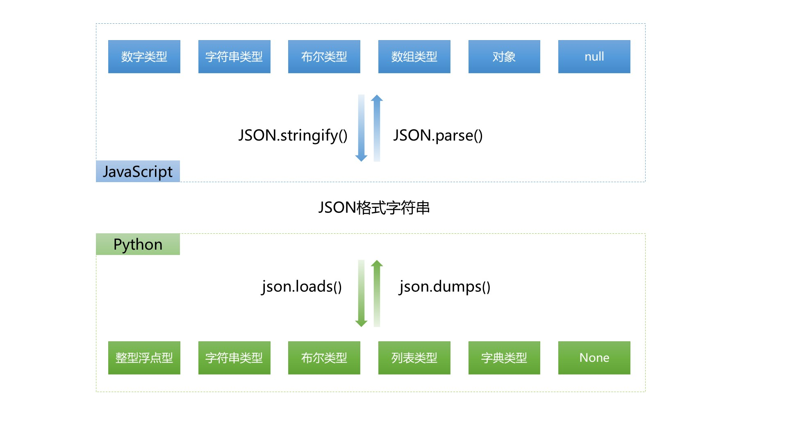

###### datetime:2019/6/24 17:21
###### author:nzb

## AJAX

### AJAX准备知识：JSON

#### 什么是JSON?

- JSON 指的是 JavaScript 对象表示法（JavaScript Object Notation）
- JSON 是轻量级的文本数据交换格式
- JSON 独立于语言 *
- JSON 具有自我描述性，更易理解
*JSON 使用 JavaScript 语法来描述数据对象，但是 JSON 仍然独立于语言和平台。JSON 解析器和 JSON 库支持许多不同的编程语言。

 啥都别多说了，上图吧！
 

合格的json对象：

    ["one", "two", "three"]
    { "one": 1, "two": 2, "three": 3 }
    {"names": ["张三", "李四"] }
    [ { "name": "张三"}, {"name": "李四"} ]　
    
 不合格的json对象：
 
    { name: "张三", 'age': 32 }  // 属性名必须使用双引号
    [32, 64, 128, 0xFFF] // 不能使用十六进制值
    { "name": "张三", "age": undefined }  // 不能使用undefined
    { "name": "张三",
      "birthday": new Date('Fri, 26 Aug 2011 07:13:10 GMT'),
      "getName":  function() {return this.name;}  // 不能使用函数和日期对象
    }

#### stringify与parse方法

JavaScript中关于JSON对象和字符串转换的两个方法：

JSON.parse(): 用于将一个 JSON 字符串转换为 JavaScript 对象　

    JSON.parse('{"name":"Q1mi"}');
    JSON.parse('{name:"Q1mi"}') ;   // 错误
    JSON.parse('[18,undefined]') ;   // 错误

JSON.stringify(): 用于将 JavaScript 值转换为 JSON 字符串。　

    JSON.stringify({"name":"Q1mi"})

#### 和XML的比较

JSON 格式于2001年由 Douglas Crockford 提出，目的就是取代繁琐笨重的 XML 格式。

JSON 格式有两个显著的优点：书写简单，一目了然；符合 JavaScript 原生语法，可以由解释引擎直接处理，不用另外添加解析代码。所以，JSON迅速被接受，已经成为各大网站交换数据的标准格式，并被写入ECMAScript 5，成为标准的一部分。

XML和JSON都使用结构化方法来标记数据，下面来做一个简单的比较。

用XML表示中国部分省市数据如下：
```xml
    <?xml version="1.0" encoding="utf-8"?>
    <country>
        <name>中国</name>
        <province>
            <name>黑龙江</name>
            <cities>
                <city>哈尔滨</city>
                <city>大庆</city>
            </cities>
        </province>
        <province>
            <name>广东</name>
            <cities>
                <city>广州</city>
                <city>深圳</city>
                <city>珠海</city>
            </cities>
        </province>
        <province>
            <name>台湾</name>
            <cities>
                <city>台北</city>
                <city>高雄</city>
            </cities>
        </province>
        <province>
            <name>新疆</name>
            <cities>
                <city>乌鲁木齐</city>
            </cities>
        </province>
    </country>
```
用JSON表示如下：
```json
    {
        "name": "中国",
        "province": [{
            "name": "黑龙江",
            "cities": {
                "city": ["哈尔滨", "大庆"]
            }
        }, {
            "name": "广东",
            "cities": {
                "city": ["广州", "深圳", "珠海"]
            }
        }, {
            "name": "台湾",
            "cities": {
                "city": ["台北", "高雄"]
            }
        }, {
            "name": "新疆",
            "cities": {
                "city": ["乌鲁木齐"]
            }
        }]
    }
```
由上面的两端代码可以看出，JSON 简单的语法格式和清晰的层次结构明显要比 XML 容易阅读，并且在数据交换方面，由于 JSON 所使用的字符要比 XML 少得多，可以大大得节约传输数据所占用得带宽。 

### AJAX简介

发送请求的方式：
- 直接在地址栏输入URL回车           GET请求
- a标签                           GET请求
- form表单                        GET/POST请求
- AJAX                            GET/POST请求

AJAX（Asynchronous Javascript And XML）翻译成中文就是“异步的Javascript和XML”。即使用Javascript语言与服务器进行异步交互，传输的数据为XML（当然，传输的数据不只是XML）。

AJAX 不是新的编程语言，而是一种使用现有标准的新方法。

AJAX 最大的优点是在不重新加载整个页面的情况下，可以与服务器交换数据并更新部分网页内容。（这一特点给用户的感受是在不知不觉中完成请求和响应过程）

AJAX 不需要任何浏览器插件，但需要用户允许JavaScript在浏览器上执行。

- 同步交互：客户端发出一个请求后，需要等待服务器响应结束后，才能发出第二个请求；
- 异步交互：客户端发出一个请求后，无需等待服务器响应结束，就可以发出第二个请求。

##### 示例

**页面输入两个整数，通过AJAX传输到后端计算出结果并返回。**
```html
    <!DOCTYPE html>
    <html lang="en">
    <head>
      <meta charset="UTF-8">
      <meta http-equiv="x-ua-compatible" content="IE=edge">
      <meta name="viewport" content="width=device-width, initial-scale=1">
      <title>AJAX局部刷新实例</title>
    </head>
    <body>
    
    <input type="text" id="i1">+
    <input type="text" id="i2">=
    <input type="text" id="i3">
    <input type="button" value="AJAX提交" id="b1">
    
    <script src="/static/jquery-3.2.1.min.js"></script>
    <script>
      $("#b1").on("click", function () {
        $.ajax({
          url:"/ajax_add/",
          type:"GET",
          data:{"i1":$("#i1").val(),"i2":$("#i2").val()},
          success:function (data) {
            $("#i3").val(data);
          }
        })
      })
    </script>
    </body>
    </html>
```
```python
    def ajax_demo1(request):
        return render(request, "ajax_demo1.html")
    
    
    def ajax_add(request):
        i1 = int(request.GET.get("i1"))
        i2 = int(request.GET.get("i2"))
        ret = i1 + i2
        return JsonResponse(ret, safe=False)
```
```python
    urlpatterns = [
        ...
        url(r'^ajax_add/', views.ajax_add),
        url(r'^ajax_demo1/', views.ajax_demo1),
        ...   
    ]
```

#### AJAX常见应用场景

搜索引擎根据用户输入的关键字，自动提示检索关键字。

还有一个很重要的应用场景就是注册时候的用户名的查重。

其实这里就使用了AJAX技术！当文件框发生了输入变化时，使用AJAX技术向服务器发送一个请求，然后服务器会把查询到的结果响应给浏览器，最后再把后端返回的结果展示出来。

- 整个过程中页面没有刷新，只是刷新页面中的局部位置而已！
- 当请求发出后，浏览器还可以进行其他操作，无需等待服务器的响应！

当输入用户名后，把光标移动到其他表单项上时，浏览器会使用AJAX技术向服务器发出请求，服务器会查询名为lemontree7777777的用户是否存在，最终服务器返回true表示名为lemontree7777777的用户已经存在了，浏览器在得到结果后显示“用户名已被注册！”。

- 整个过程中页面没有刷新，只是局部刷新了；
- 在请求发出后，浏览器不用等待服务器响应结果就可以进行其他操作；

#### AJAX的优缺点

优点：
- AJAX使用JavaScript技术向服务器发送异步请求；
- AJAX请求无须刷新整个页面；
- 因为服务器响应内容不再是整个页面，而是页面中的部分内容，所以AJAX性能高； 

### jQuery实现的AJAX

最基本的jQuery发送AJAX请求示例：
```html
    <!DOCTYPE html>
    <html lang="zh-CN">
    <head>
      <meta charset="UTF-8">
      <meta http-equiv="x-ua-compatible" content="IE=edge">
      <meta name="viewport" content="width=device-width, initial-scale=1">
      <title>ajax test</title>
      <script src="https://cdn.bootcss.com/jquery/3.3.1/jquery.min.js"></script>
    </head>
    <body>
    <button id="ajaxTest">AJAX 测试</button>
    <script>
      $("#ajaxTest").click(function () {
        $.ajax({
          url: "/ajax_test/",
          type: "POST",
          data: {username: "Q1mi", password: 123456},
          success: function (data) {
            alert(data)
          }
        })
      })
    </script>
    </body>
    </html>
```
#### views.py

```python
    def ajax_test(request):
        user_name = request.POST.get("username")
        password = request.POST.get("password")
        print(user_name, password)
        return HttpResponse("OK")
```

#### $.ajax参数

data参数中的键值对，如果值值不为字符串，需要将其转换成字符串类型。
```python
    $("#b1").on("click", function () {
        $.ajax({
          url:"/ajax_add/",
          type:"GET",
          data:{"i1":$("#i1").val(),"i2":$("#i2").val(),"hehe": JSON.stringify([1, 2, 3])},
          success:function (data) {
            $("#i3").val(data);
          }
        })
      })
```

### JS实现AJAX

```javascript
    var b2 = document.getElementById("b2");
      b2.onclick = function () {
        // 原生JS
        var xmlHttp = new XMLHttpRequest();
        xmlHttp.open("POST", "/ajax_test/", true);
        xmlHttp.setRequestHeader("Content-type", "application/x-www-form-urlencoded");
        xmlHttp.send("username=q1mi&password=123456");
        xmlHttp.onreadystatechange = function () {
          if (xmlHttp.readyState === 4 && xmlHttp.status === 200) {
            alert(xmlHttp.responseText);
          }
        };
      };
```

### AJAX请求如何设置csrf_token

#### 方式1

通过获取隐藏的input标签中的csrfmiddlewaretoken值，放置在data中发送。
```html
    $.ajax({
      url: "/cookie_ajax/",
      type: "POST",
      data: {
        "username": "Q1mi",
        "password": 123456,
        "csrfmiddlewaretoken": $("[name = 'csrfmiddlewaretoken']").val()  // 使用jQuery取出csrfmiddlewaretoken的值，拼接到data中
      },
      success: function (data) {
        console.log(data);
      }
    })
```

#### 方式2

通过获取返回的cookie中的字符串 放置在请求头中发送。

注意：需要引入一个jquery.cookie.js插件。
```javascript
    $.ajax({
      url: "/cookie_ajax/",
      type: "POST",
      headers: {"X-CSRFToken": $.cookie('csrftoken')},  // 从Cookie取csrftoken，并设置到请求头中
      data: {"username": "Q1mi", "password": 123456},
      success: function (data) {
        console.log(data);
      }
    })
```

或者用自己写一个getCookie方法：
```javascript
    function getCookie(name) {
        var cookieValue = null;
        if (document.cookie && document.cookie !== '') {
            var cookies = document.cookie.split(';');
            for (var i = 0; i < cookies.length; i++) {
                var cookie = jQuery.trim(cookies[i]);
                // Does this cookie string begin with the name we want?
                if (cookie.substring(0, name.length + 1) === (name + '=')) {
                    cookieValue = decodeURIComponent(cookie.substring(name.length + 1));
                    break;
                }
            }
        }
        return cookieValue;
    }
    var csrftoken = getCookie('csrftoken');
```

每一次都这么写太麻烦了，可以使用$.ajaxSetup()方法为ajax请求统一设置。
```javascript
    function csrfSafeMethod(method) {
      // these HTTP methods do not require CSRF protection
      return (/^(GET|HEAD|OPTIONS|TRACE)$/.test(method));
    }
    
    $.ajaxSetup({
      beforeSend: function (xhr, settings) {
        if (!csrfSafeMethod(settings.type) && !this.crossDomain) {
          xhr.setRequestHeader("X-CSRFToken", csrftoken);
        }
      }
    });
```
注意：

如果使用从cookie中取csrftoken的方式，需要确保cookie存在csrftoken值。

如果你的视图渲染的HTML文件中没有包含 ，Django可能不会设置CSRFtoken的cookie。

这个时候需要使用ensure_csrf_cookie()装饰器强制设置Cookie。

```python
    django.views.decorators.csrf import ensure_csrf_cookie
    
    
    @ensure_csrf_cookie
    def login(request):
        pass
```
更多细节详见：[Djagno官方文档中关于CSRF的内容](https://docs.djangoproject.com/en/1.11/ref/csrf/)

### AJAX上传文件

XMLHttpRequest 是一个浏览器接口，通过它，我们可以使得 Javascript 进行 HTTP (S) 通信。XMLHttpRequest 在现在浏览器中是一种常用的前后台交互数据的方式。2008年 2 月，XMLHttpRequest Level 2 草案提出来了，相对于上一代，它有一些新的特性，其中 FormData 就是 XMLHttpRequest Level 2 新增的一个对象，利用它来提交表单、模拟表单提交，当然最大的优势就是可以上传二进制文件。下面就具体

首先看一下formData的基本用法：FormData对象，可以把所有表单元素的name与value组成一个queryString，提交到后台。只需要把 form 表单作为参数传入 FormData 构造函数即可：

介绍一下如何利用 FormData 来上传文件。
```javascript
    // 上传文件示例
    $("#b3").click(function () {
      var formData = new FormData();
      formData.append("csrfmiddlewaretoken", $("[name='csrfmiddlewaretoken']").val());
      formData.append("f1", $("#f1")[0].files[0]);
      $.ajax({
        url: "/upload/",
        type: "POST",
        processData: false,  // 告诉jQuery不要去处理发送的数据
        contentType: false,  // 告诉jQuery不要去设置Content-Type请求头
        data: formData,
        success:function (data) {
          console.log(data)
        }
      })
    })
```
或者使用
```javascript
    var form = document.getElementById("form1");
    var fd = new FormData(form);
```
这样也可以直接通过ajax 的 send() 方法将 fd 发送到后台。

**注意：由于 FormData 是 XMLHttpRequest Level 2 新增的接口，现在 低于IE10 的IE浏览器不支持 FormData。**

#### 练习（用户名是否已被注册）

##### 功能介绍

在注册表单中，当用户填写了用户名后，把光标移开后，会自动向服务器发送异步请求。服务器返回这个用户名是否已经被注册过。

##### 案例分析

- 页面中给出注册表单；
- 在username input标签中绑定onblur事件处理函数。
- 当input标签失去焦点后获取 username表单字段的值，向服务端发送AJAX请求；
- django的视图函数中处理该请求，获取username值，判断该用户在数据库中是否被注册，如果被注册了就返回“该用户已被注册”，否则响应“该用户名可以注册”。

### 序列化

#### Django内置的serializers

```python
    def books_json(request):
        book_list = models.Book.objects.all()[0:10]
        from django.core import serializers
        ret = serializers.serialize("json", book_list)
        return HttpResponse(ret)
```

### 补充一个SweetAlert插件示例


点击下载[Bootstrap-sweetalert项目](https://github.com/lipis/bootstrap-sweetalert)。
```javascript
    $(".btn-danger").on("click", function () {
      swal({
        title: "你确定要删除吗？",
        text: "删除可就找不回来了哦！",
        type: "warning",
        showCancelButton: true,
        confirmButtonClass: "btn-danger",
        confirmButtonText: "删除",
        cancelButtonText: "取消",
        closeOnConfirm: false
        },
        function () {
          var deleteId = $(this).parent().parent().attr("data_id");
          $.ajax({
            url: "/delete_book/",
            type: "post",
            data: {"id": deleteId},
            success: function (data) {
              if (data.status === 1) {
                swal("删除成功!", "你可以准备跑路了！", "success");
              } else {
                swal("删除失败", "你可以再尝试一下！", "error")
              }
            }
          })
        });
    })
```